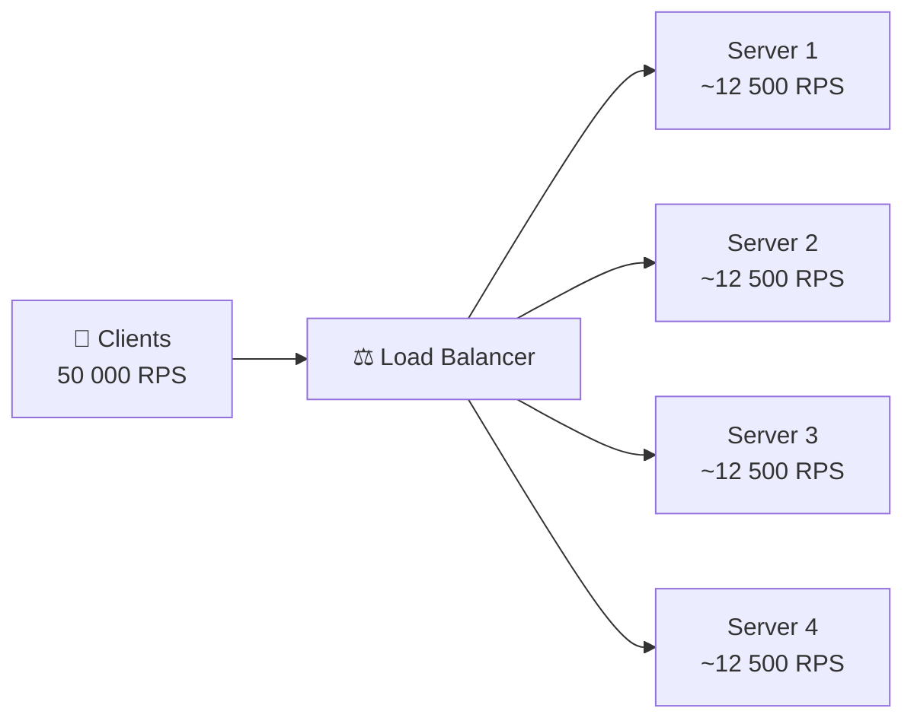
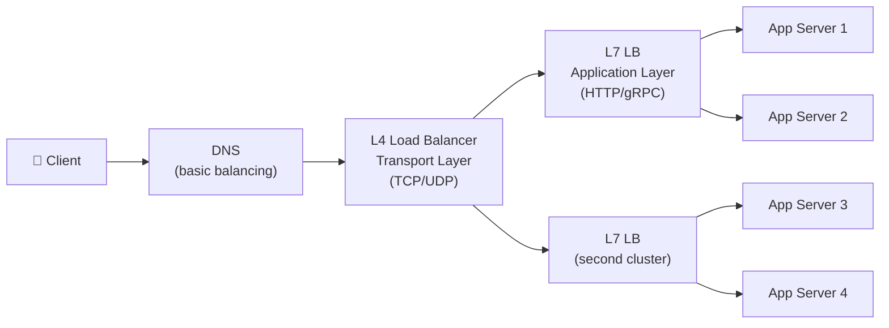
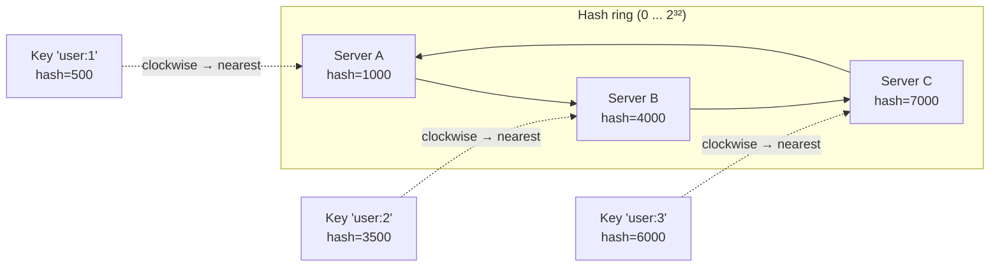
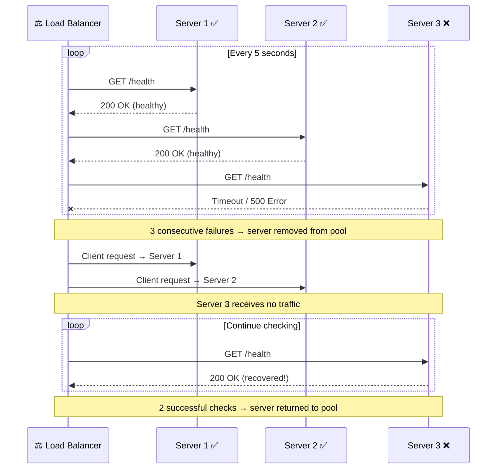

# 🔥 Level 2: Load Balancing

## 🎯 Why Do You Need a Load Balancer?

You have 10 servers and 50,000 requests per second. Who decides which server handles a specific request? Without a load balancer, the first server will choke while the rest sit idle.

Imagine a restaurant with 10 tables and one entrance. Without a host, all guests crowd the first table near the door. **A load balancer is the host** that evenly seats guests, considering table availability and preferences.



## 🔥 L4 vs L7: Two Load Balancing Levels

Load balancers operate at different levels of the OSI network model. The two most important — **L4 (transport)** and **L7 (application)**.



### L4 — Transport Layer (TCP/UDP)

An L4 load balancer sees only **IP addresses and ports**. It doesn't know what's inside the packet — HTTP, WebSocket, or gRPC. It simply forwards the TCP connection as a whole.

```
Client: 192.168.1.1:54321
         │
         ▼
   L4 Load Balancer (10.0.0.1:80)
   Sees: src=192.168.1.1:54321, dst=10.0.0.1:80
   Decides: → send to 10.0.0.10:80
         │
         ▼
   Server: 10.0.0.10:80
```

**Pros:** extremely fast (millions of packets/sec), simple, cheap.
**Cons:** cannot route by URL, headers, cookies.

Examples: **AWS NLB**, **HAProxy in TCP mode**, **IPVS** (Linux kernel).

### L7 — Application Layer (HTTP/HTTPS)

An L7 load balancer **parses the HTTP request**: sees URL, headers, cookies, request body. Can make smart routing decisions.

```
Client: GET /api/users HTTP/1.1
        Host: myapp.com
        Cookie: session=abc123
         │
         ▼
   L7 Load Balancer
   Sees: URL=/api/users, Host=myapp.com, Cookie=abc123
   Decides:
     /api/*     → API Server Pool
     /static/*  → CDN / Static Server Pool
     /ws/*      → WebSocket Server Pool
         │
         ▼
   API Server Pool (backend)
```

**Pros:** smart routing, SSL termination, compression, caching.
**Cons:** slower than L4, more complex, more expensive.

Examples: **Nginx**, **AWS ALB**, **Envoy**, **Traefik**.

### L4 vs L7 Comparison

| Criterion | L4 (Transport) | L7 (Application) |
|---|---|---|
| Sees | IP + port | URL, headers, cookies |
| Speed | Very fast (~10M pps) | Slower (~1M rps) |
| SSL termination | No (passthrough) | Yes |
| URL-based routing | No | Yes |
| WebSocket | Passthrough | Can inspect |
| Cost | Low | Higher |
| When to use | TCP services, high PPS, before L7 | HTTP APIs, microservices, content-based routing |

💡 **In practice**, both are often used: L4 at the entry (fast TCP handling), L7 behind it (smart HTTP routing).

### Example: Nginx as L7 Load Balancer

```nginx
upstream api_servers {
    # Weighted round-robin
    server 10.0.0.1:8080 weight=3;   # Powerful server — 3x traffic
    server 10.0.0.2:8080 weight=1;   # Weaker server — 1x traffic
    server 10.0.0.3:8080 weight=1;
    server 10.0.0.4:8080 backup;     # Only when others are down
}

upstream websocket_servers {
    # IP hash — sticky sessions for WebSocket
    ip_hash;
    server 10.0.0.10:8080;
    server 10.0.0.11:8080;
}

server {
    listen 80;

    # API traffic → api_servers
    location /api/ {
        proxy_pass http://api_servers;
        proxy_set_header X-Real-IP $remote_addr;
    }

    # WebSocket traffic → websocket_servers
    location /ws/ {
        proxy_pass http://websocket_servers;
        proxy_http_version 1.1;
        proxy_set_header Upgrade $http_upgrade;
        proxy_set_header Connection "upgrade";
    }

    # Static files → CDN / local cache
    location /static/ {
        root /var/www;
        expires 30d;
    }
}
```

## 🔥 Load Balancing Algorithms

The key question: **which server should handle the next request?** There are several algorithms, each with its own advantages.

### Round Robin

The simplest algorithm: requests are distributed across servers in rotation — 1, 2, 3, 1, 2, 3...

```
Requests:  R1  R2  R3  R4  R5  R6  R7  R8  R9
           │   │   │   │   │   │   │   │   │
Server 1:  R1          R4          R7
Server 2:      R2          R5          R8
Server 3:          R3          R6          R9
```

**Pro:** maximum simplicity.
**Con:** doesn't account for different server capacities or current load.

### Weighted Round Robin

Each server is assigned a weight — how many requests it receives proportionally.

```
Weights: Server 1 = 3, Server 2 = 1, Server 3 = 1
Total: 5 parts

Requests:  R1  R2  R3  R4  R5  R6  R7  R8  R9  R10
           │   │   │   │   │   │   │   │   │   │
Server 1:  R1  R2  R3          R6  R7  R8
Server 2:              R4                      R9
Server 3:                  R5                      R10
```

**When to use:** servers of different capacities (8 CPU vs 2 CPU).

### Least Connections

The request goes to the server with the **minimum number of active connections**. Automatically accounts for the fact that some requests take longer than others.

```
Current connections:
  Server 1: ████████  (8 connections)
  Server 2: ███       (3 connections)  ← new request goes here!
  Server 3: █████     (5 connections)
```

**When to use:** requests with varying processing times (API: 10ms — 5s).

Analogy: at a supermarket, you choose the checkout with the shortest queue.

### IP Hash

A hash of the client's IP address determines the server. The same client **always** hits the same server.

```
hash("192.168.1.1") % 3 = 0 → Server 1
hash("192.168.1.2") % 3 = 2 → Server 3
hash("192.168.1.3") % 3 = 1 → Server 2
hash("192.168.1.1") % 3 = 0 → Server 1  (same client → same server)
```

**When to use:** sticky sessions — when requests from one client must go to one server (e.g., WebSocket, in-memory cart).

**Con:** when adding/removing servers, **all** clients are redistributed.

### Consistent Hashing

Solves the main problem of IP Hash — **minimal redistribution** when the number of servers changes.



**How it works:**
1. Servers and keys are hashed onto the same ring (0...2^32)
2. A key is served by the **nearest server clockwise**
3. When a server is added, only ~1/N keys move (not all!)

```
3 servers:                            Added Server D (hash=5500):
[0...1000] → A                        [0...1000] → A
[1001...4000] → B                     [1001...4000] → B
[4001...7000] → C                     [4001...5500] → D  ← NEW
[7001...9999] → A                     [5501...7000] → C  ← only this part moved
                                      [7001...9999] → A

Redistributed: ~25% of keys (only from C to D)
With hash % N: ~75% of keys redistributed!
```

**Virtual nodes:** each physical server creates 100-200 points on the ring, ensuring even distribution:

```
Without virtual nodes:        With virtual nodes (3 per server):
  A ●                          A₁● A₂● A₃●
  B ●          → uneven        B₁● B₂● B₃●  → even
  C ●                          C₁● C₂● C₃●
```

📌 **Consistent hashing** is used in: **Cassandra**, **DynamoDB**, **Redis Cluster**, **CDN**, **Memcached**.

### Algorithm Comparison

| Algorithm | Complexity | Accounts for load | Sticky | Redistribution |
|---|---|---|---|---|
| Round Robin | O(1) | No | No | N/A |
| Weighted RR | O(1) | Partially (weights) | No | N/A |
| Least Connections | O(log N) | Yes | No | N/A |
| IP Hash | O(1) | No | Yes | ~100% when N changes |
| Consistent Hashing | O(log N) | No | Yes | ~1/N when N changes |

## 🔥 Health Checks: Making Sure a Server Is Alive

The load balancer must send requests only to **healthy** servers. This requires health checks.



### Active Health Checks

The load balancer **itself** periodically polls servers:

```nginx
upstream backend {
    server 10.0.0.1:8080;
    server 10.0.0.2:8080;
    server 10.0.0.3:8080;
}

# Nginx Plus / OpenResty
# Check every 5 seconds, 3 fails → remove, 2 passes → return
health_check interval=5s fails=3 passes=2;
```

```typescript
// Typical health check endpoint
app.get('/health', async (req, res) => {
  try {
    // Check dependencies
    await db.query('SELECT 1')
    await redis.ping()

    res.json({
      status: 'healthy',
      uptime: process.uptime(),
      timestamp: Date.now()
    })
  } catch (error) {
    res.status(503).json({
      status: 'unhealthy',
      error: error.message
    })
  }
})
```

**Pros:** fast failure detection (seconds), independent of traffic.
**Cons:** additional load on servers (N checks × M servers).

### Passive Health Checks

The load balancer tracks **real responses** from servers to clients. If a server returns errors — it's removed from the pool.

```nginx
upstream backend {
    server 10.0.0.1:8080 max_fails=3 fail_timeout=30s;
    server 10.0.0.2:8080 max_fails=3 fail_timeout=30s;
}
# 3 errors in 30 seconds → server removed for 30 seconds
```

**Pros:** no additional endpoint needed, zero overhead.
**Cons:** first clients get errors before the server is removed.

💡 **Best practice:** use **both types** — active for fast detection, passive as additional insurance.

## 📌 Connection Draining (Graceful Shutdown)

When a server needs to be removed from the pool (deployment, maintenance), you can't just cut connections — clients will get errors.

**Connection draining** — the load balancer stops sending **new** requests to the server but waits for **current** ones to complete.

```
Time →
─────────────────────────────────────────────────

Step 1: Signal "drain" to server
  LB:     [new requests → other servers]
  Server: [processing current requests...]

Step 2: Wait (30-60 seconds)
  LB:     [no new requests]
  Server: [finishing last requests...]

Step 3: All requests completed
  LB:     [server removed from pool]
  Server: [safe to shut down]
```

```typescript
// Graceful shutdown in Node.js
process.on('SIGTERM', () => {
  console.log('Received SIGTERM, starting graceful shutdown...')

  // Stop accepting new connections
  server.close(() => {
    console.log('All connections closed, shutting down')
    process.exit(0)
  })

  // Timeout: if not finished in 30 sec — force quit
  setTimeout(() => {
    console.error('Forced shutdown after timeout')
    process.exit(1)
  }, 30_000)
})
```

## 🔥 Sticky Sessions: When You Can't Avoid Them

Sometimes requests from one client **must** hit the same server: WebSocket connections, server-side rendering with state, long polling.

**Implementation methods:**

```nginx
# 1. By IP address
upstream backend {
    ip_hash;
    server 10.0.0.1:8080;
    server 10.0.0.2:8080;
}

# 2. By cookie
upstream backend {
    sticky cookie srv_id expires=1h path=/;
    server 10.0.0.1:8080;
    server 10.0.0.2:8080;
}
```

**Sticky session problems:**
- Server down → all bound clients lose state
- Uneven load — "hot" clients overload one server
- Harder to scale horizontally

📌 **Rule:** sticky sessions are a temporary measure. Strive to make the service **stateless** (state in Redis/DB).

## 🔥 DNS-based Balancing

The simplest level of balancing — **DNS** returns different IP addresses for the same domain.

```
$ dig myapp.com A

myapp.com.  60  IN  A  10.0.0.1
myapp.com.  60  IN  A  10.0.0.2
myapp.com.  60  IN  A  10.0.0.3

(DNS server rotates record order — Round Robin)
```

**Pros:** simple to set up, distributes traffic globally (GeoDNS — nearest data center).
**Cons:** DNS is cached (TTL) — if a server goes down, clients continue hitting it for minutes. No health checks.

💡 **In practice:** DNS balancing + L4/L7 load balancer in each data center.

## 🔥 Reverse Proxy vs Load Balancer

**Reverse proxy** — a server in front of backends. Accepts client requests and forwards them to the backend.

**Load Balancer** — a special case of reverse proxy with multiple backends and a selection algorithm.

```
Reverse Proxy (1 backend):       Load Balancer (N backends):
Client → Nginx → Backend         Client → Nginx → Backend 1
                                                → Backend 2
                                                → Backend 3
```

A reverse proxy can additionally: SSL termination, caching, compression (gzip/brotli), rate limiting, DDoS protection.

## 🔥 Advanced Patterns

### Blue-Green Deployment via LB

Two identical environments: Blue (current) and Green (new version). The load balancer switches traffic instantly.

```
Before deployment:              After deployment:
LB → [Blue v1.0] ← 100%        LB → [Blue v1.0] ← 0%
     [Green idle]                    [Green v2.0] ← 100%
```

### Canary Deployment via Weighted Routing

The new version gets a small share of traffic (1-5%). If all is well — gradually increase.

```nginx
upstream backend {
    server 10.0.0.1:8080 weight=95;   # v1.0 — 95% of traffic
    server 10.0.0.2:8080 weight=5;    # v2.0 — 5% of traffic (canary)
}
```

## ⚠️ Common Beginner Mistakes

### 🐛 1. Single Load Balancer = Single Point of Failure

```
❌ Architecture:
   Client → [LB] → Servers
             ↑
     If LB goes down = everything goes down!
```

> **Why this is a mistake:** the load balancer must be fault-tolerant. A single LB is a SPOF (Single Point of Failure).

```
✅ Two LBs in Active-Passive or Active-Active:
   Client → DNS → [LB Active]  → Servers
                  [LB Passive] (standby, ready to take over)

   Use: Keepalived + Virtual IP, AWS ELB (managed), Anycast
```

### 🐛 2. Health Checks Not Configured

```
❌ upstream backend {
    server 10.0.0.1:8080;
    server 10.0.0.2:8080;
    # No health checks — traffic goes to dead servers!
}
```

> **Why this is a mistake:** without health checks, the load balancer will send requests to downed servers. Clients will get errors or timeouts.

```
✅ upstream backend {
    server 10.0.0.1:8080 max_fails=3 fail_timeout=30s;
    server 10.0.0.2:8080 max_fails=3 fail_timeout=30s;
}
# + active health checks for fast detection
```

### 🐛 3. Health Check Checks the Wrong Thing

```typescript
// ❌ Health check that always returns 200
app.get('/health', (req, res) => {
  res.json({ status: 'ok' })  // Even if DB is down!
})
```

> **Why this is a mistake:** the server may be "alive" (process running) but "unhealthy" (DB unavailable, disk full). The health check must verify real readiness to serve requests.

```typescript
// ✅ Health check that verifies dependencies
app.get('/health', async (req, res) => {
  const checks = {
    database: false,
    redis: false,
    diskSpace: false
  }

  try { await db.query('SELECT 1'); checks.database = true } catch {}
  try { await redis.ping(); checks.redis = true } catch {}
  try {
    const free = await checkDiskSpace()
    checks.diskSpace = free > 1_000_000_000 // > 1 GB
  } catch {}

  const healthy = Object.values(checks).every(Boolean)
  res.status(healthy ? 200 : 503).json({ status: healthy ? 'healthy' : 'degraded', checks })
})
```

### 🐛 4. Consistent Hashing Without Virtual Nodes

```
❌ 3 servers on the ring without virtual nodes:
   Distribution: Server A = 60%, Server B = 10%, Server C = 30%
   (extremely uneven!)
```

> **Why this is a mistake:** with few points on the ring, distribution will be uneven. Virtual nodes (100-200 per server) solve this problem.

```
✅ 3 servers × 150 virtual nodes = 450 points on the ring
   Distribution: Server A ≈ 34%, Server B ≈ 33%, Server C ≈ 33%
```

## 📌 Key Takeaways

- ✅ **L4 load balancer** operates at TCP/UDP level — fast, but doesn't see HTTP
- ✅ **L7 load balancer** parses HTTP — smart routing by URL, headers, cookies
- ✅ **Round Robin** — simple, but doesn't account for load
- ✅ **Weighted Round Robin** — for servers of different capacities
- ✅ **Least Connections** — best choice when request processing times vary
- ✅ **Consistent Hashing** — minimal redistribution when server count changes
- ✅ **Health Checks** — active (periodic polling) + passive (error tracking)
- ✅ **Connection Draining** — graceful shutdown without losing requests
- 📌 Sticky sessions — a temporary measure, strive for stateless
- 📌 DNS balancing complements but doesn't replace L4/L7
- 📌 The load balancer itself must not be a SPOF — use Active-Passive or managed LB
