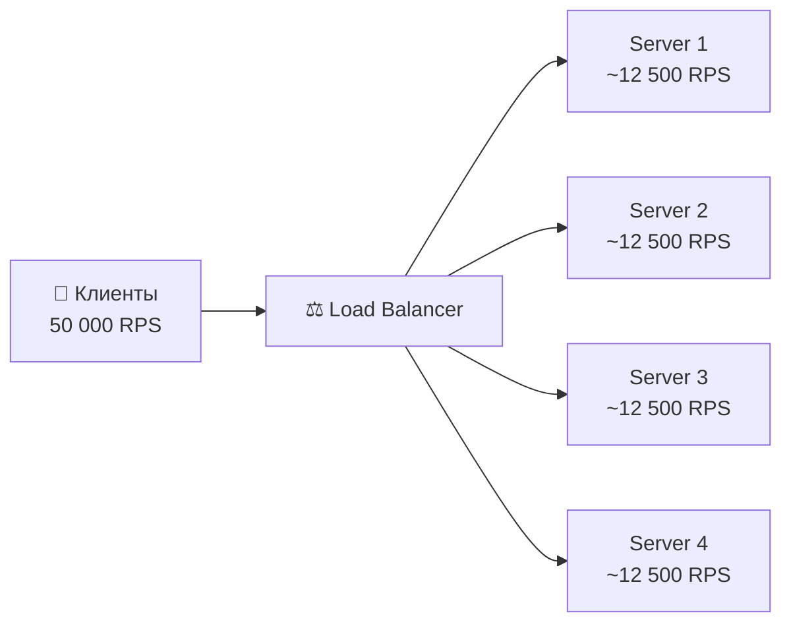
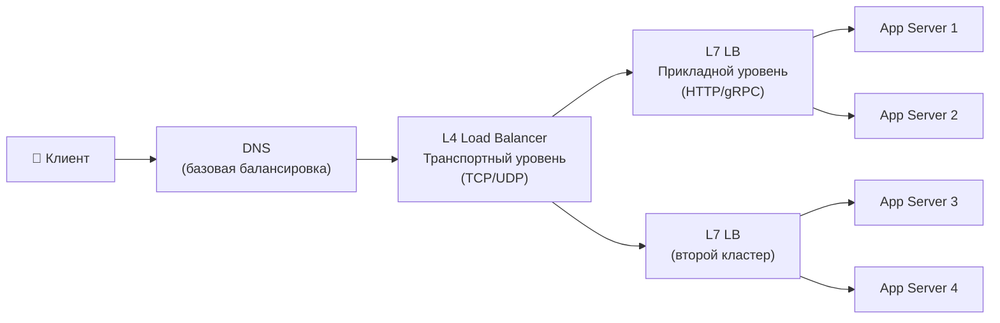
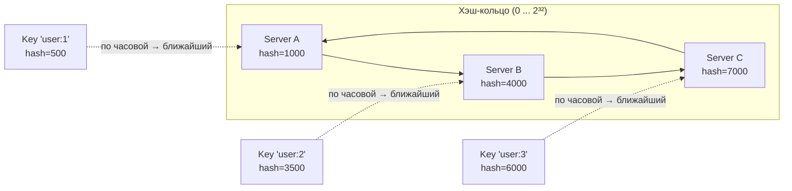
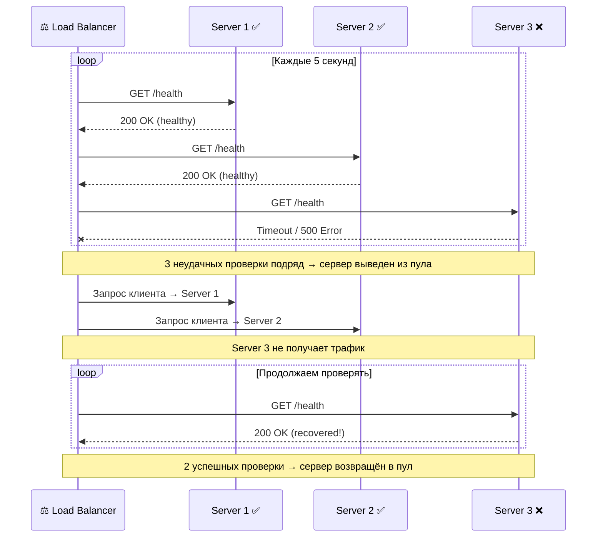

# 🔥 Уровень 2: Балансировка нагрузки

## 🎯 Зачем нужен балансировщик?

У вас 10 серверов, 50 000 запросов в секунду. Кто решает, какой сервер обработает конкретный запрос? Без балансировщика первый сервер захлебнётся, а остальные будут простаивать.

Представьте ресторан с 10 столиками и одним входом. Без хостес все гости ломятся за первый столик у входа. **Балансировщик — это хостес**, который равномерно рассаживает гостей, учитывая загруженность столиков и предпочтения.



## 🔥 L4 vs L7: два уровня балансировки

Балансировщики работают на разных уровнях сетевой модели OSI. Два самых важных — **L4 (транспортный)** и **L7 (прикладной)**.



### L4 — транспортный уровень (TCP/UDP)

L4-балансировщик видит только **IP-адреса и порты**. Он не знает, что внутри пакета — HTTP, WebSocket или gRPC. Просто перенаправляет TCP-соединение целиком.

```
Клиент: 192.168.1.1:54321
         │
         ▼
   L4 Load Balancer (10.0.0.1:80)
   Видит: src=192.168.1.1:54321, dst=10.0.0.1:80
   Решает: → отправить на 10.0.0.10:80
         │
         ▼
   Server: 10.0.0.10:80
```

**Плюсы:** сверхбыстрый (миллионы пакетов/сек), простой, дешёвый.
**Минусы:** не может маршрутизировать по URL, заголовкам, cookies.

Пример: **AWS NLB**, **HAProxy в режиме TCP**, **IPVS** (ядро Linux).

### L7 — прикладной уровень (HTTP/HTTPS)

L7-балансировщик **разбирает HTTP-запрос**: видит URL, заголовки, cookies, тело запроса. Может принимать умные решения о маршрутизации.

```
Клиент: GET /api/users HTTP/1.1
        Host: myapp.com
        Cookie: session=abc123
         │
         ▼
   L7 Load Balancer
   Видит: URL=/api/users, Host=myapp.com, Cookie=abc123
   Решает:
     /api/*     → API Server Pool
     /static/*  → CDN / Static Server Pool
     /ws/*      → WebSocket Server Pool
         │
         ▼
   API Server Pool (backend)
```

**Плюсы:** умная маршрутизация, SSL termination, сжатие, кэширование.
**Минусы:** медленнее L4, сложнее, дороже.

Пример: **Nginx**, **AWS ALB**, **Envoy**, **Traefik**.

### Сравнение L4 и L7

| Критерий | L4 (Transport) | L7 (Application) |
|---|---|---|
| Видит | IP + порт | URL, заголовки, cookies |
| Скорость | Очень быстрый (~10M pps) | Медленнее (~1M rps) |
| SSL termination | Нет (passthrough) | Да |
| Маршрутизация по URL | Нет | Да |
| WebSocket | Passthrough | Может инспектировать |
| Стоимость | Низкая | Выше |
| Когда использовать | TCP-сервисы, высокий PPS, перед L7 | HTTP API, микросервисы, content-based routing |

💡 **На практике** часто используют **оба**: L4 на входе (быстрая обработка TCP), L7 за ним (умная маршрутизация HTTP).

### Пример: Nginx как L7 балансировщик

```nginx
upstream api_servers {
    # Weighted round-robin
    server 10.0.0.1:8080 weight=3;   # Мощный сервер — 3x трафика
    server 10.0.0.2:8080 weight=1;   # Слабый сервер — 1x трафика
    server 10.0.0.3:8080 weight=1;
    server 10.0.0.4:8080 backup;     # Только при падении остальных
}

upstream websocket_servers {
    # IP hash — sticky sessions для WebSocket
    ip_hash;
    server 10.0.0.10:8080;
    server 10.0.0.11:8080;
}

server {
    listen 80;

    # API трафик → api_servers
    location /api/ {
        proxy_pass http://api_servers;
        proxy_set_header X-Real-IP $remote_addr;
    }

    # WebSocket трафик → websocket_servers
    location /ws/ {
        proxy_pass http://websocket_servers;
        proxy_http_version 1.1;
        proxy_set_header Upgrade $http_upgrade;
        proxy_set_header Connection "upgrade";
    }

    # Статика → CDN / локальный кэш
    location /static/ {
        root /var/www;
        expires 30d;
    }
}
```

## 🔥 Алгоритмы балансировки

Главный вопрос: **какому серверу отдать следующий запрос?** Существует несколько алгоритмов, каждый со своими преимуществами.

### Round Robin (круговой)

Простейший алгоритм: запросы распределяются по серверам по очереди — 1, 2, 3, 1, 2, 3...

```
Запросы:   R1  R2  R3  R4  R5  R6  R7  R8  R9
           │   │   │   │   │   │   │   │   │
Server 1:  R1          R4          R7
Server 2:      R2          R5          R8
Server 3:          R3          R6          R9
```

**Плюс:** максимальная простота.
**Минус:** не учитывает разную мощность серверов и текущую нагрузку.

### Weighted Round Robin (взвешенный)

Каждому серверу назначается вес — сколько запросов он получает пропорционально.

```
Веса: Server 1 = 3, Server 2 = 1, Server 3 = 1
Всего: 5 частей

Запросы:   R1  R2  R3  R4  R5  R6  R7  R8  R9  R10
           │   │   │   │   │   │   │   │   │   │
Server 1:  R1  R2  R3          R6  R7  R8
Server 2:              R4                      R9
Server 3:                  R5                      R10
```

**Когда использовать:** серверы разной мощности (8 CPU vs 2 CPU).

### Least Connections (наименьшее число соединений)

Запрос идёт на сервер с **минимальным количеством активных соединений**. Автоматически учитывает, что одни запросы обрабатываются дольше других.

```
Текущие соединения:
  Server 1: ████████  (8 connections)
  Server 2: ███       (3 connections)  ← новый запрос сюда!
  Server 3: █████     (5 connections)
```

**Когда использовать:** запросы с разным временем обработки (API: 10мс — 5с).

Аналогия: вы в супермаркете выбираете кассу с самой короткой очередью.

### IP Hash

Хэш IP-адреса клиента определяет сервер. Один и тот же клиент **всегда** попадает на один сервер.

```
hash("192.168.1.1") % 3 = 0 → Server 1
hash("192.168.1.2") % 3 = 2 → Server 3
hash("192.168.1.3") % 3 = 1 → Server 2
hash("192.168.1.1") % 3 = 0 → Server 1  (тот же клиент → тот же сервер)
```

**Когда использовать:** sticky sessions — когда нужно, чтобы запросы одного клиента шли на один сервер (например, WebSocket, корзина в памяти).

**Минус:** при добавлении/удалении серверов **все** клиенты перераспределяются.

### Consistent Hashing (консистентное хэширование)

Решает главную проблему IP Hash — **минимальное перераспределение** при изменении числа серверов.



**Как работает:**
1. Серверы и ключи хэшируются на одно кольцо (0...2^32)
2. Ключ обслуживается **ближайшим сервером по часовой стрелке**
3. При добавлении сервера перемещается только ~1/N ключей (а не все!)

```
Было 3 сервера:                    Добавили Server D (hash=5500):
[0...1000] → A                     [0...1000] → A
[1001...4000] → B                  [1001...4000] → B
[4001...7000] → C                  [4001...5500] → D  ← НОВЫЙ
[7001...9999] → A                  [5501...7000] → C  ← только эта часть переехала
                                   [7001...9999] → A

Перераспределено: ~25% ключей (только от C к D)
При обычном hash % N: перераспределено ~75% ключей!
```

**Virtual nodes (виртуальные узлы):** каждый физический сервер создаёт 100-200 точек на кольце, что обеспечивает равномерное распределение:

```
Без virtual nodes:           С virtual nodes (по 3 на сервер):
  A ●                          A₁● A₂● A₃●
  B ●          → неравномерно  B₁● B₂● B₃●  → равномерно
  C ●                          C₁● C₂● C₃●
```

📌 **Consistent hashing** используется в: **Cassandra**, **DynamoDB**, **Redis Cluster**, **CDN**, **Memcached**.

### Сравнение алгоритмов

| Алгоритм | Сложность | Учитывает нагрузку | Sticky | Перераспределение |
|---|---|---|---|---|
| Round Robin | O(1) | Нет | Нет | N/A |
| Weighted RR | O(1) | Частично (веса) | Нет | N/A |
| Least Connections | O(log N) | Да | Нет | N/A |
| IP Hash | O(1) | Нет | Да | ~100% при изменении N |
| Consistent Hashing | O(log N) | Нет | Да | ~1/N при изменении |

## 🔥 Health Checks: как убедиться, что сервер жив

Балансировщик должен отправлять запросы только на **здоровые** серверы. Для этого нужны health checks.



### Active Health Checks

Балансировщик **сам** периодически опрашивает серверы:

```nginx
upstream backend {
    server 10.0.0.1:8080;
    server 10.0.0.2:8080;
    server 10.0.0.3:8080;
}

# Nginx Plus / OpenResty
# Проверка каждые 5 секунд, 3 fail → вывести, 2 pass → вернуть
health_check interval=5s fails=3 passes=2;
```

```typescript
// Типичный health check endpoint
app.get('/health', async (req, res) => {
  try {
    // Проверяем зависимости
    await db.query('SELECT 1')
    await redis.ping()

    res.json({
      status: 'healthy',
      uptime: process.uptime(),
      timestamp: Date.now()
    })
  } catch (error) {
    res.status(503).json({
      status: 'unhealthy',
      error: error.message
    })
  }
})
```

**Плюсы:** быстрое обнаружение сбоя (секунды), не зависит от трафика.
**Минусы:** дополнительная нагрузка на серверы (N проверок × M серверов).

### Passive Health Checks

Балансировщик отслеживает **реальные ответы** серверов клиентам. Если сервер отвечает ошибками — выводит из пула.

```nginx
upstream backend {
    server 10.0.0.1:8080 max_fails=3 fail_timeout=30s;
    server 10.0.0.2:8080 max_fails=3 fail_timeout=30s;
}
# 3 ошибки за 30 секунд → сервер выведен на 30 секунд
```

**Плюсы:** не нужен дополнительный endpoint, нулевой overhead.
**Минусы:** первые клиенты получат ошибки, прежде чем сервер будет выведен.

💡 **Best practice:** используйте **оба типа** — active для быстрого обнаружения, passive как дополнительную страховку.

## 📌 Connection Draining (Graceful Shutdown)

Когда сервер нужно вывести из пула (деплой, обслуживание), нельзя просто обрубать соединения — клиенты получат ошибки.

**Connection draining** — балансировщик перестаёт отправлять **новые** запросы на сервер, но ждёт завершения **текущих**.

```
Время →
─────────────────────────────────────────────────

Шаг 1: Сигнал "drain" серверу
  LB:     [новые запросы → другие серверы]
  Server: [обрабатывает текущие запросы...]

Шаг 2: Ожидание (30-60 секунд)
  LB:     [новых запросов нет]
  Server: [завершает последние запросы...]

Шаг 3: Все запросы завершены
  LB:     [сервер выведен из пула]
  Server: [можно безопасно остановить]
```

```typescript
// Graceful shutdown в Node.js
process.on('SIGTERM', () => {
  console.log('Received SIGTERM, starting graceful shutdown...')

  // Перестаём принимать новые соединения
  server.close(() => {
    console.log('All connections closed, shutting down')
    process.exit(0)
  })

  // Таймаут: если за 30 сек не завершились — принудительно
  setTimeout(() => {
    console.error('Forced shutdown after timeout')
    process.exit(1)
  }, 30_000)
})
```

## 🔥 Sticky Sessions: когда без них не обойтись

Иногда запросы одного клиента **обязаны** попадать на один сервер: WebSocket-соединения, серверный рендеринг с состоянием, long polling.

**Способы реализации:**

```nginx
# 1. По IP-адресу
upstream backend {
    ip_hash;
    server 10.0.0.1:8080;
    server 10.0.0.2:8080;
}

# 2. По cookie
upstream backend {
    sticky cookie srv_id expires=1h path=/;
    server 10.0.0.1:8080;
    server 10.0.0.2:8080;
}
```

**Проблемы sticky sessions:**
- Сервер упал → все привязанные клиенты теряют состояние
- Неравномерная нагрузка — «горячий» клиент перегружает один сервер
- Сложнее горизонтальное масштабирование

📌 **Правило:** sticky sessions — временная мера. Стремитесь сделать сервис **stateless** (состояние в Redis/БД).

## 🔥 DNS-based балансировка

Самый простой уровень балансировки — **DNS** возвращает разные IP-адреса для одного домена.

```
$ dig myapp.com A

myapp.com.  60  IN  A  10.0.0.1
myapp.com.  60  IN  A  10.0.0.2
myapp.com.  60  IN  A  10.0.0.3

(DNS-сервер ротирует порядок записей — Round Robin)
```

**Плюсы:** просто настроить, распределяет трафик глобально (GeoDNS — ближайший дата-центр).
**Минусы:** DNS кэшируется (TTL) — при падении сервера клиенты продолжат ходить на него минутами. Нет health checks.

💡 **На практике:** DNS-балансировка + L4/L7 балансировщик в каждом дата-центре.

## 🔥 Reverse Proxy vs Load Balancer

**Reverse proxy** — сервер, стоящий перед бэкендами. Принимает запросы клиентов и передаёт их бэкенду.

**Load Balancer** — частный случай reverse proxy с несколькими бэкендами и алгоритмом выбора.

```
Reverse Proxy (1 backend):     Load Balancer (N backends):
Client → Nginx → Backend       Client → Nginx → Backend 1
                                              → Backend 2
                                              → Backend 3
```

Reverse proxy может дополнительно: SSL termination, кэширование, сжатие (gzip/brotli), rate limiting, защита от DDoS.

## 🔥 Продвинутые паттерны

### Blue-Green Deployment через LB

Два идентичных окружения: Blue (текущее) и Green (новая версия). Балансировщик переключает трафик мгновенно.

```
До деплоя:                       После деплоя:
LB → [Blue v1.0] ← 100%         LB → [Blue v1.0] ← 0%
     [Green idle]                     [Green v2.0] ← 100%
```

### Canary Deployment через Weighted Routing

Новая версия получает малую долю трафика (1-5%). Если всё ок — постепенно увеличиваем.

```nginx
upstream backend {
    server 10.0.0.1:8080 weight=95;   # v1.0 — 95% трафика
    server 10.0.0.2:8080 weight=5;    # v2.0 — 5% трафика (canary)
}
```

## ⚠️ Частые ошибки новичков

### 🐛 1. Один балансировщик = единая точка отказа

```
❌ Архитектура:
   Client → [LB] → Servers
             ↑
     Если LB упадёт = всё упадёт!
```

> **Почему это ошибка:** балансировщик должен быть отказоустойчивым. Один LB — это SPOF (Single Point of Failure).

```
✅ Два LB в Active-Passive или Active-Active:
   Client → DNS → [LB Active]  → Servers
                  [LB Passive] (standby, готов перехватить)

   Используйте: Keepalived + Virtual IP, AWS ELB (managed), Anycast
```

### 🐛 2. Не настроены health checks

```
❌ upstream backend {
    server 10.0.0.1:8080;
    server 10.0.0.2:8080;
    # Нет health checks — трафик идёт на мёртвый сервер!
}
```

> **Почему это ошибка:** без health checks балансировщик будет отправлять запросы на упавшие серверы. Клиенты получат ошибки или таймауты.

```
✅ upstream backend {
    server 10.0.0.1:8080 max_fails=3 fail_timeout=30s;
    server 10.0.0.2:8080 max_fails=3 fail_timeout=30s;
}
# + active health checks для быстрого обнаружения
```

### 🐛 3. Health check проверяет не то

```typescript
// ❌ Health check, который всегда отвечает 200
app.get('/health', (req, res) => {
  res.json({ status: 'ok' })  // Даже если БД недоступна!
})
```

> **Почему это ошибка:** сервер может быть «жив» (процесс работает), но «не здоров» (БД недоступна, диск заполнен). Health check должен проверять реальную готовность обслуживать запросы.

```typescript
// ✅ Health check, который проверяет зависимости
app.get('/health', async (req, res) => {
  const checks = {
    database: false,
    redis: false,
    diskSpace: false
  }

  try { await db.query('SELECT 1'); checks.database = true } catch {}
  try { await redis.ping(); checks.redis = true } catch {}
  try {
    const free = await checkDiskSpace()
    checks.diskSpace = free > 1_000_000_000 // > 1 GB
  } catch {}

  const healthy = Object.values(checks).every(Boolean)
  res.status(healthy ? 200 : 503).json({ status: healthy ? 'healthy' : 'degraded', checks })
})
```

### 🐛 4. Consistent Hashing без virtual nodes

```
❌ 3 сервера на кольце без virtual nodes:
   Распределение: Server A = 60%, Server B = 10%, Server C = 30%
   (крайне неравномерно!)
```

> **Почему это ошибка:** с малым числом точек на кольце распределение будет неравномерным. Virtual nodes (100-200 на сервер) решают эту проблему.

```
✅ 3 сервера × 150 virtual nodes = 450 точек на кольце
   Распределение: Server A ≈ 34%, Server B ≈ 33%, Server C ≈ 33%
```

## 📌 Итоги

- ✅ **L4 балансировщик** работает на уровне TCP/UDP — быстрый, но не видит HTTP
- ✅ **L7 балансировщик** разбирает HTTP — умная маршрутизация по URL, заголовкам, cookies
- ✅ **Round Robin** — простой, но не учитывает нагрузку
- ✅ **Weighted Round Robin** — для серверов разной мощности
- ✅ **Least Connections** — лучший выбор при разном времени обработки запросов
- ✅ **Consistent Hashing** — минимальное перераспределение при изменении числа серверов
- ✅ **Health Checks** — active (периодический опрос) + passive (отслеживание ошибок)
- ✅ **Connection Draining** — graceful shutdown без потери запросов
- 📌 Sticky sessions — временная мера, стремитесь к stateless
- 📌 DNS-балансировка дополняет, но не заменяет L4/L7
- 📌 Балансировщик сам не должен быть SPOF — используйте Active-Passive или managed LB
