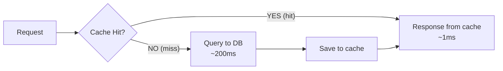
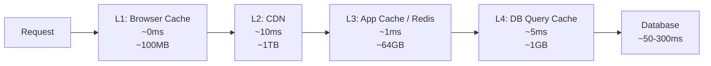
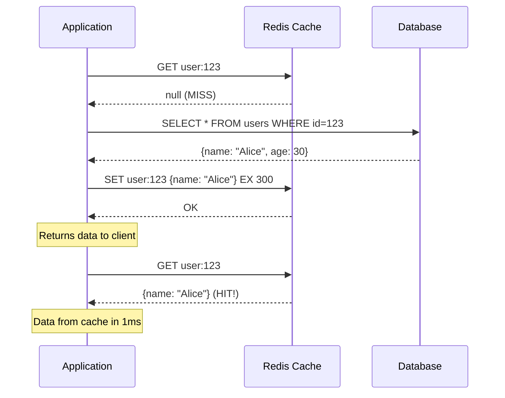
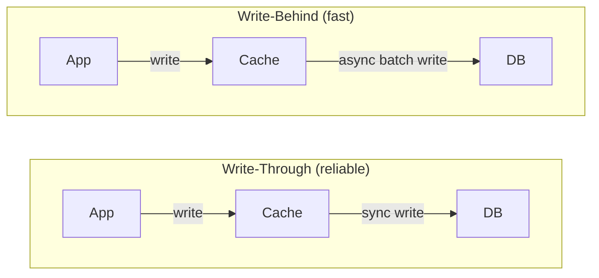
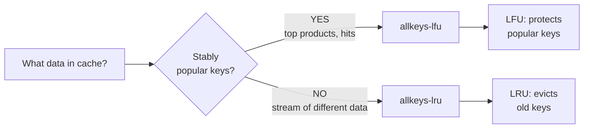
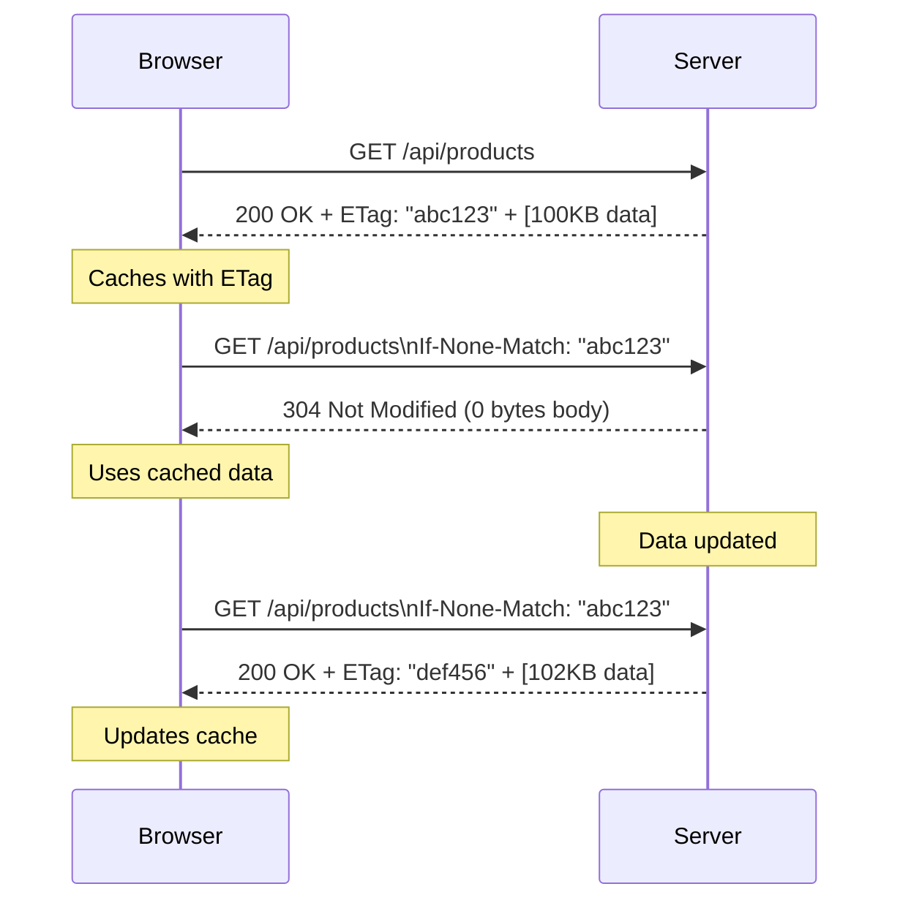
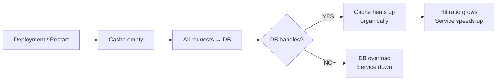

# Level 3: Caching -- Strategies, Invalidation, and Pitfalls

## Introduction

Imagine a library. To find a book, the librarian goes to the storage, flips through catalogs, climbs to the third floor -- it takes 10 minutes. But if the book is asked for every hour, a smart librarian places it right on the desk: the next request takes 5 seconds. When the book is returned with new annotations, they take a fresh copy -- throw away the old one. That's what a cache is: **a copy of frequently needed stuff, kept where it's quick to reach**.

In server-side development, the "storage" is a database (50-300ms per query), and the "librarian's desk" is Redis in RAM (0.5-2ms). The difference is 100-600x. When your service handles 100,000 requests per second, this difference becomes a matter of survival.

Caching is one of the few techniques that gives immediate and measurable results: lower latency, DB offloading, reduced infrastructure costs. But behind this result lie three complexities: **when to cache**, **how long to store**, and **what to do when data changes**. That's what this level is about.

At this level we will cover in detail:

1. **Why caching is needed and what hit ratio is** -- the metric used to evaluate caching effectiveness
2. **Multi-level cache** -- Browser, CDN, Redis, DB -- each layer solves its own task
3. **Caching patterns** -- Cache-Aside, Read-Through, Write-Through, Write-Behind
4. **Invalidation strategies** -- TTL, event-based, versioned keys
5. **Eviction Policies** -- what Redis removes when memory runs out
6. **Three disasters** -- Cache Stampede, Cache Penetration, Cache Avalanche
7. **HTTP caching and CDN** -- Cache-Control, ETag, conditional requests
8. **Redis vs Memcached** -- when to choose which
9. **Cache Warming** -- preheating cache after deployment

---

## 1. Why Caching?

### The Problem Caching Solves

A modern database processes a query in 50-300 milliseconds. That sounds fast -- until you count the load. With 100,000 simultaneous users, each opening the main page, you generate 100,000 identical SQL queries. All of them read the same data. The DB spends CPU resources parsing queries, I/O resources reading from disk, and network resources transferring results -- and all of this for the same answer.

A cache breaks this cycle: one query goes to the DB, the result is saved in memory, the next 99,999 queries get the answer from memory in 1ms.

```
Without cache:                    With cache:
100,000 requests → 100,000 SQL    100,000 requests → 1 SQL + 99,999 from cache
Latency: ~300ms                   Latency: ~1ms (99.999%)
DB load: 100%                     DB load: ~0.001%
```

### Cache Hit Ratio -- The Key Metric

**Cache hit ratio** = hits / (hits + misses).

This is the only metric that honestly shows how effective your cache is.

- **Hit ratio > 95%** -- cache works well
- **Hit ratio 80-95%** -- acceptable, but room for improvement
- **Hit ratio < 80%** -- cache wastes memory but barely saves time; worth reconsidering the strategy

Imagine a cache that takes 10GB of RAM but has a hit ratio of 40%. This means 60% of requests still go to the DB -- and you pay for memory without getting real savings. A low hit ratio means you're caching "cold" data (rarely requested) or your keys are too specific (e.g., include filters making each key unique).



### What to Cache and What Not

Not all data is equally useful to cache. Good candidates for caching:

- **Frequently read, rarely written** -- product catalog, directories, user profiles
- **Expensive to compute** -- aggregations, JOINs on large tables, complex calculations
- **Same for many users** -- main page, top products, public content

Bad candidates:

- **Frequently updated** -- account balance, live courier position (cache immediately becomes stale)
- **Unique per request** -- reports with arbitrary filters
- **Requested once a day** -- takes up memory, hit ratio near zero

---

## 2. Multi-Level Cache

### The Hierarchy Idea

Cache is not a single layer, but an entire hierarchy, where each level differs in speed, capacity, and cost. A request passes through layers top to bottom: if data is missing at the current level (cache miss), the request goes lower. When data is found -- it's returned upward and can be cached at intermediate levels.

Analogy: computer memory. L1 processor cache -- tiny (512KB), but incredibly fast (0.5ns). L2 -- larger (4MB), slightly slower. RAM -- huge (16GB), but 100x slower than L1. SSD -- terabytes, but 10,000x slower than L1. Each level exists because it's cheaper and larger than the previous, though slower.



### Caching Levels in Practice

| Level | What's Cached | TTL | Size | Latency |
|---|---|---|---|---|
| Browser Cache | Static files (JS, CSS, images) | Hours -- days | ~100MB | 0ms |
| CDN | Static files + API responses | Minutes -- hours | Terabytes | 10-50ms |
| Application (Redis) | Sessions, query results | Seconds -- minutes | Gigabytes | 0.5-2ms |
| DB Query Cache | SQL results | Auto-invalidation | ~1GB | 5-10ms |

### Why One Level Isn't Enough

You might ask, why have Browser Cache if there's Redis? It's about network time: even if Redis responds in 1ms, the browser spends 20-100ms on the HTTP request to your server. Browser cache works without the network at all -- 0ms. Similarly, CDN responds from the data center closest to the user, while your Redis lives in one region.

Each level fills its own niche. Removing any of them means losing part of the efficiency.

---

## 3. Caching Patterns

### Cache-Aside (Lazy Loading) -- Most Popular

**Idea:** the application manages the cache itself. On read -- checks the cache, on miss goes to the DB and writes the result to the cache. On write -- updates the DB and invalidates the cache.

**Why "lazy"?** Data enters the cache only when someone requests it. If a user opens a product page -- that product gets cached. Thousands of products nobody looked at don't take up memory.



```typescript
async function getUser(id: string) {
  // Step 1: check cache
  const cached = await redis.get(`user:${id}`)
  if (cached) return JSON.parse(cached) // Cache HIT -- return immediately

  // Step 2: cache MISS -- go to DB
  const user = await db.query('SELECT * FROM users WHERE id = $1', [id])

  // Step 3: save to cache for 5 minutes
  await redis.set(`user:${id}`, JSON.stringify(user), 'EX', 300)

  return user
}
```

After the code, several important details are worth noting:

- The key `user:${id}` is a **namespace + identifier**. The namespace helps group keys and avoid collisions between different data types.
- `JSON.stringify` / `JSON.parse` -- Redis stores strings, objects need to be serialized. In production, `msgpack` is often used for more compact representation.
- `EX 300` -- TTL in seconds. Without TTL the key lives forever, and the cache gradually fills with stale data.

**Pros:** simple implementation, only what's actually requested gets cached, resilience to Redis failures (when cache is unavailable, the application goes to the DB).

**Cons:** first request always slow (cold start), data may become stale until TTL expires.

### Read-Through -- Cache as Read Proxy

**Idea:** the application talks only to the cache. If the cache doesn't know the data -- it goes to the DB itself, loads it, and returns it through itself. The application doesn't know about the DB directly.

```
Cache-Aside:                    Read-Through:
App → Cache (miss)              App → Cache (miss)
App → DB                              Cache → DB
App → Cache (write)                   Cache ← DB (auto-fill)
App ← data                     App ← data from cache
```

The difference is significant: in Cache-Aside, the application itself decides what to write to the cache and when. In Read-Through, this logic is encapsulated in the cache layer. This simplifies application code -- you always work with one interface -- but requires support from the caching library (NCache, Hazelcast, some ORMs).

Redis doesn't support Read-Through out of the box -- it needs to be implemented manually through a wrapper or using specialized solutions.

### Write-Through -- Synchronous Write to Cache and DB

**Idea:** the write goes simultaneously to the cache and the DB. The cache is always current.

```typescript
async function updateUser(id: string, data: UserData) {
  // Write to DB
  await db.query('UPDATE users SET name=$1 WHERE id=$2', [data.name, id])

  // Immediately update cache -- data always fresh
  await redis.set(`user:${id}`, JSON.stringify(data), 'EX', 300)
}
```

**Pro:** no lag between DB update and cache update. The next read always gets current data.

**Con:** every write operation becomes double. If data is rarely read -- you're filling the cache for nothing. Write-Through is effective in combination with Read-Through.

### Write-Behind (Write-Back) -- Asynchronous Write

**Idea:** the write goes only to the cache, and to the DB -- asynchronously with a delay (or in batches).



**Why faster:** the user gets confirmation immediately, without waiting for disk write. Writing to memory takes microseconds, writing to DB takes tens of milliseconds.

**Risk:** if the cache goes down before data is written to the DB -- it's lost. Write-Behind is suitable for non-critical data: view counters, analytics, likes. But not for financial transactions or user data.

### Pattern Comparison

| Pattern | Operation | Consistency | Complexity | When to Use |
|---|---|---|---|---|
| Cache-Aside | Read | Eventual | Low | Most cases |
| Read-Through | Read | Eventual | Medium | Unified access interface |
| Write-Through | Write | Strong | Medium | Data freshness is important |
| Write-Behind | Write | Weak | High | High write load |

**In practice**, these are combined: **Cache-Aside for reads** + **Write-Through for writes** -- the most popular and reliable combination. Read lazily, write always current.

---

## 4. Cache Invalidation Strategies

> "There are only two hard things in Computer Science: cache invalidation and naming things." -- Phil Karlton

Invalidation is the process of recognizing cached data as stale and removing or updating it. It's hard for one reason: **the moment of data change and the moment of the next read from the cache are separated in time**. Between them, data in the cache diverges from data in the DB.

### TTL (Time-To-Live) -- The Simplest Approach

Each key is assigned a lifetime. When it expires, Redis automatically removes the key. Simple, reliable, no additional logic.

```bash
# Set key with 5 minute TTL (300 seconds)
SET user:123 '{"name":"Alice"}' EX 300

# Check remaining lifetime
TTL user:123
# → 287 (287 seconds remaining)

# PTTL -- same, but in milliseconds
PTTL user:123
# → 287000
```

TTL is a **compromise between freshness and performance**. Short TTL = data almost always fresh, but many misses and DB queries. Long TTL = high hit ratio, but data may become stale.

**How to choose TTL:**

| Data Type | Recommended TTL | Justification |
|---|---|---|
| Static files (logo, fonts) | 86400-604800s (days -- weeks) | Rarely changes |
| Product catalog | 300-3600s (5min -- 1hr) | Occasionally updated |
| User profile | 60-300s (1-5min) | User may change it |
| Currency rates | 5-30s | Changes constantly |
| Search results | 10-60s | Depends on data update frequency |

### Event-Based Invalidation -- Immediate Removal

When data changes in the DB, the corresponding key is immediately removed from the cache. This gives fresher data than TTL but requires explicit logic on every write.

```typescript
async function updateUser(id: string, data: UserData) {
  // 1. Update DB
  await db.query('UPDATE users SET name=$1 WHERE id=$2', [data.name, id])

  // 2. Invalidate cache -- delete, don't update!
  await redis.del(`user:${id}`)

  // Next read request will pull fresh data from DB
}
```

**Why `DEL`, not `SET`?** This is a fundamental question. When updating (`SET`), another thread may slip between reading from the DB and writing to the cache -- and write a stale version (race condition). When deleting (`DEL`), the next read is guaranteed to get fresh data from the DB. The "delete on write" pattern is simpler and more reliable.

Visualization of the `SET` problem:

```
Thread 1: reads user v1 from DB
Thread 2: updates user → v2, writes v2 to cache
Thread 1: writes v1 to cache  ← overwrites v2! Cache is stale.
```

With `DEL`, this problem doesn't exist: after cache deletion, any thread gets fresh data.

### Versioned Keys -- Version Switching

Instead of deleting the key, change its version. The old key exists, but nobody reads it -- it will expire by TTL on its own.

```typescript
// Reading with versioning
async function getProducts() {
  const version = await redis.get('products:version') ?? 'v1'
  const products = await redis.get(`products:${version}`)

  if (products) return JSON.parse(products)

  const data = await db.query('SELECT * FROM products')
  await redis.set(`products:${version}`, JSON.stringify(data), 'EX', 3600)
  return data
}

// Invalidation -- just increment the version
async function invalidateProducts() {
  await redis.incr('products:version')
  // Old keys products:v1, products:v2 will expire by TTL
  // New requests will start using products:v3
}
```

**When this is useful:** when you need to invalidate a large group of keys simultaneously, without knowing their exact names. For example, the entire product catalog after a price update. Instead of deleting thousands of keys, one `INCR` on the version is enough.

---

## 5. Eviction Policies: What to Remove When the Cache Is Full?

### The Limited Memory Problem

Redis operates in RAM -- a limited and expensive resource. When the cache is full and a new element arrives, Redis has to "evict" someone. The eviction policy determines who exactly.

```redis-conf
# redis.conf -- configure maximum memory and policy
maxmemory 2gb
maxmemory-policy allkeys-lru
```

### Eviction Policies

| Policy | Principle | When to Use |
|---|---|---|
| **noeviction** | Return error on write attempt | Only if data loss is unacceptable |
| **allkeys-lru** | Remove least recently used from all keys | Universal choice for cache |
| **volatile-lru** | LRU only among keys with TTL | Cache + persistent data in one Redis |
| **allkeys-lfu** | Remove least frequently used from all keys | Stable "hot" keys exist |
| **volatile-lfu** | LFU only among keys with TTL | Like volatile-lru, but LFU |
| **allkeys-random** | Remove random from all keys | When all keys are equal |
| **volatile-random** | Random from keys with TTL | Rarely used |
| **volatile-ttl** | Remove key with lowest TTL | Different priorities by lifetime |

**Analogy with a refrigerator:**
- **LRU** -- throw away what you haven't touched in a while (lies in the back)
- **LFU** -- throw away what you rarely eat (buy but don't open)
- **FIFO / volatile-ttl** -- throw away the oldest (by manufacturing date)
- **Random** -- throw away at random (close eyes and pick)

### LRU vs LFU: When to Choose Which



**LRU** (Least Recently Used) is better for streaming data: news, event feeds, sessions. Data is relevant for some time, then becomes stale -- LRU naturally evicts it.

**LFU** (Least Frequently Used) is better when there are "evergreen" hot keys: top 100 products by sales, popular articles. Even if they haven't been requested in the last 10 minutes, LFU will keep them because their total frequency is high.

Redis implements **approximated LRU** -- instead of exact usage order tracking, it takes a random sample of keys and evicts the worst one. This is a compromise between accuracy and memory consumption. Sample size is configurable: `maxmemory-samples 10` (default 5).

### Fine-Tuning LFU

LFU in Redis is controlled by two parameters:

```redis-conf
# How quickly the frequency counter "saturates"
# Lower value = counter saturates faster (suitable for low load)
lfu-log-factor 10

# How quickly past accesses are "forgotten" (in minutes)
# 1 = counter decreases every minute
lfu-decay-time 1
```

---

## 6. Three Cache Problems: Stampede, Penetration, Avalanche

These three phenomena are classic traps that turn cache from an optimization tool into a source of problems. It's important to understand the mechanics of each and know the defenses.

### Cache Stampede (Thundering Herd)

**Problem:** a popular key expires, and thousands of parallel requests simultaneously discover a cache miss and all go to the DB at once.

```
TTL expired for "hot_product:1" (1,000,000 views/min)
    │
    ▼
Thread 1: cache miss → SELECT * FROM products...
Thread 2: cache miss → SELECT * FROM products...  ← SAME REQUEST!
Thread 3: cache miss → SELECT * FROM products...
...
Thread 1000: cache miss → SELECT * FROM products...
    │
    ▼
DB overloaded with 1000 identical requests
```

Analogy: a herd of animals at a watering hole. While there's water -- everything is calm. When the source dries up, the whole herd rushes to the next one at once -- and tramples it.

**Solution 1: Mutex Lock**

Only one thread updates the cache. Others wait.

```typescript
async function getWithLock(key: string, fetchFn: () => Promise<unknown>) {
  // Step 1: check cache
  const cached = await redis.get(key)
  if (cached) return JSON.parse(cached)

  // Step 2: try to acquire lock
  // NX = only if key doesn't exist, EX = lock TTL 10 seconds
  const lockAcquired = await redis.set(`lock:${key}`, '1', 'NX', 'EX', 10)

  if (lockAcquired) {
    try {
      // We acquired the lock -- update cache
      const data = await fetchFn()
      await redis.set(key, JSON.stringify(data), 'EX', 300)
      return data
    } finally {
      await redis.del(`lock:${key}`) // Always release the lock
    }
  } else {
    // Lock held by another thread -- wait and read from cache
    await sleep(50)
    return getWithLock(key, fetchFn) // Recursive retry
  }
}
```

**Solution 2: Early Refresh (XFetch algorithm)**

Update the cache early with a probability depending on the remaining TTL. The less time until expiration -- the higher the probability of early update. This prevents simultaneous stampede by spreading updates over time.

```typescript
async function getWithEarlyRefresh(key: string, fetchFn: () => Promise<unknown>) {
  const { value, ttl } = await redis.getWithTTL(key)

  // If TTL > 30 seconds -- return as is
  if (value && ttl > 30) return JSON.parse(value)

  // TTL < 30 sec -- with growing probability, update early
  // Math.exp(-ttl / 10): at ttl=30 → ~5%, at ttl=5 → ~60%, at ttl=1 → ~90%
  if (value && Math.random() > Math.exp(-ttl / 10)) {
    return JSON.parse(value) // Most threads return current value
  }

  // One "lucky" thread updates cache ahead of time
  const data = await fetchFn()
  await redis.set(key, JSON.stringify(data), 'EX', 300)
  return data
}
```

### Cache Penetration -- Hits Through the Cache

**Problem:** an attacker (or a bug) makes requests for deliberately non-existent keys. The cache always misses, every request reaches the DB.

```
Attacker: GET /user/9999999999 (doesn't exist)
Cache: miss → DB: null → don't cache → next request again to DB!

If attacker makes 10,000 requests/sec with different non-existent IDs:
10,000 requests → 10,000 SQL queries → DB overloaded
```

**Solution 1: cache "not found"**

```typescript
async function getUser(id: string) {
  const cached = await redis.get(`user:${id}`)

  if (cached === 'NULL') return null    // Cached "not found"
  if (cached) return JSON.parse(cached) // Cached data

  const user = await db.query('SELECT * FROM users WHERE id = $1', [id])

  if (!user) {
    // Cache null with short TTL -- prevent repeated cache piercing
    await redis.set(`user:${id}`, 'NULL', 'EX', 60)
    return null
  }

  await redis.set(`user:${id}`, JSON.stringify(user), 'EX', 300)
  return user
}
```

**Solution 2: Bloom Filter**

A Bloom Filter is a probabilistic data structure that answers the question "does this element definitely not exist?" with zero false negatives. If the Bloom Filter says "no" -- the element definitely doesn't exist, and we don't waste time on cache and DB.

```typescript
// Bloom Filter stores hashes of all existing IDs
// When adding a user -- add to Bloom Filter
// When deleting -- periodically rebuild

if (!bloomFilter.mightExist(userId)) {
  return null // Definitely doesn't exist -- save cache and DB query
}

// If Bloom Filter says "might exist" -- proceed
return getUser(userId)
```

A Bloom Filter consumes minimal memory (~10 bits per element for 1% false positive rate) and works in O(1). Redis Stack includes built-in `BF.ADD` / `BF.EXISTS`.

### Cache Avalanche -- Cascade on Mass Expiration

**Problem:** many keys expire simultaneously -- an avalanche of requests crashes the DB.

Typical situation: cache warming after deployment -- all keys are created at the same time with the same TTL. After exactly TTL seconds, they all expire at once.

```typescript
// All keys with TTL=3600 expire simultaneously after one hour
await redis.set('product:1', data, 'EX', 3600)
await redis.set('product:2', data, 'EX', 3600)
await redis.set('product:3', data, 'EX', 3600)
// After 3600 seconds: all three miss simultaneously → 3 queries to DB
// With thousands of keys → thousands of simultaneous queries → avalanche
```

**Solution: TTL with Jitter (random deviation)**

```typescript
// Add random spread ±10% to base TTL
function ttlWithJitter(baseTTL: number): number {
  const jitter = Math.floor(Math.random() * baseTTL * 0.1)
  return baseTTL + jitter
}

// Now keys expire at different times
await redis.set('product:1', data, 'EX', ttlWithJitter(3600)) // 3600-3960s
await redis.set('product:2', data, 'EX', ttlWithJitter(3600)) // 3600-3960s
await redis.set('product:3', data, 'EX', ttlWithJitter(3600)) // 3600-3960s
```

Jitter distributes expiration evenly over time. Instead of 1000 requests per second, the DB receives ~1000/360 ≈ 3 requests per second over 6 minutes.

**Comparison of three problems:**

| Problem | Trigger | Effect | Defense |
|---|---|---|---|
| Cache Stampede | One popular key expired | Many identical queries to DB | Mutex lock, Early Refresh |
| Cache Penetration | Requests for non-existent keys | Every request reaches DB | Cache null, Bloom Filter |
| Cache Avalanche | Many keys expire simultaneously | Avalanche of different queries to DB | TTL with Jitter, warming |

---

## 7. HTTP Caching and CDN

### HTTP Cache Headers -- Protocol-Level Cache Management

HTTP provides standard headers for managing caching at the browser and CDN level. Properly configured headers are a "free" cache without Redis.

```
# Static files with fingerprinting (hash in filename) -- aggressive caching
Cache-Control: public, max-age=31536000, immutable
# public    = CDN can also cache (not just browser)
# max-age   = 1 year in seconds
# immutable = don't check freshness (file with hash never changes)

# API responses -- short caching with revalidation
Cache-Control: private, max-age=60, must-revalidate
ETag: "v2-abc123"
# private          = browser only, CDN doesn't cache
# max-age=60       = 1 minute
# must-revalidate  = after expiry, check with server

# No caching (personal data, transactions)
Cache-Control: no-store
# no-store = don't store at all, request every time
```

### ETag and Conditional Requests -- Traffic Savings

ETag (Entity Tag) is a content fingerprint. The server sends ETag along with the response. On the next request, the browser sends the ETag back, and the server returns either the full response (if data changed), or `304 Not Modified` without a body.



This is especially valuable for mobile networks: 304 saves hundreds of kilobytes of traffic for responses that haven't changed.

### CDN -- Globally Distributed Cache

CDN (Content Delivery Network) -- a network of edge servers around the world. Cloudflare, AWS CloudFront, Fastly. The idea is simple: instead of a user in Tokyo waiting for a response from a server in New York (200ms RTT), they get a response from the nearest edge server in Tokyo (5ms).

```
Without CDN:
  User in Tokyo → New York (200ms RTT) → response

With CDN (first request, cache miss on edge):
  Tokyo → Edge Tokyo (5ms) → Origin New York (200ms) → Edge Tokyo → response (205ms)

With CDN (subsequent requests, cache hit on edge):
  Tokyo → Edge Tokyo (5ms) → response from cache
```

CDN is especially effective for:
- Static files (JS, CSS, images)
- Public API responses (catalog, news)
- Media content (video, audio)

Personal data, private API responses are not cached on CDN (use `Cache-Control: private`).

---

## 8. Redis vs Memcached

### When the Choice Even Arises

Both tools are in-memory key-value stores. Historically, Memcached was faster for simple string operations and scaled better horizontally due to multithreading. Redis was "multi-functional" -- data structures, scripts, pub/sub. Today Redis has evolved significantly and is the obvious choice in most cases.

| Criterion | Redis | Memcached |
|---|---|---|
| Data structures | Strings, Lists, Sets, Hashes, Sorted Sets, Streams, JSON | Only strings |
| Persistence | RDB (snapshots) + AOF (operation log) | No |
| Replication | Master-Replica with auto-failover (Sentinel) | No |
| Clustering | Redis Cluster (16384 hash slots) | Client-side sharding |
| Pub/Sub | Yes (channels + pattern matching) | No |
| Lua scripts | Yes (atomic execution) | No |
| Multithreading | Single-threaded (I/O threads since 6.0) | Multithreaded |
| Max value size | 512MB | 1MB |
| Atomic operations | INCR, DECR, APPEND, LPUSH, etc. | INCR/DECR only |

### Redis Persistence -- Important Detail

Redis supports two persistence modes:

**RDB (Redis Database)** -- point-in-time snapshots of the dataset. Redis periodically saves the entire in-memory content to disk.

```redis-conf
# Snapshot every 900s if >= 1 change
save 900 1
# Snapshot every 300s if >= 10 changes
save 300 10
# Snapshot every 60s if >= 10000 changes
save 60 10000
```

**AOF (Append Only File)** -- log of every write operation. On restart, Redis replays the log and restores state.

```redis-conf
appendonly yes
# fsync every second -- compromise between reliability and performance
appendfsync everysec
```

**For pure caching**, persistence can be disabled entirely -- this speeds up Redis and doesn't require disk space. On restart, the cache simply reheats.

### When Memcached Still Makes Sense

Memcached remains relevant in narrow scenarios: simple string caching with maximum utilization of multi-core CPUs, millions of small keys with minimal overhead, teams that need a strictly homogeneous sharded architecture without a master.

**Practical advice:** if you're starting a new project -- choose Redis. If you already have Memcached and it handles the load -- don't change without necessity.

---

## 9. Cache Warming -- Preheating the Cache

### The Cold Start Problem

After deployment or restart, the Redis cache is empty. All requests go to the DB -- exactly when the load on the service is ramping up (users returning after a break). This is called **cold start**: the service works slowly until the cache "heats up" organically.



### Warming Strategy

The solution -- pre-populate the cache with popular data **before** users arrive.

```typescript
async function warmCache() {
  console.log('Starting cache warm-up...')

  // Top 1000 popular products (by views in last 7 days)
  const popular = await db.query(`
    SELECT p.*, COUNT(pv.id) as views
    FROM products p
    JOIN product_views pv ON p.id = pv.product_id
    WHERE pv.viewed_at > NOW() - INTERVAL '7 days'
    GROUP BY p.id
    ORDER BY views DESC
    LIMIT 1000
  `)

  // Load into Redis in batches of 100 (don't overload Redis and network)
  const BATCH_SIZE = 100
  for (let i = 0; i < popular.length; i += BATCH_SIZE) {
    const batch = popular.slice(i, i + BATCH_SIZE)
    const pipeline = redis.pipeline()

    for (const product of batch) {
      pipeline.set(
        `product:${product.id}`,
        JSON.stringify(product),
        'EX',
        ttlWithJitter(3600) // Jitter to avoid avalanche
      )
    }

    await pipeline.exec()
    console.log(`Warmed ${Math.min(i + BATCH_SIZE, popular.length)} / ${popular.length}`)
  }

  console.log('Cache warm-up complete')
}

// Call after deployment, before opening traffic
await warmCache()
```

Note `redis.pipeline()` -- this batches Redis commands. Instead of 1000 separate network round-trips, ~10 batches are executed. This speeds up warming by 10-50x.

### When to Run Warming

In production, warming is usually built into the deployment process:

```
1. Deploy new code
2. Run warmCache() -- fill with top data
3. Health check: ensure Redis is accessible
4. Switch traffic to new version
```

When working with multiple instances (Redis Cluster), warming can be done in parallel, distributing keys across slots.

---

## Common Beginner Mistakes

### 1. Caching Everything

```typescript
// Caching data requested once a day
await redis.set(`rare_report:${id}`, data, 'EX', 3600)
// Wastes memory, hit ratio near zero
```

**Why this is bad:** cache is only effective for frequently requested data. Caching "cold" data wastes RAM and evicts "hot" keys through LRU/LFU.

```typescript
// ✅ Cache only "hot" data
// Rule: if data is requested > 10 times during TTL -- cache it
if (requestsPerTTL > 10) {
  await redis.set(`popular_product:${id}`, data, 'EX', 300)
}
```

### 2. Same TTL for All Keys

```typescript
// All keys expire simultaneously → cache avalanche
const TTL = 3600
await redis.set('key1', data1, 'EX', TTL)
await redis.set('key2', data2, 'EX', TTL)
await redis.set('key3', data3, 'EX', TTL)
```

**Why this is bad:** simultaneous invalidation of thousands of keys creates an avalanche of requests to the DB -- exactly when the cache is most needed.

```typescript
// ✅ TTL with Jitter
function ttl(base: number) {
  return base + Math.floor(Math.random() * base * 0.2)
}
await redis.set('key1', data1, 'EX', ttl(3600)) // 3600-4320s
await redis.set('key2', data2, 'EX', ttl(3600)) // 3600-4320s
```

### 3. Updating Cache Instead of Deleting

```typescript
// Race condition when updating cache
async function updateUser(id: string, data: UserData) {
  await db.update(id, data)
  const user = await db.get(id)
  await redis.set(`user:${id}`, JSON.stringify(user)) // Race!
}
// Thread 1: reads user v1 from DB
// Thread 2: updates user → v2, writes v2 to cache
// Thread 1: writes v1 to cache -- overwrites v2!
```

**Why this is bad:** between reading from the DB and writing to the cache, another thread may already have written a fresher version -- and it gets overwritten by a stale one.

```typescript
// ✅ Delete the key -- next read is guaranteed fresh
async function updateUser(id: string, data: UserData) {
  await db.update(id, data)
  await redis.del(`user:${id}`) // Delete, not set
}
```

### 4. Not Protecting Against Cache Stampede

```typescript
// Popular key expires → 10,000 simultaneous requests to DB
async function getProduct(id: string) {
  const cached = await redis.get(`product:${id}`)
  if (cached) return JSON.parse(cached)
  const product = await db.get(id) // 10,000 identical requests!
  await redis.set(`product:${id}`, JSON.stringify(product), 'EX', 300)
  return product
}
```

**Why this is bad:** without a lock, all concurrent requests on a miss go to the DB simultaneously. Under high load, this can bring down the DB.

```typescript
// ✅ Mutex lock -- only one request updates cache
async function getProduct(id: string) {
  const cached = await redis.get(`product:${id}`)
  if (cached) return JSON.parse(cached)

  const lock = await redis.set(`lock:product:${id}`, '1', 'NX', 'EX', 10)
  if (lock) {
    try {
      const product = await db.get(id)
      await redis.set(`product:${id}`, JSON.stringify(product), 'EX', 300)
      return product
    } finally {
      await redis.del(`lock:product:${id}`)
    }
  }
  await sleep(50)
  return getProduct(id) // retry -- by now cache is updated
}
```

### 5. Not Monitoring Hit Ratio

Adding a cache is only half the job. Without monitoring, the cache hit ratio can degrade unnoticed: product range growth, changing user behavior, wrong keys. Hit ratio < 80% with a cache present often means the cache works at a loss (takes memory, creates complexity, but doesn't deliver the needed speed).

```bash
# Monitoring in Redis CLI
redis-cli info stats | grep keyspace
# keyspace_hits:1234567
# keyspace_misses:45678
# hit ratio = 1234567 / (1234567 + 45678) ≈ 96.4%

# Or via Redis INFO
redis-cli info all | grep -E "keyspace_hits|keyspace_misses"
```

```typescript
// ✅ Count hit ratio in the application
const metrics = { hits: 0, misses: 0 }

async function getWithMetrics(key: string) {
  const value = await redis.get(key)
  if (value) {
    metrics.hits++
    return JSON.parse(value)
  }
  metrics.misses++
  return null
}

// Periodically log
setInterval(() => {
  const total = metrics.hits + metrics.misses
  const ratio = total > 0 ? (metrics.hits / total * 100).toFixed(1) : 0
  console.log(`Cache hit ratio: ${ratio}% (${metrics.hits}/${total})`)
}, 60_000)
```

### 6. Forgetting About Serialization and Deserialization

```typescript
// Storing object directly -- Redis saves [object Object]
await redis.set('user:1', { name: 'Alice' }) // Error!

// Or not handling JSON.parse errors
const data = JSON.parse(await redis.get('user:1')) // Can throw!
```

```typescript
// ✅ Always serialize and handle errors
async function safeGet<T>(key: string): Promise<T | null> {
  const raw = await redis.get(key)
  if (!raw) return null
  try {
    return JSON.parse(raw) as T
  } catch {
    // Data corrupted -- delete key
    await redis.del(key)
    return null
  }
}
```

---

## Summary

- ✅ **Cache-Aside** -- most popular pattern: application manages cache, goes to DB on miss
- ✅ **Write-Through** -- reliable write (cache → DB synchronously); **Write-Behind** -- fast write (asynchronously, with data loss risk)
- ✅ **TTL with Jitter** -- Cache Avalanche protection: random spread of key lifetimes
- ✅ **Mutex Lock** -- Cache Stampede protection: only one thread updates cache on miss
- ✅ **Null caching** and **Bloom Filter** -- Cache Penetration protection
- ✅ **LRU** -- universal eviction policy; **LFU** -- for stably popular keys
- ✅ **HTTP Cache-Control, ETag** -- free cache at browser and CDN level
- ✅ **Redis** -- default choice: data structures, persistence (RDB + AOF), pub/sub
- Monitor **hit ratio** (target > 95%) -- the key metric of cache effectiveness
- **Delete on write** -- delete the key on data update, don't overwrite
- **Cache Warming** -- warm the cache after deployment, before opening traffic
- Multi-level cache (Browser → CDN → Redis → DB) -- each level with its own TTL
- Use **pipeline** for batched Redis operations -- saves network round-trips
