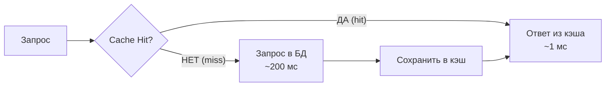
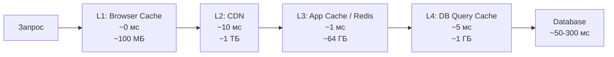
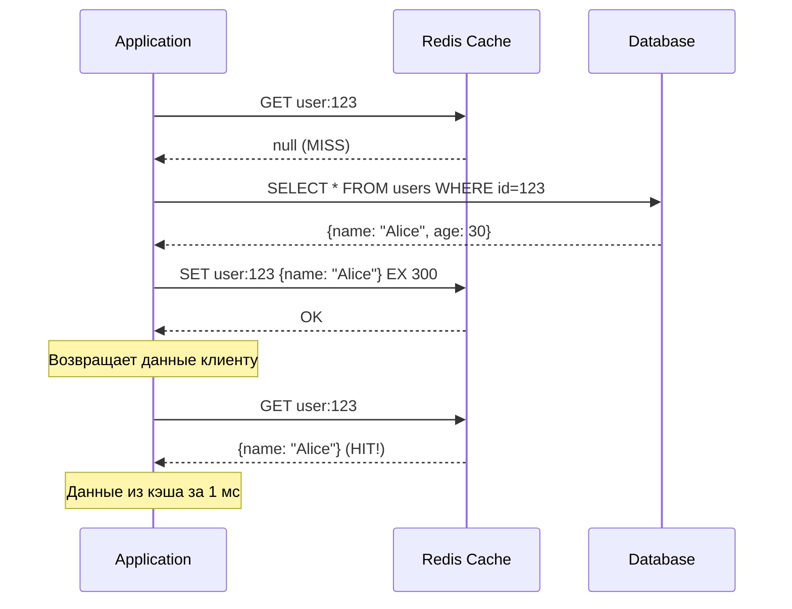
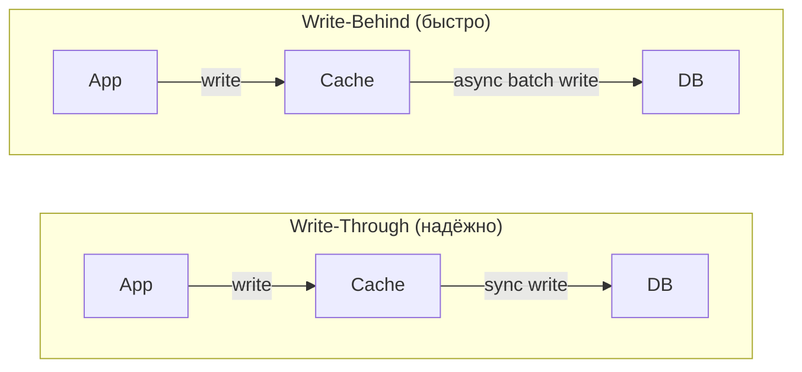
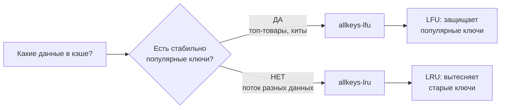
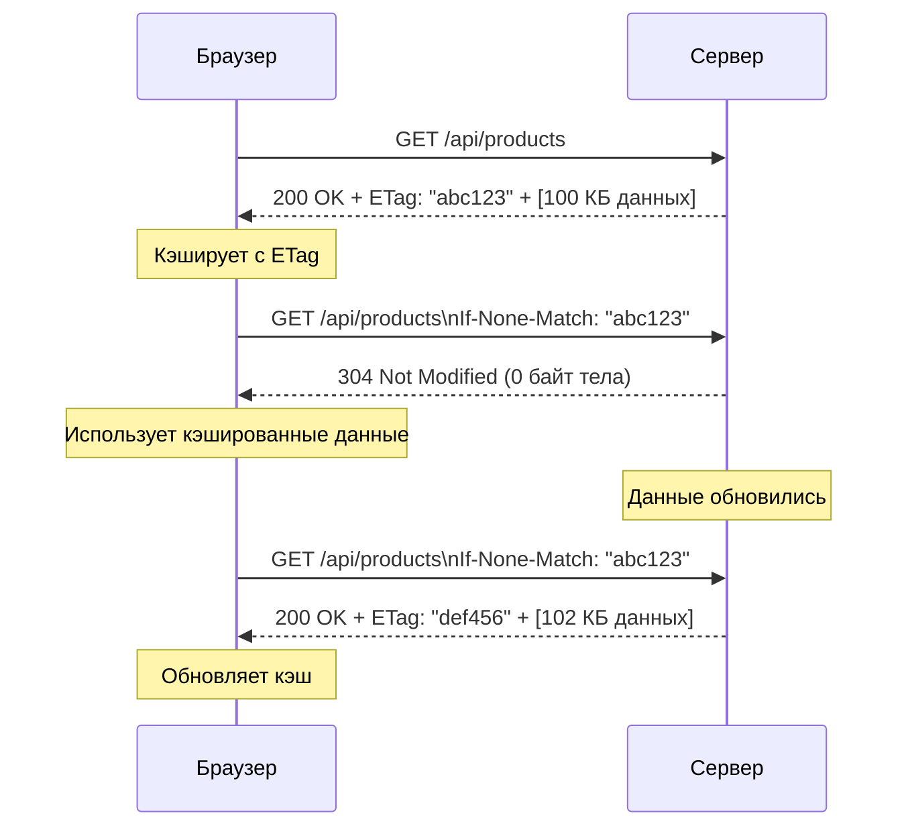
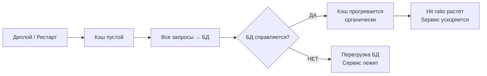

# Уровень 3: Кэширование -- стратегии, инвалидация и подводные камни

## Введение

Представьте библиотеку. Чтобы найти книгу, библиотекарь идёт в хранилище, листает каталоги, поднимается на третий этаж -- это занимает 10 минут. Но если книгу спрашивают каждый час, умный библиотекарь кладёт её прямо на стол: следующий запрос займёт 5 секунд. Когда книгу вернут с новыми пометками, он берёт свежий экземпляр -- старый выбрасывает. Вот это и есть кэш: **копия часто нужного, лежащая там, где до неё быстро добраться**.

В мире серверной разработки "хранилище" -- это база данных (50-300 мс на запрос), а "стол библиотекаря" -- Redis в оперативной памяти (0.5-2 мс). Разница в 100-600 раз. Когда ваш сервис обрабатывает 100 000 запросов в секунду, эта разница становится вопросом выживания.

Кэширование -- одна из немногих техник, дающих немедленный и измеримый результат: снижение latency, разгрузку БД, сокращение расходов на инфраструктуру. Но за этим результатом прячутся три сложности: **когда кэшировать**, **как долго хранить** и **что делать, когда данные меняются**. Именно об этом -- данный уровень.

На этом уровне мы подробно разберём:

1. **Зачем нужен кэш и что такое hit ratio** -- метрика, по которой оценивают эффективность кэширования
2. **Многоуровневый кэш** -- Browser, CDN, Redis, DB -- каждый слой решает свою задачу
3. **Паттерны кэширования** -- Cache-Aside, Read-Through, Write-Through, Write-Behind
4. **Стратегии инвалидации** -- TTL, event-based, versioned keys
5. **Eviction Policies** -- что Redis удаляет, когда память кончается
6. **Три катастрофы** -- Cache Stampede, Cache Penetration, Cache Avalanche
7. **HTTP-кэширование и CDN** -- Cache-Control, ETag, условные запросы
8. **Redis vs Memcached** -- когда что выбирать
9. **Cache Warming** -- прогрев кэша после деплоя

---

## 1. Зачем нужен кэш?

### Проблема, которую решает кэш

Современная база данных обрабатывает запрос за 50-300 миллисекунд. Это звучит быстро -- пока не считаешь нагрузку. При 100 000 одновременных пользователей, каждый из которых открывает главную страницу, вы генерируете 100 000 идентичных SQL-запросов. Все они читают одни и те же данные. БД тратит ресурсы CPU на парсинг запросов, ресурсы I/O на чтение с диска и ресурсы сети на передачу результатов -- и всё это ради одинакового ответа.

Кэш разрывает этот цикл: один запрос уходит в БД, результат сохраняется в памяти, следующие 99 999 запросов получают ответ из памяти за 1 мс.

```
Без кэша:                          С кэшем:
100 000 запросов → 100 000 SQL     100 000 запросов → 1 SQL + 99 999 из кэша
Latency: ~300 мс                   Latency: ~1 мс (99.999%)
DB нагрузка: 100%                  DB нагрузка: ~0.001%
```

### Cache Hit Ratio -- главная метрика

📌 **Cache hit ratio** = количество попаданий / (попадания + промахи).

Это единственная метрика, честно показывающая, насколько эффективен ваш кэш.

- **Hit ratio > 95%** -- кэш работает хорошо
- **Hit ratio 80-95%** -- приемлемо, но есть куда расти
- **Hit ratio < 80%** -- кэш тратит память, но почти не экономит время; стоит пересмотреть стратегию

Представьте кэш, который занимает 10 ГБ RAM, но имеет hit ratio 40%. Это значит, что 60% запросов всё равно идут в БД -- и вы платите за память, не получая реальной экономии. Низкий hit ratio говорит о том, что вы кэшируете "холодные" данные (редко запрашиваемые) или что ваши ключи слишком специфичны (например, включают фильтры, делающие каждый ключ уникальным).



### Что стоит кэшировать, а что нет

Не все данные одинаково полезно кэшировать. Хорошие кандидаты для кэширования:

- **Часто читаются, редко пишутся** -- каталог товаров, справочники, профили пользователей
- **Дорого вычислять** -- агрегации, JOIN по большим таблицам, сложные вычисления
- **Одинаковы для многих пользователей** -- главная страница, топ товаров, публичный контент

Плохие кандидаты:

- **Часто обновляются** -- остаток на счёте, live-позиция курьера (кэш сразу устаревает)
- **Уникальны для каждого запроса** -- отчёты с произвольными фильтрами
- **Запрашиваются раз в день** -- занимают память, hit ratio близок к нулю

---

## 2. Многоуровневый кэш

### Идея иерархии

Кэш -- не один слой, а целая иерархия, где каждый уровень отличается скоростью, ёмкостью и стоимостью. Запрос проходит через слои сверху вниз: если на текущем уровне данных нет (cache miss), запрос опускается ниже. Когда данные найдены -- они возвращаются наверх и могут быть закэшированы на промежуточных уровнях.

Аналогия: компьютерная память. L1-кэш процессора -- крошечный (512 КБ), но невероятно быстрый (0.5 нс). L2 -- больше (4 МБ), чуть медленнее. RAM -- огромная (16 ГБ), но в 100 раз медленнее L1. SSD -- терабайты, но в 10 000 раз медленнее L1. Каждый уровень существует, потому что он дешевле и ёмче предыдущего, хотя и медленнее.



### Уровни кэширования на практике

| Уровень | Что кэшируется | TTL | Размер | Latency |
|---|---|---|---|---|
| Browser Cache | Статика (JS, CSS, изображения) | Часы -- дни | ~100 МБ | 0 мс |
| CDN | Статика + API-ответы | Минуты -- часы | Терабайты | 10-50 мс |
| Application (Redis) | Сессии, результаты запросов | Секунды -- минуты | Гигабайты | 0.5-2 мс |
| DB Query Cache | Результаты SQL | Автоинвалидация | ~1 ГБ | 5-10 мс |

### Почему нельзя обойтись одним уровнем

Казалось бы, зачем Browser Cache, если есть Redis? Дело в сетевом времени: даже если Redis ответит за 1 мс, браузер потратит 20-100 мс на HTTP-запрос к вашему серверу. Браузерный кэш работает без сети вообще -- 0 мс. Аналогично, CDN отвечает из ближайшего к пользователю датацентра, тогда как ваш Redis живёт в одном регионе.

Каждый уровень закрывает свою нишу. Убирать любой из них -- значит терять часть эффективности.

---

## 3. Паттерны кэширования

### Cache-Aside (Lazy Loading) -- самый популярный

**Идея:** приложение само управляет кэшем. При чтении -- проверяет кэш, при промахе идёт в БД и записывает результат в кэш. При записи -- обновляет БД и инвалидирует кэш.

**Почему "lazy" (ленивый)?** Данные попадают в кэш только тогда, когда их кто-то запросил. Если пользователь открыл страницу товара -- этот товар кэшируется. Тысячи товаров, которые никто не смотрел, памяти не занимают.



```typescript
async function getUser(id: string) {
  // Шаг 1: проверяем кэш
  const cached = await redis.get(`user:${id}`)
  if (cached) return JSON.parse(cached) // Cache HIT -- возвращаем сразу

  // Шаг 2: cache MISS -- идём в БД
  const user = await db.query('SELECT * FROM users WHERE id = $1', [id])

  // Шаг 3: сохраняем в кэш на 5 минут
  await redis.set(`user:${id}`, JSON.stringify(user), 'EX', 300)

  return user
}
```

После кода стоит обратить внимание на несколько важных деталей:

- Ключ `user:${id}` -- это **namespace + identifier**. Namespace помогает группировать ключи и избегать коллизий между разными типами данных.
- `JSON.stringify` / `JSON.parse` -- Redis хранит строки, объекты нужно сериализовывать. В production часто используют `msgpack` для более компактного представления.
- `EX 300` -- TTL в секундах. Без TTL ключ будет жить вечно, и кэш постепенно заполнится устаревшими данными.

**Плюсы:** простота реализации, кэшируется только то, что реально запрашивают, устойчивость к сбоям Redis (при недоступности кэша приложение идёт в БД).

**Минусы:** первый запрос всегда медленный (cold start), данные могут быть устаревшими до истечения TTL.

### Read-Through -- кэш как прокси для чтения

**Идея:** приложение обращается только к кэшу. Если кэш не знает данных -- он сам идёт в БД, загружает и возвращает через себя. Приложение не знает про БД напрямую.

```
Cache-Aside:                    Read-Through:
App → Cache (miss)              App → Cache (miss)
App → DB                              Cache → DB
App → Cache (write)                   Cache ← DB (автозаполнение)
App ← данные                   App ← данные из кэша
```

Разница существенная: в Cache-Aside приложение само решает, что писать в кэш и когда. В Read-Through эта логика инкапсулирована в кэш-прослойке. Это упрощает код приложения -- вы всегда работаете с одним интерфейсом -- но требует поддержки со стороны библиотеки кэша (NCache, Hazelcast, некоторые ORM).

Redis из коробки Read-Through не поддерживает -- его нужно реализовывать вручную через обёртку или использовать специализированные решения.

### Write-Through -- синхронная запись в кэш и БД

**Идея:** запись идёт одновременно в кэш и в БД. Кэш всегда актуален.

```typescript
async function updateUser(id: string, data: UserData) {
  // Пишем в БД
  await db.query('UPDATE users SET name=$1 WHERE id=$2', [data.name, id])

  // Сразу обновляем кэш -- данные всегда свежие
  await redis.set(`user:${id}`, JSON.stringify(data), 'EX', 300)
}
```

**Плюс:** нет lag между обновлением БД и обновлением кэша. Следующее чтение всегда получит актуальные данные.

**Минус:** каждая операция записи становится двойной. Если данные редко читают -- вы зря заполняете кэш. Write-Through эффективен в связке с Read-Through.

### Write-Behind (Write-Back) -- асинхронная запись

**Идея:** запись идёт только в кэш, а в БД -- асинхронно с задержкой (или батчами).



**Почему быстрее:** пользователь получает подтверждение сразу, не ожидая записи на диск. Запись в память занимает микросекунды, запись в БД -- десятки миллисекунд.

**Риск:** если кэш упадёт до того, как данные записались в БД -- они потеряются. Write-Behind подходит для некритичных данных: счётчики просмотров, аналитика, лайки. Но не для финансовых транзакций или пользовательских данных.

### Сравнение паттернов

| Паттерн | Операция | Консистентность | Сложность | Когда использовать |
|---|---|---|---|---|
| Cache-Aside | Чтение | Eventual | Низкая | Большинство случаев |
| Read-Through | Чтение | Eventual | Средняя | Единый интерфейс доступа |
| Write-Through | Запись | Сильная | Средняя | Важна свежесть данных |
| Write-Behind | Запись | Слабая | Высокая | Высокая нагрузка на запись |

💡 **На практике** комбинируют: **Cache-Aside для чтения** + **Write-Through для записи** -- самая популярная и надёжная комбинация. Читаем лениво, пишем всегда актуально.

---

## 4. Стратегии инвалидации кэша

> «В информатике есть только две сложные вещи: инвалидация кэша и именование» -- Фил Карлтон

Инвалидация -- это процесс признания кэшированных данных устаревшими и их удаления или обновления. Это сложно по одной причине: **момент изменения данных и момент следующего чтения из кэша разделены во времени**. Между ними данные в кэше расходятся с данными в БД.

### TTL (Time-To-Live) -- самый простой подход

Каждому ключу присваивается время жизни. По истечении Redis автоматически удаляет ключ. Просто, надёжно, без дополнительной логики.

```bash
# Установить ключ с TTL 5 минут (300 секунд)
SET user:123 '{"name":"Alice"}' EX 300

# Проверить оставшееся время жизни
TTL user:123
# → 287 (осталось 287 секунд)

# PTTL -- то же самое, но в миллисекундах
PTTL user:123
# → 287000
```

TTL -- это **компромисс между свежестью и производительностью**. Короткий TTL = данные почти всегда свежие, но много промахов и запросов в БД. Длинный TTL = высокий hit ratio, но данные могут устареть.

**Как выбрать TTL:**

| Тип данных | Рекомендуемый TTL | Обоснование |
|---|---|---|
| Статика (логотип, шрифты) | 86400-604800 с (дни -- недели) | Меняется крайне редко |
| Каталог товаров | 300-3600 с (5 мин -- 1 час) | Обновляется иногда |
| Профиль пользователя | 60-300 с (1-5 мин) | Пользователь может изменить |
| Курсы валют | 5-30 с | Меняются постоянно |
| Результаты поиска | 10-60 с | Зависит от частоты обновления данных |

### Event-Based инвалидация -- немедленное удаление

При изменении данных в БД немедленно удаляем соответствующий ключ из кэша. Это даёт более свежие данные, чем TTL, но требует явной логики при каждой записи.

```typescript
async function updateUser(id: string, data: UserData) {
  // 1. Обновляем БД
  await db.query('UPDATE users SET name=$1 WHERE id=$2', [data.name, id])

  // 2. Инвалидируем кэш -- удаляем, не обновляем!
  await redis.del(`user:${id}`)

  // Следующий запрос на чтение подтянет свежие данные из БД
}
```

📌 **Почему `DEL`, а не `SET`?** Это принципиальный вопрос. При обновлении (`SET`) между чтением из БД и записью в кэш может вклиниться другой поток -- и записать устаревшую версию (race condition). При удалении (`DEL`) следующее чтение гарантированно получит свежие данные из БД. Паттерн "delete on write" проще и надёжнее.

Визуализация проблемы с `SET`:

```
Поток 1: читает user v1 из БД
Поток 2: обновляет user → v2, пишет v2 в кэш
Поток 1: пишет v1 в кэш  ← перезатирает v2! Кэш устарел.
```

При `DEL` этой проблемы нет: после удаления кэша любой поток получит свежие данные.

### Versioned Keys -- переключение версий

Вместо удаления ключа меняем его версию. Старый ключ существует, но его никто не читает -- он протухнет по TTL сам.

```typescript
// Чтение с версионированием
async function getProducts() {
  const version = await redis.get('products:version') ?? 'v1'
  const products = await redis.get(`products:${version}`)

  if (products) return JSON.parse(products)

  const data = await db.query('SELECT * FROM products')
  await redis.set(`products:${version}`, JSON.stringify(data), 'EX', 3600)
  return data
}

// Инвалидация -- просто инкрементируем версию
async function invalidateProducts() {
  await redis.incr('products:version')
  // Старые ключи products:v1, products:v2 протухнут по TTL
  // Новые запросы начнут использовать products:v3
}
```

**Когда это полезно:** когда нужно инвалидировать большую группу ключей одновременно, не зная точных имён. Например, весь каталог товаров после обновления прайса. Вместо удаления тысяч ключей достаточно одного `INCR` на версию.

---

## 5. Eviction Policies: что удалять, когда кэш полон?

### Проблема ограниченной памяти

Redis работает в оперативной памяти -- ресурсе ограниченном и дорогом. Когда кэш заполнен и приходит новый элемент, Redis должен кого-то "выселить". Политика выселения определяет, кого именно.

```redis-conf
# redis.conf -- настройка максимальной памяти и политики
maxmemory 2gb
maxmemory-policy allkeys-lru
```

### Политики выселения

| Политика | Принцип | Когда использовать |
|---|---|---|
| **noeviction** | Возвращать ошибку при попытке записи | Только если потеря данных недопустима |
| **allkeys-lru** | Удалять давно не использовавшиеся из всех ключей | Универсальный выбор для кэша |
| **volatile-lru** | LRU только среди ключей с TTL | Кэш + персистентные данные в одном Redis |
| **allkeys-lfu** | Удалять редко используемые из всех ключей | Есть стабильно "горячие" ключи |
| **volatile-lfu** | LFU только среди ключей с TTL | Аналогично volatile-lru, но LFU |
| **allkeys-random** | Удалять случайный из всех ключей | Когда все ключи равнозначны |
| **volatile-random** | Случайный из ключей с TTL | Редко используется |
| **volatile-ttl** | Удалять ключ с наименьшим TTL | Разные приоритеты по времени жизни |

**Аналогия с холодильником:**
- **LRU** -- выбрасываем то, что дольше всего не доставали (лежит в глубине)
- **LFU** -- выбрасываем то, что реже всего едим (покупаем, но не открываем)
- **FIFO / volatile-ttl** -- выбрасываем самое старое (по дате изготовления)
- **Random** -- выбрасываем наугад (закрыли глаза и выбрали)

### LRU vs LFU: когда что выбирать



**LRU** (Least Recently Used) лучше для потоковых данных: новости, лента событий, сессии. Данные актуальны некоторое время, потом устаревают -- LRU естественно их вытесняет.

**LFU** (Least Frequently Used) лучше, когда есть "вечнозелёные" горячие ключи: топ-100 товаров по продажам, популярные статьи. Даже если они не запрашивались последние 10 минут, LFU сохранит их, потому что их суммарная частота высока.

💡 Redis реализует **approximated LRU** -- вместо точного отслеживания порядка использования он берёт случайную выборку ключей и выселяет худший из них. Это компромисс между точностью и потреблением памяти. Размер выборки настраивается: `maxmemory-samples 10` (по умолчанию 5).

### Тонкая настройка LFU

LFU в Redis управляется двумя параметрами:

```redis-conf
# Насколько быстро "насыщается" счётчик частоты
# Меньше значение = счётчик насыщается быстрее (подходит для низкой нагрузки)
lfu-log-factor 10

# Как быстро "забываются" старые обращения (в минутах)
# 1 = каждую минуту счётчик уменьшается
lfu-decay-time 1
```

---

## 6. Три проблемы кэширования: Stampede, Penetration, Avalanche

Эти три явления -- классические ловушки, которые превращают кэш из инструмента оптимизации в источник проблем. Важно понять механику каждого и знать защиту.

### Cache Stampede (Thundering Herd) -- гром стада

**Проблема:** популярный ключ протухает, и тысячи параллельных запросов одновременно обнаруживают cache miss и все одновременно идут в БД.

```
TTL истёк для "hot_product:1" (1 000 000 просмотров/мин)
    │
    ▼
Поток 1: cache miss → SELECT * FROM products...
Поток 2: cache miss → SELECT * FROM products...  ← ОДИНАКОВЫЙ ЗАПРОС!
Поток 3: cache miss → SELECT * FROM products...
...
Поток 1000: cache miss → SELECT * FROM products...
    │
    ▼
БД перегружена 1000 одинаковыми запросами
```

Аналогия: стадо животных на водопое. Пока вода есть -- всё спокойно. Как только источник пересыхает, всё стадо одновременно бросается к следующему -- и вытаптывает его.

**Решение 1: Mutex Lock**

Только один поток обновляет кэш. Остальные ждут.

```typescript
async function getWithLock(key: string, fetchFn: () => Promise<unknown>) {
  // Шаг 1: проверяем кэш
  const cached = await redis.get(key)
  if (cached) return JSON.parse(cached)

  // Шаг 2: пытаемся захватить лок
  // NX = только если ключ не существует, EX = TTL лока 10 секунд
  const lockAcquired = await redis.set(`lock:${key}`, '1', 'NX', 'EX', 10)

  if (lockAcquired) {
    try {
      // Мы захватили лок -- обновляем кэш
      const data = await fetchFn()
      await redis.set(key, JSON.stringify(data), 'EX', 300)
      return data
    } finally {
      await redis.del(`lock:${key}`) // Всегда освобождаем лок
    }
  } else {
    // Лок занят другим потоком -- ждём и читаем из кэша
    await sleep(50)
    return getWithLock(key, fetchFn) // Рекурсивный retry
  }
}
```

**Решение 2: Early Refresh (XFetch алгоритм)**

Обновляем кэш досрочно с вероятностью, зависящей от оставшегося TTL. Чем меньше времени до протухания -- тем выше вероятность досрочного обновления. Это предотвращает одновременный stampede, распределяя обновления по времени.

```typescript
async function getWithEarlyRefresh(key: string, fetchFn: () => Promise<unknown>) {
  const { value, ttl } = await redis.getWithTTL(key)

  // Если TTL > 30 секунд -- возвращаем как есть
  if (value && ttl > 30) return JSON.parse(value)

  // TTL < 30 сек -- с растущей вероятностью обновляем досрочно
  // Math.exp(-ttl / 10): при ttl=30 → ~5%, при ttl=5 → ~60%, при ttl=1 → ~90%
  if (value && Math.random() > Math.exp(-ttl / 10)) {
    return JSON.parse(value) // Большинство потоков возвращает текущее значение
  }

  // Один "счастливый" поток обновляет кэш заранее
  const data = await fetchFn()
  await redis.set(key, JSON.stringify(data), 'EX', 300)
  return data
}
```

### Cache Penetration -- удары сквозь кэш

**Проблема:** злоумышленник (или баг) делает запросы к заведомо несуществующим ключам. Кэш всегда промахивается, каждый запрос доходит до БД.

```
Атакующий: GET /user/9999999999 (не существует)
Cache: miss → DB: null → не кэшируем → следующий запрос опять в DB!

Если атакующий делает 10 000 запросов/сек с разными несуществующими ID:
10 000 запросов → 10 000 SQL-запросов → БД перегружена
```

**Решение 1: кэшировать "не найдено"**

```typescript
async function getUser(id: string) {
  const cached = await redis.get(`user:${id}`)

  if (cached === 'NULL') return null    // Кэшированное "не найдено"
  if (cached) return JSON.parse(cached) // Кэшированные данные

  const user = await db.query('SELECT * FROM users WHERE id = $1', [id])

  if (!user) {
    // Кэшируем null с коротким TTL -- не даём пробивать кэш снова
    await redis.set(`user:${id}`, 'NULL', 'EX', 60)
    return null
  }

  await redis.set(`user:${id}`, JSON.stringify(user), 'EX', 300)
  return user
}
```

**Решение 2: Bloom Filter**

Bloom Filter -- вероятностная структура данных, которая даёт ответ на вопрос "этот элемент точно не существует?" с нулевыми false negatives. Если Bloom Filter говорит "нет" -- элемента точно нет, и мы не тратим время на кэш и БД.

```typescript
// Bloom Filter хранит хэши всех существующих ID
// При добавлении пользователя -- добавляем в Bloom Filter
// При удалении -- периодически перестраиваем

if (!bloomFilter.mightContain(userId)) {
  return null // Точно не существует -- экономим запрос к кэшу и БД
}

// Если Bloom Filter говорит "возможно существует" -- идём дальше
return getUser(userId)
```

Bloom Filter потребляет минимум памяти (~10 бит на элемент для 1% false positive rate) и работает за O(1). Redis Stack включает встроенный `BF.ADD` / `BF.EXISTS`.

### Cache Avalanche -- лавина при массовом истечении

**Проблема:** множество ключей протухают одновременно -- лавина запросов обрушивается на БД.

Типичная ситуация: прогрев кэша после деплоя -- все ключи создаются в одно время с одинаковым TTL. Через ровно TTL секунд все они протухают одновременно.

```typescript
// Все ключи с TTL=3600 протухнут через час одновременно
await redis.set('product:1', data, 'EX', 3600)
await redis.set('product:2', data, 'EX', 3600)
await redis.set('product:3', data, 'EX', 3600)
// Через 3600 секунд: все три промахнутся одновременно → 3 запроса в БД
// При тысячах ключей → тысячи одновременных запросов → лавина
```

**Решение: TTL с Jitter (случайным отклонением)**

```typescript
// Добавляем случайный разброс ±10% к базовому TTL
function ttlWithJitter(baseTTL: number): number {
  const jitter = Math.floor(Math.random() * baseTTL * 0.1)
  return baseTTL + jitter
}

// Теперь ключи протухают в разное время
await redis.set('product:1', data, 'EX', ttlWithJitter(3600)) // 3600-3960 с
await redis.set('product:2', data, 'EX', ttlWithJitter(3600)) // 3600-3960 с
await redis.set('product:3', data, 'EX', ttlWithJitter(3600)) // 3600-3960 с
```

Jitter распределяет протухание равномерно по времени. Вместо 1000 запросов в секунду БД получает ~1000/360 ≈ 3 запроса в секунду на протяжении 6 минут.

**Сравнение трёх проблем:**

| Проблема | Триггер | Эффект | Защита |
|---|---|---|---|
| Cache Stampede | Один популярный ключ истёк | Много одинаковых запросов к БД | Mutex lock, Early Refresh |
| Cache Penetration | Запросы несуществующих ключей | Каждый запрос доходит до БД | Кэш null, Bloom Filter |
| Cache Avalanche | Много ключей истекают одновременно | Лавина разных запросов к БД | TTL с Jitter, прогрев |

---

## 7. HTTP-кэширование и CDN

### HTTP Cache Headers -- управление кэшем на уровне протокола

HTTP предоставляет стандартные заголовки для управления кэшированием на уровне браузера и CDN. Правильно настроенные заголовки -- это "бесплатный" кэш без Redis.

```
# Статика с fingerprinting (хэш в имени файла) -- агрессивное кэширование
Cache-Control: public, max-age=31536000, immutable
# public    = CDN тоже может кэшировать (не только браузер)
# max-age   = 1 год в секундах
# immutable = не проверять свежесть (файл с хэшем никогда не меняется)

# API-ответы -- короткое кэширование с ревалидацией
Cache-Control: private, max-age=60, must-revalidate
ETag: "v2-abc123"
# private          = только браузер, CDN не кэширует
# max-age=60       = 1 минута
# must-revalidate  = по истечении проверить у сервера

# Без кэширования (личные данные, транзакции)
Cache-Control: no-store
# no-store = не хранить вообще, запрашивать каждый раз
```

### ETag и условные запросы -- экономия трафика

ETag (Entity Tag) -- это fingerprint содержимого. Сервер отправляет ETag вместе с ответом. При следующем запросе браузер передаёт ETag обратно, и сервер возвращает либо полный ответ (если данные изменились), либо `304 Not Modified` без тела.



Это особенно ценно для мобильных сетей: 304 экономит сотни килобайт трафика при ответах, которые не изменились.

### CDN -- глобально распределённый кэш

CDN (Content Delivery Network) -- сеть edge-серверов по всему миру. Cloudflare, AWS CloudFront, Fastly. Идея простая: вместо того чтобы пользователь в Токио ждал ответа от сервера в Нью-Йорке (200 мс RTT), он получает ответ от ближайшего edge-сервера в Токио (5 мс).

```
Без CDN:
  Пользователь в Токио → Нью-Йорк (200 мс RTT) → ответ

С CDN (первый запрос, cache miss на edge):
  Токио → Edge Токио (5 мс) → Origin Нью-Йорк (200 мс) → Edge Токио → ответ (205 мс)

С CDN (последующие запросы, cache hit на edge):
  Токио → Edge Токио (5 мс) → ответ из кэша
```

CDN особенно эффективен для:
- Статических файлов (JS, CSS, изображения)
- Публичных API-ответов (каталог, новости)
- Медиа-контента (видео, аудио)

Персональные данные, приватные API-ответы не кэшируются на CDN (используйте `Cache-Control: private`).

---

## 8. Redis vs Memcached

### Когда вообще возникает выбор

Оба инструмента -- in-memory key-value хранилища. Исторически Memcached был быстрее при простых строковых операциях и лучше масштабировался горизонтально за счёт многопоточности. Redis был "многофункциональным" -- структуры данных, скрипты, pub/sub. Сегодня Redis значительно эволюционировал и в большинстве случаев является очевидным выбором.

| Критерий | Redis | Memcached |
|---|---|---|
| Структуры данных | Strings, Lists, Sets, Hashes, Sorted Sets, Streams, JSON | Только strings |
| Персистенция | RDB (снапшоты) + AOF (лог операций) | Нет |
| Репликация | Master-Replica с автофailover (Sentinel) | Нет |
| Кластеризация | Redis Cluster (16384 хэш-слота) | Client-side sharding |
| Pub/Sub | Да (каналы + pattern matching) | Нет |
| Lua-скрипты | Да (атомарное выполнение) | Нет |
| Многопоточность | Однопоточный (I/O threads с версии 6.0) | Многопоточный |
| Макс. размер value | 512 МБ | 1 МБ |
| Атомарные операции | INCR, DECR, APPEND, LPUSH и т.д. | INCR/DECR только |

### Персистенция Redis -- важная деталь

Redis поддерживает два режима персистенции:

**RDB (Redis Database)** -- точечные снапшоты датасета. Redis периодически сохраняет всё содержимое памяти на диск.

```redis-conf
# Снапшот каждые 900 сек при >= 1 изменении
save 900 1
# Снапшот каждые 300 сек при >= 10 изменениях
save 300 10
# Снапшот каждые 60 сек при >= 10000 изменениях
save 60 10000
```

**AOF (Append Only File)** -- лог каждой операции записи. При рестарте Redis воспроизводит лог и восстанавливает состояние.

```redis-conf
appendonly yes
# fsync каждую секунду -- компромисс между надёжностью и производительностью
appendfsync everysec
```

**Для чистого кэша** персистенцию можно отключить совсем -- это ускоряет Redis и не нужно место на диске. При рестарте кэш просто перегревается.

### Когда Memcached всё ещё имеет смысл

Memcached остаётся актуальным в узких сценариях: простое строковое кэширование с максимальной утилизацией многоядерных CPU, миллионы мелких ключей с минимальными overhead'ами, команды, которым нужна строго однородная шардированная архитектура без мастера.

💡 **Практический совет:** если вы начинаете новый проект -- выбирайте Redis. Если у вас уже есть Memcached и он справляется -- не меняйте без необходимости.

---

## 9. Cache Warming -- прогрев кэша

### Проблема холодного старта

После деплоя или рестарта Redis кэш пустой. Все запросы уходят в БД -- именно в тот момент, когда нагрузка на сервис нарастает (пользователи заходят после перерыва). Это называется **cold start**: сервис работает медленно, пока кэш не "прогреется" органически.



### Стратегия прогрева

Решение -- предзаполнить кэш популярными данными **до** того, как придут пользователи.

```typescript
async function warmCache() {
  console.log('Starting cache warm-up...')

  // Топ-1000 популярных товаров (по просмотрам за последние 7 дней)
  const popular = await db.query(`
    SELECT p.*, COUNT(pv.id) as views
    FROM products p
    JOIN product_views pv ON p.id = pv.product_id
    WHERE pv.viewed_at > NOW() - INTERVAL '7 days'
    GROUP BY p.id
    ORDER BY views DESC
    LIMIT 1000
  `)

  // Загружаем в Redis батчами по 100 (не перегружаем Redis и сеть)
  const BATCH_SIZE = 100
  for (let i = 0; i < popular.length; i += BATCH_SIZE) {
    const batch = popular.slice(i, i + BATCH_SIZE)
    const pipeline = redis.pipeline()

    for (const product of batch) {
      pipeline.set(
        `product:${product.id}`,
        JSON.stringify(product),
        'EX',
        ttlWithJitter(3600) // Jitter чтобы избежать avalanche
      )
    }

    await pipeline.exec()
    console.log(`Warmed ${Math.min(i + BATCH_SIZE, popular.length)} / ${popular.length}`)
  }

  console.log('Cache warm-up complete')
}

// Вызывать после деплоя, до открытия трафика
await warmCache()
```

📌 Обратите внимание на `redis.pipeline()` -- это батчирование команд Redis. Вместо 1000 отдельных network round-trips выполняется ~10 батчей. Это ускоряет прогрев в 10-50 раз.

### Когда запускать прогрев

В production прогрев обычно встраивают в процесс деплоя:

```
1. Деплой нового кода
2. Запустить warmCache() -- заполнить топ-данными
3. Health check: убедиться, что Redis доступен
4. Переключить трафик на новую версию
```

При работе с несколькими экземплярами (Redis Cluster) прогрев можно делать параллельно, распределяя ключи по слотам.

---

## Частые ошибки новичков

### ❌ 1. Кэшируют всё подряд

```typescript
// Кэшировать данные, которые запрашивают раз в день
await redis.set(`rare_report:${id}`, data, 'EX', 3600)
// Занимает память, hit ratio близок к нулю
```

**Почему это плохо:** кэш эффективен только для часто запрашиваемых данных. Кэширование "холодных" данных тратит RAM и вытесняет "горячие" ключи через LRU/LFU.

```typescript
// ✅ Кэшировать только "горячие" данные
// Правило: если данные запрашиваются > 10 раз за период TTL -- кэшируем
if (requestsPerTTL > 10) {
  await redis.set(`popular_product:${id}`, data, 'EX', 300)
}
```

### ❌ 2. Одинаковый TTL для всех ключей

```typescript
// Все ключи протухнут одновременно → cache avalanche
const TTL = 3600
await redis.set('key1', data1, 'EX', TTL)
await redis.set('key2', data2, 'EX', TTL)
await redis.set('key3', data3, 'EX', TTL)
```

**Почему это плохо:** одновременная инвалидация тысяч ключей создаёт лавину запросов в БД -- именно в тот момент, когда кэш больше всего нужен.

```typescript
// ✅ TTL с Jitter
function ttl(base: number) {
  return base + Math.floor(Math.random() * base * 0.2)
}
await redis.set('key1', data1, 'EX', ttl(3600)) // 3600-4320 с
await redis.set('key2', data2, 'EX', ttl(3600)) // 3600-4320 с
```

### ❌ 3. Обновляют кэш вместо удаления

```typescript
// Race condition при обновлении кэша
async function updateUser(id: string, data: UserData) {
  await db.update(id, data)
  const user = await db.get(id)
  await redis.set(`user:${id}`, JSON.stringify(user)) // Гонка!
}
// Поток 1: читает user v1 из БД
// Поток 2: обновляет user → v2, пишет v2 в кэш
// Поток 1: пишет v1 в кэш -- перезатирает v2!
```

**Почему это плохо:** между чтением из БД и записью в кэш другой поток может уже записать более свежую версию -- и будет затёрта более свежей более старой.

```typescript
// ✅ Удаляем ключ -- следующее чтение гарантированно свежее
async function updateUser(id: string, data: UserData) {
  await db.update(id, data)
  await redis.del(`user:${id}`) // Delete, not set
}
```

### ❌ 4. Не защищаются от Cache Stampede

```typescript
// Популярный ключ протух → 10 000 одновременных запросов в БД
async function getProduct(id: string) {
  const cached = await redis.get(`product:${id}`)
  if (cached) return JSON.parse(cached)
  const product = await db.get(id) // 10 000 одинаковых запросов!
  await redis.set(`product:${id}`, JSON.stringify(product), 'EX', 300)
  return product
}
```

**Почему это плохо:** без лока все конкурентные запросы при промахе пойдут в БД одновременно. При высокой нагрузке это может положить БД.

```typescript
// ✅ Mutex lock -- только один запрос обновляет кэш
async function getProduct(id: string) {
  const cached = await redis.get(`product:${id}`)
  if (cached) return JSON.parse(cached)

  const lock = await redis.set(`lock:product:${id}`, '1', 'NX', 'EX', 10)
  if (lock) {
    try {
      const product = await db.get(id)
      await redis.set(`product:${id}`, JSON.stringify(product), 'EX', 300)
      return product
    } finally {
      await redis.del(`lock:product:${id}`)
    }
  }
  await sleep(50)
  return getProduct(id) // retry -- к этому моменту кэш обновлён
}
```

### ❌ 5. Не следят за hit ratio

Добавить кэш -- это полдела. Без мониторинга hit ratio кэш может деградировать незаметно: рост ассортимента товаров, изменение поведения пользователей, неправильные ключи. Hit ratio < 80% при наличии кэша часто означает, что кэш работает в убыток (занимает память, создаёт сложность, но не даёт нужной скорости).

```bash
# Мониторинг в Redis CLI
redis-cli info stats | grep keyspace
# keyspace_hits:1234567
# keyspace_misses:45678
# hit ratio = 1234567 / (1234567 + 45678) ≈ 96.4%

# Или через Redis INFO
redis-cli info all | grep -E "keyspace_hits|keyspace_misses"
```

```typescript
// ✅ Считать hit ratio в приложении
const metrics = { hits: 0, misses: 0 }

async function getWithMetrics(key: string) {
  const value = await redis.get(key)
  if (value) {
    metrics.hits++
    return JSON.parse(value)
  }
  metrics.misses++
  return null
}

// Периодически логировать
setInterval(() => {
  const total = metrics.hits + metrics.misses
  const ratio = total > 0 ? (metrics.hits / total * 100).toFixed(1) : 0
  console.log(`Cache hit ratio: ${ratio}% (${metrics.hits}/${total})`)
}, 60_000)
```

### ❌ 6. Забывают о сериализации и десериализации

```typescript
// Хранят объект напрямую -- Redis сохранит [object Object]
await redis.set('user:1', { name: 'Alice' }) // Ошибка!

// Или не обрабатывают ошибки JSON.parse
const data = JSON.parse(await redis.get('user:1')) // Может бросить исключение!
```

```typescript
// ✅ Всегда сериализовать и обрабатывать ошибки
async function safeGet<T>(key: string): Promise<T | null> {
  const raw = await redis.get(key)
  if (!raw) return null
  try {
    return JSON.parse(raw) as T
  } catch {
    // Данные повреждены -- удаляем ключ
    await redis.del(key)
    return null
  }
}
```

---

## Итоги

- ✅ **Cache-Aside** -- самый популярный паттерн: приложение управляет кэшем, ходит в БД при miss
- ✅ **Write-Through** -- надёжная запись (кэш → БД синхронно); **Write-Behind** -- быстрая запись (асинхронно, с риском потери данных)
- ✅ **TTL с Jitter** -- защита от Cache Avalanche: случайный разброс времени жизни ключей
- ✅ **Mutex Lock** -- защита от Cache Stampede: только один поток обновляет кэш при промахе
- ✅ **Кэширование null** и **Bloom Filter** -- защита от Cache Penetration
- ✅ **LRU** -- универсальная политика вытеснения; **LFU** -- для стабильно популярных ключей
- ✅ **HTTP Cache-Control, ETag** -- бесплатный кэш на уровне браузера и CDN
- ✅ **Redis** -- выбор по умолчанию: структуры данных, персистенция (RDB + AOF), pub/sub
- 📌 Следите за **hit ratio** (цель > 95%) -- это главная метрика эффективности кэша
- 📌 **Delete on write** -- удаляйте ключ при обновлении данных, не перезаписывайте
- 📌 **Cache Warming** -- прогревайте кэш после деплоя, до открытия трафика
- 📌 Многоуровневый кэш (Browser → CDN → Redis → DB) -- каждый уровень со своим TTL
- 📌 Используйте **pipeline** для батчевых операций Redis -- экономит network round-trips
