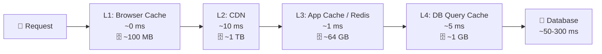
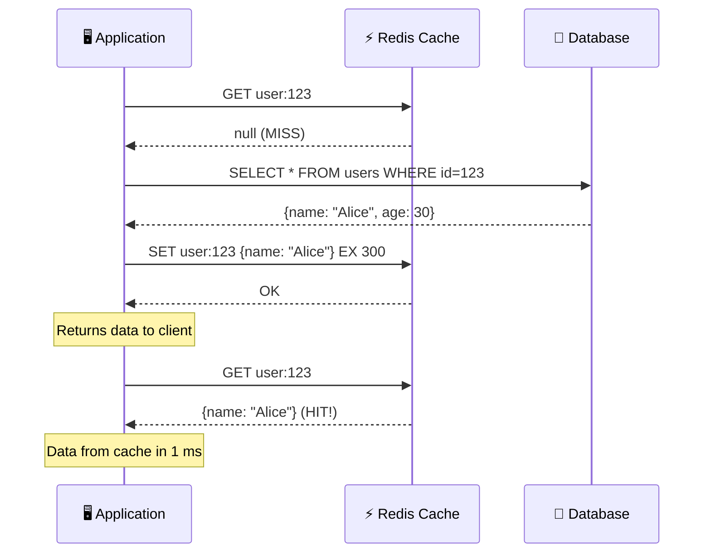
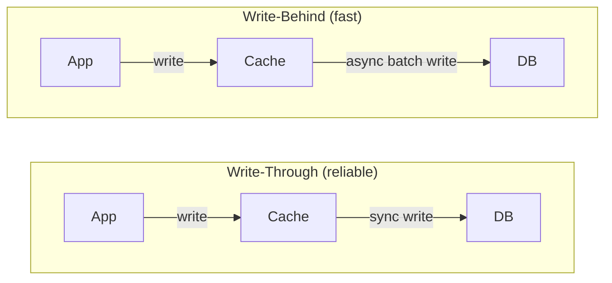

# 🔥 Level 3: Caching

## 🎯 Why Do We Need Cache?

Imagine: your desk is the cache, and the archive at the other end of town is the database. Every time you need a document, you can either go to the archive (300 ms) or check the desk drawer (1 ms). **Cache is the desk drawer** where you keep copies of frequently needed documents.

Without cache, each of the 100,000 users opening the main page generates the same SQL query. With cache — the DB query runs once, and the rest get the result from memory.

```
Without cache:                     With cache:
100,000 requests → 100,000 SQL     100,000 requests → 1 SQL + 99,999 from cache
Latency: ~300 ms                   Latency: ~1 ms (99.999%)
DB load: 100%                      DB load: ~0.001%
```

## 🔥 Multi-Level Cache

A request passes through several cache layers — from the fastest (and smallest) to the slowest (and largest). If data is not found at the current level (**cache miss**), the request goes deeper.



**Cache hit** — data found in cache (fast). **Cache miss** — data not found, go further (slow).

📌 **Cache hit ratio** = hits / (hits + misses). A good metric is **95%+**. If hit ratio < 80%, the cache is performing poorly: consuming memory but not saving time.

### Caching Levels in Practice

| Level | What is cached | TTL | Size | Latency |
|---|---|---|---|---|
| Browser Cache | Static assets (JS, CSS, images) | Hours—days | ~100 MB | 0 ms |
| CDN | Static assets + API responses | Minutes—hours | Terabytes | 10-50 ms |
| Application (Redis) | Sessions, query results | Seconds—minutes | Gigabytes | 0.5-2 ms |
| DB Query Cache | SQL results | Auto-invalidation | ~1 GB | 5-10 ms |

## 🔥 Caching Patterns

### Cache-Aside (Lazy Loading)

The most popular pattern. The application manages the cache itself: checks, reads from DB on miss, writes to cache.



```typescript
async function getUser(id: string) {
  // 1. Check cache
  const cached = await redis.get(`user:${id}`)
  if (cached) return JSON.parse(cached) // Cache HIT

  // 2. Cache MISS — read from DB
  const user = await db.query('SELECT * FROM users WHERE id = $1', [id])

  // 3. Save to cache for 5 minutes
  await redis.set(`user:${id}`, JSON.stringify(user), 'EX', 300)

  return user
}
```

**Pros:** simplicity, only actually requested data gets cached.
**Cons:** first request is always slow (cold start), data may become stale.

### Read-Through

The cache itself fetches from the DB on miss. The application works only with the cache and knows nothing about the DB.

```
Cache-Aside:                    Read-Through:
App → Cache (miss)              App → Cache (miss)
App → DB                              Cache → DB
App → Cache (write)                   Cache ← DB (auto-fill)
App ← data                     App ← data from cache
```

**Pros:** application code is simpler — you always work with the cache.
**Cons:** requires cache support (e.g., NCache, Hazelcast). Redis doesn't do this out of the box.

### Write-Through

Write goes first to the cache, and the cache **synchronously** writes to the DB. Data in cache is always up to date.

### Write-Behind (Write-Back)

Write goes to the cache, and to the DB — **asynchronously** with a delay. Faster, but riskier.



### Comparing Patterns

| Pattern | Read | Write | Consistency | Complexity |
|---|---|---|---|---|
| Cache-Aside | App → Cache → DB | App → DB (cache updates lazily) | Eventual | Low |
| Read-Through | App → Cache (cache fetches from DB) | — | Eventual | Medium |
| Write-Through | — | App → Cache → DB (synchronously) | Strong | Medium |
| Write-Behind | — | App → Cache → DB (asynchronously) | Weak | High |

💡 **In practice** they are combined: **Cache-Aside for reads** + **Write-Through for writes** — the most popular combination.

## 🔥 Cache Invalidation Strategies

> "There are only two hard things in Computer Science: cache invalidation and naming things" — Phil Karlton

### TTL (Time-To-Live)

The simplest approach — data "expires" after a set amount of time.

```bash
# Redis: set key with TTL of 5 minutes (300 seconds)
SET user:123 '{"name":"Alice"}' EX 300

# Check remaining time
TTL user:123
# → 287 (287 seconds remaining)
```

**How to choose TTL:**
- Static assets (logos, fonts): **days—weeks** (86400-604800 s)
- Product catalog: **minutes—hours** (300-3600 s)
- User profile: **minutes** (60-300 s)
- Exchange rates, stock data: **seconds** (5-30 s)

### Event-Based Invalidation

When data changes — immediately delete/update the cache.

```typescript
async function updateUser(id: string, data: UserData) {
  // 1. Update DB
  await db.query('UPDATE users SET name=$1 WHERE id=$2', [data.name, id])

  // 2. Invalidate cache (delete, not update!)
  await redis.del(`user:${id}`)

  // Next read request will pull fresh data from DB
}
```

📌 **Why `DEL`, not `SET`?** The "delete on write" pattern is simpler and more reliable. When updating the cache, you might write a stale version (race condition). When deleting — the next read is guaranteed to get fresh data.

### Versioned Keys

Change the key version instead of deleting — the old key simply "forgets" via TTL.

```typescript
// Version in the key
const version = await redis.get('products:version') // "v42"
const products = await redis.get(`products:${version}`)

// On update — increment the version
await redis.incr('products:version') // "v43"
// Old key products:v42 will expire by TTL
```

## 🔥 Eviction Policies: What to Remove When Cache is Full?

Memory is limited. When the cache is full and a new element arrives — someone needs to be "evicted".

```bash
# Redis: max 2 GB memory, LRU strategy
maxmemory 2gb
maxmemory-policy allkeys-lru
```

| Policy | Principle | When to use |
|---|---|---|
| **LRU** (Least Recently Used) | Evict the least recently accessed | Universal, default |
| **LFU** (Least Frequently Used) | Evict the least frequently accessed | When there are "hot" keys |
| **FIFO** (First In First Out) | Evict the oldest | Simple scenarios |
| **Random** | Evict randomly | When all keys are equally important |
| **TTL-based** | Evict with the lowest TTL | Different TTL priorities |

**Analogy:** the fridge is full.
- **LRU** — throw out what you haven't touched in the longest time
- **LFU** — throw out what you eat the least often
- **FIFO** — throw out the oldest products

💡 **LRU vs LFU:** LRU is better for "streaming" data (news, feed). LFU is better when there are consistently popular elements (top products). Redis uses **approximated LRU** (with sampling) by default, and since version 4.0 — **LFU**.

## 🔥 Caching Problems

### Cache Stampede (Thundering Herd)

**Problem:** a popular key expires, and thousands of requests hit the DB simultaneously.

```
TTL expired for "hot_product:1" (1,000,000 views/min)
    │
    ▼
Thread 1: cache miss → SELECT * FROM products...
Thread 2: cache miss → SELECT * FROM products...  ← SAME QUERY!
Thread 3: cache miss → SELECT * FROM products...
...
Thread 1000: cache miss → SELECT * FROM products...
    │
    ▼
💥 DB overloaded with 1000 identical queries
```

**Solutions:**

```typescript
// 1. Mutex/Lock — only one thread updates the cache
async function getWithLock(key: string) {
  const cached = await redis.get(key)
  if (cached) return JSON.parse(cached)

  // Try to acquire lock (NX = only if not exists, EX = TTL 10 sec)
  const lockAcquired = await redis.set(`lock:${key}`, '1', 'NX', 'EX', 10)

  if (lockAcquired) {
    // We acquired the lock — update the cache
    const data = await db.query(/* ... */)
    await redis.set(key, JSON.stringify(data), 'EX', 300)
    await redis.del(`lock:${key}`)
    return data
  } else {
    // Lock is held — wait and try from cache
    await sleep(50)
    return getWithLock(key) // retry
  }
}

// 2. Stochastic early refresh (XFetch)
// Refresh the cache BEFORE TTL expires with a probability based on remaining time
async function getWithEarlyRefresh(key: string) {
  const { value, ttl } = await redis.getWithTTL(key)
  if (value && ttl > 30) return JSON.parse(value)

  // TTL < 30 sec — with some probability, refresh early
  if (value && Math.random() < Math.exp(-ttl / 10)) {
    refreshInBackground(key) // without blocking
  }
  return value ? JSON.parse(value) : await refreshAndReturn(key)
}
```

### Cache Penetration

**Problem:** requests for non-existent keys ALWAYS bypass the cache and hit the DB.

```
Attacker: GET /user/9999999999 (does not exist)
Cache: miss → DB: null → don't cache → next request hits DB again!
```

**Solutions:**

```typescript
// 1. Caching null/empty responses
const user = await db.query('SELECT * FROM users WHERE id = $1', [id])
if (!user) {
  // Cache "not found" with a short TTL
  await redis.set(`user:${id}`, 'NULL', 'EX', 60)
  return null
}

// 2. Bloom Filter — check existence BEFORE cache
// Bloom filter: "possibly exists" or "definitely does NOT exist"
if (!bloomFilter.mightContain(id)) {
  return null // Definitely not — don't waste time on cache or DB
}
```

### Cache Avalanche

**Problem:** many keys expire simultaneously → avalanche of requests to the DB.

```typescript
// ❌ All keys with the same TTL — will expire simultaneously!
await redis.set('product:1', data, 'EX', 3600)
await redis.set('product:2', data, 'EX', 3600)
await redis.set('product:3', data, 'EX', 3600)

// ✅ Jitter — random TTL spread
function ttlWithJitter(baseTTL: number): number {
  const jitter = Math.floor(Math.random() * baseTTL * 0.1) // ±10%
  return baseTTL + jitter
}
await redis.set('product:1', data, 'EX', ttlWithJitter(3600)) // 3600-3960
await redis.set('product:2', data, 'EX', ttlWithJitter(3600)) // 3600-3960
await redis.set('product:3', data, 'EX', ttlWithJitter(3600)) // 3600-3960
```

## 🔥 HTTP Caching and CDN

### HTTP Cache Headers

Browser and CDN are controlled by HTTP headers:

```
# Static assets — aggressive caching
Cache-Control: public, max-age=31536000, immutable
# "public" — CDN can cache
# "max-age=31536000" — 1 year
# "immutable" — don't revalidate

# API responses — short caching with revalidation
Cache-Control: private, max-age=0, must-revalidate
ETag: "v2-abc123"
# "private" — browser only, not CDN
# "must-revalidate" — check freshness on every request

# No caching at all
Cache-Control: no-store
```

### ETag and Conditional Requests

```
First request:
  GET /api/products
  → 200 OK
  → ETag: "abc123"
  → [100 KB of data]

Repeat request:
  GET /api/products
  If-None-Match: "abc123"
  → 304 Not Modified   ← data hasn't changed, no body sent!
  → [0 KB — bandwidth saved]
```

### CDN Caching

CDN (Cloudflare, CloudFront, Fastly) — globally distributed cache. Edge servers are located close to users.

```
User in Tokyo:
  Without CDN:  Tokyo → New York (200 ms RTT) → response
  With CDN:     Tokyo → Tokyo Edge (5 ms) → cached response

  If cache miss on Edge:
  Tokyo → Tokyo Edge (miss) → New York Origin → Tokyo Edge (cache) → response
  Next request: Tokyo → Tokyo Edge (hit) → response in 5 ms
```

## 🔥 Redis vs Memcached

| Criterion | Redis | Memcached |
|---|---|---|
| Data structures | Strings, Lists, Sets, Hashes, Sorted Sets, Streams | Strings only |
| Persistence | RDB + AOF | No |
| Replication | Master-Replica | No |
| Clustering | Redis Cluster (16384 slots) | Client-side sharding |
| Pub/Sub | Yes | No |
| Lua scripts | Yes | No |
| Multithreading | Single-threaded (I/O threads since 6.0) | Multithreaded |
| Max value size | 512 MB | 1 MB |

💡 **When Memcached is better:** simple string caching, maximum utilization of multi-core CPUs, huge number of small keys. **In all other cases — Redis.**

## 🔥 Cache Warming

After deployment or restart, the cache is empty — all requests hit the DB (**cold start**). Warming is pre-populating the cache with popular data.

```typescript
async function warmCache() {
  // Top 1000 popular products
  const popular = await db.query(
    'SELECT * FROM products ORDER BY views DESC LIMIT 1000'
  )
  for (const product of popular) {
    await redis.set(
      `product:${product.id}`,
      JSON.stringify(product),
      'EX', 3600
    )
  }
  console.log('Cache warmed: 1000 products loaded')
}
```

## ⚠️ Common Beginner Mistakes

### 🐛 1. Caching Everything

```typescript
// ❌ Caching data that is queried once a day
await redis.set(`rare_report:${id}`, data, 'EX', 3600)
// Wastes memory, hit ratio is close to zero
```

> **Why this is a mistake:** cache is only effective for frequently requested data. Caching "cold" data wastes memory and evicts "hot" keys.

```typescript
// ✅ Cache only "hot" data
// Rule: if data is requested > 10 times during the TTL period — cache it
await redis.set(`popular_product:${id}`, data, 'EX', 300)
```

### 🐛 2. Same TTL for All Keys

```typescript
// ❌ All keys expire simultaneously → cache avalanche
const TTL = 3600
await redis.set('key1', data1, 'EX', TTL)
await redis.set('key2', data2, 'EX', TTL)
await redis.set('key3', data3, 'EX', TTL)
```

> **Why this is a mistake:** simultaneous invalidation of thousands of keys creates an avalanche of requests to the DB.

```typescript
// ✅ TTL with jitter
function ttl(base: number) {
  return base + Math.floor(Math.random() * base * 0.2)
}
await redis.set('key1', data1, 'EX', ttl(3600))
await redis.set('key2', data2, 'EX', ttl(3600))
```

### 🐛 3. Updating Cache Instead of Deleting

```typescript
// ❌ Race condition when updating cache
// Thread 1: reads user v1 from DB
// Thread 2: updates user → v2, writes v2 to cache
// Thread 1: writes v1 to cache (OVERWRITES v2!)

async function updateUser(id: string, data: UserData) {
  await db.update(id, data)
  const user = await db.get(id)
  await redis.set(`user:${id}`, JSON.stringify(user)) // ❌ Race!
}
```

> **Why this is a mistake:** between reading from DB and writing to cache, another thread may update the data, and the cache ends up with a stale version.

```typescript
// ✅ Delete the key — next read will pull fresh data
async function updateUser(id: string, data: UserData) {
  await db.update(id, data)
  await redis.del(`user:${id}`) // ✅ Delete, not set
}
```

### 🐛 4. No Protection Against Cache Stampede

```typescript
// ❌ Popular key expires → 10,000 simultaneous requests to DB
async function getProduct(id: string) {
  const cached = await redis.get(`product:${id}`)
  if (cached) return JSON.parse(cached)
  const product = await db.get(id) // 10,000 identical requests!
  await redis.set(`product:${id}`, JSON.stringify(product), 'EX', 300)
  return product
}
```

> **Why this is a mistake:** without a lock, all concurrent requests on miss will hit the DB simultaneously.

```typescript
// ✅ Mutex lock — only one request updates the cache
async function getProduct(id: string) {
  const cached = await redis.get(`product:${id}`)
  if (cached) return JSON.parse(cached)

  const lock = await redis.set(`lock:product:${id}`, '1', 'NX', 'EX', 10)
  if (lock) {
    const product = await db.get(id)
    await redis.set(`product:${id}`, JSON.stringify(product), 'EX', 300)
    await redis.del(`lock:product:${id}`)
    return product
  }
  await sleep(50)
  return getProduct(id) // retry — cache is updated by now
}
```

## 📌 Summary

- ✅ **Cache-Aside** — the most popular pattern: application manages the cache, goes to DB on miss
- ✅ **Write-Through** — reliable writes (cache → DB synchronously), **Write-Behind** — fast (asynchronously)
- ✅ **TTL with jitter** — protection from cache avalanche
- ✅ **Mutex lock** — protection from cache stampede
- ✅ **Null caching** and **Bloom Filter** — protection from cache penetration
- ✅ **LRU** — universal eviction strategy, **LFU** — for "hot" keys
- ✅ **HTTP headers** Cache-Control, ETag — browser and CDN caching
- ✅ **Redis** — default choice (data structures, persistence, pub/sub)
- 📌 Cache only "hot" data — monitor hit ratio (>95%)
- 📌 Delete the key on write (delete on write), don't update
- 📌 Cache warming — warm up the cache after deployment
- 📌 Multi-level cache (Browser → CDN → Redis → DB) — different TTL at each level
