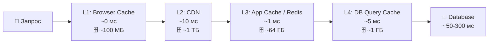
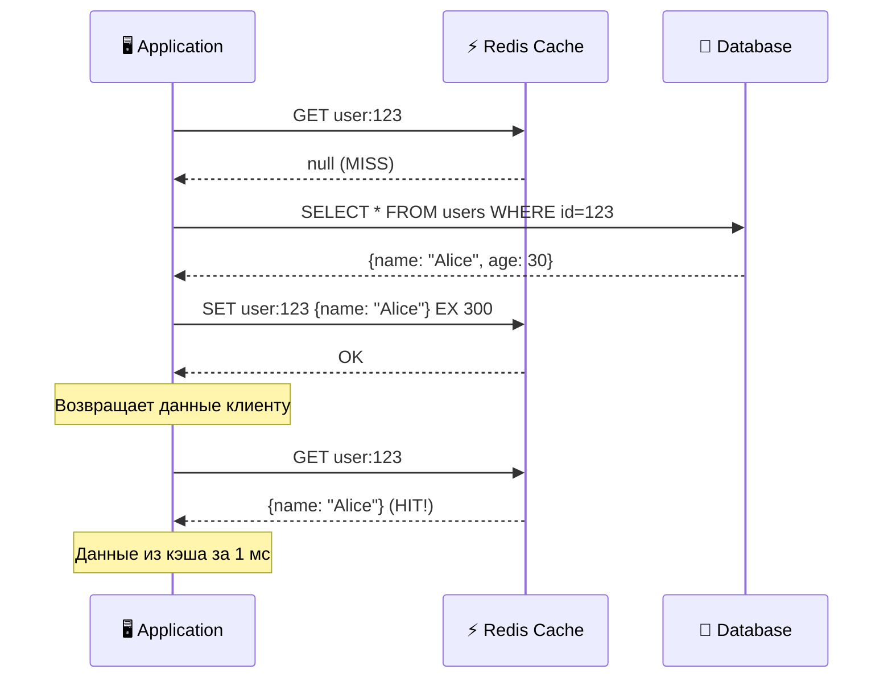
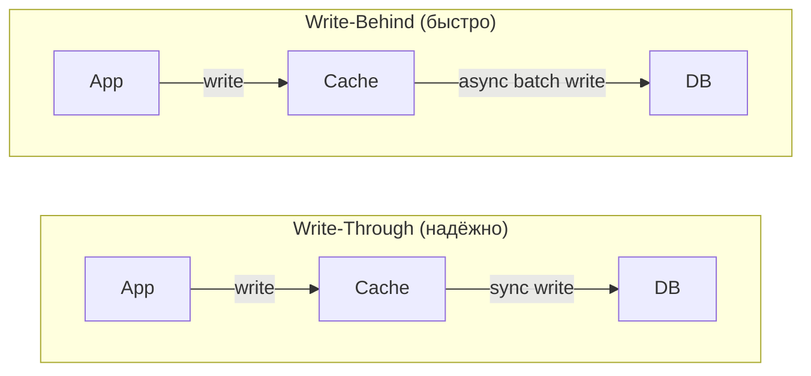

# 🔥 Уровень 3: Кэширование

## 🎯 Зачем нужен кэш?

Представьте: ваш рабочий стол — это кэш, а архив на другом конце города — это база данных. Каждый раз, когда нужна справка, вы можете сходить в архив (300 мс) или заглянуть в ящик стола (1 мс). **Кэш — это ящик стола**, куда вы складываете копии часто нужных документов.

Без кэша каждый из 100 000 пользователей, открывающих главную страницу, генерирует один и тот же SQL-запрос. С кэшем — запрос к БД делается один раз, остальные получают результат из памяти.

```
Без кэша:                          С кэшем:
100 000 запросов → 100 000 SQL     100 000 запросов → 1 SQL + 99 999 из кэша
Latency: ~300 мс                   Latency: ~1 мс (99.999%)
DB нагрузка: 100%                  DB нагрузка: ~0.001%
```

## 🔥 Многоуровневый кэш

Запрос проходит через несколько слоёв кэша — от самого быстрого (и маленького) до самого медленного (и большого). Если на текущем уровне данные не найдены (**cache miss**), запрос спускается ниже.



**Cache hit** — данные нашлись в кэше (быстро). **Cache miss** — данные не нашлись, идём дальше (медленно).

📌 **Cache hit ratio** = hits / (hits + misses). Хороший показатель — **95%+**. Если hit ratio < 80%, кэш работает плохо: тратит память, но не экономит время.

### Уровни кэширования на практике

| Уровень | Что кэшируется | TTL | Размер | Latency |
|---|---|---|---|---|
| Browser Cache | Статика (JS, CSS, изображения) | Часы—дни | ~100 МБ | 0 мс |
| CDN | Статика + API-ответы | Минуты—часы | Терабайты | 10-50 мс |
| Application (Redis) | Сессии, результаты запросов | Секунды—минуты | Гигабайты | 0.5-2 мс |
| DB Query Cache | Результаты SQL | Автоинвалидация | ~1 ГБ | 5-10 мс |

## 🔥 Паттерны кэширования

### Cache-Aside (Lazy Loading)

Самый популярный паттерн. Приложение само управляет кэшем: проверяет, читает из БД при промахе, записывает в кэш.



```typescript
async function getUser(id: string) {
  // 1. Проверяем кэш
  const cached = await redis.get(`user:${id}`)
  if (cached) return JSON.parse(cached) // Cache HIT

  // 2. Cache MISS — читаем из БД
  const user = await db.query('SELECT * FROM users WHERE id = $1', [id])

  // 3. Сохраняем в кэш на 5 минут
  await redis.set(`user:${id}`, JSON.stringify(user), 'EX', 300)

  return user
}
```

**Плюсы:** простота, кэшируется только то, что реально запрашивают.
**Минусы:** первый запрос всегда медленный (cold start), данные могут быть устаревшими.

### Read-Through

Кэш сам ходит в БД при промахе. Приложение работает только с кэшем и не знает про БД.

```
Cache-Aside:                    Read-Through:
App → Cache (miss)              App → Cache (miss)
App → DB                              Cache → DB
App → Cache (write)                   Cache ← DB (автозаполнение)
App ← данные                   App ← данные из кэша
```

**Плюс:** код приложения проще — всегда работаешь с кэшем.
**Минус:** нужна поддержка со стороны кэша (например, NCache, Hazelcast). Redis из коробки так не умеет.

### Write-Through

Запись идёт сначала в кэш, кэш **синхронно** записывает в БД. Данные в кэше всегда актуальны.

### Write-Behind (Write-Back)

Запись идёт в кэш, а в БД — **асинхронно** с задержкой. Быстрее, но рискованнее.



### Сравнение паттернов

| Паттерн | Чтение | Запись | Консистентность | Сложность |
|---|---|---|---|---|
| Cache-Aside | App → Cache → DB | App → DB (кэш обновляется лениво) | Eventual | Низкая |
| Read-Through | App → Cache (кэш сам идёт в DB) | — | Eventual | Средняя |
| Write-Through | — | App → Cache → DB (синхронно) | Сильная | Средняя |
| Write-Behind | — | App → Cache → DB (асинхронно) | Слабая | Высокая |

💡 **На практике** комбинируют: **Cache-Aside для чтения** + **Write-Through для записи** — самая популярная комбинация.

## 🔥 Стратегии инвалидации кэша

> «В информатике есть только две сложные вещи: инвалидация кэша и именование» — Фил Карлтон

### TTL (Time-To-Live)

Самый простой подход — данные «протухают» через заданное время.

```bash
# Redis: установить ключ с TTL 5 минут (300 секунд)
SET user:123 '{"name":"Alice"}' EX 300

# Проверить оставшееся время
TTL user:123
# → 287 (осталось 287 секунд)
```

**Как выбрать TTL:**
- Статика (логотип, шрифты): **дни—недели** (86400-604800 с)
- Каталог товаров: **минуты—часы** (300-3600 с)
- Профиль пользователя: **минуты** (60-300 с)
- Курсы валют, биржевые данные: **секунды** (5-30 с)

### Event-Based инвалидация

При изменении данных — немедленно удаляем/обновляем кэш.

```typescript
async function updateUser(id: string, data: UserData) {
  // 1. Обновляем БД
  await db.query('UPDATE users SET name=$1 WHERE id=$2', [data.name, id])

  // 2. Инвалидируем кэш (удаляем, а не обновляем!)
  await redis.del(`user:${id}`)

  // Следующий запрос на чтение подтянет свежие данные из БД
}
```

📌 **Почему `DEL`, а не `SET`?** Паттерн «delete on write» проще и надёжнее. При обновлении кэша можно записать устаревшую версию (race condition). При удалении — следующее чтение гарантированно получит свежие данные.

### Versioned Keys

Меняем версию ключа вместо удаления — старый ключ просто «забывается».

```typescript
// Версия в ключе
const version = await redis.get('products:version') // "v42"
const products = await redis.get(`products:${version}`)

// При обновлении — инкрементируем версию
await redis.incr('products:version') // "v43"
// Старый ключ products:v42 протухнет по TTL
```

## 🔥 Eviction Policies: что удалять, когда кэш полон?

Память ограничена. Когда кэш заполнен и приходит новый элемент — нужно кого-то «выселить».

```bash
# Redis: максимум 2 ГБ памяти, стратегия LRU
maxmemory 2gb
maxmemory-policy allkeys-lru
```

| Политика | Принцип | Когда использовать |
|---|---|---|
| **LRU** (Least Recently Used) | Удаляем давно не запрашивавшееся | Универсальная, по умолчанию |
| **LFU** (Least Frequently Used) | Удаляем редко запрашивавшееся | Когда есть «горячие» ключи |
| **FIFO** (First In First Out) | Удаляем самое старое | Простые сценарии |
| **Random** | Удаляем случайный | Когда все ключи равнозначны |
| **TTL-based** | Удаляем с наименьшим TTL | Разные приоритеты по TTL |

**Аналогия:** холодильник заполнен.
- **LRU** — выбрасываем то, что дольше всего не доставали
- **LFU** — выбрасываем то, что реже всего едим
- **FIFO** — выбрасываем самые старые продукты

💡 **LRU vs LFU:** LRU лучше для «потоковых» данных (новости, лента). LFU лучше, когда есть стабильно популярные элементы (топ товаров). Redis по умолчанию использует **approximated LRU** (с сэмплированием), а с версии 4.0 — **LFU**.

## 🔥 Проблемы кэширования

### Cache Stampede (Thundering Herd)

**Проблема:** популярный ключ протух, тысячи запросов одновременно идут в БД.

```
TTL истёк для "hot_product:1" (1 000 000 просмотров/мин)
    │
    ▼
Поток 1: cache miss → SELECT * FROM products...
Поток 2: cache miss → SELECT * FROM products...  ← ОДИНАКОВЫЙ ЗАПРОС!
Поток 3: cache miss → SELECT * FROM products...
...
Поток 1000: cache miss → SELECT * FROM products...
    │
    ▼
💥 БД перегружена 1000 одинаковыми запросами
```

**Решения:**

```typescript
// 1. Mutex/Lock — только один поток обновляет кэш
async function getWithLock(key: string) {
  const cached = await redis.get(key)
  if (cached) return JSON.parse(cached)

  // Пытаемся захватить лок (NX = only if not exists, EX = TTL 10 сек)
  const lockAcquired = await redis.set(`lock:${key}`, '1', 'NX', 'EX', 10)

  if (lockAcquired) {
    // Мы захватили лок — обновляем кэш
    const data = await db.query(/* ... */)
    await redis.set(key, JSON.stringify(data), 'EX', 300)
    await redis.del(`lock:${key}`)
    return data
  } else {
    // Лок занят — ждём и пробуем из кэша
    await sleep(50)
    return getWithLock(key) // retry
  }
}

// 2. Стохастическая досрочная перезагрузка (XFetch)
// Обновляем кэш ДО истечения TTL с вероятностью, зависящей от оставшегося времени
async function getWithEarlyRefresh(key: string) {
  const { value, ttl } = await redis.getWithTTL(key)
  if (value && ttl > 30) return JSON.parse(value)

  // TTL < 30 сек — с вероятностью обновляем досрочно
  if (value && Math.random() < Math.exp(-ttl / 10)) {
    refreshInBackground(key) // без блокировки
  }
  return value ? JSON.parse(value) : await refreshAndReturn(key)
}
```

### Cache Penetration

**Проблема:** запросы к несуществующим ключам ВСЕГДА проходят мимо кэша в БД.

```
Атакующий: GET /user/9999999999 (не существует)
Cache: miss → DB: null → не кэшируем → следующий запрос опять в DB!
```

**Решения:**

```typescript
// 1. Кэширование null/пустых ответов
const user = await db.query('SELECT * FROM users WHERE id = $1', [id])
if (!user) {
  // Кэшируем "не найдено" с коротким TTL
  await redis.set(`user:${id}`, 'NULL', 'EX', 60)
  return null
}

// 2. Bloom Filter — проверяем существование ДО кэша
// Bloom filter: "возможно существует" или "точно НЕ существует"
if (!bloomFilter.mightContain(id)) {
  return null // Точно нет — не тратим время на кэш и БД
}
```

### Cache Avalanche

**Проблема:** множество ключей протухают одновременно → лавина запросов в БД.

```typescript
// ❌ Все ключи с одинаковым TTL — протухнут одновременно!
await redis.set('product:1', data, 'EX', 3600)
await redis.set('product:2', data, 'EX', 3600)
await redis.set('product:3', data, 'EX', 3600)

// ✅ Jitter — случайный разброс TTL
function ttlWithJitter(baseTTL: number): number {
  const jitter = Math.floor(Math.random() * baseTTL * 0.1) // ±10%
  return baseTTL + jitter
}
await redis.set('product:1', data, 'EX', ttlWithJitter(3600)) // 3600-3960
await redis.set('product:2', data, 'EX', ttlWithJitter(3600)) // 3600-3960
await redis.set('product:3', data, 'EX', ttlWithJitter(3600)) // 3600-3960
```

## 🔥 HTTP-кэширование и CDN

### HTTP Cache Headers

Браузер и CDN управляются HTTP-заголовками:

```
# Статика — агрессивное кэширование
Cache-Control: public, max-age=31536000, immutable
# "public" — CDN может кэшировать
# "max-age=31536000" — 1 год
# "immutable" — не перепроверять

# API-ответы — короткое кэширование с ревалидацией
Cache-Control: private, max-age=0, must-revalidate
ETag: "v2-abc123"
# "private" — только браузер, не CDN
# "must-revalidate" — проверять свежесть при каждом запросе

# Без кэширования вообще
Cache-Control: no-store
```

### ETag и условные запросы

```
Первый запрос:
  GET /api/products
  → 200 OK
  → ETag: "abc123"
  → [100 КБ данных]

Повторный запрос:
  GET /api/products
  If-None-Match: "abc123"
  → 304 Not Modified   ← данные не изменились, тело не передаётся!
  → [0 КБ — экономия трафика]
```

### CDN Caching

CDN (Cloudflare, CloudFront, Fastly) — глобально распределённый кэш. Edge-серверы расположены близко к пользователям.

```
Пользователь в Токио:
  Без CDN:  Токио → Нью-Йорк (200 мс RTT) → ответ
  С CDN:    Токио → Edge Токио (5 мс) → ответ из кэша

  Если на Edge нет кэша:
  Токио → Edge Токио (miss) → Origin Нью-Йорк → Edge Токио (cache) → ответ
  Следующий запрос: Токио → Edge Токио (hit) → ответ за 5 мс
```

## 🔥 Redis vs Memcached

| Критерий | Redis | Memcached |
|---|---|---|
| Структуры данных | Strings, Lists, Sets, Hashes, Sorted Sets, Streams | Только strings |
| Персистенция | RDB + AOF | Нет |
| Репликация | Master-Replica | Нет |
| Кластеризация | Redis Cluster (16384 слота) | Client-side sharding |
| Pub/Sub | Да | Нет |
| Lua-скрипты | Да | Нет |
| Многопоточность | Однопоточный (I/O threads с 6.0) | Многопоточный |
| Макс. размер value | 512 МБ | 1 МБ |

💡 **Когда Memcached лучше:** простое кэширование строк, максимальная утилизация многоядерных CPU, огромное количество мелких ключей. **Во всех остальных случаях — Redis.**

## 🔥 Cache Warming (прогрев кэша)

После деплоя или рестарта кэш пуст — все запросы идут в БД (**cold start**). Прогрев — предзаполнение кэша популярными данными.

```typescript
async function warmCache() {
  // Топ-1000 популярных товаров
  const popular = await db.query(
    'SELECT * FROM products ORDER BY views DESC LIMIT 1000'
  )
  for (const product of popular) {
    await redis.set(
      `product:${product.id}`,
      JSON.stringify(product),
      'EX', 3600
    )
  }
  console.log('Cache warmed: 1000 products loaded')
}
```

## ⚠️ Частые ошибки новичков

### 🐛 1. Кэшируют всё подряд

```typescript
// ❌ Кэшировать данные, которые запрашивают раз в день
await redis.set(`rare_report:${id}`, data, 'EX', 3600)
// Занимает память, hit ratio близок к нулю
```

> **Почему это ошибка:** кэш эффективен только для часто запрашиваемых данных. Кэширование «холодных» данных тратит память и вытесняет «горячие» ключи.

```typescript
// ✅ Кэшировать только «горячие» данные
// Правило: если данные запрашиваются > 10 раз за период TTL — кэшируем
await redis.set(`popular_product:${id}`, data, 'EX', 300)
```

### 🐛 2. Одинаковый TTL для всех ключей

```typescript
// ❌ Все ключи протухнут одновременно → cache avalanche
const TTL = 3600
await redis.set('key1', data1, 'EX', TTL)
await redis.set('key2', data2, 'EX', TTL)
await redis.set('key3', data3, 'EX', TTL)
```

> **Почему это ошибка:** одновременная инвалидация тысяч ключей создаёт лавину запросов в БД.

```typescript
// ✅ TTL с jitter
function ttl(base: number) {
  return base + Math.floor(Math.random() * base * 0.2)
}
await redis.set('key1', data1, 'EX', ttl(3600))
await redis.set('key2', data2, 'EX', ttl(3600))
```

### 🐛 3. Обновляют кэш вместо удаления

```typescript
// ❌ Race condition при обновлении кэша
// Поток 1: читает user v1 из БД
// Поток 2: обновляет user → v2, записывает v2 в кэш
// Поток 1: записывает v1 в кэш (ПЕРЕЗАТИРАЕТ v2!)

async function updateUser(id: string, data: UserData) {
  await db.update(id, data)
  const user = await db.get(id)
  await redis.set(`user:${id}`, JSON.stringify(user)) // ❌ Гонка!
}
```

> **Почему это ошибка:** между чтением из БД и записью в кэш другой поток может обновить данные, и в кэше окажется устаревшая версия.

```typescript
// ✅ Удаляем ключ — следующее чтение подтянет свежие данные
async function updateUser(id: string, data: UserData) {
  await db.update(id, data)
  await redis.del(`user:${id}`) // ✅ Delete, not set
}
```

### 🐛 4. Не защищаются от cache stampede

```typescript
// ❌ Популярный ключ протух → 10 000 одновременных запросов в БД
async function getProduct(id: string) {
  const cached = await redis.get(`product:${id}`)
  if (cached) return JSON.parse(cached)
  const product = await db.get(id) // 10 000 одинаковых запросов!
  await redis.set(`product:${id}`, JSON.stringify(product), 'EX', 300)
  return product
}
```

> **Почему это ошибка:** без лока все конкурентные запросы при промахе пойдут в БД одновременно.

```typescript
// ✅ Mutex lock — только один запрос обновляет кэш
async function getProduct(id: string) {
  const cached = await redis.get(`product:${id}`)
  if (cached) return JSON.parse(cached)

  const lock = await redis.set(`lock:product:${id}`, '1', 'NX', 'EX', 10)
  if (lock) {
    const product = await db.get(id)
    await redis.set(`product:${id}`, JSON.stringify(product), 'EX', 300)
    await redis.del(`lock:product:${id}`)
    return product
  }
  await sleep(50)
  return getProduct(id) // retry — к этому моменту кэш обновлён
}
```

## 📌 Итоги

- ✅ **Cache-Aside** — самый популярный паттерн: приложение управляет кэшем, ходит в БД при miss
- ✅ **Write-Through** — надёжная запись (кэш → БД синхронно), **Write-Behind** — быстрая (асинхронно)
- ✅ **TTL с jitter** — защита от cache avalanche
- ✅ **Mutex lock** — защита от cache stampede
- ✅ **Кэширование null** и **Bloom Filter** — защита от cache penetration
- ✅ **LRU** — универсальная стратегия вытеснения, **LFU** — для «горячих» ключей
- ✅ **HTTP-заголовки** Cache-Control, ETag — кэширование в браузере и CDN
- ✅ **Redis** — выбор по умолчанию (структуры данных, персистенция, pub/sub)
- 📌 Кэшируйте только «горячие» данные — следите за hit ratio (>95%)
- 📌 Удаляйте ключ при записи (delete on write), не обновляйте
- 📌 Cache warming — прогревайте кэш после деплоя
- 📌 Многоуровневый кэш (Browser → CDN → Redis → DB) — разные TTL на каждом уровне
