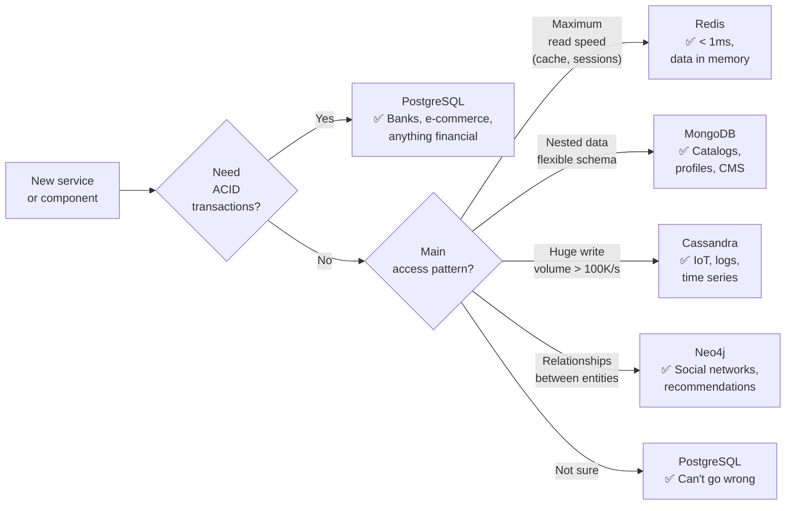
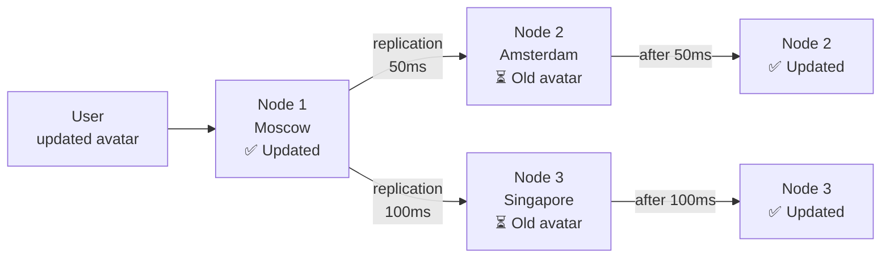
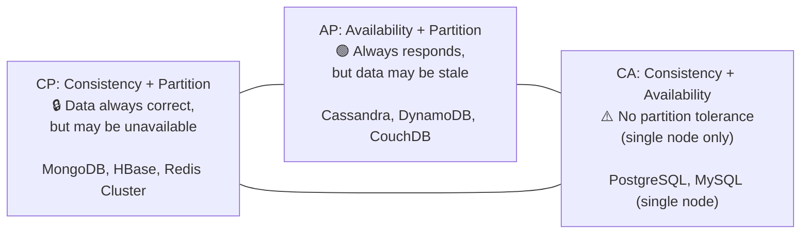
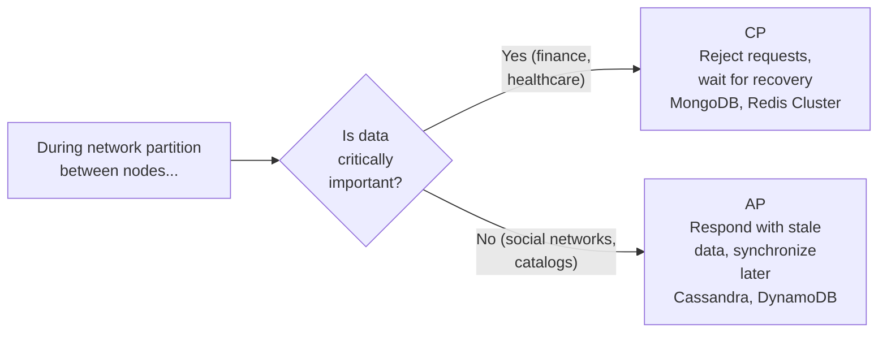
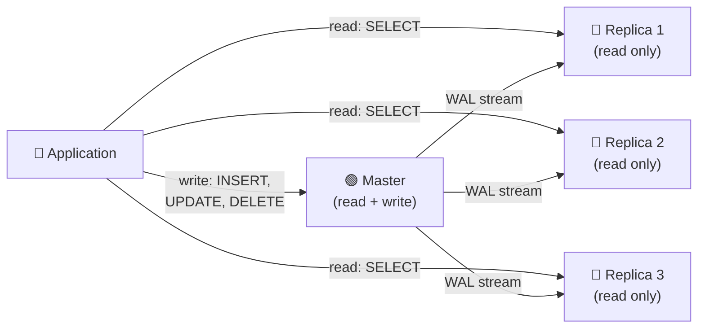
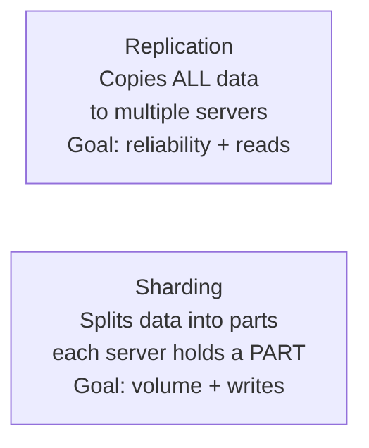
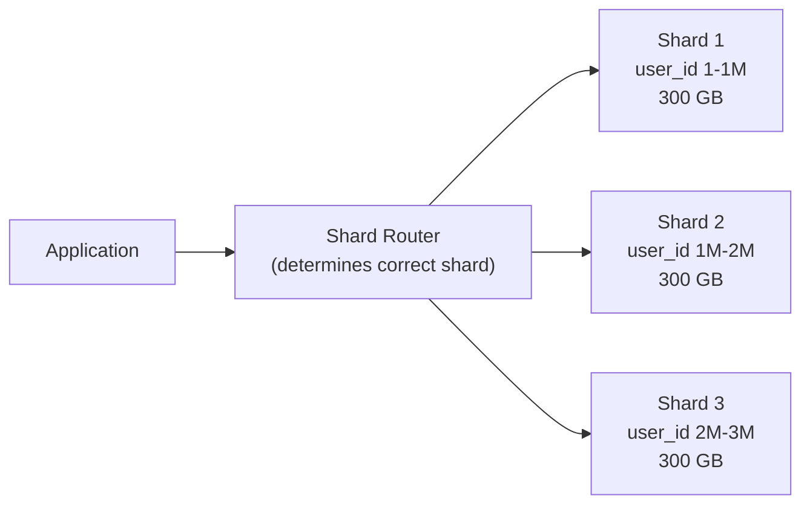
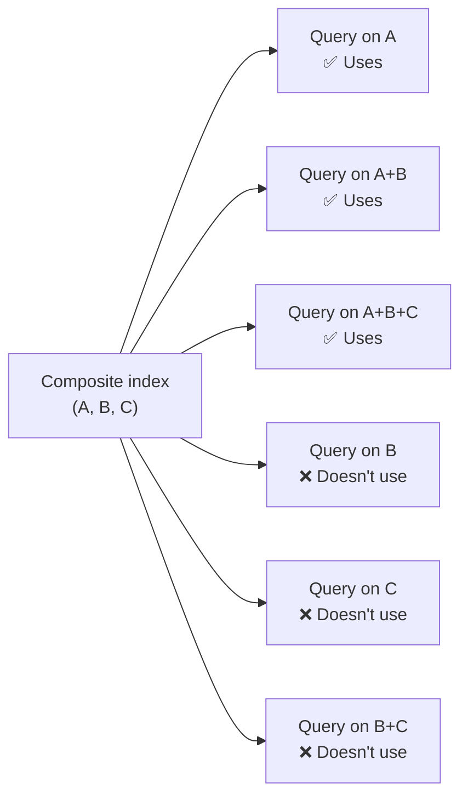
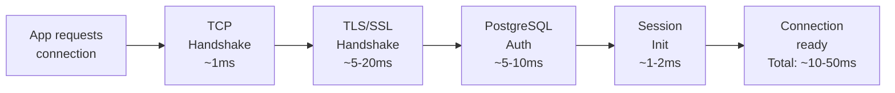

# Level 4: Databases and Storage -- SQL, NoSQL, Sharding, and Replication

## Introduction

Imagine building a library. A small neighborhood library -- a few thousand books, one librarian, one room. Everything is simple: come in, ask, get the book. Now imagine building a national library with billions of books, thousands of simultaneous readers, branches across the country. Different storage rules, different catalogs, different space organization are needed.

Databases work the same way. A startup with 500 users and a global service with 500 million -- these are fundamentally different tasks. **Choosing a database type, replication strategy, and sharding approach is one of the most long-lasting architectural decisions.** Migrating 100 million records from PostgreSQL to MongoDB on a production server without downtime is not a one-day task -- it's months of planning and weeks of execution.

In this level we will cover:

1. **SQL vs NoSQL** -- not "which is better" but "which fits which task"
2. **ACID vs BASE** -- two approaches to consistency guarantees
3. **CAP theorem** -- the physical limit of distributed systems
4. **Replication** -- how to copy data for reliability and speed
5. **Sharding** -- how to split data when one machine can't handle it
6. **Indexing** -- how to make queries fast
7. **Connection Pooling** -- why DB connections are expensive
8. **Query Optimization** -- how to read query plans and fix slow queries

---

## 1. SQL vs NoSQL -- When to Choose What

### Why NoSQL Appeared at All

Until the 2000s, relational databases were the only mainstream option. PostgreSQL, MySQL, Oracle -- all stored data in tables with strict schemas. Then social networks and internet giants emerged with tasks for which the relational model was inconvenient or slow:

- **Facebook** stores user posts -- different posts have different attributes (text, photos, videos, polls). In SQL, you'd need either one huge table with lots of NULL columns, or a complex table hierarchy.
- **Amazon** needs hundreds of thousands of write operations per second for carts and sessions. Strict ACID and SQL transaction locks create a bottleneck.
- **Netflix** stores user ratings and recommendations -- the "user → liked movie → similar to movie" relationships are more naturally described by a graph than by tables.

NoSQL emerged not because SQL is "bad" -- but because different tasks have different requirements for data structure and consistency guarantees.

### Relational Databases (SQL)

PostgreSQL, MySQL, Oracle -- data stored in **tables** with strict schema. Relationships between tables through **JOIN**.

The main strength of relational databases -- **normalization** and **transactions**. Normalization means: each fact is stored in one place. If a user's name changed -- change one row, and all orders, comments, logs automatically "see" the new name through JOIN.

```sql
-- Strict schema: all records have the same structure
CREATE TABLE users (
  id SERIAL PRIMARY KEY,
  name VARCHAR(100) NOT NULL,
  email VARCHAR(255) UNIQUE NOT NULL,
  created_at TIMESTAMP DEFAULT NOW()
);

-- JOIN -- the power of relational databases: one query pulls data from three tables
SELECT u.name, COUNT(o.id) as orders
FROM users u
LEFT JOIN orders o ON u.id = o.user_id
GROUP BY u.name
HAVING COUNT(o.id) > 5;
```

What happens during a JOIN: the database takes rows from the `users` table, finds corresponding rows in `orders` by the condition `u.id = o.user_id`, combines them, and applies aggregation. This is an expensive operation, but it's performed on the database side, not in the application.

**When SQL:** transactions (banks, e-commerce), complex analytical queries with JOIN, strict consistency, data with clear relationships.

### NoSQL -- Four Completely Different Worlds

The word "NoSQL" is misleading: it unites technologies with fundamentally different data models. MongoDB and Redis -- both NoSQL, but they solve different tasks just as a hammer and a violin -- both are tools, but for different purposes.

| Type | Examples | Data Model | When to Use |
|---|---|---|---|
| **Document** | MongoDB, CouchDB | JSON documents, nested structures | Catalogs, profiles, CMS -- when data is "nested" |
| **Key-Value** | Redis, DynamoDB | Key → value (string, number, JSON) | Cache, sessions, carts -- maximum speed |
| **Column-Family** | Cassandra, HBase | Rows with dynamic columns | Time series, IoT, logs -- huge write volumes |
| **Graph** | Neo4j, Amazon Neptune | Nodes + edges (first-class relationships) | Social networks, recommendations, fraud detection -- relationships matter more than data |

#### Document DB: Data as JSON

The document model stores each "object" as a single document. Plus -- no JOIN needed: all user data lies in one document, read in one query. Minus -- duplication: if a product category name changed, thousands of order documents need updating.

```typescript
// Document (MongoDB) -- nested structure, no JOIN
const user = {
  _id: ObjectId('...'),
  name: 'Alice',
  address: { city: 'Moscow', street: 'Tverskaya' },
  orders: [
    { product: 'Laptop', price: 1200, date: '2024-01-15' },
    { product: 'Mouse', price: 25, date: '2024-02-01' }
  ]
}
// One query -- entire profile with all orders
const alice = await db.users.findOne({ name: 'Alice' })
```

#### Key-Value: Maximum Simplicity and Speed

Redis stores data as "key → value" pairs in RAM. Speed -- microseconds. This isn't a "replacement" for a relational DB -- it's a completely different tool for a different task: cache, sessions, queues, counters.

```typescript
// Key-Value (Redis) -- maximum speed, data in memory
await redis.set('session:abc123', JSON.stringify({ userId: 42, role: 'admin' }), 'EX', 3600)
await redis.get('session:abc123') // < 1ms

// Redis can do more than just get/set
await redis.incr('pageviews:homepage')        // atomic counter
await redis.lpush('queue:emails', emailJson)  // queue
await redis.setbit('active_users:2024-01-15', userId, 1) // bitmap
```

#### Column-Family: For Huge Write Volumes

Cassandra is optimized for writes -- it accepts hundreds of thousands of writes per second, distributing them across the cluster. Data is organized not in rows/tables, but in "rows with dynamic columns." Ideal for time series: each "sensor" is a row, each measurement is a column with a timestamp.

```
Cassandra: sensor_readings table
  Row key: sensor_id
  Columns: 2024-01-15T10:00:00 → 22.5, 2024-01-15T10:01:00 → 22.7, ...

  sensor_001 | 10:00→22.5 | 10:01→22.7 | 10:02→22.3 | ... (thousands of columns)
  sensor_002 | 10:00→18.1 | 10:01→18.3 | ...
```

#### Graph: When Relationships Matter More Than Data

Neo4j stores not tables, but a graph -- nodes (entities) and edges (relationships). The query "friends of friends who bought the same product" -- is one Cypher query. In SQL this would require four JOINs and a complex subquery.

```typescript
// Graph (Neo4j) -- first-class relationships
// "Friends of friends who bought the same product" -- 1 query
// MATCH (me:User {id: 42})-[:FRIEND]->()-[:FRIEND]->(fof:User)
//       -[:BOUGHT]->(p:Product)<-[:BOUGHT]-(me)
// WHERE NOT (me)-[:FRIEND]->(fof)
// RETURN fof, p, COUNT(*) as common_purchases
// ORDER BY common_purchases DESC
```

### Database Selection Flowchart



**Main rule:** don't choose a database based on hype. MongoDB in 2012 was at peak hype -- many companies migrated to it, then migrated back to PostgreSQL when their data schema stabilized. Choose based on the **data access pattern**.

---

## 2. ACID vs BASE -- Two Approaches to Guarantees

### Why Guarantees Are Needed

Imagine a bank transfer: withdraw 100 rubles from one account and credit it to another. What happens if the server crashes after the withdrawal but before the credit? Without guarantees -- the 100 rubles disappear. That's why ACID was invented.

### ACID (SQL databases) -- A Notarized Deal

**Analogy:** ACID is a notarized deal. Expensive, slow, with lots of paperwork. But after completion you have an ironclad guarantee: the deal either happened fully or didn't happen at all.

| Property | Meaning | Real-Life Example |
|---|---|---|
| **A**tomicity | Transaction executes entirely or not at all | Transfer: withdrawal + credit -- either both or neither |
| **C**onsistency | After transaction, data is in valid state | Balance can't become negative (constraint) |
| **I**solation | Parallel transactions don't see intermediate results | Two simultaneous transfers don't lose money |
| **D**urability | Committed data won't be lost | After `COMMIT`, data is on disk, even on crash |

```sql
-- Bank transfer -- classic ACID example
BEGIN;
  UPDATE accounts SET balance = balance - 100 WHERE id = 1;
  UPDATE accounts SET balance = balance + 100 WHERE id = 2;
  -- If any UPDATE fails → ROLLBACK, both balances unchanged
COMMIT;

-- What happens under the hood during COMMIT:
-- 1. DB writes transaction to WAL (Write-Ahead Log) on disk
-- 2. Applies changes to data pages
-- 3. Only after WAL write returns OK to client
-- 4. On crash, DB recovers from WAL, nothing is lost
```

**Isolation levels** -- a nuance that's often missed. ACID doesn't mean "full isolation": there are four levels, and each successive one is more expensive in performance.

| Level | Dirty Read | Non-repeatable Read | Phantom Read | When to Use |
|---|---|---|---|---|
| **Read Uncommitted** | Possible | Possible | Possible | Almost never |
| **Read Committed** | No | Possible | Possible | Most cases (default in PostgreSQL) |
| **Repeatable Read** | No | No | Possible | Reports, aggregations |
| **Serializable** | No | No | No | Financial transactions |

### BASE (NoSQL databases) -- A Handshake

**Analogy:** BASE is a handshake between partners. Fast, informal, no paperwork. Both know they agreed, but if one later says "I didn't say that" -- it's hard to prove.

| Property | Meaning |
|---|---|
| **B**asically **A**vailable | System always responds (may return stale data) |
| **S**oft state | State may change over time without external intervention |
| **E**ventual consistency | Data will "eventually" become consistent across all nodes |



**Eventual consistency in practice:** you updated your avatar on a social network. A friend in another city sees the old avatar for another 5 seconds -- they're reading from the nearest node, which hasn't received the update yet. After a few seconds, all nodes synchronize. For a social network this is **normal**. For a bank transfer -- a **disaster**.

### ACID or BASE -- How to Choose

The question isn't about what's "better." It's about which error you're willing to accept:

- **ACID:** the system may be slower or temporarily unavailable -- but data is always correct
- **BASE:** the system is always fast and available -- but data may be seconds stale

For finance, healthcare, legal systems -- ACID. For social networks, catalogs, analytics, caches -- BASE is quite acceptable.

---

## 3. CAP Theorem -- The Physical Limit

### What CAP Is and Why It Matters

CAP theorem (Brewer's theorem, 2000) -- a mathematically proven fact about distributed systems. It says: in a distributed system during a network partition, you **must** choose between consistency and availability.

**Analogy:** two bank branches in different cities. The connection between them is severed. A client in Moscow wants to withdraw money. What to do?
- **CP (choose consistency):** "Sorry, we can't process the operation until the connection to the central office is restored." You're unavailable, but data is accurate.
- **AP (choose availability):** "Sure, we're processing it. We'll synchronize with the other branch later." You're available, but if the client simultaneously withdrew money from both branches -- a discrepancy will arise.

- **C**onsistency -- all nodes see the same data at the same time
- **A**vailability -- every request gets a response (not necessarily fresh)
- **P**artition tolerance -- system works despite loss of communication between nodes



**Partition tolerance cannot be "turned off"** in a distributed system -- the network WILL break. Cables break, data centers lose connection, routers get overloaded. So the real choice is: **CP or AP**.

### Why CA Practically Doesn't Exist

Single-node PostgreSQL is a CA system: always consistent, always available, but doesn't tolerate network partitions because there's nothing to partition -- there's only one server. As soon as you add a second node, you automatically enter the CAP triangle and must choose between C and A when partition P occurs.

### How to Decide CP vs AP



**Practical advice:** most modern systems are hybrid. Cassandra allows setting consistency level per query separately: `QUORUM` for important data, `ONE` for analytics. DynamoDB offers "strongly consistent reads" as an option. CAP represents extreme cases; real systems operate across a wide spectrum between them.

---

## 4. Replication

### What Replication Is and Why It's Needed

Replication -- **copying data** to multiple servers. Two reasons:

1. **Fault tolerance:** if one server goes down -- data won't be lost, another takes over the load
2. **Read scaling:** read queries are distributed across multiple servers

**Analogy:** imagine a notary archive. One copy of a document is a risk (fire, theft). Three copies in different locations -- reliability. And two "reading" copies can work in different cities: each office works with the nearest copy.

### Master-Slave (Primary-Replica) -- Most Popular Scheme

One Master accepts all writes. Slave nodes receive a copy of the data through a replication stream and serve read queries.



**What happens under the hood during PostgreSQL replication:**
1. Master writes the change to WAL (Write-Ahead Log)
2. WAL-sender sends records to the replica over TCP
3. WAL-receiver on the replica receives and applies changes to its data
4. Replica confirms receipt (sync) or doesn't confirm (async)

```
Pros:                                Cons:
✅ Read scaling (N slaves)           ❌ Master -- single point of failure for writes
✅ Simple setup                      ❌ Replication lag (slave is behind)
✅ Heavy reports on replica --       ❌ Writes don't scale horizontally
   don't load the master
✅ Automatic failover                ❌ Data loss possible on failover
   (Patroni, pg_auto_failover)          (async replication)
```

### Replication Lag -- The Main Pain of Master-Slave

**Replication lag** is the delay between writing on the master and data appearing on replicas. Usually -- milliseconds. Under high load -- seconds.

```
"Read-your-own-writes" scenario:
  1. User changes name: PUT /api/users/42 { name: "Alice" }
     → Write goes to Master ✅
  2. User reloads page: GET /api/users/42
     → Read goes to Replica 1 (which hasn't received the update yet)
     → User sees old name "Alex" ❌

Solution -- Read-Your-Writes:
  After writing, read from Master for N seconds,
  or use Session Consistency (routing by session_id)
```

### Synchronous vs Asynchronous Replication

```
Asynchronous (default):
  Client → Master wrote → OK to client
  Master → Replica (in background, with delay)
  Advantage: fast. Risk: if master crashes before replication -- data is lost.

Synchronous:
  Client → Master wrote → waits for Replica confirmation → OK to client
  Advantage: zero data loss. Risk: if replica is slow -- master is also slow.

Quorum (compromise):
  Confirmation required from majority of replicas (e.g., 2 out of 3).
  Cassandra, MongoDB Replica Set use this approach.
```

### Master-Master (Multi-Master) -- Scaling Writes

Multiple nodes accept both reads and writes. Scales writes but creates conflicts -- the main complexity of this scheme.

```
Master 1 (Moscow): UPDATE users SET name='Alice' WHERE id=42
Master 2 (London): UPDATE users SET name='Bob'   WHERE id=42
(both executed the operation simultaneously, before synchronization)
    │
    ▼
💥 Conflict! Whose UPDATE wins?

Conflict resolution strategies:
  • Last-Write-Wins (LWW) -- by timestamp. Simple, but loses data (both updates are valid)
  • CRDT (Conflict-free Replicated Data Types) -- mathematically conflict-free structures
  • Application-level -- application compares versions and decides. Flexible, more complex code
  • Operational Transformation -- used in Google Docs (real-time editing)
```

**Master-Master is not a silver bullet.** Most companies avoid it due to conflict resolution complexity. Instead, **sharding** is often used: each shard is a separate Master-Slave cluster, writes scale through different shards.

---

## 5. Sharding

### Replication vs Sharding -- What's the Difference

These are different solutions to different problems:



Replication: all three replicas store the same 1 TB of data. Sharding: three shards store ~333 GB each, totaling 1 TB.

### When Sharding Is Necessary

**Analogy:** a neighborhood library with one room manages fine. A giant city library opens 10 rooms: "Literature," "Technology," "History"... Each room has its own catalog, its own shelves, its own librarian. The question "where is the SQL book stored?" is answered first by routing to the right room, and then -- searching the catalog there.



### Sharding Strategies

| Strategy | Principle | Pros | Cons |
|---|---|---|---|
| **Range** | By key range (id 1-1M, 1M-2M) | Simple range queries, convenient rebalancing | Hot spots (new data on one shard) |
| **Hash** | hash(key) % N | Even distribution | Range queries impossible, expensive rebalancing |
| **Directory** | Lookup table: key → shard | Flexibility, any sharding logic | Lookup table -- bottleneck and single point of failure |
| **Geographic** | By region (EU → shard 1, US → shard 2) | Low latency for regional users | Uneven load between regions |

### Hot Spots -- Why Range Sharding Is Dangerous

```
Range sharding by registration date:
  Shard 1: January 2022 -- 500K users, 100 req/s (old data, less active)
  Shard 2: January 2023 -- 500K users, 5,000 req/s
  Shard 3: January 2024 -- 500K users, 50,000 req/s ← 🔥 HOT SPOT!

All new registrations, all active audience -- on the last shard.
First two shards idle, third is overloaded.
```

**Solution:** hash-based sharding. `hash(user_id) % 3` will distribute new and old users evenly, regardless of registration time.

### Consistent Hashing -- Smart Sharding During Scaling

Regular hash creates a problem when adding a new shard:

```
3 shards before: hash(key) % 3
  key=100 → 100 % 3 = 1 → Shard 1
  key=101 → 101 % 3 = 2 → Shard 2

Added 4th shard: hash(key) % 4
  key=100 → 100 % 4 = 0 → Shard 0 ← was on Shard 1!
  key=101 → 101 % 4 = 1 → Shard 1 ← was on Shard 2!

~75% of all keys change their shard!
With 10 TB of data -- 7.5 TB needs moving. For hours.
```

**Consistent hashing** solves this with a "ring" of hashes:

```
Hash ring (0 ... 2^32):
  Shards are placed evenly around the ring (multiple virtual points each)
  Key maps to ring: hash(key) → point on ring
  Key belongs to nearest shard clockwise

Adding 4th shard:
  4th shard takes position between 2nd and 3rd
  Only ~25% of keys move (those that were "between" 2 and 3)
  75% of keys stay on their shards
```

Consistent hashing is used in Cassandra, DynamoDB, Redis Cluster, Riak.

### Sharding Problems Nobody Talks About

Sharding solves some problems while creating others:

```
Cross-shard queries:
  ❌ SELECT * FROM orders JOIN users ON orders.user_id = users.id
     WHERE orders.status = 'pending'

  If orders and users are on different shards -- the query requires accessing multiple shards,
  aggregating results at the application level. This is slow and complex.

Distributed transactions:
  ❌ BEGIN; UPDATE shard1.accounts...; UPDATE shard2.accounts...; COMMIT;

  Standard transactions don't work across shards.
  Need 2PC (Two-Phase Commit) -- complex and slow.
  Or saga pattern -- even more complex.

Hotkey problem:
  Celebrity user_id with 100M followers → all queries to one shard.
  Solution: composite key (celebrity_id + date_bucket), caching.
```

**Golden rule:** don't shard prematurely. 90% of performance problems are solved with indexes, connection pooling, and read replicas. Sharding is when you've exhausted all other options.

---

## 6. Indexing

### How an Index Speeds Up Search

Without an index, the database performs a **full table scan**: examines every row in the table, checking the condition. With 10 million rows -- that's 10 million disk read operations. Slow.

**Analogy:** find the word "sharding" in a book without a table of contents -- read every page in order. With a table of contents -- open the right chapter in seconds. An index is the table of contents for a table.

A B-tree index organizes data into a balanced tree: finding any value takes `O(log N)` operations. For 10 million rows -- about 23 comparisons instead of 10 million.

### Index Types

| Type | Structure | Queries | When to Use |
|---|---|---|---|
| **B-tree** | Balanced tree | `=`, `>`, `<`, `BETWEEN`, `ORDER BY`, `LIKE 'abc%'` | Default, universal |
| **Hash** | Hash table | Only `=` | Exact matches (lookup by id, email) |
| **Composite** | B-tree on multiple columns | Queries by column combination | `WHERE country='RU' AND city='Moscow'` |
| **GIN** | Inverted | Full-text search, arrays, JSONB | PostgreSQL: text search, JSONB fields |
| **Partial** | B-tree on subset of rows | Queries with constant filter | `WHERE status = 'active'` (active only) |
| **Expression** | By function result | `WHERE LOWER(email) = ...` | Case-insensitive search |

```sql
-- Without index: full table scan (10M rows → 5 sec)
SELECT * FROM users WHERE email = 'alice@example.com';
-- Seq Scan on users (cost=0..250000 rows=1 time=5200ms)
--   Filter: (email = 'alice@example.com')
--   Rows Removed by Filter: 9999999

-- With index: B-tree lookup (10M rows → 0.1ms)
CREATE INDEX idx_users_email ON users(email);
-- Index Scan using idx_users_email on users (cost=0..8.5 rows=1 time=0.1ms)
--   Index Cond: (email = 'alice@example.com')

-- Composite index: by leftmost prefix rule
CREATE INDEX idx_orders_user_date ON orders(user_id, created_at);

-- ✅ Uses index (user_id is first column)
SELECT * FROM orders WHERE user_id = 42;
SELECT * FROM orders WHERE user_id = 42 AND created_at > '2024-01-01';

-- ❌ Does NOT use index (created_at is second column, without user_id)
SELECT * FROM orders WHERE created_at > '2024-01-01';

-- Partial index: index only on active orders
CREATE INDEX idx_orders_active ON orders(user_id) WHERE status = 'active';
-- With a million orders, 10K active -- index is 100x smaller
```

### Leftmost Prefix Rule -- The Most Common Composite Index Mistake



**Leftmost prefix rule:** a composite index `(A, B, C)` works for queries starting from the leftmost column. Queries without `A` in the WHERE clause don't use this index.

**Column order:** put the most **selective** column first (with the most unique values). `user_id` (millions unique) is better than `status` (3-5 unique values).

### Write Amplification -- The Hidden Cost of Indexes

Every index is an additional write on every INSERT, UPDATE, DELETE. Indexes speed up reads but **slow down writes**.

```
Table without indexes:
  INSERT → 1 write to table = 1 I/O operation

Table with 5 indexes:
  INSERT → 1 write to table + 5 B-tree updates = 6 I/O operations
  Write is 6x slower!

Bulk insert of 1 million rows:
  Without indexes: 10 seconds
  With 5 indexes: 60+ seconds

Pattern for bulk insert:
  1. DROP INDEX (or DISABLE INDEX in MySQL)
  2. INSERT 1M rows
  3. CREATE INDEX (B-tree builds from sorted data -- fast!)
```

---

## 7. Connection Pooling

### Why a DB Connection Is Expensive

Creating a new TCP connection to PostgreSQL isn't one operation but an entire chain:



For comparison: a simple SELECT by index executes in 0.1-1ms. The overhead of creating a connection is 50-500x the useful work.

### Connection Pool -- A "Bank" of Connections

A connection pool keeps open connections "ready to go." A request takes a connection from the pool, executes SQL, returns the connection back.

```
Without pool (one connection per request):
  Request → TCP handshake (10ms) → SQL (1ms) → close connection
  Total: 11ms (91% of time -- overhead!)

With pool (connection reused):
  Request → take from pool (0.01ms) → SQL (1ms) → return to pool
  Total: 1.01ms (99% of time -- useful work)

1000 parallel requests:
  Without pool:  1000 simultaneous connections → PostgreSQL crashes (max_connections default = 100)
  With pool:     20 connections → queued requests, DB alive and fast
```

```typescript
// Node.js + pg: connection pool
import { Pool } from 'pg'

const pool = new Pool({
  host: 'localhost',
  database: 'myapp',
  max: 20,                    // max 20 connections in pool
  min: 5,                     // min 5 always open (warm pool)
  idleTimeoutMillis: 30000,   // close idle after 30 sec
  connectionTimeoutMillis: 2000  // timeout getting from pool
})

// Connection taken from pool and returned automatically
const result = await pool.query('SELECT * FROM users WHERE id = $1', [42])

// For transactions -- explicit connection management
const client = await pool.connect()
try {
  await client.query('BEGIN')
  await client.query('UPDATE accounts SET balance = balance - 100 WHERE id = $1', [fromId])
  await client.query('UPDATE accounts SET balance = balance + 100 WHERE id = $1', [toId])
  await client.query('COMMIT')
} catch (err) {
  await client.query('ROLLBACK')
  throw err
} finally {
  client.release() // REQUIRED: return connection to pool
}
```

### Pool Size Formula

**Formula (Brandt's rule):** `connections = (CPU cores * 2) + effective_spindle_count`

- **4-core CPU, SSD:** `4 * 2 + 1 = 9` → round to 10-20
- **8-core CPU, 2 HDD:** `8 * 2 + 2 = 18` → 15-25 connections

**Why more is worse:** PostgreSQL creates a separate process for each connection. 1000 connections = 1000 processes. Context switching between them eats CPU. Percona research shows: PostgreSQL performance with 1000 connections is worse than with 20.

### PgBouncer -- Connection Pool Before PostgreSQL

In production, a separate proxy pool is often used between the application and the DB:

```
Application (100 instances × 20 connections) → PgBouncer → PostgreSQL (20 connections)
  Application sees 2000 "connections"
  PostgreSQL receives 20 real connections
  PgBouncer multiplexes them
```

This is especially important with horizontal application scaling: 100 application instances without PgBouncer will create 100 × 20 = 2000 connections to the DB.

---

## 8. Query Optimization

### EXPLAIN ANALYZE -- The X-Ray of a Query

Before optimizing a query, you need to understand exactly how the DB executes it. `EXPLAIN ANALYZE` shows the execution plan with real data (unlike `EXPLAIN`, which only predicts).

```sql
EXPLAIN ANALYZE SELECT * FROM orders
WHERE user_id = 42 AND status = 'active'
ORDER BY created_at DESC
LIMIT 10;

-- Bad result (no index):
-- Seq Scan on orders  (cost=0..25000 rows=10 actual time=450ms)
--   Filter: (user_id = 42 AND status = 'active')
--   Rows Removed by Filter: 999990
-- Sort (cost=..25010 rows=10 actual time=452ms)
-- Limit (cost=..25010.1 rows=10 actual time=452ms)
-- Planning time: 0.5 ms, Execution time: 452.8 ms

-- After creating index (user_id, status, created_at):
-- Limit (cost=0..10 rows=10 actual time=0.3ms)
--   -> Index Scan Backward using idx_orders_user_status_date on orders
--        Index Cond: (user_id = 42 AND status = 'active')
-- Planning time: 0.4 ms, Execution time: 0.3 ms
```

**What to look for in EXPLAIN:**
- `Seq Scan` on a large table -- red flag, no index
- `cost=0..25000` -- cost estimate (need index if cost > 1000)
- `Rows Removed by Filter: 999990` -- 99.999% of rows filtered out (definitely needs an index)
- `actual time` -- real execution time of the plan node

### Query Anti-Patterns

```sql
-- ❌ SELECT * -- read all columns, even unneeded ones
-- With 50 columns including BLOB fields -- huge traffic
SELECT * FROM users WHERE id = 42;

-- ✅ Only needed columns -- less I/O, less memory
SELECT name, email, created_at FROM users WHERE id = 42;

-- ❌ N+1 queries -- classic ORM problem pattern
-- 1 query for orders + N queries for each order_item
const orders = await db.query('SELECT id FROM orders WHERE user_id = 42')
for (const order of orders) {
  const items = await db.query(
    'SELECT * FROM order_items WHERE order_id = $1', [order.id]
  ) // executes N times!
}

-- ✅ One query with JOIN -- one DB call
SELECT o.id, oi.product, oi.price
FROM orders o
JOIN order_items oi ON o.id = oi.order_id
WHERE o.user_id = 42;

-- ❌ Function in WHERE -- index not used!
SELECT * FROM users WHERE LOWER(email) = 'alice@example.com';
-- Full table scan, even with index on email!

-- ✅ Either expression index, or store in lowercase
CREATE INDEX idx_users_email_lower ON users(LOWER(email));
-- Or: always store email in lowercase on write

-- ❌ OR with different columns -- often breaks index usage
SELECT * FROM users WHERE email = 'alice@example.com' OR phone = '+79001234567';

-- ✅ UNION ALL -- each branch uses its own index
SELECT * FROM users WHERE email = 'alice@example.com'
UNION ALL
SELECT * FROM users WHERE phone = '+79001234567';
```

### Batching -- Speeding Up Bulk Operations

```typescript
// ❌ 1000 separate INSERTs -- 1000 round-trips to DB
for (const user of users) {
  await db.query('INSERT INTO users (name, email) VALUES ($1, $2)', [user.name, user.email])
}

-- ✅ Batch INSERT -- one round-trip
const values = users.map((u, i) => `($${i*2+1}, $${i*2+2})`).join(', ')
const params = users.flatMap(u => [u.name, u.email])
await db.query(`INSERT INTO users (name, email) VALUES ${values}`, params)

-- ✅ Or COPY for huge volumes (PostgreSQL)
-- COPY users FROM '/tmp/users.csv' CSV HEADER;
-- 10-100x faster than INSERT
```

---

## Common Beginner Mistakes

### 1. Using MongoDB "Because It's Trendy" When PostgreSQL Is Needed

```typescript
// ❌ Attempting JOIN in MongoDB
const user = await db.users.findOne({ _id: userId })
const orders = await db.orders.find({ userId: user._id }).toArray()
const products = await Promise.all(
  orders.map(o => db.products.findOne({ _id: o.productId }))
)
// 3 queries, N+1 problem. In SQL -- one line.
```

Why this is a mistake: MongoDB doesn't support JOIN (there's `$lookup`, but it's slow and limited). If data is relational -- relationships between entities are important and constant -- use a relational DB. MongoDB is good for documents without complex relationships: profiles, catalogs, CMS.

```sql
-- ✅ PostgreSQL: one query with JOIN
SELECT u.name, o.id as order_id, p.title as product
FROM users u
JOIN orders o ON u.id = o.user_id
JOIN products p ON o.product_id = p.id
WHERE u.id = 42;
```

### 2. Sharding When Indexes and Replicas Would Suffice

```
Users table: 5M rows, queries take 3 seconds

❌ "We need sharding!" → months of work, cross-shard queries, complexity

✅ Correct optimization sequence:
  1. EXPLAIN ANALYZE -- are there indexes? → CREATE INDEX → 5ms
  2. Read replicas → 3 slaves → read load / 4
  3. Vertical scaling → more RAM (data in memory), NVMe SSD
  4. Connection pooling → PgBouncer
  5. Caching → Redis for hot data
  6. Partitioning -- splitting a large table within one DB
  7. Only if nothing helped → sharding
```

Why this is a mistake: sharding is a complex and expensive solution. It's not a scaling option but a last resort. 90% of companies never reach the scale where sharding is necessary.

### 3. Wrong Column Order in Composite Index

```sql
-- Query: WHERE status = 'active' AND user_id = 42

-- ❌ Index (status, user_id) -- status has 3 values → low selectivity
CREATE INDEX idx_bad ON orders(status, user_id);
-- First filters 1/3 of table (all 'active'), then searches user_id

-- ✅ Index (user_id, status) -- user_id is more unique → high selectivity
CREATE INDEX idx_good ON orders(user_id, status);
-- Immediately filters to ~10 records for user_id=42
```

Why this is a mistake: selectivity determines how effectively the index narrows results. A column with 3 unique values (`status`: active, pending, closed) filters at best 67% of rows. A column with millions of unique values (`user_id`) filters 99.9999% of rows in the first step.

### 4. Forgetting Connection Pooling

```typescript
// ❌ New connection per request
async function getUser(id: number) {
  const client = new Client({ connectionString: DB_URL })
  await client.connect()    // 10-50ms on EVERY request!
  const result = await client.query('SELECT * FROM users WHERE id = $1', [id])
  await client.end()
  return result.rows[0]
}
// At 100 RPS: 100 new connections/sec → PostgreSQL exhausts max_connections
```

Why this is a mistake: with 100 requests per second, you create and close 100 TCP connections every second. PostgreSQL creates a separate process for each connection. Default `max_connections = 100`, and you exhaust it instantly.

```typescript
// ✅ Connection pool -- connections are reused
const pool = new Pool({ connectionString: DB_URL, max: 20 })

async function getUser(id: number) {
  // pool.query() automatically takes and returns a connection
  const result = await pool.query('SELECT * FROM users WHERE id = $1', [id])
  return result.rows[0]
}
```

### 5. Ignoring Replication Lag in Read-Your-Writes

```typescript
// ❌ Write to master, read from slave -- user sees stale data
async function updateAndFetch(userId: number, newName: string) {
  await masterPool.query('UPDATE users SET name = $1 WHERE id = $2', [newName, userId])
  // replication lag: 10-100ms
  const user = await replicaPool.query('SELECT * FROM users WHERE id = $1', [userId])
  return user.rows[0] // may return old name!
}

// ✅ After writing -- read from master (or use sticky session routing)
async function updateAndFetch(userId: number, newName: string) {
  await masterPool.query('UPDATE users SET name = $1 WHERE id = $2', [newName, userId])
  // Read from the same master immediately after write
  const user = await masterPool.query('SELECT * FROM users WHERE id = $1', [userId])
  return user.rows[0] // fresh data guaranteed
}
```

### 6. Creating Index on Low-Selectivity Column

```sql
-- ❌ Index on boolean field (only 2 values)
CREATE INDEX idx_users_is_active ON users(is_active);
-- 70% of rows are active. Index gives only 30% improvement but takes space
-- PostgreSQL may ignore such index and do Seq Scan

-- ✅ Partial index -- index only on the needed subset
CREATE INDEX idx_users_inactive ON users(created_at) WHERE is_active = false;
-- Index is small (only inactive users)
-- Effective for queries "find inactive by registration date"
```

---

## Summary

- ✅ **SQL (PostgreSQL)** -- default choice: transactions, JOIN, strict schema, analytics
- ✅ **Document DB (MongoDB)** -- nested data, flexible schema, horizontal scaling out of the box
- ✅ **Key-Value (Redis)** -- cache, sessions, queues, counters -- maximum speed, data in memory
- ✅ **Column-Family (Cassandra)** -- huge write volumes, time series, IoT
- ✅ **Graph (Neo4j)** -- relationships between entities matter more than data itself, recommendations, fraud
- ✅ **ACID** -- strict guarantees (banks, finance, healthcare). **BASE** -- eventual consistency (social networks, catalogs, analytics)
- ✅ **CAP**: in a distributed system, Partition tolerance is mandatory. Choose CP (consistency) or AP (availability)
- ✅ **Master-Slave** -- read scaling, simplicity. Remember replication lag and read-your-writes
- ✅ **Master-Master** -- write scaling, but conflicts require a resolution strategy
- ✅ **Sharding** -- last resort. First: indexes → replicas → vertical scaling → caching → partitioning
- ✅ **Consistent hashing** -- moves only ~1/N of data when adding a shard (vs ~75% with regular hash)
- ✅ **B-tree index** -- universal. **Hash** -- exact matches only. **Composite** -- column order by selectivity (descending)
- ✅ **Connection pooling** -- required in production. `max = CPU cores * 2 + spindles`. PgBouncer with horizontal application scaling
- Choose DB by data access pattern, not by hype and trends
- Sharding is irreversible -- make sure you've exhausted all other scaling methods
- Indexes speed up reads but slow down writes (write amplification = 1 + N_indexes operations per INSERT)
- `EXPLAIN ANALYZE` -- your main optimization tool: Seq Scan on a large table is a red flag
