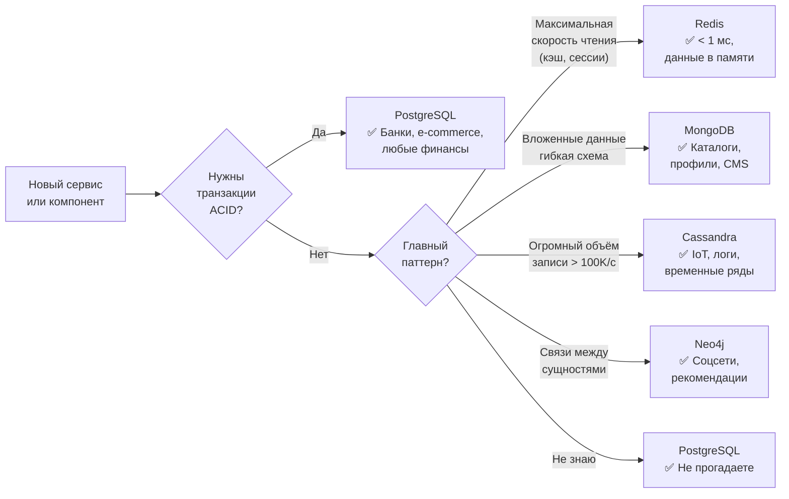
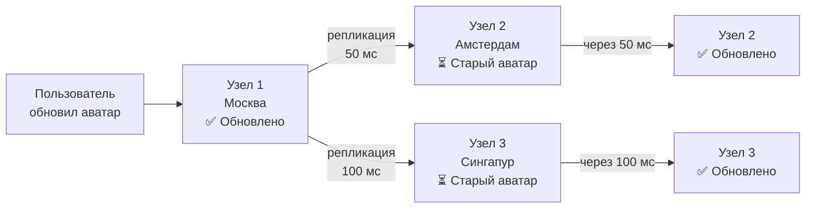
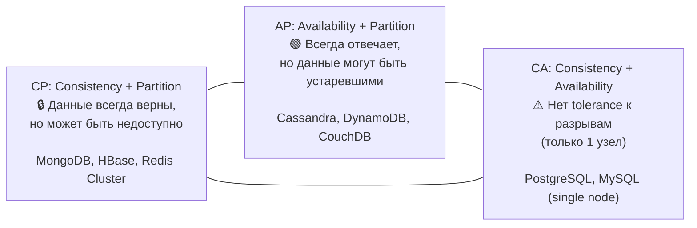
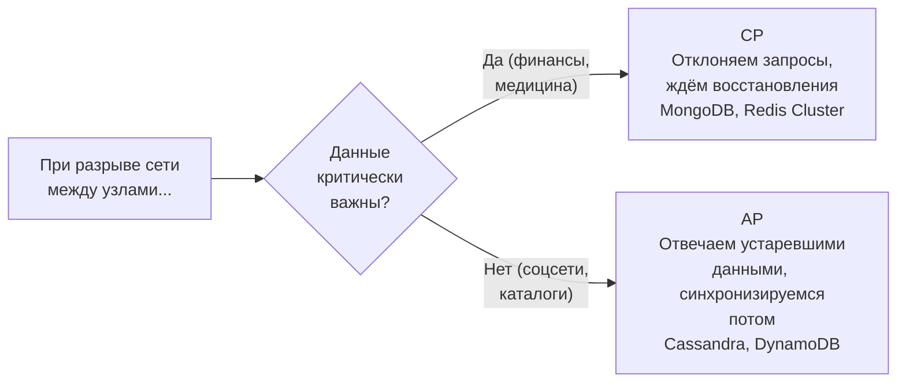
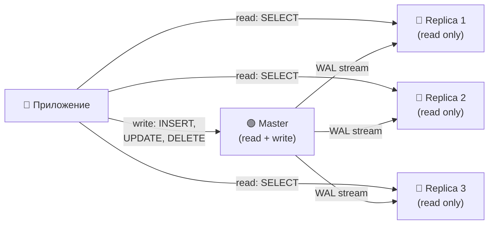
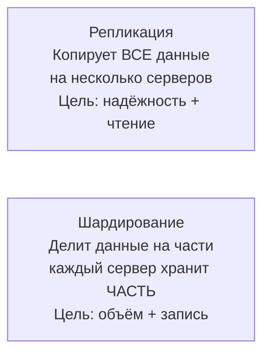
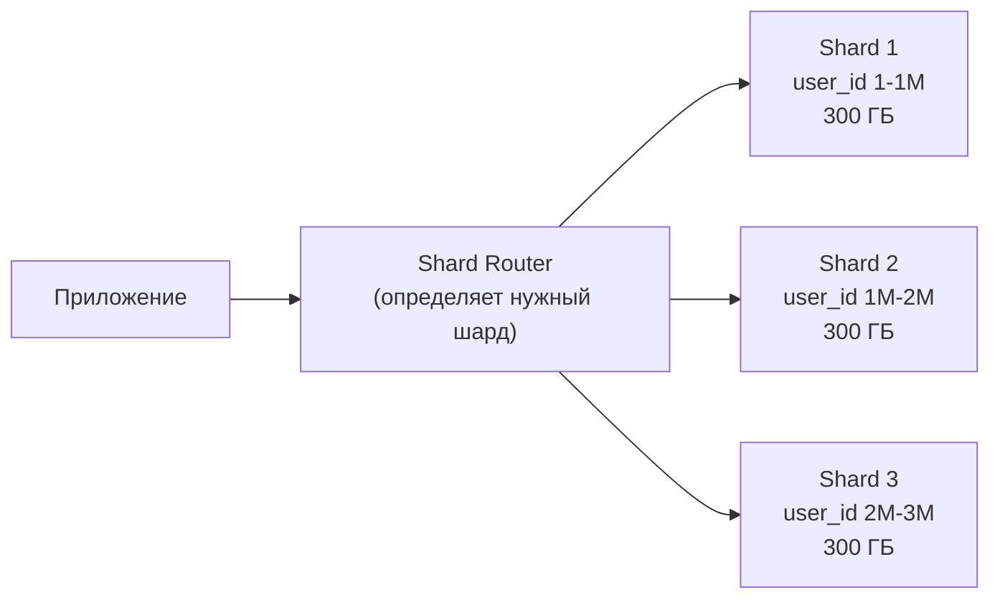
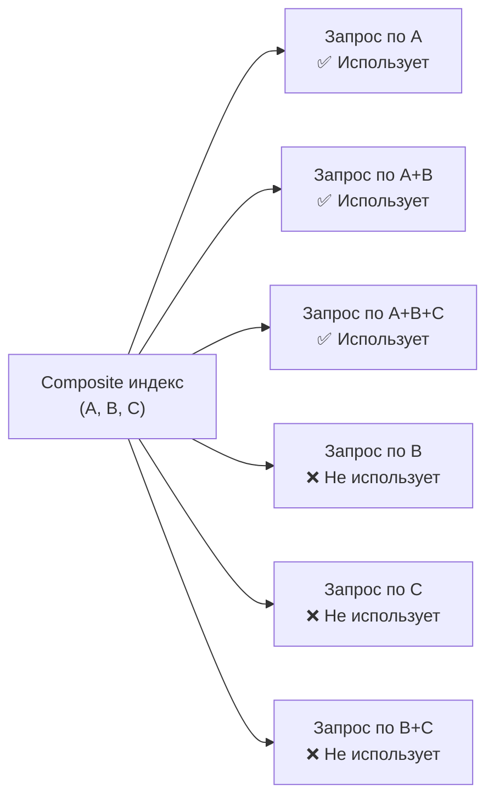

# Уровень 4: Базы данных и хранение -- SQL, NoSQL, шардирование и репликация

## Введение

Представьте, что вы строите библиотеку. Небольшая районная библиотека -- несколько тысяч книг, один библиотекарь, один зал. Всё просто: пришёл, спросил, получил книгу. Теперь представьте, что вы строите национальную библиотеку с миллиардами книг, тысячами читателей одновременно, филиалами по всей стране. Нужны другие правила хранения, другие каталоги, другая организация пространства.

С базами данных всё то же самое. Стартап с 500 пользователями и глобальный сервис с 500 миллионами -- это принципиально разные задачи. **Выбор типа базы данных, стратегии репликации и шардирования -- одно из самых долгосрочных архитектурных решений.** Мигрировать 100 миллионов записей с PostgreSQL на MongoDB на боевом сервере без даунтайма -- это не задача одного дня, это месяцы планирования и недели выполнения.

В этом уровне разберём:

1. **SQL vs NoSQL** -- не «что лучше», а «что подходит для какой задачи»
2. **ACID vs BASE** -- два подхода к гарантиям консистентности
3. **CAP-теорема** -- физический предел распределённых систем
4. **Репликация** -- как копировать данные для надёжности и скорости
5. **Шардирование** -- как разделить данные, когда одна машина не справляется
6. **Индексирование** -- как сделать запросы быстрыми
7. **Connection Pooling** -- почему соединения с БД дороги
8. **Query Optimization** -- как читать планы запросов и исправлять медленные

---

## 1. SQL vs NoSQL -- когда что выбирать

### Почему вообще появился NoSQL

До 2000-х реляционные базы данных были единственным mainstream-вариантом. PostgreSQL, MySQL, Oracle -- все хранили данные в таблицах со строгой схемой. Потом появились социальные сети и интернет-гиганты с задачами, для которых реляционная модель была неудобной или медленной:

- **Facebook** хранит посты пользователей -- у разных постов разные атрибуты (текст, фото, видео, опросы). В SQL нужна либо одна огромная таблица с кучей NULL-колонок, либо сложная иерархия таблиц.
- **Amazon** нужны сотни тысяч операций записи в секунду для корзин и сессий. Строгий ACID и блокировки SQL-транзакций создают bottleneck.
- **Netflix** хранит пользовательские рейтинги и рекомендации -- отношения «пользователь → понравился фильм → похож на фильм» естественнее описываются графом, чем таблицами.

NoSQL возник не потому что SQL «плохой» -- а потому что у разных задач разные требования к структуре данных и гарантиям консистентности.

### Реляционные БД (SQL)

PostgreSQL, MySQL, Oracle -- данные хранятся в **таблицах** со строгой схемой. Связи между таблицами через **JOIN**.

Главная сила реляционных БД -- **нормализация** и **транзакции**. Нормализация означает: каждый факт хранится в одном месте. Если имя пользователя изменилось -- меняем одну строку, и все заказы, комментарии, логи автоматически «видят» новое имя через JOIN.

```sql
-- Строгая схема: все записи имеют одинаковую структуру
CREATE TABLE users (
  id SERIAL PRIMARY KEY,
  name VARCHAR(100) NOT NULL,
  email VARCHAR(255) UNIQUE NOT NULL,
  created_at TIMESTAMP DEFAULT NOW()
);

-- JOIN -- мощь реляционных БД: один запрос достаёт данные из трёх таблиц
SELECT u.name, COUNT(o.id) as orders
FROM users u
LEFT JOIN orders o ON u.id = o.user_id
GROUP BY u.name
HAVING COUNT(o.id) > 5;
```

Что происходит при JOIN: база данных берёт строки из таблицы `users`, находит соответствующие строки в `orders` по условию `u.id = o.user_id`, объединяет их и применяет агрегацию. Это дорогая операция, но она выполняется на стороне БД, а не в приложении.

**Когда SQL:** транзакции (банки, e-commerce), сложные аналитические запросы с JOIN, строгая консистентность, данные с чёткими связями.

### NoSQL -- четыре совершенно разных мира

Слово «NoSQL» вводит в заблуждение: оно объединяет технологии с принципиально разными моделями данных. MongoDB и Redis -- оба NoSQL, но они решают разные задачи так же, как молоток и скрипка -- оба инструменты, но для разного.

| Тип | Примеры | Модель данных | Когда использовать |
|---|---|---|---|
| **Document** | MongoDB, CouchDB | JSON-документы, вложенные структуры | Каталоги, профили, CMS -- когда данные «вложенные» |
| **Key-Value** | Redis, DynamoDB | Ключ → значение (строка, число, JSON) | Кэш, сессии, корзины -- максимальная скорость |
| **Column-Family** | Cassandra, HBase | Строки с динамическими столбцами | Временные ряды, IoT, логи -- огромные объёмы записи |
| **Graph** | Neo4j, Amazon Neptune | Узлы + рёбра (связи первого класса) | Соцсети, рекомендации, фрод-детекция -- связи важнее данных |

#### Document DB: данные как JSON

Документная модель хранит каждый «объект» как единый документ. Плюс -- никакого JOIN: все данные пользователя лежат в одном документе, чтение одним запросом. Минус -- дублирование: если название категории товара изменилось, нужно обновить тысячи документов заказов.

```typescript
// Document (MongoDB) -- вложенная структура, без JOIN
const user = {
  _id: ObjectId('...'),
  name: 'Alice',
  address: { city: 'Moscow', street: 'Тверская' },
  orders: [
    { product: 'Laptop', price: 1200, date: '2024-01-15' },
    { product: 'Mouse', price: 25, date: '2024-02-01' }
  ]
}
// Один запрос -- весь профиль со всеми заказами
const alice = await db.users.findOne({ name: 'Alice' })
```

#### Key-Value: максимальная простота и скорость

Redis хранит данные как пары «ключ → значение» в оперативной памяти. Скорость -- микросекунды. Это не «замена» реляционной БД -- это совершенно другой инструмент для другой задачи: кэш, сессии, очереди, счётчики.

```typescript
// Key-Value (Redis) -- максимальная скорость, данные в памяти
await redis.set('session:abc123', JSON.stringify({ userId: 42, role: 'admin' }), 'EX', 3600)
await redis.get('session:abc123') // < 1 мс

// Redis умеет больше, чем просто get/set
await redis.incr('pageviews:homepage')        // атомарный счётчик
await redis.lpush('queue:emails', emailJson)  // очередь
await redis.setbit('active_users:2024-01-15', userId, 1) // bitmap
```

#### Column-Family: для огромных объёмов записи

Cassandra оптимизирована под запись -- она принимает сотни тысяч записей в секунду, распределяя их по кластеру. Данные организованы не в строки/таблицы, а в «строки с динамическими столбцами». Идеально для временных рядов: каждый «сенсор» -- строка, каждое измерение -- столбец с временной меткой.

```
Cassandra: таблица sensor_readings
  Row key: sensor_id
  Columns: 2024-01-15T10:00:00 → 22.5, 2024-01-15T10:01:00 → 22.7, ...
  
  sensor_001 | 10:00→22.5 | 10:01→22.7 | 10:02→22.3 | ... (тысячи столбцов)
  sensor_002 | 10:00→18.1 | 10:01→18.3 | ...
```

#### Graph: когда связи важнее данных

Neo4j хранит не таблицы, а граф -- узлы (сущности) и рёбра (связи). Запрос «друзья друзей, которые купили тот же товар» -- это один Cypher-запрос. В SQL для этого нужны четыре JOIN и сложный подзапрос.

```typescript
// Graph (Neo4j) -- связи первого класса
// "Друзья друзей, которые купили тот же товар" -- 1 запрос
// MATCH (me:User {id: 42})-[:FRIEND]->()-[:FRIEND]->(fof:User)
//       -[:BOUGHT]->(p:Product)<-[:BOUGHT]-(me)
// WHERE NOT (me)-[:FRIEND]->(fof)
// RETURN fof, p, COUNT(*) as common_purchases
// ORDER BY common_purchases DESC
```

### Flowchart выбора БД



💡 **Главное правило:** не выбирайте БД по хайпу. MongoDB в 2012 году была на пике хайпа -- многие компании перешли на неё, а потом мигрировали обратно на PostgreSQL, когда схема данных устоялась. Выбирайте по **паттерну доступа к данным**.

---

## 2. ACID vs BASE -- два подхода к гарантиям

### Зачем нужны гарантии

Представьте банковский перевод: снять 100 рублей с одного счёта и зачислить на другой. Что произойдёт, если сервер упадёт после списания, но до зачисления? Без гарантий -- 100 рублей исчезнут. Именно для таких сценариев придумали ACID.

### ACID (SQL базы) -- нотариальная сделка

**Аналогия:** ACID -- это нотариальная сделка. Дорого, медленно, с кучей бумаг. Но после завершения у вас есть железобетонная гарантия: сделка или состоялась полностью, или не состоялась вообще.

| Свойство | Значение | Пример из жизни |
|---|---|---|
| **A**tomicity | Транзакция выполняется целиком или не выполняется | Перевод: списание + зачисление -- либо оба, либо ни один |
| **C**onsistency | После транзакции данные в валидном состоянии | Баланс не может стать отрицательным (constraint) |
| **I**solation | Параллельные транзакции не видят промежуточных результатов | Два перевода одновременно не потеряют деньги |
| **D**urability | Подтверждённые данные не потеряются | После `COMMIT` данные на диске, даже при крэше |

```sql
-- Банковский перевод -- классический пример ACID
BEGIN;
  UPDATE accounts SET balance = balance - 100 WHERE id = 1;
  UPDATE accounts SET balance = balance + 100 WHERE id = 2;
  -- Если любой UPDATE упадёт → ROLLBACK, оба баланса не изменятся
COMMIT;

-- Что происходит под капотом при COMMIT:
-- 1. БД записывает транзакцию в WAL (Write-Ahead Log) на диск
-- 2. Применяет изменения к страницам данных
-- 3. Только после записи в WAL возвращает OK клиенту
-- 4. При крэше БД восстанавливается из WAL, ничего не теряется
```

**Isolation levels** -- нюанс, который часто упускают. ACID не означает «полная изоляция»: есть четыре уровня, и каждый следующий дороже по производительности.

| Уровень | Dirty Read | Non-repeatable Read | Phantom Read | Когда использовать |
|---|---|---|---|---|
| **Read Uncommitted** | Возможен | Возможен | Возможен | Почти никогда |
| **Read Committed** | Нет | Возможен | Возможен | Большинство случаев (default в PostgreSQL) |
| **Repeatable Read** | Нет | Нет | Возможен | Отчёты, агрегации |
| **Serializable** | Нет | Нет | Нет | Финансовые транзакции |

### BASE (NoSQL базы) -- рукопожатие

**Аналогия:** BASE -- это рукопожатие между партнёрами. Быстро, неформально, без бумаг. Оба знают, что договорились, но если один из них потом скажет «я этого не говорил» -- доказать трудно.

| Свойство | Значение |
|---|---|
| **B**asically **A**vailable | Система всегда отвечает (может вернуть устаревшие данные) |
| **S**oft state | Состояние может меняться со временем без внешних воздействий |
| **E**ventual consistency | Данные «со временем» станут консистентными на всех узлах |



📌 **Eventual consistency на практике:** вы обновили аватар в соцсети. Друг в другом городе видит старый аватар ещё 5 секунд -- он читает с ближайшего к нему узла, который ещё не получил обновление. Через несколько секунд все узлы синхронизируются. Для соцсети это **нормально**. Для банковского перевода -- **катастрофа**.

### ACID или BASE -- как выбрать

Вопрос не в том, что «лучше». Вопрос в том, какую ошибку вы готовы принять:

- **ACID:** система может быть медленнее или временно недоступна -- но данные всегда верны
- **BASE:** система всегда быстра и доступна -- но данные могут быть на секунды устаревшими

Для финансов, здравоохранения, юридических систем -- ACID. Для соцсетей, каталогов, аналитики, кэшей -- BASE вполне приемлем.

---

## 3. CAP-теорема -- физический предел

### Что такое CAP и почему это важно

CAP-теорема (Brewer's theorem, 2000) -- это математически доказанный факт о распределённых системах. Она говорит: в распределённой системе при разрыве сети вы **вынуждены** выбрать между консистентностью и доступностью.

**Аналогия:** два филиала банка в разных городах. Связь между ними оборвалась. Клиент в Москве хочет снять деньги. Что делать?
- **CP (выбрать консистентность):** «Извините, не можем провести операцию, пока связь с центральным офисом не восстановится.» Вы недоступны, но данные точные.
- **AP (выбрать доступность):** «Конечно, снимаем. Синхронизируемся с другим филиалом позже.» Вы доступны, но если клиент одновременно снял деньги в обоих филиалах -- возникнет несоответствие.

- **C**onsistency -- все узлы видят одни и те же данные в одно время
- **A**vailability -- каждый запрос получает ответ (не обязательно свежий)
- **P**artition tolerance -- система работает при потере связи между узлами



📌 **Partition tolerance нельзя «выключить»** в распределённой системе -- сеть БУДЕТ разрываться. Кабели рвутся, датацентры теряют связь, роутеры перегружаются. Поэтому реальный выбор: **CP или AP**.

### Почему CA практически не существует

Однонузловой PostgreSQL -- это CA-система: всегда консистентна, всегда доступна, но не переносит разрывы сети, потому что разрывать нечего -- сервер один. Как только вы добавляете второй узел, вы автоматически входите в треугольник CAP и должны выбирать между C и A при разрыве P.

### Как принять решение CP vs AP



💡 **Практический совет:** большинство современных систем -- гибридные. Cassandra позволяет задать consistency level для каждого запроса отдельно: `QUORUM` для важных данных, `ONE` для аналитики. DynamoDB предлагает «strongly consistent reads» как опцию. CAP -- это крайние случаи, реальные системы работают в широком спектре между ними.

---

## 4. Репликация

### Что такое репликация и зачем она нужна

Репликация -- **копирование данных** на несколько серверов. Две причины:

1. **Отказоустойчивость:** если один сервер упадёт -- данные не потеряются, другой возьмёт на себя нагрузку
2. **Масштабирование чтения:** запросы на чтение распределяются по нескольким серверам

**Аналогия:** представьте нотариальный архив. Один экземпляр документа -- это риск (пожар, кража). Три экземпляра в разных местах -- надёжность. Причём два «читальных» экземпляра могут работать в разных городах: каждый офис работает с ближайшей копией.

### Master-Slave (Primary-Replica) -- самая популярная схема

Один Master принимает все записи. Slave-узлы получают копию данных через репликационный поток и обслуживают запросы на чтение.



**Что происходит под капотом при репликации PostgreSQL:**
1. Мастер записывает изменение в WAL (Write-Ahead Log)
2. WAL-sender отправляет записи реплике по TCP
3. WAL-receiver реплики принимает и применяет изменения к своим данным
4. Реплика подтверждает получение (sync) или не подтверждает (async)

```
Плюсы:                              Минусы:
✅ Масштабирование чтения (N слейвов)  ❌ Master -- единая точка отказа записи
✅ Простота настройки                 ❌ Replication lag (слейв отстаёт)
✅ Тяжёлые отчёты на реплике --       ❌ Запись не масштабируется горизонтально
   не нагружают мастер
✅ Автоматический failover            ❌ При failover возможна потеря данных
   (Patroni, pg_auto_failover)           (async replication)
```

### Replication Lag -- главная боль Master-Slave

**Replication lag** -- это задержка между записью на мастер и появлением данных на репликах. Обычно -- миллисекунды. При высокой нагрузке -- секунды.

```
Сценарий «Read-your-own-writes»:
  1. Пользователь меняет имя: PUT /api/users/42 { name: "Alice" }
     → Запись идёт на Master ✅
  2. Пользователь перезагружает страницу: GET /api/users/42
     → Чтение идёт на Replica 1 (которая ещё не получила обновление)
     → Пользователь видит старое имя "Alex" ❌

Решение -- Read-Your-Writes:
  После записи в течение N секунд читать с Master,
  или использовать Session Consistency (routing по session_id)
```

### Синхронная vs асинхронная репликация

```
Асинхронная (default):
  Клиент → Master записал → OK клиенту
  Master → Replica (в фоне, с задержкой)
  Преимущество: быстро. Риск: при крэше мастера до репликации -- данные теряются.

Синхронная:
  Клиент → Master записал → ждёт подтверждения от Replica → OK клиенту
  Преимущество: нулевые потери данных. Риск: если реплика медленная -- мастер тоже медленный.

Quorum (компромисс):
  Подтверждение требуется от большинства реплик (например, 2 из 3).
  Cassandra, MongoDB Replica Set используют этот подход.
```

### Master-Master (Multi-Master) -- масштабирование записи

Несколько узлов принимают и чтение, и запись. Масштабирует запись, но создаёт конфликты -- главную сложность этой схемы.

```
Master 1 (Москва): UPDATE users SET name='Alice' WHERE id=42
Master 2 (Лондон): UPDATE users SET name='Bob'   WHERE id=42
(оба выполнили операцию одновременно, до синхронизации)
    │
    ▼
💥 Конфликт! Чьё UPDATE победит?

Стратегии разрешения конфликтов:
  • Last-Write-Wins (LWW) -- по timestamp. Просто, но теряет данные (оба обновления корректны)
  • CRDT (Conflict-free Replicated Data Types) -- математически бесконфликтные структуры
  • Application-level -- приложение сравнивает версии и решает. Гибко, код сложнее
  • Operational Transformation -- используется в Google Docs (реальный-тайм редактирование)
```

📌 **Master-Master -- не серебряная пуля.** Большинство компаний избегают его из-за сложности разрешения конфликтов. Вместо него часто используют **шардирование**: каждый шард -- отдельный Master-Slave кластер, запись масштабируется за счёт разных шардов.

---

## 5. Шардирование (Sharding)

### Репликация vs Шардирование -- в чём разница

Это разные решения разных проблем:



Репликация: все три реплики хранят одинаковые 1 ТБ данных. Шардирование: три шарда хранят по ~333 ГБ каждый, итого 1 ТБ.

### Когда шардирование необходимо

**Аналогия:** районная библиотека с одним залом справляется. Городская библиотека-гигант открывает 10 залов: «Литература», «Техника», «История»... У каждого зала свой каталог, свои полки, свой библиотекарь. Вопрос «где хранится книга по SQL?» решается сначала маршрутизацией в нужный зал, а уже там -- поиском по каталогу.



### Стратегии шардирования

| Стратегия | Принцип | Плюсы | Минусы |
|---|---|---|---|
| **Range** | По диапазону ключа (id 1-1M, 1M-2M) | Простые range-запросы, удобный rebalancing | Hot spots (новые данные на одном шарде) |
| **Hash** | hash(key) % N | Равномерное распределение | Range-запросы невозможны, rebalancing дорог |
| **Directory** | Lookup-таблица: ключ → шард | Гибкость, любая логика шардирования | Lookup-таблица -- bottleneck и точка отказа |
| **Geographic** | По региону (EU → шард 1, US → шард 2) | Низкая латентность для пользователей региона | Неравномерная нагрузка между регионами |

### Hot Spots -- почему Range Sharding опасен

```
Range sharding по дате регистрации:
  Shard 1: Январь 2022 -- 500K пользователей, 100 запросов/сек (старые данные, мало активны)
  Shard 2: Январь 2023 -- 500K пользователей, 5000 запросов/сек
  Shard 3: Январь 2024 -- 500K пользователей, 50000 запросов/сек ← 🔥 HOT SPOT!

Все новые регистрации, вся активная аудитория -- на последнем шарде.
Два первых шарда простаивают, третий перегружен.
```

**Решение:** hash-based sharding. `hash(user_id) % 3` распределит новых и старых пользователей равномерно, независимо от времени регистрации.

### Consistent Hashing -- умное шардирование при масштабировании

Обычный hash создаёт проблему при добавлении нового шарда:

```
Было 3 шарда: hash(key) % 3
  key=100 → 100 % 3 = 1 → Shard 1
  key=101 → 101 % 3 = 2 → Shard 2

Добавили 4-й шард: hash(key) % 4
  key=100 → 100 % 4 = 0 → Shard 0 ← был на Shard 1!
  key=101 → 101 % 4 = 1 → Shard 1 ← был на Shard 2!

~75% всех ключей меняют свой шард!
При 10 ТБ данных -- 7.5 ТБ нужно перемещать. Часами.
```

**Consistent hashing** решает это с помощью «кольца» хэшей:

```
Хэш-кольцо (0 ... 2^32):
  Шарды располагаются равномерно по кольцу (несколько виртуальных точек каждый)
  Ключ маппится на кольцо: hash(key) → точка на кольце
  Ключ принадлежит ближайшему шарду по часовой стрелке

Добавление 4-го шарда:
  4-й шард занимает позицию между 2-м и 3-м
  Перемещается только ~25% ключей (те, что были "между" 2 и 3)
  75% ключей остаются на своих шардах
```

Consistent hashing используется в Cassandra, DynamoDB, Redis Cluster, Riak.

### Проблемы шардирования, о которых не говорят

Шардирование решает одни проблемы, создавая другие:

```
Cross-shard queries:
  ❌ SELECT * FROM orders JOIN users ON orders.user_id = users.id
     WHERE orders.status = 'pending'
  
  Если orders и users на разных шардах -- запрос требует обращения к нескольким шардам,
  агрегации результатов на уровне приложения. Это медленно и сложно.

Распределённые транзакции:
  ❌ BEGIN; UPDATE shard1.accounts...; UPDATE shard2.accounts...; COMMIT;
  
  Стандартные транзакции не работают между шардами.
  Нужен 2PC (Two-Phase Commit) -- сложный и медленный.
  Или saga pattern -- ещё сложнее.

Hotkey problem:
  user_id знаменитости с 100M подписчиков → все запросы на один шард.
  Решение: composite key (celebrity_id + date_bucket), кэширование.
```

📌 **Золотое правило:** не шардируйте раньше времени. 90% проблем с производительностью решаются индексами, connection pooling и read replicas. Шардирование -- это когда вы исчерпали все остальные варианты.

---

## 6. Индексирование

### Как индекс ускоряет поиск

Без индекса база данных выполняет **full table scan**: просматривает каждую строку таблицы, проверяя условие. При 10 миллионах строк -- это 10 миллионов операций чтения с диска. Медленно.

**Аналогия:** найти слово «шардирование» в книге без оглавления -- читать все страницы подряд. С оглавлением -- открыть нужную главу за секунду. Индекс -- это оглавление таблицы.

B-tree индекс организует данные в сбалансированное дерево: поиск любого значения требует `O(log N)` операций. Для 10 миллионов строк -- около 23 сравнений вместо 10 миллионов.

### Типы индексов

| Тип | Структура | Запросы | Когда использовать |
|---|---|---|---|
| **B-tree** | Сбалансированное дерево | `=`, `>`, `<`, `BETWEEN`, `ORDER BY`, `LIKE 'abc%'` | По умолчанию, универсальный |
| **Hash** | Хэш-таблица | Только `=` | Точные совпадения (поиск по id, email) |
| **Composite** | B-tree по нескольким колонкам | Запросы по комбинации колонок | `WHERE country='RU' AND city='Moscow'` |
| **GIN** | Инвертированный | Полнотекстовый поиск, массивы, JSONB | PostgreSQL: поиск в тексте, JSONB-полях |
| **Partial** | B-tree по части строк | Запросы с постоянным фильтром | `WHERE status = 'active'` (только активные) |
| **Expression** | По результату функции | `WHERE LOWER(email) = ...` | Нечувствительный к регистру поиск |

```sql
-- Без индекса: full table scan (10M строк → 5 сек)
SELECT * FROM users WHERE email = 'alice@example.com';
-- Seq Scan on users (cost=0..250000 rows=1 time=5200ms)
--   Filter: (email = 'alice@example.com')
--   Rows Removed by Filter: 9999999

-- С индексом: B-tree lookup (10M строк → 0.1 мс)
CREATE INDEX idx_users_email ON users(email);
-- Index Scan using idx_users_email on users (cost=0..8.5 rows=1 time=0.1ms)
--   Index Cond: (email = 'alice@example.com')

-- Composite индекс: порядок колонок ВАЖЕН!
CREATE INDEX idx_orders_user_date ON orders(user_id, created_at);

-- ✅ Использует индекс (user_id -- первая колонка)
SELECT * FROM orders WHERE user_id = 42;
SELECT * FROM orders WHERE user_id = 42 AND created_at > '2024-01-01';

-- ❌ НЕ использует индекс (created_at -- вторая колонка, без user_id)
SELECT * FROM orders WHERE created_at > '2024-01-01';

-- Partial index: индекс только на активных заказах
CREATE INDEX idx_orders_active ON orders(user_id) WHERE status = 'active';
-- При миллионе заказов, из которых 10K активных -- индекс в 100 раз меньше
```

### Правило Leftmost Prefix -- самая частая ошибка с composite индексами



📌 **Правило leftmost prefix:** composite индекс `(A, B, C)` работает для запросов начиная с левой колонки. Запросы без `A` в WHERE-условии не используют этот индекс.

**Порядок колонок:** первой ставьте самую **селективную** колонку (с наибольшим количеством уникальных значений). `user_id` (миллионы уникальных) лучше, чем `status` (3-5 уникальных значений).

### Write Amplification -- скрытая цена индексов

Каждый индекс -- это дополнительная запись при каждом INSERT, UPDATE, DELETE. Индексы ускоряют чтение, но **замедляют запись**.

```
Таблица без индексов:
  INSERT → 1 запись в таблицу = 1 I/O операция

Таблица с 5 индексами:
  INSERT → 1 запись в таблицу + 5 обновлений B-tree = 6 I/O операций
  Запись в 6 раз медленнее!

При bulk insert 1 миллиона строк:
  Без индексов: 10 секунд
  С 5 индексами: 60+ секунд
  
Паттерн для bulk insert:
  1. DROP INDEX (или DISABLE INDEX в MySQL)
  2. INSERT 1M строк
  3. CREATE INDEX (B-tree строится из отсортированных данных -- быстро!)
```

---

## 7. Connection Pooling

### Почему соединение с БД -- дорогая операция

Создание нового TCP-соединения с PostgreSQL -- это не одна операция, а целая цепочка:


Для сравнения: простой SELECT по индексу выполняется за 0.1-1 мс. Накладные расходы на создание соединения в 50-500 раз больше полезной работы.

### Connection Pool -- «банк» соединений

Пул соединений держит открытые соединения «наготове». Запрос берёт соединение из пула, выполняет SQL, возвращает соединение обратно.

```
Без пула (одно соединение на запрос):
  Запрос → TCP handshake (10 мс) → SQL (1 мс) → закрыть соединение
  Итого: 11 мс (91% времени -- накладные расходы!)

С пулом (соединение переиспользуется):
  Запрос → взять из пула (0.01 мс) → SQL (1 мс) → вернуть в пул
  Итого: 1.01 мс (99% времени -- полезная работа)

1000 параллельных запросов:
  Без пула:  1000 одновременных соединений → PostgreSQL падает (max_connections по умолчанию = 100)
  С пулом:   20 соединений → очередь запросов, БД жива и быстра
```

```typescript
// Node.js + pg: connection pool
import { Pool } from 'pg'

const pool = new Pool({
  host: 'localhost',
  database: 'myapp',
  max: 20,                    // максимум 20 соединений в пуле
  min: 5,                     // минимум 5 всегда открыты (warm pool)
  idleTimeoutMillis: 30000,   // закрыть неиспользуемое через 30 сек
  connectionTimeoutMillis: 2000  // таймаут на получение из пула
})

// Соединение берётся из пула и возвращается автоматически
const result = await pool.query('SELECT * FROM users WHERE id = $1', [42])

// Для транзакций -- явное управление соединением
const client = await pool.connect()
try {
  await client.query('BEGIN')
  await client.query('UPDATE accounts SET balance = balance - 100 WHERE id = $1', [fromId])
  await client.query('UPDATE accounts SET balance = balance + 100 WHERE id = $1', [toId])
  await client.query('COMMIT')
} catch (err) {
  await client.query('ROLLBACK')
  throw err
} finally {
  client.release() // ОБЯЗАТЕЛЬНО: вернуть соединение в пул
}
```

### Формула размера пула

📌 **Формула (правило Брандта):** `connections = (CPU cores * 2) + effective_spindle_count`

- **4-ядерный CPU, SSD:** `4 * 2 + 1 = 9` → округляем до 10-20
- **8-ядерный CPU, 2 HDD:** `8 * 2 + 2 = 18` → 15-25 соединений

**Почему больше -- хуже:** PostgreSQL создаёт отдельный процесс на каждое соединение. 1000 соединений = 1000 процессов. Context switching между ними пожирает CPU. Исследования Percona показывают: производительность PostgreSQL с 1000 соединений хуже, чем с 20.

### PgBouncer -- пул соединений перед PostgreSQL

В production часто используют отдельный proxy-пул между приложением и БД:

```
Приложение (100 инстансов × 20 connections) → PgBouncer → PostgreSQL (20 connections)
  Приложение видит 2000 "соединений"
  PostgreSQL получает 20 реальных соединений
  PgBouncer мультиплексирует их
```

Это особенно важно при горизонтальном масштабировании приложения: 100 инстансов приложения без PgBouncer создадут 100 × 20 = 2000 соединений к БД.

---

## 8. Query Optimization

### EXPLAIN ANALYZE -- рентген запроса

Прежде чем оптимизировать запрос, нужно понять, как именно БД его выполняет. `EXPLAIN ANALYZE` показывает план выполнения с реальными данными (в отличие от `EXPLAIN`, который только предсказывает).

```sql
EXPLAIN ANALYZE SELECT * FROM orders
WHERE user_id = 42 AND status = 'active'
ORDER BY created_at DESC
LIMIT 10;

-- Плохой результат (нет индекса):
-- Seq Scan on orders  (cost=0..25000 rows=10 actual time=450ms)
--   Filter: (user_id = 42 AND status = 'active')
--   Rows Removed by Filter: 999990
-- Sort (cost=..25010 rows=10 actual time=452ms)
-- Limit (cost=..25010.1 rows=10 actual time=452ms)
-- Planning time: 0.5 ms, Execution time: 452.8 ms

-- После создания индекса (user_id, status, created_at):
-- Limit (cost=0..10 rows=10 actual time=0.3ms)
--   -> Index Scan Backward using idx_orders_user_status_date on orders
--        Index Cond: (user_id = 42 AND status = 'active')
-- Planning time: 0.4 ms, Execution time: 0.3 ms
```

**Что искать в EXPLAIN:**
- `Seq Scan` на большой таблице -- красный флаг, нет индекса
- `cost=0..25000` -- оценка стоимости (нужен индекс, если cost > 1000)
- `Rows Removed by Filter: 999990` -- 99.999% строк отфильтровывается (точно нужен индекс)
- `actual time` -- реальное время выполнения узла плана

### Антипаттерны запросов

```sql
-- ❌ SELECT * -- читаем все колонки, даже ненужные
-- При 50 колонках с BLOB-полями -- огромный трафик
SELECT * FROM users WHERE id = 42;

-- ✅ Только нужные колонки -- меньше I/O, меньше памяти
SELECT name, email, created_at FROM users WHERE id = 42;

-- ❌ N+1 запросов -- классический паттерн ORM-проблемы
-- 1 запрос за orders + N запросов за каждый order_item
const orders = await db.query('SELECT id FROM orders WHERE user_id = 42')
for (const order of orders) {
  const items = await db.query(
    'SELECT * FROM order_items WHERE order_id = $1', [order.id]
  ) // выполняется N раз!
}

-- ✅ Один запрос с JOIN -- одно обращение к БД
SELECT o.id, oi.product, oi.price
FROM orders o
JOIN order_items oi ON o.id = oi.order_id
WHERE o.user_id = 42;

-- ❌ Функция в WHERE -- индекс не используется!
SELECT * FROM users WHERE LOWER(email) = 'alice@example.com';
-- Full table scan, даже если есть индекс на email!

-- ✅ Либо expression index, либо хранить в нижнем регистре
CREATE INDEX idx_users_email_lower ON users(LOWER(email));
-- Или: хранить email всегда в нижнем регистре при записи

-- ❌ OR с разными колонками -- часто ломает индекс
SELECT * FROM users WHERE email = 'alice@example.com' OR phone = '+79001234567';

-- ✅ UNION ALL -- каждая ветка использует свой индекс
SELECT * FROM users WHERE email = 'alice@example.com'
UNION ALL
SELECT * FROM users WHERE phone = '+79001234567';
```

### Батчинг -- ускорение массовых операций

```typescript
// ❌ 1000 отдельных INSERT -- 1000 round-trips к БД
for (const user of users) {
  await db.query('INSERT INTO users (name, email) VALUES ($1, $2)', [user.name, user.email])
}

// ✅ Batch INSERT -- один round-trip
const values = users.map((u, i) => `($${i*2+1}, $${i*2+2})`).join(', ')
const params = users.flatMap(u => [u.name, u.email])
await db.query(`INSERT INTO users (name, email) VALUES ${values}`, params)

// ✅ Или COPY для огромных объёмов (PostgreSQL)
// COPY users FROM '/tmp/users.csv' CSV HEADER;
// В 10-100 раз быстрее, чем INSERT
```

---

## Частые ошибки новичков

### ❌ 1. Используют MongoDB «потому что модно», когда нужен PostgreSQL

```typescript
// ❌ Попытка сделать JOIN в MongoDB
const user = await db.users.findOne({ _id: userId })
const orders = await db.orders.find({ userId: user._id }).toArray()
const products = await Promise.all(
  orders.map(o => db.products.findOne({ _id: o.productId }))
)
// 3 запроса, N+1 проблема. В SQL -- одна строка.
```

Почему это ошибка: MongoDB не поддерживает JOIN (есть `$lookup`, но он медленный и ограниченный). Если данные реляционные -- связи между сущностями важны и постоянны -- используйте реляционную БД. MongoDB хороша для документов без сложных связей: профили, каталоги, CMS.

```sql
-- ✅ PostgreSQL: один запрос с JOIN
SELECT u.name, o.id as order_id, p.title as product
FROM users u
JOIN orders o ON u.id = o.user_id
JOIN products p ON o.product_id = p.id
WHERE u.id = 42;
```

### ❌ 2. Шардируют, когда можно обойтись индексами и репликами

```
Таблица users: 5 млн строк, запросы по 3 секунды

❌ "Нам нужен шардинг!" → месяцы работы, cross-shard queries, сложность

✅ Правильная последовательность оптимизации:
  1. EXPLAIN ANALYZE -- есть ли индексы? → CREATE INDEX → 5 мс
  2. Read replicas → 3 слейва → нагрузка на чтение / 4
  3. Вертикальное масштабирование → больше RAM (данные в памяти), NVMe SSD
  4. Connection pooling → PgBouncer
  5. Кэширование → Redis для горячих данных
  6. Партиционирование → разделение большой таблицы внутри одной БД
  7. Только если ничего не помогло → шардирование
```

Почему это ошибка: шардирование -- сложное и дорогое решение. Это не опция масштабирования, а крайняя мера. 90% компаний никогда не достигают масштаба, при котором шардирование необходимо.

### ❌ 3. Неправильный порядок колонок в composite индексе

```sql
-- Запрос: WHERE status = 'active' AND user_id = 42

-- ❌ Индекс (status, user_id) -- status имеет 3 значения → низкая селективность
CREATE INDEX idx_bad ON orders(status, user_id);
-- Сначала фильтрует 1/3 таблицы (все 'active'), потом ищет user_id

-- ✅ Индекс (user_id, status) -- user_id уникальнее → высокая селективность
CREATE INDEX idx_good ON orders(user_id, status);
-- Сразу фильтрует до ~10 записей для user_id=42
```

Почему это ошибка: селективность определяет, насколько эффективно индекс сужает результат. Колонка с 3 уникальными значениями (`status`: active, pending, closed) отфильтрует в лучшем случае 67% строк. Колонка с миллионами уникальных значений (`user_id`) отфильтрует 99.9999% строк с первого же шага.

### ❌ 4. Забывают про connection pooling

```typescript
// ❌ Новое соединение на каждый запрос
async function getUser(id: number) {
  const client = new Client({ connectionString: DB_URL })
  await client.connect()    // 10-50 мс на КАЖДЫЙ запрос!
  const result = await client.query('SELECT * FROM users WHERE id = $1', [id])
  await client.end()
  return result.rows[0]
}
// При 100 RPS: 100 новых соединений/сек → PostgreSQL исчерпывает max_connections
```

Почему это ошибка: при 100 запросах в секунду вы создаёте и закрываете 100 TCP-соединений каждую секунду. PostgreSQL создаёт отдельный процесс на каждое соединение. По умолчанию `max_connections = 100`, и вы мгновенно его исчерпываете.

```typescript
// ✅ Connection pool -- соединения переиспользуются
const pool = new Pool({ connectionString: DB_URL, max: 20 })

async function getUser(id: number) {
  // pool.query() автоматически берёт и возвращает соединение
  const result = await pool.query('SELECT * FROM users WHERE id = $1', [id])
  return result.rows[0]
}
```

### ❌ 5. Игнорируют replication lag при read-your-writes

```typescript
// ❌ Запись на master, чтение со slave -- пользователь видит старые данные
async function updateAndFetch(userId: number, newName: string) {
  await masterPool.query('UPDATE users SET name = $1 WHERE id = $2', [newName, userId])
  // replication lag: 10-100 мс
  const user = await replicaPool.query('SELECT * FROM users WHERE id = $1', [userId])
  return user.rows[0] // может вернуть старое имя!
}

// ✅ После записи -- читать с master (или использовать sticky session routing)
async function updateAndFetch(userId: number, newName: string) {
  await masterPool.query('UPDATE users SET name = $1 WHERE id = $2', [newName, userId])
  // Читаем с того же мастера сразу после записи
  const user = await masterPool.query('SELECT * FROM users WHERE id = $1', [userId])
  return user.rows[0] // актуальные данные гарантированы
}
```

### ❌ 6. Создают индекс на низкоселективной колонке

```sql
-- ❌ Индекс на boolean-поле (только 2 значения)
CREATE INDEX idx_users_is_active ON users(is_active);
-- 70% строк -- активные. Индекс даст только 30% выигрыш, но займёт место
-- PostgreSQL может проигнорировать такой индекс и сделать Seq Scan

-- ✅ Partial index -- индекс только на нужном подмножестве
CREATE INDEX idx_users_inactive ON users(created_at) WHERE is_active = false;
-- Индекс маленький (только неактивные пользователи)
-- Эффективен для запросов "найти неактивных по дате регистрации"
```

---

## Итоги

- ✅ **SQL (PostgreSQL)** -- выбор по умолчанию: транзакции, JOIN, строгая схема, аналитика
- ✅ **Document DB (MongoDB)** -- вложенные данные, гибкая схема, горизонтальное масштабирование из коробки
- ✅ **Key-Value (Redis)** -- кэш, сессии, очереди, счётчики -- максимальная скорость, данные в памяти
- ✅ **Column-Family (Cassandra)** -- огромные объёмы записи, временные ряды, IoT
- ✅ **Graph (Neo4j)** -- связи между сущностями важнее самих данных, рекомендации, фрод
- ✅ **ACID** -- строгие гарантии (банки, финансы, медицина). **BASE** -- eventual consistency (соцсети, каталоги, аналитика)
- ✅ **CAP**: в распределённой системе Partition tolerance обязателен. Выбирайте CP (консистентность) или AP (доступность)
- ✅ **Master-Slave** -- масштабирование чтения, простота. Помните про replication lag и read-your-writes
- ✅ **Master-Master** -- масштабирование записи, но конфликты требуют стратегии разрешения
- ✅ **Sharding** -- последнее средство. Сначала: индексы → replicas → vertical scaling → caching → partitioning
- ✅ **Consistent hashing** -- перемещает только ~1/N данных при добавлении шарда (vs ~75% при обычном hash)
- ✅ **B-tree индекс** -- универсальный. **Hash** -- только точные совпадения. **Composite** -- порядок колонок по селективности (DESC)
- ✅ **Connection pooling** -- обязательно в production. `max = CPU cores * 2 + spindles`. PgBouncer при горизонтальном масштабировании приложения
- 📌 Выбирайте БД по паттерну доступа к данным, а не по хайпу и моде
- 📌 Шардирование необратимо -- убедитесь, что исчерпали все другие способы масштабирования
- 📌 Индексы ускоряют чтение, но замедляют запись (write amplification = 1 + N_indexes операций на каждый INSERT)
- 📌 `EXPLAIN ANALYZE` -- ваш главный инструмент оптимизации: Seq Scan на большой таблице -- красный флаг
