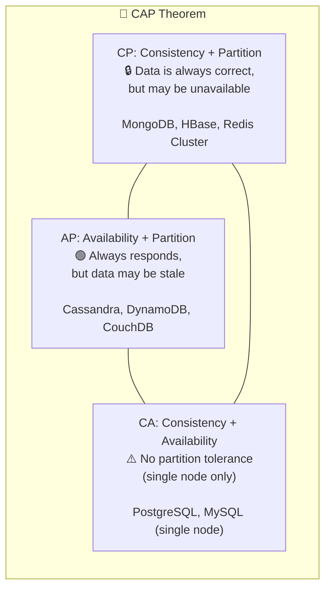
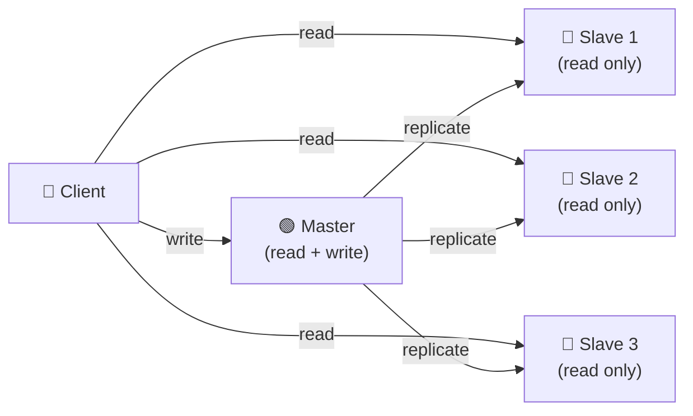
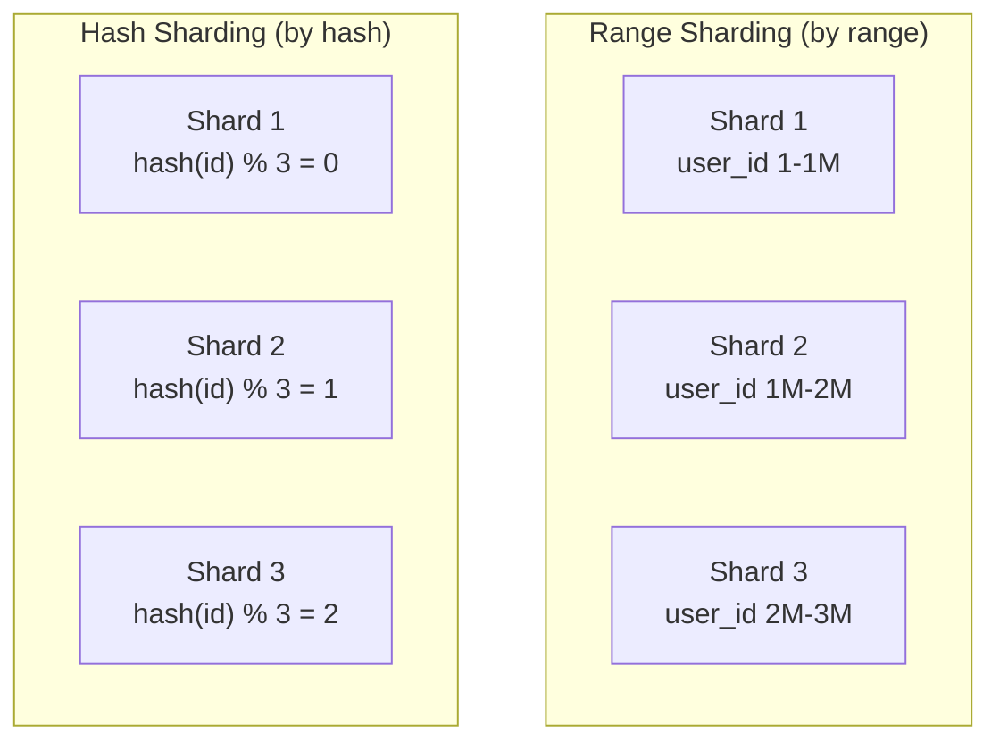

# 🔥 Level 4: Databases and Storage

## 🎯 Why Understand Databases?

Imagine: you're building a house. The foundation is the database. Choose the wrong foundation — and on the 10th floor, everything will start cracking. **Choosing a DB is one of the most irreversible decisions in architecture.** Migrating from PostgreSQL to MongoDB on production with 100 million records — that's months of work and sleepless nights.

```
Startup (100 users):             2 years later (10M users):
Any DB works fine                PostgreSQL: 50 ms → 5 sec (JOIN 3 tables)
                                  MongoDB: 2 ms (denormalized document)
                                  Redis: 0.5 ms (popular item cache)
```

💡 **There is no "best" DB.** There is a DB that best fits a specific task.

## 🔥 SQL vs NoSQL — When to Choose What

### Relational DBs (SQL)

PostgreSQL, MySQL, Oracle — data stored in **tables** with a strict schema. Relationships between tables via **JOIN**.

```sql
-- Strict schema: all records have the same structure
CREATE TABLE users (
  id SERIAL PRIMARY KEY,
  name VARCHAR(100) NOT NULL,
  email VARCHAR(255) UNIQUE NOT NULL,
  created_at TIMESTAMP DEFAULT NOW()
);

-- JOIN — the power of relational DBs
SELECT u.name, COUNT(o.id) as orders
FROM users u
LEFT JOIN orders o ON u.id = o.user_id
GROUP BY u.name
HAVING COUNT(o.id) > 5;
```

**When SQL:** transactions (banking, e-commerce), complex queries with JOIN, strict consistency, normalized data.

### NoSQL — Four Families

NoSQL is not a single technology, but **four completely different** approaches to data storage.

| Type | Examples | Data Model | When to use |
|---|---|---|---|
| **Document** | MongoDB, CouchDB | JSON documents, nested structures | Catalogs, profiles, CMS — when data is "nested" |
| **Key-Value** | Redis, DynamoDB | Key → value (string, number, JSON) | Cache, sessions, carts — maximum speed |
| **Column-Family** | Cassandra, HBase | Rows with dynamic columns | Time series, IoT, logs — huge write volumes |
| **Graph** | Neo4j, Amazon Neptune | Nodes + edges (first-class relationships) | Social networks, recommendations, fraud detection — relationships matter more than data |

```typescript
// Document (MongoDB) — nested structure, no JOIN
const user = {
  _id: ObjectId('...'),
  name: 'Alice',
  address: { city: 'Moscow', street: 'Tverskaya' },
  orders: [
    { product: 'Laptop', price: 1200, date: '2024-01-15' },
    { product: 'Mouse', price: 25, date: '2024-02-01' }
  ]
}

// Key-Value (Redis) — maximum speed
await redis.set('session:abc123', JSON.stringify({ userId: 42, role: 'admin' }))
await redis.get('session:abc123') // < 1 ms

// Graph (Neo4j) — first-class relationships
// "Friends of friends who bought the same product" — 1 query
// MATCH (me)-[:FRIEND]->()-[:FRIEND]->(fof)-[:BOUGHT]->(p)
// WHERE (me)-[:BOUGHT]->(p)
// RETURN fof, p
```

### How to Choose? Quick Cheat Sheet

```
Need transactions (ACID)?         → SQL (PostgreSQL)
Nested data, flexible schema?     → Document (MongoDB)
Maximum read speed?               → Key-Value (Redis)
Huge write volume (>100K/s)?      → Column-Family (Cassandra)
Entity relationships matter?      → Graph (Neo4j)
Don't know what to choose?        → PostgreSQL (you can't go wrong)
```

## 🔥 ACID vs BASE

Two opposing approaches to data guarantees. Analogy: **ACID is a notarized transaction** (100% guarantee, but slow). **BASE is a handshake** (fast, but trust instead of guarantees).

### ACID (SQL databases)

| Property | Meaning | Example |
|---|---|---|
| **A**tomicity | Transaction either completes entirely or not at all | Transfer: debit + credit — either both or neither |
| **C**onsistency | After a transaction, data is in a valid state | Balance cannot become negative |
| **I**solation | Concurrent transactions don't see intermediate results | Two simultaneous transfers won't lose money |
| **D**urability | Committed data won't be lost | After `COMMIT`, data is on disk, even on crash |

```sql
-- Bank transfer — classic ACID example
BEGIN;
  UPDATE accounts SET balance = balance - 100 WHERE id = 1;
  UPDATE accounts SET balance = balance + 100 WHERE id = 2;
  -- If any UPDATE fails → ROLLBACK, both balances remain unchanged
COMMIT;
```

### BASE (NoSQL databases)

| Property | Meaning |
|---|---|
| **B**asically **A**vailable | System always responds (may return stale data) |
| **S**oft state | State can change over time without external intervention |
| **E**ventual consistency | Data will "eventually" become consistent across all nodes |

```
ACID:                               BASE:
Write → immediately visible to all  Write → visible on 1 node
                                    → after 50 ms on node 2
                                    → after 100 ms on node 3
Slower, but guarantees            Faster, but data may be stale
```

📌 **Eventual consistency in practice:** you updated your avatar on a social network. A friend in another city sees the old avatar for 5 more seconds. That's fine — in seconds all nodes will synchronize.

## 🔥 CAP Theorem

**CAP is "fast, high quality, cheap — pick two".** Only for distributed systems — CAP doesn't apply to single-node DBs.

- **C**onsistency — all nodes see the same data at the same time
- **A**vailability — every request gets a response (not necessarily the freshest)
- **P**artition tolerance — system works despite lost connections between nodes



📌 **Partition tolerance cannot be "disabled"** in a distributed system — the network WILL break. So the real choice is: **CP or AP**.

**Analogy:** a bank has branches in different cities. Communication between them is lost.
- **CP:** "Sorry, we can't process transactions until communication is restored" (consistency over availability)
- **AP:** "We'll process it, but the balance might not match the other branch" (availability over consistency)

## 🔥 Replication

Replication — **copying data** to multiple servers. Why? Fault tolerance + read speedup.

### Master-Slave (Primary-Replica)

The most common scheme. Master accepts writes, Slave nodes read copied data.



```
Pros:                                 Cons:
✅ Read scaling (N slaves)            ❌ Master — single point of failure
✅ Simplicity                         ❌ Replication lag (slave is behind)
✅ Reports on slaves without load     ❌ Writes don't scale
   on master
```

**Replication lag** — the main pain point. A user updates their profile (write on Master), refreshes the page (read from Slave) — sees old data. Solution: **read-your-writes** — after a write, read from Master.

### Master-Master (Multi-Master)

Multiple nodes accept both reads and writes. Scales writes, but creates conflicts.

```
Master 1: UPDATE user SET name='Alice'   (in Moscow)
Master 2: UPDATE user SET name='Bob'     (in London, simultaneously)
    │
    ▼
💥 Conflict! Whose UPDATE wins?

Resolution strategies:
  • Last-Write-Wins (LWW) — by timestamp. Simple, but loses data
  • CRDT — conflict-free replicated data types. Complex, but reliable
  • Application-level — application decides. Flexible, but code is harder
```

## 🔥 Sharding

Replication copies data. Sharding **splits** data across servers. When one DB can't handle the volume — we split data into parts (shards).

**Analogy:** a library with one librarian can't cope → open 3 halls: "A-I", "K-R", "S-Z", each with its own librarian.



### Sharding Strategies

| Strategy | Principle | Pros | Cons |
|---|---|---|---|
| **Range** | By key range (id 1-1M, 1M-2M) | Simple range queries, rebalancing | Hot spots (fresh data on one shard) |
| **Hash** | hash(key) % N | Even distribution | Range queries impossible, rebalancing on shard add |
| **Directory** | Lookup table: key → shard | Flexibility, any logic | Lookup table — bottleneck and SPOF |
| **Geographic** | By region (EU → shard 1, US → shard 2) | Low latency for region | Uneven load |

### Hot Spots — The Main Sharding Problem

```
Range sharding by creation date:
  Shard 1: January  — 100K records, 0 requests (old data)
  Shard 2: February — 100K records, 100 requests
  Shard 3: March    — 100K records, 1M requests ← 🔥 HOT SPOT!

All new users and their activity land on the last shard.
```

**Solution:** hash-based sharding, or composite key (region + hash), or consistent hashing for even distribution.

### Consistent Hashing

When adding/removing a shard, only ~1/N of data moves, not everything.

```
Normal hash:  hash(key) % 3  →  added 4th shard  →  hash(key) % 4
               ~75% of keys move!

Consistent hashing:  hash ring
               Added 4th shard → only ~25% of keys move
```

## 🔥 Indexing

An index is a **book's table of contents**. Without an index, the DB scans ALL rows (full table scan). With an index — finds the target in O(log N).

### Index Types

| Type | Structure | Queries | When to use |
|---|---|---|---|
| **B-tree** | Balanced tree | `=`, `>`, `<`, `BETWEEN`, `ORDER BY`, `LIKE 'abc%'` | Default, universal |
| **Hash** | Hash table | Only `=` | Exact matches (search by id, email) |
| **Composite** | B-tree on multiple columns | Queries on column combinations | `WHERE country='RU' AND city='Moscow'` |
| **GIN** | Inverted | Full-text search, arrays, JSONB | PostgreSQL: text search, JSONB |

```sql
-- Without index: full table scan (10M rows → 5 sec)
SELECT * FROM users WHERE email = 'alice@example.com';

-- With index: B-tree lookup (10M rows → 0.1 ms)
CREATE INDEX idx_users_email ON users(email);

-- Composite index: column order MATTERS!
CREATE INDEX idx_orders_user_date ON orders(user_id, created_at);

-- ✅ Works (user_id is the first column)
SELECT * FROM orders WHERE user_id = 42;
SELECT * FROM orders WHERE user_id = 42 AND created_at > '2024-01-01';

-- ❌ Does NOT use the index (created_at is the second column, without user_id)
SELECT * FROM orders WHERE created_at > '2024-01-01';
```

📌 **Leftmost prefix rule:** a composite index `(A, B, C)` works for queries on `A`, `A+B`, `A+B+C`, but NOT for `B`, `C`, `B+C`.

### Write Amplification

Each index is an additional write on INSERT/UPDATE. 5 indexes on a table = 6 writes instead of 1.

```
Without indexes: INSERT → 1 write to table          = 1 I/O
5 indexes:       INSERT → 1 write + 5 index updates   = 6 I/O
                 6x slower writes!

Rule: indexes speed up reads but slow down writes.
```

## 🔥 Connection Pooling

Creating a TCP connection to the DB is an **expensive operation** (~10-50 ms: TCP handshake, authentication, SSL). A connection pool keeps open connections "ready to go".

```
Without pool:                       With pool:
Request → create connection (50 ms) Request → get from pool (0.1 ms)
         → execute SQL (5 ms)              → execute SQL (5 ms)
         → close connection                → return to pool
Total: 55 ms                       Total: 5.1 ms

1000 parallel requests:
  Without pool: 1000 connections → DB crashes (max_connections!)
  With pool:    20 connections → request queue, DB stays alive
```

```typescript
// Node.js + pg: connection pool
import { Pool } from 'pg'

const pool = new Pool({
  host: 'localhost',
  database: 'myapp',
  max: 20,           // maximum 20 connections
  idleTimeoutMillis: 30000,  // close unused after 30 sec
  connectionTimeoutMillis: 2000  // timeout getting from pool
})

// Connection is taken from the pool and returned automatically
const result = await pool.query('SELECT * FROM users WHERE id = $1', [42])
```

📌 **Pool size formula:** `connections = (CPU cores * 2) + effective_spindle_count`. For SSD with a 4-core CPU: ~10-20 connections. **More is not better!** 1000 connections to PostgreSQL will kill performance due to context switching.

## 🔥 Query Optimization

### EXPLAIN — X-ray for your query

```sql
EXPLAIN ANALYZE SELECT * FROM orders
WHERE user_id = 42 AND status = 'active'
ORDER BY created_at DESC
LIMIT 10;

-- Result (bad — Seq Scan):
-- Seq Scan on orders  (cost=0..25000 rows=10 time=450ms)
--   Filter: (user_id = 42 AND status = 'active')
--   Rows Removed by Filter: 999990

-- Result (good — Index Scan):
-- Index Scan using idx_orders_user_status on orders (cost=0..8.5 rows=10 time=0.1ms)
--   Index Cond: (user_id = 42 AND status = 'active')
```

### Query Anti-patterns

```sql
-- ❌ SELECT * — reads all columns, even unnecessary ones
SELECT * FROM users WHERE id = 42;

-- ✅ Only the columns you need
SELECT name, email FROM users WHERE id = 42;

-- ❌ N+1 — 1 query + N queries in a loop
SELECT id FROM orders WHERE user_id = 42;
-- For each order_id:
SELECT * FROM order_items WHERE order_id = ?;  -- × N times!

-- ✅ Single query with JOIN
SELECT o.id, oi.product, oi.price
FROM orders o
JOIN order_items oi ON o.id = oi.order_id
WHERE o.user_id = 42;
```

## ⚠️ Common Beginner Mistakes

### 🐛 1. Using MongoDB "because it's trendy" when PostgreSQL is needed

```typescript
// ❌ Trying to do JOIN in MongoDB
const user = await db.users.findOne({ _id: userId })
const orders = await db.orders.find({ userId: user._id }).toArray()
const products = await Promise.all(
  orders.map(o => db.products.findOne({ _id: o.productId }))
)
// 3 queries instead of 1 JOIN. In SQL — one line.
```

> **Why this is a mistake:** MongoDB doesn't support JOIN (there's $lookup, but it's slow). If data is relational (users → orders → products), use a relational DB.

```sql
-- ✅ PostgreSQL: single query with JOIN
SELECT u.name, o.id, p.title
FROM users u
JOIN orders o ON u.id = o.user_id
JOIN products p ON o.product_id = p.id
WHERE u.id = 42;
```

### 🐛 2. Sharding when indexes and replicas would suffice

```
Users table: 5M rows, queries take 3 seconds

❌ "We need sharding!"  → months of work, cross-shard queries, complexity

✅ Check first:
  1. Are there indexes? → CREATE INDEX → 5 ms
  2. Read replicas? → 3 slaves → read load / 4
  3. Vertical scaling? → more RAM, SSD → 10x faster
  4. Only if nothing else helped → sharding
```

> **Why this is a mistake:** sharding is a complex and irreversible decision. 90% of performance problems are solved by indexes, connection pooling, and read replicas.

### 🐛 3. Wrong column order in a composite index

```sql
-- Query: WHERE status = 'active' AND user_id = 42

-- ❌ Index (status, user_id) — status has 3 values → low selectivity
CREATE INDEX idx_bad ON orders(status, user_id);
-- Filters 1/3 of the table, then searches for user_id

-- ✅ Index (user_id, status) — user_id is more unique → high selectivity
CREATE INDEX idx_good ON orders(user_id, status);
-- Filters down to ~10 records immediately
```

> **Why this is a mistake:** the first column of a composite index should be the most selective (with the most unique values).

### 🐛 4. Forgetting about connection pooling

```typescript
// ❌ New connection on every request
async function getUser(id: number) {
  const client = new Client({ connectionString: DB_URL })
  await client.connect()    // 50 ms on EVERY request!
  const result = await client.query('SELECT * FROM users WHERE id = $1', [id])
  await client.end()
  return result.rows[0]
}
```

> **Why this is a mistake:** at 100 requests/sec you're creating and closing 100 TCP connections per second. The DB will quickly exhaust `max_connections`.

```typescript
// ✅ Connection pool — connections are reused
const pool = new Pool({ connectionString: DB_URL, max: 20 })

async function getUser(id: number) {
  const result = await pool.query('SELECT * FROM users WHERE id = $1', [id])
  return result.rows[0]  // connection is automatically returned to the pool
}
```

## 📌 Summary

- ✅ **SQL (PostgreSQL)** — default choice: transactions, JOIN, strict schema
- ✅ **Document DB (MongoDB)** — nested data, flexible schema, horizontal scaling
- ✅ **Key-Value (Redis)** — cache, sessions, maximum speed
- ✅ **Column-Family (Cassandra)** — huge write volumes, time series
- ✅ **Graph (Neo4j)** — entity relationships matter more than the data itself
- ✅ **ACID** — strict guarantees (banking, finance). **BASE** — eventual consistency (social networks, catalogs)
- ✅ **CAP**: in a distributed system, choose CP (consistency) or AP (availability)
- ✅ **Master-Slave** — read scaling. **Master-Master** — write scaling (but conflicts!)
- ✅ **Sharding** — last resort. First: indexes → replicas → vertical scaling
- ✅ **B-tree index** — universal. **Hash** — exact matches only. **Composite** — column order matters!
- ✅ **Connection pooling** — mandatory. `max = CPU cores * 2 + spindles`
- 📌 Don't choose a DB based on hype — choose based on data access patterns
- 📌 Sharding is irreversible — make sure you've exhausted all other options
- 📌 Indexes speed up reads but slow down writes (write amplification)
