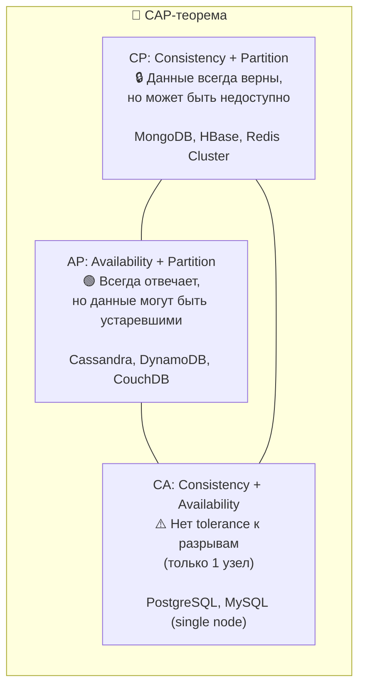
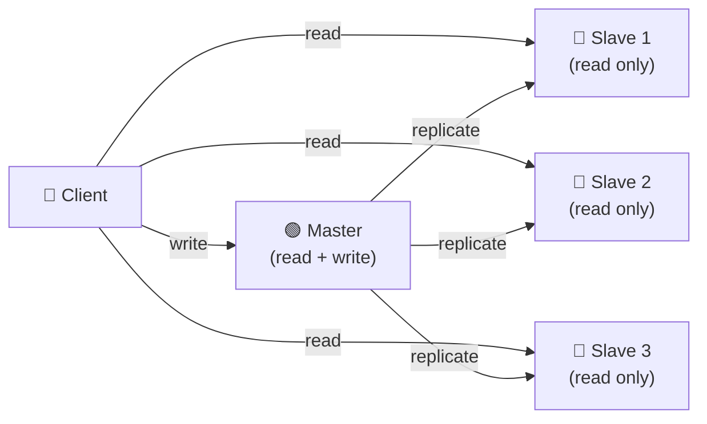
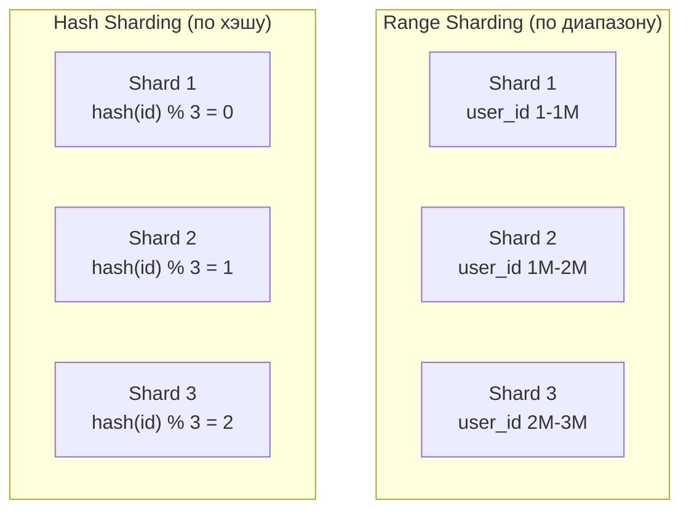

# 🔥 Уровень 4: Базы данных и хранение

## 🎯 Зачем разбираться в базах данных?

Представьте: вы строите дом. Фундамент — это база данных. Выбрали не тот фундамент — и на 10-м этаже всё пойдёт трещинами. **Выбор БД — одно из самых необратимых решений в архитектуре.** Миграция с PostgreSQL на MongoDB на продакшене с 100 млн записей — это месяцы работы и бессонные ночи.

```
Стартап (100 пользователей):     Через 2 года (10 млн пользователей):
Любая БД работает нормально       PostgreSQL: 50 мс → 5 сек (JOIN 3 таблиц)
                                   MongoDB: 2 мс (денормализованный документ)
                                   Redis: 0.5 мс (кэш популярного)
```

💡 **Не существует «лучшей» БД.** Есть БД, которая лучше подходит для конкретной задачи.

## 🔥 SQL vs NoSQL — когда что выбирать

### Реляционные БД (SQL)

PostgreSQL, MySQL, Oracle — данные хранятся в **таблицах** со строгой схемой. Связи между таблицами через **JOIN**.

```sql
-- Строгая схема: все записи имеют одинаковую структуру
CREATE TABLE users (
  id SERIAL PRIMARY KEY,
  name VARCHAR(100) NOT NULL,
  email VARCHAR(255) UNIQUE NOT NULL,
  created_at TIMESTAMP DEFAULT NOW()
);

-- JOIN — мощь реляционных БД
SELECT u.name, COUNT(o.id) as orders
FROM users u
LEFT JOIN orders o ON u.id = o.user_id
GROUP BY u.name
HAVING COUNT(o.id) > 5;
```

**Когда SQL:** транзакции (банки, e-commerce), сложные запросы с JOIN, строгая консистентность, нормализованные данные.

### NoSQL — четыре семейства

NoSQL — это не одна технология, а **четыре совершенно разных** подхода к хранению данных.

| Тип | Примеры | Модель данных | Когда использовать |
|---|---|---|---|
| **Document** | MongoDB, CouchDB | JSON-документы, вложенные структуры | Каталоги, профили, CMS — когда данные «вложенные» |
| **Key-Value** | Redis, DynamoDB | Ключ → значение (строка, число, JSON) | Кэш, сессии, корзины — максимальная скорость |
| **Column-Family** | Cassandra, HBase | Строки с динамическими столбцами | Временные ряды, IoT, логи — огромные объёмы записи |
| **Graph** | Neo4j, Amazon Neptune | Узлы + рёбра (связи первого класса) | Соцсети, рекомендации, фрод-детекция — связи важнее данных |

```typescript
// Document (MongoDB) — вложенная структура, без JOIN
const user = {
  _id: ObjectId('...'),
  name: 'Alice',
  address: { city: 'Moscow', street: 'Тверская' },
  orders: [
    { product: 'Laptop', price: 1200, date: '2024-01-15' },
    { product: 'Mouse', price: 25, date: '2024-02-01' }
  ]
}

// Key-Value (Redis) — максимальная скорость
await redis.set('session:abc123', JSON.stringify({ userId: 42, role: 'admin' }))
await redis.get('session:abc123') // < 1 мс

// Graph (Neo4j) — связи первого класса
// "Друзья друзей, которые купили тот же товар" — 1 запрос
// MATCH (me)-[:FRIEND]->()-[:FRIEND]->(fof)-[:BOUGHT]->(p)
// WHERE (me)-[:BOUGHT]->(p)
// RETURN fof, p
```

### Как выбрать? Быстрая шпаргалка

```
Нужны транзакции (ACID)?        → SQL (PostgreSQL)
Данные вложенные, схема гибкая? → Document (MongoDB)
Максимальная скорость чтения?   → Key-Value (Redis)
Огромный объём записи (>100K/с)?→ Column-Family (Cassandra)
Важны связи между сущностями?   → Graph (Neo4j)
Не знаете что выбрать?          → PostgreSQL (не прогадаете)
```

## 🔥 ACID vs BASE

Два противоположных подхода к гарантиям при работе с данными. Аналогия: **ACID — это нотариальная сделка** (100% гарантия, но долго). **BASE — это рукопожатие** (быстро, но доверие вместо гарантий).

### ACID (SQL базы)

| Свойство | Значение | Пример |
|---|---|---|
| **A**tomicity | Транзакция выполняется целиком или не выполняется | Перевод: списание + зачисление — либо оба, либо ни один |
| **C**onsistency | После транзакции данные в валидном состоянии | Баланс не может стать отрицательным |
| **I**solation | Параллельные транзакции не видят промежуточных результатов | Два перевода одновременно не потеряют деньги |
| **D**urability | Подтверждённые данные не потеряются | После `COMMIT` данные на диске, даже при крэше |

```sql
-- Банковский перевод — классический пример ACID
BEGIN;
  UPDATE accounts SET balance = balance - 100 WHERE id = 1;
  UPDATE accounts SET balance = balance + 100 WHERE id = 2;
  -- Если любой UPDATE упадёт → ROLLBACK, оба баланса не изменятся
COMMIT;
```

### BASE (NoSQL базы)

| Свойство | Значение |
|---|---|
| **B**asically **A**vailable | Система всегда отвечает (может вернуть устаревшие данные) |
| **S**oft state | Состояние может меняться со временем без внешних воздействий |
| **E**ventual consistency | Данные «со временем» станут консистентными на всех узлах |

```
ACID:                               BASE:
Запись → сразу видна всем           Запись → видна на 1 узле
                                    → через 50 мс на 2-м
                                    → через 100 мс на 3-м
Медленнее, но гарантии              Быстрее, но данные могут быть устаревшими
```

📌 **Eventual consistency на практике:** вы обновили аватар в соцсети. Друг в другом городе видит старый аватар ещё 5 секунд. Это нормально — через секунды все узлы синхронизируются.

## 🔥 CAP-теорема

**CAP — это «быстро, качественно, дёшево — выберите два».** Только для распределённых систем — в одноузловой БД CAP не применяется.

- **C**onsistency — все узлы видят одни и те же данные в одно время
- **A**vailability — каждый запрос получает ответ (не обязательно свежий)
- **P**artition tolerance — система работает при потере связи между узлами



📌 **Partition tolerance нельзя «выключить»** в распределённой системе — сеть БУДЕТ разрываться. Поэтому реальный выбор: **CP или AP**.

**Аналогия:** в разных городах есть филиалы банка. Между ними оборвалась связь.
- **CP:** «Извините, не можем провести операцию, пока связь не восстановится» (консистентность важнее)
- **AP:** «Проведём операцию, но баланс может не совпадать с другим филиалом» (доступность важнее)

## 🔥 Репликация

Репликация — **копирование данных** на несколько серверов. Зачем? Отказоустойчивость + ускорение чтения.

### Master-Slave (Primary-Replica)

Самая популярная схема. Master принимает записи, Slave-узлы читают копии данных.



```
Плюсы:                              Минусы:
✅ Масштабирование чтения (N слейвов)  ❌ Master — единая точка отказа
✅ Простота                           ❌ Replication lag (слейв отстаёт)
✅ Отчёты на слейвах без нагрузки     ❌ Запись не масштабируется
   на мастер
```

**Replication lag** — главная боль. Пользователь обновил профиль (запись на Master), обновил страницу (чтение со Slave) — видит старые данные. Решение: **read-your-writes** — после записи читать с Master.

### Master-Master (Multi-Master)

Несколько узлов принимают и чтение, и запись. Масштабирует запись, но создаёт конфликты.

```
Master 1: UPDATE user SET name='Alice'   (в Москве)
Master 2: UPDATE user SET name='Bob'     (в Лондоне, одновременно)
    │
    ▼
💥 Конфликт! Чей UPDATE победит?

Стратегии разрешения:
  • Last-Write-Wins (LWW) — по timestamp. Просто, но теряет данные
  • CRDT — бесконфликтные типы данных. Сложно, но надёжно
  • Application-level — приложение решает. Гибко, но код сложнее
```

## 🔥 Шардирование (Sharding)

Репликация копирует данные. Шардирование **разделяет** данные между серверами. Когда одна БД не справляется с объёмом — делим данные на части (шарды).

**Аналогия:** библиотека с одним библиотекарем не справляется → открываем 3 зала: «А-И», «К-Р», «С-Я», в каждом свой библиотекарь.



### Стратегии шардирования

| Стратегия | Принцип | Плюсы | Минусы |
|---|---|---|---|
| **Range** | По диапазону ключа (id 1-1M, 1M-2M) | Простые range-запросы, rebalancing | Hot spots (свежие данные на одном шарде) |
| **Hash** | hash(key) % N | Равномерное распределение | Range-запросы невозможны, rebalancing при добавлении шарда |
| **Directory** | Lookup-таблица: ключ → шард | Гибкость, любая логика | Lookup-таблица — bottleneck и SPOF |
| **Geographic** | По региону (EU → шард 1, US → шард 2) | Низкая латентность для региона | Неравномерная нагрузка |

### Hot Spots — главная проблема шардирования

```
Range sharding по дате создания:
  Shard 1: Январь  — 100K записей, 0 запросов (старые данные)
  Shard 2: Февраль — 100K записей, 100 запросов
  Shard 3: Март    — 100K записей, 1M запросов ← 🔥 HOT SPOT!

Все новые пользователи и их активность попадают на последний шард.
```

**Решение:** hash-based sharding, или composite key (region + hash), или consistent hashing для равномерного распределения.

### Consistent Hashing

При добавлении/удалении шарда перемещается только ~1/N данных, а не все.

```
Обычный hash:  hash(key) % 3  →  добавили 4-й шард  →  hash(key) % 4
               ~75% ключей перемещаются!

Consistent hashing:  кольцо из хэшей
               Добавили 4-й шард → перемещается только ~25% ключей
```

## 🔥 Индексирование

Индекс — **оглавление книги**. Без индекса БД перебирает ВСЕ строки (full table scan). С индексом — находит нужную за O(log N).

### Типы индексов

| Тип | Структура | Запросы | Когда использовать |
|---|---|---|---|
| **B-tree** | Сбалансированное дерево | `=`, `>`, `<`, `BETWEEN`, `ORDER BY`, `LIKE 'abc%'` | По умолчанию, универсальный |
| **Hash** | Хэш-таблица | Только `=` | Точные совпадения (поиск по id, email) |
| **Composite** | B-tree по нескольким колонкам | Запросы по комбинации колонок | `WHERE country='RU' AND city='Moscow'` |
| **GIN** | Инвертированный | Полнотекстовый поиск, массивы, JSONB | PostgreSQL: поиск в тексте, JSONB |

```sql
-- Без индекса: full table scan (10M строк → 5 сек)
SELECT * FROM users WHERE email = 'alice@example.com';

-- С индексом: B-tree lookup (10M строк → 0.1 мс)
CREATE INDEX idx_users_email ON users(email);

-- Composite индекс: порядок колонок ВАЖЕН!
CREATE INDEX idx_orders_user_date ON orders(user_id, created_at);

-- ✅ Работает (user_id — первая колонка)
SELECT * FROM orders WHERE user_id = 42;
SELECT * FROM orders WHERE user_id = 42 AND created_at > '2024-01-01';

-- ❌ НЕ использует индекс (created_at — вторая колонка, без user_id)
SELECT * FROM orders WHERE created_at > '2024-01-01';
```

📌 **Правило leftmost prefix:** composite индекс `(A, B, C)` работает для запросов по `A`, `A+B`, `A+B+C`, но НЕ для `B`, `C`, `B+C`.

### Write Amplification

Каждый индекс — это дополнительная запись при INSERT/UPDATE. 5 индексов на таблице = 6 записей вместо 1.

```
Без индексов: INSERT → 1 запись в таблицу          = 1 I/O
5 индексов:   INSERT → 1 запись + 5 обновлений      = 6 I/O
              Запись в 6 раз медленнее!

Правило: индексы ускоряют чтение, но замедляют запись.
```

## 🔥 Connection Pooling

Создание TCP-соединения с БД — **дорогая операция** (~10-50 мс: TCP handshake, аутентификация, SSL). Пул соединений держит открытые соединения «на готове».

```
Без пула:                           С пулом:
Запрос → создать соединение (50 мс) Запрос → взять из пула (0.1 мс)
       → выполнить SQL (5 мс)              → выполнить SQL (5 мс)
       → закрыть соединение                → вернуть в пул
Итого: 55 мс                       Итого: 5.1 мс

1000 параллельных запросов:
  Без пула: 1000 соединений → БД падает (max_connections!)
  С пулом:  20 соединений → очередь запросов, БД жива
```

```typescript
// Node.js + pg: connection pool
import { Pool } from 'pg'

const pool = new Pool({
  host: 'localhost',
  database: 'myapp',
  max: 20,           // максимум 20 соединений
  idleTimeoutMillis: 30000,  // закрыть неиспользуемое через 30 сек
  connectionTimeoutMillis: 2000  // таймаут на получение из пула
})

// Соединение берётся из пула и возвращается автоматически
const result = await pool.query('SELECT * FROM users WHERE id = $1', [42])
```

📌 **Формула размера пула:** `connections = (CPU cores * 2) + effective_spindle_count`. Для SSD с 4-ядерным CPU: ~10-20 соединений. **Больше — не значит лучше!** 1000 соединений к PostgreSQL убьют производительность из-за context switching.

## 🔥 Query Optimization

### EXPLAIN — рентген запроса

```sql
EXPLAIN ANALYZE SELECT * FROM orders
WHERE user_id = 42 AND status = 'active'
ORDER BY created_at DESC
LIMIT 10;

-- Результат (плохой — Seq Scan):
-- Seq Scan on orders  (cost=0..25000 rows=10 time=450ms)
--   Filter: (user_id = 42 AND status = 'active')
--   Rows Removed by Filter: 999990

-- Результат (хороший — Index Scan):
-- Index Scan using idx_orders_user_status on orders (cost=0..8.5 rows=10 time=0.1ms)
--   Index Cond: (user_id = 42 AND status = 'active')
```

### Антипаттерны запросов

```sql
-- ❌ SELECT * — читаем все колонки, даже ненужные
SELECT * FROM users WHERE id = 42;

-- ✅ Только нужные колонки
SELECT name, email FROM users WHERE id = 42;

-- ❌ N+1 — 1 запрос + N запросов в цикле
SELECT id FROM orders WHERE user_id = 42;
-- Для каждого order_id:
SELECT * FROM order_items WHERE order_id = ?;  -- × N раз!

-- ✅ Один запрос с JOIN
SELECT o.id, oi.product, oi.price
FROM orders o
JOIN order_items oi ON o.id = oi.order_id
WHERE o.user_id = 42;
```

## ⚠️ Частые ошибки новичков

### 🐛 1. Используют MongoDB «потому что модно», когда нужен PostgreSQL

```typescript
// ❌ Пытаются делать JOIN в MongoDB
const user = await db.users.findOne({ _id: userId })
const orders = await db.orders.find({ userId: user._id }).toArray()
const products = await Promise.all(
  orders.map(o => db.products.findOne({ _id: o.productId }))
)
// 3 запроса вместо 1 JOIN. В SQL — одна строка.
```

> **Почему это ошибка:** MongoDB не поддерживает JOIN (есть $lookup, но он медленный). Если данные реляционные (пользователи → заказы → товары), используйте реляционную БД.

```sql
-- ✅ PostgreSQL: один запрос с JOIN
SELECT u.name, o.id, p.title
FROM users u
JOIN orders o ON u.id = o.user_id
JOIN products p ON o.product_id = p.id
WHERE u.id = 42;
```

### 🐛 2. Шардируют, когда можно обойтись индексами и репликами

```
Таблица users: 5 млн строк, запросы по 3 секунды

❌ "Нам нужен шардинг!"  → месяцы работы, cross-shard queries, сложность

✅ Проверить:
  1. Есть ли индексы? → CREATE INDEX → 5 мс
  2. Read replicas? → 3 слейва → нагрузка на чтение / 4
  3. Вертикальное масштабирование? → больше RAM, SSD → 10x быстрее
  4. Только если ничего не помогло → шардинг
```

> **Почему это ошибка:** шардирование — сложное и необратимое решение. 90% проблем с производительностью решаются индексами, connection pooling и read replicas.

### 🐛 3. Неправильный порядок колонок в composite индексе

```sql
-- Запрос: WHERE status = 'active' AND user_id = 42

-- ❌ Индекс (status, user_id) — status имеет 3 значения → низкая селективность
CREATE INDEX idx_bad ON orders(status, user_id);
-- Фильтрует 1/3 таблицы, потом ищет user_id

-- ✅ Индекс (user_id, status) — user_id уникальнее → высокая селективность
CREATE INDEX idx_good ON orders(user_id, status);
-- Фильтрует до ~10 записей сразу
```

> **Почему это ошибка:** первая колонка composite индекса должна быть самой селективной (с наибольшим количеством уникальных значений).

### 🐛 4. Забывают про connection pooling

```typescript
// ❌ Новое соединение на каждый запрос
async function getUser(id: number) {
  const client = new Client({ connectionString: DB_URL })
  await client.connect()    // 50 мс на КАЖДЫЙ запрос!
  const result = await client.query('SELECT * FROM users WHERE id = $1', [id])
  await client.end()
  return result.rows[0]
}
```

> **Почему это ошибка:** при 100 запросах/сек вы создаёте и закрываете 100 TCP-соединений в секунду. БД быстро исчерпает `max_connections`.

```typescript
// ✅ Connection pool — соединения переиспользуются
const pool = new Pool({ connectionString: DB_URL, max: 20 })

async function getUser(id: number) {
  const result = await pool.query('SELECT * FROM users WHERE id = $1', [id])
  return result.rows[0]  // соединение автоматически возвращается в пул
}
```

## 📌 Итоги

- ✅ **SQL (PostgreSQL)** — выбор по умолчанию: транзакции, JOIN, строгая схема
- ✅ **Document DB (MongoDB)** — вложенные данные, гибкая схема, горизонтальное масштабирование
- ✅ **Key-Value (Redis)** — кэш, сессии, максимальная скорость
- ✅ **Column-Family (Cassandra)** — огромные объёмы записи, временные ряды
- ✅ **Graph (Neo4j)** — связи между сущностями важнее самих данных
- ✅ **ACID** — строгие гарантии (банки, финансы). **BASE** — eventual consistency (соцсети, каталоги)
- ✅ **CAP**: в распределённой системе выбирайте CP (консистентность) или AP (доступность)
- ✅ **Master-Slave** — масштабирование чтения. **Master-Master** — масштабирование записи (но конфликты!)
- ✅ **Sharding** — последнее средство. Сначала: индексы → replicas → vertical scaling
- ✅ **B-tree индекс** — универсальный. **Hash** — только точные совпадения. **Composite** — порядок колонок важен!
- ✅ **Connection pooling** — обязательно. `max = CPU cores * 2 + spindles`
- 📌 Не выбирайте БД по хайпу — выбирайте по паттерну доступа к данным
- 📌 Шардирование необратимо — убедитесь, что исчерпали все другие способы
- 📌 Индексы ускоряют чтение, но замедляют запись (write amplification)
