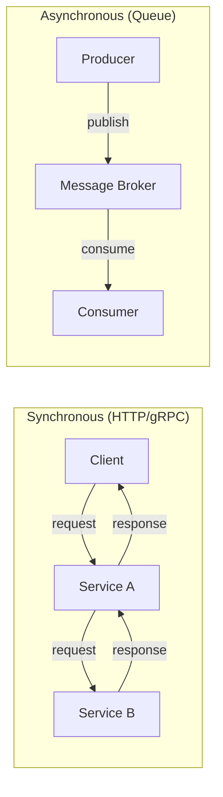
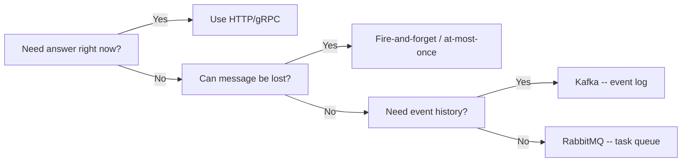
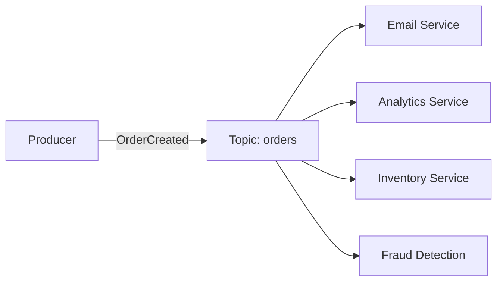
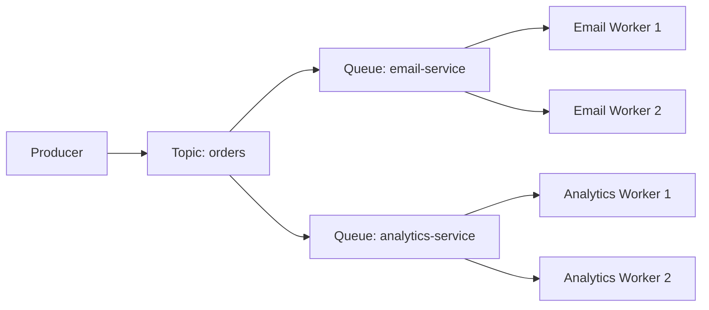
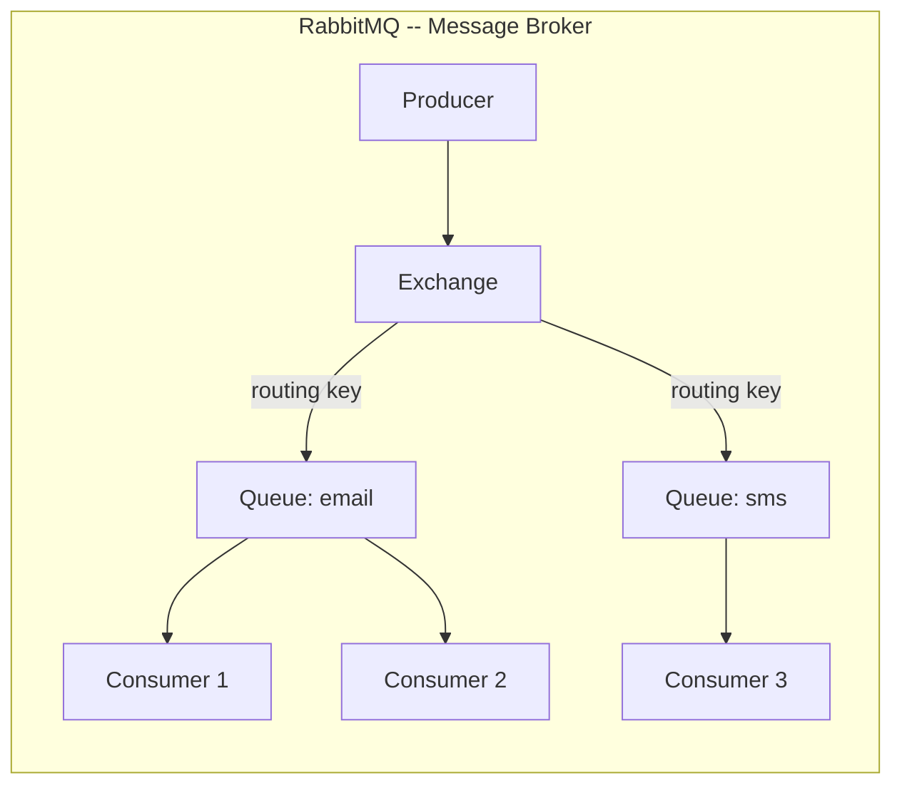
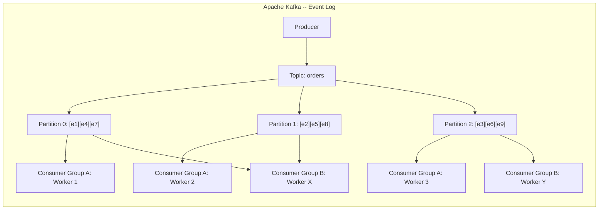
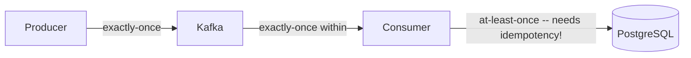
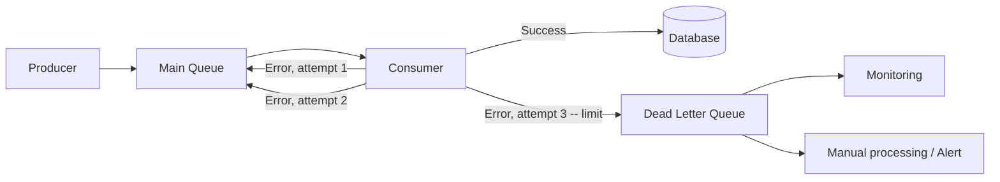
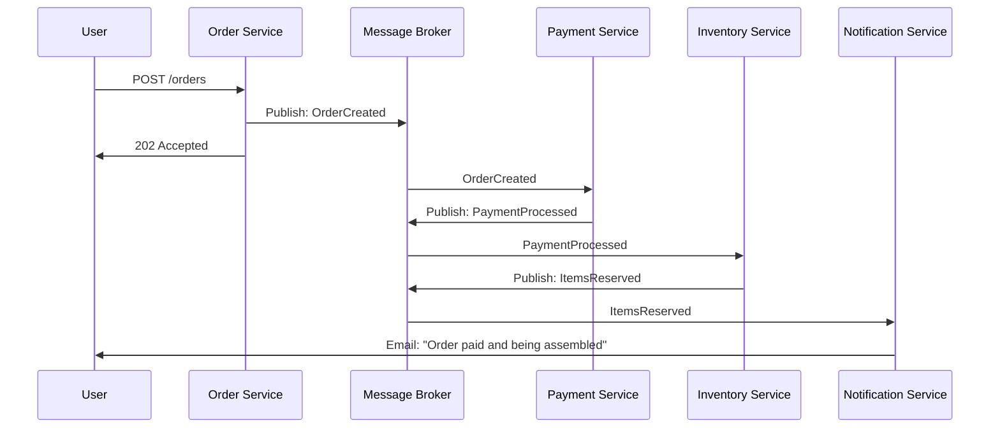
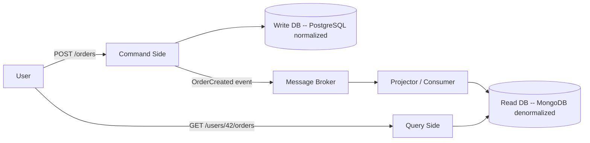

# Level 5: Message Queues -- Asynchronous Communication and Event-Driven Architecture

## Introduction

Imagine a restaurant during rush hour. If the chef personally took every order from the customer, stood and waited for them to pay, then returned to the kitchen -- the queue would stretch down the street. Instead, there's a waiter: they take the order, pass it to the kitchen as a ticket, and are free to take the next one. The kitchen works at its own pace, the waiter at theirs. If there's a rush of visitors, the restaurant hires more waiters. Order tickets pile up, but nothing gets lost.

This ticket is exactly a **message in a queue**. The waiter is the **producer**. The kitchen is the **consumer**. And the stand where tickets are placed is the **message broker**.

In this level we will cover:

1. **Why queues are needed** -- the problem with synchronous communication and how queues solve it
2. **Sync vs Async** -- when to choose what, decision criteria
3. **Point-to-Point vs Pub/Sub** -- two fundamental message distribution patterns
4. **RabbitMQ vs Apache Kafka** -- two market leaders, their architecture and application
5. **Delivery guarantees** -- at-most-once, at-least-once, exactly-once and reality
6. **Idempotency** -- how to survive in a world of duplicate messages
7. **Dead Letter Queue** -- what to do with failed messages
8. **Backpressure** -- overload protection
9. **Event-Driven Architecture and CQRS** -- architectural patterns built on queues
10. **Common mistakes** -- what typically goes wrong

---

## 1. Why Message Queues?

### The Problem with Synchronous Chains

Imagine: you're in a cafe, ordered coffee. There are two options:

- **Synchronous:** you stand at the register and wait while the barista makes your latte (3 minutes). Nobody behind you can order.
- **Asynchronous:** you get a number ticket, sit down, and the barista calls "Order 42!" when it's ready. The register is free for the next customers.

This "number ticket" is exactly a **message queue**. The sending service puts a task in the queue and continues working. The receiving service takes the task when it's ready.

```
Synchronous (request-response):
  Client → [waits 3 sec] → Service A → [waits 2 sec] → Service B → Response
  Total: 5 sec, client blocked

Asynchronous (through queue):
  Client → Service A → [puts in queue] → "Accepted!" (50ms)
                        Queue → Service B (processes at its own pace)
  Total: 50ms for client, background processing
```

### What Happens Without a Queue in Production

Say you have an online store. When placing an order, you need to:

1. Save order to DB
2. Send confirmation email
3. Reserve product in warehouse
4. Notify delivery service
5. Record in analytics
6. Check for fraud

Doing everything synchronously -- the user waits for the total time of all operations. If even one service is unavailable -- the entire order fails with an error. If 1000 orders arrive simultaneously -- all 1000 users wait, load multiplies for each service.

**A queue solves all three problems at once.** Save the order, put the `OrderCreated` event in the queue, respond "Accepted!". The remaining services process at their own pace, independently.

### Four Core Values of a Queue

**Decoupling.** Producer and consumer don't know about each other. You can add a new consumer without changing the producer.

**Buffering.** The queue absorbs load spikes. Producer can generate 10,000 events/sec while consumer handles 1,000/sec -- the queue accumulates the difference.

**Fault tolerance.** If the consumer goes down, messages wait in the queue. When it recovers -- it processes them.

**Scalability.** Add more consumer instances -- processing speeds up linearly.

---

## 2. Sync vs Async -- When to Choose What

This isn't a question of "what's better" -- it's a question of "what fits this specific case." Synchronous and asynchronous communication solve different tasks.



### Comparative Analysis

| Characteristic | Sync (HTTP/gRPC) | Async (Queue) |
|---|---|---|
| **Latency** | Instant response with result | Quick "accepted" response, result later |
| **Coupling** | Both services must be running simultaneously | Producer doesn't depend on consumer availability |
| **Throughput** | Limited by the slowest link | Consumer processes at its own pace |
| **Fault tolerance** | If consumer is down -- error right now | Messages wait until consumer recovers |
| **Observability** | Easy to trace request-response | Harder to track message path |
| **Complexity** | Simple mental model | Need to think about duplicates, ordering, retry |
| **When to use** | Need answer right now (GET /user, auth) | Background tasks, notifications, analytics |

### Decision Tree



**Practical rule:** if the user doesn't need the result right now -- use a queue. Authorization, product search -- synchronous. Sending email, generating reports, processing video -- asynchronous through a queue.

---

## 3. Two Patterns: Point-to-Point vs Pub/Sub

Before moving to specific tools, it's important to understand two fundamental patterns. They describe **who** receives the message.

### Point-to-Point (Queue)

One message -- one receiver. If there are 100 messages in the queue and 5 consumers -- each consumer gets roughly 20 messages. This is **work distribution (load balancing)**.

Analogy: an assembly line in a factory. Each part goes to **one** worker who processes it. You can't have two people process the same part -- it'll be defective.

```typescript
// Producer puts task in queue
await queue.send('email-queue', {
  to: 'user@example.com',
  subject: 'Your order shipped',
  body: '...'
})

// Consumer 1 or Consumer 2 -- ONE of them takes the task
// This allows scaling: 10 consumers = 10x processing speed
```

When to use Point-to-Point:
- Task processing (resize images, send emails, generate reports)
- Load distribution among workers
- When it matters that each task is executed exactly once

### Pub/Sub (Topics)

One message -- **all subscribers** receive their copy. This is **broadcast notification (fanout)**.

Analogy: a newspaper subscription. When a new issue comes out, **every subscriber** receives their copy of the newspaper. This doesn't mean they'll do the same thing with it -- some read sports, some read politics.



```typescript
// Producer publishes one event
await topic.publish('orders', {
  type: 'OrderCreated',
  orderId: '123',
  userId: '42',
  total: 5990
})

// ALL subscribers receive this event independently:
// - Email Service: sends confirmation to buyer
// - Analytics: records in sales report
// - Inventory: reserves product in warehouse
// - Fraud Detection: checks for fraud signs
```

When to use Pub/Sub:
- One event should trigger multiple independent processes
- Adding a new consumer shouldn't require changing the producer
- Event-driven architecture

### Combining Patterns

In real systems, patterns are often combined. For example, each topic subscriber has its **own queue** of message copies, and multiple instances of that subscriber compete for messages from their queue. This is how Consumer Groups work in Kafka.



**Summary:** Queue -- when you need to distribute work (one consumer processes). Topic -- when you need to notify everyone (each consumer gets a copy).

---

## 4. RabbitMQ vs Apache Kafka

The two most popular solutions -- and they're designed for **fundamentally different tasks**. A common mistake is choosing one "by default" without understanding the difference.

### Mental Models

**RabbitMQ** is a **smart post office**. It accepts letters (messages), can sort and route them to different mailboxes (queues), delivers to recipients, and **destroys them after delivery confirmation**. No letter history is kept.

**Apache Kafka** is a **permanent transaction log**. Every event is written to the end of the log and **stored there forever** (or until a specified retention period). New readers can come and start reading from the very beginning. No "letters" -- just a continuous stream of events.

### Architecture from the Inside





### Detailed Comparison

| Characteristic | RabbitMQ | Apache Kafka |
|---|---|---|
| **Metaphor** | Smart post office | Permanent transaction log |
| **Data model** | Message broker -- delivers and removes | Append-only log -- stores history |
| **Storage** | Message deleted after ACK | Stored per retention policy (days/weeks/forever) |
| **Routing** | Flexible (exchange + routing key, fanout, topic) | By topic and partition (key) |
| **Ordering** | Guaranteed within a queue | Guaranteed within a partition |
| **Speed** | ~50K-100K msg/sec | ~1M+ msg/sec |
| **"Rewind"** | Impossible -- messages deleted | Can read from any offset |
| **Horizontal scaling** | Through clustering | Built-in through partitioning |
| **Push vs Pull** | Push -- broker sends to consumers | Pull -- consumers fetch themselves |
| **Typical use case** | Task queues, RPC, complex routing | Event streaming, logs, analytics, CQRS |

### RabbitMQ: Exchange and Routing

One of RabbitMQ's strengths is flexible routing through **Exchange**. The producer doesn't write directly to a queue -- it sends to an Exchange, which decides which queue to route the message to.

```typescript
// RabbitMQ: complex routing via Topic Exchange
// Routing key: "<service>.<action>.<result>"
channel.assertExchange('notifications', 'topic')

// Queue for all email events
channel.bindQueue('email-queue', 'notifications', 'email.*')

// Queue for errors of any type
channel.bindQueue('error-queue', 'notifications', '*.error')

// Queue for critical payment system errors
channel.bindQueue('critical-queue', 'notifications', 'payment.error')

// Publish: goes to email-queue and no other
channel.publish('notifications', 'email.sent', Buffer.from(JSON.stringify({
  to: 'user@example.com',
  subject: 'Your order shipped'
})))

// Publish: goes to error-queue and critical-queue
channel.publish('notifications', 'payment.error', Buffer.from(JSON.stringify({
  message: 'Card declined',
  orderId: '123'
})))
```

### Kafka: Partitions and Consumer Groups

Kafka achieves colossal throughput through **partitioning**. A topic is split into several parallel partitions, each read by a separate consumer.

```
Topic: orders (3 partitions)

  Partition 0: [order-1] [order-4] [order-7] ...
  Partition 1: [order-2] [order-5] [order-8] ...
  Partition 2: [order-3] [order-6] [order-9] ...

Consumer Group "payment-service" (3 instances):
  Consumer A ← reads Partition 0
  Consumer B ← reads Partition 1
  Consumer C ← reads Partition 2

Consumer Group "analytics" (2 instances):
  Consumer X ← reads Partition 0 + Partition 1
  Consumer Y ← reads Partition 2
```

Key idea: **each Consumer Group reads the topic independently**. Payment Service and Analytics Service receive all the same events, but maintain their own pointers (offsets). This is fundamentally different from RabbitMQ, where a message is consumed once.

```typescript
// Kafka: event written to log
await producer.send({
  topic: 'user-events',
  messages: [{
    key: 'user-42',        // All events for user-42 → one partition (order guaranteed)
    value: JSON.stringify({
      type: 'PageViewed',
      page: '/products/123',
      timestamp: Date.now()
    })
  }]
})
// A month later you can "rewind" and reread all events!

// Consumer Group with multiple workers
const consumer = kafka.consumer({ groupId: 'analytics-service' })
await consumer.subscribe({ topic: 'user-events', fromBeginning: false })

await consumer.run({
  eachMessage: async ({ topic, partition, message }) => {
    const event = JSON.parse(message.value.toString())
    await analyticsDB.record(event)
    // offset committed automatically after eachMessage
  }
})
```

**Key Kafka rule:** number of consumers in a group <= number of partitions. Extra consumers will idle -- Kafka can't assign one partition to two consumers simultaneously (within one group).

### RabbitMQ: Task Queue

```typescript
// RabbitMQ: task processed and removed
channel.sendToQueue('resize-images', Buffer.from(JSON.stringify({
  imageUrl: '/uploads/photo.jpg',
  sizes: [150, 300, 600]
})), { persistent: true }) // persistent: true -- message survives restart

// Consumer
channel.consume('resize-images', async (msg) => {
  const task = JSON.parse(msg.content.toString())
  await resizeAndUpload(task.imageUrl, task.sizes)
  channel.ack(msg) // Confirm -- message removed from queue
}, { noAck: false })
```

---

## 5. Delivery Guarantees

This is perhaps the most important question when designing a system: **what happens on failure?** Networks are unreliable, services crash, disks fill up. The delivery guarantee determines system behavior in these cases.

### Three Levels of Guarantees

| Guarantee | Description | How Many Times | Losses? | Duplicates? |
|---|---|---|---|---|
| **At-most-once** | Sent and forgot. No confirmation | 0 or 1 time | Possible | No |
| **At-least-once** | Repeats until ACK received | 1 or more times | No | Possible |
| **Exactly-once** | Exactly once, no losses or duplicates | Exactly 1 time | No | No |

### How Guarantees Work Under the Hood

**At-most-once** -- the simplest case. Producer sends and doesn't wait for broker confirmation. If the broker is unavailable -- the message is lost forever.

```typescript
// At-most-once: fire-and-forget
producer.send(message)
// If broker crashes at this moment -- message lost
// But very fast: no confirmation waiting
```

**At-least-once** -- the standard for business logic. Producer waits for ACK from the broker. Consumer confirms processing AFTER it's complete. If the consumer crashes between processing and ACK -- the broker resends the message.

```typescript
// At-least-once: confirmation + retry

// Kafka: producer waits for confirmation from all replica-leaders
const producer = kafka.producer({
  idempotent: true,     // Producer-side deduplication
  acks: -1,             // -1 = 'all' -- wait for confirmation from all ISR replicas
  retries: 5,           // Up to 5 attempts on error
})

// Consumer confirms AFTER processing:
consumer.on('message', async (msg) => {
  await processOrder(msg)  // First process
  msg.ack()                // Then confirm
  // If consumer crashes between process and ack -- message arrives again
  // That's why consumer must be idempotent
})
```

**Exactly-once** -- requires transactional mechanism. Kafka implements this through idempotent producer + transactional consumer.

```typescript
// Exactly-once in Kafka (only within Kafka, not end-to-end!)
const producer = kafka.producer({
  idempotent: true,
  transactionalId: 'order-processor-1' // Unique ID for transactions
})

await producer.connect()
await producer.transaction(async (tx) => {
  // Read from one topic and write to another atomically
  await tx.send({
    topic: 'processed-orders',
    messages: [{ value: JSON.stringify(processedOrder) }]
  })
  await tx.sendOffsets({
    consumerGroupId: 'payment-service',
    topics: [{ topic: 'orders', partitions: [{ partition: 0, offset: '42' }] }]
  })
})
// Either all or nothing
```

### Why Exactly-Once Is a Partial Myth

Important to understand: Kafka implements exactly-once **only within itself** (producer → Kafka → consumer within one Kafka cluster). As soon as the consumer writes data to an **external DB**, the guarantee breaks. If the consumer wrote to PostgreSQL and crashed before committing the offset -- on restart it will process the message again.



For real end-to-end exactly-once, you need **idempotency at the consumer + external storage level**. That's why the next section is so important.

---

## 6. Idempotency -- Your Main Defense

If the system uses at-least-once (and for business logic it should), messages **will be duplicated**. This isn't a bug, it's a feature -- the system prefers processing twice over not processing at all. Your consumer must be **idempotent** -- reprocessing the same message must produce the same result as processing it once.

### Mathematical Analogy

An idempotent operation is one that produces the same result regardless of how many times it's applied:

- `f(x) = 5` -- idempotent (can be called any number of times)
- `f(x) = x + 1` -- not idempotent (each call changes the result)

In databases:
- `INSERT INTO orders VALUES (id=123, ...)` -- not idempotent (duplicates the record)
- `INSERT INTO orders VALUES (id=123, ...) ON CONFLICT (id) DO NOTHING` -- idempotent

### Idempotency Patterns

**Pattern 1: Idempotency Key + DB Deduplication**

```typescript
// ❌ Not idempotent -- will charge twice on retry
async function processPayment(msg: PaymentMessage) {
  await db.query(
    'UPDATE balance SET amount = amount - $1 WHERE user_id = $2',
    [msg.amount, msg.userId]
  )
}

// ✅ Idempotent -- use unique operation key
async function processPayment(msg: PaymentMessage) {
  // Atomic check + write in one transaction
  await db.transaction(async (tx) => {
    // Try to insert operation record
    const inserted = await tx.query(
      `INSERT INTO processed_payments (idempotency_key, processed_at)
       VALUES ($1, NOW())
       ON CONFLICT (idempotency_key) DO NOTHING`,
      [msg.idempotencyKey]
    )

    if (inserted.rowCount === 0) {
      // Record already exists -- this operation already processed
      return
    }

    // First time -- execute
    await tx.query(
      'UPDATE balance SET amount = amount - $1 WHERE user_id = $2',
      [msg.amount, msg.userId]
    )
  })
}
```

**Pattern 2: Redis for Fast Deduplication**

```typescript
// Fast check via Redis (suitable when DB transaction is overkill)
async function sendNotification(msg: NotificationMessage) {
  const dedupKey = `notif-sent:${msg.messageId}`

  // SET NX -- set only if key doesn't exist
  const wasNew = await redis.set(dedupKey, '1', {
    NX: true,
    EX: 86400 // Store for 24 hours -- deduplication window
  })

  if (!wasNew) {
    // Already sent -- skip
    return
  }

  await sendEmail(msg.to, msg.subject, msg.body)
}
```

**Pattern 3: Natural Key**

Sometimes idempotency is ensured by the nature of the operation itself. For example, `UPDATE orders SET status = 'shipped' WHERE id = 123` -- is idempotent by nature: however many times you execute it, the result is the same.

```typescript
// ✅ Idempotent by nature -- set final state, don't increment
async function markOrderShipped(msg: OrderShippedMessage) {
  await db.query(
    `UPDATE orders
     SET status = 'shipped', shipped_at = COALESCE(shipped_at, $1)
     WHERE id = $2`,
    [msg.shippedAt, msg.orderId]
  )
  // COALESCE ensures shipped_at isn't overwritten on retry
}
```

**Idempotency key** -- a unique operation identifier (orderId, transactionId, UUID). Generate it on the **producer** side and pass it with the message. The consumer uses it for deduplication.

---

## 7. Dead Letter Queue (DLQ)

What to do if a message can't be processed? Retrying infinitely is bad: a "poison" message will block the queue for everyone else. Simply dropping it -- data loss. The solution is a **Dead Letter Queue**.

### How DLQ Works



### DLQ Configuration in RabbitMQ

```typescript
// When creating the main queue, specify DLQ
channel.assertExchange('dlx', 'direct') // Dead Letter Exchange
channel.assertQueue('orders-dlq')        // Dead Letter Queue
channel.bindQueue('orders-dlq', 'dlx', 'orders')

channel.assertQueue('orders', {
  durable: true,
  arguments: {
    'x-dead-letter-exchange': 'dlx',        // On rejection → dlx
    'x-dead-letter-routing-key': 'orders',   // Routing key to DLX
    'x-message-ttl': 30000,                  // Timeout 30 sec → DLQ
    'x-max-delivery-count': 3                // Maximum 3 attempts
  }
})

// Consumer with correct retry + DLQ
channel.consume('orders', async (msg) => {
  if (!msg) return

  try {
    await processOrder(JSON.parse(msg.content.toString()))
    channel.ack(msg)  // Success -- remove from queue
  } catch (error) {
    const deliveryCount = msg.properties.headers['x-delivery-count'] || 0

    if (deliveryCount >= 3) {
      // Exhausted attempts -- send to DLQ
      channel.reject(msg, false) // false = don't return to queue
      alertOps('Poison message detected', { error, msg: msg.content.toString() })
    } else {
      // Return for retry with delay
      setTimeout(() => {
        channel.nack(msg, false, true) // true = return to queue
      }, Math.pow(2, deliveryCount) * 1000) // Exponential backoff
    }
  }
}, { noAck: false })
```

### Exponential Backoff -- Smart Retry

Simply retrying immediately is a bad idea. If a service crashed due to overload, immediate retry will only make things worse. Use **exponential backoff** with jitter (random spread):

```typescript
function getRetryDelay(attempt: number): number {
  const baseDelay = 1000       // 1 second
  const maxDelay = 60000       // 60 seconds
  const jitter = Math.random() * 0.3 // ±30% randomness

  const delay = Math.min(
    baseDelay * Math.pow(2, attempt) * (1 + jitter),
    maxDelay
  )

  return Math.floor(delay)
}

// attempt 0: ~1000ms
// attempt 1: ~2000ms
// attempt 2: ~4000ms
// attempt 3: ~8000ms -- exhausted, go to DLQ
```

**DLQ is a "quarantine" for problematic messages.** They aren't lost, they await manual review. Monitoring the DLQ is a mandatory practice. If the DLQ starts filling up -- it's a signal of a systemic problem.

---

## 8. Backpressure -- Overload Protection

What if the producer generates 10,000 msg/sec and the consumer handles only 1,000? The queue grows infinitely → memory runs out → broker crashes → everything crashes.

**Backpressure** is a reverse pressure mechanism: the system signals "I can't keep up, slow down."

### Backpressure Strategies

```typescript
// Strategy 1: Bounded queue size
// RabbitMQ: limit via x-max-length
channel.assertQueue('tasks', {
  arguments: {
    'x-max-length': 100_000,           // Maximum 100K messages
    'x-overflow': 'reject-publish'     // Reject new messages when full
  }
})

// Producer checks response
try {
  await channel.sendToQueue('tasks', message, { mandatory: true })
} catch (error) {
  // Queue full -- return 429
  return res.status(429).json({
    error: 'Service overloaded, try again later',
    retryAfter: 30
  })
}
```

```typescript
// Strategy 2: Rate limiting on producer side
import Bottleneck from 'bottleneck'

const limiter = new Bottleneck({
  maxConcurrent: 10,   // Maximum 10 parallel requests
  minTime: 100          // Minimum 100ms between requests (10 req/sec)
})

await limiter.schedule(() => producer.send(message))
```

```typescript
// Strategy 3: Auto-scaling consumers
// (example with Kubernetes Horizontal Pod Autoscaler via KEDA)

// KEDA ScaledObject for RabbitMQ:
const scaledObject = {
  apiVersion: 'keda.sh/v1alpha1',
  kind: 'ScaledObject',
  spec: {
    scaleTargetRef: { name: 'email-worker' },
    minReplicaCount: 1,
    maxReplicaCount: 50,
    triggers: [{
      type: 'rabbitmq',
      metadata: {
        queueName: 'email-queue',
        value: '100'  // 1 replica per 100 messages in queue
      }
    }]
  }
}
```

### Why Bounded Queue Is More Important Than It Seems

An unbounded queue is a **hidden bomb**. Under peak load, it grows unnoticed until it eats all memory. A bounded queue forces the system to explicitly decide: reject new requests or drop old ones. This is better than silently crashing the entire broker.

---

## 9. Event-Driven Architecture and CQRS

### Event-Driven Architecture (EDA)

In classic microservice architecture, services call each other directly. This creates **tight coupling**: Order Service must know about Payment Service, Inventory Service, etc.

EDA flips this model: services **publish events** (what happened) and **subscribe** to events (what interests them). Nobody knows about anyone else directly.



Advantages of EDA:

- **Open to extension.** Add a Loyalty Service -- it simply subscribes to `OrderCreated`, nothing changes in existing services.
- **Fault resilience.** If Notification Service is unavailable -- the order still processes. The notification will come later.
- **Audit log out of the box.** All events in the broker are a complete history of everything that happened in the system.

### CQRS (Command Query Responsibility Segregation)

CQRS is a pattern often used with EDA. The idea: separate the **write model** (commands) and the **read model** (queries). Write to a normalized DB, read from a denormalized one (optimized for specific queries).



```typescript
// Command (write): normalized SQL DB
async function createOrder(cmd: CreateOrderCommand) {
  const orderId = uuid()

  await commandDB.transaction(async (tx) => {
    await tx.query(
      'INSERT INTO orders (id, user_id, total, status) VALUES ($1, $2, $3, $4)',
      [orderId, cmd.userId, cmd.total, 'pending']
    )
    for (const item of cmd.items) {
      await tx.query(
        'INSERT INTO order_items (order_id, product_id, quantity, price) VALUES ($1, $2, $3, $4)',
        [orderId, item.productId, item.quantity, item.price]
      )
    }
  })

  // Publish event
  await broker.publish('orders', {
    type: 'OrderCreated',
    orderId,
    userId: cmd.userId,
    total: cmd.total,
    items: cmd.items
  })

  return orderId
}

// Projector: listens to events and updates read model
consumer.on('OrderCreated', async (event) => {
  // Denormalized structure for fast reading
  await readDB.collection('user-orders').updateOne(
    { userId: event.userId },
    {
      $push: {
        orders: {
          id: event.orderId,
          total: event.total,
          status: 'pending',
          createdAt: new Date()
        }
      },
      $inc: {
        totalOrders: 1,
        totalSpent: event.total
      }
    },
    { upsert: true }
  )
})

// Query (read): one fast query without JOIN
async function getUserOrders(userId: string) {
  return readDB.collection('user-orders').findOne({ userId })
  // { orders: [...], totalOrders: 47, totalSpent: 234500 }
  // No JOINs, no aggregations -- data is already ready
}
```

### Event Sourcing -- Storing History as a First-Class Citizen

CQRS often goes hand in hand with **Event Sourcing** -- a pattern where the system state is determined not by the current value in the DB, but by the **history of all events**. Instead of `UPDATE orders SET status = 'shipped'`, we add an `OrderShipped` event. The current state is recovered by applying all events in order.

```typescript
// Event Sourcing: state = applying all events
async function getOrderState(orderId: string): Promise<Order> {
  const events = await eventStore.getEvents('order', orderId)

  return events.reduce((state, event) => {
    switch (event.type) {
      case 'OrderCreated':
        return { ...state, id: orderId, status: 'pending', total: event.total }
      case 'PaymentProcessed':
        return { ...state, status: 'paid', paidAt: event.timestamp }
      case 'OrderShipped':
        return { ...state, status: 'shipped', trackingId: event.trackingId }
      default:
        return state
    }
  }, {} as Order)
}
```

**CQRS makes sense** when read and write patterns differ significantly (e.g., write rarely, read often with different projections). For simple CRUD -- this is excessive complexity.

---

## 10. Common Beginner Mistakes

### Mistake 1: Synchronous Call for Heavy Tasks

The most common mistake -- doing synchronously what should be asynchronous.

```typescript
// ❌ User waits 45 seconds
app.post('/upload-video', async (req, res) => {
  const result = await processVideo(req.file)   // 30 seconds!
  await generateThumbnails(req.file)             // another 10 seconds!
  await notifyFollowers(req.user)                // another 5 seconds!
  res.json(result) // User waited 45 seconds
  // During this time the connection could break, timeout could fire
  // And if 100 users upload simultaneously?
})
```

```typescript
// ✅ Accept request and put in queue
app.post('/upload-video', async (req, res) => {
  const jobId = await queue.send('video-processing', {
    file: req.file,
    userId: req.user.id
  })
  res.json({ jobId, status: 'processing' }) // Response in 50ms
  // Client can poll status: GET /jobs/:jobId
})
```

### Mistake 2: No Idempotency with At-Least-Once

```typescript
// ❌ Duplicate message sends two emails / charges twice
consumer.on('message', async (msg) => {
  await sendEmail(msg.to, msg.subject)  // On retry -- duplicate email!
  msg.ack()
})
```

```typescript
// ✅ Check if already processed
consumer.on('message', async (msg) => {
  const alreadySent = await redis.set(
    `email-sent:${msg.messageId}`,
    '1',
    { NX: true, EX: 86400 }
  )

  if (!alreadySent) {
    msg.ack()
    return  // Already processed
  }

  await sendEmail(msg.to, msg.subject)
  msg.ack()
})
```

### Mistake 3: ACK Before Processing (At-Most-Once Instead of At-Least-Once)

```typescript
// ❌ If processOrder crashes -- message already confirmed and lost forever
consumer.on('message', async (msg) => {
  msg.ack()                    // Confirm BEFORE processing!
  await processOrder(msg)      // If error here -- message lost
})
```

```typescript
// ✅ ACK only AFTER successful processing
consumer.on('message', async (msg) => {
  await processOrder(msg)      // First process
  msg.ack()                    // Only then confirm
  // If we crash here -- message arrives again (need idempotency)
})
```

### Mistake 4: No DLQ -- Poison Message Blocks the Queue

```typescript
// ❌ Corrupt message retried infinitely, blocking entire queue
consumer.on('message', async (msg) => {
  try {
    await process(msg)
    msg.ack()
  } catch {
    msg.nack(true)  // requeue = true → infinite loop!
    // Queue blocked, other messages not processing
  }
})
```

```typescript
// ✅ Limited retry + DLQ
consumer.on('message', async (msg) => {
  try {
    await process(msg)
    msg.ack()
  } catch (error) {
    const attempts = msg.properties.headers['x-delivery-count'] || 0

    if (attempts >= 3) {
      msg.reject(false)  // false = don't return to queue → DLQ
      logger.error('Poison message sent to DLQ', { error, msg })
    } else {
      msg.nack(true)     // Return for retry
    }
  }
})
```

### Mistake 5: Messages Too Large

Queues aren't designed for transferring files or large objects. Typical limit -- 1-10 MB. Pass references, not data.

```typescript
// ❌ Put entire image in message (5 MB)
await queue.send('image-resize', {
  imageData: fs.readFileSync('/uploads/photo.jpg').toString('base64'), // 5MB!
  sizes: [150, 300, 600]
})

// ✅ Put only reference -- data already in S3
await queue.send('image-resize', {
  imageKey: 'uploads/user-42/photo-1234.jpg',  // Reference to S3
  sizes: [150, 300, 600]
})
// Worker downloads from S3 itself using the reference
```

### Mistake 6: No Queue Monitoring

A queue isn't "set and forget." Without monitoring, you won't know that:
- The queue accumulated 500,000 messages (consumer is falling behind)
- The DLQ filled up (there's a systemic problem)
- The consumer hasn't responded for an hour

```typescript
// ✅ Export queue metrics
async function collectQueueMetrics() {
  const queueInfo = await channel.checkQueue('orders')

  metrics.gauge('queue.depth', queueInfo.messageCount, { queue: 'orders' })
  metrics.gauge('queue.consumers', queueInfo.consumerCount, { queue: 'orders' })

  // Alert if DLQ is not empty
  const dlqInfo = await channel.checkQueue('orders-dlq')
  if (dlqInfo.messageCount > 0) {
    alertOps('DLQ has messages', { count: dlqInfo.messageCount })
  }
}

setInterval(collectQueueMetrics, 30_000)
```

---

## Summary

| Concept | Key Takeaway |
|---|---|
| **Queue vs Topic** | Queue -- one receiver (load balancing), Topic -- all subscribers (fanout) |
| **RabbitMQ** | Message broker: smart routing, removes after ACK, ~50K msg/sec |
| **Kafka** | Event log: stores history, "rewind", partitioning, ~1M+ msg/sec |
| **At-least-once** | Standard for business logic -- duplicates possible, need idempotency |
| **Idempotency** | Idempotency key + deduplication -- must have with at-least-once |
| **DLQ** | "Quarantine" for problematic messages -- required in production |
| **Backpressure** | Bounded queue + rate limiting + auto-scaling consumers |
| **EDA** | Services communicate via events, not direct calls -- loose coupling |
| **CQRS** | Separating writes and reads via events -- when access patterns differ |

**Main principle:** if the user doesn't need the result right now -- put the task in a queue. This increases fault tolerance, scalability, and response speed. But remember: asynchrony complicates debugging, so invest in monitoring, tracing, and DLQ.
