# Уровень 5: Очереди сообщений -- асинхронная коммуникация и событийная архитектура

## Введение

Представьте ресторан в час пик. Если бы повар лично принимал каждый заказ от посетителя, стоял и ждал, пока тот расплатится, а потом возвращался на кухню -- очередь растянулась бы на улицу. Вместо этого есть официант: он принимает заказ, передаёт его на кухню в виде листочка, и уже свободен принять следующий. Кухня работает в своём темпе, официант -- в своём. Если вдруг наплыв посетителей, ресторан нанимает ещё официантов. Листочки с заказами накапливаются, но ничего не теряется.

Этот листочек -- и есть **сообщение в очереди**. Официант -- это **producer**. Кухня -- это **consumer**. А стойка, куда складывают листочки -- это **message broker**.

В этом уровне мы разберём:

1. **Зачем нужны очереди** -- проблема синхронной связи и как очереди её решают
2. **Sync vs Async** -- когда и что выбирать, критерии решения
3. **Point-to-Point vs Pub/Sub** -- два фундаментальных паттерна распределения сообщений
4. **RabbitMQ vs Apache Kafka** -- два лидера рынка, их архитектура и применение
5. **Гарантии доставки** -- at-most-once, at-least-once, exactly-once и реальность
6. **Idempotency** -- как выживать в мире дублирующихся сообщений
7. **Dead Letter Queue** -- что делать с неудачными сообщениями
8. **Backpressure** -- защита от перегрузки
9. **Event-Driven Architecture и CQRS** -- архитектурные паттерны на базе очередей
10. **Частые ошибки** -- что обычно идёт не так

---

## 1. Зачем нужны очереди сообщений?

### Проблема синхронной цепочки

Представьте: вы стоите в кафе, заказали кофе. Есть два варианта:

- **Синхронный:** вы стоите у кассы и ждёте, пока бариста сделает ваш латте (3 минуты). Никто за вами не может заказать.
- **Асинхронный:** вы получаете номерок (билет), садитесь, а бариста кричит «Заказ 42!» когда готово. Касса свободна для следующих клиентов.

Этот «номерок» -- и есть **очередь сообщений**. Сервис-отправитель кладёт задачу в очередь и продолжает работать. Сервис-получатель берёт задачу, когда готов.

```
Синхронно (request-response):
  Клиент → [ждёт 3 сек] → Сервис A → [ждёт 2 сек] → Сервис B → Ответ
  Итого: 5 сек, клиент заблокирован

Асинхронно (через очередь):
  Клиент → Сервис A → [кладёт в очередь] → "Принято!" (50 мс)
                        Очередь → Сервис B (обрабатывает в своём темпе)
  Итого: 50 мс для клиента, обработка фоном
```

### Что происходит без очереди в production

Допустим, у вас есть интернет-магазин. При оформлении заказа нужно:

1. Сохранить заказ в БД
2. Отправить email подтверждения
3. Зарезервировать товар на складе
4. Уведомить службу доставки
5. Записать в аналитику
6. Проверить на мошенничество

Если делать всё синхронно -- пользователь ждёт суммарного времени всех операций. Если хотя бы одна служба недоступна -- весь заказ падает с ошибкой. Если пришло 1000 заказов одновременно -- все 1000 пользователей ждут, нагрузка кратно умножается на каждый сервис.

**Очередь решает все три проблемы сразу.** Сохранили заказ, положили событие `OrderCreated` в очередь, ответили «Принято!». Остальные сервисы обработают в своём темпе, независимо.

### Четыре главные ценности очереди

📌 **Развязка (decoupling).** Producer и consumer не знают друг о друге. Можно добавить новый consumer без изменения producer.

📌 **Буферизация (buffering).** Очередь поглощает пики нагрузки. Producer может генерировать 10 000 событий/сек, а consumer обрабатывать 1 000/сек -- очередь накопит разницу.

📌 **Отказоустойчивость (fault tolerance).** Если consumer упал, сообщения ждут в очереди. Когда поднялся -- обрабатывает.

📌 **Масштабируемость (scalability).** Добавляем больше consumer-экземпляров -- обработка ускоряется линейно.

---

## 2. Sync vs Async -- когда что выбирать

Это не вопрос «что лучше» -- это вопрос «что подходит для конкретного случая». Синхронная и асинхронная коммуникация решают разные задачи.

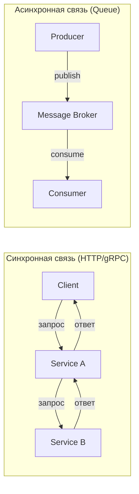

### Сравнительный анализ

| Характеристика | Sync (HTTP/gRPC) | Async (Queue) |
|---|---|---|
| **Задержка** | Моментальный ответ с результатом | Быстрый ответ «принято», результат позже |
| **Связанность** | Оба сервиса должны работать одновременно | Producer не зависит от доступности consumer |
| **Пропускная способность** | Ограничена самым медленным звеном | Consumer обрабатывает в своём темпе |
| **Отказоустойчивость** | Если consumer упал -- ошибка прямо сейчас | Сообщения ждут, пока consumer восстановится |
| **Наблюдаемость** | Легко трейсить запрос-ответ | Сложнее отследить путь сообщения |
| **Сложность** | Простая ментальная модель | Нужно думать о дублях, порядке, retry |
| **Когда использовать** | Нужен ответ прямо сейчас (GET /user, авторизация) | Фоновые задачи, уведомления, аналитика |

### Дерево решений

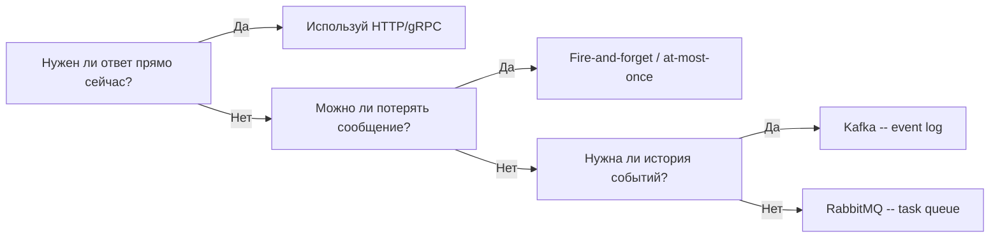

💡 **Практическое правило:** если пользователь не ждёт результат прямо сейчас -- используйте очередь. Авторизация, поиск товара -- синхронно. Отправка письма, генерация отчёта, обработка видео -- асинхронно через очередь.

---

## 2. Два паттерна: Point-to-Point vs Pub/Sub

Прежде чем переходить к конкретным инструментам, важно понять два фундаментальных паттерна. Они описывают **к кому** попадает сообщение.

### Point-to-Point (Queue)

Одно сообщение -- один получатель. Если в очереди 100 сообщений и 5 consumer'ов -- каждый consumer получит примерно по 20 сообщений. Это **распределение работы (load balancing)**.

Аналогия: конвейер на заводе. Каждая деталь попадает к **одному** рабочему, который её обрабатывает. Нельзя, чтобы одну и ту же деталь обрабатывали двое -- будет брак.

```typescript
// Producer кладёт задачу в очередь
await queue.send('email-queue', {
  to: 'user@example.com',
  subject: 'Ваш заказ отправлен',
  body: '...'
})

// Consumer 1 или Consumer 2 -- кто-то ОДИН возьмёт задачу
// Это позволяет масштабировать: 10 consumers = 10x скорость обработки
```

Когда использовать Point-to-Point:
- Обработка задач (resize images, send emails, generate reports)
- Распределение нагрузки между воркерами
- Когда важно, что каждое задание выполняется ровно один раз

### Pub/Sub (Topics)

Одно сообщение -- **все подписчики** получают свою копию. Это **широковещательное оповещение (fanout)**.

Аналогия: газетная рассылка. Когда выходит новый номер, **каждый подписчик** получает свой экземпляр газеты. Это не значит, что они будут делать с ней одно и то же -- кто-то читает спорт, кто-то политику.

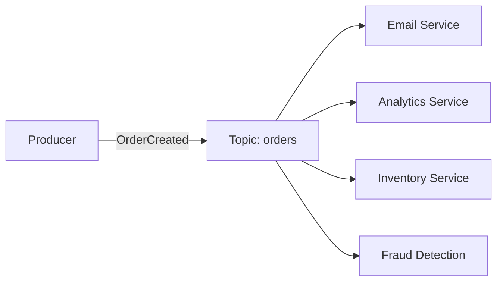

```typescript
// Producer публикует одно событие
await topic.publish('orders', {
  type: 'OrderCreated',
  orderId: '123',
  userId: '42',
  total: 5990
})

// ВСЕ подписчики получат это событие независимо:
// - Email Service: отправит подтверждение покупателю
// - Analytics: запишет в отчёт продаж
// - Inventory: зарезервирует товар на складе
// - Fraud Detection: проверит на признаки мошенничества
```

Когда использовать Pub/Sub:
- Одно событие должно запустить несколько независимых процессов
- Добавление нового consumer не должно требовать изменения producer
- Event-driven архитектура

### Комбинирование паттернов

В реальных системах паттерны часто комбинируют. Например, каждый подписчик топика имеет свою **собственную очередь** из копий сообщений, и несколько экземпляров этого подписчика конкурируют за сообщения из своей очереди. Так работают Consumer Groups в Kafka.

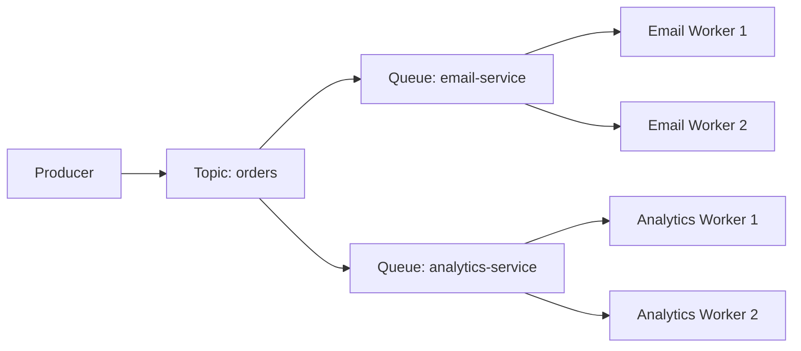

📌 **Итого:** Queue -- когда нужно распределить работу (один consumer обрабатывает). Topic -- когда нужно оповестить всех (каждый consumer получает копию).

---

## 3. RabbitMQ vs Apache Kafka

Два самых популярных решения -- и они созданы для **принципиально разных задач**. Частая ошибка -- выбирать одно из них «по умолчанию» без понимания разницы.

### Ментальные модели

**RabbitMQ** -- это **умное почтовое отделение**. Оно принимает письма (сообщения), умеет их сортировать и маршрутизировать по разным ящикам (очередям), доставляет адресатам и **уничтожает после подтверждения доставки**. История писем не хранится.

**Apache Kafka** -- это **вечный журнал транзакций**. Каждое событие записывается в конец лога и **хранится там навсегда** (или до истечения заданного срока). Новые читатели могут прийти и начать читать с самого начала. Никаких "писем" -- только непрерывная лента событий.

### Архитектура изнутри

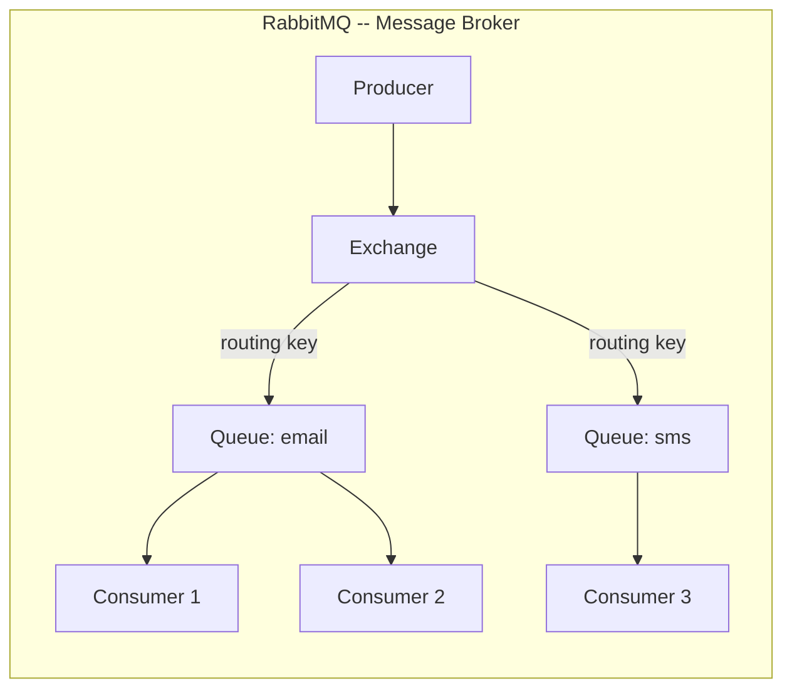

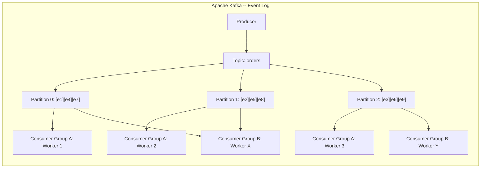

### Детальное сравнение

| Характеристика | RabbitMQ | Apache Kafka |
|---|---|---|
| **Метафора** | Умное почтовое отделение | Вечный журнал транзакций |
| **Модель данных** | Message broker -- доставляет и удаляет | Append-only log -- хранит историю |
| **Хранение** | Сообщение удаляется после ACK | Хранится по retention policy (дни/недели/навсегда) |
| **Маршрутизация** | Гибкая (exchange + routing key, fanout, topic) | По топику и партиции (ключу) |
| **Порядок** | Гарантирован внутри одной очереди | Гарантирован внутри одной partition |
| **Скорость** | ~50K--100K msg/sec | ~1M+ msg/sec |
| **«Перемотка»** | Невозможна -- сообщения удалены | Можно читать с любого offset |
| **Горизонтальное масштабирование** | Через кластеризацию | Встроено через партиционирование |
| **Push vs Pull** | Push -- broker отправляет consumers | Pull -- consumers сами забирают |
| **Типичный use case** | Task queues, RPC, сложная маршрутизация | Event streaming, логи, аналитика, CQRS |

### RabbitMQ: Exchange и маршрутизация

Одна из сильных сторон RabbitMQ -- гибкая маршрутизация через **Exchange**. Producer не пишет напрямую в очередь -- он отправляет в Exchange, который решает, в какую очередь направить сообщение.

```typescript
// RabbitMQ: сложная маршрутизация через Topic Exchange
// Routing key: "<сервис>.<действие>.<результат>"
channel.assertExchange('notifications', 'topic')

// Очередь для всех email-событий
channel.bindQueue('email-queue', 'notifications', 'email.*')

// Очередь только для ошибок любого типа
channel.bindQueue('error-queue', 'notifications', '*.error')

// Очередь для критических ошибок платёжной системы
channel.bindQueue('critical-queue', 'notifications', 'payment.error')

// Публикуем: попадёт в email-queue и ни в одну другую
channel.publish('notifications', 'email.sent', Buffer.from(JSON.stringify({
  to: 'user@example.com',
  subject: 'Ваш заказ отправлен'
})))

// Публикуем: попадёт в error-queue и critical-queue
channel.publish('notifications', 'payment.error', Buffer.from(JSON.stringify({
  message: 'Card declined',
  orderId: '123'
})))
```

### Kafka: Partitions и Consumer Groups

Kafka достигает колоссальной пропускной способности за счёт **партиционирования**. Топик разбивается на несколько параллельных партиций, каждая из которых читается отдельным consumer'ом.

```
Topic: orders (3 partitions)

  Partition 0: [order-1] [order-4] [order-7] ...
  Partition 1: [order-2] [order-5] [order-8] ...
  Partition 2: [order-3] [order-6] [order-9] ...

Consumer Group "payment-service" (3 instances):
  Consumer A ← читает Partition 0
  Consumer B ← читает Partition 1
  Consumer C ← читает Partition 2

Consumer Group "analytics" (2 instances):
  Consumer X ← читает Partition 0 + Partition 1
  Consumer Y ← читает Partition 2
```

Ключевая идея: **каждая Consumer Group читает топик независимо**. Payment Service и Analytics Service получают все одни и те же события, но ведут собственные указатели (offsets). Это принципиальное отличие от RabbitMQ, где сообщение забирается один раз.

```typescript
// Kafka: событие записывается в лог
await producer.send({
  topic: 'user-events',
  messages: [{
    key: 'user-42',        // Все события user-42 → одна partition (порядок гарантирован)
    value: JSON.stringify({
      type: 'PageViewed',
      page: '/products/123',
      timestamp: Date.now()
    })
  }]
})
// Через месяц можно «перемотать» и прочитать все события заново!

// Consumer Group с несколькими worker'ами
const consumer = kafka.consumer({ groupId: 'analytics-service' })
await consumer.subscribe({ topic: 'user-events', fromBeginning: false })

await consumer.run({
  eachMessage: async ({ topic, partition, message }) => {
    const event = JSON.parse(message.value.toString())
    await analyticsDB.record(event)
    // offset коммитится автоматически после eachMessage
  }
})
```

📌 **Ключевое правило Kafka:** количество consumers в группе <= количества partitions. Лишние consumers будут простаивать -- Kafka не может назначить одну partition двум consumers одновременно (внутри одной группы).

### RabbitMQ: задачи в очереди

```typescript
// RabbitMQ: задача обрабатывается и удаляется
channel.sendToQueue('resize-images', Buffer.from(JSON.stringify({
  imageUrl: '/uploads/photo.jpg',
  sizes: [150, 300, 600]
})), { persistent: true }) // persistent: true -- сообщение выживет при перезапуске

// Consumer
channel.consume('resize-images', async (msg) => {
  const task = JSON.parse(msg.content.toString())
  await resizeAndUpload(task.imageUrl, task.sizes)
  channel.ack(msg) // Подтверждаем -- сообщение удаляется из очереди
}, { noAck: false })
```

---

## 4. Гарантии доставки

Это, пожалуй, самый важный вопрос при проектировании: **что происходит при сбое?** Сеть ненадёжна, сервисы падают, диски заканчиваются. Гарантия доставки определяет поведение системы в этих случаях.

### Три уровня гарантий

| Гарантия | Описание | Сколько раз | Потери? | Дубли? |
|---|---|---|---|---|
| **At-most-once** | Отправил и забыл. Нет подтверждения | 0 или 1 раз | Возможны | Нет |
| **At-least-once** | Повторяет до получения ACK | 1 или более раз | Нет | Возможны |
| **Exactly-once** | Ровно один раз, без потерь и дублей | Ровно 1 раз | Нет | Нет |

### Как работают гарантии под капотом

**At-most-once** -- самый простой случай. Producer отправляет и не ждёт подтверждения. Если broker недоступен -- сообщение теряется навсегда.

```typescript
// At-most-once: fire-and-forget
producer.send(message)
// Если broker упал в этот момент -- сообщение потеряно
// Зато очень быстро: нет ожидания подтверждения
```

**At-least-once** -- стандарт для бизнес-логики. Producer ждёт ACK от broker'а. Consumer подтверждает обработку ПОСЛЕ её завершения. Если consumer упал между обработкой и ACK -- broker переотправит сообщение.

```typescript
// At-least-once: подтверждение + retry

// Kafka: producer ждёт подтверждения от всех replica-leaders
const producer = kafka.producer({
  idempotent: true,     // Producer-side deduplication
  acks: -1,             // -1 = 'all' -- ждём подтверждения от всех ISR реплик
  retries: 5,           // До 5 попыток при ошибке
  retry: {
    retryTime: 300,     // 300ms между попытками
    multiplier: 2       // Exponential backoff
  }
})

// Consumer подтверждает ПОСЛЕ обработки:
consumer.on('message', async (msg) => {
  await processOrder(msg)  // Сначала обработка
  msg.ack()                // Потом подтверждение
  // Если consumer упал между process и ack -- сообщение придёт снова
  // Поэтому consumer должен быть идемпотентным
})
```

**Exactly-once** -- требует транзакционного механизма. Kafka реализует это через idempotent producer + transactional consumer.

```typescript
// Exactly-once в Kafka (только внутри Kafka, не end-to-end!)
const producer = kafka.producer({
  idempotent: true,
  transactionalId: 'order-processor-1' // Уникальный ID для транзакций
})

await producer.connect()
await producer.transaction(async (tx) => {
  // Читаем из одного топика и пишем в другой атомарно
  await tx.send({
    topic: 'processed-orders',
    messages: [{ value: JSON.stringify(processedOrder) }]
  })
  await tx.sendOffsets({
    consumerGroupId: 'payment-service',
    topics: [{ topic: 'orders', partitions: [{ partition: 0, offset: '42' }] }]
  })
})
// Либо всё, либо ничего
```

### Почему exactly-once -- частичный миф

⚠️ Важно понимать: Kafka реализует exactly-once **только внутри себя** (producer → Kafka → consumer в рамках одного Kafka-кластера). Как только consumer пишет данные в **внешнюю БД**, гарантия нарушается. Если consumer записал в PostgreSQL и упал до коммита offset -- при рестарте он обработает сообщение снова.

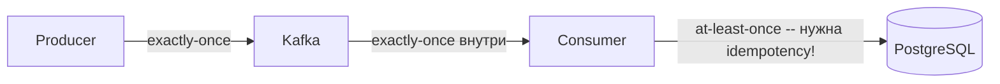

Для реального end-to-end exactly-once нужна **idempotency на уровне consumer + внешнего хранилища**. Именно поэтому следующая секция так важна.

---

## 5. Idempotency -- ваш главный защитник

Если система использует at-least-once (а для бизнес-логики она должна именно так), сообщения **будут дублироваться**. Это не баг, это фича -- система предпочитает обработать дважды, чем не обработать вовсе. Ваш consumer должен быть **идемпотентным** -- повторная обработка того же сообщения должна давать тот же результат, что и однократная.

### Математическая аналогия

Идемпотентная операция -- та, которая даёт одинаковый результат при любом количестве применений:

- `f(x) = 5` -- идемпотентна (можно вызывать сколько угодно)
- `f(x) = x + 1` -- не идемпотентна (каждый вызов меняет результат)

В базах данных:
- `INSERT INTO orders VALUES (id=123, ...)` -- не идемпотентна (дублирует запись)
- `INSERT INTO orders VALUES (id=123, ...) ON CONFLICT (id) DO NOTHING` -- идемпотентна

### Паттерны idempotency

**Паттерн 1: Idempotency Key + БД-дедупликация**

```typescript
// ❌ Не идемпотентно -- при повторе спишем дважды
async function processPayment(msg: PaymentMessage) {
  await db.query(
    'UPDATE balance SET amount = amount - $1 WHERE user_id = $2',
    [msg.amount, msg.userId]
  )
}

// ✅ Идемпотентно -- используем уникальный ключ операции
async function processPayment(msg: PaymentMessage) {
  // Атомарная проверка + запись в одной транзакции
  await db.transaction(async (tx) => {
    // Пробуем вставить запись об операции
    const inserted = await tx.query(
      `INSERT INTO processed_payments (idempotency_key, processed_at)
       VALUES ($1, NOW())
       ON CONFLICT (idempotency_key) DO NOTHING`,
      [msg.idempotencyKey]
    )

    if (inserted.rowCount === 0) {
      // Запись уже была -- эта операция уже обработана
      return
    }

    // Первый раз -- выполняем
    await tx.query(
      'UPDATE balance SET amount = amount - $1 WHERE user_id = $2',
      [msg.amount, msg.userId]
    )
  })
}
```

**Паттерн 2: Redis для быстрой дедупликации**

```typescript
// Быстрая проверка через Redis (подходит когда БД-транзакция избыточна)
async function sendNotification(msg: NotificationMessage) {
  const dedupKey = `notif-sent:${msg.messageId}`

  // SET NX -- установить только если ключ не существует
  const wasNew = await redis.set(dedupKey, '1', {
    NX: true,
    EX: 86400 // Хранить 24 часа -- окно дедупликации
  })

  if (!wasNew) {
    // Уже отправляли -- пропускаем
    return
  }

  await sendEmail(msg.to, msg.subject, msg.body)
}
```

**Паттерн 3: Natural Key (естественный ключ)**

Иногда idempotency обеспечивается самой природой операции. Например, `UPDATE orders SET status = 'shipped' WHERE id = 123` -- идемпотентна сама по себе: сколько бы раз ни выполнили, результат одинаков.

```typescript
// ✅ Идемпотентно по природе -- задаём конечное состояние, не инкремент
async function markOrderShipped(msg: OrderShippedMessage) {
  await db.query(
    `UPDATE orders
     SET status = 'shipped', shipped_at = COALESCE(shipped_at, $1)
     WHERE id = $2`,
    [msg.shippedAt, msg.orderId]
  )
  // COALESCE гарантирует, что shipped_at не перезапишется при повторе
}
```

💡 **Idempotency key** -- уникальный идентификатор операции (orderId, transactionId, UUID). Генерируйте его на стороне **producer** и передавайте вместе с сообщением. Consumer использует его для дедупликации.

---

## 6. Dead Letter Queue (DLQ)

Что делать, если сообщение не удаётся обработать? Бесконечно retry -- плохо: «ядовитое» (poison) сообщение заблокирует очередь для всех остальных. Просто выбросить -- потеря данных. Решение -- **Dead Letter Queue** (очередь мёртвых писем).

### Как работает DLQ

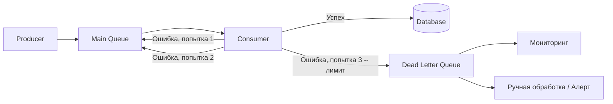

### Настройка DLQ в RabbitMQ

```typescript
// При создании основной очереди указываем DLQ
channel.assertExchange('dlx', 'direct') // Dead Letter Exchange
channel.assertQueue('orders-dlq')        // Dead Letter Queue
channel.bindQueue('orders-dlq', 'dlx', 'orders')

channel.assertQueue('orders', {
  durable: true,
  arguments: {
    'x-dead-letter-exchange': 'dlx',        // При отклонении → dlx
    'x-dead-letter-routing-key': 'orders',   // Routing key в DLX
    'x-message-ttl': 30000,                  // Timeout 30 сек → DLQ
    'x-max-delivery-count': 3                // Максимум 3 попытки
  }
})

// Consumer с корректным retry + DLQ
channel.consume('orders', async (msg) => {
  if (!msg) return

  try {
    await processOrder(JSON.parse(msg.content.toString()))
    channel.ack(msg)  // Успешно -- удаляем из очереди
  } catch (error) {
    const deliveryCount = msg.properties.headers['x-delivery-count'] || 0

    if (deliveryCount >= 3) {
      // Исчерпали попытки -- отправляем в DLQ
      channel.reject(msg, false) // false = не возвращать в очередь
      alertOps('Poison message detected', { error, msg: msg.content.toString() })
    } else {
      // Возвращаем для повтора с задержкой
      setTimeout(() => {
        channel.nack(msg, false, true) // true = вернуть в очередь
      }, Math.pow(2, deliveryCount) * 1000) // Exponential backoff
    }
  }
}, { noAck: false })
```

### Exponential Backoff -- умный retry

Просто повторять немедленно -- плохая идея. Если сервис упал из-за перегрузки, немедленный retry только усугубит ситуацию. Используйте **экспоненциальный откат** с джиттером (случайным разбросом):

```typescript
function getRetryDelay(attempt: number): number {
  const baseDelay = 1000       // 1 секунда
  const maxDelay = 60000       // 60 секунд
  const jitter = Math.random() * 0.3 // ±30% случайности

  const delay = Math.min(
    baseDelay * Math.pow(2, attempt) * (1 + jitter),
    maxDelay
  )

  return Math.floor(delay)
}

// attempt 0: ~1000ms
// attempt 1: ~2000ms
// attempt 2: ~4000ms
// attempt 3: ~8000ms -- исчерпали, идём в DLQ
```

📌 **DLQ -- это «карантин» для проблемных сообщений.** Они не теряются, а ждут ручного разбора. Мониторинг DLQ -- обязательная практика. Если DLQ начинает заполняться -- это сигнал о системной проблеме.

---

## 7. Backpressure -- защита от перегрузки

Что если producer генерирует 10 000 msg/sec, а consumer обрабатывает только 1 000? Очередь растёт бесконечно → память заканчивается → broker падает → всё падает.

**Backpressure** -- механизм обратного давления: система сигнализирует «я не успеваю, притормози».

### Стратегии backpressure

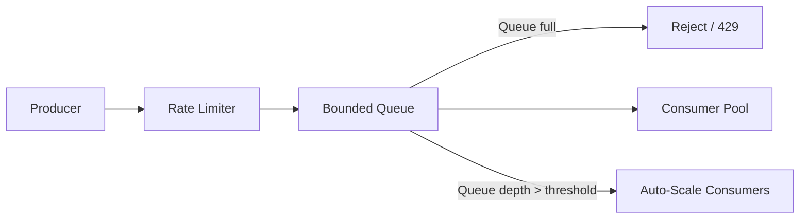

```typescript
// Стратегия 1: Ограничение размера очереди (bounded queue)
// RabbitMQ: ограничение через x-max-length
channel.assertQueue('tasks', {
  arguments: {
    'x-max-length': 100_000,           // Максимум 100K сообщений
    'x-overflow': 'reject-publish'      // При переполнении -- отклонять новые
    // Альтернатива: 'drop-head' -- удалять самые старые
  }
})

// Producer проверяет ответ
try {
  await channel.sendToQueue('tasks', message, { mandatory: true })
} catch (error) {
  // Queue full -- возвращаем 429
  return res.status(429).json({
    error: 'Service overloaded, try again later',
    retryAfter: 30
  })
}
```

```typescript
// Стратегия 2: Rate limiting на стороне producer
import Bottleneck from 'bottleneck'

const limiter = new Bottleneck({
  maxConcurrent: 10,   // Максимум 10 параллельных запросов
  minTime: 100          // Минимум 100ms между запросами (10 req/sec)
})

await limiter.schedule(() => producer.send(message))
```

```typescript
// Стратегия 3: Автоматическое масштабирование consumers
// (пример с Kubernetes Horizontal Pod Autoscaler через KEDA)

// KEDA ScaledObject для RabbitMQ:
const scaledObject = {
  apiVersion: 'keda.sh/v1alpha1',
  kind: 'ScaledObject',
  spec: {
    scaleTargetRef: { name: 'email-worker' },
    minReplicaCount: 1,
    maxReplicaCount: 50,
    triggers: [{
      type: 'rabbitmq',
      metadata: {
        queueName: 'email-queue',
        value: '100'  // 1 replica на каждые 100 сообщений в очереди
      }
    }]
  }
}
```

### Почему bounded queue важнее, чем кажется

Unbounded queue -- это **скрытая бомба**. При пиковой нагрузке она незаметно растёт, пока не съест всю память. Bounded queue заставляет систему явно принять решение: отклонить новые запросы или выбросить старые. Это лучше, чем молчаливое падение всего брокера.

---

## 8. Event-Driven Architecture и CQRS

### Event-Driven Architecture (EDA)

В классической микросервисной архитектуре сервисы вызывают друг друга напрямую. Это создаёт **tight coupling** (тесную связь): Order Service должен знать про Payment Service, Inventory Service и т.д.

EDA переворачивает эту модель: сервисы **публикуют события** (что произошло) и **подписываются** на события (что им интересно). Никто ни о ком не знает напрямую.

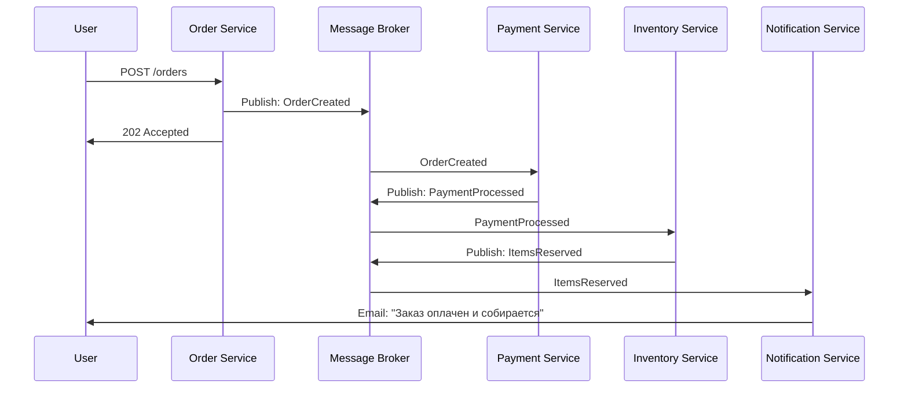

Преимущества EDA:

- **Открытость к расширению.** Добавляем Loyalty Service -- он просто подписывается на `OrderCreated`, ничего не меняется в существующих сервисах.
- **Устойчивость к сбоям.** Если Notification Service недоступен -- заказ всё равно оформится. Уведомление придёт позже.
- **Аудит-лог из коробки.** Все события в брокере -- это полная история всего, что происходило в системе.

### CQRS (Command Query Responsibility Segregation)

CQRS -- паттерн, часто используемый вместе с EDA. Идея: разделить **модель записи** (commands) и **модель чтения** (queries). Записываем в нормализованную БД, читаем из денормализованной (оптимизированной для конкретных запросов).

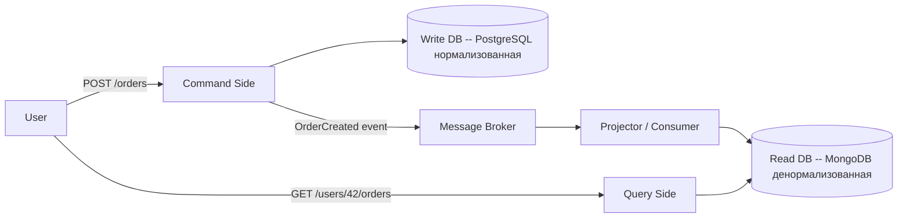

```typescript
// Command (запись): нормализованная SQL-БД
async function createOrder(cmd: CreateOrderCommand) {
  const orderId = uuid()

  await commandDB.transaction(async (tx) => {
    await tx.query(
      'INSERT INTO orders (id, user_id, total, status) VALUES ($1, $2, $3, $4)',
      [orderId, cmd.userId, cmd.total, 'pending']
    )
    for (const item of cmd.items) {
      await tx.query(
        'INSERT INTO order_items (order_id, product_id, quantity, price) VALUES ($1, $2, $3, $4)',
        [orderId, item.productId, item.quantity, item.price]
      )
    }
  })

  // Публикуем событие
  await broker.publish('orders', {
    type: 'OrderCreated',
    orderId,
    userId: cmd.userId,
    total: cmd.total,
    items: cmd.items
  })

  return orderId
}

// Projector: слушает события и обновляет read-модель
consumer.on('OrderCreated', async (event) => {
  // Денормализованная структура для быстрого чтения
  await readDB.collection('user-orders').updateOne(
    { userId: event.userId },
    {
      $push: {
        orders: {
          id: event.orderId,
          total: event.total,
          status: 'pending',
          createdAt: new Date()
        }
      },
      $inc: {
        totalOrders: 1,
        totalSpent: event.total
      }
    },
    { upsert: true }
  )
})

// Query (чтение): один быстрый запрос без JOIN
async function getUserOrders(userId: string) {
  return readDB.collection('user-orders').findOne({ userId })
  // { orders: [...], totalOrders: 47, totalSpent: 234500 }
  // Никаких JOIN, никаких агрегаций -- данные уже готовы
}
```

### Event Sourcing -- хранение истории как первоклассный гражданин

CQRS часто идёт рука об руку с **Event Sourcing** -- паттерном, где состояние системы определяется не текущим значением в БД, а **историей всех событий**. Вместо `UPDATE orders SET status = 'shipped'` мы добавляем событие `OrderShipped`. Текущее состояние восстанавливается применением всех событий по порядку.

```typescript
// Event Sourcing: состояние = применение всех событий
async function getOrderState(orderId: string): Promise<Order> {
  const events = await eventStore.getEvents('order', orderId)

  return events.reduce((state, event) => {
    switch (event.type) {
      case 'OrderCreated':
        return { ...state, id: orderId, status: 'pending', total: event.total }
      case 'PaymentProcessed':
        return { ...state, status: 'paid', paidAt: event.timestamp }
      case 'OrderShipped':
        return { ...state, status: 'shipped', trackingId: event.trackingId }
      default:
        return state
    }
  }, {} as Order)
}
```

💡 **CQRS имеет смысл** когда паттерны чтения и записи сильно отличаются (например, пишем редко, читаем часто с разными проекциями). Для простых CRUD -- это избыточное усложнение.

---

## 9. Частые ошибки новичков

### ❌ Ошибка 1: Синхронный вызов для тяжёлых задач

Самая распространённая ошибка -- делать синхронно то, что должно выполняться асинхронно.

```typescript
// ❌ Пользователь ждёт 45 секунд
app.post('/upload-video', async (req, res) => {
  const result = await processVideo(req.file)   // 30 секунд!
  await generateThumbnails(req.file)             // ещё 10 секунд!
  await notifyFollowers(req.user)                // ещё 5 секунд!
  res.json(result) // Пользователь ждал 45 секунд
  // За это время соединение могло оборваться, таймаут сработать
  // А если 100 пользователей загрузят одновременно?
})
```

```typescript
// ✅ Принимаем запрос и кладём в очередь
app.post('/upload-video', async (req, res) => {
  const jobId = await queue.send('video-processing', {
    file: req.file,
    userId: req.user.id
  })
  res.json({ jobId, status: 'processing' }) // Ответ за 50 мс
  // Клиент может опросить статус: GET /jobs/:jobId
})
```

### ❌ Ошибка 2: Нет idempotency при at-least-once

```typescript
// ❌ Повтор сообщения отправит два письма / спишет дважды
consumer.on('message', async (msg) => {
  await sendEmail(msg.to, msg.subject)  // При retry -- дубль письма!
  msg.ack()
})
```

```typescript
// ✅ Проверяем, не обработали ли уже
consumer.on('message', async (msg) => {
  const alreadySent = await redis.set(
    `email-sent:${msg.messageId}`,
    '1',
    { NX: true, EX: 86400 }
  )

  if (!alreadySent) {
    msg.ack()
    return  // Уже обработано
  }

  await sendEmail(msg.to, msg.subject)
  msg.ack()
})
```

### ❌ Ошибка 3: ACK до обработки (at-most-once вместо at-least-once)

```typescript
// ❌ Если processOrder упадёт -- сообщение уже подтверждено и потеряно навсегда
consumer.on('message', async (msg) => {
  msg.ack()                    // Подтверждаем ДО обработки!
  await processOrder(msg)      // Если здесь ошибка -- сообщение потеряно
})
```

```typescript
// ✅ ACK только ПОСЛЕ успешной обработки
consumer.on('message', async (msg) => {
  await processOrder(msg)      // Сначала обрабатываем
  msg.ack()                    // Только потом подтверждаем
  // Если упадём здесь -- сообщение придёт снова (нужна idempotency)
})
```

### ❌ Ошибка 4: Нет DLQ -- poison message блокирует очередь

```typescript
// ❌ Битое сообщение retry бесконечно, блокируя всю очередь
consumer.on('message', async (msg) => {
  try {
    await process(msg)
    msg.ack()
  } catch {
    msg.nack(true)  // requeue = true → бесконечный цикл!
    // Очередь заблокирована, остальные сообщения не обрабатываются
  }
})
```

```typescript
// ✅ Ограниченный retry + DLQ
consumer.on('message', async (msg) => {
  try {
    await process(msg)
    msg.ack()
  } catch (error) {
    const attempts = msg.properties.headers['x-delivery-count'] || 0

    if (attempts >= 3) {
      msg.reject(false)  // false = не возвращать в очередь → DLQ
      logger.error('Poison message sent to DLQ', { error, msg })
    } else {
      msg.nack(true)     // Вернуть для retry
    }
  }
})
```

### ❌ Ошибка 5: Слишком большие сообщения

Очереди не предназначены для передачи файлов или больших объектов. Типичный лимит -- 1-10 MB. Передавайте ссылки, не данные.

```typescript
// ❌ Кладём всё изображение в сообщение (5 MB)
await queue.send('image-resize', {
  imageData: fs.readFileSync('/uploads/photo.jpg').toString('base64'), // 5MB!
  sizes: [150, 300, 600]
})

// ✅ Кладём только ссылку -- данные уже в S3
await queue.send('image-resize', {
  imageKey: 'uploads/user-42/photo-1234.jpg',  // Ссылка на S3
  sizes: [150, 300, 600]
})
// Worker сам скачает из S3 по ссылке
```

### ❌ Ошибка 6: Нет мониторинга очередей

Очередь -- это не «set and forget». Без мониторинга вы не узнаете, что:
- Очередь накопила 500 000 сообщений (consumer отстаёт)
- DLQ заполнилась (есть системная проблема)
- Consumer не отвечает вот уже час

```typescript
// ✅ Экспортируем метрики очередей
async function collectQueueMetrics() {
  const queueInfo = await channel.checkQueue('orders')

  metrics.gauge('queue.depth', queueInfo.messageCount, { queue: 'orders' })
  metrics.gauge('queue.consumers', queueInfo.consumerCount, { queue: 'orders' })

  // Алерт если DLQ не пустая
  const dlqInfo = await channel.checkQueue('orders-dlq')
  if (dlqInfo.messageCount > 0) {
    alertOps('DLQ has messages', { count: dlqInfo.messageCount })
  }
}

setInterval(collectQueueMetrics, 30_000)
```

---

## Итоги

| Концепция | Ключевая мысль |
|---|---|
| **Queue vs Topic** | Queue -- один получатель (load balancing), Topic -- все подписчики (fanout) |
| **RabbitMQ** | Message broker: умная маршрутизация, удаляет после ACK, ~50K msg/sec |
| **Kafka** | Event log: хранит историю, «перемотка», партиционирование, ~1M+ msg/sec |
| **At-least-once** | Стандарт для бизнес-логики -- возможны дубли, нужна idempotency |
| **Idempotency** | Idempotency key + дедупликация -- must have при at-least-once |
| **DLQ** | «Карантин» для проблемных сообщений -- обязательна в production |
| **Backpressure** | Bounded queue + rate limiting + auto-scaling consumers |
| **EDA** | Сервисы общаются событиями, не прямыми вызовами -- loose coupling |
| **CQRS** | Разделение записи и чтения через события -- когда паттерны доступа различаются |

🎯 **Главный принцип:** если пользователю не нужен результат прямо сейчас -- кладите задачу в очередь. Это повышает отказоустойчивость, масштабируемость и скорость отклика. Но помните: асинхронность усложняет отладку, поэтому инвестируйте в мониторинг, трейсинг и DLQ.
