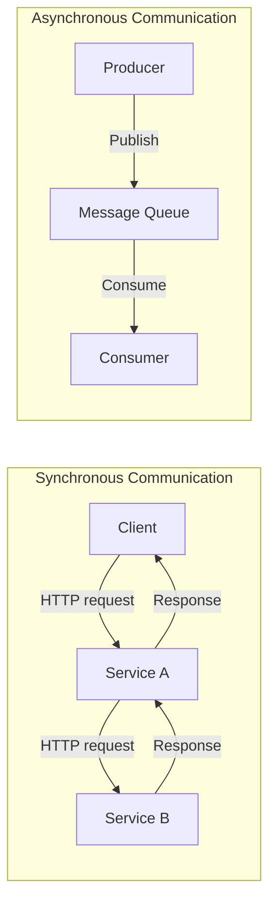
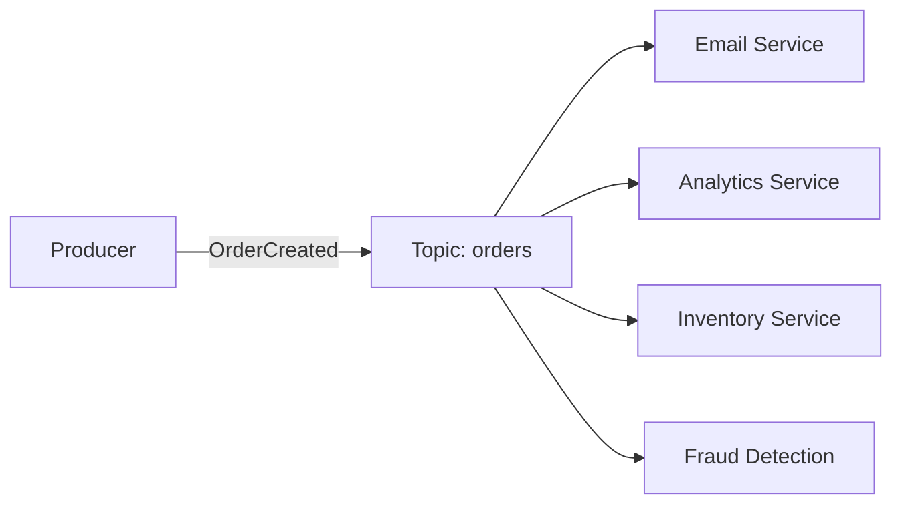
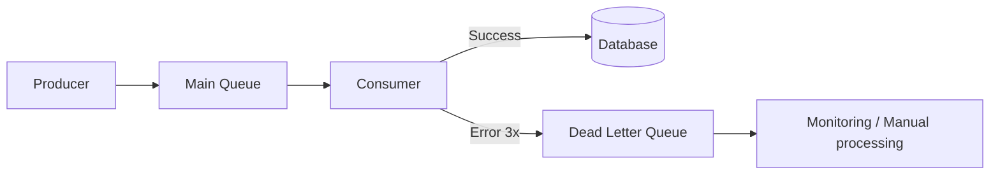
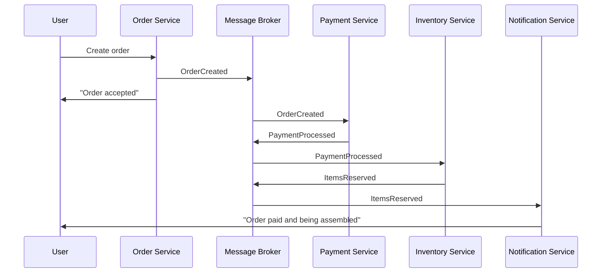

# 🔥 Level 5: Message Queues and Asynchronous Processing

## 🎯 Why Do We Need Message Queues?

Imagine: you're at a cafe, you ordered coffee. There are two options:

- **Synchronous:** you stand at the counter and wait while the barista makes your latte (3 minutes). Nobody behind you can order.
- **Asynchronous:** you get a numbered ticket, sit down, and the barista calls "Order 42!" when it's ready. The counter is free for the next customers.

This "numbered ticket" is a **message queue**. The sending service puts a task in the queue and continues working. The receiving service picks up the task when it's ready.

```
Synchronous (request-response):
  Client → [waits 3 sec] → Service A → [waits 2 sec] → Service B → Response
  Total: 5 sec, client is blocked

Asynchronous (via queue):
  Client → Service A → [puts in queue] → "Accepted!" (50 ms)
                        Queue → Service B (processes at its own pace)
  Total: 50 ms for the client, processing in the background
```

📌 **A queue is a buffer between services.** It decouples the sender and receiver: they don't need to run simultaneously, at the same speed, or even know about each other.

## 🔥 Sync vs Async — When to Choose What



| | Sync (HTTP/gRPC) | Async (Queue) |
|---|---|---|
| **Latency** | Instant response | "Accepted" response, result later |
| **Coupling** | Both services must be running | Producer doesn't depend on consumer |
| **Throughput** | Limited by the slowest link | Consumer processes at its own pace |
| **Fault tolerance** | If consumer is down — error | Messages wait in the queue |
| **When** | Need the answer right now (GET /user) | Background tasks, notifications, analytics |

💡 **Rule:** if the user isn't waiting for the result right now — use a queue.

## 🔥 Two Patterns: Point-to-Point vs Pub/Sub

### Point-to-Point (Queue)

One message — one receiver. Like a factory conveyor belt: each part goes to one worker.

```typescript
// Producer puts a task in the queue
await queue.send('email-queue', {
  to: 'user@example.com',
  subject: 'Your order has been shipped',
  body: '...'
})

// Consumer 1 or Consumer 2 — ONE of them will pick up the task
// This enables scaling: 10 consumers = 10x speed
```

### Pub/Sub (Topics)

One message — all subscribers get a copy. Like a newspaper mailing list: one newspaper, thousands of subscribers.



```typescript
// Producer publishes one event
await topic.publish('orders', {
  type: 'OrderCreated',
  orderId: '123',
  userId: '42',
  total: 5990
})

// ALL subscribers receive this event:
// - Email Service: sends confirmation
// - Analytics: writes to report
// - Inventory: reserves the product
// - Fraud Detection: checks for fraud
```

📌 **Queue** — when you need to distribute work (load balancing). **Topic** — when you need to notify everyone (fanout).

## 🔥 RabbitMQ vs Apache Kafka

The two most popular solutions — and they are for **different tasks**.

| | RabbitMQ | Apache Kafka |
|---|---|---|
| **Metaphor** | Post office (smart routing) | Transaction log (append-only log) |
| **Model** | Message broker — delivers and deletes | Event log — stores event history |
| **Storage** | Message deleted after acknowledgment | Messages are stored (days/weeks/forever) |
| **Ordering** | Guaranteed within a single queue | Guaranteed within a single partition |
| **Speed** | ~50K msg/sec | ~1M+ msg/sec |
| **When** | Task queues, RPC, complex routing | Event streaming, logs, analytics, CQRS |

```typescript
// RabbitMQ: task is processed and deleted
channel.sendToQueue('resize-images', Buffer.from(JSON.stringify({
  imageUrl: '/uploads/photo.jpg',
  sizes: [150, 300, 600]
})))

// Kafka: event is written to the log forever
await producer.send({
  topic: 'user-events',
  messages: [{
    key: 'user-42',        // All user-42 events → one partition
    value: JSON.stringify({
      type: 'PageViewed',
      page: '/products/123',
      timestamp: Date.now()
    })
  }]
})
// Months later you can "rewind" and re-read all events
```

### Kafka: Partitions and Consumer Groups

Kafka achieves enormous throughput through **partitioning**.

```
Topic: orders (3 partitions)

  Partition 0: [order-1] [order-4] [order-7] ...
  Partition 1: [order-2] [order-5] [order-8] ...
  Partition 2: [order-3] [order-6] [order-9] ...

Consumer Group "payment-service" (3 instances):
  Consumer A ← reads Partition 0
  Consumer B ← reads Partition 1
  Consumer C ← reads Partition 2

Consumer Group "analytics" (2 instances):
  Consumer X ← reads Partition 0 + Partition 1
  Consumer Y ← reads Partition 2
```

📌 **Key Kafka rule:** number of consumers in a group <= number of partitions. More consumers — useless, they will be idle.

## 🔥 Delivery Guarantees

This is the most important question in design: **what happens on failure?**

| Guarantee | Description | When |
|---|---|---|
| **At-most-once** | Message is delivered 0 or 1 time. May be lost. | Logs, metrics — loss is not critical |
| **At-least-once** | Message is delivered 1 or more times. May duplicate. | Orders, payments — loss is unacceptable |
| **Exactly-once** | Message is delivered exactly 1 time. | Finance (in practice — very expensive) |

```typescript
// At-most-once: fire-and-forget
producer.send(message) // If the broker is down — message is lost

// At-least-once: acknowledgment + retry
producer.send(message, { acks: 'all' }) // Wait for confirmation
// Consumer acknowledges AFTER processing:
consumer.on('message', async (msg) => {
  await processOrder(msg)  // Processing first
  msg.ack()                // Then acknowledgment
  // If consumer crashed between process and ack — message will arrive again
})

// Exactly-once: Kafka Transactions (idempotent producer + transactional consumer)
await producer.send({
  topic: 'transfers',
  messages: [{ value: '...' }],
  transactional: true  // Kafka ensures exactly-once within itself
})
```

⚠️ **Exactly-once — a myth?** In distributed systems, true exactly-once between different services is practically impossible. Kafka implements it only **within itself** (producer → Kafka → consumer). As soon as the consumer writes to a DB — idempotency is needed.

## 🔥 Idempotency — Your Main Defender

If the system uses at-least-once (and it should), messages **will duplicate**. Your consumer must be **idempotent** — processing the same message twice produces the same result.

```typescript
// ❌ Not idempotent — on retry, we'll charge twice
async function processPayment(msg: PaymentMessage) {
  await db.query('UPDATE balance SET amount = amount - $1 WHERE user_id = $2',
    [msg.amount, msg.userId])
}

// ✅ Idempotent — use a unique operation key
async function processPayment(msg: PaymentMessage) {
  const exists = await db.query(
    'SELECT 1 FROM processed_payments WHERE idempotency_key = $1',
    [msg.idempotencyKey]
  )
  if (exists.rows.length > 0) return // Already processed — skip

  await db.transaction(async (tx) => {
    await tx.query('INSERT INTO processed_payments (idempotency_key) VALUES ($1)',
      [msg.idempotencyKey])
    await tx.query('UPDATE balance SET amount = amount - $1 WHERE user_id = $2',
      [msg.amount, msg.userId])
  })
}
```

💡 **Idempotency key** — a unique operation identifier (orderId, transactionId, UUID). Store a list of processed keys in the DB.

## 🔥 Dead Letter Queue (DLQ)

What to do when a message can't be processed? Infinite retry is bad (a poison message will block the queue). Discarding — data loss. The solution — **DLQ**.



```typescript
// DLQ configuration in RabbitMQ
channel.assertQueue('orders', {
  deadLetterExchange: 'dlx',
  deadLetterRoutingKey: 'orders-dlq',
  arguments: {
    'x-message-ttl': 30000,         // Timeout: 30 sec
    'x-max-delivery-count': 3       // Maximum 3 attempts
  }
})

// Consumer with retry + DLQ
consumer.on('message', async (msg) => {
  try {
    await processOrder(msg)
    msg.ack()
  } catch (error) {
    if (msg.deliveryCount >= 3) {
      msg.reject(false) // Send to DLQ (requeue = false)
      alertOps('Order failed 3 times', msg)
    } else {
      msg.nack(true)    // Return to queue for retry
    }
  }
})
```

📌 **DLQ is a "basket of problematic messages".** They aren't lost — they're waiting for review. Monitoring the DLQ is mandatory practice.

## 🔥 Backpressure — Overload Protection

What if the producer generates 10,000 msg/sec, but the consumer only processes 1,000? The queue grows infinitely → memory runs out → system crashes.

**Backpressure** — a reverse pressure mechanism: "hey, I can't keep up, slow down!"

```typescript
// Backpressure strategies:

// 1. Bounded queue size
const MAX_QUEUE_SIZE = 100_000
if (queue.size >= MAX_QUEUE_SIZE) {
  return { status: 429, message: 'Queue full, try later' }
}

// 2. Rate limiting on the producer
const rateLimiter = new RateLimiter({ maxPerSecond: 5000 })
await rateLimiter.acquire()
await producer.send(message)

// 3. Scale consumers (auto-scaling)
if (queue.depth > THRESHOLD) {
  await scaleConsumers(currentCount + 2)
}
```

## 🔥 Event-Driven Architecture and CQRS

### Event-Driven Architecture (EDA)

Services communicate through **events**, not direct calls. Each service reacts to events it cares about.



### CQRS (Command Query Responsibility Segregation)

We split the model into **write** (commands) and **read** (queries). Write to one DB, read from another (optimized).

```typescript
// Command (write): normalized SQL DB
await commandDB.query(
  'INSERT INTO orders (id, user_id, items, total) VALUES ($1, $2, $3, $4)',
  [orderId, userId, items, total]
)
// Publish event
await broker.publish('orders', { type: 'OrderCreated', orderId, userId, total })

// Query (read): denormalized NoSQL DB, optimized for queries
// Consumer listens to events and updates the read model
consumer.on('OrderCreated', async (event) => {
  await readDB.upsert('user-orders', {
    id: event.userId,
    orders: { $push: { id: event.orderId, total: event.total, status: 'created' } },
    totalOrders: { $inc: 1 },
    totalSpent: { $inc: event.total }
  })
})

// Read API — fast query without JOIN
const userProfile = await readDB.get('user-orders', userId)
// { orders: [...], totalOrders: 47, totalSpent: 234500 }
```

💡 **CQRS makes sense** when read and write patterns differ significantly. For simple CRUD — it's overkill.

## ⚠️ Common Beginner Mistakes

### ❌ Mistake 1: Synchronous call instead of queue for heavy tasks

```typescript
// ❌ User waits 30 seconds for video processing
app.post('/upload-video', async (req, res) => {
  const result = await processVideo(req.file)   // 30 seconds!
  await generateThumbnails(req.file)             // another 10 seconds!
  await notifyFollowers(req.user)                // another 5 seconds!
  res.json(result) // User waited 45 seconds
})
```

```typescript
// ✅ Accept and put in queue
app.post('/upload-video', async (req, res) => {
  const jobId = await queue.send('video-processing', {
    file: req.file,
    userId: req.user.id
  })
  res.json({ jobId, status: 'processing' }) // 50 ms!
})
// Status can be checked via GET /jobs/:jobId
```

### ❌ Mistake 2: No idempotency with at-least-once

```typescript
// ❌ Duplicate message sends two emails
consumer.on('message', async (msg) => {
  await sendEmail(msg.to, msg.subject) // On retry — duplicate
  msg.ack()
})
```

```typescript
// ✅ Check if already processed
consumer.on('message', async (msg) => {
  const sent = await redis.get(`email-sent:${msg.messageId}`)
  if (sent) { msg.ack(); return }

  await sendEmail(msg.to, msg.subject)
  await redis.set(`email-sent:${msg.messageId}`, '1', 'EX', 86400)
  msg.ack()
})
```

### ❌ Mistake 3: Ack before processing

```typescript
// ❌ If processOrder crashes — message is already acknowledged and lost
consumer.on('message', async (msg) => {
  msg.ack()                    // Acknowledge BEFORE processing
  await processOrder(msg)      // If error here — message is lost
})
```

```typescript
// ✅ Ack AFTER successful processing
consumer.on('message', async (msg) => {
  await processOrder(msg)      // Processing first
  msg.ack()                    // Then acknowledgment
})
```

### ❌ Mistake 4: No DLQ — poison message blocks the queue

```typescript
// ❌ Corrupt message retries infinitely, blocking the entire queue
consumer.on('message', async (msg) => {
  try {
    await process(msg)
    msg.ack()
  } catch {
    msg.nack(true) // requeue = true → infinite loop!
  }
})
```

```typescript
// ✅ Limited retry + DLQ
consumer.on('message', async (msg) => {
  try {
    await process(msg)
    msg.ack()
  } catch {
    if (msg.deliveryCount >= 3) {
      msg.reject(false)  // → DLQ
      alert('Poison message detected')
    } else {
      msg.nack(true)     // retry
    }
  }
})
```

## 📌 Summary

| Concept | Key Takeaway |
|---|---|
| **Queue vs Topic** | Queue — one receiver, Topic — all subscribers |
| **RabbitMQ vs Kafka** | RabbitMQ — task broker, Kafka — event log |
| **At-least-once** | Standard for business logic + idempotency |
| **DLQ** | Mandatory for any production queue |
| **Backpressure** | Bounded queue + auto-scaling consumers |
| **Idempotency** | Unique key + deduplication — a must have |
| **CQRS** | Read/write separation through events |
| **EDA** | Services communicate via events, not direct calls |

🎯 **Main principle:** if the user doesn't need the result right now — put the task in a queue. This increases fault tolerance, scalability, and response speed.
