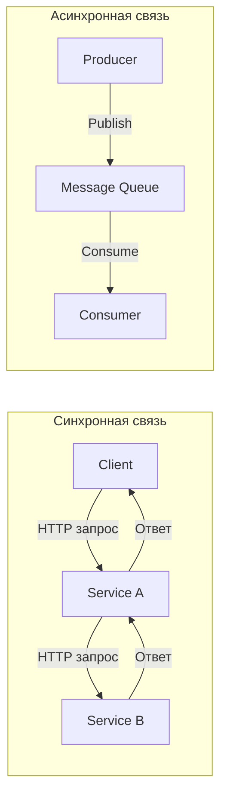
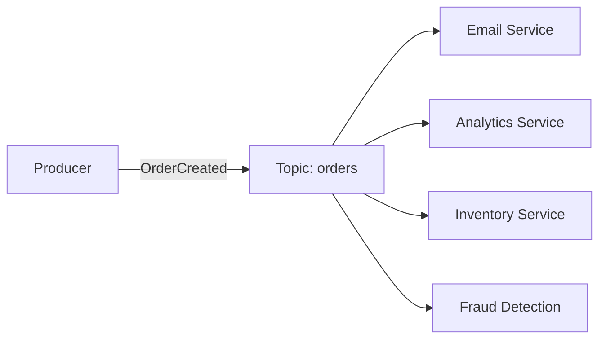
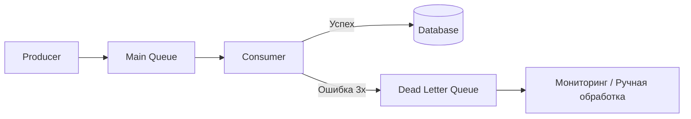
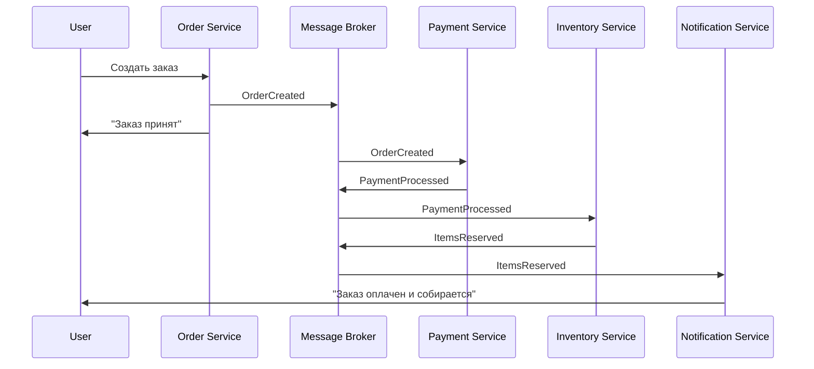

# 🔥 Уровень 5: Очереди сообщений и асинхронная обработка

## 🎯 Зачем нужны очереди сообщений?

Представьте: вы стоите в кафе, заказали кофе. Есть два варианта:

- **Синхронный:** вы стоите у кассы и ждёте, пока бариста сделает ваш латте (3 минуты). Никто за вами не может заказать.
- **Асинхронный:** вы получаете номерок (билет), садитесь, а бариста кричит «Заказ 42!» когда готово. Касса свободна для следующих клиентов.

Этот «номерок» — и есть **очередь сообщений**. Сервис-отправитель кладёт задачу в очередь и продолжает работать. Сервис-получатель берёт задачу, когда готов.

```
Синхронно (request-response):
  Клиент → [ждёт 3 сек] → Сервис A → [ждёт 2 сек] → Сервис B → Ответ
  Итого: 5 сек, клиент заблокирован

Асинхронно (через очередь):
  Клиент → Сервис A → [кладёт в очередь] → "Принято!" (50 мс)
                        Очередь → Сервис B (обрабатывает в своём темпе)
  Итого: 50 мс для клиента, обработка фоном
```

📌 **Очередь — это буфер между сервисами.** Она позволяет развязать (decouple) отправителя и получателя: они не должны работать одновременно, с одинаковой скоростью и даже знать друг о друге.

## 🔥 Sync vs Async — когда что выбирать



| | Sync (HTTP/gRPC) | Async (Queue) |
|---|---|---|
| **Задержка** | Моментальный ответ | Ответ «Принято», результат позже |
| **Связанность** | Оба сервиса должны работать | Producer не зависит от consumer |
| **Пропускная способность** | Ограничена самым медленным звеном | Consumer обрабатывает в своём темпе |
| **Отказоустойчивость** | Если consumer упал — ошибка | Сообщения ждут в очереди |
| **Когда** | Нужен ответ прямо сейчас (GET /user) | Фоновые задачи, уведомления, аналитика |

💡 **Правило:** если пользователь не ждёт результат прямо сейчас — используйте очередь.

## 🔥 Два паттерна: Point-to-Point vs Pub/Sub

### Point-to-Point (Queue)

Одно сообщение — один получатель. Как конвейер на заводе: каждая деталь попадает к одному рабочему.

```typescript
// Producer кладёт задачу в очередь
await queue.send('email-queue', {
  to: 'user@example.com',
  subject: 'Ваш заказ отправлен',
  body: '...'
})

// Consumer 1 или Consumer 2 — кто-то ОДИН возьмёт задачу
// Это позволяет масштабировать: 10 consumers = 10x скорость
```

### Pub/Sub (Topics)

Одно сообщение — все подписчики получают копию. Как рассылка газет: одна газета — тысячи подписчиков.



```typescript
// Producer публикует одно событие
await topic.publish('orders', {
  type: 'OrderCreated',
  orderId: '123',
  userId: '42',
  total: 5990
})

// ВСЕ подписчики получат это событие:
// - Email Service: отправит подтверждение
// - Analytics: запишет в отчёт
// - Inventory: зарезервирует товар
// - Fraud Detection: проверит на мошенничество
```

📌 **Queue** — когда нужно распределить работу (load balancing). **Topic** — когда нужно оповестить всех (fanout).

## 🔥 RabbitMQ vs Apache Kafka

Два самых популярных решения — и они для **разных задач**.

| | RabbitMQ | Apache Kafka |
|---|---|---|
| **Метафора** | Почтовое отделение (умная маршрутизация) | Журнал транзакций (append-only log) |
| **Модель** | Message broker — доставляет и удаляет | Event log — хранит историю событий |
| **Хранение** | Сообщение удаляется после подтверждения | Сообщения хранятся (дни/недели/навсегда) |
| **Порядок** | Гарантирован внутри одной очереди | Гарантирован внутри одной partition |
| **Скорость** | ~50K msg/sec | ~1M+ msg/sec |
| **Когда** | Task queues, RPC, сложная маршрутизация | Event streaming, логи, аналитика, CQRS |

```typescript
// RabbitMQ: задача обрабатывается и удаляется
channel.sendToQueue('resize-images', Buffer.from(JSON.stringify({
  imageUrl: '/uploads/photo.jpg',
  sizes: [150, 300, 600]
})))

// Kafka: событие записывается в лог навсегда
await producer.send({
  topic: 'user-events',
  messages: [{
    key: 'user-42',        // Все события user-42 → одна partition
    value: JSON.stringify({
      type: 'PageViewed',
      page: '/products/123',
      timestamp: Date.now()
    })
  }]
})
// Через месяц можно «перемотать» и прочитать все события заново
```

### Kafka: Partitions и Consumer Groups

Kafka достигает колоссальной пропускной способности за счёт **партиционирования**.

```
Topic: orders (3 partitions)

  Partition 0: [order-1] [order-4] [order-7] ...
  Partition 1: [order-2] [order-5] [order-8] ...
  Partition 2: [order-3] [order-6] [order-9] ...

Consumer Group "payment-service" (3 instances):
  Consumer A ← читает Partition 0
  Consumer B ← читает Partition 1
  Consumer C ← читает Partition 2

Consumer Group "analytics" (2 instances):
  Consumer X ← читает Partition 0 + Partition 1
  Consumer Y ← читает Partition 2
```

📌 **Ключевое правило Kafka:** количество consumers в группе <= количество partitions. Больше consumers — бесполезно, они будут простаивать.

## 🔥 Гарантии доставки

Это самый важный вопрос при проектировании: **что происходит при сбое?**

| Гарантия | Описание | Когда |
|---|---|---|
| **At-most-once** | Сообщение доставляется 0 или 1 раз. Может потеряться. | Логи, метрики — потеря не критична |
| **At-least-once** | Сообщение доставляется 1 или более раз. Может дублироваться. | Заказы, платежи — потеря недопустима |
| **Exactly-once** | Сообщение доставляется ровно 1 раз. | Финансы (на практике — очень дорого) |

```typescript
// At-most-once: отправил и забыл (fire-and-forget)
producer.send(message) // Если брокер упал — сообщение потеряно

// At-least-once: подтверждение + retry
producer.send(message, { acks: 'all' }) // Ждём подтверждения
// Consumer подтверждает ПОСЛЕ обработки:
consumer.on('message', async (msg) => {
  await processOrder(msg)  // Сначала обработка
  msg.ack()                // Потом подтверждение
  // Если consumer упал между process и ack — сообщение придёт снова
})

// Exactly-once: Kafka Transactions (idempotent producer + transactional consumer)
await producer.send({
  topic: 'transfers',
  messages: [{ value: '...' }],
  transactional: true  // Kafka обеспечивает exactly-once внутри себя
})
```

⚠️ **Exactly-once — миф?** В распределённых системах настоящий exactly-once между разными сервисами практически невозможен. Kafka реализует его только **внутри себя** (producer → Kafka → consumer). Как только consumer пишет в БД — нужна idempotency.

## 🔥 Idempotency — ваш главный защитник

Если система использует at-least-once (а она должна), сообщения **будут дублироваться**. Ваш consumer должен быть **идемпотентным** — обработка одного и того же сообщения дважды даёт тот же результат.

```typescript
// ❌ Не идемпотентно — при повторе спишем дважды
async function processPayment(msg: PaymentMessage) {
  await db.query('UPDATE balance SET amount = amount - $1 WHERE user_id = $2',
    [msg.amount, msg.userId])
}

// ✅ Идемпотентно — используем уникальный ключ операции
async function processPayment(msg: PaymentMessage) {
  const exists = await db.query(
    'SELECT 1 FROM processed_payments WHERE idempotency_key = $1',
    [msg.idempotencyKey]
  )
  if (exists.rows.length > 0) return // Уже обработано — пропускаем

  await db.transaction(async (tx) => {
    await tx.query('INSERT INTO processed_payments (idempotency_key) VALUES ($1)', 
      [msg.idempotencyKey])
    await tx.query('UPDATE balance SET amount = amount - $1 WHERE user_id = $2',
      [msg.amount, msg.userId])
  })
}
```

💡 **Idempotency key** — уникальный идентификатор операции (orderId, transactionId, UUID). Храним в БД список обработанных ключей.

## 🔥 Dead Letter Queue (DLQ)

Что делать, если сообщение не удаётся обработать? Бесконечно retry — плохо (poison message заблокирует очередь). Выбросить — потеря данных. Решение — **DLQ**.



```typescript
// Настройка DLQ в RabbitMQ
channel.assertQueue('orders', {
  deadLetterExchange: 'dlx',
  deadLetterRoutingKey: 'orders-dlq',
  arguments: {
    'x-message-ttl': 30000,         // Timeout: 30 сек
    'x-max-delivery-count': 3       // Максимум 3 попытки
  }
})

// Consumer с retry + DLQ
consumer.on('message', async (msg) => {
  try {
    await processOrder(msg)
    msg.ack()
  } catch (error) {
    if (msg.deliveryCount >= 3) {
      msg.reject(false) // Отправить в DLQ (requeue = false)
      alertOps('Order failed 3 times', msg)
    } else {
      msg.nack(true)    // Вернуть в очередь для retry
    }
  }
})
```

📌 **DLQ — это «корзина проблемных сообщений».** Они не теряются, а ждут разбора. Мониторинг DLQ — обязательная практика.

## 🔥 Backpressure — защита от перегрузки

Что если producer генерирует 10 000 msg/sec, а consumer обрабатывает только 1 000? Очередь растёт бесконечно → память заканчивается → система падает.

**Backpressure** — механизм обратного давления: «эй, я не успеваю, притормози!»

```typescript
// Стратегии backpressure:

// 1. Ограничение размера очереди (bounded queue)
const MAX_QUEUE_SIZE = 100_000
if (queue.size >= MAX_QUEUE_SIZE) {
  return { status: 429, message: 'Queue full, try later' }
}

// 2. Rate limiting на producer
const rateLimiter = new RateLimiter({ maxPerSecond: 5000 })
await rateLimiter.acquire()
await producer.send(message)

// 3. Масштабирование consumers (auto-scaling)
if (queue.depth > THRESHOLD) {
  await scaleConsumers(currentCount + 2)
}
```

## 🔥 Event-Driven Architecture и CQRS

### Event-Driven Architecture (EDA)

Сервисы общаются через **события**, а не прямые вызовы. Каждый сервис реагирует на события, которые его интересуют.



### CQRS (Command Query Responsibility Segregation)

Разделяем модель на **запись** (commands) и **чтение** (queries). Пишем в одну БД, читаем из другой (оптимизированной).

```typescript
// Command (запись): нормализованная SQL-БД
await commandDB.query(
  'INSERT INTO orders (id, user_id, items, total) VALUES ($1, $2, $3, $4)',
  [orderId, userId, items, total]
)
// Публикуем событие
await broker.publish('orders', { type: 'OrderCreated', orderId, userId, total })

// Query (чтение): денормализованная NoSQL-БД, оптимизированная для запросов
// Consumer слушает события и обновляет read-модель
consumer.on('OrderCreated', async (event) => {
  await readDB.upsert('user-orders', {
    id: event.userId,
    orders: { $push: { id: event.orderId, total: event.total, status: 'created' } },
    totalOrders: { $inc: 1 },
    totalSpent: { $inc: event.total }
  })
})

// API чтения — быстрый запрос без JOIN
const userProfile = await readDB.get('user-orders', userId)
// { orders: [...], totalOrders: 47, totalSpent: 234500 }
```

💡 **CQRS имеет смысл** когда паттерны чтения и записи сильно отличаются. Для простых CRUD — избыточен.

## ⚠️ Частые ошибки новичков

### ❌ Ошибка 1: Синхронный вызов вместо очереди для тяжёлых задач

```typescript
// ❌ Пользователь ждёт 30 секунд, пока обработается видео
app.post('/upload-video', async (req, res) => {
  const result = await processVideo(req.file)   // 30 секунд!
  await generateThumbnails(req.file)             // ещё 10 секунд!
  await notifyFollowers(req.user)                // ещё 5 секунд!
  res.json(result) // Пользователь ждал 45 секунд
})
```

```typescript
// ✅ Принимаем и кладём в очередь
app.post('/upload-video', async (req, res) => {
  const jobId = await queue.send('video-processing', {
    file: req.file,
    userId: req.user.id
  })
  res.json({ jobId, status: 'processing' }) // 50 мс!
})
// Статус можно проверять через GET /jobs/:jobId
```

### ❌ Ошибка 2: Нет idempotency при at-least-once

```typescript
// ❌ Повтор сообщения отправит два письма
consumer.on('message', async (msg) => {
  await sendEmail(msg.to, msg.subject) // При retry — дубль
  msg.ack()
})
```

```typescript
// ✅ Проверяем, не обработали ли уже
consumer.on('message', async (msg) => {
  const sent = await redis.get(`email-sent:${msg.messageId}`)
  if (sent) { msg.ack(); return }

  await sendEmail(msg.to, msg.subject)
  await redis.set(`email-sent:${msg.messageId}`, '1', 'EX', 86400)
  msg.ack()
})
```

### ❌ Ошибка 3: Ack до обработки

```typescript
// ❌ Если processOrder упадёт — сообщение уже подтверждено и потеряно
consumer.on('message', async (msg) => {
  msg.ack()                    // Подтверждаем ДО обработки
  await processOrder(msg)      // Если тут ошибка — сообщение потеряно
})
```

```typescript
// ✅ Ack ПОСЛЕ успешной обработки
consumer.on('message', async (msg) => {
  await processOrder(msg)      // Сначала обработка
  msg.ack()                    // Потом подтверждение
})
```

### ❌ Ошибка 4: Нет DLQ — poison message блокирует очередь

```typescript
// ❌ Битое сообщение retry бесконечно, блокируя всю очередь
consumer.on('message', async (msg) => {
  try {
    await process(msg)
    msg.ack()
  } catch {
    msg.nack(true) // requeue = true → бесконечный цикл!
  }
})
```

```typescript
// ✅ Ограниченный retry + DLQ
consumer.on('message', async (msg) => {
  try {
    await process(msg)
    msg.ack()
  } catch {
    if (msg.deliveryCount >= 3) {
      msg.reject(false)  // → DLQ
      alert('Poison message detected')
    } else {
      msg.nack(true)     // retry
    }
  }
})
```

## 📌 Итоги

| Концепция | Ключевая мысль |
|---|---|
| **Queue vs Topic** | Queue — один получатель, Topic — все подписчики |
| **RabbitMQ vs Kafka** | RabbitMQ — task broker, Kafka — event log |
| **At-least-once** | Стандарт для бизнес-логики + idempotency |
| **DLQ** | Обязательна для любой production-очереди |
| **Backpressure** | Bounded queue + auto-scaling consumers |
| **Idempotency** | Уникальный ключ + дедупликация — must have |
| **CQRS** | Разделение чтения/записи через события |
| **EDA** | Сервисы общаются событиями, а не прямыми вызовами |

🎯 **Главный принцип:** если пользователю не нужен результат прямо сейчас — кладите задачу в очередь. Это повышает отказоустойчивость, масштабируемость и скорость отклика.
