# Level 7: Reliability Patterns -- Circuit Breaker, Retry, Bulkhead, and Others

## Introduction

Imagine building a skyscraper. Architects don't design it with the calculation "so nothing ever breaks." They design it so that **a fire on the third floor doesn't collapse the entire building**, so that **a cracked load-bearing beam doesn't cause a collapse**, so that **an elevator outage doesn't make the building uninhabitable**. On every floor -- fire doors. In the structure -- redundant load-bearing elements. In every stairwell -- an emergency exit.

Reliability patterns in distributed systems are exactly the same fire doors, emergency exits, and structural partitions, only for software. They don't prevent failures -- they **localize them**, **limit spread**, and **provide degradation instead of complete failure**.

**Key mindset shift:** stop thinking "how to make a system that doesn't fall" and start thinking "how to make a system that behaves correctly when something falls." In a large distributed system, something is always falling -- the question is only how isolated that failure is.

---

## 1. Circuit Breaker -- Automatic Disconnect Switch

### The Problem Circuit Breaker Solves

Without a Circuit Breaker, this happens: Service A calls Service B, which is "down." Every request from A to B hangs waiting for a timeout -- let's say 30 seconds. During those 30 seconds, another 100 requests arrive, then another 1000. They all hang waiting for timeout. Execution threads run out. Memory fills up. Service A stops responding, even though it's fine on its own. Clients calling A also start accumulating pending requests. A chain reaction propagates up the stack.

This is called a **cascading failure** -- and that's exactly what a Circuit Breaker prevents.

Analogy from electrical engineering: when a short circuit occurs in an electrical panel, the circuit breaker **instantly breaks the circuit**. It doesn't wait for the wiring to burn. It doesn't try to pass current through the damaged section. It just breaks it. After some time, you can try turning it back on -- if the damage is fixed, everything works.

### Three States of Circuit Breaker

A Circuit Breaker is a state machine with three states. Understanding transitions between them is critical for proper configuration.

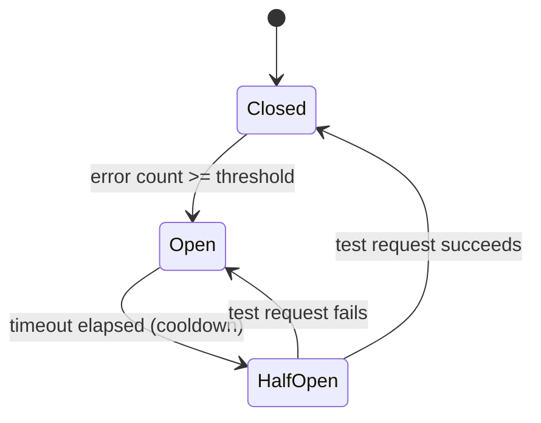

| State | What's Happening | Request Behavior |
|---|---|---|
| **Closed** | Everything normal, system working | Requests pass through. Each error increments counter |
| **Open** | Service deemed unavailable | Requests blocked immediately. Fallback returned |
| **Half-Open** | Checking if service recovered | One (or several) test requests allowed through |

The key point of the **Open** state: requests to the failed service **aren't sent at all**. This frees threads immediately, instead of waiting for a timeout. Service A gets a response (even if fallback) in milliseconds, not 30 seconds.

The **Half-Open** state is the most delicate. After a waiting period, we want to check if Service B has recovered, but we don't want to immediately dump all accumulated traffic on it. So we let one "probing" request through. If it succeeds -- transition to Closed. If not -- back to Open, and the timer resets.

### Circuit Breaker Implementation

```typescript
type CircuitState = 'closed' | 'open' | 'half-open'

interface CircuitBreakerOptions {
  threshold: number      // How many consecutive errors → Open
  timeout: number        // How many ms from Open → HalfOpen
  halfOpenRequests: number // How many test requests in HalfOpen
}

class CircuitBreaker {
  private state: CircuitState = 'closed'
  private failureCount = 0
  private successCount = 0
  private lastFailureTime = 0

  constructor(private options: CircuitBreakerOptions) {}

  async call<T>(fn: () => Promise<T>, fallback: () => T): Promise<T> {
    if (this.state === 'open') {
      // Check if it's time to transition to half-open
      const elapsed = Date.now() - this.lastFailureTime
      if (elapsed > this.options.timeout) {
        this.state = 'half-open'
        this.successCount = 0
        console.log('Circuit: open → half-open (testing recovery)')
      } else {
        // Timeout hasn't elapsed: immediate fallback, no attempt
        return fallback()
      }
    }

    try {
      const result = await fn()
      this.onSuccess()
      return result
    } catch (error) {
      this.onFailure()
      return fallback()
    }
  }

  private onSuccess(): void {
    if (this.state === 'half-open') {
      this.successCount++
      // If enough successful requests → close
      if (this.successCount >= this.options.halfOpenRequests) {
        this.reset()
        console.log('Circuit: half-open → closed (service recovered)')
      }
    } else {
      // In closed state, reset error counter
      this.failureCount = 0
    }
  }

  private onFailure(): void {
    this.failureCount++
    this.lastFailureTime = Date.now()

    if (this.state === 'half-open') {
      // Service hasn't recovered → back to open
      this.state = 'open'
      console.log('Circuit: half-open → open (service still down)')
    } else if (this.failureCount >= this.options.threshold) {
      this.state = 'open'
      console.log(`Circuit: closed → open (${this.failureCount} failures)`)
    }
  }

  private reset(): void {
    this.state = 'closed'
    this.failureCount = 0
    this.successCount = 0
  }

  getState(): CircuitState {
    return this.state
  }
}

// Usage
const paymentBreaker = new CircuitBreaker({
  threshold: 5,         // 5 consecutive errors → open
  timeout: 30_000,      // Try again after 30 seconds
  halfOpenRequests: 2,  // 2 successful tests → close
})

async function chargeUser(userId: string, amount: number) {
  return paymentBreaker.call(
    () => paymentService.charge(userId, amount),
    () => ({ status: 'queued', message: 'Payment will be processed shortly' })
  )
}
```

Let's break down why the parameters are exactly these:

- `threshold: 5` -- one error can be random (network glitch, garbage collection pause). Five in a row -- that's already a pattern, the service is likely down.
- `timeout: 30_000` -- 30 seconds to give the service time to recover. Too short timeout (1-2 seconds) causes the Circuit Breaker to transition to half-open and back to open too quickly, creating extra cycles. Too long -- and we don't notice the service has already recovered.
- `halfOpenRequests: 2` -- one successful test isn't enough: it could have slipped through by chance. Two successful ones in a row -- a good signal.

### What to Use in Production

Writing a Circuit Breaker yourself is a good learning exercise, but in production use proven libraries:

| Ecosystem | Library | Features |
|---|---|---|
| Node.js | `opossum` | Promises, events, metrics |
| Java | `resilience4j` | Annotations, Spring integration |
| .NET | `Polly` | Fluent API, policy composition |
| Go | `gobreaker` | Simple and reliable |
| Universal | `Hystrix` (Netflix) | Original implementation, deprecated, but ideas live on |

`resilience4j` and `Polly` also include Retry, Bulkhead, Rate Limiter -- all in one package.

---

## 2. Retry with Exponential Backoff -- Smart Retries

### Why Naive Retry Is More Dangerous Than No Retry

Intuition says: if a request failed -- try again. That's reasonable. But imagine: the payment service is under load and responding with delays. Timeout. All 1000 clients immediately repeat the request. Now the service gets 2000 requests instead of 1000. Some of them again don't get a response and repeat. Now 4000. This is called a **retry storm** -- a storm of retries that turns a partial failure into a complete one.

Three rules for safe Retry:

1. **Limit the number of attempts** -- no more than 3-5.
2. **Exponential Backoff** -- with each attempt, the delay doubles.
3. **Jitter** -- random addition to the delay so clients don't synchronize.

### Delay Visualization

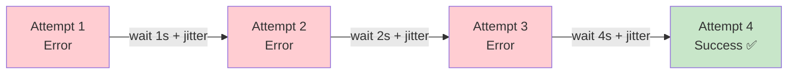

Why exponential, not linear? Because most recoveries happen quickly (network glitch, brief load spike), and those failures that last long require more time to recover. Exponential delay growth matches both scenarios well.

### Implementation with Three Types of Jitter

```typescript
// Full Jitter: delay is random from 0 to max
// Evenly distributes recovery load
function fullJitter(base: number, attempt: number): number {
  const cap = base * Math.pow(2, attempt)
  return Math.random() * cap
}

// Equal Jitter: half deterministic, half random
// Balance between predictability and spread
function equalJitter(base: number, attempt: number): number {
  const cap = base * Math.pow(2, attempt)
  const half = cap / 2
  return half + Math.random() * half
}

// Decorrelated Jitter: next delay depends on previous
// Most "smeared" variant, best with many clients
function decorrelatedJitter(prevDelay: number, base: number): number {
  return Math.min(
    30_000, // cap: no more than 30 seconds
    base + Math.random() * (prevDelay * 3 - base)
  )
}

// Universal retry function with exponential backoff + full jitter
async function retryWithBackoff<T>(
  fn: () => Promise<T>,
  options: {
    maxAttempts?: number
    baseDelayMs?: number
    maxDelayMs?: number
    shouldRetry?: (error: unknown) => boolean
  } = {}
): Promise<T> {
  const {
    maxAttempts = 3,
    baseDelayMs = 1000,
    maxDelayMs = 30_000,
    shouldRetry = () => true,
  } = options

  let lastError: unknown

  for (let attempt = 0; attempt < maxAttempts; attempt++) {
    try {
      return await fn()
    } catch (error) {
      lastError = error

      // Don't retry if it's "meaningless" (4xx, for example)
      if (!shouldRetry(error)) {
        throw error
      }

      if (attempt < maxAttempts - 1) {
        // Exponential backoff with full jitter
        const cap = Math.min(baseDelayMs * Math.pow(2, attempt), maxDelayMs)
        const delay = Math.random() * cap

        console.log(
          `Attempt ${attempt + 1}/${maxAttempts} failed. ` +
          `Retrying in ${Math.round(delay)}ms...`
        )

        await new Promise(resolve => setTimeout(resolve, delay))
      }
    }
  }

  throw lastError
}

// Example: don't retry on 4xx (client error -- retry is meaningless)
const response = await retryWithBackoff(
  () => fetch('https://api.payment.com/charge', {
    method: 'POST',
    body: JSON.stringify({ amount: 1000 }),
  }),
  {
    maxAttempts: 3,
    baseDelayMs: 500,
    shouldRetry: (error) => {
      if (error instanceof Response) {
        return error.status >= 500  // Retry only on 5xx
      }
      return true  // Network errors -- retry
    },
  }
)
```

### Delay Table for Different Strategies

| Attempt | Exponential | With Full Jitter (example) | With Equal Jitter (example) |
|---|---|---|---|
| 1 | 1s | 0.7s | 0.85s |
| 2 | 2s | 1.4s | 1.6s |
| 3 | 4s | 3.1s | 3.5s |
| 4 | 8s | 5.8s | 6.3s |
| 5 | 16s | 11.2s | 12.1s |

**Formula:** `delay = random(0, min(cap, base * 2^attempt))`

### Idempotency -- Critical Condition for Retry

**Important:** Retry is safe **only for idempotent operations**. Idempotency is the property of an operation to produce the same result on repeated execution.

- `GET /users/123` -- idempotent: repeated request returns the same data
- `PUT /users/123` with full body -- idempotent: repeated setting of the same data
- `POST /payments` -- **not idempotent**: repeated call creates a second payment

For non-idempotent operations, **Idempotency Keys** are used: a unique ID in the request header that the server saves. If a repeated request comes with the same key -- the server returns the saved result instead of executing the operation again.

```typescript
// Idempotency Key for safe payment retry
const idempotencyKey = crypto.randomUUID()  // One key for the entire "business operation"

await retryWithBackoff(() =>
  fetch('https://api.payment.com/charge', {
    method: 'POST',
    headers: {
      'Idempotency-Key': idempotencyKey,  // Sent with each attempt
    },
    body: JSON.stringify({ userId, amount }),
  })
)
// Server payment.com checks idempotencyKey:
// First call → execute and save result
// Repeat → return saved result (payment NOT created twice)
```

---

## 3. Bulkhead -- Watertight Compartments

### Analogy and Problem

A classic submarine is divided into watertight compartments. If a torpedo breaches the hull in one place -- water fills only that compartment. The rest are sealed. The submarine loses some functionality but stays afloat.

Without Bulkhead in a software system: one slow service occupies all threads, all connections from the pool, all queue memory. Other services, even fully functional, can't get resources. The system falls entirely due to a problem in one part.

### Three Levels of Bulkhead Application

**Level 1 -- Connection Pools**

```typescript
import { Pool } from 'pg'

// ❌ Without Bulkhead: one pool for everything
const sharedPool = new Pool({ max: 100 })
// Slow analytical queries occupy 95 of 100 connections
// → Critical payment transactions can't get a connection
// → Payments "fall" even though the DB itself works fine

// ✅ With Bulkhead: separate pools by operation importance
const criticalPool = new Pool({
  max: 50,
  connectionString: process.env.DB_URL,
  // For critical operations: payments, authentication
})

const standardPool = new Pool({
  max: 30,
  connectionString: process.env.DB_URL,
  // For normal operations: browsing products, user profile
})

const analyticsPool = new Pool({
  max: 20,
  connectionString: process.env.DB_ANALYTICS_URL,
  // For analytics: can use read replica
})

// Now analytics can "fall," taking its 20 connections --
// payments continue working with their 50.
```

**Level 2 -- Thread Pool Isolation**

In Java/Kotlin and .NET, you can allocate a separate thread pool for each group of dependencies:

```typescript
// Node.js equivalent via separate queues with workers
import PQueue from 'p-queue'

// Separate queues with concurrency limits
const paymentQueue = new PQueue({ concurrency: 20 })     // Max 20 parallel
const notificationQueue = new PQueue({ concurrency: 10 }) // Max 10 parallel
const analyticsQueue = new PQueue({ concurrency: 5 })     // Max 5 parallel

// Slow analytics query takes no more than 5 "slots"
// Payments always have up to 20 slots

async function chargePayment(params: ChargeParams) {
  return paymentQueue.add(() => paymentService.charge(params))
}

async function trackAnalytics(event: AnalyticsEvent) {
  return analyticsQueue.add(() => analyticsService.track(event))
}
```

**Level 3 -- Process/Container Level Isolation**

In Kubernetes: separate Deployments for critical and non-critical services, with different resource limits and affinity rules. Analytics and background jobs never evict critical services from nodes.

### How to Determine Bulkhead Boundaries

Good rule of thumb -- separate along one of three axes:

1. **By criticality:** payment operations separate from analytics
2. **By client:** premium clients separate from free-tier
3. **By operation type:** read operations separate from write operations

---

## 4. Timeout + Fallback -- Limiting Wait Time

### Why Timeout Isn't "Caution" but a Necessity

Without a timeout, one "hung" request occupies an execution thread forever. In Node.js this blocks the event loop. In multithreaded systems this occupies a thread from the pool. If requests continue to arrive -- the thread pool fills up, new requests start waiting for a thread to free. The system freezes.

Timeout isn't pessimism ("everything will fail"), it's realism: **if the response hasn't arrived in a reasonable time, waiting further is pointless**.

### Timeout Hierarchy in the Stack

A critically important rule: **each level's timeout must be shorter than the level above's timeout**. Otherwise, the upper level can't get a response and react.

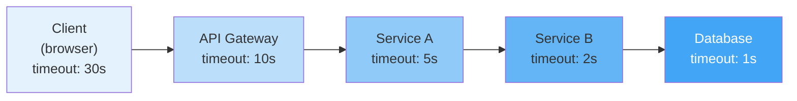

If Service A's timeout is 10s and API Gateway's is also 10s -- Gateway gets the timeout from A exactly when its own timeout expires. Gateway has no time left to return an informative response to the client (e.g., use a fallback).

### Timeout Rules by Context

| Operation | Recommended Timeout | Justification |
|---|---|---|
| API Gateway → microservice | 10s | Client is waiting, need a reasonable limit |
| Inter-service call | 2-5s | Fast services should respond quickly |
| Database query | 1-3s | DB queries should be fast; long query indicates a problem |
| External API call | 5-15s | Depends on API; set per documentation |
| File upload | 30-120s | Depends on size |
| Cache operation (Redis) | 100-500ms | Cache should respond very quickly |

### Fallback -- Plan B

Fallback is a prepared response for when the main path is unavailable. A good fallback is as close to the real response as possible, but doesn't require contacting the failed service.

```typescript
// Product page example with fallback chain
async function getProductData(productId: string) {
  // Level 1: main request with timeout
  const controller = new AbortController()
  const timeoutId = setTimeout(() => controller.abort(), 2000)

  try {
    const data = await fetch(`/api/products/${productId}`, {
      signal: controller.signal,
    }).then(r => r.json())
    clearTimeout(timeoutId)

    // Save to cache for future fallbacks
    await cache.set(`product:${productId}`, data, { ttl: 300 })
    return data

  } catch (error) {
    clearTimeout(timeoutId)
    console.warn(`Primary fetch failed: ${error}`)

    // Level 2: data from cache
    const cached = await cache.get(`product:${productId}`)
    if (cached) {
      return { ...cached, _source: 'cache', _stale: true }
    }

    // Level 3: minimal response
    return {
      id: productId,
      name: 'Product temporarily unavailable',
      price: null,
      available: false,
      _source: 'fallback',
    }
  }
}
```

Three levels of fallback -- a typical "defense in depth" approach. Each level is slightly worse than the previous, but all are better than 500 Internal Server Error.

### Full Protection Chain: Timeout + Retry + Circuit Breaker + Fallback

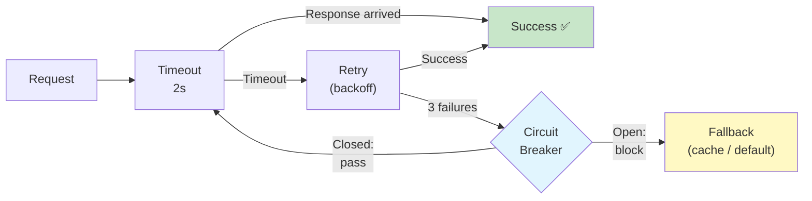

---

## 5. Cascading Failures -- Anatomy of Cascade Failure

### Why Systems Fail "in a Chain"

A cascading failure is one of the most dangerous forms of system failure, because it starts unnoticed and escalates rapidly. To understand the mechanics, let's break down a specific scenario.

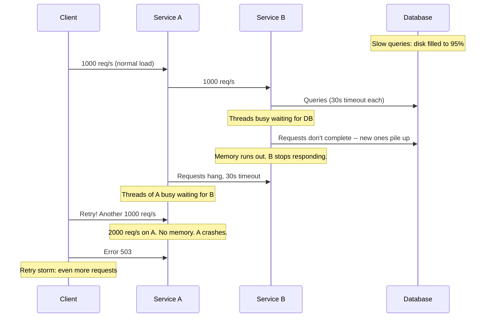

Note the key moment: the problem started in the Database (slow disk subsystem), but services B and A suffered -- services that are perfectly healthy on their own. What killed them wasn't their own problem, but waiting for someone else's.

### Five Protective Mechanisms

| Mechanism | What It Stops |
|---|---|
| **Timeout** | Stops infinite waiting, frees threads |
| **Circuit Breaker** | Stops sending requests to unavailable service |
| **Bulkhead** | Limits how many resources one service can "eat" |
| **Retry + Backoff** | Doesn't add load during recovery |
| **Backpressure** | Service explicitly signals overload via 429/503 |

### Backpressure -- Explicit Overload Signal

Backpressure is a mechanism where an overloaded service explicitly tells the calling party: "I'm overloaded, don't send more requests."

```typescript
// Simple backpressure implementation via queue
class BackpressureService {
  private queue: Array<() => Promise<void>> = []
  private processing = 0
  private readonly maxQueue = 1000
  private readonly maxConcurrent = 50

  async enqueue<T>(task: () => Promise<T>): Promise<T> {
    // Queue full → reject immediately
    if (this.queue.length >= this.maxQueue) {
      throw new ServiceOverloadedError('Service is overloaded, retry later')
      // HTTP 503 with Retry-After header
    }

    return new Promise((resolve, reject) => {
      this.queue.push(async () => {
        try { resolve(await task()) }
        catch (e) { reject(e) }
      })
      this.drain()
    })
  }

  private async drain() {
    while (this.queue.length > 0 && this.processing < this.maxConcurrent) {
      const task = this.queue.shift()!
      this.processing++
      task().finally(() => {
        this.processing--
        this.drain()
      })
    }
  }
}
```

---

## 6. SLA, SLO, SLI -- The Language of Reliability

### Why a Formal Reliability Language Is Needed

Without precise definitions, a conversation about reliability turns subjective: "the system works well," "sometimes there are delays." This is useless -- you can't measure progress, can't make informed technical decisions, can't agree with business on expectations.

SLI, SLO, SLA -- a three-level system that translates "works well" into numbers.

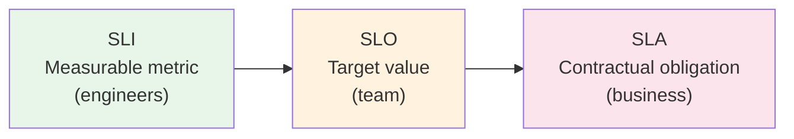

### Three Levels in Detail

**SLI (Service Level Indicator)** -- a concrete measurable metric. This is "what we measure."

Examples of SLI:
- Percentage of requests completed successfully (availability)
- p50, p95, p99 latency
- Throughput (requests per second)
- Error rate (% of requests with errors)
- Freshness (how fresh data in cache is)

**SLO (Service Level Objective)** -- target value for SLI. This is "what we're aiming for."

Examples of SLO:
- Availability >= 99.9% over 30 days
- p99 latency < 200ms
- Error rate < 0.1%

**SLA (Service Level Agreement)** -- contractual obligation to clients. This is "what we're responsible for."

The difference between SLO and SLA: SLO is an internal target (we want 99.99%), SLA is a public commitment (we guarantee 99.95%). The gap between SLO and SLA is a safety buffer. If you publicly guarantee what you barely achieve yourself -- at the slightest deviation you breach the SLA and pay compensation.

### Error Budget -- Budget for Errors

Error budget is a quantitative expression of allowable downtime or number of errors over a period.

```
SLO = 99.9% availability over 30 days
Error budget = 100% - 99.9% = 0.1%

30 days = 43,200 minutes
Allowable downtime = 43,200 × 0.001 = 43.2 minutes

Meaning: over 30 days the system can be unavailable for a total of 43 minutes.
If you've spent 43 minutes on incidents -- no deployments until the next period.
If you've spent only 10 minutes -- you still have 33 minutes left, can do risky deployments.
```

| SLO | Downtime per month | Downtime per year | Real Level |
|---|---|---|---|
| 99% | 7.3h | 3.65 days | Unacceptable for most services |
| 99.9% | 43.2min | 8.76h | Internal services |
| 99.95% | 21.6min | 4.38h | Public APIs |
| 99.99% | 4.32min | 52.6min | Payment systems |
| 99.999% | 25.9sec | 5.26min | Telephony, aviation |

**Main rule about SLO:** don't set 100%. Google intentionally uses error budget as a balance tool: while budget exists -- you can deploy. Budget exhausted -- stop, focus on reliability.

### Burn Rate -- Budget Consumption Speed

Burn rate shows how fast the error budget is being spent. Burn rate = 1 means "spending evenly, budget runs out exactly at the end of the period." Burn rate = 10 -- budget runs out in 1/10 of the period.

```typescript
// Example: burn rate monitoring
function calculateBurnRate(
  sloTarget: number,      // 0.999
  windowMinutes: number,  // 60
  actualAvailability: number  // 0.995
): number {
  const errorBudget = 1 - sloTarget   // 0.001
  const currentErrorRate = 1 - actualAvailability  // 0.005

  // How fast will budget run out?
  const burnRate = currentErrorRate / errorBudget  // 5
  // Burn rate 5: at this error rate, 30 days / 5 = 6 days until budget runs out
  return burnRate
}

// Burn rate > 1 → alert: budget being spent faster than normal
// Burn rate > 10 → critical alert: immediate action needed
```

---

## 7. Blue-Green Deployment and Canary Releases -- Safe Deployment

### Why Deployment Strategy Is a Reliability Pattern

A significant portion of production incidents happen during deployment. New code is introduced into the system, and something goes wrong. Traditional deployment (stop old → launch new) has a moment of complete unavailability and slow rollback (need to redeploy the old version).

Blue-Green and Canary solve this by making deployment iterative and reversible.

### Blue-Green Deployment

Idea: always keep two identical environments. One serves traffic (call it Blue), the other is a warm reserve (Green). The new version deploys to Green, is verified, and then the load balancer switches traffic.

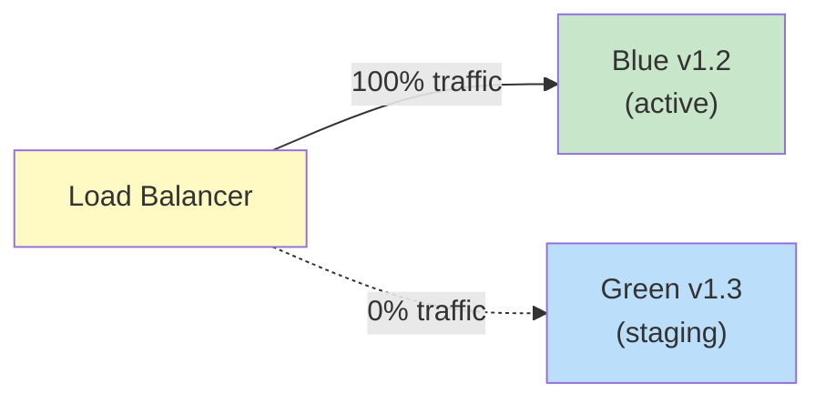

After Green verification:

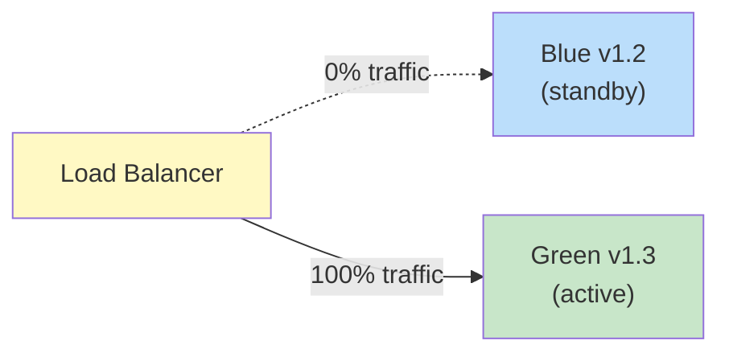

If something goes wrong with v1.3 -- one click in the load balancer, and all traffic goes back to Blue with v1.2. Rollback takes seconds, not minutes.

**Trade-off:** need 2x resources. For large infrastructures this can be expensive. Often a variant is used where Blue stays enabled only for a few hours after switching -- for fast rollback -- and then is turned off.

### Canary Release -- Gradual Rollout

Canary Release (named after canaries that miners took underground to detect gas) -- gradual directing of a portion of traffic to the new version.

```
Stage 1:  v1.2 = 99%,  v1.3 = 1%    (canary: only 1% of users)
Stage 2:  v1.2 = 90%,  v1.3 = 10%   (check metrics for 30 minutes)
Stage 3:  v1.2 = 75%,  v1.3 = 25%   (check metrics for 1 hour)
Stage 4:  v1.2 = 50%,  v1.3 = 50%
Stage 5:  v1.2 = 0%,   v1.3 = 100%  (full rollout)

At any stage: if error rate grew > 5% from baseline → automatic rollback
```

Key difference from Blue-Green: Canary allows finding problems that manifest **only under real load** or **only for certain users**. 1% of real traffic is better than any staging environment.

### Feature Flags -- Separating Deployment from Release

Feature flags (feature toggles) allow deploying code without enabling functionality. The code lives in production, but is turned off behind a flag.

```typescript
// Simple in-code feature flag
const FLAGS = {
  newCheckoutFlow: process.env.FEATURE_NEW_CHECKOUT === 'true',
  experimentalSearch: process.env.FEATURE_EXP_SEARCH === 'true',
}

// More advanced: percentage rollout + user groups
class FeatureFlags {
  isEnabled(flag: string, context: { userId: string }): boolean {
    const config = this.getConfig(flag)
    if (!config.enabled) return false

    // Deterministic hash: same user
    // always falls into the same group
    const hash = this.hashUserId(context.userId)
    const bucket = hash % 100  // 0-99

    return bucket < config.rolloutPercentage
  }

  private hashUserId(userId: string): number {
    // Simple hash for deterministic distribution
    return userId.split('').reduce((acc, char) => {
      return ((acc << 5) - acc + char.charCodeAt(0)) | 0
    }, 0) >>> 0  // Unsigned 32-bit
  }
}

const flags = new FeatureFlags()

// In component:
if (flags.isEnabled('new-checkout', { userId: user.id })) {
  return processNewCheckout(cart)
} else {
  return processLegacyCheckout(cart)
}
```

Feature Flags benefits beyond canary release:

- **Kill switch:** instantly turn off a broken feature without deployment
- **A/B testing:** show different variants to different users
- **Beta groups:** enable for internal users / early adopters
- **Operational flags:** e.g., enable circuit breaker for a specific API

---

## 8. Health Checks and Graceful Degradation

### Liveness vs Readiness vs Startup

In Kubernetes (and beyond), three types of checks are commonly distinguished:

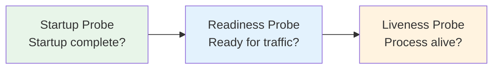

| Check | What It Checks | What Happens on Failure |
|---|---|---|
| **Liveness** | Process isn't stuck, not in deadlock | Kubernetes kills and restarts the pod |
| **Readiness** | Service is ready to accept traffic | Kubernetes removes pod from load balancing |
| **Startup** | Initial initialization complete | Kubernetes waits (doesn't kill) until True |

The distinction between Liveness and Readiness is critical: an application can be "alive" (process running) but "not ready" (warming cache, waiting for DB connection). If only Liveness is used -- Kubernetes will send traffic to an unready service.

### Health Check Implementation

```typescript
import express from 'express'

const app = express()

// Liveness: "I'm alive"
// Simplest check -- process responds to requests
app.get('/healthz', (req, res) => {
  res.status(200).json({ status: 'ok', uptime: process.uptime() })
})

// Readiness: "I'm ready to accept traffic"
// Check all critical dependencies
app.get('/readyz', async (req, res) => {
  const checks = await Promise.allSettled([
    checkDatabase(),
    checkRedis(),
    checkMessageQueue(),
  ])

  const results = {
    database: checks[0].status === 'fulfilled' && checks[0].value,
    redis: checks[1].status === 'fulfilled' && checks[1].value,
    queue: checks[2].status === 'fulfilled' && checks[2].value,
  }

  const isReady = Object.values(results).every(Boolean)

  res.status(isReady ? 200 : 503).json({
    status: isReady ? 'ready' : 'not ready',
    checks: results,
    timestamp: new Date().toISOString(),
  })
})

async function checkDatabase(): Promise<boolean> {
  try {
    await db.query('SELECT 1')
    return true
  } catch {
    return false
  }
}

async function checkRedis(): Promise<boolean> {
  try {
    await redis.ping()
    return true
  } catch {
    return false
  }
}
```

### Graceful Degradation -- Degrading, Not Dying

Graceful Degradation is the art of dividing functionality into critical (without which a response is impossible) and non-critical (without which a response is worse but possible).

```typescript
async function getProductPage(productId: string): Promise<ProductPage> {
  // CRITICAL: without this, the page can't be shown → error
  const product = await productService.get(productId)
  // If this call fails -- propagate error, return 404/500

  // NON-CRITICAL: show page without recommendations
  const recommendations = await circuitBreaker.call(
    () => recommendationService.getForProduct(productId),
    () => []  // Empty array -- page works, just without recommendations
  )

  // NON-CRITICAL: show page without reviews (or with stale cache)
  const reviews = await circuitBreaker.call(
    () => reviewService.getForProduct(productId),
    async () => {
      const cached = await cache.get(`reviews:${productId}`)
      return cached ?? []
    }
  )

  // NON-CRITICAL: show last known price
  const price = await circuitBreaker.call(
    () => pricingService.getCurrentPrice(productId),
    () => ({
      amount: product.lastKnownPrice,
      currency: 'USD',
      _stale: true,  // Flag for UI: show "Price may be outdated"
    })
  )

  return { product, recommendations, reviews, price }
}
```

**Design rule:** when developing each call, ask yourself: "if this service goes down, should the entire request fail?" If no -- wrap it in a circuit breaker with fallback.

---

## 9. Observability -- Seeing What's Happening

### Three Pillars of Observability

You can't manage what you can't see. Observability is a system property that allows understanding its internal state from external outputs. Three pillars:

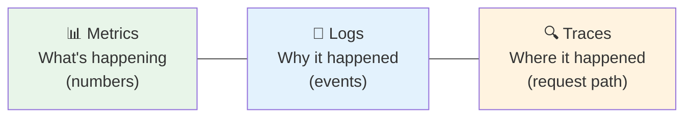

| Pillar | What It Is | Question | Tools |
|---|---|---|---|
| **Metrics** | Numerical aggregates over time | "What's happening now?" | Prometheus, Grafana, Datadog |
| **Logs** | Textual events | "Why did this happen?" | ELK Stack, Loki |
| **Traces** | Request path through services | "Where exactly is it slow/broken?" | Jaeger, Zipkin, OpenTelemetry |

Analogy: if the system is an airplane, then metrics are the instruments in the cockpit (altitude, speed, course), logs are the flight journal (what the pilot did and when), traces are the black box (complete flight record).

### Distributed Tracing -- Tracing Request Path

In a monolithic application, the call stack is visible right in the traceback. In microservices, a request passes through 5-10 services, each with its own database. Without tracing, debugging such a system is like finding a needle in a haystack.

```
[Trace ID: f4a92b3c-1234]
├── API Gateway          (total: 312ms)
│   └── Routing:          8ms
├── Auth Service          (total: 34ms)
│   └── Redis lookup:     12ms
│   └── JWT validation:   22ms
├── Product Service       (total: 45ms)
│   └── PostgreSQL:       28ms  (index used ✅)
├── Payment Service       (total: 240ms)  ← ⚠️ bottleneck
│   └── Fraud check:      15ms
│   └── Stripe API:       218ms  ← external call, explained
│   └── DB insert:         7ms
└── Notification Svc      (total: 18ms)
    └── RabbitMQ publish:  5ms

Total end-to-end: 355ms
```

From this trace, it's immediately clear: the problem isn't in our code, but in the external Stripe API. Without tracing, you'd have to spend hours looking at each service's logs.

### RED Method and USE Method

**RED Method** (for request-processing services):
- **R**ate: how many requests per second
- **E**rrors: how many requests end with error
- **D**uration: how long requests take to process

**USE Method** (for resources: CPU, memory, disk):
- **U**tilization: how busy the resource is
- **S**aturation: how big the wait queue is
- **E**rrors: errors working with the resource

These two methods cover most production problems.

---

## 10. Chaos Engineering -- Resilience Training

### "If You Haven't Tested a Failure -- You Don't Know What Happens on Failure"

Netflix invented Chaos Monkey in 2011: a tool that randomly killed virtual machines in production during business hours. The idea seemed crazy, but the result was revolutionary: Netflix discovered and fixed hundreds of weak points that would never have manifested in testing.

The principle of Chaos Engineering: **intentionally introduce failures in controlled conditions** to find problems before they find you.

### Experiment Levels

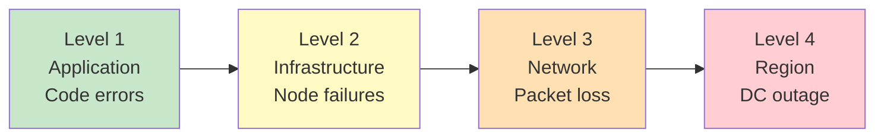

| Experiment | What It Checks | Tools |
|---|---|---|
| Kill random pod | Circuit breaker, health check, graceful restart | Chaos Monkey, Chaos Toolkit |
| Introduce 5s delay | Timeout, backpressure | Toxiproxy, Istio fault injection |
| 30% packet loss | Retry, idempotency | Tc (traffic control), Chaos Mesh |
| OOM kill | Memory limits, graceful degradation | chaos-monkey-for-spring |
| Fill disk | Monitoring, disk pressure handling | Litmus Chaos |
| DNS unavailable | Service discovery, fallback | Chaos Mesh |

### GameDay -- Planned Exercises

GameDay is a structured "exercise" where the team agrees in advance and intentionally breaks the system:

1. **Announce in advance** -- everyone knows that today at 14:00 there are "exercises"
2. **Set a hypothesis** -- "we expect that when service X falls, the system degrades to Y but doesn't crash"
3. **Conduct the experiment** -- break X and observe
4. **Record results** -- what happened in reality?
5. **Fix discrepancies** -- reality worse than hypothesis? Fix it.

---

## Common Mistakes

### Mistake 1: Retry Without Backoff and Limit

```typescript
// ❌ Infinite retry without delay -- self-organized DDoS
async function callService() {
  while (true) {
    try {
      return await externalService.getData()
    } catch {
      // Immediately retry. 1000 clients × instant retry
      // = 1000 requests per second on a dying service
    }
  }
}
```

```typescript
// ✅ Limited retry with exponential backoff + jitter
async function callService() {
  return retryWithBackoff(
    () => externalService.getData(),
    { maxAttempts: 3, baseDelayMs: 1000 }
  )
}
```

**Why this is a problem:** when 1000 clients retry simultaneously, a "thundering herd" occurs -- synchronized load that can destroy a recovering service. Exponential backoff + jitter spreads the load over time.

### Mistake 2: 30-Second Timeout "Just in Case"

```typescript
// ❌ Too large timeout: thread blocked for 30 seconds
const response = await fetch(url, {
  signal: AbortSignal.timeout(30_000),
})

// With 100 simultaneous "hung" requests:
// 100 threads × 30 seconds = 3000 thread-seconds of blocked resources
```

```typescript
// ✅ Timeout matches expected operation time
const response = await fetch(url, {
  signal: AbortSignal.timeout(2_000),  // 2 seconds for inter-service call
})

// Rule: timeout[i] < timeout[i-1] in call hierarchy
```

**Why this is a problem:** long timeouts are "hidden" resource locks. One slow upstream can block your service's entire thread pool.

### Mistake 3: SLO = 100%

```typescript
// ❌ "We have 100% uptime SLO. We can't afford downtime."

// Consequences of 100% SLO:
// → Error budget = 0 minutes per month
// → Can't do deployments (any deployment has risk)
// → Can't do maintenance
// → Can't experiment
// → Team paralyzed by fear
// → In practice, SLO is breached at the first incident
```

```typescript
// ✅ Realistic SLO with error budget
// Internal admin service:       99.5%  (3.6h/month -- can do deployments)
// User-facing frontend:        99.9%  (43min/month -- normal engineering goal)
// Public API:                  99.95% (21min/month -- high but achievable)
// Payment system:              99.99% (4.3min/month -- only for critical)
```

**Why this is a problem:** zero error budget means zero development speed. Google intentionally uses error budget as a balance tool: while budget exists -- can deploy. Budget exhausted -- stop, focus on reliability.

### Mistake 4: Circuit Breaker Without Fallback

```typescript
// ❌ Circuit breaker opened -- user sees an error
if (circuitBreaker.getState() === 'open') {
  throw new Error('Recommendation service unavailable')
  // Result: product page unavailable because of recommendation service
  // Even though recommendations are optional
}
```

```typescript
// ✅ Circuit Breaker + graceful degradation
const recommendations = await circuitBreaker.call(
  () => recommendationService.get(productId),
  async () => {
    // Try cache
    const cached = await cache.get(`recs:${productId}`)
    if (cached) return cached
    // Last resort: empty array
    return []
  }
)
// Product page shows without recommendations -- that's acceptable
```

**Why this is a problem:** without fallback, Circuit Breaker just changes one type of error (timeout) into another (immediate failure). Zero benefit for the user. Circuit Breaker's value is revealed only in combination with fallback.

### Mistake 5: Canary Without Automatic Monitoring

```
❌ Team rolled out canary to 5% of traffic...
   ...and went for coffee.
   Error rate on canary grew from 0.1% to 3% in 10 minutes.
   Nobody was watching. After an hour -- 100% rollout with 3% error rate.
   Users angry. Incident.
```

```
✅ Canary with automatic rollback:
   1. Rolled out 5% traffic to v1.3
   2. Prometheus alert: if canary error rate > baseline + 1% → rollback
   3. Grafana dashboard: side-by-side comparison of v1.2 and v1.3
   4. Argo Rollouts / Flagger: automatically analyzes metrics
      and decides on promotion or rollback
   5. At each stage -- analyze metrics for at least 15-30 minutes
```

**Why this is a problem:** canary without monitoring is just a slow regular deployment. The point of canary is precisely to catch the problem on a small portion of traffic before full rollout.

### Mistake 6: Retry Without Idempotency Key

```typescript
// ❌ Retry for payment creation without idempotency key
// First request → create payment → timeout (but payment created in DB!)
// Second request → create SECOND payment
// User charged twice 💸
async function createPayment(amount: number) {
  return retryWithBackoff(() =>
    fetch('/api/payments', {
      method: 'POST',
      body: JSON.stringify({ amount }),
    })
  )
}
```

```typescript
// ✅ With Idempotency Key: repeated request is safe
async function createPayment(amount: number) {
  const idempotencyKey = crypto.randomUUID()  // Generate once per operation

  return retryWithBackoff(() =>
    fetch('/api/payments', {
      method: 'POST',
      headers: { 'Idempotency-Key': idempotencyKey },
      body: JSON.stringify({ amount }),
    })
  )
  // Server: on repeated request with same key → returns first request result
}
```

---

## Summary

| Pattern | Problem It Solves | Key Configuration |
|---|---|---|
| **Circuit Breaker** | Cascading failures from useless requests to downed service | threshold (errors before opening), timeout (cooldown) |
| **Retry + Backoff** | Losses during brief outages | maxAttempts (3-5), exponential + jitter |
| **Bulkhead** | One component "eats" resources of others | Separate pools by criticality |
| **Timeout** | Infinite waiting blocks resources | API: 2-5s; DB: 1-3s; hierarchically decreasing |
| **Fallback** | Complete failure instead of degradation | Cache → default → minimal response |
| **SLO / Error Budget** | Subjective perception of reliability | Realistic SLO = 99.9-99.99% |
| **Blue-Green** | Long downtime and slow rollback during deployment | 2x resources, instant switching |
| **Canary** | Problems in new version reach all users | 1% → 5% → 25% → 100% with monitoring |
| **Feature Flags** | Deployment = release (risky) | Separate technical deployment from business release |
| **Health Checks** | Kubernetes sends traffic to unready service | Liveness + Readiness + Startup separately |
| **Observability** | Can't see what's happening inside the system | Metrics + Logs + Traces (all three!) |
| **Chaos Engineering** | Weak points discovered in battle, not in tests | GameDay, Chaos Monkey, controlled experiments |

**Main principle:** a reliable system isn't one that "doesn't fall," but one that **continues to work despite failures**. Design for failure: assume any external call may fail, and prepare in advance for the question "what happens when this occurs?"

**Practical "Five Questions" rule** for each dependency in the architecture:

1. What happens if this dependency doesn't respond within 5 seconds?
2. What happens if it returns an error 10 times in a row?
3. What happens if it slows down 100x?
4. What happens if it's unavailable for 30 minutes?
5. Is there a fallback for each of these cases?

If the answer to any of these questions is "the system crashes" -- that place needs patterns from this level.
