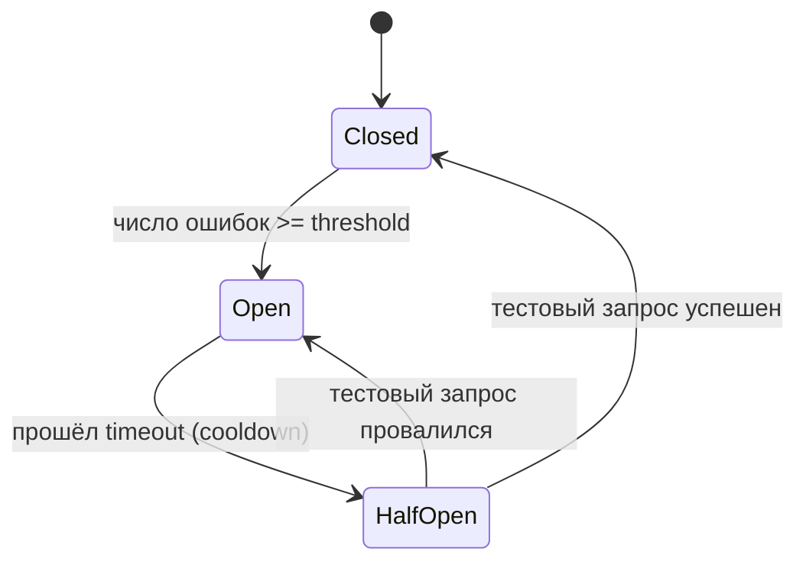
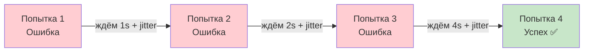
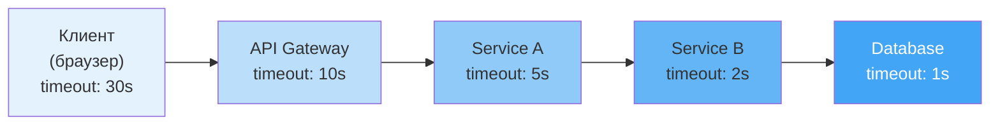
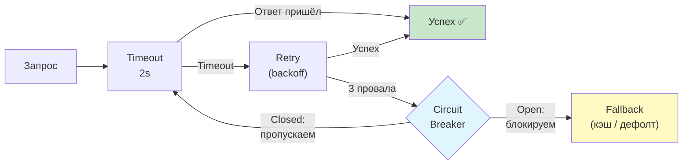
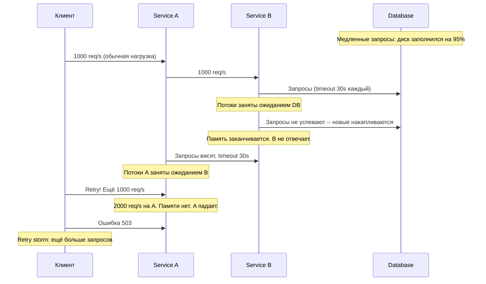
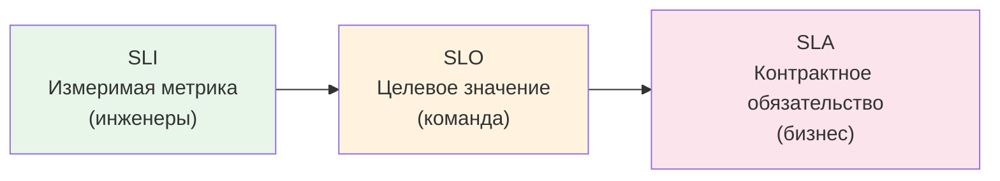
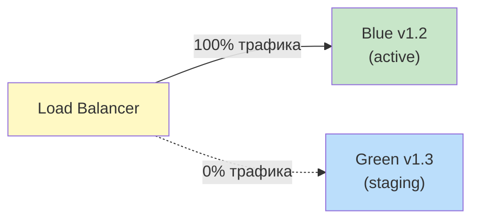
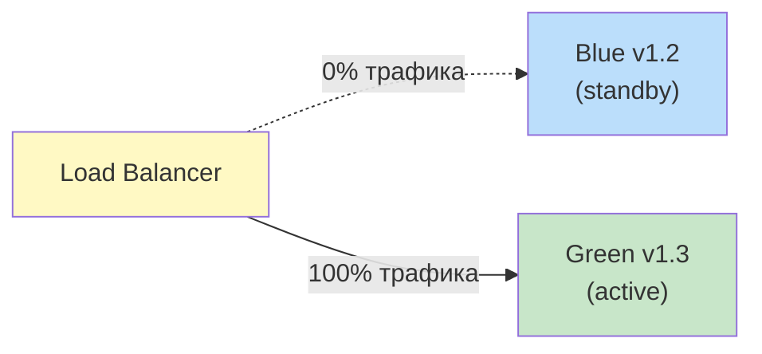
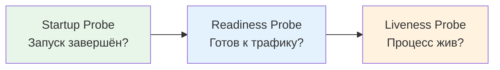
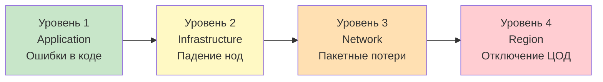

# Уровень 7: Паттерны надёжности -- Circuit Breaker, Retry, Bulkhead и другие

## Введение

Представьте, что вы строите небоскрёб. Архитекторы не проектируют здание с расчётом «чтобы ничего никогда не сломалось». Они проектируют его так, чтобы **пожар на третьем этаже не обрушил всё здание**, чтобы **треснувшая несущая балка не вызвала коллапс**, чтобы **отключение лифта не делало здание необитаемым**. В каждом этаже -- противопожарные двери. В конструкции -- избыточные несущие элементы. В каждой лестничной клетке -- аварийный выход.

Паттерны надёжности в распределённых системах -- это те же самые противопожарные двери, аварийные выходы и структурные перегородки, только для программного обеспечения. Они не предотвращают сбои -- они **локализуют их**, **ограничивают распространение** и **обеспечивают деградацию вместо полного отказа**.

📌 **Ключевая смена мышления:** перестать думать «как сделать систему, которая не падает» и начать думать «как сделать систему, которая правильно ведёт себя, когда что-то падает». В большой распределённой системе что-то всегда падает -- вопрос лишь в том, насколько изолирован этот отказ.

---

## 1. Circuit Breaker -- автомат защитного отключения

### Проблема, которую решает Circuit Breaker

Без Circuit Breaker происходит следующее: сервис A вызывает сервис B, который «лёг». Каждый запрос от A к B висит в ожидании timeout -- допустим, 30 секунд. За эти 30 секунд приходит ещё 100 запросов, потом ещё 1000. Все они висят, ожидая timeout. Потоки исполнения заканчиваются. Память заполняется. Сервис A перестаёт отвечать, хотя сам по себе работоспособен. Клиенты, вызывающие A, тоже начинают накапливать ожидающие запросы. Цепная реакция распространяется вверх по стеку.

Это называется **каскадным отказом** -- и именно его предотвращает Circuit Breaker.

Аналогия из электротехники: когда в электрощитке происходит короткое замыкание, автоматический выключатель **мгновенно разрывает цепь**. Не ждёт, пока сгорит проводка. Не пытается пропустить ток через повреждённый участок. Просто разрывает. Через некоторое время можно попробовать включить снова -- если повреждение устранено, всё заработает.

### Три состояния Circuit Breaker

Circuit Breaker -- это конечный автомат с тремя состояниями. Понимание переходов между ними критично для правильной настройки.



| Состояние | Что происходит | Поведение при запросе |
|---|---|---|
| **Closed** | Всё нормально, система работает | Запросы проходят. Каждая ошибка увеличивает счётчик |
| **Open** | Сервис признан недоступным | Запросы блокируются мгновенно. Возвращается fallback |
| **Half-Open** | Проверяем, восстановился ли сервис | Пропускается один (или несколько) тестовый запрос |

Ключевой момент состояния **Open**: запросы к упавшему сервису **не отправляются вообще**. Это освобождает потоки немедленно, вместо того чтобы ждать timeout. Сервис A получает ответ (пусть даже fallback) за миллисекунды, а не за 30 секунд.

Состояние **Half-Open** -- самое деликатное. После периода ожидания мы хотим проверить, ожил ли сервис B, но не хотим сразу обрушить на него весь накопившийся трафик. Поэтому пропускается один «зондирующий» запрос. Если он успешен -- переходим в Closed. Если нет -- обратно в Open, и таймер сбрасывается.

### Реализация Circuit Breaker

```typescript
type CircuitState = 'closed' | 'open' | 'half-open'

interface CircuitBreakerOptions {
  threshold: number      // Сколько ошибок подряд → Open
  timeout: number        // Через сколько ms из Open → HalfOpen
  halfOpenRequests: number // Сколько тестовых запросов в HalfOpen
}

class CircuitBreaker {
  private state: CircuitState = 'closed'
  private failureCount = 0
  private successCount = 0
  private lastFailureTime = 0

  constructor(private options: CircuitBreakerOptions) {}

  async call<T>(fn: () => Promise<T>, fallback: () => T): Promise<T> {
    if (this.state === 'open') {
      // Проверяем, не пора ли перейти в half-open
      const elapsed = Date.now() - this.lastFailureTime
      if (elapsed > this.options.timeout) {
        this.state = 'half-open'
        this.successCount = 0
        console.log('Circuit: open → half-open (testing recovery)')
      } else {
        // Таймаут ещё не истёк: сразу fallback, без попытки
        return fallback()
      }
    }

    try {
      const result = await fn()
      this.onSuccess()
      return result
    } catch (error) {
      this.onFailure()
      return fallback()
    }
  }

  private onSuccess(): void {
    if (this.state === 'half-open') {
      this.successCount++
      // Если набрали достаточно успешных запросов → закрываем
      if (this.successCount >= this.options.halfOpenRequests) {
        this.reset()
        console.log('Circuit: half-open → closed (service recovered)')
      }
    } else {
      // В closed-состоянии сбрасываем счётчик ошибок
      this.failureCount = 0
    }
  }

  private onFailure(): void {
    this.failureCount++
    this.lastFailureTime = Date.now()

    if (this.state === 'half-open') {
      // Сервис ещё не восстановился → обратно в open
      this.state = 'open'
      console.log('Circuit: half-open → open (service still down)')
    } else if (this.failureCount >= this.options.threshold) {
      this.state = 'open'
      console.log(`Circuit: closed → open (${this.failureCount} failures)`)
    }
  }

  private reset(): void {
    this.state = 'closed'
    this.failureCount = 0
    this.successCount = 0
  }

  getState(): CircuitState {
    return this.state
  }
}

// Использование
const paymentBreaker = new CircuitBreaker({
  threshold: 5,         // 5 ошибок подряд → открываем
  timeout: 30_000,      // Через 30 секунд пробуем снова
  halfOpenRequests: 2,  // 2 успешных теста → закрываем
})

async function chargeUser(userId: string, amount: number) {
  return paymentBreaker.call(
    () => paymentService.charge(userId, amount),
    () => ({ status: 'queued', message: 'Payment will be processed shortly' })
  )
}
```

Разберём, почему параметры именно такие:

- `threshold: 5` -- одна ошибка может быть случайной (сетевой сбой, garbage collection pause). Пять подряд -- это уже паттерн, сервис, скорее всего, лежит.
- `timeout: 30_000` -- 30 секунд даём сервису на восстановление. Слишком короткий timeout (1-2 секунды) приводит к тому, что Circuit Breaker слишком быстро переходит в half-open и снова в open, создавая лишние циклы. Слишком длинный -- и мы не замечаем, что сервис уже восстановился.
- `halfOpenRequests: 2` -- одного успешного теста мало: он мог проскочить случайно. Два успешных подряд -- хороший сигнал.

### Что использовать в продакшене

Писать Circuit Breaker самостоятельно -- хорошее учебное упражнение, но в продакшене используйте проверенные библиотеки:

| Экосистема | Библиотека | Особенности |
|---|---|---|
| Node.js | `opossum` | Промисы, события, метрики |
| Java | `resilience4j` | Аннотации, интеграция со Spring |
| .NET | `Polly` | Fluent API, комбинирование политик |
| Go | `gobreaker` | Простой и надёжный |
| Universal | `Hystrix` (Netflix) | Оригинальная реализация, устарел, но идеи живут |

💡 `resilience4j` и `Polly` также включают Retry, Bulkhead, Rate Limiter -- всё в одном пакете.

---

## 2. Retry с Exponential Backoff -- умные повторные попытки

### Почему наивный Retry опаснее отсутствия Retry

Интуиция подсказывает: если запрос не удался -- попробуй ещё раз. Это разумно. Но представьте: сервис платежей испытывает нагрузку и отвечает с задержками. Тайм-аут. Все 1000 клиентов немедленно повторяют запрос. Теперь сервис получает 2000 запросов вместо 1000. Кто-то из них снова не дожидается ответа и повторяет. Теперь 4000. Это называется **retry storm** -- шторм повторных попыток, который превращает частичный сбой в полный.

Три правила безопасного Retry:

1. **Ограничить число попыток** -- не больше 3-5.
2. **Exponential Backoff** -- с каждой попыткой задержка удваивается.
3. **Jitter (дрожание)** -- случайная добавка к задержке, чтобы клиенты не синхронизировались.

### Визуализация задержек



Почему экспоненциально, а не линейно? Потому что большинство восстановлений происходит быстро (сетевой глюк, кратковременный spike нагрузки), а те сбои, которые длятся долго, требуют много времени на восстановление. Экспоненциальный рост задержки хорошо соответствует этим двум сценариям.

### Реализация с тремя видами Jitter

```typescript
// Full Jitter: задержка случайна от 0 до максимума
// Равномерно распределяет нагрузку восстановления
function fullJitter(base: number, attempt: number): number {
  const cap = base * Math.pow(2, attempt)
  return Math.random() * cap
}

// Equal Jitter: половина детерминирована, половина случайна
// Баланс между предсказуемостью и разбросом
function equalJitter(base: number, attempt: number): number {
  const cap = base * Math.pow(2, attempt)
  const half = cap / 2
  return half + Math.random() * half
}

// Decorrelated Jitter: следующая задержка зависит от предыдущей
// Самый «размытый» вариант, лучше всего при большом числе клиентов
function decorrelatedJitter(prevDelay: number, base: number): number {
  return Math.min(
    30_000, // cap: не больше 30 секунд
    base + Math.random() * (prevDelay * 3 - base)
  )
}

// Универсальная функция retry с exponential backoff + full jitter
async function retryWithBackoff<T>(
  fn: () => Promise<T>,
  options: {
    maxAttempts?: number
    baseDelayMs?: number
    maxDelayMs?: number
    shouldRetry?: (error: unknown) => boolean
  } = {}
): Promise<T> {
  const {
    maxAttempts = 3,
    baseDelayMs = 1000,
    maxDelayMs = 30_000,
    shouldRetry = () => true,
  } = options

  let lastError: unknown

  for (let attempt = 0; attempt < maxAttempts; attempt++) {
    try {
      return await fn()
    } catch (error) {
      lastError = error

      // Не повторяем, если это «бессмысленно» (4xx, например)
      if (!shouldRetry(error)) {
        throw error
      }

      if (attempt < maxAttempts - 1) {
        // Exponential backoff с full jitter
        const cap = Math.min(baseDelayMs * Math.pow(2, attempt), maxDelayMs)
        const delay = Math.random() * cap

        console.log(
          `Attempt ${attempt + 1}/${maxAttempts} failed. ` +
          `Retrying in ${Math.round(delay)}ms...`
        )

        await new Promise(resolve => setTimeout(resolve, delay))
      }
    }
  }

  throw lastError
}

// Пример: не повторяем при 4xx (клиентская ошибка -- повтор бессмысленен)
const response = await retryWithBackoff(
  () => fetch('https://api.payment.com/charge', {
    method: 'POST',
    body: JSON.stringify({ amount: 1000 }),
  }),
  {
    maxAttempts: 3,
    baseDelayMs: 500,
    shouldRetry: (error) => {
      if (error instanceof Response) {
        return error.status >= 500  // Повторяем только при 5xx
      }
      return true  // Сетевые ошибки -- повторяем
    },
  }
)
```

### Таблица задержек для разных стратегий

| Попытка | Экспоненциально | С Full Jitter (пример) | С Equal Jitter (пример) |
|---|---|---|---|
| 1 | 1s | 0.7s | 0.85s |
| 2 | 2s | 1.4s | 1.6s |
| 3 | 4s | 3.1s | 3.5s |
| 4 | 8s | 5.8s | 6.3s |
| 5 | 16s | 11.2s | 12.1s |

📌 **Формула:** `delay = random(0, min(cap, base * 2^attempt))`

### Идемпотентность -- критическое условие для Retry

⚠️ **Важно:** Retry безопасен **только для идемпотентных операций**. Идемпотентность -- это свойство операции давать одинаковый результат при повторном выполнении.

- `GET /users/123` -- идемпотентна: повторный запрос вернёт те же данные
- `PUT /users/123` с полным телом -- идемпотентна: повторная установка тех же данных
- `POST /payments` -- **не идемпотентна**: повторный вызов создаст второй платёж

Для неидемпотентных операций используют **Idempotency Keys**: уникальный ID в заголовке запроса, который сервер сохраняет. Если приходит повторный запрос с тем же ключом -- сервер возвращает сохранённый результат вместо выполнения операции заново.

```typescript
// Idempotency Key для безопасного retry платежа
const idempotencyKey = crypto.randomUUID()  // Один ключ на всю «бизнес-операцию»

await retryWithBackoff(() =>
  fetch('https://api.payment.com/charge', {
    method: 'POST',
    headers: {
      'Idempotency-Key': idempotencyKey,  // Отправляем при каждой попытке
    },
    body: JSON.stringify({ userId, amount }),
  })
)
// Сервер payment.com проверяет idempotencyKey:
// Первый вызов → выполнить и сохранить результат
// Повторный → вернуть сохранённый результат (платёж НЕ создаётся дважды)
```

---

## 3. Bulkhead -- водонепроницаемые отсеки

### Аналогия и проблема

Классическая подводная лодка разделена на водонепроницаемые отсеки. Если торпеда пробивает корпус в одном месте -- вода заполняет только этот отсек. Остальные задраены. Лодка теряет часть функциональности, но остаётся на плаву.

Без Bulkhead в программной системе: один медленный сервис занимает все потоки, все соединения из пула, всю память очереди. Остальные сервисы, даже полностью работоспособные, не могут получить ресурсы. Система падает целиком из-за проблемы в одной её части.

### Три уровня применения Bulkhead

**Уровень 1 -- пулы соединений**

```typescript
import { Pool } from 'pg'

// ❌ Без Bulkhead: один пул на всё
const sharedPool = new Pool({ max: 100 })
// Медленные аналитические запросы занимают 95 из 100 соединений
// → Критические транзакции платежей не могут получить соединение
// → Платежи «падают», хотя сама БД работает нормально

// ✅ С Bulkhead: отдельные пулы по важности операции
const criticalPool = new Pool({
  max: 50,
  connectionString: process.env.DB_URL,
  // Для критичных операций: платежи, аутентификация
})

const standardPool = new Pool({
  max: 30,
  connectionString: process.env.DB_URL,
  // Для обычных операций: просмотр товаров, профиль пользователя
})

const analyticsPool = new Pool({
  max: 20,
  connectionString: process.env.DB_ANALYTICS_URL,
  // Для аналитики: может использовать read-реплику
})

// Теперь аналитика может «упасть», забрав свои 20 соединений --
// платежи продолжат работать со своими 50.
```

**Уровень 2 -- пулы потоков (Thread Pool Isolation)**

В Java/Kotlin и .NET можно выделить отдельный пул потоков для каждой группы зависимостей:

```typescript
// Node.js аналог через отдельные очереди с воркерами
import { Worker } from 'worker_threads'
import PQueue from 'p-queue'

// Отдельные очереди с ограничением параллельности
const paymentQueue = new PQueue({ concurrency: 20 })     // Макс 20 параллельных
const notificationQueue = new PQueue({ concurrency: 10 }) // Макс 10 параллельных
const analyticsQueue = new PQueue({ concurrency: 5 })     // Макс 5 параллельных

// Медленный analytics-запрос занимает не больше 5 «слотов»
// Платежи всегда имеют до 20 слотов

async function chargePayment(params: ChargeParams) {
  return paymentQueue.add(() => paymentService.charge(params))
}

async function trackAnalytics(event: AnalyticsEvent) {
  return analyticsQueue.add(() => analyticsService.track(event))
}
```

**Уровень 3 -- изоляция на уровне процессов/контейнеров**

В Kubernetes: отдельные Deployment для критичных и некритичных сервисов, с разными лимитами ресурсов и affinity-правилами. Аналитика и background-задачи никогда не вытеснят критичные сервисы с нод.

### Как определить границы Bulkhead

Хорошее эмпирическое правило -- разделять по одной из трёх осей:

1. **По критичности:** платёжные операции отдельно от аналитики
2. **По клиентам:** premium-клиенты отдельно от free-tier
3. **По типу операций:** read-операции отдельно от write-операций

---

## 4. Timeout + Fallback -- ограничение ожидания

### Почему Timeout -- это не «осторожность», а необходимость

Без timeout один «зависший» запрос занимает поток исполнения навсегда. В Node.js это блокирует event loop. В многопоточных системах это занимает поток из пула. Если запросы продолжают поступать -- пул потоков заполняется, новые запросы начинают ждать освобождения потока. Система замирает.

Timeout -- это не пессимизм («всё упадёт»), это реализм: **если ответ не пришёл за разумное время, ждать дальше бессмысленно**.

### Иерархия timeout-ов в стеке

Критически важное правило: **timeout каждого уровня должен быть короче timeout уровня выше**. Иначе верхний уровень не сможет получить ответ и среагировать.



Если timeout у Service A будет 10s, а у API Gateway тоже 10s -- Gateway получит таймаут от A ровно в момент, когда его собственный таймаут истекает. У Gateway не остаётся времени, чтобы вернуть клиенту информативный ответ (например, задействовать fallback).

### Правило timeout-ов по контексту

| Операция | Рекомендуемый timeout | Обоснование |
|---|---|---|
| API Gateway → микросервис | 10s | Клиент ждёт, нужен разумный лимит |
| Межсервисный вызов | 2-5s | Быстрые сервисы должны отвечать быстро |
| Запрос к базе данных | 1-3s | БД-запросы должны быть быстрыми; долгий запрос -- признак проблемы |
| Запрос к внешнему API | 5-15s | Зависит от API; устанавливайте по документации |
| Загрузка файла | 30-120s | Зависит от размера |
| Операция с кэшем (Redis) | 100-500ms | Кэш должен отвечать очень быстро |

### Fallback -- план Б

Fallback -- это заготовленный ответ на случай, когда основной путь недоступен. Хороший fallback максимально близок к реальному ответу, но не требует обращения к упавшему сервису.

```typescript
// Пример страницы товара с цепочкой fallback
async function getProductData(productId: string) {
  // Уровень 1: основной запрос с timeout
  const controller = new AbortController()
  const timeoutId = setTimeout(() => controller.abort(), 2000)

  try {
    const data = await fetch(`/api/products/${productId}`, {
      signal: controller.signal,
    }).then(r => r.json())
    clearTimeout(timeoutId)

    // Сохраняем в кэш для будущих fallback
    await cache.set(`product:${productId}`, data, { ttl: 300 })
    return data

  } catch (error) {
    clearTimeout(timeoutId)
    console.warn(`Primary fetch failed: ${error}`)

    // Уровень 2: данные из кэша
    const cached = await cache.get(`product:${productId}`)
    if (cached) {
      return { ...cached, _source: 'cache', _stale: true }
    }

    // Уровень 3: минимальный ответ
    return {
      id: productId,
      name: 'Product temporarily unavailable',
      price: null,
      available: false,
      _source: 'fallback',
    }
  }
}
```

Три уровня fallback -- типичный «defense in depth» подход. Каждый уровень немного хуже предыдущего, но все они лучше, чем 500 Internal Server Error.

### Полная цепочка защиты: Timeout + Retry + Circuit Breaker + Fallback



---

## 5. Cascading Failures -- анатомия каскадного отказа

### Почему системы падают «по цепочке»

Каскадный отказ -- это одна из самых опасных форм системного сбоя, потому что он начинается незаметно и нарастает стремительно. Чтобы понять механику, разберём конкретный сценарий.



Обратите внимание на ключевой момент: проблема началась в Database (медленная дисковая подсистема), но пострадали сервисы B и A, которые сами по себе совершенно здоровы. Их убила не собственная проблема, а ожидание чужой.

### Пять защитных механизмов

| Механизм | Что останавливает |
|---|---|
| **Timeout** | Прекращает бесконечное ожидание, освобождает потоки |
| **Circuit Breaker** | Прекращает отправку запросов к недоступному сервису |
| **Bulkhead** | Ограничивает, сколько ресурсов может «съесть» один сервис |
| **Retry + Backoff** | Не добавляет нагрузку в момент восстановления |
| **Backpressure** | Сервис явно сигнализирует о перегрузке через 429/503 |

### Backpressure -- явный сигнал о перегрузке

Backpressure -- это механизм, при котором перегруженный сервис явно сообщает вызывающей стороне: «я перегружен, не посылай больше запросов».

```typescript
// Простая реализация backpressure через очередь
class BackpressureService {
  private queue: Array<() => Promise<void>> = []
  private processing = 0
  private readonly maxQueue = 1000
  private readonly maxConcurrent = 50

  async enqueue<T>(task: () => Promise<T>): Promise<T> {
    // Очередь заполнена → отказываем сразу
    if (this.queue.length >= this.maxQueue) {
      throw new ServiceOverloadedError('Service is overloaded, retry later')
      // HTTP 503 с Retry-After заголовком
    }

    return new Promise((resolve, reject) => {
      this.queue.push(async () => {
        try { resolve(await task()) }
        catch (e) { reject(e) }
      })
      this.drain()
    })
  }

  private async drain() {
    while (this.queue.length > 0 && this.processing < this.maxConcurrent) {
      const task = this.queue.shift()!
      this.processing++
      task().finally(() => {
        this.processing--
        this.drain()
      })
    }
  }
}
```

---

## 6. SLA, SLO, SLI -- язык надёжности

### Зачем нужен формальный язык надёжности

Без точных определений разговор о надёжности превращается в субъективный: «система работает хорошо», «иногда бывают задержки». Это бесполезно -- нельзя измерить прогресс, нельзя принять обоснованные технические решения, нельзя договориться с бизнесом об ожиданиях.

SLI, SLO, SLA -- это трёхуровневая система, которая переводит «работает хорошо» в числа.



### Три уровня детально

**SLI (Service Level Indicator)** -- конкретная измеримая метрика. Это «что мы измеряем».

Примеры SLI:
- Процент запросов, завершившихся успешно (availability)
- p50, p95, p99 latency
- Throughput (запросов в секунду)
- Error rate (% запросов с ошибкой)
- Freshness (насколько свежи данные в кэше)

**SLO (Service Level Objective)** -- целевое значение для SLI. Это «к чему мы стремимся».

Примеры SLO:
- Availability >= 99.9% за 30 дней
- p99 latency < 200ms
- Error rate < 0.1%

**SLA (Service Level Agreement)** -- контрактное обязательство перед клиентами. Это «за что мы несём ответственность».

Разница между SLO и SLA: SLO -- внутренняя цель (хотим 99.99%), SLA -- публичное обязательство (гарантируем 99.95%). Разрыв между SLO и SLA -- буфер безопасности. Если вы публично гарантируете то, что сами едва достигаете -- при малейшем отклонении вы нарушаете SLA и платите компенсации.

### Error Budget -- бюджет ошибок

Error budget -- это количественное выражение допустимого downtime или числа ошибок за период.

```
SLO = 99.9% availability за 30 дней
Error budget = 100% - 99.9% = 0.1%

30 дней = 43 200 минут
Допустимый downtime = 43 200 × 0.001 = 43.2 минуты

Значит: за 30 дней система может быть недоступна суммарно 43 минуты.
Если потратили 43 минуты на инциденты -- деплоить нельзя до следующего периода.
Если потратили только 10 минут -- у вас ещё 33 минуты, можно делать рискованные деплои.
```

| SLO | Downtime в месяц | Downtime в год | Реальный уровень |
|---|---|---|---|
| 99% | 7.3 ч | 3.65 дня | Неприемлемо для большинства сервисов |
| 99.9% | 43.2 мин | 8.76 ч | Внутренние сервисы |
| 99.95% | 21.6 мин | 4.38 ч | Публичные API |
| 99.99% | 4.32 мин | 52.6 мин | Платёжные системы |
| 99.999% | 25.9 сек | 5.26 мин | Телефония, авиация |

📌 **Главный инсайт:** каждая дополнительная «девятка» -- это примерно **10x увеличение стоимости** (инфраструктура, резервирование, процессы, инженеры). Прежде чем требовать 99.999%, спросите: а что произойдёт, если система будет недоступна 4 минуты в месяц? Действительно ли это катастрофа?

### Burn Rate -- скорость расходования budget

Burn rate показывает, с какой скоростью расходуется error budget. Burn rate = 1 означает «расходуем равномерно, бюджет закончится ровно в конце периода». Burn rate = 10 -- бюджет закончится за 1/10 периода.

```typescript
// Пример мониторинга burn rate
function calculateBurnRate(
  sloTarget: number,      // 0.999
  windowMinutes: number,  // 60
  actualAvailability: number  // 0.995
): number {
  const errorBudget = 1 - sloTarget   // 0.001
  const currentErrorRate = 1 - actualAvailability  // 0.005

  // За какой период закончится бюджет?
  const burnRate = currentErrorRate / errorBudget  // 5
  // Burn rate 5: при такой ошибочности за 30 дней / 5 = 6 дней бюджет кончится
  return burnRate
}

// Burn rate > 1 → алерт: бюджет расходуется быстрее нормы
// Burn rate > 10 → критический алерт: немедленно нужно действовать
```

---

## 7. Blue-Green Deployment и Canary Releases -- безопасный деплой

### Почему стратегия деплоя -- это паттерн надёжности

Значительная часть production-инцидентов происходит во время деплоя. Новый код вводится в систему, и что-то идёт не так. Традиционный деплой (остановить старое → запустить новое) имеет момент полной недоступности и медленный rollback (нужно снова деплоить старую версию).

Blue-Green и Canary решают это, делая деплой итеративным и обратимым.

### Blue-Green Deployment

Идея: всегда держать два идентичных окружения. Одно обслуживает трафик (назовём Blue), другое -- тёплый резерв (Green). Новая версия деплоится в Green, проверяется, и затем load balancer переключает трафик.



После верификации Green:



Если что-то пошло не так с v1.3 -- один клик в load balancer, и весь трафик снова идёт на Blue с v1.2. Rollback занимает секунды, а не минуты.

**Компромисс:** нужно 2x ресурсов. Для больших инфраструктур это может быть дорого. Часто используют вариант, где Blue остаётся включённым только несколько часов после переключения -- для быстрого rollback -- а потом отключается.

### Canary Release -- постепенный rollout

Canary Release (назван в честь канареек, которых шахтёры брали под землю для обнаружения газа) -- постепенное направление части трафика на новую версию.

```
Этап 1:  v1.2 = 99%,  v1.3 = 1%    (canary: только 1% пользователей)
Этап 2:  v1.2 = 90%,  v1.3 = 10%   (смотрим метрики 30 минут)
Этап 3:  v1.2 = 75%,  v1.3 = 25%   (смотрим метрики 1 час)
Этап 4:  v1.2 = 50%,  v1.3 = 50%
Этап 5:  v1.2 = 0%,   v1.3 = 100%  (полный rollout)

На любом этапе: если error rate вырос > 5% от baseline → автоматический rollback
```

Ключевое отличие от Blue-Green: Canary позволяет найти проблемы, которые проявляются **только под реальной нагрузкой** или **только для определённых пользователей**. 1% реального трафика лучше любого staging-окружения.

### Feature Flags -- отделяем деплой от релиза

Feature flags (feature toggles) позволяют задеплоить код, не включая функциональность. Код живёт в продакшене, но выключен за флагом.

```typescript
// Простой in-code feature flag
const FLAGS = {
  newCheckoutFlow: process.env.FEATURE_NEW_CHECKOUT === 'true',
  experimentalSearch: process.env.FEATURE_EXP_SEARCH === 'true',
}

// Более продвинутый: процент rollout + группы пользователей
class FeatureFlags {
  isEnabled(flag: string, context: { userId: string }): boolean {
    const config = this.getConfig(flag)
    if (!config.enabled) return false

    // Детерминированный хэш: один и тот же пользователь
    // всегда попадает в одну и ту же группу
    const hash = this.hashUserId(context.userId)
    const bucket = hash % 100  // 0-99

    return bucket < config.rolloutPercentage
  }

  private hashUserId(userId: string): number {
    // Простой хэш для детерминированного распределения
    return userId.split('').reduce((acc, char) => {
      return ((acc << 5) - acc + char.charCodeAt(0)) | 0
    }, 0) >>> 0  // Unsigned 32-bit
  }
}

const flags = new FeatureFlags()

// В компоненте:
if (flags.isEnabled('new-checkout', { userId: user.id })) {
  return processNewCheckout(cart)
} else {
  return processLegacyCheckout(cart)
}
```

Польза Feature Flags за пределами canary-release:

- **Kill switch:** мгновенно отключить сломанную функцию без деплоя
- **A/B testing:** показать разные варианты разным пользователям
- **Beta groups:** включить для внутренних пользователей / early adopters
- **Операционные флаги:** например, включить circuit breaker для конкретного API

---

## 8. Health Checks и Graceful Degradation

### Liveness vs Readiness vs Startup

В Kubernetes (и не только) принято разделять три вида проверок:



| Проверка | Что проверяет | Что происходит при провале |
|---|---|---|
| **Liveness** | Процесс не завис, не в deadlock | Kubernetes убивает и перезапускает pod |
| **Readiness** | Сервис готов принимать трафик | Kubernetes убирает pod из балансировки |
| **Startup** | Начальная инициализация завершена | Kubernetes ждёт (не убивает) пока не True |

Различие между Liveness и Readiness критично: приложение может быть «живым» (процесс работает), но «не готовым» (прогревает кэш, ожидает подключения к БД). Если использовать только Liveness -- Kubernetes будет слать трафик на неготовый сервис.

### Реализация health checks

```typescript
import express from 'express'

const app = express()

// Liveness: «я жив»
// Простейшая проверка -- процесс отвечает на запросы
app.get('/healthz', (req, res) => {
  res.status(200).json({ status: 'ok', uptime: process.uptime() })
})

// Readiness: «я готов принимать трафик»
// Проверяем все критичные зависимости
app.get('/readyz', async (req, res) => {
  const checks = await Promise.allSettled([
    checkDatabase(),
    checkRedis(),
    checkMessageQueue(),
  ])

  const results = {
    database: checks[0].status === 'fulfilled' && checks[0].value,
    redis: checks[1].status === 'fulfilled' && checks[1].value,
    queue: checks[2].status === 'fulfilled' && checks[2].value,
  }

  const isReady = Object.values(results).every(Boolean)

  res.status(isReady ? 200 : 503).json({
    status: isReady ? 'ready' : 'not ready',
    checks: results,
    timestamp: new Date().toISOString(),
  })
})

async function checkDatabase(): Promise<boolean> {
  try {
    await db.query('SELECT 1')
    return true
  } catch {
    return false
  }
}

async function checkRedis(): Promise<boolean> {
  try {
    await redis.ping()
    return true
  } catch {
    return false
  }
}
```

### Graceful Degradation -- деградировать, но не умирать

Graceful Degradation -- это искусство делить функциональность на critical (без которой ответ невозможен) и non-critical (без которой ответ хуже, но возможен).

```typescript
async function getProductPage(productId: string): Promise<ProductPage> {
  // CRITICAL: без этого страницу показать невозможно → ошибка
  const product = await productService.get(productId)
  // Если этот вызов упадёт -- пробрасываем ошибку, возвращаем 404/500

  // NON-CRITICAL: показываем страницу без рекомендаций
  const recommendations = await circuitBreaker.call(
    () => recommendationService.getForProduct(productId),
    () => []  // Пустой массив -- страница работает, просто без рекомендаций
  )

  // NON-CRITICAL: показываем страницу без отзывов (или со stale-кэшем)
  const reviews = await circuitBreaker.call(
    () => reviewService.getForProduct(productId),
    async () => {
      const cached = await cache.get(`reviews:${productId}`)
      return cached ?? []
    }
  )

  // NON-CRITICAL: показываем последнюю известную цену
  const price = await circuitBreaker.call(
    () => pricingService.getCurrentPrice(productId),
    () => ({
      amount: product.lastKnownPrice,
      currency: 'USD',
      _stale: true,  // Флаг для UI: показать «Цена может быть устаревшей»
    })
  )

  return { product, recommendations, reviews, price }
}
```

📌 **Правило проектирования:** при разработке каждого вызова задайте себе вопрос: «если этот сервис упадёт, должен ли упасть весь запрос?» Если нет -- оберните в circuit breaker с fallback.

---

## 9. Observability -- видеть, что происходит

### Три столпа наблюдаемости

Нельзя управлять тем, что не видишь. Observability -- это свойство системы, позволяющее понять её внутреннее состояние по внешним выходным данным. Три столпа:


| Столп | Что это | Вопрос | Инструменты |
|---|---|---|---|
| **Metrics** | Числовые агрегаты по времени | «Что происходит сейчас?» | Prometheus, Grafana, Datadog |
| **Logs** | Текстовые события | «Почему это произошло?» | ELK Stack (Elasticsearch + Logstash + Kibana), Loki |
| **Traces** | Путь запроса через сервисы | «Где именно медленно/сломано?» | Jaeger, Zipkin, OpenTelemetry |

Аналогия: если система -- это самолёт, то metrics -- это приборы в кабине (высота, скорость, курс), logs -- это бортовой журнал (что делал пилот и когда), traces -- это чёрный ящик (полная запись полёта).

### Distributed Tracing -- прослеживаем путь запроса

В монолитном приложении стек вызовов виден прямо в трейсбеке. В микросервисах запрос проходит через 5-10 сервисов, каждый со своей базой данных. Без трейсинга дебаг такой системы -- это как искать иголку в стоге сена.

```
[Trace ID: f4a92b3c-1234]
├── API Gateway          (total: 312ms)
│   └── Routing:          8ms
├── Auth Service          (total: 34ms)
│   └── Redis lookup:     12ms
│   └── JWT validation:   22ms
├── Product Service       (total: 45ms)
│   └── PostgreSQL:       28ms  (индекс использован ✅)
├── Payment Service       (total: 240ms)  ← ⚠️ bottleneck
│   └── Fraud check:      15ms
│   └── Stripe API:       218ms  ← внешний вызов, объяснен
│   └── DB insert:         7ms
└── Notification Svc      (total: 18ms)
    └── RabbitMQ publish:  5ms

Total end-to-end: 355ms
```

Из этого трейса сразу видно: проблема не в нашем коде, а во внешнем API Stripe. Без трейсинга нужно было бы часами смотреть логи каждого сервиса.

### RED Method и USE Method

**RED Method** (для сервисов, обрабатывающих запросы):
- **R**ate: сколько запросов в секунду
- **E**rrors: сколько запросов завершается ошибкой
- **D**uration: как долго обрабатываются запросы

**USE Method** (для ресурсов: CPU, memory, disk):
- **U**tilization: насколько занят ресурс
- **S**aturation: насколько велика очередь ожидания
- **E**rrors: ошибки при работе с ресурсом

Эти два метода покрывают большинство производственных проблем.

---

## 10. Chaos Engineering -- тренировка устойчивости

### «Если вы не тестировали отказ -- вы не знаете, что произойдёт при отказе»

Netflix придумал Chaos Monkey в 2011 году: инструмент, который случайно убивал виртуальные машины в продакшене в рабочее время. Идея казалась безумной, но результат был революционным: Netflix обнаружил и исправил сотни слабых мест, которые никогда не проявились бы в тестировании.

Принцип Chaos Engineering: **намеренно вводить отказы в контролируемых условиях**, чтобы найти проблемы до того, как они найдут вас.

### Уровни экспериментов



| Эксперимент | Что проверяем | Инструменты |
|---|---|---|
| Убить случайный pod | Circuit breaker, health check, graceful restart | Chaos Monkey, Chaos Toolkit |
| Ввести задержку 5s | Timeout, backpressure | Toxiproxy, Istio fault injection |
| Пакетные потери 30% | Retry, idempotency | Tc (traffic control), Chaos Mesh |
| OOM kill | Memory limits, graceful degradation | chaos-monkey-for-spring |
| Заполнить диск | Monitoring, disk pressure handling | Litmus Chaos |
| Недоступность DNS | Service discovery, fallback | Chaos Mesh |

### GameDay -- плановые учения

GameDay -- это структурированное «учение», когда команда договаривается заранее и намеренно ломает систему:

1. **Объявить заранее** -- все знают, что сегодня в 14:00 «учения»
2. **Поставить гипотезу** -- «мы ожидаем, что при падении service X система деградирует до Y, но не упадёт»
3. **Провести эксперимент** -- сломать X и наблюдать
4. **Зафиксировать результаты** -- что произошло в реальности?
5. **Исправить расхождения** -- реальность хуже гипотезы? Исправить.

---

## Частые ошибки

### ❌ Ошибка 1: Retry без backoff и лимита

```typescript
// ❌ Бесконечный retry без задержки -- самоорганизованный DDoS
async function callService() {
  while (true) {
    try {
      return await externalService.getData()
    } catch {
      // Мгновенно повторяем. 1000 клиентов × мгновенный retry
      // = 1000 запросов в секунду на умирающий сервис
    }
  }
}
```

```typescript
// ✅ Ограниченный retry с exponential backoff + jitter
async function callService() {
  return retryWithBackoff(
    () => externalService.getData(),
    { maxAttempts: 3, baseDelayMs: 1000 }
  )
}
```

**Почему это проблема:** при одновременном retry 1000 клиентов возникает «thundering herd» (стадо громов) -- синхронизированная нагрузка, которая может уничтожить восстанавливающийся сервис. Exponential backoff + jitter разбивают нагрузку по времени.

### ❌ Ошибка 2: Timeout 30 секунд «на всякий случай»

```typescript
// ❌ Слишком большой timeout: поток заблокирован на 30 секунд
const response = await fetch(url, {
  signal: AbortSignal.timeout(30_000),
})

// При 100 одновременных «зависших» запросах:
// 100 потоков × 30 секунд = 3000 поток-секунд заблокированных ресурсов
```

```typescript
// ✅ Timeout соответствует ожидаемому времени операции
const response = await fetch(url, {
  signal: AbortSignal.timeout(2_000),  // 2 секунды для межсервисного вызова
})

// Правило: timeout[i] < timeout[i-1] в иерархии вызовов
```

**Почему это проблема:** длинные timeout-ы -- это «скрытые» блокировки ресурсов. Один медленный upstream может заблокировать весь пул потоков вашего сервиса.

### ❌ Ошибка 3: SLO = 100%

```typescript
// ❌ «У нас SLO 100% uptime. Мы не можем себе позволить downtime.»

// Последствия SLO 100%:
// → Error budget = 0 минут в месяц
// → Нельзя делать деплои (любой деплой имеет риск)
// → Нельзя проводить maintenance
// → Нельзя экспериментировать
// → Команда парализована страхом
// → На практике SLO нарушается при первом же инциденте
```

```typescript
// ✅ Реалистичный SLO с error budget
// Внутренний admin-сервис:    99.5%  (3.6 ч/месяц -- можно делать деплои)
// Пользовательский фронтенд: 99.9%  (43 мин/месяц -- нормальная инженерная цель)
// Публичный API:             99.95% (21 мин/месяц -- высокая, но достижимая)
// Платёжная система:         99.99% (4.3 мин/месяц -- только для критичного)
```

**Почему это проблема:** нулевой error budget означает нулевую скорость разработки. Гугл намеренно использует error budget как инструмент баланса: пока бюджет есть -- можно деплоить. Бюджет кончился -- стоп, занимаемся надёжностью.

### ❌ Ошибка 4: Circuit Breaker без fallback

```typescript
// ❌ Circuit Breaker открылся -- пользователь видит ошибку
if (circuitBreaker.getState() === 'open') {
  throw new Error('Recommendation service unavailable')
  // Итог: страница продукта недоступна из-за сервиса рекомендаций
  // Хотя рекомендации -- необязательная функция
}
```

```typescript
// ✅ Circuit Breaker + graceful degradation
const recommendations = await circuitBreaker.call(
  () => recommendationService.get(productId),
  async () => {
    // Попробуем кэш
    const cached = await cache.get(`recs:${productId}`)
    if (cached) return cached
    // Последний резерв: пустой массив
    return []
  }
)
// Страница продукта показывается без рекомендаций -- это допустимо
```

**Почему это проблема:** без fallback Circuit Breaker просто меняет один вид ошибки (timeout) на другой (немедленный отказ). Польза нулевая для пользователя. Польза Circuit Breaker раскрывается только в паре с fallback.

### ❌ Ошибка 5: Canary без автоматического мониторинга

```
❌ Команда выкатила canary на 5% трафика...
   ...и пошла пить кофе.
   Error rate на canary вырос с 0.1% до 3% за 10 минут.
   Никто не смотрел. Через час -- 100% rollout с 3% error rate.
   Пользователи злятся. Инцидент.
```

```
✅ Canary с автоматическим rollback:
   1. Выкатили 5% трафика на v1.3
   2. Prometheus алерт: если error rate canary > baseline + 1% → rollback
   3. Grafana дашборд: side-by-side сравнение v1.2 и v1.3
   4. Argo Rollouts / Flagger: автоматически анализирует метрики
      и принимает решение о promotion или rollback
   5. На каждом этапе -- анализ метрик минимум 15-30 минут
```

**Почему это проблема:** canary без мониторинга -- это просто медленный обычный деплой. Смысл canary именно в том, чтобы поймать проблему на малой части трафика до полного rollout.

### ❌ Ошибка 6: Retry идемпотентности без Idempotency Key

```typescript
// ❌ Retry для создания платежа без idempotency key
// Первый запрос → создаём платёж → timeout (но платёж создан в БД!)
// Второй запрос → создаём ВТОРОЙ платёж
// Пользователю списали деньги дважды 💸
async function createPayment(amount: number) {
  return retryWithBackoff(() =>
    fetch('/api/payments', {
      method: 'POST',
      body: JSON.stringify({ amount }),
    })
  )
}
```

```typescript
// ✅ С Idempotency Key: повторный запрос безопасен
async function createPayment(amount: number) {
  const idempotencyKey = crypto.randomUUID()  // Генерируем один раз для операции

  return retryWithBackoff(() =>
    fetch('/api/payments', {
      method: 'POST',
      headers: { 'Idempotency-Key': idempotencyKey },
      body: JSON.stringify({ amount }),
    })
  )
  // Сервер: при повторном запросе с тем же ключом → возвращает результат первого
}
```

---

## Итоги

| Паттерн | Проблема, которую решает | Ключевая настройка |
|---|---|---|
| **Circuit Breaker** | Каскадные отказы из-за бесполезных запросов к упавшему сервису | threshold (ошибок до открытия), timeout (cooldown) |
| **Retry + Backoff** | Потери при кратковременных сбоях | maxAttempts (3-5), exponential + jitter |
| **Bulkhead** | Один компонент «съедает» ресурсы остальных | Раздельные пулы по критичности |
| **Timeout** | Бесконечное ожидание блокирует ресурсы | API: 2-5s; DB: 1-3s; иерархически убывает |
| **Fallback** | Полный отказ вместо деградации | Кэш → дефолт → минимальный ответ |
| **SLO / Error Budget** | Субъективное восприятие надёжности | Реалистичные SLO = 99.9-99.99% |
| **Blue-Green** | Долгий downtime и медленный rollback при деплое | 2x ресурсы, мгновенное переключение |
| **Canary** | Проблемы в новой версии достигают всех пользователей | 1% → 5% → 25% → 100% с мониторингом |
| **Feature Flags** | Деплой = релиз (рискованно) | Отделить технический деплой от бизнес-релиза |
| **Health Checks** | Kubernetes шлёт трафик на неготовый сервис | Liveness + Readiness + Startup отдельно |
| **Observability** | Не видим, что происходит внутри системы | Metrics + Logs + Traces (все три!) |
| **Chaos Engineering** | Слабые места обнаруживаются в бою, а не в тестах | GameDay, Chaos Monkey, контролируемые эксперименты |

🎯 **Главный принцип:** надёжная система не та, которая «не падает», а та, которая **продолжает работать несмотря на отказы**. Проектируйте для отказа: предполагайте, что любой внешний вызов может провалиться, и заранее готовьте ответ на вопрос «что произойдёт, когда это случится?»

💡 **Практическое правило «пяти вопросов»** для каждой зависимости в архитектуре:

1. Что произойдёт, если эта зависимость не ответит в течение 5 секунд?
2. Что произойдёт, если она вернёт ошибку 10 раз подряд?
3. Что произойдёт, если она замедлится в 100 раз?
4. Что произойдёт, если её не будет 30 минут?
5. Есть ли fallback для каждого из этих случаев?

Если на любой из этих вопросов ответ «система упадёт» -- это место требует применения паттернов из этого уровня.
