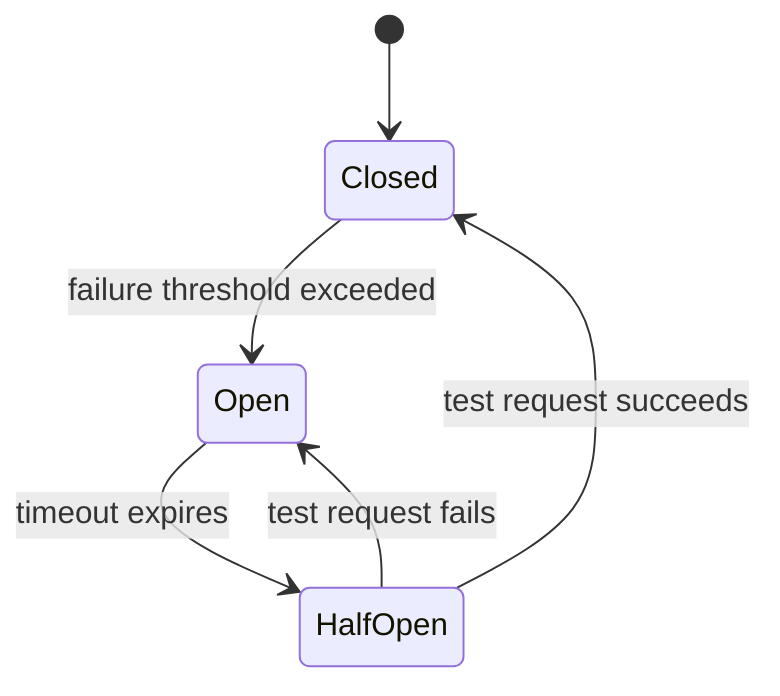
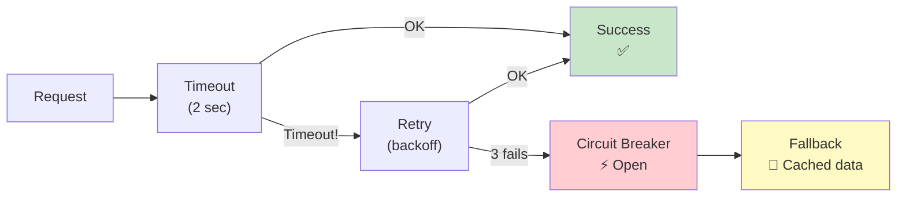
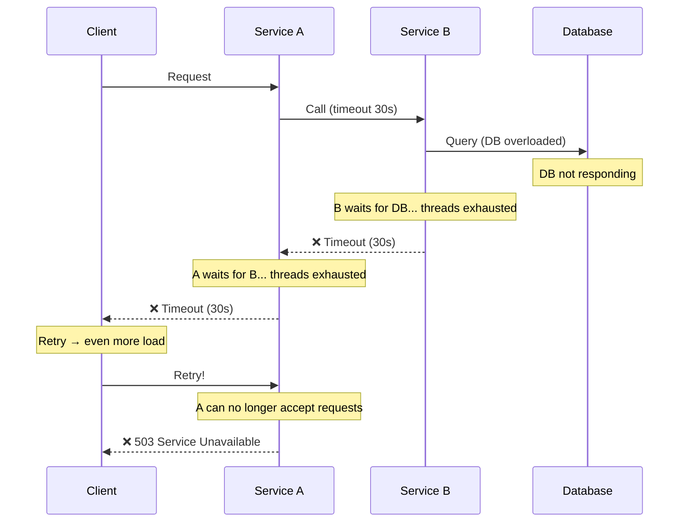
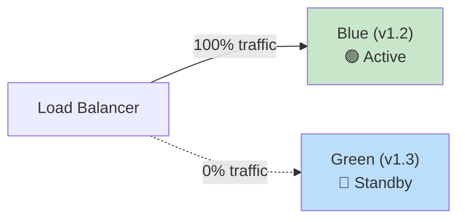
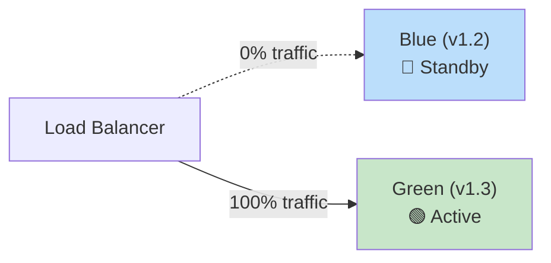

# 🔥 Level 7: Reliability Patterns

## 🎯 Why Reliability Patterns?

Imagine the electrical panel in your apartment. When one outlet shorts — the **circuit breaker trips** and protects the entire wiring. Without it — a fire. In distributed systems, the same thing happens: one failed service can **cascade and bring down the entire system**.

Reliability patterns are the **circuit breakers, fuses, and emergency exits** for your architecture. They don't prevent failures (failures are inevitable), but they **limit the damage** and **accelerate recovery**.

📌 **Key idea:** In a distributed system, the question isn't "will something fail?" but "when will it fail and how will we survive it?"

## 🔥 Circuit Breaker

Analogy: when a circuit breaker trips, it **breaks the circuit** so that a faulty section doesn't damage the entire network. Circuit Breaker in code works the same way — it stops sending requests to a service that's down instead of wasting resources on futile attempts.



### Three States

| State | Description | Behavior |
|---|---|---|
| **Closed** | Everything is working normally | Requests pass through. Errors are counted |
| **Open** | Service is down | Requests are NOT sent. Immediate fallback |
| **Half-Open** | Attempting recovery | One test request passes. If OK → Closed, if fails → Open |

### Pseudo-code

```typescript
class CircuitBreaker {
  private state: 'closed' | 'open' | 'half-open' = 'closed'
  private failureCount = 0
  private lastFailureTime = 0

  constructor(
    private threshold: number,   // how many errors before opening
    private timeout: number,     // ms before trying again
  ) {}

  async call<T>(fn: () => Promise<T>, fallback: () => T): Promise<T> {
    // Open → check timeout
    if (this.state === 'open') {
      if (Date.now() - this.lastFailureTime > this.timeout) {
        this.state = 'half-open'  // Time to try
      } else {
        return fallback()  // Don't waste resources
      }
    }

    try {
      const result = await fn()
      this.onSuccess()
      return result
    } catch (error) {
      this.onFailure()
      return fallback()
    }
  }

  private onSuccess() {
    this.failureCount = 0
    this.state = 'closed'
  }

  private onFailure() {
    this.failureCount++
    this.lastFailureTime = Date.now()
    if (this.failureCount >= this.threshold) {
      this.state = 'open'
    }
  }
}

// Usage
const breaker = new CircuitBreaker(5, 30000) // 5 errors → open, 30s timeout

const result = await breaker.call(
  () => paymentService.charge(amount),
  () => ({ status: 'pending', message: 'Payment queued' })
)
```

💡 **In production**, use libraries: `opossum` (Node.js), `resilience4j` (Java), `polly` (.NET). Don't write your own Circuit Breaker for production.

## 🔥 Retry with Exponential Backoff

Retry — retrying after an error. But naive retry (immediate and infinite) is **more dangerous than the error itself**: all clients simultaneously hammer a dying service, and it never recovers.

**Exponential backoff** — increase the delay exponentially: 1s → 2s → 4s → 8s → 16s.

**Jitter** — add random variation so clients don't retry simultaneously.

```typescript
async function retryWithBackoff<T>(
  fn: () => Promise<T>,
  maxRetries: number = 3,
  baseDelay: number = 1000
): Promise<T> {
  for (let attempt = 0; attempt <= maxRetries; attempt++) {
    try {
      return await fn()
    } catch (error) {
      if (attempt === maxRetries) throw error

      // Exponential backoff + jitter
      const delay = baseDelay * Math.pow(2, attempt)
      const jitter = delay * Math.random()  // 0..delay
      const waitTime = delay + jitter

      console.log(`Attempt ${attempt + 1} failed. Retry in ${waitTime}ms`)
      await new Promise(resolve => setTimeout(resolve, waitTime))
    }
  }
  throw new Error('Unreachable')
}

// Usage
const data = await retryWithBackoff(
  () => fetch('https://api.payment.com/charge'),
  3,    // max 3 attempts
  1000  // initial delay 1 second
)
```

| Attempt | Delay (no jitter) | Delay (with jitter, example) |
|---|---|---|
| 1 | 1s | 1s + 0.7s = 1.7s |
| 2 | 2s | 2s + 1.3s = 3.3s |
| 3 | 4s | 4s + 2.8s = 6.8s |
| 4 | 8s | 8s + 5.1s = 13.1s |

📌 **Formula:** `delay = baseDelay * 2^attempt + random(0, baseDelay * 2^attempt)`

## 🔥 Bulkhead — Submarine Compartments

Analogy: a submarine's hull is divided into **watertight compartments**. If one compartment floods — the submarine doesn't sink. The Bulkhead pattern isolates system components so that one component's failure doesn't affect others.

```typescript
// ❌ Without bulkhead: one connection pool for everything
const connectionPool = new Pool({ max: 100 })
// Slow service A takes all 100 connections
// → Fast service B cannot get a connection
// → Everything is down

// ✅ With bulkhead: separate pools for each service
const poolForPayments = new Pool({ max: 30 })
const poolForNotifications = new Pool({ max: 20 })
const poolForAnalytics = new Pool({ max: 10 })
// Analytics went down and took its 10 connections
// → Payments and notifications work fine
```

## 🔥 Timeout + Fallback

**Timeout** — limiting the wait time for a response. Without a timeout, one slow request can block a thread/connection forever.

**Fallback** — a backup plan when the main path doesn't work.



```typescript
// Combination: timeout + retry + circuit breaker + fallback
async function resilientCall<T>(
  primaryFn: () => Promise<T>,
  fallbackFn: () => T,
  options: { timeoutMs: number, retries: number }
): Promise<T> {
  const { timeoutMs, retries } = options

  const withTimeout = (fn: () => Promise<T>) =>
    Promise.race([
      fn(),
      new Promise<never>((_, reject) =>
        setTimeout(() => reject(new Error('Timeout')), timeoutMs)
      )
    ])

  // Retry with timeout
  for (let i = 0; i <= retries; i++) {
    try {
      return await withTimeout(primaryFn)
    } catch {
      if (i === retries) break
      await new Promise(r => setTimeout(r, 1000 * Math.pow(2, i)))
    }
  }

  // Everything failed → fallback
  return fallbackFn()
}
```

💡 **Timeout rule:** API Gateway → 10s, inter-service call → 2–5s, database → 1–3s. The deeper in the stack — the shorter the timeout.

## 🔥 Cascading Failures

Cascading failure — when one service's failure triggers a chain reaction that brings down the entire system.



**Protection against cascading failures:**

1. **Timeout** — don't wait forever (2–5s, not 30s!)
2. **Circuit Breaker** — stop knocking on a dead service
3. **Bulkhead** — isolate resource pools
4. **Fallback** — degrade but still respond
5. **Backpressure** — service says "I'm overloaded, wait"

## 🔥 SLA, SLO, SLI — The Language of Reliability

| Term | Full Name | Who Defines | Example |
|---|---|---|---|
| **SLI** | Service Level Indicator | Engineers (metrics) | Latency p99, error rate, uptime |
| **SLO** | Service Level Objective | Team (target) | p99 latency < 200ms, uptime 99.9% |
| **SLA** | Service Level Agreement | Business (contract) | 99.95% uptime, or compensation |

**Error budget** — how many "errors" you can afford while staying within your SLO.

```
SLO = 99.9% uptime
Error budget = 100% - 99.9% = 0.1%

Per 30 days (43,200 minutes):
Allowed downtime = 43,200 × 0.001 = 43.2 minutes

Per year (525,600 minutes):
Allowed downtime = 525,600 × 0.001 = 525.6 minutes ≈ 8.76 hours
```

| SLO | Downtime / month | Downtime / year |
|---|---|---|
| 99% | 7.3 hours | 3.65 days |
| 99.9% | 43.2 min | 8.76 hours |
| 99.99% | 4.32 min | 52.6 min |
| 99.999% | 25.9 sec | 5.26 min |

📌 **Each "nine" means 10x complexity and cost.** 99.9% → 99.99% can cost millions.

**Burn rate** — the rate at which you're consuming error budget. Burn rate = 1 means the budget is consumed evenly over the period. Burn rate = 10 means the budget will be exhausted in 1/10 of the period.

## 🔥 Blue-Green Deployment and Canary Releases

### Blue-Green Deployment

Two identical environments. One (Blue) serves traffic, the other (Green) — for the new release. Instant switchover.



After verifying Green — switch:



**Pro:** instant rollback (switch back to Blue). **Con:** requires 2x resources.

### Canary Release

The new version receives a small percentage of traffic. If metrics are fine — the percentage increases.

```
Stage 1:  v1.2 = 95%,  v1.3 = 5%   (canary)
Stage 2:  v1.2 = 75%,  v1.3 = 25%  (monitor metrics)
Stage 3:  v1.2 = 50%,  v1.3 = 50%
Stage 4:  v1.2 = 0%,   v1.3 = 100% (full rollout)

If at any stage the error rate increases → rollback to v1.2 = 100%
```

### Feature Flags

Separate deployment from release. Code is in production but disabled. Enable for specific users/groups.

```typescript
// Feature flag — enable for 10% of users
if (featureFlags.isEnabled('new-checkout', { userId: user.id })) {
  return <NewCheckoutFlow />
} else {
  return <OldCheckoutFlow />
}

// Gradual rollout
// Day 1: 1% of users
// Day 3: 10% of users
// Day 7: 50% of users
// Day 10: 100% of users
```

💡 **Feature flags + canary release** — ideal combination: canary controls infrastructure, feature flags control business logic.

## 🔥 Health Checks and Graceful Degradation

### Health Checks

```typescript
// Liveness — is the process alive?
app.get('/healthz', (req, res) => {
  res.status(200).json({ status: 'ok' })
})

// Readiness — ready to accept traffic?
app.get('/readyz', async (req, res) => {
  const dbOk = await checkDatabase()
  const cacheOk = await checkRedis()
  const queueOk = await checkRabbitMQ()

  if (dbOk && cacheOk && queueOk) {
    res.status(200).json({ status: 'ready', db: 'ok', cache: 'ok', queue: 'ok' })
  } else {
    res.status(503).json({ status: 'not ready', db: dbOk, cache: cacheOk, queue: queueOk })
  }
})
```

| Check | Purpose | What to do if not OK |
|---|---|---|
| **Liveness** | Process not frozen? | Kubernetes restarts the pod |
| **Readiness** | Ready for traffic? | Kubernetes removes from load balancing |
| **Startup** | Startup complete? | Kubernetes waits (doesn't kill) |

### Graceful Degradation

The system continues to work with reduced functionality instead of a complete failure.

```typescript
// Example: online store
async function getProductPage(productId: string) {
  // Core data — mandatory
  const product = await productService.get(productId) // Without this — 404

  // Recommendations — optional, fallback = empty
  const recommendations = await circuitBreaker.call(
    () => recommendationService.get(productId),
    () => []  // Show page without recommendations
  )

  // Reviews — optional, fallback = cache
  const reviews = await circuitBreaker.call(
    () => reviewService.get(productId),
    () => cache.get(`reviews:${productId}`) ?? []
  )

  // Real-time price — optional, fallback = last known
  const price = await circuitBreaker.call(
    () => pricingService.getPrice(productId),
    () => product.lastKnownPrice
  )

  return { product, recommendations, reviews, price }
}
```

📌 **Rule:** divide dependencies into **critical** (response impossible without them) and **non-critical** (can degrade). For non-critical, always have a fallback.

## 🔥 Observability — Metrics, Logs, Traces

You can't fix what you can't see. Three pillars of observability:

| Pillar | What it provides | Tools |
|---|---|---|
| **Metrics** | Numerical indicators (latency, error rate, throughput) | Prometheus, Grafana, Datadog |
| **Logs** | Text records of events | ELK Stack, Loki, CloudWatch |
| **Traces** | Request path through all services | Jaeger, Zipkin, OpenTelemetry |

**Distributed tracing** — trace a request from the client through all microservices:

```
[Trace ID: abc-123]
├── API Gateway       (12ms)
├── User Service      (45ms)
│   └── PostgreSQL    (23ms)
├── Payment Service   (230ms)  ← bottleneck!
│   └── Stripe API    (210ms)
└── Notification Svc  (15ms)
    └── RabbitMQ      (3ms)
Total: 302ms
```

💡 **Rule:** every service must propagate the `trace-id` in headers. Without it, debugging a distributed system is like reading tea leaves.

## 🔥 Chaos Engineering

Intentionally creating failures in production to discover weak points **before they manifest on their own**.

**Principle:** "If you haven't tested that your system can survive a failure — it won't survive it."

```
Example experiments:
1. Kill a random pod / container (Chaos Monkey)
2. Add 5s delay to inter-service calls
3. Block network access between two services
4. Fill disk to 100%
5. Saturate CPU to 100%
```

**GameDay** — scheduled "drills" where the team intentionally breaks the system and practices recovery.

## ⚠️ Common Beginner Mistakes

### ❌ Mistake 1: Retry without backoff and limit

```typescript
// ❌ Infinite retry without delay — DDoS on your own service
while (true) {
  try {
    await callService()
    break
  } catch {
    // Retry immediately! The service is already overloaded...
  }
}
```

```typescript
// ✅ Retry with exponential backoff, jitter, and attempt limit
for (let i = 0; i < 3; i++) {
  try {
    return await callService()
  } catch {
    const delay = 1000 * Math.pow(2, i) + Math.random() * 1000
    await sleep(delay)
  }
}
return fallback()
```

### ❌ Mistake 2: 30-second timeout "just in case"

```typescript
// ❌ 30s timeout — client waits half a minute, threads exhausted
const response = await fetch(url, { signal: AbortSignal.timeout(30000) })
```

```typescript
// ✅ Timeout appropriate to the operation
const response = await fetch(url, { signal: AbortSignal.timeout(2000) }) // 2s for API
// DB: 1-3s, API: 2-5s, file upload: 30s (reasonable here)
```

### ❌ Mistake 3: SLO = 100%

```typescript
// ❌ "Our SLO is 100% uptime"
// This is impossible. Even Google = 99.999%, not 100%.
// SLO 100% = zero error budget = can't deploy = can't evolve
```

```typescript
// ✅ Realistic SLO
// Internal service: 99.9% (43 min downtime / month)
// Public API: 99.95% (21 min downtime / month)
// Payment system: 99.99% (4.3 min downtime / month)
```

### ❌ Mistake 4: Circuit Breaker without fallback

```typescript
// ❌ Circuit breaker is open, but the client only gets an error
if (circuitBreaker.isOpen()) {
  throw new Error('Service unavailable')
  // User sees 503 — no better than without circuit breaker
}
```

```typescript
// ✅ Circuit breaker + graceful degradation
if (circuitBreaker.isOpen()) {
  const cached = await cache.get(key)
  if (cached) return cached               // Cached data
  return { status: 'degraded', data: [] } // Empty but valid response
}
```

### ❌ Mistake 5: Canary without monitoring

```
❌ Rolled out canary to 5% traffic... and forgot to watch metrics.
   Error rate grew 3x, but nobody noticed.
   After an hour — 100% rollout of a broken version.
```

```
✅ Canary with automatic rollback:
   1. Roll out 5% traffic
   2. Automatic check: error rate, latency p99, CPU
   3. If metrics deviate > 10% from baseline → automatic rollback
   4. If OK → increase to 25%
   Tools: Argo Rollouts, Flagger, Spinnaker
```

## 📌 Summary

| Pattern | Key Takeaway |
|---|---|
| **Circuit Breaker** | Stop knocking on a dead service. 3 states: Closed → Open → Half-Open |
| **Retry + Backoff** | Retry with increasing delay + jitter. Max 3–5 attempts |
| **Bulkhead** | Isolate resources. One component's failure doesn't bring down others |
| **Timeout** | Don't wait forever. API: 2–5s, DB: 1–3s |
| **Fallback** | Always have a plan B: cache, default, degraded response |
| **SLO / Error Budget** | Measurable reliability. Each "nine" = 10x cost |
| **Blue-Green** | Two environments, instant switch and rollback |
| **Canary** | Gradual rollout 5% → 25% → 100% with monitoring |
| **Feature Flags** | Separate deployment from release. Enable features gradually |
| **Health Checks** | Liveness, readiness, startup — Kubernetes manages lifecycle |
| **Observability** | Metrics + Logs + Traces. Without them, you're blind |
| **Chaos Engineering** | Intentionally break the system to make it stronger |

🎯 **Main principle:** Reliability is not about "working without errors" — it's about "continuing to work **despite** errors." Design systems that **expect** failures and are **prepared** for them.