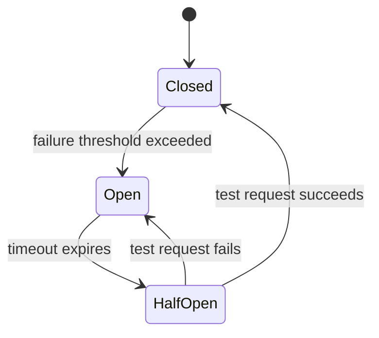
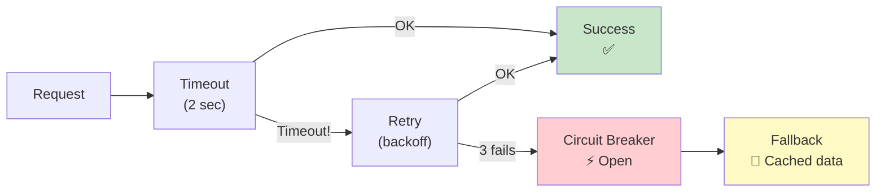
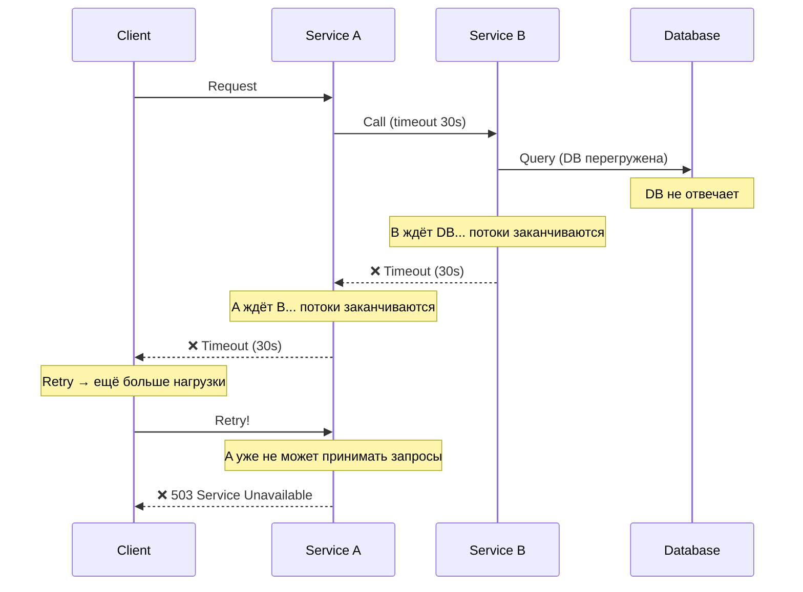
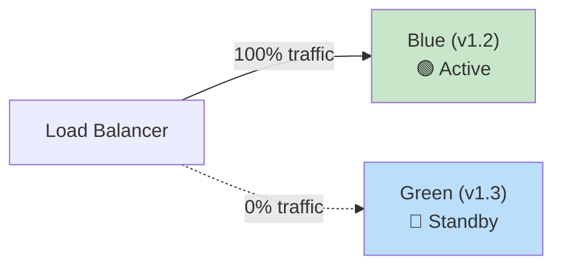
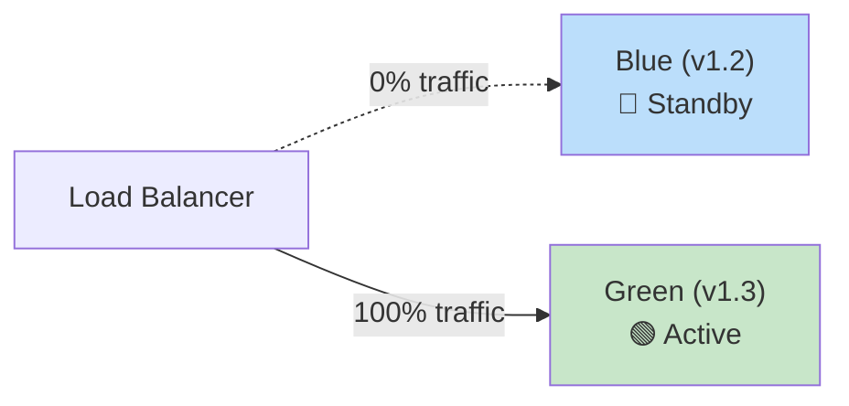

# 🔥 Уровень 7: Паттерны надёжности

## 🎯 Зачем нужны паттерны надёжности?

Представьте электрощиток в вашей квартире. Когда одна розетка коротит — **автомат выбивает** и защищает всю проводку. Без автомата — пожар. В распределённых системах происходит то же самое: один упавший сервис может **каскадом положить всю систему**.

Паттерны надёжности — это **автоматы, предохранители и аварийные выходы** для вашей архитектуры. Они не предотвращают поломки (поломки неизбежны), а **ограничивают ущерб** и **ускоряют восстановление**.

📌 **Главная мысль:** в распределённой системе вопрос не «упадёт ли что-то?», а «когда упадёт и как мы это переживём?».

## 🔥 Circuit Breaker — автомат в электрощитке

Аналогия: когда в электрощитке автомат срабатывает, он **разрывает цепь**, чтобы неисправный участок не повредил всю сеть. То же самое делает Circuit Breaker в коде — перестаёт отправлять запросы к сервису, который «лежит», вместо того чтобы тратить ресурсы на бесполезные попытки.



### Три состояния

| Состояние | Описание | Поведение |
|---|---|---|
| **Closed** | Всё работает нормально | Запросы проходят. Считаем ошибки |
| **Open** | Сервис «лежит» | Запросы НЕ отправляются. Сразу fallback |
| **Half-Open** | Пробуем восстановить | Пропускаем 1 тестовый запрос. Если OK → Closed, если нет → Open |

### Pseudo-code

```typescript
class CircuitBreaker {
  private state: 'closed' | 'open' | 'half-open' = 'closed'
  private failureCount = 0
  private lastFailureTime = 0

  constructor(
    private threshold: number,   // после скольких ошибок открывать
    private timeout: number,     // через сколько ms пробовать снова
  ) {}

  async call<T>(fn: () => Promise<T>, fallback: () => T): Promise<T> {
    // Open → проверяем timeout
    if (this.state === 'open') {
      if (Date.now() - this.lastFailureTime > this.timeout) {
        this.state = 'half-open'  // Пора попробовать
      } else {
        return fallback()  // Не тратим ресурсы
      }
    }

    try {
      const result = await fn()
      this.onSuccess()
      return result
    } catch (error) {
      this.onFailure()
      return fallback()
    }
  }

  private onSuccess() {
    this.failureCount = 0
    this.state = 'closed'
  }

  private onFailure() {
    this.failureCount++
    this.lastFailureTime = Date.now()
    if (this.failureCount >= this.threshold) {
      this.state = 'open'
    }
  }
}

// Использование
const breaker = new CircuitBreaker(5, 30000) // 5 ошибок → open, 30s timeout

const result = await breaker.call(
  () => paymentService.charge(amount),
  () => ({ status: 'pending', message: 'Payment queued' })
)
```

💡 **В реальности** используют библиотеки: `opossum` (Node.js), `resilience4j` (Java), `polly` (.NET). Не пишите свой Circuit Breaker в продакшене.

## 🔥 Retry с Exponential Backoff

Retry — повторная попытка после ошибки. Но наивный retry (сразу и бесконечно) — **опаснее самой ошибки**: все клиенты одновременно долбят умирающий сервис, и он никогда не восстановится.

**Exponential backoff** — увеличиваем задержку экспоненциально: 1s → 2s → 4s → 8s → 16s.

**Jitter** — добавляем случайный разброс, чтобы клиенты не повторяли одновременно.

```typescript
async function retryWithBackoff<T>(
  fn: () => Promise<T>,
  maxRetries: number = 3,
  baseDelay: number = 1000
): Promise<T> {
  for (let attempt = 0; attempt <= maxRetries; attempt++) {
    try {
      return await fn()
    } catch (error) {
      if (attempt === maxRetries) throw error

      // Exponential backoff + jitter
      const delay = baseDelay * Math.pow(2, attempt)
      const jitter = delay * Math.random()  // 0..delay
      const waitTime = delay + jitter

      console.log(`Attempt ${attempt + 1} failed. Retry in ${waitTime}ms`)
      await new Promise(resolve => setTimeout(resolve, waitTime))
    }
  }
  throw new Error('Unreachable')
}

// Использование
const data = await retryWithBackoff(
  () => fetch('https://api.payment.com/charge'),
  3,    // максимум 3 попытки
  1000  // начальная задержка 1 секунда
)
```

| Попытка | Задержка (без jitter) | Задержка (с jitter, пример) |
|---|---|---|
| 1 | 1s | 1s + 0.7s = 1.7s |
| 2 | 2s | 2s + 1.3s = 3.3s |
| 3 | 4s | 4s + 2.8s = 6.8s |
| 4 | 8s | 8s + 5.1s = 13.1s |

📌 **Формула:** `delay = baseDelay * 2^attempt + random(0, baseDelay * 2^attempt)`

## 🔥 Bulkhead — отсеки подводной лодки

Аналогия: в подводной лодке корпус разделён на **водонепроницаемые отсеки**. Если один отсек затоплен — лодка не тонет. Bulkhead pattern изолирует компоненты системы, чтобы отказ одного не влиял на другие.

```typescript
// ❌ Без bulkhead: один пул соединений на всё
const connectionPool = new Pool({ max: 100 })
// Медленный сервис A забирает все 100 соединений
// → Быстрый сервис B не может получить соединение
// → Всё «лежит»

// ✅ С bulkhead: отдельные пулы для каждого сервиса
const poolForPayments = new Pool({ max: 30 })
const poolForNotifications = new Pool({ max: 20 })
const poolForAnalytics = new Pool({ max: 10 })
// Аналитика «легла» и забрала свои 10 соединений
// → Платежи и уведомления работают нормально
```

## 🔥 Timeout + Fallback

**Timeout** — ограничение времени ожидания ответа. Без timeout один медленный запрос может заблокировать поток/соединение навсегда.

**Fallback** — запасной вариант, когда основной путь не работает.



```typescript
// Комбинация: timeout + retry + circuit breaker + fallback
async function resilientCall<T>(
  primaryFn: () => Promise<T>,
  fallbackFn: () => T,
  options: { timeoutMs: number, retries: number }
): Promise<T> {
  const { timeoutMs, retries } = options

  const withTimeout = (fn: () => Promise<T>) =>
    Promise.race([
      fn(),
      new Promise<never>((_, reject) =>
        setTimeout(() => reject(new Error('Timeout')), timeoutMs)
      )
    ])

  // Retry with timeout
  for (let i = 0; i <= retries; i++) {
    try {
      return await withTimeout(primaryFn)
    } catch {
      if (i === retries) break
      await new Promise(r => setTimeout(r, 1000 * Math.pow(2, i)))
    }
  }

  // Всё упало → fallback
  return fallbackFn()
}
```

💡 **Правило timeout-ов:** API Gateway → 10s, межсервисный вызов → 2-5s, БД → 1-3s. Чем глубже в стеке — тем короче timeout.

## 🔥 Cascading Failures — каскадный отказ

Каскадный отказ — когда падение одного сервиса вызывает цепную реакцию и ложит всю систему.



**Защита от каскадных отказов:**

1. **Timeout** — не ждать вечно (2-5s, не 30s!)
2. **Circuit Breaker** — перестать стучать в мёртвый сервис
3. **Bulkhead** — изолировать пулы ресурсов
4. **Fallback** — деградировать, но отвечать
5. **Backpressure** — сервис говорит «я перегружен, подожди»

## 🔥 SLA, SLO, SLI — язык надёжности

| Термин | Расшифровка | Кто определяет | Пример |
|---|---|---|---|
| **SLI** | Service Level Indicator | Инженеры (метрики) | Latency p99, error rate, uptime |
| **SLO** | Service Level Objective | Команда (цель) | p99 latency < 200ms, uptime 99.9% |
| **SLA** | Service Level Agreement | Бизнес (контракт) | 99.95% uptime, иначе компенсация |

**Error budget** — сколько «ошибок» вы можете себе позволить, оставаясь в рамках SLO.

```
SLO = 99.9% uptime
Error budget = 100% - 99.9% = 0.1%

За 30 дней (43 200 минут):
Допустимый downtime = 43 200 × 0.001 = 43.2 минуты

За год (525 600 минут):
Допустимый downtime = 525 600 × 0.001 = 525.6 минут ≈ 8.76 часов
```

| SLO | Downtime / месяц | Downtime / год |
|---|---|---|
| 99% | 7.3 часа | 3.65 дня |
| 99.9% | 43.2 мин | 8.76 часа |
| 99.99% | 4.32 мин | 52.6 мин |
| 99.999% | 25.9 сек | 5.26 мин |

📌 **Каждая «девятка» — это 10x сложности и стоимости.** 99.9% → 99.99% может стоить миллионы.

**Burn rate** — скорость расходования error budget. Burn rate = 1 означает, что budget расходуется равномерно за весь период. Burn rate = 10 — budget закончится за 1/10 периода.

## 🔥 Blue-Green Deployment и Canary Releases

### Blue-Green Deployment

Две идентичные среды. Одна (Blue) обслуживает трафик, другая (Green) — для нового релиза. Переключение мгновенное.



После проверки Green — переключаем:



**Плюс:** мгновенный rollback (переключить обратно на Blue). **Минус:** нужно 2x ресурсов.

### Canary Release

Новая версия получает маленький процент трафика. Если метрики в норме — процент увеличивается.

```
Этап 1:  v1.2 = 95%,  v1.3 = 5%   (canary)
Этап 2:  v1.2 = 75%,  v1.3 = 25%  (наблюдаем метрики)
Этап 3:  v1.2 = 50%,  v1.3 = 50%
Этап 4:  v1.2 = 0%,   v1.3 = 100% (полный rollout)

Если на любом этапе error rate вырос → rollback на v1.2 = 100%
```

### Feature Flags

Отделяем деплой от релиза. Код уже в продакшене, но выключен. Включаем для конкретных пользователей/групп.

```typescript
// Feature flag — включаем для 10% пользователей
if (featureFlags.isEnabled('new-checkout', { userId: user.id })) {
  return <NewCheckoutFlow />
} else {
  return <OldCheckoutFlow />
}

// Постепенный rollout
// День 1: 1% пользователей
// День 3: 10% пользователей
// День 7: 50% пользователей
// День 10: 100% пользователей
```

💡 **Feature flags + canary release** — идеальная комбинация: canary контролирует инфраструктуру, feature flags — бизнес-логику.

## 🔥 Health Checks и Graceful Degradation

### Health Checks

```typescript
// Liveness — процесс жив?
app.get('/healthz', (req, res) => {
  res.status(200).json({ status: 'ok' })
})

// Readiness — готов принимать трафик?
app.get('/readyz', async (req, res) => {
  const dbOk = await checkDatabase()
  const cacheOk = await checkRedis()
  const queueOk = await checkRabbitMQ()

  if (dbOk && cacheOk && queueOk) {
    res.status(200).json({ status: 'ready', db: 'ok', cache: 'ok', queue: 'ok' })
  } else {
    res.status(503).json({ status: 'not ready', db: dbOk, cache: cacheOk, queue: queueOk })
  }
})
```

| Check | Назначение | Что делать, если не OK |
|---|---|---|
| **Liveness** | Процесс не завис? | Kubernetes перезапускает pod |
| **Readiness** | Готов к трафику? | Kubernetes убирает из балансировки |
| **Startup** | Запуск завершён? | Kubernetes ждёт (не убивает) |

### Graceful Degradation

Система продолжает работать с пониженным функционалом вместо полного отказа.

```typescript
// Пример: интернет-магазин
async function getProductPage(productId: string) {
  // Основные данные — обязательно
  const product = await productService.get(productId) // Без этого — 404

  // Рекомендации — необязательно, fallback = пусто
  const recommendations = await circuitBreaker.call(
    () => recommendationService.get(productId),
    () => []  // Показываем страницу без рекомендаций
  )

  // Отзывы — необязательно, fallback = кэш
  const reviews = await circuitBreaker.call(
    () => reviewService.get(productId),
    () => cache.get(`reviews:${productId}`) ?? []
  )

  // Цена в реальном времени — необязательно, fallback = последняя известная
  const price = await circuitBreaker.call(
    () => pricingService.getPrice(productId),
    () => product.lastKnownPrice
  )

  return { product, recommendations, reviews, price }
}
```

📌 **Правило:** разделите зависимости на **critical** (без них ответ невозможен) и **non-critical** (можно деградировать). Для non-critical всегда имейте fallback.

## 🔥 Observability — метрики, логи, трейсы

Нельзя починить то, что не видишь. Три столпа наблюдаемости:

| Столп | Что даёт | Инструменты |
|---|---|---|
| **Metrics** | Числовые показатели (latency, error rate, throughput) | Prometheus, Grafana, Datadog |
| **Logs** | Текстовые записи событий | ELK Stack, Loki, CloudWatch |
| **Traces** | Путь запроса через все сервисы | Jaeger, Zipkin, OpenTelemetry |

**Distributed tracing** — прослеживаем запрос от клиента через все микросервисы:

```
[Trace ID: abc-123]
├── API Gateway       (12ms)
├── User Service      (45ms)
│   └── PostgreSQL    (23ms)
├── Payment Service   (230ms)  ← bottleneck!
│   └── Stripe API    (210ms)
└── Notification Svc  (15ms)
    └── RabbitMQ      (3ms)
Total: 302ms
```

💡 **Правило:** каждый сервис должен передавать `trace-id` в заголовках. Без этого дебаг распределённой системы — гадание на кофейной гуще.

## 🔥 Chaos Engineering

Намеренное создание сбоев в production, чтобы обнаружить слабые места **до того, как они проявятся сами**.

**Принцип:** «Если ты не проверял, что система выдержит отказ — она его не выдержит».

```
Примеры экспериментов:
1. Убить случайный pod / контейнер (Chaos Monkey)
2. Добавить задержку 5s к межсервисным вызовам
3. Заблокировать сетевой доступ между двумя сервисами
4. Заполнить диск на 100%
5. Перегрузить CPU до 100%
```

**GameDay** — плановые «учения», когда команда намеренно ломает систему и практикует восстановление.

## ⚠️ Частые ошибки новичков

### ❌ Ошибка 1: Retry без backoff и лимита

```typescript
// ❌ Бесконечный retry без задержки — DDoS на свой сервис
while (true) {
  try {
    await callService()
    break
  } catch {
    // Сразу повторяем! Сервис и так перегружен...
  }
}
```

```typescript
// ✅ Retry с exponential backoff, jitter и лимитом попыток
for (let i = 0; i < 3; i++) {
  try {
    return await callService()
  } catch {
    const delay = 1000 * Math.pow(2, i) + Math.random() * 1000
    await sleep(delay)
  }
}
return fallback()
```

### ❌ Ошибка 2: Timeout 30 секунд «на всякий случай»

```typescript
// ❌ Timeout 30s — клиент ждёт полминуты, потоки заканчиваются
const response = await fetch(url, { signal: AbortSignal.timeout(30000) })
```

```typescript
// ✅ Timeout адекватный операции
const response = await fetch(url, { signal: AbortSignal.timeout(2000) }) // 2s для API
// БД: 1-3s, API: 2-5s, загрузка файла: 30s (тут уместно)
```

### ❌ Ошибка 3: SLO = 100%

```typescript
// ❌ «У нас SLO — 100% uptime»
// Это невозможно. Даже Google = 99.999%, не 100%.
// SLO 100% = нулевой error budget = нельзя деплоить = нельзя развиваться
```

```typescript
// ✅ Реалистичный SLO
// Внутренний сервис: 99.9% (43 мин downtime / месяц)
// Публичный API: 99.95% (21 мин downtime / месяц)
// Платёжная система: 99.99% (4.3 мин downtime / месяц)
```

### ❌ Ошибка 4: Circuit Breaker без fallback

```typescript
// ❌ Circuit breaker открылся, но клиент получает только ошибку
if (circuitBreaker.isOpen()) {
  throw new Error('Service unavailable')
  // Пользователь видит 503 — не лучше, чем без circuit breaker
}
```

```typescript
// ✅ Circuit breaker + graceful degradation
if (circuitBreaker.isOpen()) {
  const cached = await cache.get(key)
  if (cached) return cached               // Кэшированные данные
  return { status: 'degraded', data: [] } // Пустой, но валидный ответ
}
```

### ❌ Ошибка 5: Canary без мониторинга

```
❌ Выкатили canary на 5% трафика... и забыли смотреть метрики.
   Error rate вырос в 3 раза, но никто не заметил.
   Через час — 100% rollout сломанной версии.
```

```
✅ Canary с автоматическим rollback:
   1. Выкатили 5% трафика
   2. Автоматическая проверка: error rate, latency p99, CPU
   3. Если метрики отклонились > 10% от baseline → автоматический rollback
   4. Если OK → увеличиваем до 25%
   Инструменты: Argo Rollouts, Flagger, Spinnaker
```

## 📌 Итоги

| Паттерн | Ключевая мысль |
|---|---|
| **Circuit Breaker** | Перестать стучать в мёртвый сервис. 3 состояния: Closed → Open → Half-Open |
| **Retry + Backoff** | Повторять с нарастающей задержкой + jitter. Максимум 3-5 попыток |
| **Bulkhead** | Изолировать ресурсы. Отказ одного компонента не роняет другие |
| **Timeout** | Не ждать вечно. API: 2-5s, DB: 1-3s |
| **Fallback** | Всегда иметь план B: кэш, default, degraded response |
| **SLO / Error Budget** | Измеримая надёжность. Каждая «девятка» = 10x стоимости |
| **Blue-Green** | Два окружения, мгновенное переключение и rollback |
| **Canary** | Постепенный rollout 5% → 25% → 100% с мониторингом |
| **Feature Flags** | Отделить деплой от релиза. Включать функции постепенно |
| **Health Checks** | Liveness, readiness, startup — Kubernetes управляет жизненным циклом |
| **Observability** | Metrics + Logs + Traces. Без них вы слепы |
| **Chaos Engineering** | Ломать систему намеренно, чтобы она стала крепче |

🎯 **Главный принцип:** надёжность — это не «работает без ошибок», а «продолжает работать **несмотря** на ошибки». Проектируйте системы, которые **ожидают** отказов и **подготовлены** к ним.
