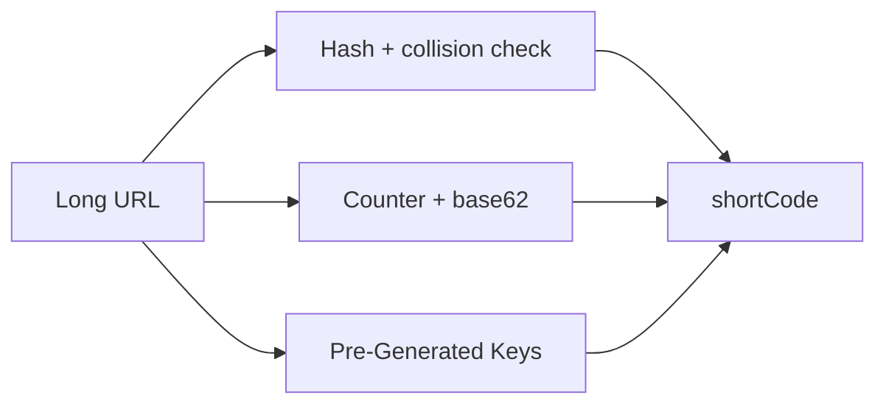
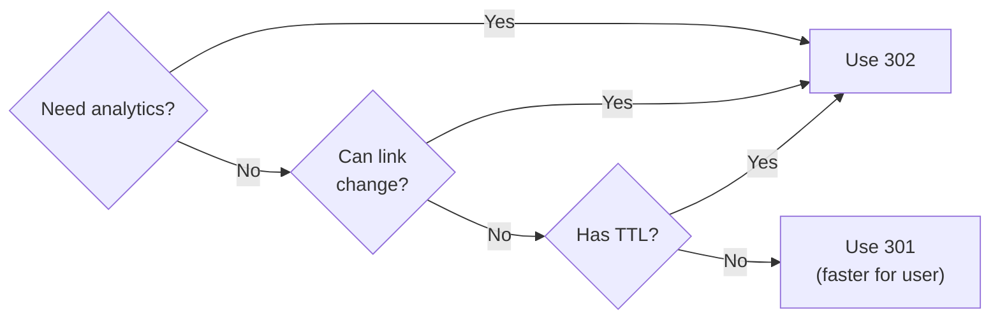
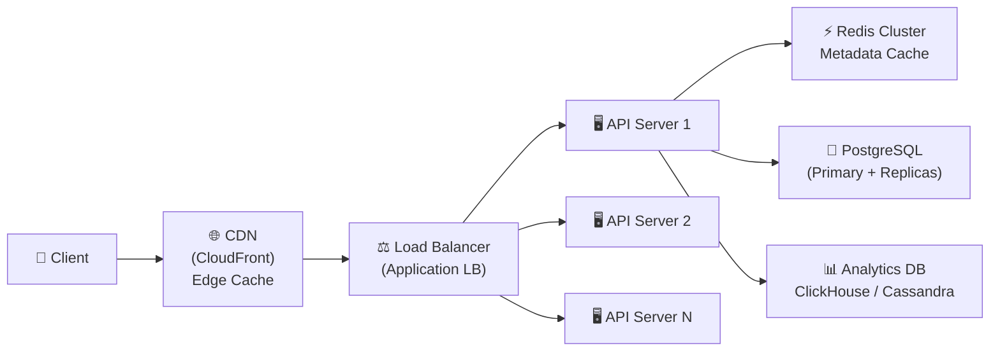
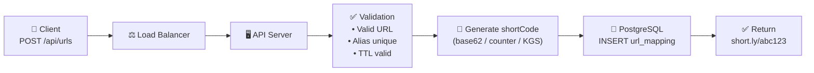
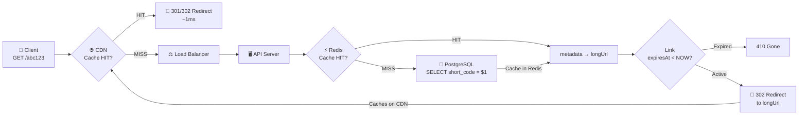

# Level 8: Designing a URL Shortener -- From Requirements to Architecture

## Introduction

Imagine a coat check at a grand theater. You arrive with a coat, hand it in at the window, and get a small numbered token -- `#347`. All evening, this token stays in your pocket. When you need to leave, you return to the window, present the token, and the attendant instantly finds exactly your coat.

A URL Shortener works on exactly the same principle. You "hand in" a long URL:

```
https://www.example.com/products/category/electronics/phones/apple-iphone-15-pro-max-256gb-natural-titanium?utm_source=google&utm_medium=cpc&utm_campaign=q4-promo
```

And receive a concise "token": `short.ly/k7xP2qR`. By this token, the system instantly finds and returns the original URL. The attendant is a database plus cache. The check counter is the API server.

Why is URL Shortener the first system design task? Because it's deceptively simple on the surface, but forces decisions on every key aspect: storage, unique generation algorithms, caching, scaling, analytics. It's a compact but complete model of a distributed system.

At this level we'll go the full path of a system designer: from the question "what needs to be built?" to the answer "here's an architecture that will handle billions of requests."

---

## 1. Step 1: Requirements -- Asking the Right Questions

An experienced system designer starts not with code or diagrams -- but with questions. In an interview, you're deliberately given a vague task: "Design a URL Shortener." This tests your ability to clarify requirements, not just write code.

### Functional Requirements -- What the System Must Do

Functional requirements describe specific actions a user takes through the system. For URL Shortener, they can be divided into mandatory (core) and optional (nice-to-have):

**Mandatory:**
1. User submits a long URL → system returns a short link like `short.ly/abc123`
2. User follows the short link → system redirects to the original URL

**Optional (clarify in interview):**
3. Custom alias -- user chooses their own short code: `short.ly/my-promo`
4. TTL (Time-to-Live) -- link with limited lifetime: expires after 7 days
5. Analytics -- how many clicks, from which countries, from which devices

If you receive a task in an interview, immediately ask about points 3-5. Their presence or absence radically changes the design.

### Non-Functional Requirements -- How the System Must Work

Non-functional requirements define the quality of system operation. Not "what it does" but "how well it does it":

| Requirement | Target Value | Why Important |
|------------|-----------------|--------------|
| Availability | 99.9%+ (< 8.7 hours downtime/year) | Short links are used in ad campaigns -- downtime = lost money |
| Redirect latency | < 100ms | User shouldn't feel the "jump" through the service |
| Throughput | 10K+ redirects/sec | Viral links can create huge spikes |
| Data scale | 100M+ links | System must work for years without architectural revision |
| Read:Write ratio | ~100:1 | Much more reading than writing -- architecture must optimize for reads |

The 100:1 ratio (read-heavy) is a key architectural observation. It means you should optimize the read path (redirect) first, not the write path (link creation).

### Questions to Clarify in Interview

```
Questions a good designer asks:
- Is analytics needed? If yes -- how precise?
- Is custom alias needed?
- What's the link retention period? (forever? 5 years?)
- Are user accounts needed?
- Does the system work globally or in one country?
- Are there limits on links per user?
```

---

## 2. Step 2: Capacity Estimation -- Back-of-the-Envelope Math

Capacity Estimation is a mandatory part of system design. This isn't a precise calculation but an order-of-magnitude estimate that helps make the right architectural decisions. Without it, you don't know whether you need one server or a thousand.

### Starting Assumptions

Agree on baseline numbers -- you get these from the interviewer or justify them yourself:

```typescript
// === Starting data (agree with interviewer) ===
const newUrlsPerDay = 1_000_000        // 1M new links/day
const readWriteRatio = 100             // 100 reads per 1 write
const readsPerDay = newUrlsPerDay * readWriteRatio  // 100M redirects/day
const yearsToStore = 5                 // store links for 5 years
```

### QPS -- Queries Per Second

QPS determines how many servers are needed:

```typescript
const secondsPerDay = 86_400           // 24 * 60 * 60

// Writes (creating new links)
const writeQPS = newUrlsPerDay / secondsPerDay   // ≈ 12 writes/sec
// Reads (redirects)
const readQPS = writeQPS * readWriteRatio         // ≈ 1,200 reads/sec
// Peak load -- usually 3x average
const peakReadQPS = readQPS * 3                   // ≈ 3,600 reads/sec
```

12 writes per second -- modest. 3,600 redirects per second -- already serious. An average server handles ~5,000-10,000 HTTP requests per second, but accounting for DB delays -- significantly less. We need horizontal scaling and cache.

### Storage -- How Much Disk Space

```typescript
// === Storage ===
const totalUrls = newUrlsPerDay * 365 * yearsToStore  // ≈ 1.825 billion URLs

// Average size of one record:
// shortCode: 7 bytes
// longUrl: ~200 bytes (average URL length)
// metadata (userId, createdAt, expiresAt, clickCount): ~100 bytes
const avgRecordSize = 500              // bytes (with margin)

const totalStorageBytes = totalUrls * avgRecordSize   // ≈ 912 GB
const totalStorageGB = totalStorageBytes / 1e9        // ≈ 912 GB over 5 years
```

~1 terabyte over 5 years -- quite manageable for a single DB server by volume. But with 1.8 billion rows, you need to think about sharding for query speed, not just for storage.

### Bandwidth -- How Much Traffic

```typescript
// === Bandwidth ===
// Incoming (link creation): negligible
const incomingBandwidth = writeQPS * avgRecordSize   // ≈ 6 KB/sec

// Outgoing (redirects -- return long URL in Location header)
// Location header ≈ 200 bytes, plus HTTP overhead
const responseSize = 500               // bytes per redirect response
const outgoingBandwidth = readQPS * responseSize      // ≈ 600 KB/sec ≈ 5 Gbps/day
```

### Summary Estimation Table

| Metric | Value | What It Means |
|---------|---------|-----------------|
| Write QPS | ~12/sec | One API server handles it |
| Read QPS (average) | ~1,200/sec | Need cache (Redis) in front of DB |
| Read QPS (peak) | ~3,600/sec | Need 2-3 API servers |
| Storage over 5 years | ~1 TB | One DB server by volume, but shard for speed |
| Unique links | ~1.8 billion | Need at least 7 characters in base62 |

The last figure -- 1.8 billion -- determines the length of our short code. Let's explore why.

---

## 3. Step 3: Short Link Generation Algorithm

This is the heart of the entire system -- and the main architectural decision. We need to turn a long URL into a short, unique, unpredictable code. Sounds simple, but the devil is in the details.

### Base62 Encoding -- Mathematical Foundation

Why base62, not base16 (hex) or base10 (numbers)?

- **base10** (`0-9`): 10 symbols → `10^7 = 10 million` combinations in 7 characters -- too few
- **base16** (`0-9, a-f`): 16 symbols → `16^7 ≈ 268 million` -- better, but still too few
- **base62** (`0-9, a-z, A-Z`): 62 symbols → `62^7 ≈ 3.5 trillion` -- ideal

```typescript
const CHARSET = 'abcdefghijklmnopqrstuvwxyzABCDEFGHIJKLMNOPQRSTUVWXYZ0123456789'
// Indexes: a=0, b=1, ..., z=25, A=26, ..., Z=51, 0=52, ..., 9=61

function encodeBase62(num: number): string {
  if (num === 0) return CHARSET[0]  // edge case: 0 → 'a'
  let result = ''
  while (num > 0) {
    result = CHARSET[num % 62] + result  // take remainder as symbol
    num = Math.floor(num / 62)           // reduce number
  }
  return result
}

function decodeBase62(str: string): number {
  let num = 0
  for (const char of str) {
    num = num * 62 + CHARSET.indexOf(char)
  }
  return num
}

// Check capacity:
// 62^7 = 3,521,614,606,208 ≈ 3.5 trillion unique codes
// At 1M new links/day this lasts 3.5 million years
console.log(encodeBase62(1))            // → 'b'
console.log(encodeBase62(62))           // → 'ba'
console.log(encodeBase62(1_000_000))    // → 'eUNE'
console.log(encodeBase62(56800235583))  // → 'zzzzzz' (max 6 characters)
console.log(encodeBase62(56800235584))  // → 'baaaaaa' (first 7-character)
```

### Why Exactly 7 Characters?

Mathematics explains the code length choice:

| Length | Combinations | Lasts at 1M links/day for... |
|-------|-----------|--------------------------------|
| 5 characters | 916 million | ~2.5 years |
| 6 characters | 56.8 billion | ~155 years |
| 7 characters | 3.5 trillion | ~9,600 years |
| 8 characters | 218 trillion | overkill |

7 characters -- the gold standard: short enough for URLs, long enough for practical uniqueness.

### Three Generation Strategies

There are three fundamentally different approaches. Each has its own trade-offs:



#### Strategy 1: Hash + Collision Check

Idea: take a hash of the URL, convert to base62, check uniqueness.

```typescript
import crypto from 'crypto'

async function createShortUrl_Hash(longUrl: string): Promise<string> {
  // Step 1: MD5 hash gives us a 128-bit number (32 hex characters)
  const hash = crypto.createHash('md5').update(longUrl).digest('hex')
  // Step 2: take first 12 hex characters → number up to 2^48 ≈ 281 trillion
  const numericHash = parseInt(hash.substring(0, 12), 16)
  // Step 3: encode to base62 and take first 7 characters
  let shortCode = encodeBase62(numericHash).substring(0, 7)

  // Step 4: check collision (Birthday Paradox!)
  let attempts = 0
  while (await db.exists(shortCode)) {
    attempts++
    // Add attempt counter as salt and rehash
    const salted = longUrl + ':' + attempts
    const newHash = crypto.createHash('md5').update(salted).digest('hex')
    shortCode = encodeBase62(parseInt(newHash.substring(0, 12), 16)).substring(0, 7)
  }

  await db.save({ shortCode, longUrl, createdAt: new Date() })
  return shortCode
}
```

**Birthday Paradox problem:** with 1.8 billion links, the collision probability for a 7-character code reaches ~26%. Not a catastrophe (the while loop handles it), but each collision is an extra round-trip to the DB. Under high load, this is noticeable.

**When to use:** for smaller systems (up to ~100M links), when one URL should always give the same short code (determinism).

#### Strategy 2: Counter-Based (Snowflake-like)

Idea: use an atomically incrementing counter as a unique numeric ID, encode it to base62.

```typescript
// Redis INCR guarantees atomicity -- even with 1000 simultaneous requests
// each gets a unique number
async function createShortUrl_Counter(longUrl: string): Promise<string> {
  // Atomically increment global counter
  const nextId = await redis.incr('url:global_counter')
  // base62 encode + pad to 7 characters (first codes will be shorter)
  const shortCode = encodeBase62(nextId).padStart(7, 'a')

  await db.save({ shortCode, longUrl, createdAt: new Date() })
  return shortCode
}
```

**Predictability problem:** codes go sequentially: `aaaaaab`, `aaaaaac`, `aaaaaad`... An attacker can enumerate all links to find private URLs. Solution -- add a random offset or XOR-mask the number before encoding.

**SPOF (Single Point of Failure) problem:** Redis with counter is a single point of failure. Solution -- Redis Sentinel or Cluster, or distributed ranges (see below).

**Scaling for multiple servers:**

```typescript
// Each API server pre-reserves an ID range from ZooKeeper
// When range runs out -- requests the next one
class CounterService {
  private rangeStart: number = 0
  private rangeEnd: number = 0
  private rangeSize = 1_000_000  // reserve 1M IDs at a time

  async getNextId(): Promise<number> {
    if (this.rangeStart >= this.rangeEnd) {
      // Request new range from ZooKeeper / Redis
      // Server 1: [1, 1,000,000], Server 2: [1,000,001, 2,000,000], ...
      const range = await zookeeper.reserveRange(this.rangeSize)
      this.rangeStart = range.start
      this.rangeEnd = range.end
    }
    return this.rangeStart++
  }
}
```

**When to use:** high-performance systems, when predictability isn't critical or masking is applied.

#### Strategy 3: Pre-Generated Keys (KGS)

Idea: a dedicated Key Generation Service (KGS) pre-generates millions of unique codes and stores them in two tables: `unused_keys` and `used_keys`. API servers simply take ready keys from the pool.

```typescript
// KGS runs in background and replenishes the key pool
class KeyGenerationService {
  // Preload keys into memory on server start
  private inMemoryKeys: string[] = []
  private readonly LOAD_THRESHOLD = 1000   // replenish when < 1000 keys
  private readonly BATCH_SIZE = 10_000     // load 10K at a time

  async getKey(): Promise<string> {
    if (this.inMemoryKeys.length < this.LOAD_THRESHOLD) {
      // Asynchronously replenish pool -- don't block main thread
      this.loadKeysFromDb().catch(console.error)
    }

    if (this.inMemoryKeys.length === 0) {
      throw new Error('Key pool exhausted -- try again')
    }

    return this.inMemoryKeys.pop()!
  }

  private async loadKeysFromDb(): Promise<void> {
    // Atomically move keys from unused → used
    const keys = await db.transaction(async (tx) => {
      const rows = await tx.query(
        'SELECT key FROM unused_keys LIMIT $1 FOR UPDATE SKIP LOCKED',
        [this.BATCH_SIZE]
      )
      const keyValues = rows.map(r => r.key)
      if (keyValues.length > 0) {
        await tx.query('DELETE FROM unused_keys WHERE key = ANY($1)', [keyValues])
        await tx.query('INSERT INTO used_keys SELECT unnest($1::text[])', [keyValues])
      }
      return keyValues
    })
    this.inMemoryKeys.push(...keys)
  }
}

// API server simply takes a ready key:
async function createShortUrl_Pregenerated(longUrl: string): Promise<string> {
  const shortCode = await kgs.getKey()  // O(1), no collisions, no locks
  await db.save({ shortCode, longUrl, createdAt: new Date() })
  return shortCode
}
```

**Gotcha:** if KGS stores keys in memory and restarts -- keys are lost (they've already been moved to `used_keys`, but not used). This is acceptable: losing 10K keys out of 3.5 trillion is negligible.

**When to use:** high-load production systems, when predictable performance is needed without counter contention.

### Three Strategies Comparison

| Criterion | Hash + Collision | Counter-Based | Pre-Generated |
|----------|-----------------|---------------|---------------|
| Implementation complexity | Medium | Low | High |
| Performance | Unpredictable (collisions) | High | Highest |
| Uniqueness | Guaranteed (with retry) | Guaranteed | Guaranteed |
| Code predictability | Random | Sequential ⚠️ | Random |
| SPOF | DB (check) | Redis/ZooKeeper | KGS |
| Same URL = same code | Yes | No | No |

---

## 4. Step 4: HTTP Redirection -- 301 vs 302

When a user follows `short.ly/abc123`, the server must return an HTTP redirect. But there are two options, and the choice between them has far-reaching consequences.

### What Happens During Redirect

The browser sends a GET request to `short.ly/abc123`. The server responds with a 3xx code and a `Location: https://original-url.com/...` header. The browser automatically follows the new address. For the user, this looks like an instant jump, though in reality two HTTP requests occurred.

```typescript
// Redirect handler
app.get('/:shortCode', async (req, res) => {
  const { shortCode } = req.params

  // Validate format (only base62 characters, length 7)
  if (!/^[a-zA-Z0-9]{7}$/.test(shortCode)) {
    return res.status(400).send('Invalid short code format')
  }

  const record = await getUrl(shortCode)
  if (!record) return res.status(404).send('URL not found')

  // Check TTL if link has limited lifetime
  if (record.expiresAt && record.expiresAt < new Date()) {
    return res.status(410).send('URL has expired')  // 410 Gone -- semantically more accurate than 404
  }

  // Record click asynchronously -- don't block redirect even for a millisecond
  trackClick(record.shortCode, req).catch(console.error)

  // Key decision: 301 or 302?
  res.redirect(302, record.longUrl)
})
```

### 301 Permanent Redirect

Code 301 tells the browser: "This resource moved permanently. Remember the new address and don't ask me again."

After the first redirect, the browser **caches** the mapping `short.ly/abc123 → https://original.com`. All subsequent clicks on the same link from that browser bypass your server entirely. The browser goes directly to the original URL.

```
First click:
Browser → short.ly/abc123 → Server → 301 Location: https://original.com
Browser → https://original.com ✅

All subsequent clicks (from browser cache):
Browser → https://original.com  (short.ly server not involved!)
```

**Pro:** reduces server load and decreases latency for repeat clicks.
**Con:** analytics are broken. You see only the first click. The rest bypass your server.

### 302 Temporary Redirect

Code 302 tells the browser: "Go there now, but ask me again next time."

The browser **doesn't cache** the mapping. On each click, it sends a request to `short.ly/abc123`. This allows:
- Count every click accurately
- Change the link destination (A/B test: 50% of users see version A, 50% see version B)
- Work with TTL (link may expire between clicks)

```
Every click:
Browser → short.ly/abc123 → Server → 302 Location: https://original.com
Browser → https://original.com
```

**Pro:** full analytics, flexibility.
**Con:** additional latency on every redirect (server call + cache lookup).

### Choice by Context



Bitly and TinyURL historically used 301 for maximum speed. Modern services with analytics (rebrandly, short.io) use 302 by default.

---

## 5. Step 5: API Design -- System Interface

A well-designed API should be intuitive, versioned, and handle errors consistently.

### Main Endpoints

```typescript
// REST API for URL Shortener

// --- Create short link ---
// POST /api/v1/urls
// Request Body:
interface CreateUrlRequest {
  longUrl: string      // required, valid URL
  customAlias?: string // optional, user-defined code
  expiresAt?: Date     // optional, expiration time
}

// Response 201 Created:
interface CreateUrlResponse {
  shortUrl: string     // full URL: "https://short.ly/abc123"
  shortCode: string    // code only: "abc123"
  longUrl: string      // original URL
  createdAt: Date
  expiresAt?: Date
}

// --- Redirect (public endpoint) ---
// GET /:shortCode → 302/301 redirect

// --- Get link info ---
// GET /api/v1/urls/:shortCode
// Response 200:
interface UrlInfoResponse extends CreateUrlResponse {
  clickCount: number
  lastClickedAt?: Date
}

// --- Delete link ---
// DELETE /api/v1/urls/:shortCode → 204 No Content

// --- Analytics ---
// GET /api/v1/urls/:shortCode/analytics?period=7d
interface AnalyticsResponse {
  shortCode: string
  totalClicks: number
  clicksByDay: { date: string; count: number }[]
  topCountries: { country: string; count: number }[]
  topDevices: { device: string; count: number }[]
}
```

### Input Validation

```typescript
import { z } from 'zod'  // or any other validation library

const CreateUrlSchema = z.object({
  longUrl: z.string()
    .url('Must be a valid URL')
    .max(2048, 'URL too long'),  // Browsers limit URLs to ~2048 chars

  customAlias: z.string()
    .regex(/^[a-zA-Z0-9-_]{3,20}$/, 'Alias must be 3-20 alphanumeric chars')
    .optional(),

  expiresAt: z.date()
    .min(new Date(), 'Expiry date must be in the future')
    .optional(),
})

// Validation middleware
const validateCreateUrl = (req: Request, res: Response, next: NextFunction) => {
  const result = CreateUrlSchema.safeParse(req.body)
  if (!result.success) {
    return res.status(400).json({ error: result.error.flatten() })
  }
  req.body = result.data
  next()
}
```

### Rate Limiting

Without rate limiting, one aggressive client can exhaust the key pool or overload the DB:

```typescript
// Limits by operation type:
// - Link creation: 10/min for anonymous, 100/min for authenticated
// - Redirect: 10000/min (practically unlimited)
// - Analytics: 60/min

const rateLimits = {
  createUrl: { anonymous: 10, authenticated: 100 },  // per minute
  redirect: { anonymous: 10_000 },                    // per minute
  analytics: { authenticated: 60 },                   // per minute
}
```

---

## 6. Step 6: Data Model -- Database Schema

The right data model is half the system's success. A poorly designed schema leads to slow queries, complex migrations, and errors under load.

### Main Tables

```typescript
// Main mapping table
interface UrlMapping {
  shortCode: string     // PRIMARY KEY, VARCHAR(7), B-tree index
  longUrl: string       // TEXT (up to 2048 characters)
  userId?: string       // FOREIGN KEY → users.id, nullable (anonymous users)
  createdAt: Date       // TIMESTAMP WITH TIME ZONE, DEFAULT NOW()
  expiresAt?: Date      // TIMESTAMP WITH TIME ZONE, nullable (NULL = permanent)
  clickCount: number    // BIGINT DEFAULT 0 (denormalized counter for fast reads)
  isActive: boolean     // DEFAULT TRUE (soft delete)
}

// Analytics table (separate from main!)
interface ClickEvent {
  id: string            // UUID PRIMARY KEY (or BIGSERIAL for smaller size)
  shortCode: string     // FOREIGN KEY → url_mappings.short_code
  clickedAt: Date       // TIMESTAMP WITH TIME ZONE
  ipAddress: string     // VARCHAR(45) -- enough for IPv6
  userAgent: string     // TEXT
  referer?: string      // TEXT, nullable (Referer header)
  country?: string      // VARCHAR(2) -- ISO country code (determined by IP)
  device?: string       // VARCHAR(20) -- mobile/tablet/desktop
}
```

### SQL Schema with Indexes

```sql
-- Main table
CREATE TABLE url_mappings (
  short_code  VARCHAR(7)   PRIMARY KEY,
  long_url    TEXT         NOT NULL,
  user_id     UUID         REFERENCES users(id) ON DELETE SET NULL,
  created_at  TIMESTAMPTZ  NOT NULL DEFAULT NOW(),
  expires_at  TIMESTAMPTZ,
  click_count BIGINT       NOT NULL DEFAULT 0,
  is_active   BOOLEAN      NOT NULL DEFAULT TRUE
);

-- Index for TTL checks (only for rows with expires_at)
-- Partial index saves space -- doesn't index permanent links
CREATE INDEX idx_url_mappings_expires
  ON url_mappings(expires_at)
  WHERE expires_at IS NOT NULL;

-- Index for "all links for a user" queries
CREATE INDEX idx_url_mappings_user_id ON url_mappings(user_id);

-- Click events table (high write frequency)
CREATE TABLE click_events (
  id          BIGSERIAL    PRIMARY KEY,
  short_code  VARCHAR(7)   NOT NULL REFERENCES url_mappings(short_code),
  clicked_at  TIMESTAMPTZ  NOT NULL DEFAULT NOW(),
  ip_address  VARCHAR(45),
  user_agent  TEXT,
  referer     TEXT,
  country     VARCHAR(2),
  device      VARCHAR(20)
);

-- Index for analytics queries by link and time
CREATE INDEX idx_click_events_short_code_time
  ON click_events(short_code, clicked_at DESC);

-- Partition click_events by month (for large volumes)
-- CREATE TABLE click_events_2024_01 PARTITION OF click_events
--   FOR VALUES FROM ('2024-01-01') TO ('2024-02-01');
```

### Database Choice

For the main `url_mappings` table, both SQL and NoSQL work:

| Database | Pros | Cons | When to Choose |
|-------------|-------|--------|----------------|
| PostgreSQL | ACID, rich queries, reliability | Harder to shard | If analytics or complex JOINs needed |
| MySQL | Widely used, good replication | Fewer features than PostgreSQL | If team expertise exists |
| DynamoDB | Managed, auto-scaling | Limited query flexibility | If using AWS ecosystem |
| MongoDB | Flexible schema | No ACID, limited JOINs | If document model preferred |

For `click_events` (massive write volume):

| Database | Pros | Cons |
|-------------|-------|--------|
| **Cassandra** | Write-optimized, horizontal scaling | Eventual consistency (acceptable for analytics) |
| **ClickHouse** | Column-oriented, fast aggregations | Less flexible for point queries |
| **PostgreSQL (partitioned)** | ACID, familiar | Needs manual partitioning management |

---

## 7. System Architecture

### Complete Architecture



Architectural principles:

- **Stateless API** -- any server can handle any request, horizontal scaling without coordination
- **Read replicas** -- PostgreSQL Primary accepts writes, Replicas serve reads (write:read = 1:100)
- **Redis Cluster** -- cache for hot links, reduces load on PostgreSQL
- **CDN** -- caches redirect responses for popular links
- **Separate analytics DB** -- click events written to a column-oriented DB optimized for aggregations

### Write Path



### Read Path (Redirect)



Crucially important: **most requests end at the CDN**. If a link is popular and public, the CDN serves it from the nearest edge server in 1-5ms. Only the following reach the API Server:
- First request to a link (CDN MISS)
- Requests for private links (CDN doesn't cache)
- Requests after cache invalidation

```typescript
async function redirect(shortCode: string): Promise<Response | null> {
  // Step 1: Check Redis (metadata, ~1ms)
  const cached = await redis.get(`url:${shortCode}`)
  let metadata: UrlMapping

  if (cached) {
    metadata = JSON.parse(cached)
  } else {
    // Step 2: Read from PostgreSQL (~5ms)
    const row = await db.queryOne(
      'SELECT * FROM url_mappings WHERE short_code = $1 AND is_active = true',
      [shortCode]
    )
    if (!row) return null

    metadata = row
    // Cache metadata in Redis for 5 minutes
    await redis.setex(`url:${shortCode}`, 300, JSON.stringify(metadata))
  }

  // Step 3: Check TTL (lazy expiration)
  if (metadata.expiresAt && metadata.expiresAt < new Date()) {
    // Link expired, queue for cleanup
    await cleanupQueue.add({ shortCode })
    return null  // API returns 410 Gone
  }

  return metadata.longUrl
}
```

---

## 8. Scaling the System

### When One Server Isn't Enough

With our estimates (3,600 reads/sec peak, 12 writes/sec), a single PostgreSQL server handles it easily. But as the system grows:

**Phase 1: Add Redis cache**
- Hot links cached in Redis, reducing DB load
- Hit ratio target: > 95% for redirects

**Phase 2: Add read replicas**
- PostgreSQL Primary handles writes (12/sec -- easy)
- 2-3 Replicas handle reads (3,600/sec peak -- distributed)

**Phase 3: Shard by shortCode**
- When 1.8 billion rows slow down queries
- Hash-based sharding: `shard = hash(shortCode) % N`
- Each shard handles its own range of short codes

**Phase 4: Separate analytics**
- Move `click_events` to ClickHouse or Cassandra
- Main PostgreSQL focuses on fast redirect lookups

### Celebrity Link Problem

A viral link (e.g., a celebrity's short link) can receive 50% of all traffic. Solutions:

1. **Per-link caching in Redis** -- hot link served from memory, not DB
2. **CDN caching** -- if using 301, browser caches; with 302, CDN caches for short TTL
3. **Dedicated redirect server** -- minimal code, maximum throughput for redirect-only traffic

---

## 9. Common Mistakes

### Mistake 1: Storing Long URLs in the Redirect Path

```typescript
// ❌ Encoding entire URL in the short code
const shortCode = base64Encode(longUrl)  // Results in long "short" codes
// Defeats the purpose of shortening
```

**Why wrong:** the entire point is a short code pointing to a stored long URL. Encoding the URL in the code itself makes codes as long as the originals.

```typescript
// ✅ Store in DB, generate short code
const shortCode = generateUniqueCode()  // 7 chars
await db.save({ shortCode, longUrl })
```

### Mistake 2: Synchronous Analytics on Redirect Path

```typescript
// ❌ Counting click BEFORE redirect -- adds latency
app.get('/:shortCode', async (req, res) => {
  const url = await getUrl(req.params.shortCode)
  await db.query('INSERT INTO clicks ...')  // 5-10ms delay before redirect!
  res.redirect(url.longUrl)
})
```

**Why wrong:** every millisecond of redirect delay is noticeable to the user. Analytics should never block the redirect.

```typescript
// ✅ Async analytics -- don't block redirect
app.get('/:shortCode', async (req, res) => {
  const url = await getUrl(req.params.shortCode)
  // Fire and forget -- log to Kafka/Redis, process asynchronously
  trackClickAsync(req.params.shortCode, req).catch(console.error)
  res.redirect(url.longUrl)
})
```

### Mistake 3: Not Handling the Birthday Paradox

```typescript
// ❌ No collision check -- assumes 7 chars always unique
const shortCode = encodeBase62(Math.random() * 62 ** 7).substring(0, 7)
// At 1.8B links, collision probability ≈ 26%
```

**Why wrong:** the Birthday Paradox means collisions become likely much sooner than intuition suggests. Always check for collisions.

```typescript
// ✅ Check and retry on collision
let shortCode: string
do {
  shortCode = generateCode()
} while (await db.exists(shortCode))  // Retry with new code
```

### Mistake 4: Using 301 When Analytics Are Needed

Using 301 (permanent redirect) when you need to count clicks -- the browser caches the redirect and subsequent clicks bypass your server entirely.

**Rule:** if analytics matter → use 302. If speed matters more → use 301.

### Mistake 5: No Rate Limiting on Link Creation

Without rate limiting, one client can create millions of links, exhausting the code space or overloading the DB.

```typescript
// Apply rate limiting:
// - Anonymous: 10 links/minute
// - Authenticated: 100 links/minute
// - Redirect: practically unlimited (CDN handles most)
```

---

## Summary

| Aspect | Key Decision |
|--------|-------------|
| **Short code generation** | Counter + base62 (simplest) or Pre-Generated Keys (highest performance) |
| **Code length** | 7 characters in base62 = 3.5 trillion combinations |
| **Redirect type** | 302 if analytics needed, 301 if speed matters |
| **Database** | PostgreSQL for mappings, ClickHouse/Cassandra for click events |
| **Caching** | Redis for hot links, CDN for popular redirects |
| **Scaling** | Read replicas → sharding by shortCode → separate analytics DB |
| **Rate limiting** | Essential for creation, optional for redirects |

**Main principle:** the read path (redirect) must be as fast as possible -- it's 100x more frequent than writes. Optimize everything for the redirect: cache aggressively, use CDN, keep the redirect handler minimal.
