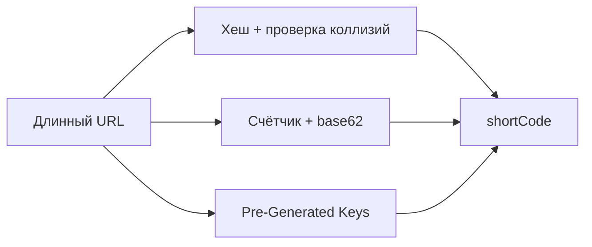
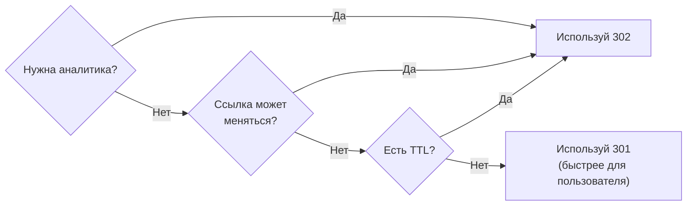
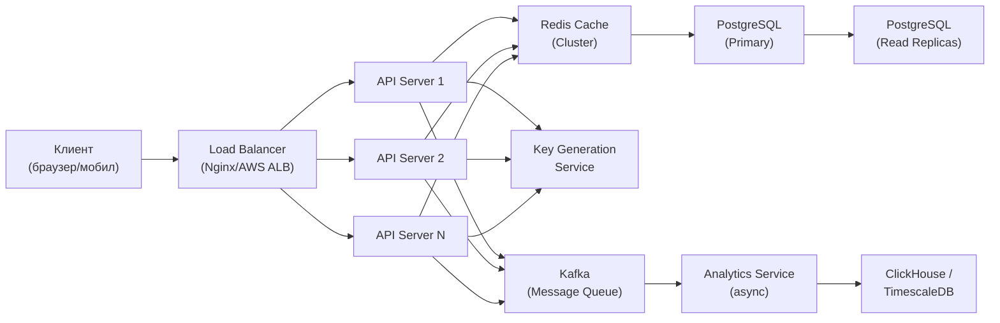
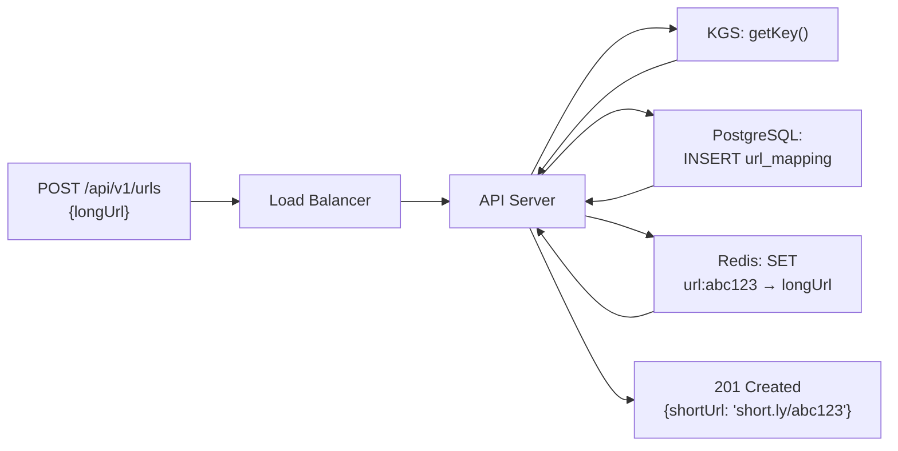
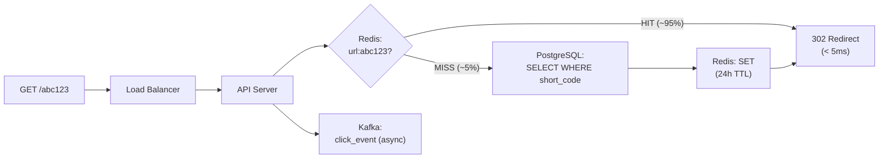

# Уровень 8: Проектируем URL Shortener -- от требований до архитектуры

## Введение

Представьте городской гардероб в большом театре. Вы приходите в пальто, сдаёте его в окошко, получаете маленький пронумерованный жетон -- `#347`. Весь вечер этот жетон лежит у вас в кармане. Когда нужно уйти, вы снова подходите к окошку, протягиваете жетон, и гардеробщик мгновенно находит именно ваше пальто.

URL Shortener -- это ровно тот же принцип. Вы «сдаёте» длинный URL:

```
https://www.example.com/products/category/electronics/phones/apple-iphone-15-pro-max-256gb-natural-titanium?utm_source=google&utm_medium=cpc&utm_campaign=q4-promo
```

Получаете лаконичный «жетон»: `short.ly/k7xP2qR`. По этому жетону система мгновенно найдёт и вернёт оригинальный URL. Гардеробщик -- это база данных плюс кэш. Стойка гардероба -- это API-сервер.

Почему именно URL Shortener -- первая задача по проектированию системы? Потому что она обманчиво проста на поверхности, но заставляет принять решения по каждому из ключевых аспектов: хранение, алгоритмы уникальной генерации, кэширование, масштабирование, аналитика. Это компактная, но полная модель распределённой системы.

На этом уровне мы пройдём весь путь системного дизайнера: от вопроса "что нужно сделать?" до ответа "вот архитектура, которая выдержит миллиарды запросов".

---

## 1. Шаг 1: Требования -- задаём правильные вопросы

Опытный системный дизайнер начинает не с кода и не с диаграмм -- с вопросов. На интервью вас намеренно дают размытую задачу: «Спроектируй URL Shortener». Это проверка умения уточнять требования, а не просто писать код.

### Functional Requirements -- что система должна делать

Функциональные требования описывают конкретные действия, которые пользователь совершает через систему. Для URL Shortener их можно разделить на обязательные (core) и опциональные (nice-to-have):

**Обязательные:**
1. Пользователь подаёт длинный URL → система возвращает короткую ссылку вида `short.ly/abc123`
2. Пользователь переходит по короткой ссылке → система перенаправляет на оригинальный URL

**Опциональные (уточняйте на интервью):**
3. Custom alias -- пользователь сам выбирает короткий код: `short.ly/my-promo`
4. TTL (Time-to-Live) -- ссылка с ограниченным сроком жизни: истекает через 7 дней
5. Аналитика -- сколько раз нажали, из каких стран, с каких устройств

📌 Если вы получаете задачу на интервью, немедленно спрашивайте про пункты 3-5. Их наличие или отсутствие кардинально меняет дизайн.

### Non-Functional Requirements -- как система должна работать

Нефункциональные требования определяют качество работы системы. Это не "что она делает", а "как хорошо она это делает":

| Требование | Целевое значение | Почему важно |
|------------|-----------------|--------------|
| Доступность | 99.9%+ (< 8.7 часов простоя в год) | Короткие ссылки используются в рекламных кампаниях -- простой = потеря денег |
| Задержка redirect | < 100 мс | Пользователь не должен ощущать "прыжок" через сервис |
| Пропускная способность | 10K+ redirects/сек | Вирусные ссылки могут давать огромные всплески |
| Масштаб данных | 100M+ ссылок | Система должна работать годами без пересмотра архитектуры |
| Read:Write соотношение | ~100:1 | Чтений намного больше записей -- архитектура должна это учитывать |

💡 Соотношение 100:1 (read-heavy) -- ключевое архитектурное наблюдение. Оно означает, что оптимизировать нужно прежде всего путь чтения (redirect), а не запись (создание ссылки).

### Что уточнить на интервью

```
Вопросы, которые задаёт хороший дизайнер:
- Нужна ли аналитика? Если да -- насколько точная?
- Нужен ли custom alias?
- Какой срок хранения ссылок? (вечно? 5 лет?)
- Нужны ли пользовательские аккаунты?
- Работает ли система глобально или в одной стране?
- Есть ли ограничения на количество ссылок для одного пользователя?
```

---

## 2. Шаг 2: Оценка нагрузки -- считаем "на салфетке"

Capacity Estimation (оценка ёмкости) -- обязательная часть системного дизайна. Это не точный расчёт, а порядковая оценка, которая помогает принять правильные архитектурные решения. Без неё вы не знаете, нужен ли вам один сервер или тысяча.

### Исходные предположения

Договоримся об отправных числах -- их вы получаете от интервьюера или обосновываете самостоятельно:

```typescript
// === Исходные данные (договариваемся с интервьюером) ===
const newUrlsPerDay = 1_000_000        // 1M новых ссылок/день
const readWriteRatio = 100             // 100 чтений на 1 запись
const readsPerDay = newUrlsPerDay * readWriteRatio  // 100M redirect/день
const yearsToStore = 5                 // храним ссылки 5 лет
```

### QPS -- сколько запросов в секунду

QPS (Queries Per Second) определяет, сколько серверов нужно:

```typescript
const secondsPerDay = 86_400           // 24 * 60 * 60

// Записи (создание новых ссылок)
const writeQPS = newUrlsPerDay / secondsPerDay   // ≈ 12 writes/sec
// Чтения (redirects)
const readQPS = writeQPS * readWriteRatio         // ≈ 1200 reads/sec
// Пиковая нагрузка -- обычно в 3x от среднего
const peakReadQPS = readQPS * 3                   // ≈ 3600 reads/sec
```

12 записей в секунду -- скромно. 3600 redirects в секунду -- уже серьёзно. Один среднестатистический сервер справляется с ~5000-10000 HTTP-запросов в секунду, но с учётом задержек БД -- значительно меньше. Нам нужны горизонтальное масштабирование и кэш.

### Storage -- сколько места на диске

```typescript
// === Storage ===
const totalUrls = newUrlsPerDay * 365 * yearsToStore  // ≈ 1.825 млрд URL

// Средний размер одной записи:
// shortCode: 7 bytes
// longUrl: ~200 bytes (средняя длина URL)
// metadata (userId, createdAt, expiresAt, clickCount): ~100 bytes
const avgRecordSize = 500              // bytes (с запасом)

const totalStorageBytes = totalUrls * avgRecordSize   // ≈ 912 GB
const totalStorageGB = totalStorageBytes / 1e9        // ≈ 912 GB за 5 лет
```

📌 ~1 терабайт за 5 лет -- это вполне посильно для одного сервера БД. Но при 1.8 млрд строк нужно думать о шардировании для скорости запросов, а не только для хранения.

### Bandwidth -- сколько трафика

```typescript
// === Bandwidth ===
// Входящий (создание ссылок): незначительный
const incomingBandwidth = writeQPS * avgRecordSize   // ≈ 6 KB/sec

// Исходящий (redirects -- возвращаем long URL в Location-заголовке)
// Location header ≈ 200 bytes, плюс накладные расходы HTTP
const responseSize = 500               // bytes per redirect response
const outgoingBandwidth = readQPS * responseSize      // ≈ 600 KB/sec ≈ 5 Gbps/day
```

### Итоговая таблица оценок

| Метрика | Значение | Что это означает |
|---------|---------|-----------------|
| Write QPS | ~12/сек | Один API-сервер справится |
| Read QPS (среднее) | ~1200/сек | Нужен кэш перед БД |
| Read QPS (пик) | ~3600/сек | Нужно 2-3 API-сервера |
| Хранилище за 5 лет | ~1 TB | Один сервер БД по объёму, но шардировать для скорости |
| Уникальных ссылок | ~1.8 млрд | Нужно минимум 7 символов в base62 |

Именно последняя цифра -- 1.8 миллиарда -- определяет длину нашего короткого кода. Давайте разберёмся почему.

---

## 3. Шаг 3: Алгоритм генерации коротких ссылок

Это сердце всей системы -- и главное архитектурное решение. Нам нужно превратить длинный URL в короткий, уникальный, непредсказуемый код. Звучит просто, но дьявол в деталях.

### Base62 Encoding -- математическая основа

Почему base62, а не base16 (hex) или base10 (числа)?

- **base10** (`0-9`): 10 символов → `10^7 = 10 млн` комбинаций за 7 символов -- мало
- **base16** (`0-9, a-f`): 16 символов → `16^7 ≈ 268 млн` -- уже лучше, но всё равно мало
- **base62** (`0-9, a-z, A-Z`): 62 символа → `62^7 ≈ 3.5 трлн` -- идеально

Алфавит base62 специально исключает визуально похожие символы (`0` и `O`, `1` и `l`) не включён специально, чтобы уменьшить ошибки при ручном вводе. Хотя в большинстве реализаций все 62 символа используются -- короткие ссылки обычно не вводят вручную.

```typescript
const CHARSET = 'abcdefghijklmnopqrstuvwxyzABCDEFGHIJKLMNOPQRSTUVWXYZ0123456789'
// Индексы: a=0, b=1, ..., z=25, A=26, ..., Z=51, 0=52, ..., 9=61

function encodeBase62(num: number): string {
  if (num === 0) return CHARSET[0]  // edge case: 0 → 'a'
  let result = ''
  while (num > 0) {
    result = CHARSET[num % 62] + result  // берём остаток как символ
    num = Math.floor(num / 62)           // уменьшаем число
  }
  return result
}

function decodeBase62(str: string): number {
  let num = 0
  for (const char of str) {
    num = num * 62 + CHARSET.indexOf(char)
  }
  return num
}

// Проверяем вместимость:
// 62^7 = 3,521,614,606,208 ≈ 3.5 трлн уникальных кодов
// При 1M новых ссылок/день это хватит на 3.5 млн лет
console.log(encodeBase62(1))            // → 'b'
console.log(encodeBase62(62))           // → 'ba'
console.log(encodeBase62(1_000_000))    // → 'eUNE'
console.log(encodeBase62(56800235583))  // → 'zzzzzz' (максимум 6 символов)
console.log(encodeBase62(56800235584))  // → 'baaaaaa' (первый 7-символьный)
```

### Почему именно 7 символов?

Математика объясняет выбор длины кода:

| Длина | Комбинаций | Хватит при 1M ссылок/день на... |
|-------|-----------|--------------------------------|
| 5 символов | 916 млн | ~2.5 года |
| 6 символов | 56.8 млрд | ~155 лет |
| 7 символов | 3.5 трлн | ~9600 лет |
| 8 символов | 218 трлн | слишком много |

7 символов -- золотой стандарт: достаточно коротко для URL, достаточно длинно для уникальности на все практические случаи.

### Три стратегии генерации

Существует три принципиально разных подхода. У каждого свои компромиссы:



#### Стратегия 1: Hash + Collision Check

Идея: берём хеш от URL, преобразуем в base62, проверяем уникальность.

```typescript
import crypto from 'crypto'

async function createShortUrl_Hash(longUrl: string): Promise<string> {
  // Шаг 1: MD5-хеш даёт нам 128-битное число (32 hex-символа)
  const hash = crypto.createHash('md5').update(longUrl).digest('hex')
  // Шаг 2: берём первые 12 hex-символов → число до 2^48 ≈ 281 трлн
  const numericHash = parseInt(hash.substring(0, 12), 16)
  // Шаг 3: кодируем в base62 и берём первые 7 символов
  let shortCode = encodeBase62(numericHash).substring(0, 7)

  // Шаг 4: проверяем коллизию (Birthday Paradox!)
  let attempts = 0
  while (await db.exists(shortCode)) {
    attempts++
    // Добавляем счётчик попыток как соль и перехешируем
    const salted = longUrl + ':' + attempts
    const newHash = crypto.createHash('md5').update(salted).digest('hex')
    shortCode = encodeBase62(parseInt(newHash.substring(0, 12), 16)).substring(0, 7)
  }

  await db.save({ shortCode, longUrl, createdAt: new Date() })
  return shortCode
}
```

**Проблема Birthday Paradox:** при 1.8 млрд ссылок вероятность коллизии для 7-символьного кода достигает ~26%. Это не катастрофа (цикл while справляется), но каждая коллизия -- это дополнительный round-trip к БД. При высокой нагрузке это ощутимо.

**Когда применять:** для небольших систем (до ~100M ссылок), когда один URL должен всегда давать один и тот же короткий код (детерминированность).

#### Стратегия 2: Counter-Based (Snowflake-подобный)

Идея: используем атомарно увеличивающийся счётчик как уникальный числовой ID, кодируем его в base62.

```typescript
// Redis INCR гарантирует атомарность -- даже при 1000 одновременных запросов
// каждый получит уникальное число
async function createShortUrl_Counter(longUrl: string): Promise<string> {
  // Атомарно инкрементируем глобальный счётчик
  const nextId = await redis.incr('url:global_counter')
  // base62 encode + padding до 7 символов (первые коды будут короче)
  const shortCode = encodeBase62(nextId).padStart(7, 'a')

  await db.save({ shortCode, longUrl, createdAt: new Date() })
  return shortCode
}
```

**Проблема предсказуемости:** коды идут последовательно: `aaaaaab`, `aaaaaac`, `aaaaaad`... Злоумышленник может перебрать все ссылки, чтобы найти приватные URL. Решение -- добавить случайное смещение или XOR-маскировку числа перед кодированием.

**Проблема SPOF (Single Point of Failure):** Redis со счётчиком -- единственная точка отказа. Решение -- Redis Sentinel или Cluster, либо распределённые диапазоны (см. ниже).

**Масштабирование для нескольких серверов:**

```typescript
// Каждый API-сервер заранее резервирует диапазон ID у ZooKeeper
// Когда диапазон заканчивается -- запрашивает следующий
class CounterService {
  private rangeStart: number = 0
  private rangeEnd: number = 0
  private rangeSize = 1_000_000  // резервируем по 1M ID за раз

  async getNextId(): Promise<number> {
    if (this.rangeStart >= this.rangeEnd) {
      // Запрашиваем новый диапазон у ZooKeeper / Redis
      // Server 1: [1, 1_000_000], Server 2: [1_000_001, 2_000_000], ...
      const range = await zookeeper.reserveRange(this.rangeSize)
      this.rangeStart = range.start
      this.rangeEnd = range.end
    }
    return this.rangeStart++
  }
}
```

**Когда применять:** производительные системы, когда предсказуемость не критична или применяется маскировка.

#### Стратегия 3: Pre-Generated Keys (KGS)

Идея: выделенный Key Generation Service (KGS) заранее генерирует миллионы уникальных кодов и хранит их в двух таблицах: `unused_keys` и `used_keys`. API-серверы просто берут готовые ключи из пула.

```typescript
// KGS работает в фоне и пополняет пул ключей
class KeyGenerationService {
  // Предварительно загружаем ключи в память при старте сервера
  private inMemoryKeys: string[] = []
  private readonly LOAD_THRESHOLD = 1000   // пополняем когда < 1000 ключей
  private readonly BATCH_SIZE = 10_000     // загружаем по 10K за раз

  async getKey(): Promise<string> {
    if (this.inMemoryKeys.length < this.LOAD_THRESHOLD) {
      // Асинхронно пополняем пул -- не блокируем основной поток
      this.loadKeysFromDb().catch(console.error)
    }

    if (this.inMemoryKeys.length === 0) {
      throw new Error('Key pool exhausted -- try again')
    }

    return this.inMemoryKeys.pop()!
  }

  private async loadKeysFromDb(): Promise<void> {
    // Атомарно переносим ключи из unused → used
    const keys = await db.transaction(async (tx) => {
      const rows = await tx.query(
        'SELECT key FROM unused_keys LIMIT $1 FOR UPDATE SKIP LOCKED',
        [this.BATCH_SIZE]
      )
      const keyValues = rows.map(r => r.key)
      if (keyValues.length > 0) {
        await tx.query('DELETE FROM unused_keys WHERE key = ANY($1)', [keyValues])
        await tx.query('INSERT INTO used_keys SELECT unnest($1::text[])', [keyValues])
      }
      return keyValues
    })
    this.inMemoryKeys.push(...keys)
  }
}

// API-сервер просто берёт готовый ключ:
async function createShortUrl_Pregenerated(longUrl: string): Promise<string> {
  const shortCode = await kgs.getKey()  // O(1), нет коллизий, нет блокировок
  await db.save({ shortCode, longUrl, createdAt: new Date() })
  return shortCode
}
```

**Подводный камень:** если KGS хранит ключи в памяти и перезапускается -- ключи теряются (они уже перенесены в `used_keys`, но не использованы). Это приемлемо: потеря 10K ключей из 3.5 трлн -- ничто.

**Когда применять:** высоконагруженные production-системы, когда нужна предсказуемая производительность без конкуренции за счётчик.

### Сравнение трёх стратегий

| Критерий | Hash + Collision | Counter-Based | Pre-Generated |
|----------|-----------------|---------------|---------------|
| Сложность реализации | Средняя | Низкая | Высокая |
| Производительность | Непредсказуемая (коллизии) | Высокая | Самая высокая |
| Уникальность | Гарантирована (с retry) | Гарантирована | Гарантирована |
| Предсказуемость кодов | Случайные | Последовательные ⚠️ | Случайные |
| SPOF | БД (проверка) | Redis/ZooKeeper | KGS |
| Тот же URL = тот же код | Да | Нет | Нет |

---

## 4. Шаг 4: HTTP-перенаправление -- 301 vs 302

Когда пользователь переходит по `short.ly/abc123`, сервер должен вернуть HTTP-redirect. Но есть два варианта, и выбор между ними имеет далеко идущие последствия.

### Что происходит при redirect

Браузер отправляет GET-запрос на `short.ly/abc123`. Сервер отвечает с кодом 3xx и заголовком `Location: https://original-url.com/...`. Браузер автоматически переходит по новому адресу. Для пользователя это выглядит как мгновенный переход, хотя на самом деле произошло два HTTP-запроса.

```typescript
// Обработчик redirect
app.get('/:shortCode', async (req, res) => {
  const { shortCode } = req.params

  // Валидация формата (только base62 символы, длина 7)
  if (!/^[a-zA-Z0-9]{7}$/.test(shortCode)) {
    return res.status(400).send('Invalid short code format')
  }

  const record = await getUrl(shortCode)
  if (!record) return res.status(404).send('URL not found')

  // Проверяем TTL если ссылка с ограниченным сроком
  if (record.expiresAt && record.expiresAt < new Date()) {
    return res.status(410).send('URL has expired')  // 410 Gone -- семантически точнее 404
  }

  // Записываем клик асинхронно -- не блокируем redirect ни на миллисекунду
  trackClick(record.shortCode, req).catch(console.error)

  // Ключевое решение: 301 или 302?
  res.redirect(302, record.longUrl)
})
```

### 301 Permanent Redirect

Код 301 говорит браузеру: «Этот ресурс переехал навсегда. Запомни новый адрес и больше не спрашивай меня».

После первого перехода браузер **кэширует** маппинг `short.ly/abc123 → https://original.com`. Все последующие клики по этой же ссылке с того же браузера обходят ваш сервер полностью. Браузер сразу идёт на оригинальный URL.

```
Первый клик:
Браузер → short.ly/abc123 → Сервер → 301 Location: https://original.com
Браузер → https://original.com ✅

Все последующие клики (из кэша браузера):
Браузер → https://original.com  (short.ly сервер не задействован!)
```

**Плюс:** снижает нагрузку на сервер и уменьшает задержку для повторных переходов.
**Минус:** аналитика сломана. Вы видите только первый клик. Остальные идут мимо вашего сервера.

### 302 Temporary Redirect

Код 302 говорит браузеру: «Сейчас иди туда, но в следующий раз снова спроси меня».

Браузер **не кэширует** маппинг. При каждом клике он отправляет запрос на `short.ly/abc123`. Это позволяет:
- Считать каждый клик точно
- Менять назначение ссылки (A/B тест: 50% пользователей видят версию A, 50% -- версию B)
- Работать с TTL (ссылка может истечь между кликами)

```
Каждый клик:
Браузер → short.ly/abc123 → Сервер → 302 Location: https://original.com
Браузер → https://original.com
```

**Плюс:** полная аналитика, гибкость.
**Минус:** дополнительная задержка на каждый redirect (обращение к серверу + кэш lookup).

### Выбор в зависимости от контекста



💡 Bitly и TinyURL исторически использовали 301 для максимальной скорости. Современные сервисы с аналитикой (rebrandly, short.io) по умолчанию используют 302.

---

## 5. Шаг 5: API Design -- интерфейс системы

Хорошо спроектированный API должен быть интуитивным, версионированным и обрабатывать ошибки последовательно.

### Основные эндпоинты

```typescript
// REST API для URL Shortener

// --- Создание короткой ссылки ---
// POST /api/v1/urls
// Request Body:
interface CreateUrlRequest {
  longUrl: string      // обязательное, валидный URL
  customAlias?: string // опциональное, пользовательский код
  expiresAt?: Date     // опциональное, время истечения
}

// Response 201 Created:
interface CreateUrlResponse {
  shortUrl: string     // полный URL: "https://short.ly/abc123"
  shortCode: string    // только код: "abc123"
  longUrl: string      // оригинальный URL
  createdAt: Date
  expiresAt?: Date
}

// --- Redirect (публичный эндпоинт) ---
// GET /:shortCode → 302/301 redirect

// --- Получение информации о ссылке ---
// GET /api/v1/urls/:shortCode
// Response 200:
interface UrlInfoResponse extends CreateUrlResponse {
  clickCount: number
  lastClickedAt?: Date
}

// --- Удаление ссылки ---
// DELETE /api/v1/urls/:shortCode → 204 No Content

// --- Аналитика ---
// GET /api/v1/urls/:shortCode/analytics?period=7d
interface AnalyticsResponse {
  shortCode: string
  totalClicks: number
  clicksByDay: { date: string; count: number }[]
  topCountries: { country: string; count: number }[]
  topDevices: { device: string; count: number }[]
}
```

### Валидация входных данных

```typescript
import { z } from 'zod'  // или любая другая библиотека валидации

const CreateUrlSchema = z.object({
  longUrl: z.string()
    .url('Must be a valid URL')
    .max(2048, 'URL too long'),  // Browsers limit URLs to ~2048 chars

  customAlias: z.string()
    .regex(/^[a-zA-Z0-9-_]{3,20}$/, 'Alias must be 3-20 alphanumeric chars')
    .optional(),

  expiresAt: z.date()
    .min(new Date(), 'Expiry date must be in the future')
    .optional(),
})

// Middleware для валидации
const validateCreateUrl = (req: Request, res: Response, next: NextFunction) => {
  const result = CreateUrlSchema.safeParse(req.body)
  if (!result.success) {
    return res.status(400).json({ error: result.error.flatten() })
  }
  req.body = result.data
  next()
}
```

### Rate Limiting

Без rate limiting один агрессивный клиент может исчерпать пул ключей или нагрузить БД:

```typescript
// Ограничения по типу операции:
// - Создание ссылок: 10/мин для анонимных, 100/мин для авторизованных
// - Redirect: 10000/мин (практически без ограничений)
// - Аналитика: 60/мин

const rateLimits = {
  createUrl: { anonymous: 10, authenticated: 100 },  // per minute
  redirect: { anonymous: 10_000 },                    // per minute
  analytics: { authenticated: 60 },                   // per minute
}
```

---

## 6. Шаг 6: Data Model -- схема базы данных

Правильная схема данных -- это половина успеха системы. Плохо спроектированная схема приводит к медленным запросам, сложным миграциям и ошибкам под нагрузкой.

### Основные таблицы

```typescript
// Основная таблица маппингов
interface UrlMapping {
  shortCode: string     // PRIMARY KEY, VARCHAR(7), B-tree index
  longUrl: string       // TEXT (до 2048 символов)
  userId?: string       // FOREIGN KEY → users.id, nullable (анонимные пользователи)
  createdAt: Date       // TIMESTAMP WITH TIME ZONE, DEFAULT NOW()
  expiresAt?: Date      // TIMESTAMP WITH TIME ZONE, nullable (NULL = бессрочная)
  clickCount: number    // BIGINT DEFAULT 0 (денормализованный счётчик для быстрого чтения)
  isActive: boolean     // DEFAULT TRUE (мягкое удаление)
}

// Таблица аналитики (отдельно от основной!)
interface ClickEvent {
  id: string            // UUID PRIMARY KEY (или BIGSERIAL для меньшего размера)
  shortCode: string     // FOREIGN KEY → url_mappings.short_code
  clickedAt: Date       // TIMESTAMP WITH TIME ZONE
  ipAddress: string     // VARCHAR(45) -- достаточно для IPv6
  userAgent: string     // TEXT
  referer?: string      // TEXT, nullable (заголовок Referer)
  country?: string      // VARCHAR(2) -- ISO country code (определяем по IP)
  device?: string       // VARCHAR(20) -- mobile/tablet/desktop
}
```

### SQL-схема с индексами

```sql
-- Основная таблица
CREATE TABLE url_mappings (
  short_code  VARCHAR(7)   PRIMARY KEY,
  long_url    TEXT         NOT NULL,
  user_id     UUID         REFERENCES users(id) ON DELETE SET NULL,
  created_at  TIMESTAMPTZ  NOT NULL DEFAULT NOW(),
  expires_at  TIMESTAMPTZ,
  click_count BIGINT       NOT NULL DEFAULT 0,
  is_active   BOOLEAN      NOT NULL DEFAULT TRUE
);

-- Индекс для проверки TTL (только для строк с expires_at)
-- Partial index экономит место -- не индексирует бессрочные ссылки
CREATE INDEX idx_url_mappings_expires
  ON url_mappings(expires_at)
  WHERE expires_at IS NOT NULL;

-- Индекс для запросов "все ссылки пользователя"
CREATE INDEX idx_url_mappings_user_id ON url_mappings(user_id);

-- Таблица кликов (высокая частота записи)
CREATE TABLE click_events (
  id          BIGSERIAL    PRIMARY KEY,
  short_code  VARCHAR(7)   NOT NULL REFERENCES url_mappings(short_code),
  clicked_at  TIMESTAMPTZ  NOT NULL DEFAULT NOW(),
  ip_address  VARCHAR(45),
  user_agent  TEXT,
  referer     TEXT,
  country     VARCHAR(2),
  device      VARCHAR(20)
);

-- Индекс для аналитических запросов по ссылке и времени
CREATE INDEX idx_click_events_short_code_time
  ON click_events(short_code, clicked_at DESC);

-- Партиционирование click_events по месяцам (для больших объёмов)
-- CREATE TABLE click_events_2024_01 PARTITION OF click_events
--   FOR VALUES FROM ('2024-01-01') TO ('2024-02-01');
```

### Выбор базы данных

Для основной таблицы `url_mappings` подходят как SQL, так и NoSQL:

| База данных | Плюсы | Минусы | Когда выбирать |
|-------------|-------|--------|----------------|
| PostgreSQL | ACID, богатые запросы, надёжность | Сложнее шардировать | Если нужна аналитика или сложные JOIN |
| MySQL | Широко используется, хорошая репликация | Меньше возможностей чем PG | Стандартный выбор для простых случаев |
| DynamoDB | Автоматическое масштабирование, serverless | Дорого при больших объёмах | AWS-инфраструктура, непредсказуемый трафик |
| Cassandra | Горизонтальное масштабирование из коробки | Eventual consistency | Очень большой масштаб, много регионов |

📌 Для большинства случаев PostgreSQL -- правильный выбор. Его возможностей хватает на десятки миллиардов строк при правильном шардировании.

---

## 7. Шаг 7: Полная архитектура системы

Собираем все компоненты вместе и смотрим, как они взаимодействуют.

### Общая архитектура



### Поток создания ссылки (Write Path)



Путь записи прост и синхронен: получить ключ → сохранить в БД → записать в кэш → ответить клиенту. Важно, что KGS не делает запросов к БД при каждом создании (ключи уже заготовлены).

### Поток перенаправления (Read Path)



Путь чтения критически важен для производительности. 95% запросов должны обслуживаться из Redis -- это даёт < 5 мс задержки. Только 5% (cache miss) идут в PostgreSQL (~20-50 мс). Аналитика отправляется в Kafka асинхронно и не влияет на время redirect.

### Под капотом: что происходит при redirect

Разберём шаги детально, потому что в деталях кроется производительность:

1. **DNS lookup** (~20-100 мс первый раз, кэшируется): `short.ly` → IP адрес Load Balancer
2. **TCP handshake** (~10-50 мс): установка соединения с Load Balancer
3. **TLS handshake** (~20-100 мс): установка HTTPS-соединения
4. **HTTP request** (~1 мс): GET /abc123 доходит до API-сервера
5. **Redis lookup** (~0.5-2 мс): поиск в кэше по ключу `url:abc123`
6. **HTTP response** (~1 мс): 302 с заголовком `Location: https://original.com`

Итого: с учётом кэша DNS и keep-alive соединений -- **5-30 мс** на типичный redirect. Без кэша в Redis -- добавьте ещё 20-50 мс на запрос в PostgreSQL.

---

## 8. Шаг 8: Кэширование -- критически важный компонент

При соотношении read:write = 100:1 кэш -- не оптимизация, а необходимость. Без Redis ваша PostgreSQL будет принимать 1200 QPS только для чтения, а при пиках в 3600 QPS -- ляжет.

### Cache-Aside Pattern (Lazy Loading)

Это самый распространённый паттерн для URL Shortener:

```typescript
async function getUrl(shortCode: string): Promise<UrlMapping | null> {
  const cacheKey = `url:${shortCode}`

  // Шаг 1: Смотрим в кэш
  const cached = await redis.get(cacheKey)
  if (cached) {
    return JSON.parse(cached)  // Cache HIT -- возвращаем из памяти
  }

  // Шаг 2: Cache MISS -- читаем из БД
  const record = await db.findOne({
    where: { shortCode, isActive: true }
  })

  if (!record) {
    // Важно: кэшируем и "отсутствие" ключа, чтобы защититься от cache stampede
    // при атаке несуществующими short codes
    await redis.setex(cacheKey, 60, 'NOT_FOUND')  // 60 секунд TTL для "пустышек"
    return null
  }

  // Шаг 3: Записываем в кэш с TTL
  const ttl = record.expiresAt
    ? Math.floor((record.expiresAt.getTime() - Date.now()) / 1000)  // до истечения
    : 86_400  // 24 часа по умолчанию

  await redis.setex(cacheKey, ttl, JSON.stringify(record))
  return record
}
```

### Правило 80/20 (Принцип Парето)

20% ссылок получают 80% всего трафика. Это означает, что даже небольшой кэш (например, 10 GB Redis) способен обслужить большинство запросов. Горячие ссылки (вирусный контент, рекламные кампании) попадают в кэш быстро и остаются там надолго.

```typescript
// Размер кэша:
// 1.8 млрд записей × 500 bytes = 900 GB (весь dataset)
// Кэшируем 20% горячих ссылок = 180 GB
// Но 1% горячих ссылок = 18 GB -- уже покрывает ~50% трафика!
// На практике достаточно 10-20 GB Redis для 95% cache hit rate
```

### Cache Eviction и Invalidation

```typescript
// Стратегия вытеснения: LRU (Least Recently Used)
// Redis конфигурация:
// maxmemory 10gb
// maxmemory-policy allkeys-lru

// Инвалидация при удалении ссылки:
async function deleteUrl(shortCode: string, userId: string): Promise<void> {
  // 1. Мягкое удаление в БД
  await db.update(
    { isActive: false },
    { where: { shortCode, userId } }
  )

  // 2. Немедленная инвалидация кэша
  await redis.del(`url:${shortCode}`)
}

// Инвалидация при истечении TTL -- фоновый процесс:
async function cleanupExpiredUrls(): Promise<void> {
  const expired = await db.query(`
    UPDATE url_mappings
    SET is_active = FALSE
    WHERE expires_at < NOW() AND is_active = TRUE
    RETURNING short_code
  `)

  // Параллельная инвалидация всех истёкших ключей
  await Promise.all(
    expired.rows.map(row => redis.del(`url:${row.short_code}`))
  )

  console.log(`Cleaned up ${expired.rowCount} expired URLs`)
}
```

---

## 9. Шаг 9: Масштабирование -- готовимся к росту

### Горизонтальное масштабирование API

API-серверы должны быть stateless -- без локального состояния. Тогда их можно добавлять и убирать произвольно:

```typescript
// Хорошая архитектура: всё состояние хранится вне сервера
// - Сессии пользователей: Redis
// - Данные: PostgreSQL
// - Ключи: KGS
// API-сервер не знает о других API-серверах

// Плохая архитектура: состояние в памяти сервера
const inMemoryCache = new Map()  // Это не работает при нескольких серверах!
// Каждый сервер имеет свой кэш, они рассинхронизируются
```

### Шардирование базы данных

При 1.8 млрд строк PostgreSQL всё ещё работает (с правильными индексами), но для надёжности и скорости используют шардирование. Естественный ключ шардирования -- `short_code`:

```typescript
// Consistent Hashing для определения шарда
function getShardForCode(shortCode: string, numShards: number): number {
  // Хешируем первые 2 символа кода
  const hashInput = shortCode.substring(0, 2)
  let hash = 0
  for (const char of hashInput) {
    hash = (hash * 31 + char.charCodeAt(0)) % numShards
  }
  return hash
}

// Пример: 4 шарда
// short codes: 'aa...' → shard 0, 'bb...' → shard 1, ...

async function findByShortCode(shortCode: string): Promise<UrlMapping | null> {
  const shardId = getShardForCode(shortCode, 4)
  const shardDb = dbShards[shardId]  // выбираем правильный инстанс PostgreSQL
  return shardDb.findOne({ where: { shortCode } })
}
```

### Read Replicas для масштабирования чтения

Так как 99% нагрузки -- это чтение (redirect), дешевле всего добавить read replicas:

```typescript
class DatabasePool {
  private primary: Database    // Только для записи
  private replicas: Database[] // Только для чтения
  private replicaIndex = 0

  // Round-robin по репликам для чтения
  getReadDb(): Database {
    const replica = this.replicas[this.replicaIndex % this.replicas.length]
    this.replicaIndex++
    return replica
  }

  getWriteDb(): Database {
    return this.primary
  }
}

// Использование:
const record = await dbPool.getReadDb().findOne({ where: { shortCode } })
```

### Итоговая таблица масштабирования

| Компонент | Стратегия | Результат |
|-----------|-----------|-----------|
| API Server | Горизонтальное масштабирование (stateless) | Линейный рост пропускной способности |
| Redis | Redis Cluster (автоматический шардинг) | Распределение кэша по нодам |
| PostgreSQL | Sharding по short_code + Read Replicas | Распределение нагрузки чтения/записи |
| KGS | Несколько инстансов с разными диапазонами | Нет SPOF для генерации ключей |
| Аналитика | Kafka → ClickHouse отдельный pipeline | Не влияет на скорость redirect |

---

## 10. Частые ошибки

### Ошибка 1: MD5 без проверки коллизий

Это самая распространённая ошибка новичков. Birthday Paradox гарантирует: при достаточном количестве элементов коллизии случатся.

```typescript
// ❌ Плохо: нет проверки коллизий
function createShortCode(longUrl: string): string {
  const hash = crypto.createHash('md5').update(longUrl).digest('hex')
  return hash.substring(0, 7)  // Коллизия возможна и вероятна при >1M ссылок!
}
```

```typescript
// ✅ Хорошо: цикл с проверкой + соль
async function createShortCode(longUrl: string): Promise<string> {
  let attempt = 0
  let shortCode: string

  do {
    const input = attempt === 0 ? longUrl : `${longUrl}:${attempt}`
    const hash = crypto.createHash('md5').update(input).digest('hex')
    shortCode = encodeBase62(parseInt(hash.substring(0, 12), 16)).substring(0, 7)
    attempt++
  } while (await db.exists(shortCode) && attempt < 10)

  if (attempt >= 10) throw new Error('Failed to generate unique code')
  return shortCode
}
```

### Ошибка 2: Обращение к БД при каждом redirect

При 1200 redirects/сек без кэша PostgreSQL получит 1200 SELECT-запросов в секунду. С учётом конкурентных транзакций, индексных lookups и сетевых задержек -- это может быть предел одного инстанса БД.

```typescript
// ❌ Плохо: каждый redirect -- запрос к БД
app.get('/:code', async (req, res) => {
  const url = await db.findByCode(req.params.code)  // 20-50ms, убивает БД при нагрузке
  res.redirect(302, url.longUrl)
})
```

```typescript
// ✅ Хорошо: Redis перед БД, 95% запросов отдаются за < 2ms
app.get('/:code', async (req, res) => {
  const cached = await redis.get(`url:${req.params.code}`)  // ~0.5-2ms
  if (cached) {
    if (cached === 'NOT_FOUND') return res.status(404).send('Not found')
    const record = JSON.parse(cached)
    analytics.track(req.params.code, req).catch(console.error)  // async!
    return res.redirect(302, record.longUrl)
  }

  const record = await db.findByCode(req.params.code)  // только при cache miss
  if (!record) {
    await redis.setex(`url:${req.params.code}`, 60, 'NOT_FOUND')
    return res.status(404).send('Not found')
  }

  await redis.setex(`url:${req.params.code}`, 86400, JSON.stringify(record))
  res.redirect(302, record.longUrl)
})
```

### Ошибка 3: Синхронная аналитика

Аналитика не должна влиять на скорость redirect. Пользователю всё равно, записался ли его клик -- он хочет попасть на страницу как можно быстрее.

```typescript
// ❌ Плохо: аналитика блокирует ответ пользователю
app.get('/:code', async (req, res) => {
  const url = await getUrl(req.params.code)
  await analytics.saveClick(req.params.code, req)  // +20-100ms блокировки!
  res.redirect(302, url.longUrl)  // пользователь ждёт
})
```

```typescript
// ✅ Хорошо: fire-and-forget через очередь
app.get('/:code', async (req, res) => {
  const url = await getUrl(req.params.code)

  // Не ждём завершения -- просто кладём событие в Kafka
  kafka.produce('click-events', {
    shortCode: req.params.code,
    ip: req.ip,
    userAgent: req.headers['user-agent'],
    referer: req.headers['referer'],
    timestamp: Date.now(),
  }).catch(err => logger.error('Failed to track click', err))

  res.redirect(302, url.longUrl)  // мгновенный ответ
})
```

### Ошибка 4: 301 при необходимости аналитики

```typescript
// ❌ Плохо: выбрать 301 и ожидать точную аналитику
res.redirect(301, url.longUrl)
// Браузер кэширует redirect. После первого клика все повторные клики
// с того же браузера идут напрямую, минуя ваш сервер.
// Вы видите 1 клик там, где их было 100.

// ✅ Хорошо: 302 если нужен подсчёт кликов
res.redirect(302, url.longUrl)
// Каждый клик проходит через сервер → точная аналитика
```

### Ошибка 5: Не кэшировать отсутствующие ключи (Cache Stampede)

```typescript
// ❌ Плохо: злоумышленник шлёт запросы с несуществующими кодами
// Каждый такой запрос идёт в БД, минуя кэш
async function getUrl(shortCode: string) {
  const cached = await redis.get(`url:${shortCode}`)
  if (cached) return JSON.parse(cached)

  const record = await db.findOne({ where: { shortCode } })
  if (!record) return null  // Ничего не кэшируем -- в следующий раз снова в БД!

  await redis.setex(`url:${shortCode}`, 86400, JSON.stringify(record))
  return record
}
```

```typescript
// ✅ Хорошо: кэшируем и "пустые" результаты с коротким TTL
async function getUrl(shortCode: string) {
  const cached = await redis.get(`url:${shortCode}`)
  if (cached === 'NOT_FOUND') return null  // Кэшированный "нет данных"
  if (cached) return JSON.parse(cached)

  const record = await db.findOne({ where: { shortCode } })
  if (!record) {
    await redis.setex(`url:${shortCode}`, 60, 'NOT_FOUND')  // 60 сек для несуществующих
    return null
  }

  await redis.setex(`url:${shortCode}`, 86400, JSON.stringify(record))
  return record
}
```

---

## Итоги

URL Shortener -- классический первый кейс по системному дизайну, потому что он требует решений по всем ключевым аспектам, но остаётся достаточно компактным для одного интервью.

| Аспект | Решение | Почему |
|--------|---------|--------|
| Генерация ID | Counter-Based или Pre-Generated Keys | Нет коллизий, предсказуемая производительность |
| Кодирование | Base62, 7 символов | 3.5 трлн комбинаций -- хватит на тысячелетия |
| Redirect | 302 для аналитики, 301 для скорости | Зависит от требований |
| База данных | PostgreSQL + шардирование по short_code | ACID + горизонтальное масштабирование |
| Кэш | Redis Cluster, LRU, 24h TTL | 95%+ запросов из кэша за < 2 мс |
| Аналитика | Kafka → ClickHouse, асинхронно | Не влияет на скорость redirect |
| Масштабирование | Stateless API + Read Replicas + Sharding | Линейный рост при добавлении серверов |

### Структурированный подход к интервью

На собеседовании всегда придерживайтесь этого порядка:

```
1. Requirements (5 мин) → уточнить functional + non-functional
2. Estimation (5 мин) → QPS, storage, bandwidth
3. API Design (5 мин) → основные эндпоинты
4. Data Model (5 мин) → схема таблиц и индексы
5. Algorithm (10 мин) → как генерировать короткий код
6. Architecture (10 мин) → диаграмма всех компонентов
7. Scaling (5 мин) → узкие места и как их решить
```

💡 Интервьюер оценивает не только правильность ответа, но и способность структурированно рассуждать о компромиссах. Нет единственно верной архитектуры -- есть архитектура, которая обоснованно соответствует заявленным требованиям.
