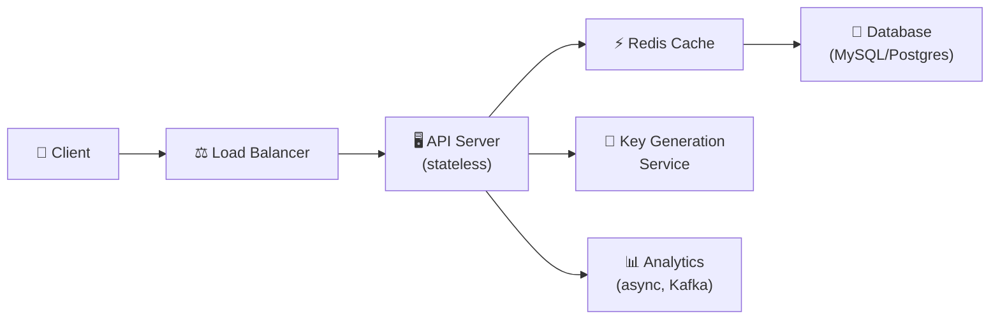
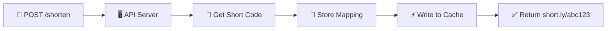
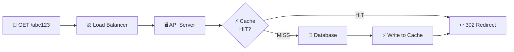

# 🔥 Level 8: Designing a URL Shortener

## 🎯 What is this case about?

This is your first system design case "from scratch." URL Shortener is a classic System Design interview problem because it looks simple on the surface but touches **all key concepts**: storage, scaling, caching, unique ID generation.

Analogy: A URL Shortener is like a **coat check**. You hand over a long coat (URL), get a small ticket (`abc123`), and later retrieve your coat using the ticket. Only instead of a coat check — it's a distributed system handling millions of "coats" per second.

## 📌 Step 1: Requirements

### Functional Requirements (what the system does)

1. Create a short link from a long URL (`short.ly/abc123`)
2. Redirect to the original URL from a short link
3. (Optional) Custom alias — user chooses their own short code
4. (Optional) TTL — link with a limited lifetime
5. (Optional) Analytics — how many clicks

### Non-Functional Requirements (how the system works)

- **High availability** — links must work 24/7 (99.9%+)
- **Low latency** — redirect in < 100 ms
- **Scale** — 100M+ links, 10K+ redirects/sec
- **Read-heavy** — 100x more reads than writes

## 📌 Step 2: Capacity Estimation

Let's estimate the load "on a napkin" — this is a **mandatory** part of the interview:

```typescript
// === Input data ===
const newUrlsPerDay = 1_000_000        // 1M new links/day
const readWriteRatio = 100             // 100 reads per 1 write
const readsPerDay = 100_000_000        // 100M redirects/day
const yearsToStore = 5

// === QPS (Queries Per Second) ===
const writeQPS = 1_000_000 / 86400     // ~12 writes/sec
const readQPS = writeQPS * 100          // ~1200 reads/sec
const peakReadQPS = readQPS * 3         // ~3600 reads/sec (peak)

// === Storage ===
const totalUrls = newUrlsPerDay * 365 * yearsToStore  // ~1.8 billion URLs
const avgRecordSize = 500              // bytes (URL + metadata)
const totalStorage = totalUrls * avgRecordSize         // ~900 GB over 5 years

// === Bandwidth ===
const outgoingBandwidth = readQPS * avgRecordSize      // ~600 KB/sec
```

💡 Key observation: **1.8 billion unique links over 5 years**. This determines our short code length — we need at least 7 characters in base62.

## 🔥 Step 3: Generating Short Links

This is the **key architectural decision** — how to turn a long URL into a unique short code.

### Base62 Encoding

Alphabet: `a-z` (26) + `A-Z` (26) + `0-9` (10) = **62 characters**.

```typescript
const CHARSET = 'abcdefghijklmnopqrstuvwxyzABCDEFGHIJKLMNOPQRSTUVWXYZ0123456789'

function encodeBase62(num: number): string {
  if (num === 0) return CHARSET[0]
  let result = ''
  while (num > 0) {
    result = CHARSET[num % 62] + result
    num = Math.floor(num / 62)
  }
  return result
}

// 7 characters → 62^7 = 3.5 trillion combinations
encodeBase62(1)            // → 'b'
encodeBase62(1000000)      // → 'eUNE'
encodeBase62(56800235583)  // → 'zzzzzz' (max. 6 characters)
encodeBase62(56800235584)  // → 'baaaaaa' (start of 7 characters)
```

📌 **62^7 = 3.5 trillion** — enough for thousands of years at 1M links per day.

### Three Generation Algorithms

| Approach | How it works | Pros | Cons |
|----------|-------------|------|------|
| Hash + Collision Check | MD5/SHA256 of URL → take first 7 base62 characters | Same URL = same code | Collisions, uniqueness check needed |
| Counter-Based | Atomic counter → base62 | No collisions, predictable length | Single point of failure, predictable URLs |
| Pre-Generated | Generate codes in advance, distribute from pool | Fast, no conflicts | Harder coordination, storage overhead |

### Algorithm 1: Hash + Collision Check

```typescript
import crypto from 'crypto'

async function createShortUrl(longUrl: string): Promise<string> {
  const hash = crypto.createHash('md5').update(longUrl).digest('hex')
  let shortCode = encodeBase62(parseInt(hash.substring(0, 12), 16))
    .substring(0, 7)

  // Check for collision
  while (await db.exists(shortCode)) {
    // Add salt and rehash
    const salted = hash + Date.now().toString()
    const newHash = crypto.createHash('md5').update(salted).digest('hex')
    shortCode = encodeBase62(parseInt(newHash.substring(0, 12), 16))
      .substring(0, 7)
  }

  await db.save({ shortCode, longUrl, createdAt: new Date() })
  return shortCode
}
```

### Algorithm 2: Counter-Based (Snowflake-like)

```typescript
// Use a distributed counter (Redis INCR or ZooKeeper)
async function createShortUrlCounter(longUrl: string): Promise<string> {
  const nextId = await redis.incr('url:counter')  // Atomic operation
  const shortCode = encodeBase62(nextId).padStart(7, 'a')

  await db.save({ shortCode, longUrl, createdAt: new Date() })
  return shortCode
}

// For distribution — each server gets a range:
// Server 1: 1 - 1_000_000
// Server 2: 1_000_001 - 2_000_000
// When the range is exhausted — request a new one from ZooKeeper
```

### Algorithm 3: Pre-Generated Keys

```typescript
// A separate Key Generation Service (KGS) generates codes in advance
// and stores them in two tables: unused_keys and used_keys

async function createShortUrlPregen(longUrl: string): Promise<string> {
  // Atomically take a code from the unused pool
  const shortCode = await kgs.takeKey()  // O(1), no collisions

  await db.save({ shortCode, longUrl, createdAt: new Date() })
  return shortCode
}

// KGS replenishes the pool in the background:
// 1. Generates random 7-character base62 codes
// 2. Checks uniqueness (SET in Redis or UNIQUE in DB)
// 3. Adds to the unused_keys table
```

## 🔥 Step 4: 301 vs 302 — Redirect

When a user follows `short.ly/abc123`, the server must return an HTTP redirect. But which one?

| Code | Type | What the browser does | Analytics | When to use |
|------|------|----------------------|-----------|-------------|
| **301** | Permanent Redirect | Caches, doesn't ask the server again | Loses clicks | SEO, static links |
| **302** | Temporary Redirect | Always asks the server | Counts every click | Analytics, A/B tests, TTL links |

```typescript
app.get('/:shortCode', async (req, res) => {
  const record = await getUrl(req.params.shortCode)
  if (!record) return res.status(404).send('Not found')

  // Track click asynchronously (don't block redirect)
  trackClick(record.shortCode, req).catch(console.error)

  // 302 — to count every click
  res.redirect(302, record.longUrl)
})
```

💡 **Bitly, TinyURL use 301**, because it's faster for the user. But if you need analytics — use **302**.

## 🔥 Step 5: Architecture



### Short link creation flow



### Redirect flow



## 📌 Step 6: Data Model

```typescript
// Main table
interface UrlMapping {
  shortCode: string     // PK, VARCHAR(7), indexed
  longUrl: string       // TEXT, original URL
  userId?: string       // FK, who created (nullable for anonymous)
  createdAt: Date       // timestamp
  expiresAt?: Date      // TTL (nullable)
  clickCount: number    // denormalized counter (for fast reads)
}

// Analytics table (separate, to not burden the main one)
interface ClickEvent {
  id: string            // UUID
  shortCode: string     // FK
  clickedAt: Date       // timestamp
  ip: string            // for geo
  userAgent: string     // for device
  referer?: string      // where the user came from
}
```

```sql
-- Indexes for fast reads
CREATE INDEX idx_short_code ON url_mappings(short_code);
CREATE INDEX idx_expires ON url_mappings(expires_at) WHERE expires_at IS NOT NULL;

-- Sharding by short_code (consistent hashing)
-- Shard = hash(short_code) % num_shards
```

## 📌 Step 7: Caching and Scaling

### Caching (Redis)

Since the system is **read-heavy** (100:1), cache is critical:

```typescript
async function getUrl(shortCode: string): Promise<UrlMapping | null> {
  // 1. Check cache
  const cached = await redis.get(`url:${shortCode}`)
  if (cached) return JSON.parse(cached)

  // 2. Cache miss — read from DB
  const record = await db.findByShortCode(shortCode)
  if (!record) return null

  // 3. Write to cache (TTL = 24 hours for popular links)
  await redis.setex(`url:${shortCode}`, 86400, JSON.stringify(record))
  return record
}
```

📌 **80/20 rule**: 20% of links get 80% of traffic. By caching only hot links, we cover most requests.

### Scaling

| Component | Strategy |
|-----------|----------|
| API Server | Horizontal scaling (stateless, behind Load Balancer) |
| Database | Sharding by short_code (consistent hashing) |
| Cache | Redis Cluster (automatic sharding) |
| KGS | Pre-generate keys, distribute ranges to servers |
| Analytics | Kafka → separate pipeline (doesn't block redirect) |

### Link Expiration (TTL)

```typescript
// Background process to clean up expired links
async function cleanupExpiredUrls() {
  // Use the expires_at index
  const expired = await db.query(
    'DELETE FROM url_mappings WHERE expires_at < NOW() RETURNING short_code'
  )

  // Invalidate cache
  for (const row of expired) {
    await redis.del(`url:${row.short_code}`)
  }
}

// Run every 5 minutes via cron
```

## ⚠️ Common Beginner Mistakes

### Mistake 1: Using MD5/SHA256 directly without collision checking

```
❌ Bad:
const shortCode = md5(longUrl).substring(0, 7)
// What if two different URLs produce the same first 7 hash characters?
// With 1.8 billion URLs — collisions are GUARANTEED (Birthday Paradox)
```

```
✅ Good:
const shortCode = md5(longUrl).substring(0, 7)
if (await db.exists(shortCode)) {
  // Rehash with salt or use a different algorithm
}
```

### Mistake 2: Forgetting about cache

```
❌ Bad:
app.get('/:code', async (req, res) => {
  const url = await db.findByCode(req.params.code)  // Every time to DB
  res.redirect(302, url)
})
// At 1200 QPS the database will crash
```

```
✅ Good:
// Redis before DB: 95%+ of requests served from cache in 1 ms
const cached = await redis.get(code) || await loadFromDbAndCache(code)
```

### Mistake 3: Synchronous analytics blocking redirect

```
❌ Bad:
app.get('/:code', async (req, res) => {
  const url = await getUrl(code)
  await analytics.track(code, req)    // +50ms to every redirect!
  res.redirect(302, url)
})
```

```
✅ Good:
// Send to Kafka/queue, don't wait for response
analytics.track(code, req).catch(console.error)
res.redirect(302, url)
```

### Mistake 4: Using 301 but expecting accurate analytics

```
❌ 301 Permanent Redirect → browser caches → subsequent clicks invisible to server
✅ 302 Temporary Redirect → browser always asks server → accurate counting
```

## 🎯 Summary

| Aspect | Solution |
|--------|----------|
| **ID Generation** | Counter-Based (simplest) or Pre-Generated (most reliable) |
| **Encoding** | Base62 — 7 characters = 3.5 trillion combinations |
| **Redirect** | 302 for analytics, 301 for speed |
| **Storage** | SQL (MySQL/Postgres) + sharding by short_code |
| **Cache** | Redis with 24h TTL, covers 95%+ of read traffic |
| **Analytics** | Async via Kafka, separate pipeline |
| **Scale** | Stateless API + DB sharding + Redis Cluster |

💡 In an interview, the most important thing is a **structured approach**: Requirements → Estimation → API → Data Model → Algorithm → Architecture → Scaling. URL Shortener is the ideal case to practice this skill.