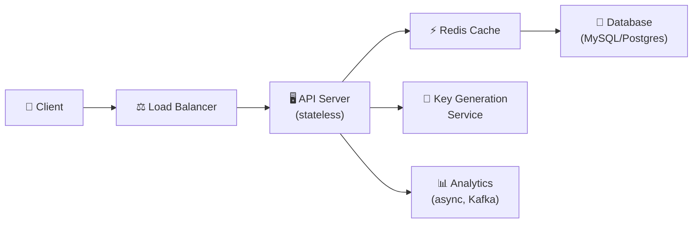
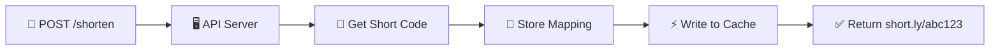
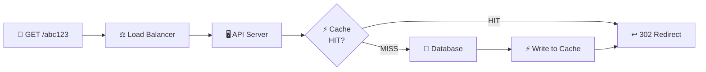

# 🔥 Уровень 8: Проектируем URL Shortener

## 🎯 О чём этот кейс?

Это ваш первый кейс по проектированию системы «с нуля». URL Shortener — классическая задача на интервью по System Design, потому что она простая на поверхности, но затрагивает **все ключевые концепции**: хранение, масштабирование, кэширование, генерацию уникальных ID.

Аналогия: URL Shortener — это **гардеробный номерок**. Вы сдаёте длинную шубу (URL), получаете маленький номерок (`abc123`), а потом по номерку получаете шубу обратно. Только вместо гардероба — распределённая система на миллионы «шуб» в секунду.

## 📌 Шаг 1: Требования

### Functional Requirements (что система делает)

1. По длинному URL создать короткую ссылку (`short.ly/abc123`)
2. По короткой ссылке — перенаправить на оригинальный URL
3. (Опционально) Custom alias — пользователь сам выбирает короткий код
4. (Опционально) TTL — ссылка с ограниченным сроком жизни
5. (Опционально) Аналитика — сколько раз кликнули

### Non-Functional Requirements (как система работает)

- **Высокая доступность** — ссылки должны работать 24/7 (99.9%+)
- **Низкая задержка** — redirect за < 100 мс
- **Масштаб** — 100M+ ссылок, 10K+ redirects/сек
- **Read-heavy** — чтений в 100 раз больше, чем записей

## 📌 Шаг 2: Capacity Estimation

Прикинем нагрузку «на салфетке» — это **обязательная** часть интервью:

```typescript
// === Исходные данные ===
const newUrlsPerDay = 1_000_000        // 1M новых ссылок/день
const readWriteRatio = 100             // 100 чтений на 1 запись
const readsPerDay = 100_000_000        // 100M redirect/день
const yearsToStore = 5

// === QPS (Queries Per Second) ===
const writeQPS = 1_000_000 / 86400     // ~12 writes/sec
const readQPS = writeQPS * 100          // ~1200 reads/sec
const peakReadQPS = readQPS * 3         // ~3600 reads/sec (пик)

// === Storage ===
const totalUrls = newUrlsPerDay * 365 * yearsToStore  // ~1.8 billion URLs
const avgRecordSize = 500              // bytes (URL + metadata)
const totalStorage = totalUrls * avgRecordSize         // ~900 GB за 5 лет

// === Bandwidth ===
const outgoingBandwidth = readQPS * avgRecordSize      // ~600 KB/sec
```

💡 Ключевое наблюдение: **1.8 млрд уникальных ссылок за 5 лет**. Это определяет длину нашего короткого кода — нужно минимум 7 символов в base62.

## 🔥 Шаг 3: Генерация коротких ссылок

Это **главное архитектурное решение** — как превратить длинный URL в уникальный короткий код.

### Base62 Encoding

Алфавит: `a-z` (26) + `A-Z` (26) + `0-9` (10) = **62 символа**.

```typescript
const CHARSET = 'abcdefghijklmnopqrstuvwxyzABCDEFGHIJKLMNOPQRSTUVWXYZ0123456789'

function encodeBase62(num: number): string {
  if (num === 0) return CHARSET[0]
  let result = ''
  while (num > 0) {
    result = CHARSET[num % 62] + result
    num = Math.floor(num / 62)
  }
  return result
}

// 7 символов → 62^7 = 3.5 триллиона комбинаций
encodeBase62(1)            // → 'b'
encodeBase62(1000000)      // → 'eUNE'
encodeBase62(56800235583)  // → 'zzzzzz' (макс. 6 символов)
encodeBase62(56800235584)  // → 'baaaaaa' (начало 7 символов)
```

📌 **62^7 = 3.5 трлн** — хватит на тысячи лет при 1M ссылок в день.

### Три алгоритма генерации

| Подход | Как работает | Плюсы | Минусы |
|--------|-------------|-------|--------|
| Hash + Collision Check | MD5/SHA256 от URL → берём первые 7 символов base62 | Один URL = один код | Коллизии, нужна проверка уникальности |
| Counter-Based | Атомарный счётчик → base62 | Нет коллизий, предсказуемая длина | Single point of failure, предсказуемые URL |
| Pre-Generated | Генерируем коды заранее, раздаём из пула | Быстро, нет конфликтов | Сложнее координация, тратим storage |

### Алгоритм 1: Hash + Collision Check

```typescript
import crypto from 'crypto'

async function createShortUrl(longUrl: string): Promise<string> {
  const hash = crypto.createHash('md5').update(longUrl).digest('hex')
  let shortCode = encodeBase62(parseInt(hash.substring(0, 12), 16))
    .substring(0, 7)

  // Проверяем коллизию
  while (await db.exists(shortCode)) {
    // Добавляем соль и перехешируем
    const salted = hash + Date.now().toString()
    const newHash = crypto.createHash('md5').update(salted).digest('hex')
    shortCode = encodeBase62(parseInt(newHash.substring(0, 12), 16))
      .substring(0, 7)
  }

  await db.save({ shortCode, longUrl, createdAt: new Date() })
  return shortCode
}
```

### Алгоритм 2: Counter-Based (Snowflake-подобный)

```typescript
// Используем распределённый counter (Redis INCR или ZooKeeper)
async function createShortUrlCounter(longUrl: string): Promise<string> {
  const nextId = await redis.incr('url:counter')  // Атомарная операция
  const shortCode = encodeBase62(nextId).padStart(7, 'a')

  await db.save({ shortCode, longUrl, createdAt: new Date() })
  return shortCode
}

// Для распределённости — каждый сервер получает диапазон:
// Server 1: 1 - 1_000_000
// Server 2: 1_000_001 - 2_000_000
// Когда диапазон заканчивается — запрашивает новый у ZooKeeper
```

### Алгоритм 3: Pre-Generated Keys

```typescript
// Отдельный Key Generation Service (KGS) заранее генерирует коды
// и хранит их в двух таблицах: unused_keys и used_keys

async function createShortUrlPregen(longUrl: string): Promise<string> {
  // Атомарно забираем код из пула неиспользованных
  const shortCode = await kgs.takeKey()  // O(1), нет коллизий

  await db.save({ shortCode, longUrl, createdAt: new Date() })
  return shortCode
}

// KGS в фоне пополняет пул:
// 1. Генерирует случайные 7-символьные base62 коды
// 2. Проверяет уникальность (SET в Redis или UNIQUE в БД)
// 3. Добавляет в таблицу unused_keys
```

## 🔥 Шаг 4: 301 vs 302 — Redirect

Когда пользователь переходит по `short.ly/abc123`, сервер должен вернуть HTTP-redirect. Но какой?

| Код | Тип | Что делает браузер | Аналитика | Когда использовать |
|-----|-----|-------------------|-----------|-------------------|
| **301** | Permanent Redirect | Кэширует, больше не спрашивает сервер | Теряем клики | SEO, статические ссылки |
| **302** | Temporary Redirect | Каждый раз обращается к серверу | Считаем каждый клик | Аналитика, A/B тесты, TTL-ссылки |

```typescript
app.get('/:shortCode', async (req, res) => {
  const record = await getUrl(req.params.shortCode)
  if (!record) return res.status(404).send('Not found')

  // Записываем клик асинхронно (не блокируем redirect)
  trackClick(record.shortCode, req).catch(console.error)

  // 302 — чтобы считать каждый клик
  res.redirect(302, record.longUrl)
})
```

💡 **Bitly, TinyURL используют 301**, потому что это быстрее для пользователя. Но если вам нужна аналитика — используйте **302**.

## 🔥 Шаг 5: Архитектура



### Поток создания короткой ссылки



### Поток перенаправления (redirect)



## 📌 Шаг 6: Data Model

```typescript
// Основная таблица
interface UrlMapping {
  shortCode: string     // PK, VARCHAR(7), indexed
  longUrl: string       // TEXT, original URL
  userId?: string       // FK, кто создал (nullable для анонимных)
  createdAt: Date       // timestamp
  expiresAt?: Date      // TTL (nullable)
  clickCount: number    // денормализованный счётчик (для быстрого чтения)
}

// Таблица аналитики (отдельно, чтобы не нагружать основную)
interface ClickEvent {
  id: string            // UUID
  shortCode: string     // FK
  clickedAt: Date       // timestamp
  ip: string            // для гео
  userAgent: string     // для устройства
  referer?: string      // откуда пришёл
}
```

```sql
-- Индексы для быстрого чтения
CREATE INDEX idx_short_code ON url_mappings(short_code);
CREATE INDEX idx_expires ON url_mappings(expires_at) WHERE expires_at IS NOT NULL;

-- Шардирование по short_code (consistent hashing)
-- Shard = hash(short_code) % num_shards
```

## 📌 Шаг 7: Кэширование и масштабирование

### Кэширование (Redis)

Поскольку система **read-heavy** (100:1), кэш — критически важен:

```typescript
async function getUrl(shortCode: string): Promise<UrlMapping | null> {
  // 1. Проверяем кэш
  const cached = await redis.get(`url:${shortCode}`)
  if (cached) return JSON.parse(cached)

  // 2. Cache miss — читаем из БД
  const record = await db.findByShortCode(shortCode)
  if (!record) return null

  // 3. Пишем в кэш (TTL = 24 часа для популярных ссылок)
  await redis.setex(`url:${shortCode}`, 86400, JSON.stringify(record))
  return record
}
```

📌 **80/20 правило**: 20% ссылок получают 80% трафика. Кэшируя только горячие ссылки, покрываем большинство запросов.

### Масштабирование

| Компонент | Стратегия |
|-----------|-----------|
| API Server | Horizontal scaling (stateless, за Load Balancer) |
| Database | Sharding по short_code (consistent hashing) |
| Cache | Redis Cluster (автоматический шардинг) |
| KGS | Заранее генерируем ключи, раздаём диапазоны серверам |
| Analytics | Kafka → отдельный pipeline (не блокирует redirect) |

### Link Expiration (TTL)

```typescript
// Фоновый процесс удаления протухших ссылок
async function cleanupExpiredUrls() {
  // Используем индекс по expires_at
  const expired = await db.query(
    'DELETE FROM url_mappings WHERE expires_at < NOW() RETURNING short_code'
  )

  // Инвалидируем кэш
  for (const row of expired) {
    await redis.del(`url:${row.short_code}`)
  }
}

// Запускаем каждые 5 минут через cron
```

## ⚠️ Частые ошибки новичков

### Ошибка 1: Использовать MD5/SHA256 напрямую без проверки коллизий

```
❌ Плохо:
const shortCode = md5(longUrl).substring(0, 7)
// Что если два разных URL дают одинаковые первые 7 символов хеша?
// При 1.8 млрд URL — коллизии ГАРАНТИРОВАНЫ (Birthday Paradox)
```

```
✅ Хорошо:
const shortCode = md5(longUrl).substring(0, 7)
if (await db.exists(shortCode)) {
  // Перехешировать с солью или использовать другой алгоритм
}
```

### Ошибка 2: Забыть про кэш

```
❌ Плохо:
app.get('/:code', async (req, res) => {
  const url = await db.findByCode(req.params.code)  // Каждый раз в БД
  res.redirect(302, url)
})
// При 1200 QPS база ляжет
```

```
✅ Хорошо:
// Redis перед БД: 95%+ запросов отдаются из кэша за 1 мс
const cached = await redis.get(code) || await loadFromDbAndCache(code)
```

### Ошибка 3: Синхронная аналитика блокирует redirect

```
❌ Плохо:
app.get('/:code', async (req, res) => {
  const url = await getUrl(code)
  await analytics.track(code, req)    // +50мс к каждому redirect!
  res.redirect(302, url)
})
```

```
✅ Хорошо:
// Отправляем в Kafka/очередь, не ждём ответа
analytics.track(code, req).catch(console.error)
res.redirect(302, url)
```

### Ошибка 4: Использовать 301, но ожидать точную аналитику

```
❌ 301 Permanent Redirect → браузер кэширует → повторные клики не видны серверу
✅ 302 Temporary Redirect → браузер каждый раз спрашивает сервер → точный подсчёт
```

## 🎯 Итоги

| Аспект | Решение |
|--------|---------|
| **Генерация ID** | Counter-Based (самый простой) или Pre-Generated (самый надёжный) |
| **Encoding** | Base62 — 7 символов = 3.5 трлн комбинаций |
| **Redirect** | 302 для аналитики, 301 для скорости |
| **Storage** | SQL (MySQL/Postgres) + шардирование по short_code |
| **Cache** | Redis с 24h TTL, покрывает 95%+ read-трафика |
| **Analytics** | Асинхронно через Kafka, отдельный pipeline |
| **Масштаб** | Stateless API + DB sharding + Redis Cluster |

💡 На интервью самое важное — **структурированный подход**: Requirements → Estimation → API → Data Model → Algorithm → Architecture → Scaling. URL Shortener — идеальный кейс, чтобы отработать этот навык.
