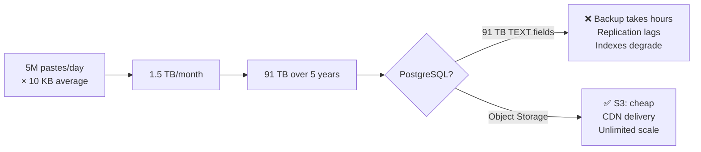
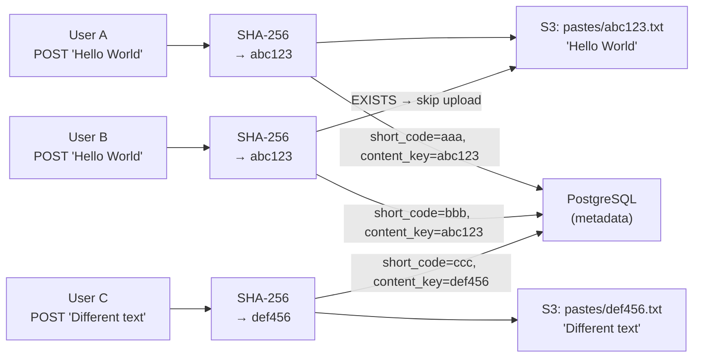
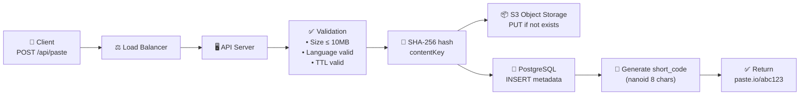
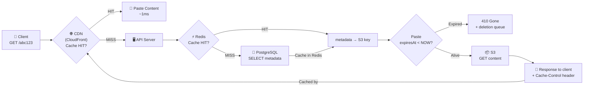
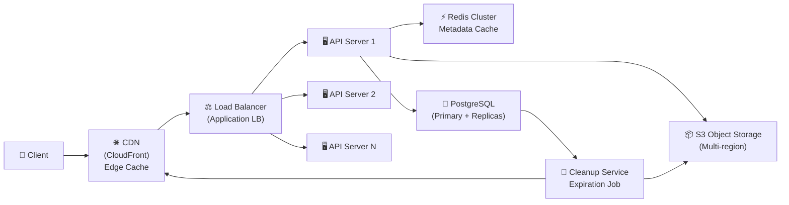
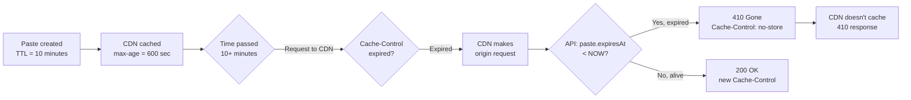

# Level 9: Designing a Paste Service -- Text Storage, Deduplication, and TTL

## Introduction

Imagine working in a theater cloakroom. Each visitor arrives with a coat, hands it in, and gets a "token" -- a short link like `paste.io/abc123`. The text is stored in a special "cloakroom" -- Object Storage. Metadata (who submitted, when, for how long) -- in a separate fast database. When someone follows the link, the system returns the right text in a fraction of a second.

It might seem a Paste Service is simpler than a URL Shortener: no 301 redirect needed, just return the text. But here lies the architectural trap: you need to **store the content yourself**. This changes everything -- storage scale, delivery approach, deduplication strategy, and deletion logic. None of these tasks are trivial.

At this level we will cover:

1. Service requirements and constraints
2. Load estimation: QPS, storage, bandwidth
3. The main architectural decision -- separating metadata and content
4. Content-Addressable Storage and deduplication
5. Full architecture: Write Path and Read Path
6. CDN for content delivery
7. Cleanup and Expiration
8. Syntax Highlighting -- where and how
9. Common mistakes and how to avoid them

---

## 1. Requirements

### Why Start with Requirements, Not the Solution?

A typical interview mistake -- immediately drawing a diagram with microservices and Kafka. The interviewer sees this as a red flag: the candidate is solving a problem they invented themselves, not the one presented. Requirements are a contract. Until the contract is fixed, any solution might be wrong.

Separating functional and non-functional requirements isn't bureaucracy. It helps understand: **what the system must be able to do** (functional) and **how well it must do it** (non-functional).

### Functional Requirements

Functional requirements describe system behavior from the user's perspective:

1. **Create paste** -- upload text (up to 10 MB), get a unique link
2. **Read paste** by link (without authorization)
3. **Syntax highlighting** for code (optional, determined by language)
4. **Expiration** -- paste with limited lifetime (10 min, 1 hour, 1 day, 1 week, permanent)
5. (Optional) Private pastes -- access only by secret URL
6. (Optional) Deletion and editing by author

Note the word "optional." In an interview, explicitly ask: are these features in scope? If yes -- how does the architecture change? This shows you think about trade-offs, not just listing technologies.

### Non-Functional Requirements

Non-functional requirements are quality constraints:

- **High availability** -- links must work 24/7 (99.9%+). An unavailable paste is a reputational hit: people share links in public chats
- **Low read latency** -- content in < 200ms. Reading dominates over writing, so the read path needs primary optimization
- **Scale** -- 5M+ pastes/day, average size 10 KB
- **Read-heavy** -- read:write = 5:1. This means the architecture must be optimized for reading, not writing
- **Durability** -- created paste must not be lost before TTL expires

The 5:1 ratio (reads to writes) is a key number. It means: caching delivers enormous benefits, because the same pastes are read repeatedly. CDN and Redis Cache architectural decisions follow directly from this number.

---

## 2. Capacity Estimation

### Why Estimate Load Before Designing?

Load estimation isn't a mathematical attraction. It's a way to understand: what class of solutions do we need? If pastes occupy 1 GB over 5 years -- regular PostgreSQL works fine. If 91 TB -- only Object Storage. Without this calculation, it's impossible to justify an architectural decision.

```typescript
// === Starting data ===
const pastesPerDay = 5_000_000        // 5M new pastes/day
const avgPasteSize = 10 * 1024        // 10 KB average size
const readWriteRatio = 5              // 5 reads per 1 write
const readsPerDay = 25_000_000        // 25M reads/day
const retentionYears = 5
const metadataSize = 200              // bytes (URL, title, language, timestamps)

// === QPS (Queries Per Second) ===
const writeQPS = 5_000_000 / 86400    // ~58 writes/sec
const readQPS = writeQPS * 5          // ~290 reads/sec
const peakReadQPS = readQPS * 3       // ~870 reads/sec (peak × 3)

// === Storage ===
// Content (S3 / Object Storage)
const totalPastes = pastesPerDay * 365 * retentionYears  // ~9.1 billion pastes
const contentStorage = totalPastes * avgPasteSize         // ~91 TB over 5 years

// Metadata (SQL Database)
const metadataStorage = totalPastes * metadataSize        // ~1.8 TB over 5 years

// === Bandwidth ===
const incomingBW = writeQPS * avgPasteSize   // ~580 KB/sec (upload)
const outgoingBW = readQPS * avgPasteSize    // ~2.9 MB/sec (download)
const peakOutBW = peakReadQPS * avgPasteSize // ~8.7 MB/sec (peak)

// === Storage per month ===
const storagePerMonth = pastesPerDay * 30 * avgPasteSize  // ~1.5 TB/month
```

### What These Numbers Tell Us

Let's analyze each number and its architectural implication:

| Metric | Value | What It Means |
|---------|----------|-----------------|
| Write QPS | 58/sec | Moderate. One PostgreSQL handles it |
| Read QPS | 290/sec (peak 870) | Need cache (Redis) + CDN |
| Content storage | 91 TB over 5 years | SQL unsuitable -- only Object Storage |
| Metadata storage | 1.8 TB over 5 years | Sharded PostgreSQL handles it |
| Incoming bandwidth | ~580 KB/sec | 0.6 Gbps -- standard channel |
| Outgoing bandwidth | ~8.7 MB/sec peak | ~70 Mbps -- easily covered by CDN |

The main conclusion from calculations: **91 TB of content** -- that's the number that makes "store in PostgreSQL" physically impossible. Even with SSD storage, backing up a 91 TB database takes tens of hours. Replication constantly lags. Indexes on TEXT fields degrade. The only correct answer -- **Object Storage**.



---

## 3. Separating Metadata and Content

### The Main Architectural Decision

If there's one key decision in the Paste Service design -- it's separating metadata and content into **two different types of storage**. Everything else follows from it.

Analogy: a library catalog and books. The catalog (metadata) -- cards with title, author, shelf number, and location. They're small, easy to search and sort. The books themselves (content) are stored on shelves -- large, heavy, they don't need to be sorted by content, just retrieved by a known address (shelf, row, position).

### Why Not Store Text in the Database?

Let's examine both approaches honestly:

| Approach | Pros | Cons |
|--------|-------|--------|
| Text in SQL (TEXT/BLOB) | Simple implementation, atomic transactions with metadata, one JOIN instead of two requests | DB bloats to 91 TB, backup/restore takes hours, replication constantly lags, TEXT indexes inefficient, expensive storage (SSD vs HDD) |
| Object Storage (S3) | Unlimited storage, native CDN integration, cheap (~$0.023/GB/month), horizontal scale | No transactions with metadata, eventual consistency, additional complexity (two storages instead of one) |

Storage cost for 91 TB in PostgreSQL on SSD (~$0.10/GB/month): **~$9,100/month**. Cost of 91 TB in S3 (~$0.023/GB/month): **~$2,093/month**. A 4.3x difference on storage alone, not counting operational costs of maintaining a huge DB.

### Data Schema

```typescript
// Metadata in PostgreSQL -- everything needed for search and filtering
interface PasteMetadata {
  id: string              // UUID for internal use
  shortCode: string       // unique code for URL: "abc123"
  title?: string          // paste title (optional)
  language?: string       // language for syntax highlighting: "typescript", "python"
  contentKey: string      // key in S3: "pastes/sha256hash.txt"
  contentSize: number     // content size in bytes
  createdAt: Date         // creation time
  expiresAt?: Date        // when to delete (NULL = permanent)
  isPrivate: boolean      // private paste
  authorId?: string       // author ID (if authenticated)
}

// SQL DDL
// CREATE TABLE pastes (
//   id UUID PRIMARY KEY DEFAULT gen_random_uuid(),
//   short_code VARCHAR(8) UNIQUE NOT NULL,
//   title VARCHAR(255),
//   language VARCHAR(50),
//   content_key VARCHAR(128) NOT NULL,   -- S3 reference
//   content_size INTEGER NOT NULL,
//   created_at TIMESTAMPTZ DEFAULT NOW(),
//   expires_at TIMESTAMPTZ,              -- NULL = permanent
//   is_private BOOLEAN DEFAULT FALSE,
//   author_id UUID
// );
// CREATE INDEX idx_pastes_expires_at ON pastes(expires_at) WHERE expires_at IS NOT NULL;

// Content in S3 -- just a text file
// PUT s3://paste-bucket/pastes/a1b2c3d4e5.txt → raw text content
```

Key rule: in SQL store everything needed for **search and filtering** (by code, author, date, lifetime). In S3 store everything needed for **serving to the user** (the text itself). These two data types should never be swapped.

---

## 4. Content-Addressable Storage and Deduplication

### The Problem: Duplicate Content

What happens if 1,000 developers copy the same popular code snippet and create 1,000 separate pastes? By default -- 1,000 identical files in S3. At an average 10 KB, that's 10 MB. Scaled up: if 10% of all pastes are duplicates, that's 9+ TB of wasted data over 5 years.

Content-Addressable Storage (CAS) is a pattern where **an object's address is determined by its content**, not by an arbitrary identifier. Like a file checksum: if two files have the same SHA-256 -- they're identical. Meaning, they should be stored once.

### How Deduplication Works

```typescript
import crypto from 'crypto'
import { S3Client, HeadObjectCommand, PutObjectCommand } from '@aws-sdk/client-s3'

const s3 = new S3Client({ region: 'us-east-1' })
const BUCKET = 'paste-bucket'

async function storePasteContent(text: string): Promise<string> {
  // Step 1: Compute SHA-256 from content
  // SHA-256 gives a 64-character hex string -- this is the object address
  const hash = crypto.createHash('sha256').update(text, 'utf8').digest('hex')
  const s3Key = `pastes/${hash}.txt`

  // Step 2: Check if object exists in S3 (HEAD request, without body download)
  // HeadObject costs ~10x less than GetObject in S3 API pricing
  const exists = await s3
    .send(new HeadObjectCommand({ Bucket: BUCKET, Key: s3Key }))
    .then(() => true)
    .catch(() => false)

  // Step 3: Upload only if object doesn't exist yet
  if (!exists) {
    await s3.send(
      new PutObjectCommand({
        Bucket: BUCKET,
        Key: s3Key,
        Body: text,
        ContentType: 'text/plain; charset=utf-8',
      })
    )
  }

  // Return key -- will be saved in PostgreSQL as content_key
  return s3Key
}
```

### What the System Looks Like with Deduplication



Three pastes, three PostgreSQL records, but only two files in S3. User A and User B have different `short_code` (different links), different creation dates, possibly different TTL -- but their `content_key` is the same. Metadata is different, content is shared.

### Reference Counting Problem on Deletion

Deduplication creates a hidden dependency: one S3 object may be needed by multiple pastes. You can delete an S3 object only when **no live paste references it anymore**.

This is critical: if you delete an S3 object when deleting one paste without checking the others -- all other pastes with the same content break. The link exists, but there's no file to serve.

Two approaches to solve this:

**Approach 1 -- Reference counting (simple, synchronous):**

```typescript
async function safeDeleteContent(contentKey: string, db: Database): Promise<void> {
  // Count how many live pastes still reference this content
  const { count } = await db.queryOne<{ count: number }>(
    `SELECT COUNT(*) as count
     FROM pastes
     WHERE content_key = $1
       AND (expires_at IS NULL OR expires_at > NOW())`,
    [contentKey]
  )

  // Delete from S3 only if nobody else references it
  if (count === 0) {
    await s3.send(new DeleteObjectCommand({ Bucket: BUCKET, Key: contentKey }))
  }
}
```

**Approach 2 -- Garbage Collection (asynchronous, scalable):**

At large scale, it's better not to check reference count on each deletion, but to periodically scan for "orphaned" objects in S3 -- those with no PostgreSQL record. This is called garbage collection and runs as a background process every few hours.

### SHA-256 Collisions -- Theoretical Risk

SHA-256 produces 2^256 unique values. Collision probability with 9 billion pastes is negligible -- on the order of 10^-60. In practice, this is not a risk. For Paste Service-level systems, SHA-256 is absolutely reliable.

---

## 5. System Architecture

### Write Path -- Creating a Paste

Trace the data path from when the user clicks "Create" to receiving the link:



Break down each step:

1. **Client sends** `POST /api/paste` with request body (text, language, TTL)
2. **API Server validates** -- checks size (≤10 MB), language validity, TTL correctness
3. **SHA-256 computed** from text -- this becomes `contentKey` in S3
4. **S3 upload** -- only if object with this key doesn't exist yet (HEAD-check)
5. **PostgreSQL INSERT** -- save metadata: `short_code`, `content_key`, `expires_at`
6. **Return URL** -- `paste.io/{shortCode}`

Steps 4 and 5 go in parallel -- no reason to wait for one to finish before starting the other:

```typescript
async function createPaste(input: CreatePasteInput): Promise<string> {
  const { text, language, ttlSeconds, isPrivate } = input

  // In parallel: upload to S3 and generate short code
  const [contentKey, shortCode] = await Promise.all([
    storePasteContent(text),        // SHA-256 + S3 upload
    generateShortCode(),            // nanoid(8)
  ])

  const expiresAt = ttlSeconds
    ? new Date(Date.now() + ttlSeconds * 1000)
    : null

  await db.query(
    `INSERT INTO pastes (short_code, content_key, content_size, language, expires_at, is_private)
     VALUES ($1, $2, $3, $4, $5, $6)`,
    [shortCode, contentKey, text.length, language, expiresAt, isPrivate]
  )

  return `https://paste.io/${shortCode}`
}
```

### Read Path -- Reading a Paste



Critically important: **most requests end at the CDN**. If a paste is popular and public, the CDN serves it from the nearest edge server in 1-5ms. Only the following reach the API Server:
- First request to a paste (CDN MISS)
- Requests for private pastes (CDN doesn't cache)
- Requests after cache invalidation

```typescript
async function getPaste(shortCode: string): Promise<PasteContent | null> {
  // Step 1: Check Redis (metadata, ~1ms)
  const cached = await redis.get(`paste:meta:${shortCode}`)
  let metadata: PasteMetadata

  if (cached) {
    metadata = JSON.parse(cached)
  } else {
    // Step 2: Read from PostgreSQL (~5ms)
    const row = await db.queryOne(
      'SELECT * FROM pastes WHERE short_code = $1',
      [shortCode]
    )
    if (!row) return null

    metadata = row
    // Cache metadata in Redis for 5 minutes
    await redis.setex(`paste:meta:${shortCode}`, 300, JSON.stringify(metadata))
  }

  // Step 3: Check TTL (lazy expiration)
  if (metadata.expiresAt && metadata.expiresAt < new Date()) {
    // Paste expired, queue for deletion
    await cleanupQueue.add({ shortCode, contentKey: metadata.contentKey })
    return null  // API returns 410 Gone
  }

  // Step 4: Get content from S3 (~20-50ms)
  const content = await s3.send(
    new GetObjectCommand({ Bucket: BUCKET, Key: metadata.contentKey })
  )

  return {
    text: await streamToString(content.Body),
    language: metadata.language,
    createdAt: metadata.createdAt,
  }
}
```

### Complete Architecture



Architectural principles:

- **Stateless API** -- any server can handle any request, horizontal scaling without coordination
- **Read replicas** -- PostgreSQL Primary accepts writes, Replicas serve reads (write:read = 1:5)
- **Redis Cluster** -- metadata cache for hot pastes, reduces PostgreSQL load
- **S3 Multi-region** -- for geographically distributed audience, reduce latency

---

## 6. CDN for Content Delivery

### Why CDN Is Critical for Paste Service

Paste Service is read-heavy (5:1). This means most of the service's work is serving the same bytes to different users. CDN (Content Delivery Network) is a globally distributed network of servers that cache these bytes close to users.

Without CDN: a user in Tokyo reads a paste from a server in us-east-1. Round-trip ~150ms just for the network, plus processing time.

With CDN: the paste is cached on an edge server in Tokyo. Round-trip ~10ms. Load on origin server -- zero.

### Cache-Control Configuration by Paste Type

```typescript
function setCachingHeaders(res: Response, metadata: PasteMetadata): void {
  if (metadata.isPrivate) {
    // Private pastes are NEVER cached on CDN
    // CDN must see this header and not cache
    res.set({
      'Cache-Control': 'private, no-store',
      'CDN-Cache-Control': 'no-store',
    })
    return
  }

  if (metadata.expiresAt) {
    const secondsUntilExpiry = Math.floor(
      (metadata.expiresAt.getTime() - Date.now()) / 1000
    )

    if (secondsUntilExpiry <= 0) {
      // Paste already expired -- don't cache
      res.set('Cache-Control', 'no-store')
      return
    }

    // Cache at most until paste TTL
    // If paste expires in 10 minutes -- CDN shouldn't cache for an hour
    const cdnMaxAge = Math.min(secondsUntilExpiry, 3600)  // no more than 1 hour for CDN
    const browserMaxAge = Math.min(secondsUntilExpiry, 60) // no more than 1 minute in browser

    res.set({
      'Cache-Control': `public, max-age=${browserMaxAge}, stale-while-revalidate=30`,
      'CDN-Cache-Control': `max-age=${cdnMaxAge}`,
    })
  } else {
    // Permanent pastes -- long cache
    res.set({
      'Cache-Control': 'public, max-age=3600',
      'CDN-Cache-Control': 'max-age=86400',  // 24 hours on CDN
    })
  }
}
```

### CDN Cache Invalidation

```typescript
async function invalidateCDNCache(shortCode: string): Promise<void> {
  // CloudFront invalidation -- costs $0.005 per path, but necessary
  // Used when deleting or expiring a paste
  await cloudfront.createInvalidation({
    DistributionId: process.env.CLOUDFRONT_DISTRIBUTION_ID!,
    InvalidationBatch: {
      CallerReference: `${shortCode}-${Date.now()}`,
      Paths: {
        Quantity: 1,
        Items: [`/paste/${shortCode}`],
      },
    },
  }).promise()
}
```

Key CDN problem with TTL: if a paste expires in 10 minutes but CDN cached it for 1 hour -- the user sees a "live" paste for another 50 minutes after its expiration. Rule: `Cache-Control: max-age` must never exceed the paste's remaining lifetime.

### Diagram: How CDN Avoids Stale Cache



---

## 7. Cleanup and Expiration

### Two Approaches to Deleting Expired Pastes

Expiration isn't just "delete a record from the database." You need to:
1. Delete metadata from PostgreSQL
2. Delete content from S3 (if no other references)
3. Invalidate Redis cache
4. Invalidate CDN cache

**Approach 1 -- Eager deletion (active Cleanup Job):**

```typescript
// Background process, runs every 5 minutes
async function cleanupExpiredPastes(): Promise<void> {
  console.log('[Cleanup] Starting expiration scan...')

  // Batch: take 1000 at a time to not overload DB
  const expired = await db.query<{ short_code: string; content_key: string }>(
    `SELECT short_code, content_key
     FROM pastes
     WHERE expires_at IS NOT NULL
       AND expires_at < NOW()
     LIMIT 1000`
  )

  console.log(`[Cleanup] Found ${expired.length} expired pastes`)

  for (const paste of expired) {
    // Check reference count before deleting from S3
    const { count } = await db.queryOne<{ count: number }>(
      `SELECT COUNT(*) as count
       FROM pastes
       WHERE content_key = $1
         AND (expires_at IS NULL OR expires_at > NOW())
         AND short_code != $2`,  // exclude current paste
      [paste.content_key, paste.short_code]
    )

    // Delete from S3 only if this is the last reference
    if (count === 0) {
      await s3.send(
        new DeleteObjectCommand({ Bucket: BUCKET, Key: paste.content_key })
      )
    }

    // Delete metadata from PostgreSQL
    await db.query(
      'DELETE FROM pastes WHERE short_code = $1',
      [paste.short_code]
    )

    // Invalidate caches
    await redis.del(`paste:meta:${paste.short_code}`)
    await invalidateCDNCache(paste.short_code)
  }
}

// Run every 5 minutes with cron
setInterval(cleanupExpiredPastes, 5 * 60 * 1000)
```

**Approach 2 -- Lazy expiration (check on read):**

```typescript
async function getPasteOrExpired(shortCode: string): Promise<Response> {
  const metadata = await getMetadata(shortCode)

  if (!metadata) {
    return { status: 404, body: 'Not found' }
  }

  // Lazy check: even if cleanup job hasn't run -- check on read
  if (metadata.expiresAt && metadata.expiresAt < new Date()) {
    // Queue for background deletion (don't block response)
    cleanupQueue.add({ shortCode, contentKey: metadata.contentKey })

    return { status: 410, body: 'Gone -- paste has expired' }
  }

  // Paste is alive, serve content
  const content = await getContentFromS3(metadata.contentKey)
  return { status: 200, body: content }
}
```

**Best practice**: use both approaches simultaneously. Cleanup Job removes expired pastes in batch every few minutes. Lazy check in API guarantees correctness even if Cleanup Job is delayed. This is called defense in depth.

---

## 8. Syntax Highlighting -- Where and How

### The Key Decision: Server-Side or Client-Side?

Syntax highlighting can be done in two places:

**Client-side (browser):**
- Send raw text + language identifier
- Browser renders with highlight.js or Prism.js
- Pros: zero server CPU, instant rendering
- Cons: heavier browser, no SEO for code snippets

**Server-side:**
- Pre-render HTML with highlighting on the server
- Pros: lightweight browser, SEO-friendly, consistent rendering
- Cons: server CPU for rendering, stored HTML is larger

**Best approach: hybrid.** Store raw text in S3, render highlighting on the client. For popular pastes, pre-render and cache the HTML version on the CDN.

```typescript
// Client-side rendering (default)
// Server returns:
{
  text: "function hello() { ... }",
  language: "typescript",
  // Client uses highlight.js with language hint
}

// Server-side (for CDN-cached popular pastes)
// Full HTML with pre-rendered syntax highlighting
// Served directly from CDN edge
```

---

## 9. Common Mistakes

### Mistake 1: Storing Content in PostgreSQL

```typescript
// ❌ Storing text directly in the database
CREATE TABLE pastes (
  short_code VARCHAR(8) PRIMARY KEY,
  content TEXT NOT NULL,  -- Up to 10 MB per row!
  ...
);
```

**Why wrong:** with 91 TB of content, PostgreSQL becomes unmanageable. Backups take hours, replication constantly lags, indexes degrade. Content belongs in Object Storage.

```typescript
// ✅ Store only metadata in PostgreSQL, content in S3
CREATE TABLE pastes (
  short_code VARCHAR(8) PRIMARY KEY,
  content_key VARCHAR(128) NOT NULL,  -- S3 reference
  content_size INTEGER NOT NULL,
  ...
);
```

### Mistake 2: No Deduplication

Without deduplication, popular code snippets are stored thousands of times, wasting storage.

**Always use Content-Addressable Storage** for a paste service. SHA-256 as the S3 key eliminates duplicates at upload time.

### Mistake 3: Synchronous Click Counting on Read Path

```typescript
// ❌ Counting views before returning content -- adds latency
async function getPaste(shortCode: string) {
  const paste = await db.get(shortCode)
  await db.query('UPDATE pastes SET views = views + 1 WHERE short_code = $1', [shortCode])
  return paste  // User waits for the UPDATE to complete
}
```

**Solution:** increment counters asynchronously through a message queue or Redis.

### Mistake 4: CDN Caching Expires Pastes Forever

If a paste has a 10-minute TTL but CDN caches it for 24 hours -- users see expired content.

**Rule:** CDN `max-age` must never exceed the paste's remaining lifetime. For pastes with TTL: `max-age = min(remaining_ttl, 1_hour)`.

### Mistake 5: Not Handling Orphaned S3 Objects

When deleting a paste, if you don't check reference count -- other pastes with the same content break.

**Always check references** before deleting from S3, or use periodic garbage collection.

---

## Summary

| Aspect | Key Decision |
|--------|-------------|
| **Content storage** | Object Storage (S3), not PostgreSQL |
| **Metadata storage** | PostgreSQL with proper indexes |
| **Deduplication** | SHA-256 hash as S3 key (Content-Addressable Storage) |
| **Caching** | Redis for metadata, CDN for content |
| **Expiration** | Lazy check on read + periodic Cleanup Job |
| **Syntax highlighting** | Client-side by default, server-side for CDN-cached popular pastes |

**Main principle:** content and metadata are fundamentally different data types with different access patterns. Store them in different systems optimized for their respective needs. The read path (serving content) must be as fast as possible -- cache aggressively, use CDN, keep the serving handler minimal.
