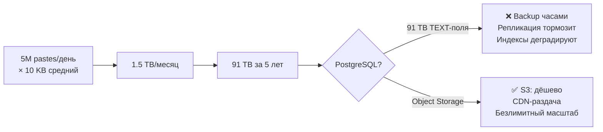
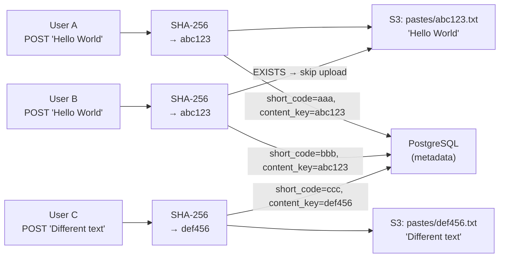
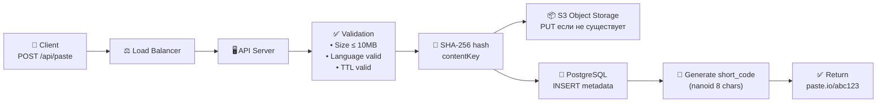
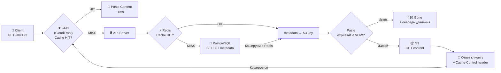
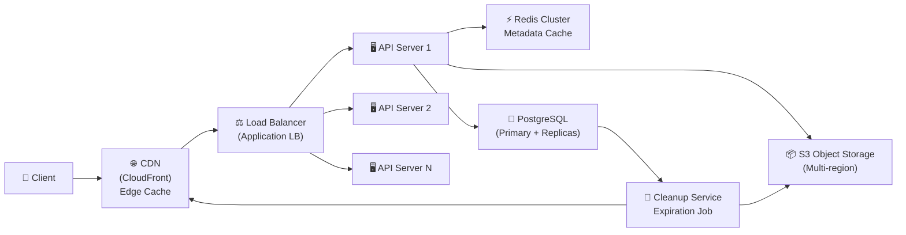
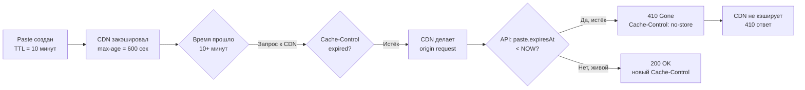

# Уровень 9: Проектируем Paste Service -- хранение текста, дедупликация и TTL

## Введение

Представьте, что вы дежурите в гардеробе театра. Каждый зритель приходит с пальто, сдаёт его и получает номерок. Номерок маленький, его удобно носить в кармане. Пальто хранится на вешалке в отдельном большом помещении. Когда зритель возвращает номерок -- вы достаёте ровно то пальто, которое он сдал.

Paste Service устроен ровно так же. Пользователь «сдаёт» текст (от десяти байт до 10 MB) и получает «номерок» -- короткую ссылку вида `paste.io/abc123`. Текст хранится в специальном «гардеробе» -- Object Storage. Метаданные (кто сдал, когда, на сколько) -- в отдельной быстрой базе данных. Когда кто-то приходит по ссылке, система за долю секунды возвращает нужный текст.

Кажется, что Paste Service проще URL Shortener: не нужно делать 301-редирект, просто отдавай текст. Но именно здесь кроется архитектурная ловушка: контент нужно **хранить самим**. Это меняет всё -- масштаб хранилища, подход к доставке, стратегию дедупликации и логику удаления. Ни одна из этих задач не решается тривиально.

На этом уровне мы разберём:

1. Требования и ограничения сервиса
2. Оценку нагрузки: QPS, хранилище, пропускная способность
3. Главное архитектурное решение -- разделение метаданных и контента
4. Content-Addressable Storage и дедупликацию
5. Полную архитектуру: Write Path и Read Path
6. CDN для доставки контента
7. Cleanup и Expiration
8. Syntax Highlighting -- где и как
9. Частые ошибки и как их избежать

---

## 1. Требования

### Почему начинают с требований, а не с решения?

Типичная ошибка на интервью -- сразу рисовать схему с микросервисами и Kafka. Интервьюер видит это как тревожный знак: кандидат решает задачу, которую сам себе придумал, а не ту, что перед ним. Требования -- это контракт. Пока контракт не зафиксирован, любое решение может оказаться неверным.

Разделение на функциональные и нефункциональные требования -- не бюрократия. Это помогает понять: **что система должна уметь делать** (функциональные) и **как хорошо она должна это делать** (нефункциональные).

### Functional Requirements

Функциональные требования описывают поведение системы с точки зрения пользователя:

1. **Создать paste** -- загрузить текст (до 10 MB), получить уникальную ссылку
2. **Прочитать paste** по ссылке (без авторизации)
3. **Syntax highlighting** для кода (опционально, определяется языком)
4. **Expiration** -- paste с ограниченным сроком жизни (10 мин, 1 час, 1 день, 1 неделя, бессрочно)
5. (Опционально) Приватные pastes -- доступ только по секретному URL
6. (Опционально) Удаление и редактирование автором

Обратите внимание на слово «опционально». На интервью нужно явно спросить: входят ли эти фичи в скоуп? Если да -- как меняется архитектура? Это показывает, что вы думаете о компромиссах, а не просто перечисляете технологии.

### Non-Functional Requirements

Нефункциональные требования -- это ограничения и характеристики качества:

- **Высокая доступность** -- ссылки должны работать 24/7 (99.9%+). Недоступный paste -- это репутационный урон: люди делятся ссылками в публичных чатах
- **Низкая задержка чтения** -- контент за < 200 мс. Чтение доминирует над записью, поэтому именно read path нужно оптимизировать в первую очередь
- **Масштаб** -- 5M+ pastes/день, средний размер 10 KB
- **Read-heavy** -- чтение:запись = 5:1. Это значит, что архитектура должна быть оптимизирована под чтение, а не под запись
- **Durability** -- созданный paste не должен теряться до истечения TTL

Соотношение 5:1 (чтение к записи) -- ключевое число. Оно означает: кэширование даёт огромный выигрыш, потому что одни и те же pastes читают многократно. Архитектурные решения CDN и Redis Cache напрямую следуют из этого числа.

---

## 2. Оценка нагрузки (Capacity Estimation)

### Зачем считать нагрузку до проектирования?

Оценка нагрузки -- это не математический аттракцион. Это способ понять: какой класс решений нам нужен? Если pastes занимают 1 GB за 5 лет -- подойдёт обычный PostgreSQL. Если 91 TB -- только Object Storage. Без этого расчёта невозможно обосновать архитектурное решение.

```typescript
// === Исходные данные ===
const pastesPerDay = 5_000_000        // 5M новых pastes/день
const avgPasteSize = 10 * 1024        // 10 KB средний размер
const readWriteRatio = 5              // 5 чтений на 1 запись
const readsPerDay = 25_000_000        // 25M чтений/день
const retentionYears = 5
const metadataSize = 200              // bytes (URL, title, language, timestamps)

// === QPS (Queries Per Second) ===
const writeQPS = 5_000_000 / 86400    // ~58 writes/sec
const readQPS = writeQPS * 5          // ~290 reads/sec
const peakReadQPS = readQPS * 3       // ~870 reads/sec (пик × 3)

// === Storage ===
// Content (S3 / Object Storage)
const totalPastes = pastesPerDay * 365 * retentionYears  // ~9.1 млрд pastes
const contentStorage = totalPastes * avgPasteSize         // ~91 TB за 5 лет

// Metadata (SQL Database)
const metadataStorage = totalPastes * metadataSize        // ~1.8 TB за 5 лет

// === Bandwidth ===
const incomingBW = writeQPS * avgPasteSize   // ~580 KB/sec (upload)
const outgoingBW = readQPS * avgPasteSize    // ~2.9 MB/sec (download)
const peakOutBW = peakReadQPS * avgPasteSize // ~8.7 MB/sec (пик)

// === Storage per month ===
const storagePerMonth = pastesPerDay * 30 * avgPasteSize  // ~1.5 TB/месяц
```

### Что говорят нам эти числа?

Разберём каждое число и его архитектурное следствие:

| Метрика | Значение | Что это означает |
|---------|----------|-----------------|
| Write QPS | 58/сек | Умеренно. Один PostgreSQL справится |
| Read QPS | 290/сек (пик 870) | Нужен кэш (Redis) + CDN |
| Content storage | 91 TB за 5 лет | SQL не подходит -- только Object Storage |
| Metadata storage | 1.8 TB за 5 лет | Шардированный PostgreSQL справится |
| Incoming bandwidth | ~580 KB/сек | 0.6 Gbps -- стандартный канал |
| Outgoing bandwidth | ~8.7 MB/сек пик | ~70 Mbps -- легко покрывается CDN |

💡 Главный вывод расчётов: **91 TB контента** -- это то самое число, которое делает решение «хранить в PostgreSQL» физически невозможным. Даже при наличии SSD-хранилища, backup одной базы данных объёмом 91 TB займёт десятки часов. Репликация будет постоянно отставать. Индексы на TEXT-поле деградируют. Единственный правильный ответ -- **Object Storage**.



---

## 3. Разделение Metadata и Content

### Главное архитектурное решение

Если бы нужно было назвать одно ключевое решение в дизайне Paste Service -- это разделение метаданных и содержимого на **два разных типа хранилищ**. Всё остальное вытекает из него.

Аналогия: библиотечный каталог и книги. Каталог (метаданные) -- это карточки с названием, автором, шифром и местонахождением книги. Они маленькие, их легко искать и сортировать. Сами книги (контент) хранятся на полках -- большие, тяжёлые, их не нужно сортировать по содержанию, нужно просто взять по известному адресу (полка, ряд, место).

### Почему не хранить текст в базе данных?

Разберём оба подхода честно:

| Подход | Плюсы | Минусы |
|--------|-------|--------|
| Текст в SQL (TEXT/BLOB) | Простота реализации, атомарные транзакции с метаданными, один JOIN вместо двух запросов | БД раздувается до 91 TB, backup/restore занимает часы, репликация постоянно отстаёт, индексы на TEXT неэффективны, дорогое хранилище (SSD vs HDD) |
| Object Storage (S3) | Безлимитное хранение, нативная CDN-интеграция, дёшево (~$0.023/GB/мес), горизонтальный масштаб | Нет транзакций с метаданными, eventual consistency, дополнительная сложность (два хранилища вместо одного) |

Стоимость хранения 91 TB в PostgreSQL на SSD (~$0.10/GB/мес): **~$9,100/месяц**. Стоимость 91 TB в S3 (~$0.023/GB/мес): **~$2,093/месяц**. Разница в 4.3 раза только на хранении, не считая операционных затрат на обслуживание огромной БД.

### Схема данных

```typescript
// Metadata в PostgreSQL -- всё, что нужно для поиска и фильтрации
interface PasteMetadata {
  id: string              // UUID для внутреннего использования
  shortCode: string       // уникальный код для URL: "abc123"
  title?: string          // название paste (опционально)
  language?: string       // язык для syntax highlighting: "typescript", "python"
  contentKey: string      // ключ в S3: "pastes/sha256hash.txt"
  contentSize: number     // размер контента в байтах
  createdAt: Date         // время создания
  expiresAt?: Date        // когда удалить (NULL = бессрочно)
  isPrivate: boolean      // приватный paste
  authorId?: string       // ID автора (если авторизован)
}

// SQL DDL
// CREATE TABLE pastes (
//   id UUID PRIMARY KEY DEFAULT gen_random_uuid(),
//   short_code VARCHAR(8) UNIQUE NOT NULL,
//   title VARCHAR(255),
//   language VARCHAR(50),
//   content_key VARCHAR(128) NOT NULL,   -- ссылка в S3
//   content_size INTEGER NOT NULL,
//   created_at TIMESTAMPTZ DEFAULT NOW(),
//   expires_at TIMESTAMPTZ,              -- NULL = бессрочно
//   is_private BOOLEAN DEFAULT FALSE,
//   author_id UUID
// );
// CREATE INDEX idx_pastes_expires_at ON pastes(expires_at) WHERE expires_at IS NOT NULL;

// Content в S3 -- просто файл с текстом
// PUT s3://paste-bucket/pastes/a1b2c3d4e5.txt → raw text content
```

📌 Ключевое правило: в SQL хранится всё, что нужно для **поиска и фильтрации** (по коду, автору, дате, сроку жизни). В S3 хранится всё, что нужно для **отдачи пользователю** (сам текст). Эти два типа данных никогда не должны меняться местами.

---

## 4. Content-Addressable Storage и дедупликация

### Проблема: повторяющийся контент

Что произойдёт, если 1000 разработчиков скопируют один и тот же популярный snippet кода и создадут 1000 отдельных pastes? По умолчанию -- 1000 идентичных файлов в S3. При средних 10 KB это 10 MB. Умножим на масштаб: если 10% всех pastes -- дубликаты, это 9+ TB лишних данных за 5 лет.

Content-Addressable Storage (CAS) -- это паттерн, где **адрес объекта определяется его содержимым**, а не произвольным идентификатором. Как контрольная сумма файла: если два файла имеют одинаковый SHA-256 -- они идентичны. Значит, хранить их нужно один раз.

### Как работает дедупликация

```typescript
import crypto from 'crypto'
import { S3Client, HeadObjectCommand, PutObjectCommand } from '@aws-sdk/client-s3'

const s3 = new S3Client({ region: 'us-east-1' })
const BUCKET = 'paste-bucket'

async function storePasteContent(text: string): Promise<string> {
  // Шаг 1: Вычисляем SHA-256 от содержимого
  // SHA-256 даёт 64-символьный hex-строку -- это и есть адрес объекта
  const hash = crypto.createHash('sha256').update(text, 'utf8').digest('hex')
  const s3Key = `pastes/${hash}.txt`

  // Шаг 2: Проверяем, существует ли объект в S3 (HEAD-запрос, без загрузки тела)
  // HeadObject стоит в ~10 раз дешевле GetObject по API-тарифам S3
  const exists = await s3
    .send(new HeadObjectCommand({ Bucket: BUCKET, Key: s3Key }))
    .then(() => true)
    .catch(() => false)

  // Шаг 3: Загружаем только если объекта ещё нет
  if (!exists) {
    await s3.send(
      new PutObjectCommand({
        Bucket: BUCKET,
        Key: s3Key,
        Body: text,
        ContentType: 'text/plain; charset=utf-8',
      })
    )
  }

  // Возвращаем ключ -- он будет сохранён в PostgreSQL как content_key
  return s3Key
}
```

### Как выглядит система с дедупликацией



Три paste, три записи в PostgreSQL, но только два файла в S3. У User A и User B разные `short_code` (разные ссылки), разные даты создания, возможно, разные TTL -- но `content_key` у них один и тот же. Метаданные разные, контент общий.

### Проблема reference counting при удалении

Дедупликация создаёт скрытую зависимость: один S3-объект может быть нужен нескольким pastes. Удалить файл из S3 можно только тогда, когда **ни одна живая paste больше на него не ссылается**.

⚠️ Это критично: если вы удалите S3-объект при удалении одной paste, не проверив остальные -- все другие pastes с тем же контентом сломаются. Ссылка будет существовать, но файл отдавать нечего.

Два подхода к решению:

**Подход 1 -- Reference counting (простой, синхронный):**

```typescript
async function safeDeleteContent(contentKey: string, db: Database): Promise<void> {
  // Считаем, сколько живых pastes ещё ссылаются на этот контент
  const { count } = await db.queryOne<{ count: number }>(
    `SELECT COUNT(*) as count
     FROM pastes
     WHERE content_key = $1
       AND (expires_at IS NULL OR expires_at > NOW())`,
    [contentKey]
  )

  // Удаляем из S3 только если никто больше не ссылается
  if (count === 0) {
    await s3.send(new DeleteObjectCommand({ Bucket: BUCKET, Key: contentKey }))
  }
}
```

**Подход 2 -- Garbage Collection (асинхронный, масштабируемый):**

При большом масштабе лучше не проверять reference count при каждом удалении, а периодически сканировать «осиротевшие» объекты в S3 -- те, на которые нет ни одной записи в PostgreSQL. Это называется garbage collection и работает как фоновый процесс раз в несколько часов.

### Коллизии SHA-256 -- теоретический риск

SHA-256 производит 2^256 уникальных значений. Вероятность коллизии при 9 млрд pastes ничтожна -- порядка 10^-60. На практике это не риск. Для систем уровня Paste Service SHA-256 абсолютно надёжен.

---

## 5. Архитектура системы

### Write Path -- создание paste

Проследим путь данных от момента, когда пользователь нажимает «Create», до получения ссылки:



Разберём каждый шаг подробно:

1. **Клиент отправляет** `POST /api/paste` с телом запроса (текст, язык, TTL)
2. **API Server валидирует** -- проверяет размер (≤10 MB), допустимость языка, корректность TTL
3. **Вычисляется SHA-256** от текста -- это будет `contentKey` в S3
4. **S3 upload** -- только если объекта с таким ключом ещё нет (HEAD-check)
5. **PostgreSQL INSERT** -- сохраняем метаданные: `short_code`, `content_key`, `expires_at`
6. **Возвращаем URL** -- `paste.io/{shortCode}`

Шаги 4 и 5 идут параллельно -- нет причин ждать завершения одного перед началом другого:

```typescript
async function createPaste(input: CreatePasteInput): Promise<string> {
  const { text, language, ttlSeconds, isPrivate } = input

  // Параллельно: upload в S3 и генерация short code
  const [contentKey, shortCode] = await Promise.all([
    storePasteContent(text),        // SHA-256 + S3 upload
    generateShortCode(),            // nanoid(8)
  ])

  const expiresAt = ttlSeconds
    ? new Date(Date.now() + ttlSeconds * 1000)
    : null

  await db.query(
    `INSERT INTO pastes (short_code, content_key, content_size, language, expires_at, is_private)
     VALUES ($1, $2, $3, $4, $5, $6)`,
    [shortCode, contentKey, text.length, language, expiresAt, isPrivate]
  )

  return `https://paste.io/${shortCode}`
}
```

### Read Path -- чтение paste



Критически важно заметить: **большинство запросов заканчиваются на CDN**. Если paste популярный и публичный, CDN отдаёт его с ближайшего к пользователю edge-сервера за 1-5 мс. До API Server доходят только:
- Первый запрос к paste (CDN MISS)
- Запросы к приватным pastе (CDN не кэширует)
- Запросы после инвалидации кэша

```typescript
async function getPaste(shortCode: string): Promise<PasteContent | null> {
  // Шаг 1: Проверяем Redis (метаданные, ~1ms)
  const cached = await redis.get(`paste:meta:${shortCode}`)
  let metadata: PasteMetadata

  if (cached) {
    metadata = JSON.parse(cached)
  } else {
    // Шаг 2: Читаем из PostgreSQL (~5ms)
    const row = await db.queryOne(
      'SELECT * FROM pastes WHERE short_code = $1',
      [shortCode]
    )
    if (!row) return null

    metadata = row
    // Кэшируем метаданные в Redis на 5 минут
    await redis.setex(`paste:meta:${shortCode}`, 300, JSON.stringify(metadata))
  }

  // Шаг 3: Проверяем TTL (lazy expiration)
  if (metadata.expiresAt && metadata.expiresAt < new Date()) {
    // Paste истёк, ставим в очередь на удаление
    await cleanupQueue.add({ shortCode, contentKey: metadata.contentKey })
    return null  // API вернёт 410 Gone
  }

  // Шаг 4: Получаем контент из S3 (~20-50ms)
  const content = await s3.send(
    new GetObjectCommand({ Bucket: BUCKET, Key: metadata.contentKey })
  )

  return {
    text: await streamToString(content.Body),
    language: metadata.language,
    createdAt: metadata.createdAt,
  }
}
```

### Полная архитектура



Архитектурные принципы:

- **Stateless API** -- любой сервер может обработать любой запрос, горизонтальное масштабирование без координации
- **Read replicas** -- PostgreSQL Master принимает записи, Replicas обслуживают чтения (write:read = 1:5)
- **Redis Cluster** -- кэш метаданных для горячих pastes, снижает нагрузку на PostgreSQL
- **S3 Multi-region** -- для географически распределённой аудитории, reduce latency

---

## 6. CDN для доставки контента

### Почему CDN критичен для Paste Service

Paste Service -- read-heavy (5:1). Это значит, что большинство работы сервиса -- это отдача одних и тех же байт разным пользователям. CDN (Content Delivery Network) -- это глобально распределённая сеть серверов, которые кэшируют эти байты рядом с пользователями.

Без CDN: пользователь из Токио читает paste с сервера в us-east-1. Round-trip ~150 мс только на сеть, плюс время обработки.

С CDN: paste кэшируется на edge-сервере в Токио. Round-trip ~10 мс. Нагрузка на origin сервер -- ноль.

### Настройка Cache-Control в зависимости от типа paste

```typescript
function setCachingHeaders(res: Response, metadata: PasteMetadata): void {
  if (metadata.isPrivate) {
    // Приватные pastes НИКОГДА не кэшируются на CDN
    // CDN должен видеть этот заголовок и не кэшировать
    res.set({
      'Cache-Control': 'private, no-store',
      'CDN-Cache-Control': 'no-store',
    })
    return
  }

  if (metadata.expiresAt) {
    const secondsUntilExpiry = Math.floor(
      (metadata.expiresAt.getTime() - Date.now()) / 1000
    )

    if (secondsUntilExpiry <= 0) {
      // Paste уже истёк -- не кэшировать
      res.set('Cache-Control', 'no-store')
      return
    }

    // Кэшировать максимум до TTL paste
    // Если paste истечёт через 10 минут -- CDN не должен кэшировать на час
    const cdnMaxAge = Math.min(secondsUntilExpiry, 3600)  // не больше 1 часа для CDN
    const browserMaxAge = Math.min(secondsUntilExpiry, 60) // не больше 1 минуты в браузере

    res.set({
      'Cache-Control': `public, max-age=${browserMaxAge}, stale-while-revalidate=30`,
      'CDN-Cache-Control': `max-age=${cdnMaxAge}`,
    })
  } else {
    // Бессрочные pastes -- долгий кэш
    res.set({
      'Cache-Control': 'public, max-age=3600',
      'CDN-Cache-Control': 'max-age=86400',  // 24 часа на CDN
    })
  }
}
```

### Инвалидация CDN кэша

```typescript
async function invalidateCDNCache(shortCode: string): Promise<void> {
  // CloudFront invalidation -- стоит $0.005 за путь, но необходима
  // Используем при удалении и истечении paste
  await cloudfront.createInvalidation({
    DistributionId: process.env.CLOUDFRONT_DISTRIBUTION_ID!,
    InvalidationBatch: {
      CallerReference: `${shortCode}-${Date.now()}`,
      Paths: {
        Quantity: 1,
        Items: [`/paste/${shortCode}`],
      },
    },
  }).promise()
}
```

📌 Ключевая проблема CDN с TTL: если paste истекает через 10 минут, а CDN закэшировал его на 1 час -- пользователь видит «живой» paste ещё 50 минут после его истечения. Правило: `Cache-Control: max-age` никогда не должен превышать оставшееся время жизни paste.

### Диаграмма: как CDN избегает протухшего кэша



---

## 7. Cleanup и Expiration

### Два подхода к удалению истёкших pastes

Expiration -- это не просто «удалить запись из базы». Нужно:
1. Удалить метаданные из PostgreSQL
2. Удалить контент из S3 (если нет других ссылок)
3. Инвалидировать кэш в Redis
4. Инвалидировать кэш в CDN

**Подход 1 -- Eager deletion (активный Cleanup Job):**

```typescript
// Фоновый процесс, запускается каждые 5 минут
async function cleanupExpiredPastes(): Promise<void> {
  console.log('[Cleanup] Starting expiration scan...')

  // Batch: берём по 1000, чтобы не перегружать БД
  const expired = await db.query<{ short_code: string; content_key: string }>(
    `SELECT short_code, content_key
     FROM pastes
     WHERE expires_at IS NOT NULL
       AND expires_at < NOW()
     LIMIT 1000`
  )

  console.log(`[Cleanup] Found ${expired.length} expired pastes`)

  for (const paste of expired) {
    // Проверяем reference count перед удалением из S3
    const { count } = await db.queryOne<{ count: number }>(
      `SELECT COUNT(*) as count
       FROM pastes
       WHERE content_key = $1
         AND (expires_at IS NULL OR expires_at > NOW())
         AND short_code != $2`,  // исключаем текущий paste
      [paste.content_key, paste.short_code]
    )

    // Удаляем из S3 только если это последняя ссылка
    if (count === 0) {
      await s3.send(
        new DeleteObjectCommand({ Bucket: BUCKET, Key: paste.content_key })
      )
    }

    // Удаляем метаданные из PostgreSQL
    await db.query(
      'DELETE FROM pastes WHERE short_code = $1',
      [paste.short_code]
    )

    // Инвалидируем кэши
    await redis.del(`paste:meta:${paste.short_code}`)
    await invalidateCDNCache(paste.short_code)
  }
}

// Запускаем каждые 5 минут с помощью cron
setInterval(cleanupExpiredPastes, 5 * 60 * 1000)
```

**Подход 2 -- Lazy expiration (проверка при чтении):**

```typescript
async function getPasteOrExpired(shortCode: string): Promise<Response> {
  const metadata = await getMetadata(shortCode)

  if (!metadata) {
    return { status: 404, body: 'Not found' }
  }

  // Lazy check: даже если cleanup job не успел -- проверяем при чтении
  if (metadata.expiresAt && metadata.expiresAt < new Date()) {
    // Ставим в очередь на фоновое удаление (не блокируем ответ)
    cleanupQueue.add({ shortCode, contentKey: metadata.contentKey })

    return { status: 410, body: 'Gone -- paste has expired' }
  }

  // Paste живой, отдаём контент
  const content = await getContentFromS3(metadata.contentKey)
  return { status: 200, body: content }
}
```

💡 **Лучшая практика**: использовать оба подхода одновременно. Cleanup Job убирает истёкшие pastes batch-процессом каждые несколько минут. Lazy check в API гарантирует корректность даже если Cleanup Job задержался. Это называется defence in depth -- два независимых механизма для одного инварианта.

### Стратегия индексов для эффективного Cleanup Job

```sql
-- Partial index: только на строках с конечным TTL
-- Экономит место: бессрочные pastes в индекс не попадают
CREATE INDEX idx_pastes_expiry ON pastes(expires_at)
  WHERE expires_at IS NOT NULL;

-- Для Cleanup Job этот запрос будет использовать idx_pastes_expiry
-- и отсканирует только строки с expires_at < NOW()
EXPLAIN ANALYZE
  SELECT short_code, content_key
  FROM pastes
  WHERE expires_at IS NOT NULL AND expires_at < NOW()
  LIMIT 1000;
```

---

## 8. Syntax Highlighting -- где делать?

### Три подхода и их компромиссы

Syntax highlighting -- наглядный пример того, как одну задачу можно решить на разных уровнях стека. Каждый выбор имеет последствия для производительности, стоимости и UX.

| Подход | Где выполняется | Плюсы | Минусы |
|--------|----------------|-------|--------|
| **Client-side** (Prism.js, highlight.js) | Браузер пользователя | Нет нагрузки на сервер, интерактивная смена темы, простота | Задержка при рендеринге больших файлов (>500KB), JS бандл, не кэшируется CDN |
| **Server-side при создании** | API Server при загрузке | Готовый HTML в S3, мгновенно через CDN, нет JS | Нагрузка при создании, сложно менять тему, две копии контента |
| **Гибрид** | Server создаёт обе версии | Максимальная гибкость | Две копии в S3, сложнее логика |

### Реализация гибридного подхода

```typescript
import { createHighlighter } from 'shiki'

async function createPasteWithHighlighting(
  text: string,
  language?: string
): Promise<PasteKeys> {
  // Всегда сохраняем raw-текст (для скачивания, API доступа)
  const rawKey = await storePasteContent(text)

  let htmlKey: string | undefined

  // Pre-rendered HTML -- только если язык указан явно
  if (language && isSupportedLanguage(language)) {
    const highlighter = await createHighlighter({
      themes: ['github-dark'],
      langs: [language],
    })

    const html = highlighter.codeToHtml(text, {
      lang: language,
      theme: 'github-dark',
    })

    // HTML версия хранится под другим ключом
    htmlKey = await storeContent(html, 'text/html; charset=utf-8')
  }

  return { rawKey, htmlKey }
}

// Клиент выбирает формат через query parameter
// GET /paste/abc123?format=raw  → raw text (для curl, wget, API)
// GET /paste/abc123?format=html → pre-rendered HTML (для браузерного просмотра)
// GET /paste/abc123             → HTML с client-side highlighting
```

Рекомендация для большинства случаев: **client-side highlighting (Prism.js)**. Библиотека весит ~30 KB, подсветка происходит мгновенно для файлов до нескольких сотен килобайт, и это полностью снимает нагрузку с сервера. Server-side стоит рассматривать только если большинство пользователей работает без JavaScript (редкость) или если CDN-кэширование HTML-версии критично для производительности.

---

## 9. Генерация коротких кодов

### Как создать уникальный short_code?

Short code -- это то, что пользователь видит в URL. Требования: уникальность, достаточная длина, случайность (предсказуемые коды -- уязвимость для privacy).

```typescript
import { nanoid } from 'nanoid'

// 8 символов из алфавита [A-Za-z0-9_-]
// Количество возможных комбинаций: 64^8 = ~281 триллион
// При 5M pastes/день до первой коллизии: >150,000 лет
const SHORT_CODE_LENGTH = 8

async function generateShortCode(db: Database): Promise<string> {
  // На практике коллизии крайне маловероятны, но обрабатываем их
  for (let attempt = 0; attempt < 3; attempt++) {
    const code = nanoid(SHORT_CODE_LENGTH)

    // Проверяем уникальность (INSERT с UNIQUE constraint -- ещё проще)
    const existing = await db.queryOne(
      'SELECT 1 FROM pastes WHERE short_code = $1',
      [code]
    )

    if (!existing) return code
  }

  throw new Error('Failed to generate unique short code after 3 attempts')
}

// Альтернатива: полагаться на UNIQUE constraint PostgreSQL
// При вставке с дубликатом -- PostgreSQL вернёт ошибку 23505 (unique_violation)
// Делаем retry с новым nanoid
```

---

## 10. Частые ошибки новичков

### ❌ Ошибка 1: Хранить контент pastes в SQL-базе

Самая распространённая ошибка на интервью -- предложить простую схему с TEXT-полем в PostgreSQL. Звучит разумно, но не выдерживает нагрузки.

```sql
-- ❌ Плохо
CREATE TABLE pastes (
  id UUID PRIMARY KEY,
  content TEXT,          -- 10 KB средний, до 10 MB максимум
  created_at TIMESTAMP
);
-- 91 TB за 5 лет в PostgreSQL
-- Backup: pg_dump 91 TB займёт 10+ часов
-- Репликация: WAL-лог 91 TB данных убивает пропускную способность сети
-- Vacuum: TOAST-таблица для больших TEXT не вакуумируется эффективно
```

```sql
-- ✅ Хорошо: в SQL только метаданные (~200 байт на строку)
CREATE TABLE pastes (
  id UUID PRIMARY KEY DEFAULT gen_random_uuid(),
  short_code VARCHAR(8) UNIQUE NOT NULL,
  content_key VARCHAR(128) NOT NULL,   -- ссылка на S3: "pastes/sha256.txt"
  content_size INTEGER NOT NULL,
  language VARCHAR(50),
  created_at TIMESTAMPTZ DEFAULT NOW(),
  expires_at TIMESTAMPTZ               -- NULL = бессрочно
);
-- Контент в S3: $0.023/GB/мес, нет ограничений, CDN нативно
-- Metadata в PostgreSQL: 1.8 TB -- управляемо, быстрые индексы
```

### ❌ Ошибка 2: Забыть про CDN cache invalidation при expiration

```typescript
// ❌ Плохо: удалили paste, но CDN об этом не знает
async function deletePasteBad(shortCode: string) {
  await db.query('DELETE FROM pastes WHERE short_code = $1', [shortCode])
  await s3.send(new DeleteObjectCommand({ Bucket: BUCKET, Key: contentKey }))
  // Пользователи видят удалённый paste ещё часами через CDN!
}

// ✅ Хорошо: инвалидируем все уровни кэша
async function deletePaste(shortCode: string) {
  const metadata = await db.queryOne(
    'SELECT content_key FROM pastes WHERE short_code = $1',
    [shortCode]
  )

  // 1. Метаданные из PostgreSQL
  await db.query('DELETE FROM pastes WHERE short_code = $1', [shortCode])

  // 2. Контент из S3 (с проверкой reference count)
  await safeDeleteContent(metadata.content_key, db)

  // 3. Кэш в Redis
  await redis.del(`paste:meta:${shortCode}`)

  // 4. Кэш в CDN -- критически важно!
  await invalidateCDNCache(shortCode)
}
```

### ❌ Ошибка 3: Удалять объект из S3 без проверки reference count

```typescript
// ❌ Плохо: 100 pastes ссылаются на один файл (дедупликация)
async function deleteContentBad(contentKey: string) {
  await s3.send(new DeleteObjectCommand({ Bucket: BUCKET, Key: contentKey }))
  // Остальные 99 pastes теперь возвращают 404 из S3 -- сломаны
}

// ✅ Хорошо: проверяем reference count
async function safeDeleteContent(contentKey: string, db: Database) {
  const { count } = await db.queryOne<{ count: number }>(
    `SELECT COUNT(*) as count
     FROM pastes
     WHERE content_key = $1
       AND (expires_at IS NULL OR expires_at > NOW())`,
    [contentKey]
  )

  if (count === 0) {
    // Безопасно: никто больше не ссылается
    await s3.send(new DeleteObjectCommand({ Bucket: BUCKET, Key: contentKey }))
  }
  // Иначе: другие pastes всё ещё живые, оставляем файл
}
```

### ❌ Ошибка 4: Не ограничивать размер paste на уровне API

```typescript
// ❌ Плохо: принимаем любой размер
app.post('/api/paste', express.text(), async (req, res) => {
  const text = req.body  // 500 MB? Пожалуйста!
  // OOM на API-сервере, S3 счёт за хранение огромных файлов
  // Один злоумышленник может положить сервис
})

// ✅ Хорошо: ограничиваем на нескольких уровнях
const MAX_PASTE_SIZE = 10 * 1024 * 1024  // 10 MB

// Уровень 1: HTTP-сервер отвергает большие тела
app.use('/api/paste', express.text({ limit: '10mb' }))

// Уровень 2: Проверяем в бизнес-логике
app.post('/api/paste', async (req, res) => {
  if (!req.body || req.body.length === 0) {
    return res.status(400).json({ error: 'Paste content is required' })
  }

  if (Buffer.byteLength(req.body, 'utf8') > MAX_PASTE_SIZE) {
    return res.status(413).json({
      error: 'Paste too large',
      maxSize: '10 MB',
      actualSize: `${Math.round(Buffer.byteLength(req.body, 'utf8') / 1024)} KB`,
    })
  }

  // Уровень 3: Rate limiting -- не больше 10 pastes/минуту с одного IP
  const isRateLimited = await rateLimiter.check(req.ip)
  if (isRateLimited) {
    return res.status(429).json({ error: 'Too many requests' })
  }

  // Обрабатываем...
})
```

### ❌ Ошибка 5: Кэшировать приватные pastes на CDN

```typescript
// ❌ Плохо: приватный paste попадает в публичный CDN-кэш
async function servePasteBad(shortCode: string, res: Response) {
  const content = await getPaste(shortCode)
  res.set('Cache-Control', 'public, max-age=3600')  // Для всех pastes одинаково!
  res.send(content)
  // Приватный paste теперь доступен без авторизации через CDN!
}

// ✅ Хорошо: дифференцируем кэширование
async function servePaste(shortCode: string, res: Response) {
  const metadata = await getMetadata(shortCode)
  const content = await getContent(metadata.contentKey)

  if (metadata.isPrivate) {
    // Запрещаем любое кэширование для приватных pastes
    res.set({
      'Cache-Control': 'private, no-store',
      'Pragma': 'no-cache',
    })
  } else {
    setCachingHeaders(res, metadata)  // Учитываем TTL
  }

  res.send(content)
}
```

### ❌ Ошибка 6: Не обрабатывать Race Condition при дедупликации

```typescript
// ❌ Плохо: два одновременных запроса с одинаковым текстом
// Оба проверяют "exists?" → оба получают false → оба делают PUT
// Второй PUT перезаписывает первый (безвредно в данном случае, но есть риск)

// ✅ Лучше: использовать S3 условные операции
// S3 поддерживает If-None-Match для предотвращения перезаписи
await s3.send(
  new PutObjectCommand({
    Bucket: BUCKET,
    Key: s3Key,
    Body: text,
    // Если объект существует -- S3 вернёт 412 Precondition Failed
    // Мы игнорируем эту ошибку -- объект уже есть, нам этого достаточно
    IfNoneMatch: '*',
  })
).catch((err) => {
  if (err.name === 'PreconditionFailed') return  // Объект уже существует -- ок
  throw err  // Другие ошибки -- пробрасываем
})
```

---

## Итоги

### Сводная таблица архитектурных решений

| Аспект | Проблема | Решение | Почему |
|--------|----------|---------|--------|
| **Хранение контента** | 91 TB за 5 лет | Object Storage (S3) | Дёшево ($0.023/GB), CDN-интеграция, безлимитный масштаб |
| **Хранение метаданных** | Поиск, фильтрация, TTL | PostgreSQL с индексами | ACID, быстрые запросы, partial index на expires_at |
| **Дедупликация** | Множество копий одного текста | Content-Addressable Storage (SHA-256) | SHA-256(text) = S3 key, одна копия контента |
| **Доставка контента** | Latency, нагрузка на origin | CDN (CloudFront) | Edge-серверы по всему миру, ~1-5 мс для hot pastes |
| **Кэш метаданных** | Нагрузка на PostgreSQL при чтении | Redis | Hot metadata в памяти, ~1 мс вместо ~5 мс |
| **Expiration** | Устаревшие pastes занимают место | Cleanup Job + Lazy Check | Batch-удаление каждые 5 минут + защита при чтении |
| **Syntax Highlighting** | Где рендерить код | Client-side (Prism.js) | Нет нагрузки на сервер, интерактивная смена темы |
| **Масштабирование** | Рост нагрузки | Stateless API + DB Replicas | Горизонтальный scale-out без координации |
| **Приватность** | Приватные pastes в CDN | `Cache-Control: private, no-store` | CDN не кэширует, только авторизованный доступ |

### Главный паттерн урока

Paste Service -- это практическое воплощение паттерна **«metadata в SQL + content в Object Storage»**. Этот же паттерн используется в:

- **Dropbox** -- файлы в S3, метаданные (путь, права доступа, версии) в MySQL
- **GitHub Gists** -- код в Git object storage, метаданные в PostgreSQL
- **Google Docs** -- document data в BigTable/Spanner, метаданные в MySQL
- **Imgur** -- изображения в S3, теги/комментарии/лайки в MySQL

Как только вы видите задачу «хранить большой контент и предоставлять к нему доступ по идентификатору» -- паттерн должен срабатывать автоматически. Метаданные в реляционной базе данных дают вам гибкость запросов. Контент в Object Storage даёт вам масштаб и дешевизну хранения. CDN даёт вам производительность доставки.

💡 **Ключевое отличие Paste Service от URL Shortener**: здесь мы не перенаправляем на чужой ресурс, а **храним сам контент**. Это добавляет три принципиально новых задачи: где хранить (Object Storage), как дедуплицировать (Content-Addressable Storage) и как удалять безопасно (Reference Counting + Cleanup Jobs). Все три задачи решаются стандартными паттернами индустрии, которые вы теперь знаете.
