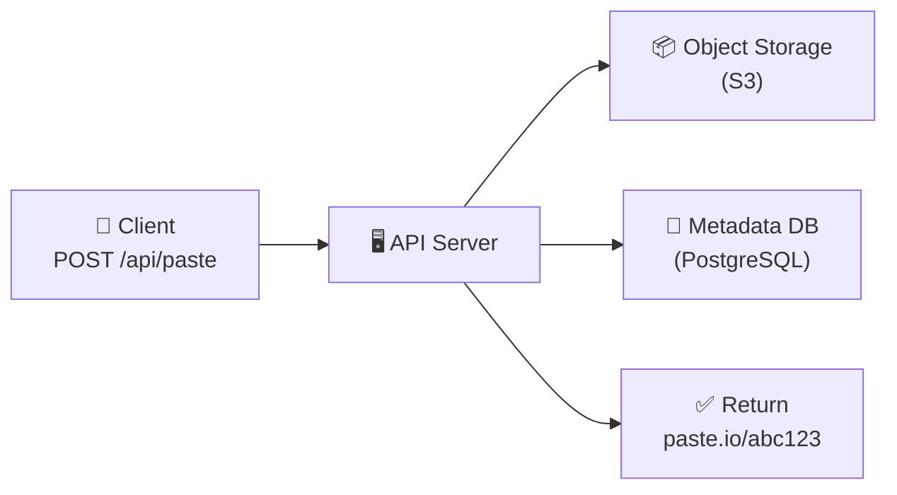
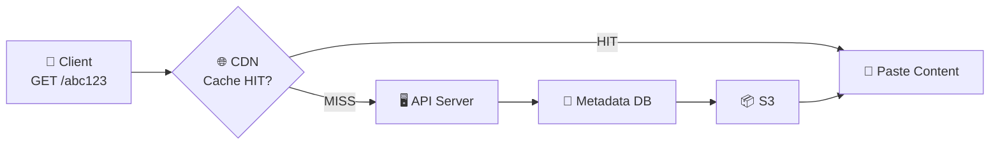
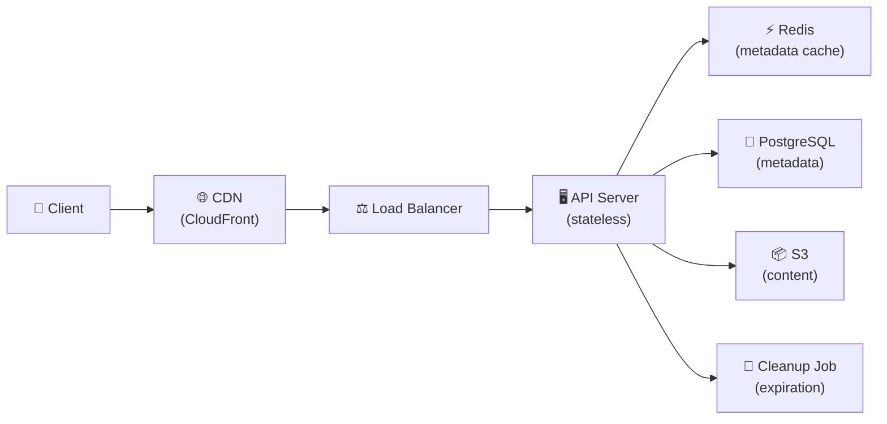

# 🔥 Level 9: Designing a Pastebin / Paste Service

## 🎯 What is this case about?

Pastebin is a service for storing and exchanging text snippets (code snippets, logs, configs). A user pastes text, gets a short link, and anyone can read the content from that link. Sounds simple, but behind it lies an interesting architectural challenge: **separating metadata and content**.

Analogy: Pastebin is like a **left-luggage office at a train station**. You hand in your suitcase (text), get a ticket (link). But unlike a URL Shortener, here we store not a pointer to someone else's resource, but **the content itself**. Suitcases come in different sizes (from 10 bytes to 10 MB), and they need to be stored efficiently, delivered fast, and "expired baggage" must be discarded on time.

## 📌 Step 1: Requirements

### Functional Requirements

1. Create a paste — upload text (up to 10 MB), get a unique link
2. Read a paste by link (no authorization required)
3. Syntax highlighting for code (optional, determined by language)
4. Expiration — paste with a limited lifetime (10 min, 1 hour, 1 day, 1 week, permanent)
5. (Optional) Private pastes — access only by secret URL
6. (Optional) Deletion and editing by the author

### Non-Functional Requirements

- **High availability** — links must work 24/7 (99.9%+)
- **Low read latency** — content in < 200 ms
- **Scale** — 5M+ pastes/day, average size 10 KB
- **Read-heavy** — read:write = 5:1
- **Durability** — created paste must not be lost before TTL expires

## 📌 Step 2: Capacity Estimation

```typescript
// === Input data ===
const pastesPerDay = 5_000_000        // 5M new pastes/day
const avgPasteSize = 10 * 1024        // 10 KB average size
const readWriteRatio = 5              // 5 reads per 1 write
const readsPerDay = 25_000_000        // 25M reads/day
const retentionYears = 5
const metadataSize = 200              // bytes (URL, title, language, timestamps)

// === QPS (Queries Per Second) ===
const writeQPS = 5_000_000 / 86400    // ~58 writes/sec
const readQPS = writeQPS * 5           // ~290 reads/sec
const peakReadQPS = readQPS * 3        // ~870 reads/sec (peak)

// === Storage ===
// Content (S3 / Object Storage)
const totalPastes = pastesPerDay * 365 * retentionYears  // ~9.1 billion pastes
const contentStorage = totalPastes * avgPasteSize         // ~91 TB over 5 years

// Metadata (SQL Database)
const metadataStorage = totalPastes * metadataSize        // ~1.8 TB over 5 years

// === Bandwidth ===
const incomingBW = writeQPS * avgPasteSize  // ~580 KB/sec (upload)
const outgoingBW = readQPS * avgPasteSize   // ~2.9 MB/sec (download)
const peakOutBW = peakReadQPS * avgPasteSize // ~8.7 MB/sec (peak)

// === Storage per month ===
const storagePerMonth = pastesPerDay * 30 * avgPasteSize  // ~1.5 TB/month
```

💡 Key observation: **91 TB of content over 5 years** — this is too much for a regular SQL database. We need Object Storage (S3). But metadata (1.8 TB) — fits comfortably in a sharded SQL database.

## 🔥 Step 3: Separating Metadata and Content

This is the **key architectural decision** of Paste Service — storing metadata and content **separately**.

### Why not store text in the database?

| Approach | Pros | Cons |
|----------|------|------|
| Text in SQL (TEXT/BLOB) | Simplicity, transactions | DB inflates to 91 TB, backup/restore — hours, slow replication |
| Object Storage (S3) | Unlimited storage, CDN delivery, cheap (~$0.023/GB/month) | No transactions with metadata, eventual consistency |

```typescript
// Metadata in PostgreSQL
interface PasteMetadata {
  id: string              // UUID or short code
  shortCode: string       // unique code for URL
  title?: string          // paste title
  language?: string       // language for syntax highlighting
  contentKey: string      // key in S3: "pastes/{hash}.txt"
  contentSize: number     // size in bytes
  createdAt: Date
  expiresAt?: Date        // TTL
  isPrivate: boolean
  authorId?: string
}

// Content in S3
// PUT s3://paste-bucket/pastes/a1b2c3d4e5.txt → the actual text
```

📌 **Rule**: SQL stores everything needed for **search and filtering** (metadata). S3 stores everything needed for **user delivery** (content).

## 🔥 Step 4: Content-Addressable Storage

What if 1000 users paste the same error log? Storing 1000 copies is wasteful. **Content-addressable storage** solves this:

```typescript
import crypto from 'crypto'

async function storePasteContent(text: string): Promise<string> {
  // Key = SHA-256 of content
  const hash = crypto.createHash('sha256').update(text).digest('hex')
  const s3Key = `pastes/${hash}.txt`

  // If this content already exists — don't re-upload
  const exists = await s3.headObject({ Bucket: 'paste-bucket', Key: s3Key })
    .promise()
    .then(() => true)
    .catch(() => false)

  if (!exists) {
    await s3.putObject({
      Bucket: 'paste-bucket',
      Key: s3Key,
      Body: text,
      ContentType: 'text/plain',
    }).promise()
  }

  return s3Key  // Save the key in metadata
}
```

💡 **Deduplication**: if 1000 pastes have the same text — S3 stores only one copy. Metadata is different (different authors, dates, TTL), but `contentKey` points to the same object.

⚠️ When deleting a paste, you cannot immediately delete the object from S3 — other pastes might reference it. You need **reference counting** or **garbage collection**.

## 🔥 Step 5: Architecture

### Write Path — creating a paste



1. Client sends text via `POST /api/paste`
2. API Server computes SHA-256 hash of the content
3. Uploads content to S3 (if this hash doesn't exist yet)
4. Saves metadata to PostgreSQL (shortCode, contentKey, expiresAt)
5. Returns URL: `paste.io/abc123`

### Read Path — reading a paste



1. Client requests `GET /abc123`
2. CDN checks cache — if found, returns instantly
3. Cache miss: API Server reads metadata from PostgreSQL
4. Gets `contentKey` and fetches content from S3
5. Returns to client, CDN caches the response

### Full architecture



## 📌 Step 6: CDN for Content Delivery

Pastes are read much more often than they're written. CDN (CloudFront, Cloudflare) caches popular pastes on edge servers worldwide:

```typescript
// CDN caching configuration
const CDN_CONFIG = {
  // Public pastes: cache on CDN
  publicPaste: {
    'Cache-Control': 'public, max-age=3600',  // 1 hour
    'CDN-Cache-Control': 'max-age=86400',       // 24 hours for CDN
  },
  // Private pastes: do NOT cache on CDN
  privatePaste: {
    'Cache-Control': 'private, no-store',
  },
}

// Invalidation on paste deletion
async function deletePaste(shortCode: string) {
  await db.delete('pastes', { shortCode })
  await cdn.invalidate(`/paste/${shortCode}`)  // Clear CDN cache
}
```

📌 **CDN + TTL problem**: if a paste has a 10-minute TTL, but the CDN cached it for 1 hour — the user will see an "expired" paste. Solutions:
- Set `Cache-Control: max-age` no longer than the paste's TTL
- Use `stale-while-revalidate` for background checks
- For short TTLs — don't cache on CDN at all

## 📌 Step 7: Cleanup and Expiration

```typescript
// Background process to clean up expired pastes
async function cleanupExpiredPastes() {
  // 1. Find expired metadata
  const expired = await db.query(`
    SELECT short_code, content_key
    FROM pastes
    WHERE expires_at < NOW()
    LIMIT 1000
  `)

  for (const paste of expired) {
    // 2. Check reference count for content_key
    const refCount = await db.query(`
      SELECT COUNT(*) FROM pastes
      WHERE content_key = $1 AND expires_at > NOW()
    `, [paste.content_key])

    // 3. If nobody else references it — delete from S3
    if (refCount === 0) {
      await s3.deleteObject({
        Bucket: 'paste-bucket',
        Key: paste.content_key,
      }).promise()
    }

    // 4. Delete metadata
    await db.delete('pastes', { shortCode: paste.short_code })

    // 5. Invalidate cache
    await redis.del(`paste:${paste.short_code}`)
    await cdn.invalidate(`/paste/${paste.short_code}`)
  }
}

// Run every 5 minutes + lazy check on read
```

⚠️ **Lazy expiration**: even if the cleanup job hasn't run yet — on read, check `expiresAt`. If the paste has expired — return 410 Gone and queue for deletion.

## 📌 Step 8: Syntax Highlighting

Where to do syntax highlighting: on the client or the server?

| Approach | Pros | Cons |
|----------|------|------|
| Client-side (Prism.js, highlight.js) | No server load, interactive | Delay rendering large files, not CDN-cached |
| Server-side (on upload) | Ready HTML in S3, instant via CDN | Load on creation, hard to change theme |
| **Hybrid** | Server renders HTML version in S3, client can switch theme | Two copies of content |

```typescript
async function createPaste(text: string, language?: string) {
  // Save raw text
  const rawKey = await storePasteContent(text)

  // Optional: pre-render HTML with highlighting
  if (language) {
    const highlighted = highlighter.highlight(text, { language })
    const htmlKey = await storeContent(highlighted, 'text/html')
    metadata.htmlContentKey = htmlKey
  }

  // Client chooses: ?format=raw or ?format=html
}
```

## ⚠️ Common Beginner Mistakes

### Mistake 1: Storing paste content in SQL database

```
❌ Bad:
CREATE TABLE pastes (
  id UUID PRIMARY KEY,
  content TEXT,          -- 10 KB average, up to 10 MB maximum
  created_at TIMESTAMP
);
-- 91 TB over 5 years in PostgreSQL — hours for backup, replication slows down
```

```
✅ Good:
-- In SQL — only metadata (~200 bytes)
CREATE TABLE pastes (
  id UUID PRIMARY KEY,
  short_code VARCHAR(8) UNIQUE,
  content_key VARCHAR(128),    -- reference to S3
  content_size INTEGER,
  created_at TIMESTAMP,
  expires_at TIMESTAMP
);
-- Content in S3: unlimited, cheap, CDN delivery
```

### Mistake 2: Forgetting CDN cache invalidation on expiration

```
❌ Bad:
// Paste expired → deleted from DB and S3
// But CDN still serves the cached copy!
// User sees a "deleted" paste for hours
```

```
✅ Good:
// On deletion — invalidate CDN
await cdn.invalidate(`/paste/${shortCode}`)
// + Cache-Control: max-age no longer than paste TTL
// + Lazy check: API checks expires_at even on CDN miss
```

### Mistake 3: Deleting S3 object without checking reference count

```
❌ Bad:
// 100 pastes reference the same file in S3 (deduplication)
// Deleted one paste → deleted file from S3
// The other 99 pastes — broken
```

```
✅ Good:
// Check: are there other live pastes with the same content_key?
const refs = await db.count('pastes', { contentKey, expiresAt: { gt: now } })
if (refs === 0) {
  await s3.deleteObject(contentKey)  // Safe to delete
}
```

### Mistake 4: Not limiting paste size

```
❌ Bad:
app.post('/api/paste', (req, res) => {
  const text = req.body.content  // 500 MB paste? Sure!
  // OOM, disk full, S3 bill in thousands of $
})
```

```
✅ Good:
const MAX_PASTE_SIZE = 10 * 1024 * 1024  // 10 MB
app.post('/api/paste', express.text({ limit: '10mb' }), (req, res) => {
  if (req.body.length > MAX_PASTE_SIZE) {
    return res.status(413).json({ error: 'Paste too large (max 10 MB)' })
  }
})
```

## 🎯 Summary

| Aspect | Solution |
|--------|----------|
| **Content storage** | Object Storage (S3) — unlimited, cheap, CDN integration |
| **Metadata storage** | PostgreSQL — search, filtering, TTL indexes |
| **Deduplication** | Content-Addressable Storage (SHA-256 hash = S3 key) |
| **Delivery** | CDN (CloudFront) — caches popular pastes on edge |
| **Expiration** | Cleanup job (every 5 min) + lazy check on read |
| **Syntax highlighting** | Client-side (Prism.js) or hybrid (pre-rendered HTML in S3) |
| **Scaling** | Stateless API + DB sharding + S3 (infinite storage) |

💡 The key difference from URL Shortener: here we **store the content itself**, not a pointer. This changes everything — we need Object Storage, CDN, cleanup jobs, deduplication. The "metadata in SQL + content in S3" pattern is one of the most common in the industry (this is how Dropbox, GitHub Gists, and Google Docs work).