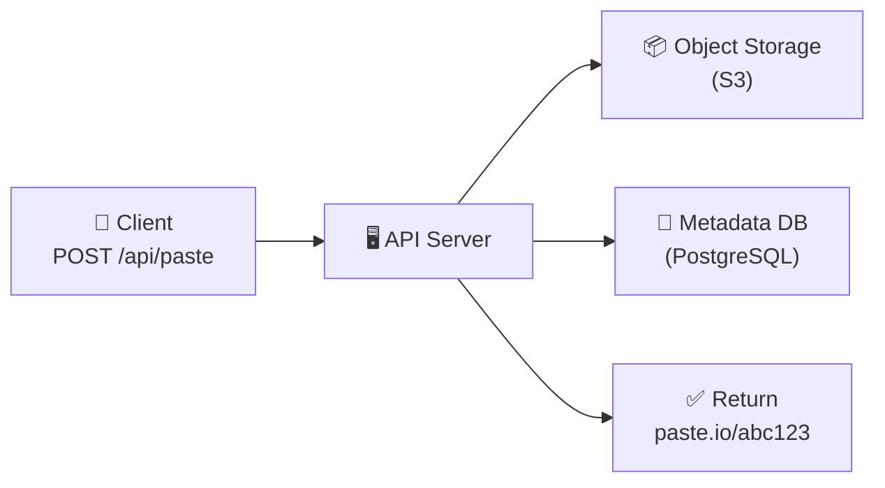
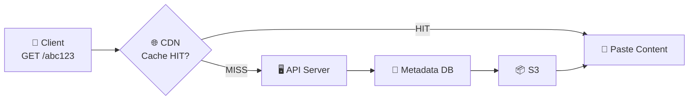
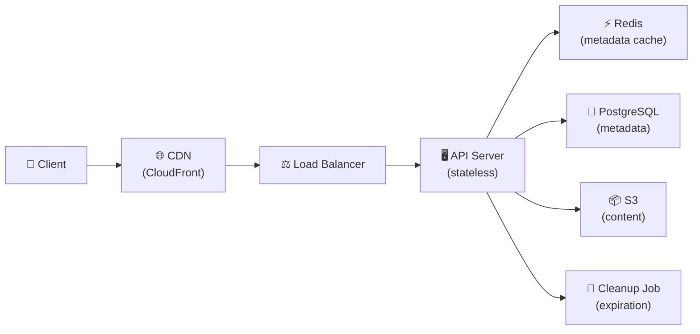

# 🔥 Уровень 9: Проектируем Pastebin / Paste Service

## 🎯 О чём этот кейс?

Pastebin — сервис для хранения и обмена текстовыми фрагментами (сниппетами кода, логами, конфигами). Пользователь вставляет текст, получает короткую ссылку, по которой любой может прочитать содержимое. Звучит просто, но за этим стоит интересная архитектурная задача: **разделение метаданных и контента**.

Аналогия: Pastebin — это **камера хранения на вокзале**. Вы сдаёте чемодан (текст), получаете номерок (ссылку). Но в отличие от URL Shortener, здесь мы храним не указатель на чужой ресурс, а **сам контент**. Чемоданы бывают разных размеров (от 10 байт до 10 MB), и их нужно хранить эффективно, раздавать быстро и не забывать выкидывать «просроченный багаж».

## 📌 Шаг 1: Требования

### Functional Requirements

1. Создать paste — загрузить текст (до 10 MB), получить уникальную ссылку
2. Прочитать paste по ссылке (без авторизации)
3. Syntax highlighting для кода (опционально, определяется языком)
4. Expiration — paste с ограниченным сроком жизни (10 мин, 1 час, 1 день, 1 неделя, бессрочно)
5. (Опционально) Приватные pastes — доступ только по секретному URL
6. (Опционально) Удаление и редактирование автором

### Non-Functional Requirements

- **Высокая доступность** — ссылки должны работать 24/7 (99.9%+)
- **Низкая задержка чтения** — контент за < 200 мс
- **Масштаб** — 5M+ pastes/день, средний размер 10 KB
- **Read-heavy** — чтение:запись = 5:1
- **Durability** — созданный paste не должен теряться до истечения TTL

## 📌 Шаг 2: Capacity Estimation

```typescript
// === Исходные данные ===
const pastesPerDay = 5_000_000        // 5M новых pastes/день
const avgPasteSize = 10 * 1024        // 10 KB средний размер
const readWriteRatio = 5              // 5 чтений на 1 запись
const readsPerDay = 25_000_000        // 25M чтений/день
const retentionYears = 5
const metadataSize = 200              // bytes (URL, title, language, timestamps)

// === QPS (Queries Per Second) ===
const writeQPS = 5_000_000 / 86400    // ~58 writes/sec
const readQPS = writeQPS * 5           // ~290 reads/sec
const peakReadQPS = readQPS * 3        // ~870 reads/sec (пик)

// === Storage ===
// Content (S3 / Object Storage)
const totalPastes = pastesPerDay * 365 * retentionYears  // ~9.1 млрд pastes
const contentStorage = totalPastes * avgPasteSize         // ~91 TB за 5 лет

// Metadata (SQL Database)
const metadataStorage = totalPastes * metadataSize        // ~1.8 TB за 5 лет

// === Bandwidth ===
const incomingBW = writeQPS * avgPasteSize  // ~580 KB/sec (upload)
const outgoingBW = readQPS * avgPasteSize   // ~2.9 MB/sec (download)
const peakOutBW = peakReadQPS * avgPasteSize // ~8.7 MB/sec (пик)

// === Storage per month ===
const storagePerMonth = pastesPerDay * 30 * avgPasteSize  // ~1.5 TB/месяц
```

💡 Ключевое наблюдение: **91 TB контента за 5 лет** — это слишком много для обычной SQL-базы. Нужен Object Storage (S3). А вот метаданные (1.8 TB) — вполне влезают в шардированную SQL-базу.

## 🔥 Шаг 3: Разделение Metadata и Content

Это **главное архитектурное решение** Paste Service — хранить метаданные и содержимое **отдельно**.

### Почему не хранить текст в базе данных?

| Подход | Плюсы | Минусы |
|--------|-------|--------|
| Текст в SQL (TEXT/BLOB) | Простота, транзакции | БД раздувается до 91 TB, backup/restore — часы, репликация медленная |
| Object Storage (S3) | Безлимитное хранение, CDN-раздача, дёшево (~$0.023/GB/мес) | Нет транзакций с метаданными, eventual consistency |

```typescript
// Metadata в PostgreSQL
interface PasteMetadata {
  id: string              // UUID или short code
  shortCode: string       // уникальный код для URL
  title?: string          // название paste
  language?: string       // язык для syntax highlighting
  contentKey: string      // ключ в S3: "pastes/{hash}.txt"
  contentSize: number     // размер в байтах
  createdAt: Date
  expiresAt?: Date        // TTL
  isPrivate: boolean
  authorId?: string
}

// Content в S3
// PUT s3://paste-bucket/pastes/a1b2c3d4e5.txt → сам текст
```

📌 **Правило**: в SQL хранится всё, что нужно для **поиска и фильтрации** (метаданные). В S3 хранится всё, что нужно для **отдачи пользователю** (контент).

## 🔥 Шаг 4: Content-Addressable Storage

Что если 1000 пользователей вставят один и тот же лог ошибки? Хранить 1000 копий — расточительно. **Content-addressable storage** решает это:

```typescript
import crypto from 'crypto'

async function storePasteContent(text: string): Promise<string> {
  // Ключ = SHA-256 от содержимого
  const hash = crypto.createHash('sha256').update(text).digest('hex')
  const s3Key = `pastes/${hash}.txt`

  // Если такой контент уже есть — не загружаем повторно
  const exists = await s3.headObject({ Bucket: 'paste-bucket', Key: s3Key })
    .promise()
    .then(() => true)
    .catch(() => false)

  if (!exists) {
    await s3.putObject({
      Bucket: 'paste-bucket',
      Key: s3Key,
      Body: text,
      ContentType: 'text/plain',
    }).promise()
  }

  return s3Key  // Сохраняем ключ в metadata
}
```

💡 **Дедупликация**: если 1000 pastes имеют одинаковый текст — в S3 хранится только одна копия. Метаданные разные (разные авторы, даты, TTL), но `contentKey` указывает на один и тот же объект.

⚠️ При удалении paste нельзя сразу удалять объект из S3 — возможно, другие pastes ссылаются на него. Нужен **reference counting** или **garbage collection**.

## 🔥 Шаг 5: Архитектура

### Write Path — создание paste



1. Client отправляет текст через `POST /api/paste`
2. API Server вычисляет SHA-256 хеш контента
3. Загружает контент в S3 (если такого хеша ещё нет)
4. Сохраняет метаданные в PostgreSQL (shortCode, contentKey, expiresAt)
5. Возвращает URL: `paste.io/abc123`

### Read Path — чтение paste



1. Client запрашивает `GET /abc123`
2. CDN проверяет кэш — если есть, отдаёт мгновенно
3. Cache miss: API Server читает метаданные из PostgreSQL
4. Получает `contentKey` и загружает контент из S3
5. Возвращает клиенту, CDN кэширует ответ

### Полная архитектура



## 📌 Шаг 6: CDN для доставки контента

Pastes читают гораздо чаще, чем пишут. CDN (CloudFront, Cloudflare) кэширует популярные pastes на edge-серверах по всему миру:

```typescript
// Настройка CDN caching
const CDN_CONFIG = {
  // Публичные pastes: кэшировать на CDN
  publicPaste: {
    'Cache-Control': 'public, max-age=3600',  // 1 час
    'CDN-Cache-Control': 'max-age=86400',       // 24 часа для CDN
  },
  // Приватные pastes: НЕ кэшировать на CDN
  privatePaste: {
    'Cache-Control': 'private, no-store',
  },
}

// Инвалидация при удалении paste
async function deletePaste(shortCode: string) {
  await db.delete('pastes', { shortCode })
  await cdn.invalidate(`/paste/${shortCode}`)  // Очистить кэш CDN
}
```

📌 **Проблема CDN с TTL**: если paste имеет TTL 10 минут, а CDN закэшировал на 1 час — пользователь увидит «протухший» paste. Решения:
- Устанавливать `Cache-Control: max-age` не больше TTL paste
- Использовать `stale-while-revalidate` для фоновой проверки
- Для коротких TTL — не кэшировать на CDN вовсе

## 📌 Шаг 7: Cleanup и Expiration

```typescript
// Фоновый процесс удаления протухших pastes
async function cleanupExpiredPastes() {
  // 1. Находим протухшие метаданные
  const expired = await db.query(`
    SELECT short_code, content_key
    FROM pastes
    WHERE expires_at < NOW()
    LIMIT 1000
  `)

  for (const paste of expired) {
    // 2. Проверяем reference count для content_key
    const refCount = await db.query(`
      SELECT COUNT(*) FROM pastes
      WHERE content_key = $1 AND expires_at > NOW()
    `, [paste.content_key])

    // 3. Если никто больше не ссылается — удаляем из S3
    if (refCount === 0) {
      await s3.deleteObject({
        Bucket: 'paste-bucket',
        Key: paste.content_key,
      }).promise()
    }

    // 4. Удаляем метаданные
    await db.delete('pastes', { shortCode: paste.short_code })

    // 5. Инвалидируем кэш
    await redis.del(`paste:${paste.short_code}`)
    await cdn.invalidate(`/paste/${paste.short_code}`)
  }
}

// Запуск каждые 5 минут + lazy check при чтении
```

⚠️ **Lazy expiration**: даже если cleanup job не успел — при чтении проверяем `expiresAt`. Если paste протух — возвращаем 410 Gone и ставим в очередь на удаление.

## 📌 Шаг 8: Syntax Highlighting

Подсветка синтаксиса — где делать: на клиенте или сервере?

| Подход | Плюсы | Минусы |
|--------|-------|--------|
| Client-side (Prism.js, highlight.js) | Нет нагрузки на сервер, интерактивно | Задержка при рендеринге больших файлов, не кэшируется CDN |
| Server-side (при загрузке) | Готовый HTML в S3, мгновенно через CDN | Нагрузка при создании, сложно менять тему |
| **Гибрид** | Server рендерит HTML-версию в S3, client может переключать тему | Две копии контента |

```typescript
async function createPaste(text: string, language?: string) {
  // Сохраняем raw-текст
  const rawKey = await storePasteContent(text)

  // Опционально: pre-render HTML с подсветкой
  if (language) {
    const highlighted = highlighter.highlight(text, { language })
    const htmlKey = await storeContent(highlighted, 'text/html')
    metadata.htmlContentKey = htmlKey
  }

  // Клиент выбирает: ?format=raw или ?format=html
}
```

## ⚠️ Частые ошибки новичков

### Ошибка 1: Хранить контент pastes в SQL-базе

```
❌ Плохо:
CREATE TABLE pastes (
  id UUID PRIMARY KEY,
  content TEXT,          -- 10 KB средний, до 10 MB максимум
  created_at TIMESTAMP
);
-- 91 TB за 5 лет в PostgreSQL — backup часами, репликация тормозит
```

```
✅ Хорошо:
-- В SQL — только метаданные (~200 байт)
CREATE TABLE pastes (
  id UUID PRIMARY KEY,
  short_code VARCHAR(8) UNIQUE,
  content_key VARCHAR(128),    -- ссылка на S3
  content_size INTEGER,
  created_at TIMESTAMP,
  expires_at TIMESTAMP
);
-- Контент в S3: безлимитно, дёшево, CDN-раздача
```

### Ошибка 2: Забыть про CDN cache invalidation при expiration

```
❌ Плохо:
// Paste протух → удалили из БД и S3
// Но CDN всё ещё отдаёт кэшированную копию!
// Пользователь видит «удалённый» paste ещё часами
```

```
✅ Хорошо:
// При удалении — инвалидировать CDN
await cdn.invalidate(`/paste/${shortCode}`)
// + Cache-Control: max-age не больше TTL paste
// + Lazy check: API проверяет expires_at даже при CDN miss
```

### Ошибка 3: Удалять объект из S3 без проверки reference count

```
❌ Плохо:
// 100 pastes ссылаются на один файл в S3 (дедупликация)
// Удалили один paste → удалили файл из S3
// Остальные 99 pastes — сломаны
```

```
✅ Хорошо:
// Проверяем: есть ли другие живые pastes с тем же content_key?
const refs = await db.count('pastes', { contentKey, expiresAt: { gt: now } })
if (refs === 0) {
  await s3.deleteObject(contentKey)  // Безопасно удалять
}
```

### Ошибка 4: Не ограничивать размер paste

```
❌ Плохо:
app.post('/api/paste', (req, res) => {
  const text = req.body.content  // 500 MB paste? Пожалуйста!
  // OOM, диск забит, S3 счёт на тысячи $
})
```

```
✅ Хорошо:
const MAX_PASTE_SIZE = 10 * 1024 * 1024  // 10 MB
app.post('/api/paste', express.text({ limit: '10mb' }), (req, res) => {
  if (req.body.length > MAX_PASTE_SIZE) {
    return res.status(413).json({ error: 'Paste too large (max 10 MB)' })
  }
})
```

## 🎯 Итоги

| Аспект | Решение |
|--------|---------|
| **Хранение контента** | Object Storage (S3) — безлимитно, дёшево, CDN-интеграция |
| **Хранение метаданных** | PostgreSQL — поиск, фильтрация, TTL-индексы |
| **Дедупликация** | Content-Addressable Storage (SHA-256 hash = S3 key) |
| **Доставка** | CDN (CloudFront) — кэширует популярные pastes на edge |
| **Expiration** | Cleanup job (каждые 5 мин) + lazy check при чтении |
| **Syntax highlighting** | Client-side (Prism.js) или гибрид (pre-rendered HTML в S3) |
| **Масштабирование** | Stateless API + DB sharding + S3 (бесконечное хранилище) |

💡 Главное отличие от URL Shortener: здесь мы **храним сам контент**, а не указатель. Это меняет всё — нужен Object Storage, CDN, cleanup jobs, дедупликация. Паттерн «metadata в SQL + content в S3» — один из самых распространённых в индустрии (так устроены Dropbox, GitHub Gists, Google Docs).
