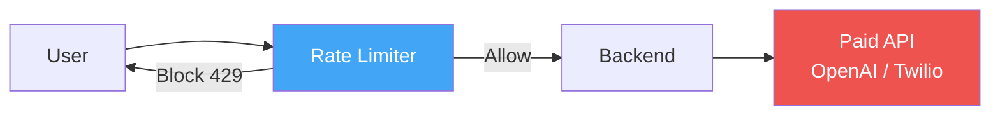
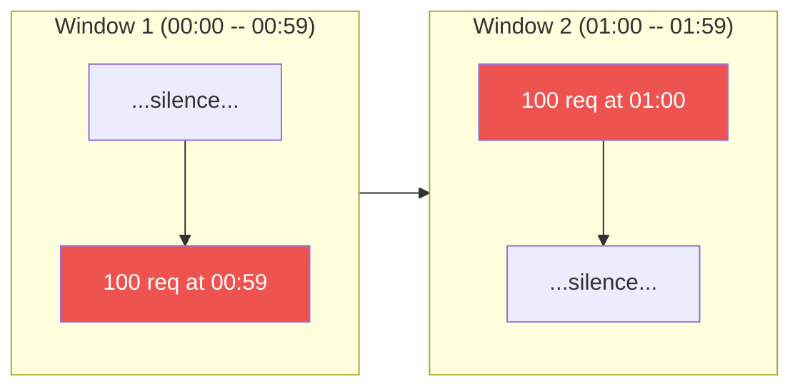
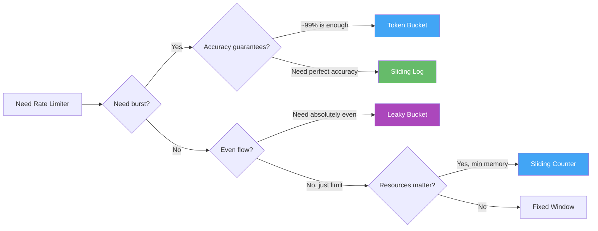
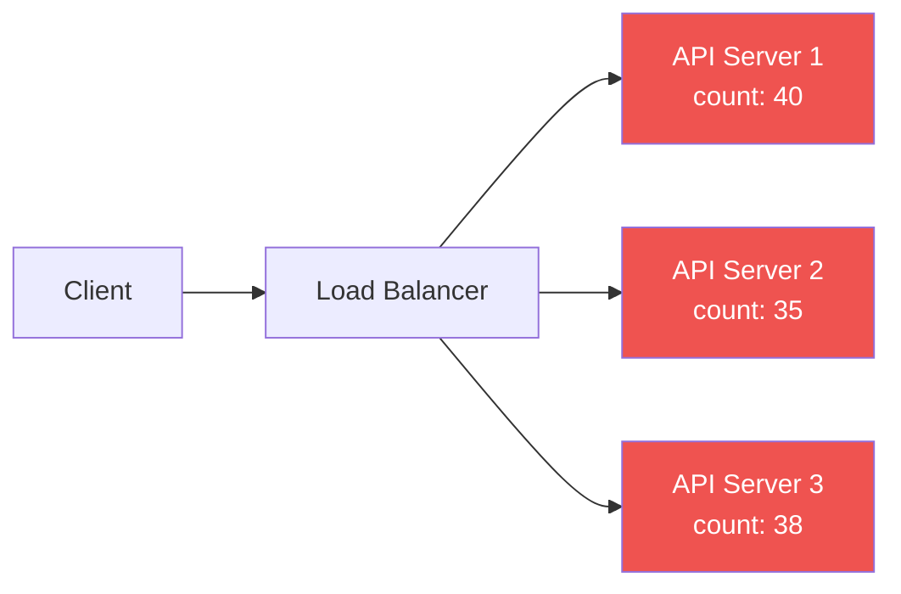
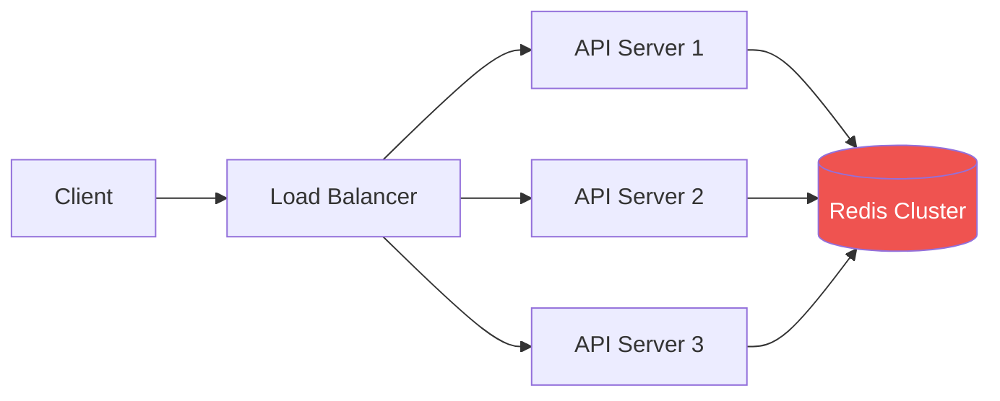
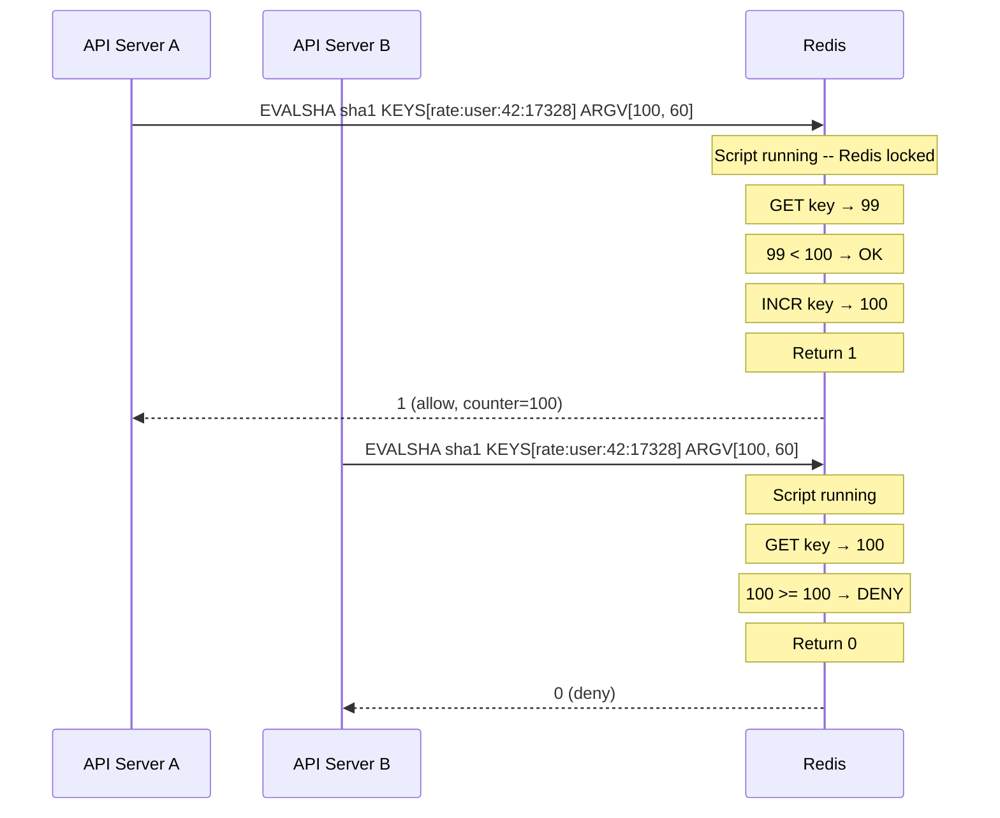

# Level 10: Designing a Rate Limiter -- Limiting Algorithms and Distributed Implementation

## Introduction

Imagine you open a popular restaurant. One morning, 500 people arrive simultaneously -- all wanting breakfast right now. The kitchen physically can't handle 500 orders in 5 minutes. What does the host do? They politely ask people to wait outside, admit visitors in small groups, and tell the rest: "Please wait 15 minutes, tables should free up by then."

A Rate Limiter is exactly that host for your API. It doesn't decide who can enter (that's authorization). It controls the **flow rate** -- so backend servers don't choke under load, and legitimate users get a stable service.

But in distributed systems, the task becomes harder. Imagine 10 hosts at 10 different restaurant entrances, who must collectively admit no more than 1,000 people per hour. Each host counts "their" visitors, but how do they know about visitors admitted by colleagues? This is what a **Distributed Rate Limiter** solves.

In this level we'll cover everything from first principles to production implementation:

1. Five classic algorithms -- with mechanics, pros, cons, and real examples
2. Algorithm comparison -- table and decision tree
3. Distributed Rate Limiting -- why Redis and why Lua
4. Race conditions -- one of the most common bugs in systems with shared state
5. HTTP protocol -- correct headers and response codes
6. Multi-tier Rate Limiting -- multiple protection levels in real systems

---

## 1. Why Rate Limiting?

Before diving into algorithms, it's important to understand exactly what problems a Rate Limiter protects against. There are several, and they differ in nature.

### 1.1 Protection from Unintentional Overload

Most load problems aren't malicious -- they're client code errors. A developer wrote a loop with HTTP requests without delays. Or retry logic without exponential backoff started sending requests at 1,000/sec. Or a new feature launched for all users at once, and they all pressed the button simultaneously.

A Rate Limiter is a safety valve. Even if a client does something wrong, the system remains stable.

### 1.2 Protection from Abuse and DDoS

Intentional attacks -- data scraping, brute-force passwords, DDoS -- these are also requests. Without Rate Limiting, one attacker can occupy all your server's threads, leaving legitimate users without responses.

Important nuance: Rate Limiter isn't full DDoS protection. Specialized solutions (Cloudflare, AWS Shield) operate at the network level and can distinguish botnets from real traffic. But Rate Limiter is a mandatory first line of defense.

### 1.3 Fair Resource Distribution

If you have a SaaS with pricing tiers (Free, Pro, Enterprise), Rate Limiter is the technical tool for implementing SLA. A Free user gets 100 requests/minute, Enterprise gets 10,000. Without limits, one heavy user on a Free tier can "consume" resources that affect paying customers.

### 1.4 Protecting Paid External APIs

If your backend calls OpenAI, Twilio, Stripe, or any other paid API -- every request costs money. Without Rate Limiting at your service level, one bug in a client application can result in a bill of thousands of dollars in one day.



### 1.5 Predictability and Compliance

SLA contracts often contain availability guarantees (99.9%, 99.99%). If one client can unlimitedly load the system, these guarantees become empty words. Rate Limiting is the technical mechanism that makes SLA real.

---

## 2. Rate Limiting Algorithms

There are five main algorithms. Each is a compromise between accuracy, memory consumption, implementation simplicity, and ability to handle burst load.

### 2.1 Fixed Window Counter

The simplest algorithm. Time is divided into fixed windows of equal size (e.g., every minute). For each user in each window, a request counter is kept.

**Mental model:** imagine a sheet of paper with a timeline divided into 60-second cells. In each cell, write the number of requests from a user. If the number >= limit -- deny. At the start of a new cell, the number resets to zero.

```typescript
// Fixed Window -- concept
const WINDOW_SIZE = 60  // 60 seconds
const MAX_REQUESTS = 100

function fixedWindow(userId: string, now: number): boolean {
  // Current window number (0, 1, 2, ... -- changes every 60 seconds)
  const windowKey = Math.floor(now / WINDOW_SIZE)
  const key = `rate:${userId}:${windowKey}`

  const count = redis.incr(key)
  if (count === 1) {
    // First request in window -- set TTL
    redis.expire(key, WINDOW_SIZE)
  }

  return count <= MAX_REQUESTS  // true = allow
}
```

Why `incr` returns a value and `expire` is set when count === 1? Because `INCR` is an atomic Redis operation. If the key doesn't exist, Redis creates it with value 0, then increments. We set expire only on the first request so the key is automatically deleted after the window ends.

**Critical problem -- boundary burst:**

If the limit is 100 req/min, a client can send 100 requests at 00:59 (last second of the first window) and 100 requests at 01:00 (first second of the new window). Both times the counter doesn't exceed the limit -- but 200 requests passed in real 2 seconds.



This isn't a theoretical problem. A bot can exploit this effect deliberately, synchronizing requests with window boundaries. With a limit of 100 req/min, the actual throughput under such an attack is 200 req in 2 seconds, i.e., 6,000 req/min.

**When to use:** only for simple internal APIs where slight limit overruns aren't critical and you want minimal implementation complexity.

---

### 2.2 Sliding Window Log

Instead of a counter, **timestamps (time marks) of each request** are stored. On a new request, the algorithm removes all marks older than the window and counts the remaining ones.

**Mental model:** a cash register receipt tape. Each request is a new entry with a time. Want to understand how many requests in the last 60 seconds? Tear off the "tail" older than 60 seconds and count the remaining lines.

```typescript
// Sliding Window Log -- concept
// Redis Sorted Set: score = timestamp, member = unique request ID
function slidingWindowLog(userId: string, now: number): boolean {
  const key = `rate:${userId}`
  const windowStart = now - 60  // 60 seconds ago

  // Remove all marks older than 60 seconds
  // zremrangebyscore works atomically in pipeline
  redis.zremrangebyscore(key, 0, windowStart)

  // Count remaining marks (all within the window)
  const count = redis.zchar(key)

  if (count < MAX_REQUESTS) {
    // Add current request mark
    // Score = timestamp, member = unique ID (to avoid collisions)
    redis.zadd(key, now, `${now}:${Math.random()}`)
    redis.expire(key, 60)
    return true
  }
  return false
}
```

Redis Sorted Set is ideal for this algorithm: `ZREMRANGEBYSCORE` removes records by score (timestamp) in O(log N + M), where M is the number of removed records. `ZCARD` returns the element count in O(1).

Accurate counting, no boundary burst.
Reals -- client can't exploit boundaries.
High memory consumption: O(N) per user, where N is the request limit. With a limit of 10,000 req/min for 1 million users, storing all marks becomes a problem.
Write operations on every request (zadd + zremrangebyscore), not just incr.

**When to use:** financial systems, banks, any critical APIs where accuracy is more important than memory usage.

---

### 2.3 Sliding Window Counter

A compromise between Fixed Window (fast but inaccurate) and Sliding Log (accurate but expensive). Idea: use **two adjacent fixed windows** and compute a weighted sum of requests.

**Algorithm mathematics:**

If we're at the 70% mark of the current window (elapsed = 0.7), then the previous window weighs 30% (1 - 0.7 = 0.3), and the current one weighs 100%. Weighted estimate:

```
estimate = prevCount * (1 - elapsed) + currCount
```

**Mental model:** you're standing at an airport looking at the departure board: "How many planes took off in the last 60 minutes?" Instead of an exact log of every departure, you look at two hours -- previous and current -- and take a weighted sum. It's an approximation, but very close to reality.

```typescript
// Sliding Window Counter -- concept
function slidingWindowCounter(userId: string, now: number): boolean {
  const currentWindow = Math.floor(now / WINDOW_SIZE)
  const prevWindow = currentWindow - 1

  // What fraction of the current window has passed (0.0 -- 1.0)
  // For example, if it's the 42nd second of the minute: elapsed = 42/60 = 0.7
  const elapsed = (now % WINDOW_SIZE) / WINDOW_SIZE

  const prevCount = Number(redis.get(`rate:${userId}:${prevWindow}`) || 0)
  const currCount = Number(redis.get(`rate:${userId}:${currentWindow}`) || 0)

  // The further we are in the current window, the less weight the previous one has
  // At window start (elapsed ≈ 0): estimate ≈ prevCount + 0
  // At window end   (elapsed ≈ 1): estimate ≈ 0 + currCount
  const estimate = prevCount * (1 - elapsed) + currCount

  if (estimate < MAX_REQUESTS) {
    redis.incr(`rate:${userId}:${currentWindow}`)
    return true
  }
  return false
}
```

**How accurate is the algorithm?** Cloudflare conducted a mathematical analysis and showed that in the worst case, the error is no more than 0.003% (~0.3 per mille). For the vast majority of production scenarios, this is an insignificant error.

This is the algorithm used by **Cloudflare**, **Redis Rate Limiter**, and most modern API gateways. Best ratio of accuracy to resources.

---

### 2.4 Token Bucket

A conceptually different approach. Imagine a bucket with tokens:

- The bucket fills at a rate of RATE tokens per second
- The bucket has a maximum capacity of BURST tokens
- Each incoming request takes one token
- If the bucket is empty -- the request is denied

**Mental model:** a bank account with fixed income. Every second, 10 rubles are credited to the account (RATE). Maximum balance is 50 rubles (BURST -- "accumulated" tokens). Each purchase costs 1 ruble. If there's no money -- the transaction is denied. You can save up to 50 rubles and spend them all at once (burst).

```typescript
// Token Bucket -- concept
interface Bucket {
  tokens: number      // current token count
  lastRefill: number  // UNIX timestamp of last refill
}

const RATE = 10   // 10 tokens/sec (refill rate)
const BURST = 50  // maximum 50 tokens in bucket

function tokenBucket(bucket: Bucket, now: number): boolean {
  // How much time has passed since last refill (in seconds)
  const elapsed = now - bucket.lastRefill

  // Refill the bucket proportional to elapsed time
  // Math.min -- don't exceed maximum capacity
  bucket.tokens = Math.min(BURST, bucket.tokens + elapsed * RATE)
  bucket.lastRefill = now

  // Check: is there at least one token?
  if (bucket.tokens >= 1) {
    bucket.tokens -= 1  // take a token
    return true         // request allowed
  }
  return false  // bucket empty -- request denied
}
```

Key property of Token Bucket -- **controlled burst**. If the user hasn't made requests for 5 seconds, their bucket filled to 50 tokens. They can instantly send 50 requests -- and this is legitimate, it's built into the design. After that, requests are processed evenly at the RATE frequency.

**Why is this important for UX?** Real users don't make requests at perfectly even intervals. They open a page -- 5 requests in 100ms. Then read for a minute. Then 3 more requests. Token Bucket reflects this behavior better than a "rigid" limit.

Controlled burst (up to BURST requests instantly).
Smooth long-term rate -- after burst, requests pass exactly at RATE frequency.
Intuitive for product managers: "10 requests per second, burst up to 50."
Used in **AWS API Gateway**, **Stripe**, **GitHub API**, **Google Cloud**.

---

### 2.5 Leaky Bucket

Reverse analogy to Token Bucket. Requests "pour" into a bucket (queue), and "leak" at a constant rate. If the bucket overflows -- new requests are discarded.

**Mental model:** a drain. Water (requests) arrives at any rate. The drain hole (LEAK_RATE) is always the same size. If more water arrives than can drain, the bathtub (BUCKET_SIZE) overflows and water spills on the floor (requests discarded).

```typescript
// Leaky Bucket -- this is essentially a FIFO queue with fixed processing rate
const BUCKET_SIZE = 50   // maximum requests in queue
const LEAK_RATE = 10     // 10 req/sec -- "leak" speed

let queue: Request[] = []
let lastLeak = Date.now() / 1000

function leakyBucket(request: Request, now: number): boolean {
  // "Leaking" -- process requests at fixed rate
  const leaked = Math.floor((now - lastLeak) * LEAK_RATE)
  if (leaked > 0) {
    queue.splice(0, leaked)  // remove processed requests
    lastLeak = now
  }

  if (queue.length < BUCKET_SIZE) {
    queue.push(request)  // add to queue
    return true          // will be processed at LEAK_RATE
  }
  return false  // bucket full -- discard
}
```

Fundamental difference from Token Bucket: Leaky Bucket guarantees an **absolutely even outgoing stream**. It doesn't matter how requests arrive -- fast or slow -- they always exit at the same LEAK_RATE.

Guarantees an **absolutely even** outgoing stream -- backend never receives a burst.
Ideal for downstream services with strict rate limits.
Doesn't allow bursts -- even legitimate spikes are smoothed.
Increases latency: requests are queued and wait for their turn to "leak."
Used in **network shapers** (traffic shaping), **Nginx** (`limit_req`), **QoS** in telecom.

---

## 2.6 Algorithm Comparison

| Aspect | Fixed Window | Sliding Log | Sliding Counter | Token Bucket | Leaky Bucket |
|--------|-------------|-------------|-----------------|--------------|--------------|
| Memory | O(1) | O(N) | O(1) | O(1) | O(N) |
| Accuracy | Low | Perfect | ~99.7% | High | Perfect |
| Burst behavior | 2x at boundary | None | Minimal | Controlled | None (queue) |
| Request latency | None | None | None | None | Yes (queue) |
| Implementation complexity | Simple | Medium | Medium | Medium | Medium |
| Redis structure | String (INCR) | Sorted Set | 2x String | String/Hash | List/Queue |
| Best for | Prototypes | Finance, banks | API Gateway, CDN | REST API, SDK | Network shaping |
| Used in production by | Simple APIs | Fintech | Cloudflare | AWS, Stripe, GitHub | Nginx, QoS |

**Decision tree -- which algorithm to choose:**



---

## 3. Distributed Rate Limiting

In production you have **N servers** behind a Load Balancer. One server may not know about requests processed by other servers.

### 3.1 The Problem with Local Counters



With a limit of 100 req/min, if each of 3 servers counts locally, the client can send 100 requests to each server -- 300 total. The real limit is effectively multiplied by the number of servers.

This isn't just a theoretical problem. This is how many "rate limiter" libraries behave when they use in-memory storage. With horizontal scaling, they silently stop working correctly.

### 3.2 Solution: Centralized Storage



All servers read and write to **shared storage** -- Redis. The counter is now single for the entire cluster.

### 3.3 Why Redis, Not PostgreSQL or Memcached?

Redis combines several properties that make it ideal for Rate Limiting:

**In-memory storage.** Redis operations execute in ~0.1-1ms. PostgreSQL even with indexes -- ~5-50ms. For every incoming request, you make a Rate Limiter call. At 10,000 req/sec, a 50ms delay means the rate limiter itself becomes a bottleneck.

**Atomic operations.** `INCR`, `EXPIRE`, `ZADD`, `ZCARD` -- all are atomic. Redis guarantees nothing can slip between two commands (within a single operation). This is critical for counter correctness.

**Built-in TTL.** The `EXPIRE key seconds` command sets automatic key deletion. No need to write a cron-job or cleanup task -- Redis automatically "forgets" stale counters.

**Lua scripting.** Redis executes Lua scripts atomically -- no other command can interrupt script execution. This allows implementing complex logic (read-check-write) without race conditions.

**Cluster mode.** Redis Cluster automatically shards data by keys. If one Redis instance can't handle the load -- you add shards. Keys are distributed across shards by hash, and each key always hits the same shard.

---

## 4. Race Conditions and Atomicity

### 4.1 What is a Race Condition in Rate Limiter?

A race condition is when the result depends on the order of operations by multiple processes. In Rate Limiter, this is the classic **"check-then-act"** problem.

Naive implementation:

```
GET counter → check → INCR
```

The problem arises when two servers execute these three operations **simultaneously**:

```
Server A: GET counter → 99     (< 100, OK!)
Server B: GET counter → 99     (< 100, OK! -- reads BEFORE A writes)
Server A: INCR counter → 100   OK
Server B: INCR counter → 101   Limit exceeded, but we already said "OK"!
```

In a real production system with thousands of requests per second, such races happen constantly. This isn't a rare edge case.

### 4.2 Solution: Lua Script in Redis

Redis guarantees: **Lua scripts execute atomically**. This means that while the script is running, no other Redis command can execute. There's no possibility of "sneaking in" between script lines.

```lua
-- rate_limit.lua -- atomic check-and-increment
-- KEYS[1] -- Redis key (e.g., "rate:user:42:17328")
-- ARGV[1] -- request limit
-- ARGV[2] -- window size in seconds
local key = KEYS[1]
local limit = tonumber(ARGV[1])
local window = tonumber(ARGV[2])

-- Read current value (or 0 if key doesn't exist)
local current = tonumber(redis.call('GET', key) or '0')

-- Check limit
if current >= limit then
  return 0  -- deny
end

-- Atomically increment
current = redis.call('INCR', key)

-- First request in window -- set TTL
if current == 1 then
  redis.call('EXPIRE', key, window)
end

return 1  -- allow
```

From Redis's perspective: the entire script is one operation. Server A executes the script fully. Server B waits. Then Server B executes the script fully -- and sees the already-updated counter.



### 4.3 EVAL vs EVALSHA

`EVAL script numkeys keys args` -- executes a Lua script, passing the script text each time. Under high load, these are extra bytes over the network.

`EVALSHA sha1 numkeys keys args` -- executes a script by its SHA1 hash. Redis compiles and caches the script on first call. Subsequent calls pass only a 40-character hash instead of the full script text.

Working strategy: on application startup, load the script via `SCRIPT LOAD` (or first `EVAL`), get the SHA1. Then use `EVALSHA`. If Redis restarts and the cache is cleared -- `EVALSHA` returns a NOSCRIPT error, then fallback to `EVAL`.

```typescript
// TypeScript: loading and using Lua script
const luaScript = `
  local key = KEYS[1]
  local limit = tonumber(ARGV[1])
  local window = tonumber(ARGV[2])
  local current = tonumber(redis.call('GET', key) or '0')
  if current >= limit then return 0 end
  current = redis.call('INCR', key)
  if current == 1 then redis.call('EXPIRE', key, window) end
  return 1
`

let scriptSha: string

async function loadScript(redis: Redis): Promise<void> {
  scriptSha = await redis.script('LOAD', luaScript)
}

async function checkRateLimit(
  redis: Redis,
  key: string,
  limit: number,
  windowSec: number
): Promise<boolean> {
  try {
    // Try EVALSHA (fast, less traffic)
    const result = await redis.evalsha(scriptSha, 1, key, limit, windowSec)
    return result === 1
  } catch (err: any) {
    if (err.message.includes('NOSCRIPT')) {
      // Redis restarted -- reload script and retry
      await loadScript(redis)
      const result = await redis.eval(luaScript, 1, key, limit, windowSec)
      return result === 1
    }
    throw err
  }
}
```

---

## 5. HTTP Headers for Rate Limiting

It's not enough to simply block requests. The client needs to know: why blocked, when to retry, how many requests remain. This is defined by standard HTTP headers.

### 5.1 Standard Headers

Headers based on RFC 6585 and IETF draft-ietf-httpapi-ratelimit-headers:

```http
HTTP/1.1 200 OK
X-RateLimit-Limit: 100
X-RateLimit-Remaining: 26
X-RateLimit-Reset: 1672531260

HTTP/1.1 429 Too Many Requests
Retry-After: 37
X-RateLimit-Limit: 100
X-RateLimit-Remaining: 0
X-RateLimit-Reset: 1672531260
Content-Type: application/json

{
  "error": "rate_limit_exceeded",
  "message": "Too many requests. Please retry after 37 seconds.",
  "retry_after": 37
}
```

**What each header means:**

- `X-RateLimit-Limit` -- maximum requests in window. Helps the client understand their tier.
- `X-RateLimit-Remaining` -- how many requests remain in the current window. The client can slow down in advance, before hitting 429.
- `X-RateLimit-Reset` -- UNIX timestamp (seconds) when the counter resets. The client knows when to retry.
- `Retry-After` -- seconds until retry (in 429 response). Officially standardized in RFC 7231.

**Why 429 specifically, not another code?**

- `403 Forbidden` -- "you don't have rights." Rate limit isn't about rights, it's about speed. Semantically incorrect.
- `503 Service Unavailable` -- "server unavailable." But the server is available, just this client exceeded their limit.
- `429 Too Many Requests` -- RFC 6585, introduced specifically for this case. Semantically accurate.

### 5.2 Middleware Implementation

In a real application, the Rate Limiter is implemented as middleware -- intercepting every request before it reaches business logic:

```typescript
// Express.js Rate Limiter middleware
interface RateLimitResult {
  allowed: boolean
  remaining: number
  resetTimestamp: number
  retryAfter?: number
}

async function rateLimitMiddleware(
  req: Request,
  res: Response,
  next: NextFunction
): Promise<void> {
  const userId = req.user?.id || req.ip
  const windowSec = 60
  const limit = 100

  // Window key: changes every windowSec seconds
  const now = Math.floor(Date.now() / 1000)
  const windowKey = Math.floor(now / windowSec)
  const key = `rate:${userId}:${windowKey}`

  const result = await checkRateLimit(redis, key, limit, windowSec)
  const remaining = await redis.get(key)
  const resetTimestamp = (windowKey + 1) * windowSec

  res.set('X-RateLimit-Limit', String(limit))
  res.set('X-RateLimit-Remaining', String(Math.max(0, limit - Number(remaining))))
  res.set('X-RateLimit-Reset', String(resetTimestamp))

  if (!result) {
    res.set('Retry-After', String(resetTimestamp - now))
    res.status(429).json({
      error: 'rate_limit_exceeded',
      message: `Too many requests. Retry after ${resetTimestamp - now} seconds.`,
      retry_after: resetTimestamp - now,
    })
    return
  }

  next()
}
```

---

## 6. Multi-Tier Rate Limiting

Real systems use multiple levels of rate limiting simultaneously:

```
Tier 1: Global -- entire API (protect backend from overload)
Tier 2: Per-user -- each user (fair resource distribution)
Tier 3: Per-endpoint -- specific operations (protect expensive operations)
Tier 4: Per-IP -- network-level (DDoS protection)
```


Each tier uses its own algorithm and limits:

```typescript
// Example: multi-tier configuration
const rateLimits = {
  global: { algorithm: 'token-bucket', rate: 10000, burst: 50000 },
  perUser: { algorithm: 'sliding-counter', rate: 100, window: 60 },
  perEndpoint: {
    '/api/search': { rate: 30, window: 60 },   // Expensive operation
    '/api/profile': { rate: 200, window: 60 },  // Cheap operation
  },
  perIP: { algorithm: 'fixed-window', rate: 1000, window: 60 },
}
```

**Order matters:** check the cheapest tier first (IP-level), then progressively more expensive. If any tier denies -- stop immediately.

---

## Common Mistakes

### Mistake 1: Rate Limiting Without Proper Headers

```typescript
// ❌ Just returning 429 without information
res.status(429).json({ error: 'Too many requests' })
```

The client has no idea when to retry. They might retry immediately, making the problem worse.

```typescript
// ✅ Always include rate limit headers
res.set('Retry-After', String(retryAfter))
res.set('X-RateLimit-Reset', String(resetTime))
```

### Mistake 2: In-Memory Rate Limiting in Distributed Systems

```typescript
// ❌ In-memory counter -- doesn't work across multiple servers
const requestCounts = new Map<string, number>()
```

With 3 servers, each has its own counter. The effective limit is multiplied by the number of servers.

```typescript
// ✅ Use Redis for shared state
const count = await redis.incr(`rate:${userId}:${windowKey}`)
```

### Mistake 3: Rate Limiting the Wrong Thing

Rate limiting should match the resource being protected. If you're protecting a downstream API, rate limit at the point of call to that API, not at the API gateway.

---

## Summary

| Algorithm | Best For | Memory | Burst |
|-----------|----------|--------|-------|
| Fixed Window | Simple internal APIs | O(1) | Weak |
| Sliding Window Log | Financial systems | O(N) | None |
| Sliding Window Counter | API Gateways, CDN | O(1) | Good |
| Token Bucket | REST APIs, SDKs | O(1) | Controlled |
| Leaky Bucket | Network shaping | O(N) | None |

**Main principles:**
- Use **Redis** for distributed rate limiting -- atomic operations, TTL, Lua scripts
- Use **Lua scripts** to prevent race conditions
- Always return **proper HTTP headers** (429, Retry-After, X-RateLimit-*)
- Use **multiple tiers** for defense in depth
- **Token Bucket** or **Sliding Window Counter** are the best choices for most cases
