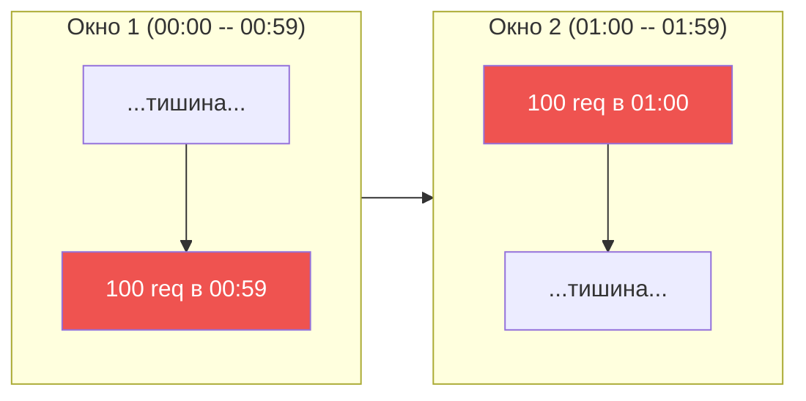
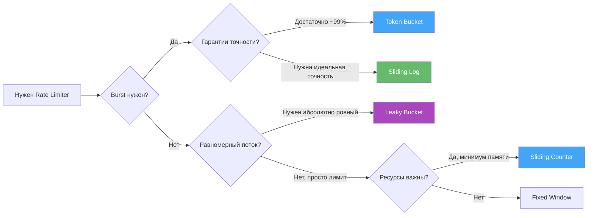
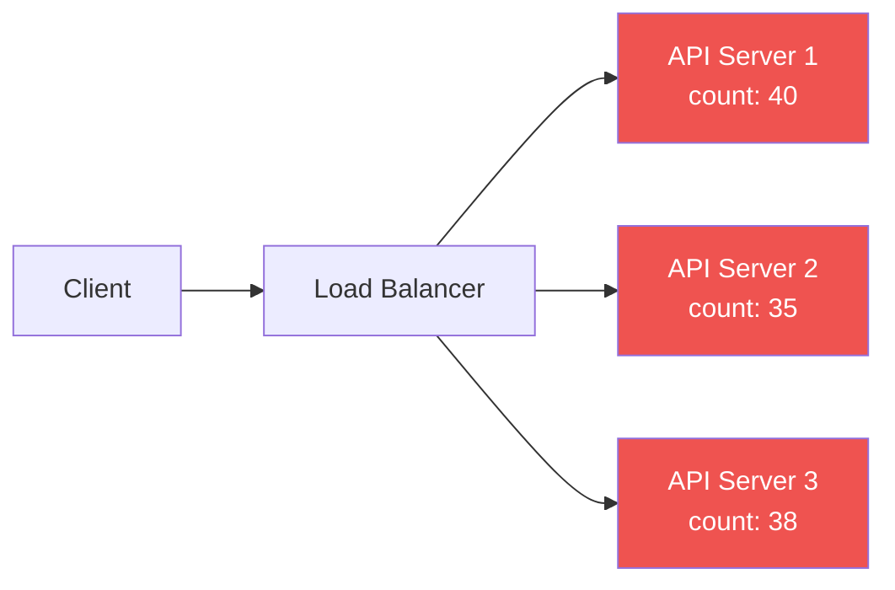
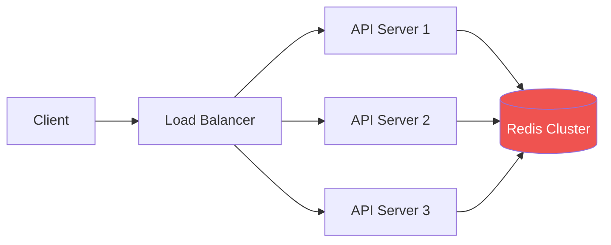
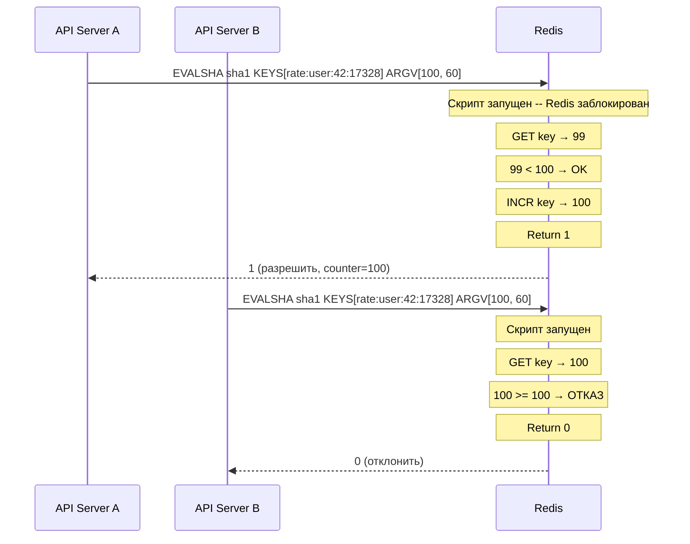
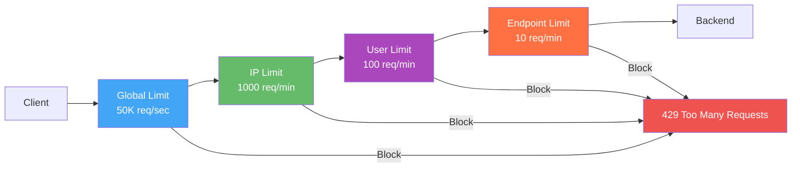

# Уровень 10: Проектируем Rate Limiter -- алгоритмы ограничения и распределённая реализация

## Введение

Представьте, что вы открыли небольшой ресторан, и он оказался очень популярным. Однажды утром к вам приходит 500 человек одновременно -- все хотят завтрак прямо сейчас. Кухня физически не может обработать 500 заказов за 5 минут. Что делает метрдотель? Он вежливо просит людей подождать снаружи, пускает посетителей небольшими группами и говорит остальным: "Подождите 15 минут, к тому времени освободятся столики."

Rate Limiter -- это тот самый метрдотель для вашего API. Он не решает, кому можно войти (это задача авторизации). Он контролирует **скорость потока** -- чтобы backend-серверы не захлебнулись под нагрузкой, а добросовестные пользователи получали стабильный сервис.

Но в распределённых системах задача становится сложнее. Представьте 10 метрдотелей на 10 разных входах в ресторан, которые должны суммарно пустить не более 1000 человек в час. Каждый метрдотель считает "своих" посетителей, но как они узнают о посетителях, которых впустили коллеги? Именно это и решает **Distributed Rate Limiter**.

В этом уровне мы разберём всё от первых принципов до production-реализации:

1. Пять классических алгоритмов -- с механикой, плюсами, минусами и реальными примерами
2. Сравнение алгоритмов -- таблица и дерево принятия решений
3. Distributed Rate Limiting -- почему Redis и почему Lua
4. Race conditions -- один из самых частых багов в системах с общим состоянием
5. HTTP-протокол -- правильные заголовки и коды ответа
6. Multi-tier Rate Limiting -- несколько уровней защиты в реальных системах

---

## 1. Зачем нужен Rate Limiting?

Прежде чем разбирать алгоритмы, важно понять, от каких именно проблем защищает Rate Limiter. Их несколько, и они разные по природе.

### 1.1 Защита от непреднамеренной перегрузки

Большинство проблем с нагрузкой -- не злой умысел, а ошибки в клиентском коде. Разработчик написал цикл с HTTP-запросами без задержки. Или retry-логика без экспоненциального backoff начала слать запросы с частотой 1000/сек. Или новая фича запустилась для всех пользователей одновременно, и они разом нажали кнопку.

Rate Limiter -- это защитный клапан. Даже если клиент делает что-то неправильное, система остаётся стабильной.

### 1.2 Защита от злоупотреблений и DDoS

Намеренные атаки -- scraping данных, brute-force паролей, DDoS -- это тоже запросы. Без Rate Limiter один атакующий может занять все потоки вашего сервера, оставив добросовестных пользователей без ответа.

Важный нюанс: Rate Limiter -- не полноценная DDoS-защита. Специализированные решения (Cloudflare, AWS Shield) работают на уровне сети и умеют отличать ботнет от реального трафика. Но Rate Limiter -- обязательный первый рубеж.

### 1.3 Справедливое распределение ресурсов

Если у вас SaaS с тарифными планами (Free, Pro, Enterprise), Rate Limiter -- это технический инструмент реализации SLA. Free-пользователь получает 100 запросов/минуту, Enterprise -- 10 000. Без ограничений один heavy-user на Free-тарифе может "съедать" ресурсы, которые влияют на платных клиентов.

### 1.4 Защита платных внешних API

Если ваш бэкенд вызывает OpenAI, Twilio, Stripe или любой другой платный API -- каждый запрос стоит денег. Без Rate Limiter на уровне вашего сервиса один баг в клиентском приложении может привести к счёту на тысячи долларов за один день.


### 1.5 Предсказуемость и compliance

SLA-контракты часто содержат гарантии availability (99.9%, 99.99%). Если один клиент может неограниченно нагружать систему, эти гарантии становятся пустыми словами. Rate Limiting -- технический механизм, который делает SLA реальным.

---

## 2. Алгоритмы Rate Limiting

Существует пять основных алгоритмов. Каждый -- компромисс между точностью, потреблением памяти, простотой реализации и способностью обрабатывать burst-нагрузку.

### 2.1 Fixed Window Counter

Самый простой алгоритм. Время разбивается на фиксированные окна одинакового размера (например, каждую минуту). Для каждого пользователя в каждом окне ведётся счётчик запросов.

**Ментальная модель:** представьте лист бумаги с временной шкалой, разбитой на клетки по 60 секунд. В каждой клетке пишем число запросов от пользователя. Если число >= лимита -- отказ. В начале новой клетки число сбрасывается в ноль.

```typescript
// Fixed Window -- концепт
const WINDOW_SIZE = 60  // 60 секунд
const MAX_REQUESTS = 100

function fixedWindow(userId: string, now: number): boolean {
  // Номер текущего окна (0, 1, 2, ... -- меняется каждые 60 секунд)
  const windowKey = Math.floor(now / WINDOW_SIZE)
  const key = `rate:${userId}:${windowKey}`

  const count = redis.incr(key)
  if (count === 1) {
    // Первый запрос в окне -- устанавливаем TTL
    redis.expire(key, WINDOW_SIZE)
  }

  return count <= MAX_REQUESTS  // true = разрешить
}
```

Почему `incr` возвращает значение и `expire` ставится при count === 1? Потому что `INCR` -- атомарная операция Redis. Если ключ не существует, Redis создаёт его со значением 0, затем инкрементирует. Мы ставим expire только при первом запросе, чтобы ключ автоматически удалялся после окончания окна.

**Критическая проблема -- boundary burst:**

Если лимит 100 req/min, клиент может отправить 100 запросов в 00:59 (последняя секунда первого окна) и 100 запросов в 01:00 (первая секунда нового окна). Оба раза счётчик не превышает лимит -- но за реальные 2 секунды прошло 200 запросов.



Это не теоретическая проблема. Бот может эксплуатировать этот эффект намеренно, синхронизируя запросы с границами окон. При лимите 100 req/min реальная пропускная способность при такой атаке -- 200 req за 2 секунды, то есть 6000 req/min.

**Когда использовать:** только для простых внутренних API, где небольшое превышение лимита некритично и вы хотите минимальную сложность реализации.

---

### 2.2 Sliding Window Log

Вместо счётчика хранятся **timestamps (метки времени) каждого запроса**. При новом запросе алгоритм удаляет все метки, которые старше окна, и считает оставшиеся.

**Ментальная модель:** лента кассового чека. Каждый запрос -- новая запись с временем. Хотим понять, сколько запросов за последние 60 секунд? Отрываем "хвост" чека старше 60 секунд и считаем оставшиеся строки.

```typescript
// Sliding Window Log -- концепт
// Redis Sorted Set: score = timestamp, member = уникальный ID запроса
function slidingWindowLog(userId: string, now: number): boolean {
  const key = `rate:${userId}`
  const windowStart = now - 60  // 60 секунд назад

  // Удаляем все метки старше 60 секунд
  // zremrangebyscore работает атомарно в pipeline
  redis.zremrangebyscore(key, 0, windowStart)

  // Считаем оставшиеся метки (все они в пределах окна)
  const count = redis.zcard(key)

  if (count < MAX_REQUESTS) {
    // Добавляем метку текущего запроса
    // Score = timestamp, member = уникальный ID (чтобы не было коллизий)
    redis.zadd(key, now, `${now}:${Math.random()}`)
    redis.expire(key, 60)
    return true
  }
  return false
}
```

Redis Sorted Set идеально подходит для этого алгоритма: `ZREMRANGEBYSCORE` удаляет записи по score (timestamp) за O(log N + M), где M -- количество удалённых записей. `ZCARD` возвращает количество элементов за O(1).

✅ Абсолютно точный подсчёт, нет boundary burst.
✅ Реальное скользящее окно -- клиент не может эксплуатировать границы.
❌ Высокое потребление памяти: O(N) на каждого пользователя, где N -- лимит запросов. При лимите 10 000 req/min на 1 млн пользователей хранение всех меток становится проблемой.
❌ Операции записи при каждом запросе (zadd + zremrangebyscore), а не просто incr.

**Когда использовать:** финансовые системы, банки, любые критичные API, где точность важнее расхода памяти.

---

### 2.3 Sliding Window Counter

Компромисс между Fixed Window (быстрый, но неточный) и Sliding Log (точный, но дорогой). Идея: используем **два соседних fixed window** и вычисляем взвешенную сумму запросов.

**Математика алгоритма:**

Если мы находимся на отметке 70% текущего окна (elapsed = 0.7), то предыдущее окно весит 30% (1 - 0.7 = 0.3), а текущее -- 100%. Взвешенная оценка:

```
estimate = prevCount * (1 - elapsed) + currCount
```

**Ментальная модель:** вы стоите в аэропорту и смотрите на табло: "Сколько самолётов вылетело за последние 60 минут?" Вместо точного журнала с каждым вылетом, вы смотрите на два часа -- прошлый и текущий -- и берёте взвешенную сумму. Это приближение, но очень близкое к реальности.

```typescript
// Sliding Window Counter -- концепт
function slidingWindowCounter(userId: string, now: number): boolean {
  const currentWindow = Math.floor(now / WINDOW_SIZE)
  const prevWindow = currentWindow - 1

  // Какая доля текущего окна уже прошла (0.0 -- 1.0)
  // Например, если сейчас 42-я секунда в минуте: elapsed = 42/60 = 0.7
  const elapsed = (now % WINDOW_SIZE) / WINDOW_SIZE

  const prevCount = Number(redis.get(`rate:${userId}:${prevWindow}`) || 0)
  const currCount = Number(redis.get(`rate:${userId}:${currentWindow}`) || 0)

  // Чем дальше мы в текущем окне, тем меньше веса у предыдущего
  // В начале окна (elapsed ≈ 0): estimate ≈ prevCount + 0
  // В конце окна  (elapsed ≈ 1): estimate ≈ 0 + currCount
  const estimate = prevCount * (1 - elapsed) + currCount

  if (estimate < MAX_REQUESTS) {
    redis.incr(`rate:${userId}:${currentWindow}`)
    return true
  }
  return false
}
```

**Насколько точен алгоритм?** Cloudflare проводила математический анализ и показала, что в худшем случае погрешность составляет не более 0.003% (~0.3 промилле). Для подавляющего большинства production-сценариев это незначительная ошибка.

💡 Именно этот алгоритм используют **Cloudflare**, **Redis Rate Limiter** и большинство modern API gateway. Лучшее соотношение точности и ресурсов.

---

### 2.4 Token Bucket

Концептуально другой подход. Представьте ведро с токенами:

- Ведро наполняется со скоростью RATE токенов в секунду
- Ведро имеет максимальную ёмкость BURST токенов
- Каждый входящий запрос забирает один токен
- Если ведро пустое -- запрос отклоняется

**Ментальная модель:** банковский счёт с фиксированным доходом. Каждую секунду на счёт начисляется 10 рублей (RATE). Максимум на счету может быть 50 рублей (BURST -- "накопленные" токены). Каждая покупка стоит 1 рубль. Если денег нет -- транзакция отклоняется. Можно накопить до 50 рублей и потратить их все разом (burst).

```typescript
// Token Bucket -- концепт
interface Bucket {
  tokens: number      // текущее количество токенов
  lastRefill: number  // UNIX timestamp последнего пополнения
}

const RATE = 10   // 10 токенов/сек (refill rate)
const BURST = 50  // максимум 50 токенов в ведре

function tokenBucket(bucket: Bucket, now: number): boolean {
  // Сколько времени прошло с последнего пополнения (в секундах)
  const elapsed = now - bucket.lastRefill

  // Пополняем ведро пропорционально прошедшему времени
  // Math.min -- не превышаем максимальную ёмкость
  bucket.tokens = Math.min(BURST, bucket.tokens + elapsed * RATE)
  bucket.lastRefill = now

  // Проверяем: есть ли хотя бы один токен?
  if (bucket.tokens >= 1) {
    bucket.tokens -= 1  // забираем токен
    return true         // запрос разрешён
  }
  return false  // ведро пустое -- запрос отклонён
}
```

Ключевое свойство Token Bucket -- **контролируемый burst**. Если пользователь не делал запросов 5 секунд, его ведро наполнилось до 50 токенов. Он может мгновенно отправить 50 запросов -- и это легитимно, это поведение заложено в дизайн. После этого запросы будут обрабатываться равномерно с частотой RATE.

**Почему это важно для UX?** Реальные пользователи не делают запросы с точно равномерным интервалом. Они открывают страницу -- 5 запросов за 100ms. Потом минуту читают. Потом ещё 3 запроса. Token Bucket отражает такое поведение лучше, чем "жёсткий" лимит.

✅ Контролируемый burst (до BURST запросов мгновенно).
✅ Гладкий долгосрочный rate -- после burst запросы проходят ровно с частотой RATE.
✅ Интуитивно понятен продакт-менеджерам: "10 запросов в секунду, burst до 50".
📌 Используется в **AWS API Gateway**, **Stripe**, **GitHub API**, **Google Cloud**.

---

### 2.5 Leaky Bucket

Обратная аналогия к Token Bucket. Запросы "наливаются" в ведро (очередь), а "вытекают" с постоянной скоростью. Если ведро переполнилось -- новые запросы отбрасываются.

**Ментальная модель:** канализационный слив. Вода (запросы) поступает с любой скоростью. Отверстие слива (LEAK_RATE) всегда одного размера. Если воды приходит больше, чем успевает утекать, ванна (BUCKET_SIZE) переполняется и вода выливается на пол (запросы отбрасываются).

```typescript
// Leaky Bucket -- это по сути FIFO-очередь с фиксированной скоростью обработки
const BUCKET_SIZE = 50   // максимум запросов в очереди
const LEAK_RATE = 10     // 10 req/sec -- скорость "вытекания"

let queue: Request[] = []
let lastLeak = Date.now() / 1000

function leakyBucket(request: Request, now: number): boolean {
  // "Вытекание" -- обрабатываем запросы с фиксированной скоростью
  const leaked = Math.floor((now - lastLeak) * LEAK_RATE)
  if (leaked > 0) {
    queue.splice(0, leaked)  // убираем обработанные запросы
    lastLeak = now
  }

  if (queue.length < BUCKET_SIZE) {
    queue.push(request)  // добавляем в очередь
    return true          // будет обработан со скоростью LEAK_RATE
  }
  return false  // ведро полно -- отбрасываем
}
```

Принципиальное отличие от Token Bucket: Leaky Bucket гарантирует **абсолютно равномерный исходящий поток**. Не важно, как запросы приходят -- быстро или медленно -- они всегда выходят с одинаковой скоростью LEAK_RATE.

✅ Гарантирует **абсолютно ровный** исходящий поток -- backend никогда не получит burst.
✅ Идеален для downstream сервисов с жёстким rate limit.
❌ Не позволяет burst -- даже легитимные всплески сглаживаются.
❌ Увеличивает latency: запрос помещается в очередь и ждёт своей очереди на "вытекание".
📌 Используется в **сетевых шейперах** (traffic shaping), **Nginx** (`limit_req`), **QoS** в телекоме.

---

## 2.6 Сравнение алгоритмов

| Аспект | Fixed Window | Sliding Log | Sliding Counter | Token Bucket | Leaky Bucket |
|--------|-------------|-------------|-----------------|--------------|--------------|
| Память | O(1) | O(N) | O(1) | O(1) | O(N) |
| Точность | Низкая | Идеальная | ~99.7% | Высокая | Идеальная |
| Burst поведение | 2x на границе | Нет | Минимальный | Контролируемый | Нет (очередь) |
| Latency запроса | Нет | Нет | Нет | Нет | Есть (очередь) |
| Сложность реализации | Простая | Средняя | Средняя | Средняя | Средняя |
| Redis структура | String (INCR) | Sorted Set | 2x String | String/Hash | List/Queue |
| Лучше всего для | Прототипы | Финансы, банки | API Gateway, CDN | REST API, SDK | Сетевой шейпинг |
| Где используют в prod | Простые API | Fintech | Cloudflare | AWS, Stripe, GitHub | Nginx, QoS |

**Дерево решений -- какой алгоритм выбрать:**



---

## 3. Distributed Rate Limiting

В production у вас **N серверов** за Load Balancer. Один сервер может не знать о запросах, которые обработали другие серверы.

### 3.1 Проблема локальных счётчиков



При лимите 100 req/min, если каждый из 3 серверов считает локально, клиент может отправить 100 запросов на каждый сервер -- 300 запросов суммарно. Реальный лимит фактически умножается на количество серверов.

Это не просто теоретическая проблема. Именно так ведут себя многие "rate limiter"-библиотеки, которые используют in-memory хранилище. При горизонтальном масштабировании они молча перестают работать правильно.

### 3.2 Решение: централизованное хранилище



Все серверы читают и пишут в **общее хранилище** -- Redis. Счётчик теперь единственный для всего кластера.

### 3.3 Почему Redis, а не PostgreSQL или Memcached?

Redis сочетает в себе несколько свойств, которые делают его идеальным для Rate Limiting:

**In-memory хранилище.** Операции Redis выполняются за ~0.1-1 мс. PostgreSQL даже с индексами -- ~5-50 мс. Для каждого входящего запроса вы делаете обращение к Rate Limiter. При 10 000 req/sec задержка 50 мс означает, что rate limiter сам становится bottleneck.

**Атомарные операции.** `INCR`, `EXPIRE`, `ZADD`, `ZCARD` -- всё это атомарно. Redis гарантирует, что между двумя командами ничего не вклинится (в рамках одной операции). Это критично для корректности счётчиков.

**TTL из коробки.** Команда `EXPIRE key seconds` устанавливает автоматическое удаление ключа. Не нужно писать cron-job или cleanup-задачи -- Redis сам "забывает" устаревшие счётчики.

**Lua scripting.** Redis выполняет Lua-скрипты атомарно -- никакая другая команда не может прервать выполнение скрипта. Это позволяет реализовать сложную логику (read-check-write) без race condition.

**Cluster mode.** Redis Cluster автоматически шардирует данные по ключам. Если один Redis-инстанс не справляется с нагрузкой -- добавляете шарды. Ключи распределяются по шардам по хешу, и каждый ключ всегда попадает на один и тот же шард.

---

## 4. Race Conditions и атомарность

### 4.1 Что такое race condition в Rate Limiter?

Race condition -- это ситуация, когда результат зависит от порядка выполнения операций несколькими процессами. В Rate Limiter это классическая проблема **"check-then-act"**.

Наивная реализация:

```
GET counter → проверить → INCR
```

Проблема возникает, когда два сервера выполняют эти три операции **одновременно**:

```
Server A: GET counter → 99     (< 100, OK!)
Server B: GET counter → 99     (< 100, OK! -- читает ДО того, как A записал)
Server A: INCR counter → 100   OK
Server B: INCR counter → 101   Превышен лимит, но мы уже сказали "OK"!
```

В реальной production-системе с тысячами запросов в секунду такие гонки происходят постоянно. Это не редкий edge case.

### 4.2 Решение: Lua-скрипт в Redis

Redis гарантирует: **Lua-скрипт выполняется атомарно**. Это означает, что пока скрипт работает, никакая другая Redis-команда не может выполниться. Нет возможности "вклиниться" между строками скрипта.

```lua
-- rate_limit.lua -- атомарный check-and-increment
-- KEYS[1] -- Redis key (например, "rate:user:42:17328")
-- ARGV[1] -- лимит запросов
-- ARGV[2] -- размер окна в секундах
local key = KEYS[1]
local limit = tonumber(ARGV[1])
local window = tonumber(ARGV[2])

-- Читаем текущее значение (или 0, если ключ не существует)
local current = tonumber(redis.call('GET', key) or '0')

-- Проверяем лимит
if current >= limit then
  return 0  -- отклонить
end

-- Атомарно инкрементируем
current = redis.call('INCR', key)

-- Первый запрос в окне -- устанавливаем TTL
if current == 1 then
  redis.call('EXPIRE', key, window)
end

return 1  -- разрешить
```

Как это выглядит с точки зрения Redis: весь скрипт -- одна операция. Server A выполняет скрипт полностью. Server B ждёт. Потом Server B выполняет скрипт полностью -- и видит уже обновлённый счётчик.



### 4.3 EVAL vs EVALSHA

`EVAL script numkeys keys args` -- выполняет Lua-скрипт, передавая текст скрипта каждый раз. При высокой нагрузке это лишние байты по сети.

`EVALSHA sha1 numkeys keys args` -- выполняет скрипт по SHA1-хешу. Redis компилирует и кэширует скрипт при первом вызове. Последующие вызовы передают только 40-символьный хеш вместо полного текста скрипта.

Рабочая стратегия: при старте приложения загружаем скрипт через `SCRIPT LOAD` (или первый `EVAL`), получаем SHA1. Затем используем `EVALSHA`. Если Redis перезапустился и кеш очищен -- `EVALSHA` вернёт NOSCRIPT ошибку, тогда fallback на `EVAL`.

```typescript
// TypeScript: загрузка и использование Lua-скрипта
const luaScript = `
  local key = KEYS[1]
  local limit = tonumber(ARGV[1])
  local window = tonumber(ARGV[2])
  local current = tonumber(redis.call('GET', key) or '0')
  if current >= limit then return 0 end
  current = redis.call('INCR', key)
  if current == 1 then redis.call('EXPIRE', key, window) end
  return 1
`

let scriptSha: string

async function loadScript(redis: Redis): Promise<void> {
  scriptSha = await redis.script('LOAD', luaScript)
}

async function checkRateLimit(
  redis: Redis,
  key: string,
  limit: number,
  windowSec: number
): Promise<boolean> {
  try {
    // Пробуем EVALSHA (быстро, меньше трафика)
    const result = await redis.evalsha(scriptSha, 1, key, limit, windowSec)
    return result === 1
  } catch (err: any) {
    if (err.message.includes('NOSCRIPT')) {
      // Redis перезапустился -- перезагружаем скрипт и повторяем
      await loadScript(redis)
      const result = await redis.eval(luaScript, 1, key, limit, windowSec)
      return result === 1
    }
    throw err
  }
}
```

---

## 5. HTTP Headers для Rate Limiting

Недостаточно просто блокировать запросы. Клиент должен знать: почему заблокирован, когда сможет повторить попытку, сколько запросов осталось. Это определяется стандартными HTTP-заголовками.

### 5.1 Стандартные заголовки

Заголовки основаны на RFC 6585 и черновике IETF draft-ietf-httpapi-ratelimit-headers:

```http
HTTP/1.1 200 OK
X-RateLimit-Limit: 100
X-RateLimit-Remaining: 26
X-RateLimit-Reset: 1672531260

HTTP/1.1 429 Too Many Requests
Retry-After: 37
X-RateLimit-Limit: 100
X-RateLimit-Remaining: 0
X-RateLimit-Reset: 1672531260
Content-Type: application/json

{
  "error": "rate_limit_exceeded",
  "message": "Too many requests. Please retry after 37 seconds.",
  "retry_after": 37
}
```

**Что означает каждый заголовок:**

- `X-RateLimit-Limit` -- максимум запросов в окне. Помогает клиенту понять свой тариф.
- `X-RateLimit-Remaining` -- сколько запросов осталось в текущем окне. Клиент может замедлиться заранее, не дожидаясь 429.
- `X-RateLimit-Reset` -- UNIX timestamp (секунды), когда счётчик сбросится. Клиент знает, когда можно повторить.
- `Retry-After` -- секунд до повтора (в 429 ответе). Официально стандартизирован в RFC 7231.

**Почему именно 429, а не другой код?**

- `403 Forbidden` -- "у вас нет прав". Rate limit -- не про права, а про скорость. Семантически неверно.
- `503 Service Unavailable` -- "сервер недоступен". Но сервер доступен, просто данный клиент превысил лимит.
- `429 Too Many Requests` -- RFC 6585, введён именно для этого случая. Семантически точный.

### 5.2 Реализация middleware

В реальном приложении Rate Limiter реализуется как middleware -- перехватывает каждый запрос до того, как он попадёт в business logic:

```typescript
// Express.js Rate Limiter middleware
interface RateLimitResult {
  allowed: boolean
  remaining: number
  resetTimestamp: number
  retryAfter?: number
}

async function rateLimitMiddleware(
  req: Request,
  res: Response,
  next: NextFunction
): Promise<void> {
  const userId = req.user?.id || req.ip
  const windowSec = 60
  const limit = 100

  // Ключ окна: меняется каждые windowSec секунд
  const now = Math.floor(Date.now() / 1000)
  const windowKey = Math.floor(now / windowSec)
  const key = `rate:${userId}:${windowKey}`

  const result = await checkRateLimit(redis, key, limit, windowSec)
  const remaining = await redis.get(key)
  const resetTimestamp = (windowKey + 1) * windowSec

  // Устанавливаем заголовки всегда -- даже при успешных запросах
  res.set('X-RateLimit-Limit', String(limit))
  res.set('X-RateLimit-Remaining', String(Math.max(0, limit - Number(remaining))))
  res.set('X-RateLimit-Reset', String(resetTimestamp))

  if (!result) {
    const retryAfter = resetTimestamp - now
    res.set('Retry-After', String(retryAfter))
    res.status(429).json({
      error: 'rate_limit_exceeded',
      message: `Too many requests. Retry after ${retryAfter} seconds.`,
      retry_after: retryAfter,
    })
    return
  }

  next()
}
```

📌 Заголовки `X-RateLimit-*` устанавливаются **при каждом ответе**, не только при 429. Это позволяет клиенту отслеживать свой бюджет и замедляться проактивно.

---

## 6. Multi-tier Rate Limiting

В production Rate Limiting работает на нескольких уровнях одновременно. Это не избыточность -- каждый уровень защищает от разных угроз.

### 6.1 Уровни защиты

| Уровень | Что ограничиваем | Пример | Где реализовать | Защита от |
|---------|------------------|--------|-----------------|-----------|
| Global | Суммарный трафик | 50K req/sec total | Load Balancer | Перегрузки всей системы |
| IP-based | Запросы с одного IP | 1000 req/min per IP | API Gateway / Nginx | DDoS, сканеры |
| User-based | Запросы одного пользователя | 100 req/min per user | Application layer | Злоупотреблений |
| API key | Запросы одного ключа | Тариф Free/Pro/Enterprise | Application layer | Нарушения SLA |
| Endpoint | Конкретный endpoint | POST /upload -- 10 req/min | Application layer | Дорогих операций |



### 6.2 Реализация multi-tier в коде

```typescript
// Multi-tier проверка -- application level
interface RateLimitResult {
  allowed: boolean
  tier?: string  // какой уровень заблокировал
}

async function checkRateLimits(req: Request): Promise<RateLimitResult> {
  const now = Math.floor(Date.now() / 1000)

  // 1. Global limit (самый внешний -- защита всей системы)
  // Короткое окно (1 сек) для защиты от burst
  const globalOk = await checkLimit('global', 50000, 1, now)
  if (!globalOk) return { allowed: false, tier: 'global' }

  // 2. Per-IP limit (защита от DDoS и сканеров)
  const ipOk = await checkLimit(`ip:${req.ip}`, 1000, 60, now)
  if (!ipOk) return { allowed: false, tier: 'ip' }

  // 3. Per-user limit (справедливое распределение)
  if (req.userId) {
    const userOk = await checkLimit(`user:${req.userId}`, 100, 60, now)
    if (!userOk) return { allowed: false, tier: 'user' }
  }

  // 4. Per-endpoint limit (для дорогих операций)
  const endpointKey = `user:${req.userId}:${req.method}:${req.path}`
  const endpointOk = await checkLimit(endpointKey, 10, 60, now)
  if (!endpointOk) return { allowed: false, tier: 'endpoint' }

  return { allowed: true }
}

// checkLimit -- обёртка над Lua-скриптом
async function checkLimit(
  identifier: string,
  limit: number,
  windowSec: number,
  now: number
): Promise<boolean> {
  const windowKey = Math.floor(now / windowSec)
  const key = `rate:${identifier}:${windowKey}`
  return checkRateLimit(redis, key, limit, windowSec)
}
```

**Почему проверяем в этом порядке?** Global → IP → User → Endpoint. Мы идём от дешёвых к дорогим проверкам. Global и IP -- простые счётчики, быстро. User и Endpoint -- более сложные ключи, дополнительные lookup. Если дешёвая проверка уже отклонила запрос, дорогие выполнять не нужно.

### 6.3 Разные лимиты для разных тарифов

В SaaS-продуктах Rate Limit часто зависит от тарифного плана:

```typescript
// Тарифные планы
const RATE_LIMITS = {
  free: { requests: 100, window: 60 },
  pro: { requests: 1000, window: 60 },
  enterprise: { requests: 10000, window: 60 },
} as const

type Plan = keyof typeof RATE_LIMITS

async function getUserPlan(userId: string): Promise<Plan> {
  // В реальном приложении -- из БД или JWT-токена
  return 'free'
}

async function checkUserRateLimit(req: Request): Promise<boolean> {
  const plan = await getUserPlan(req.userId)
  const { requests, window } = RATE_LIMITS[plan]
  const now = Math.floor(Date.now() / 1000)
  const windowKey = Math.floor(now / window)
  const key = `rate:user:${req.userId}:${windowKey}`
  return checkRateLimit(redis, key, requests, window)
}
```

💡 Тарифный план лучше кэшировать в Redis или JWT-токене -- чтобы не ходить в PostgreSQL при каждом запросе. Rate Limiter и так делает один обход Redis; добавлять второй для lookup плана -- нежелательно.

---

## 7. Отказоустойчивость Rate Limiter

Rate Limiter сам по себе -- дополнительная точка отказа. Важно продумать поведение при недоступности Redis.

### 7.1 Fail-open vs Fail-closed

**Fail-closed** (отклонять все запросы при недоступности): безопаснее с точки зрения защиты от перегрузки, но катастрофично для пользователей. Если Redis упал на 5 минут -- все пользователи получают 429.

**Fail-open** (пропускать все запросы при недоступности): хуже с точки зрения защиты, но сервис остаётся доступным. Это правильный выбор для большинства API, где Rate Limiter -- защита, а не авторизация.

```typescript
// ✅ Fail-open: если Redis недоступен -- пропускаем запросы
async function rateLimitWithFallback(
  req: Request,
  res: Response,
  next: NextFunction
): Promise<void> {
  try {
    const result = await checkRateLimits(req)
    if (!result.allowed) {
      return res.status(429).json({
        error: 'rate_limit_exceeded',
        tier: result.tier,
      })
    }
  } catch (error) {
    // Redis недоступен -- логируем, но пропускаем запрос
    // Лучше временно ослабить защиту, чем заблокировать всех пользователей
    logger.error('Rate limiter unavailable, failing open', { error })
    metrics.increment('rate_limiter.redis_errors')
    // Продолжаем без rate limiting
  }

  next()
}
```

### 7.2 Circuit Breaker для Redis

При систематических ошибках Redis не нужно каждый раз ждать timeout. Circuit Breaker "отключает" Rate Limiter на некоторое время при частых ошибках:

```typescript
// Простой Circuit Breaker
class CircuitBreaker {
  private failures = 0
  private lastFailure = 0
  private state: 'closed' | 'open' | 'half-open' = 'closed'

  private readonly threshold = 5     // ошибок до открытия
  private readonly resetTimeout = 30 // секунд до попытки восстановления

  isOpen(): boolean {
    if (this.state === 'open') {
      // Проверяем: пора ли попробовать восстановление?
      if (Date.now() - this.lastFailure > this.resetTimeout * 1000) {
        this.state = 'half-open'
        return false
      }
      return true  // Breaker открыт -- пропускаем проверку Rate Limiter
    }
    return false
  }

  recordSuccess(): void {
    this.failures = 0
    this.state = 'closed'
  }

  recordFailure(): void {
    this.failures++
    this.lastFailure = Date.now()
    if (this.failures >= this.threshold) {
      this.state = 'open'
    }
  }
}

const breaker = new CircuitBreaker()

async function rateLimitWithBreaker(req: Request): Promise<boolean> {
  if (breaker.isOpen()) {
    return true  // Fail-open
  }

  try {
    const result = await checkRateLimits(req)
    breaker.recordSuccess()
    return result.allowed
  } catch (error) {
    breaker.recordFailure()
    return true  // Fail-open при ошибке
  }
}
```

### 7.3 Мониторинг

Rate Limiter без мониторинга -- слепой защитник. Ключевые метрики:

```typescript
// Метрики для Rate Limiter
metrics.increment('rate_limiter.requests_total', { tier: 'user' })
metrics.increment('rate_limiter.blocked_total', { tier: 'user', reason: 'limit_exceeded' })
metrics.histogram('rate_limiter.latency_ms', latencyMs)
metrics.gauge('rate_limiter.redis_pool_size', pool.size)

// Алерты:
// - rate_limiter.blocked_total > 5% от total -- возможна атака
// - rate_limiter.latency_ms p99 > 10ms -- Redis перегружен
// - rate_limiter.redis_errors > 0 -- Circuit Breaker скоро откроется
```

---

## 8. Частые ошибки

### ❌ Ошибка 1: Локальный rate limiter при нескольких серверах

```typescript
// ❌ In-memory счётчик -- не работает при горизонтальном масштабировании
const localCounters = new Map<string, number>()

function rateLimit(userId: string): boolean {
  const count = localCounters.get(userId) || 0
  localCounters.set(userId, count + 1)
  // При 5 серверах реальный лимит = 5 × 100 = 500!
  return count < 100
}
```

```typescript
// ✅ Общий счётчик в Redis
async function rateLimit(userId: string): Promise<boolean> {
  const now = Math.floor(Date.now() / 1000)
  const windowKey = Math.floor(now / 60)
  const key = `rate:${userId}:${windowKey}`
  const count = await redis.incr(key)
  if (count === 1) await redis.expire(key, 60)
  return count <= 100
}
```

Эта ошибка особенно опасна тем, что в разработке (один сервер) всё работает идеально. Проблема проявляется только в production при горизонтальном масштабировании.

---

### ❌ Ошибка 2: GET + проверка + INCR (race condition)

```typescript
// ❌ Три отдельные операции -- race condition при конкурентных запросах
const count = await redis.get(key)       // 99
if (Number(count) < 100) {              // OK...
  await redis.incr(key)                 // но 5 серверов сделали это одновременно!
}
// Итого: counter = 104, но все 5 сказали "OK"
```

```typescript
// ✅ Lua-скрипт -- атомарная операция, нет race condition
const result = await redis.evalsha(scriptSha, 1, key, limit, windowSec)
const allowed = result === 1
```

Этот баг трудно воспроизвести в тестах -- нужна настоящая конкурентная нагрузка. В production он проявляется под нагрузкой в виде небольшого, но стабильного превышения лимитов.

---

### ❌ Ошибка 3: Забыть про HTTP-заголовки

```typescript
// ❌ Просто 429 без информации для клиента
res.status(429).json({ error: 'Too many requests' })
// Клиент не знает: когда повторить? Какой лимит? Сколько осталось?
```

```typescript
// ✅ Полная информация для клиента
const resetTimestamp = (Math.floor(now / windowSec) + 1) * windowSec
const retryAfter = resetTimestamp - now

res.set('X-RateLimit-Limit', String(limit))
res.set('X-RateLimit-Remaining', '0')
res.set('X-RateLimit-Reset', String(resetTimestamp))
res.set('Retry-After', String(retryAfter))
res.status(429).json({
  error: 'rate_limit_exceeded',
  message: `Too many requests. Retry after ${retryAfter} seconds.`,
  retry_after: retryAfter,
})
```

Без правильных заголовков клиент будет либо слать запросы снова через секунду (создавая дополнительную нагрузку), либо показывать пользователю непонятную ошибку.

---

### ❌ Ошибка 4: Rate Limiter как single point of failure

```typescript
// ❌ Если Redis упал -- все запросы отклоняются
const allowed = await redis.eval(luaScript, 1, key, limit, windowSec)
// Throws → unhandled → 500 или 429 для всех пользователей
```

```typescript
// ✅ Fail-open с логированием
try {
  const allowed = await redis.evalsha(scriptSha, 1, key, limit, windowSec)
  if (!allowed) return res.status(429).json({ error: 'rate_limit_exceeded' })
} catch (error) {
  // Redis down -- лучше пропустить запрос, чем заблокировать всех пользователей
  logger.warn('Rate limiter unavailable, failing open', { error, userId: req.userId })
  metrics.increment('rate_limiter.fail_open')
  // Не возвращаем ошибку -- продолжаем обработку запроса
}
```

---

### ❌ Ошибка 5: Использовать 403 вместо 429

```typescript
// ❌ Семантически неверно
res.status(403).json({ error: 'Too many requests' })
// 403 Forbidden = "у вас нет прав доступа"
// Это сбивает клиентов и мониторинг с толку
```

```typescript
// ✅ Правильный HTTP-код
res.status(429).json({ error: 'rate_limit_exceeded' })
// 429 Too Many Requests = именно этот случай (RFC 6585)
```

Использование 403 ломает retry-логику клиентских библиотек. Многие SDK при 403 не повторяют запрос (считают, что проблема в правах). При 429 -- повторяют через Retry-After.

---

### ❌ Ошибка 6: Не учитывать часовые пояса при Fixed Window

```typescript
// ❌ Время окна зависит от часового пояса сервера
const windowKey = new Date().getHours()  // Меняется в разное время в разных TZ
```

```typescript
// ✅ Всегда используем UTC UNIX timestamp
const windowKey = Math.floor(Date.now() / 1000 / windowSec)
// Одинаково на всех серверах независимо от часового пояса
```

При нескольких серверах в разных регионах (или при смене системного времени) это приводит к тому, что серверы считают разные окна -- эффект аналогичен отсутствию distributed rate limiting.

---

## Итоги

| Концепция | Ключевой вывод |
|-----------|---------------|
| Алгоритм по умолчанию | Sliding Window Counter -- лучший баланс точности и ресурсов (O(1) память, ~99.7% точность) |
| Burst-сценарии | Token Bucket -- единственный алгоритм с контролируемым burst |
| Равномерный поток | Leaky Bucket -- абсолютно ровный исходящий поток, но добавляет latency |
| Точность важна | Sliding Window Log -- идеальная точность, но O(N) память |
| Atomicity | Redis + Lua scripts -- атомарный check-and-increment, нет race conditions |
| HTTP-протокол | 429 + X-RateLimit-Limit/Remaining/Reset + Retry-After |
| Distributed | Общее хранилище (Redis) -- все серверы читают один счётчик |
| Multi-tier | Global → IP → User → API key → Endpoint, в порядке от дешёвых к дорогим |
| Отказоустойчивость | Fail-open + Circuit Breaker + мониторинг метрик |
| EVALSHA | Кэшировать Lua-скрипт по SHA1 -- экономия bandwidth при высокой нагрузке |
