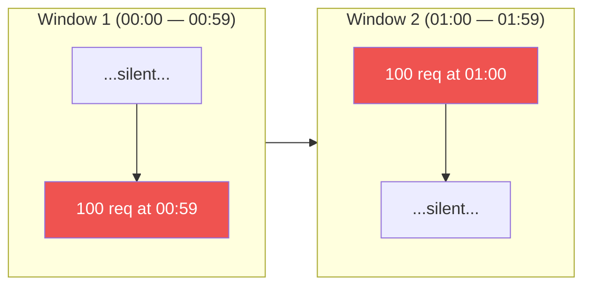
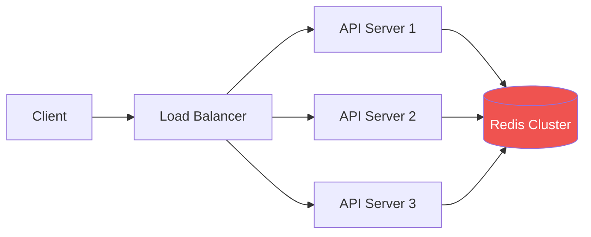
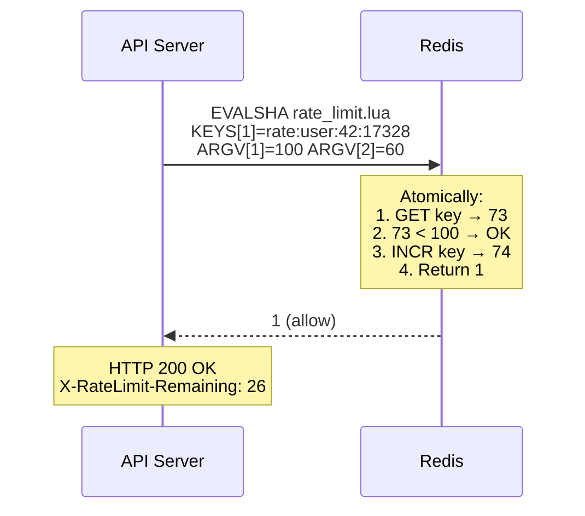

# 🔥 Level 10: Designing a Distributed Rate Limiter

## 🎯 What is this case about?

Rate Limiter is a component that limits the number of API requests within a given period. Without it, any service is vulnerable: one aggressive client or bot can "crash" the system by exhausting resources for everyone else.

Analogy: A Rate Limiter is like a **turnstile in a subway station**. It doesn't decide who can pass (that's authorization) — it controls the **flow rate** — to prevent overcrowding on the platform. If people arrive too fast, the turnstile slows the flow until the previous batch has dispersed.

But in distributed systems, it's more complex: imagine **10 turnstiles** at different subway entrances that must count the **combined flow** of passengers. This is where a Distributed Rate Limiter comes in.

## 📌 Why Rate Limiting?

1. **DDoS protection** — limiting requests from a single IP
2. **Fair resource allocation** — no single client hogs all resources
3. **Cost control** — if your API calls a paid external service (OpenAI, Twilio)
4. **Predictability** — system works stably under any load
5. **Compliance** — SLA/contract promises a specific rate to the client

## 🔥 Step 1: Rate Limiting Algorithms

### Fixed Window Counter

The simplest algorithm. We divide time into fixed windows (e.g., 1 minute) and count requests in each window.

```typescript
// Fixed Window — concept
const WINDOW_SIZE = 60  // 60 seconds
const MAX_REQUESTS = 100

function fixedWindow(userId: string, now: number): boolean {
  const windowKey = Math.floor(now / WINDOW_SIZE)
  const key = `rate:${userId}:${windowKey}`

  const count = redis.incr(key)
  if (count === 1) {
    redis.expire(key, WINDOW_SIZE)
  }

  return count <= MAX_REQUESTS  // true = allow
}
```

⚠️ **Boundary burst problem**: at the boundary of two windows, a client can send 2x the limit. If the limit is 100 req/min, then 100 requests in the last second of a window + 100 in the first second of the next = **200 requests in 2 seconds**.



### Sliding Window Log

Stores the timestamp of every request. On a new request — removes old ones (outside the window), counts the remaining.

```typescript
// Sliding Window Log — concept
function slidingWindowLog(userId: string, now: number): boolean {
  const key = `rate:${userId}`
  const windowStart = now - 60  // 60 seconds ago

  // Remove old entries
  redis.zremrangebyscore(key, 0, windowStart)
  // Count current
  const count = redis.zcard(key)

  if (count < MAX_REQUESTS) {
    redis.zadd(key, now, `${now}:${Math.random()}`)
    redis.expire(key, 60)
    return true
  }
  return false
}
```

✅ Accurate counting, no boundary burst.
❌ High memory consumption: O(N) per user, where N — request limit.

### Sliding Window Counter

Compromise: **combines two fixed windows** with a weighted coefficient. Almost as accurate as the log, but requires O(1) memory.

```typescript
// Sliding Window Counter — concept
function slidingWindowCounter(userId: string, now: number): boolean {
  const currentWindow = Math.floor(now / WINDOW_SIZE)
  const prevWindow = currentWindow - 1
  const elapsed = (now % WINDOW_SIZE) / WINDOW_SIZE  // 0.0 — 1.0

  const prevCount = redis.get(`rate:${userId}:${prevWindow}`) || 0
  const currCount = redis.get(`rate:${userId}:${currentWindow}`) || 0

  // Weighted sum: the further we are in the current window,
  // the less weight the previous window has
  const estimate = prevCount * (1 - elapsed) + currCount

  if (estimate < MAX_REQUESTS) {
    redis.incr(`rate:${userId}:${currentWindow}`)
    return true
  }
  return false
}
```

💡 Used in **Cloudflare**, **Redis**, and most production systems. Best balance of accuracy and resource usage.

### Token Bucket

A bucket fills with tokens at a constant rate. Each request takes one token. If the bucket is empty — the request is rejected. The bucket has a maximum capacity (burst).

```typescript
// Token Bucket — concept
interface Bucket {
  tokens: number
  lastRefill: number
}

const RATE = 10          // 10 tokens/sec (refill rate)
const BURST = 50         // maximum 50 tokens in bucket

function tokenBucket(bucket: Bucket, now: number): boolean {
  // Refill the bucket
  const elapsed = now - bucket.lastRefill
  bucket.tokens = Math.min(BURST, bucket.tokens + elapsed * RATE)
  bucket.lastRefill = now

  if (bucket.tokens >= 1) {
    bucket.tokens -= 1
    return true
  }
  return false
}
```

✅ Allows controlled bursts (up to BURST requests instantly).
✅ Smooth rate — after burst, requests pass at exactly the RATE frequency.
📌 Used in **AWS API Gateway**, **Stripe**, **GitHub API**.

### Leaky Bucket

Inverse analogy: requests "pour" into a bucket and "leak" at a constant rate. If the bucket overflows — new requests are discarded.

```typescript
// Leaky Bucket — essentially a FIFO queue with fixed processing rate
const BUCKET_SIZE = 50    // max requests in queue
const LEAK_RATE = 10      // 10 req/sec — "leaking" speed

function leakyBucket(queue: Request[], now: number): boolean {
  // "Leaking" — process requests at a fixed rate
  const leaked = Math.floor((now - lastLeak) * LEAK_RATE)
  queue.splice(0, leaked)

  if (queue.length < BUCKET_SIZE) {
    queue.push(request)
    return true
  }
  return false  // bucket is full
}
```

✅ Guarantees an **absolutely smooth** outgoing flow.
❌ Does not allow bursts — even legitimate spikes are smoothed out.
📌 Used in **network traffic shaping**, **Nginx** (`limit_req`).

## 📌 Step 2: Algorithm Comparison

| Aspect | Fixed Window | Sliding Log | Sliding Counter | Token Bucket | Leaky Bucket |
|--------|-------------|-------------|-----------------|--------------|--------------|
| Memory | O(1) | O(N) | O(1) | O(1) | O(N) |
| Accuracy | Low | Perfect | High (~99.7%) | High | Perfect |
| Burst | 2x at boundary | No | Minimal | Controlled | No |
| Complexity | Simple | Medium | Medium | Medium | Simple |
| Where used | Simple APIs | Banks, fintech | Cloudflare, CDN | AWS, Stripe | Nginx, networks |

## 🔥 Step 3: Distributed Rate Limiting

In production, you have **N servers** behind a Load Balancer. Each server must see the **combined counter** of requests. Without shared storage, each server only knows about "its own" requests.



### Why Redis?

- **In-memory** — operations in ~1 ms (vs ~5 ms for PostgreSQL)
- **Atomic operations** — INCR, EXPIRE, Lua scripts
- **Built-in TTL** — keys are automatically deleted
- **Cluster mode** — sharding by keys

### Race Condition: INCR + check

Naive approach — **GET → check → INCR** — creates a race condition:

```
Server A: GET counter → 99     (< 100, OK!)
Server B: GET counter → 99     (< 100, OK!)
Server A: INCR counter → 100   ✅
Server B: INCR counter → 101   ❌ Limit exceeded!
```

### Solution: Lua Script in Redis

A Lua script executes **atomically** — Redis guarantees that no other command will execute between the script's lines.

```lua
-- rate_limit.lua — atomic check-and-increment
local key = KEYS[1]
local limit = tonumber(ARGV[1])
local window = tonumber(ARGV[2])

local current = tonumber(redis.call('GET', key) or '0')

if current >= limit then
  return 0  -- reject
end

current = redis.call('INCR', key)
if current == 1 then
  redis.call('EXPIRE', key, window)
end

return 1  -- allow
```



💡 `EVALSHA` instead of `EVAL` — Redis caches the compiled script by SHA1 hash. First call via `EVAL` (or `SCRIPT LOAD`), then — `EVALSHA` to save bandwidth.

## 📌 Step 4: HTTP Headers for Rate Limiting

Standard headers (RFC 6585 + draft-ietf-httpapi-ratelimit-headers):

```http
HTTP/1.1 200 OK
X-RateLimit-Limit: 100           // max requests in window
X-RateLimit-Remaining: 26        // requests remaining
X-RateLimit-Reset: 1672531260    // UNIX timestamp of window reset

HTTP/1.1 429 Too Many Requests
Retry-After: 37                  // seconds until retry
X-RateLimit-Limit: 100
X-RateLimit-Remaining: 0
X-RateLimit-Reset: 1672531260
Content-Type: application/json
{
  "error": "rate_limit_exceeded",
  "message": "Too many requests. Please retry after 37 seconds.",
  "retry_after": 37
}
```

📌 **429 Too Many Requests** — the only correct HTTP status code for rate limiting. Not 403 (Forbidden) and not 503 (Service Unavailable).

## 📌 Step 5: Multi-tier Rate Limiting

In production, rate limiting works at **multiple levels**:

| Level | What we limit | Example | Where to implement |
|-------|--------------|---------|-------------------|
| IP-based | Requests from a single IP | 1000 req/min per IP | API Gateway / Nginx |
| User-based | Requests from one user | 100 req/min per user | Application layer |
| API key | Requests from one API key | Free/Pro/Enterprise plan | Application layer |
| Endpoint | Specific endpoint | POST /api/upload — 10 req/min | Application layer |
| Global | Total throughput | 50K req/sec total | Load Balancer |

```typescript
// Multi-tier check — application level
async function checkRateLimits(req: Request): Promise<RateLimitResult> {
  // 1. Global limit (outermost)
  const globalOk = await checkLimit('global', 50000, 1)
  if (!globalOk) return { allowed: false, tier: 'global' }

  // 2. Per-IP limit
  const ipOk = await checkLimit(`ip:${req.ip}`, 1000, 60)
  if (!ipOk) return { allowed: false, tier: 'ip' }

  // 3. Per-user limit
  const userOk = await checkLimit(`user:${req.userId}`, 100, 60)
  if (!userOk) return { allowed: false, tier: 'user' }

  // 4. Per-endpoint limit
  const endpointKey = `user:${req.userId}:${req.method}:${req.path}`
  const endpointOk = await checkLimit(endpointKey, 10, 60)
  if (!endpointOk) return { allowed: false, tier: 'endpoint' }

  return { allowed: true }
}
```

## ⚠️ Common Beginner Mistakes

### ❌ Mistake 1: Local rate limiter with multiple servers

```typescript
// ❌ Each server counts separately
const localCounters = new Map<string, number>()

function rateLimit(userId: string): boolean {
  const count = localCounters.get(userId) || 0
  // With 5 servers, the actual limit = 5 × 100 = 500!
  return count < 100
}
```

```typescript
// ✅ Shared counter in Redis
async function rateLimit(userId: string): Promise<boolean> {
  const key = `rate:${userId}:${currentWindow()}`
  const count = await redis.incr(key)
  if (count === 1) await redis.expire(key, 60)
  return count <= 100
}
```

### ❌ Mistake 2: GET + check + INCR (race condition)

```typescript
// ❌ Three separate operations — race condition
const count = await redis.get(key)       // 99
if (count < 100) {                       // OK...
  await redis.incr(key)                  // but 5 servers did this simultaneously!
}
```

```typescript
// ✅ Lua script — atomic operation
const result = await redis.eval(luaScript, 1, key, limit, window)
```

### ❌ Mistake 3: Forgetting HTTP headers

```typescript
// ❌ Just 429 without information
res.status(429).json({ error: 'Too many requests' })
```

```typescript
// ✅ Full information for the client
res.set('X-RateLimit-Limit', '100')
res.set('X-RateLimit-Remaining', String(remaining))
res.set('X-RateLimit-Reset', String(resetTimestamp))
res.set('Retry-After', String(retryAfter))
res.status(429).json({
  error: 'rate_limit_exceeded',
  retry_after: retryAfter
})
```

### ❌ Mistake 4: Rate limiter as a single point of failure

```typescript
// ❌ If Redis is down — all requests are rejected
const allowed = await redis.eval(luaScript, ...)
if (!allowed) return res.status(429)
```

```typescript
// ✅ Fail-open: if Redis is unavailable — allow requests
try {
  const allowed = await redis.eval(luaScript, ...)
  if (!allowed) return res.status(429)
} catch (error) {
  // Redis down — better to allow the request
  // than to block all users
  logger.warn('Rate limiter unavailable, failing open')
}
```

## 📌 Summary

| Concept | Key Takeaway |
|---------|-------------|
| Algorithms | Sliding Window Counter — best balance of accuracy and resources |
| Token Bucket | The only algorithm with controlled burst |
| Distributed | Redis + Lua scripts for atomicity |
| Race conditions | Only atomic operations (INCR, Lua) — never GET → check → SET |
| HTTP | 429 + X-RateLimit-* + Retry-After |
| Multi-tier | IP → User → API key → Endpoint → Global |
| Fault tolerance | Fail-open: if rate limiter is down — allow requests |
| Monitoring | Metrics: % rejected, rate limiter latency, Redis hit rate |