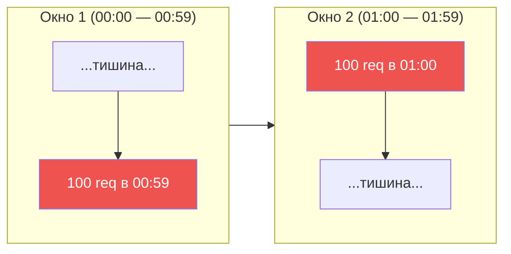
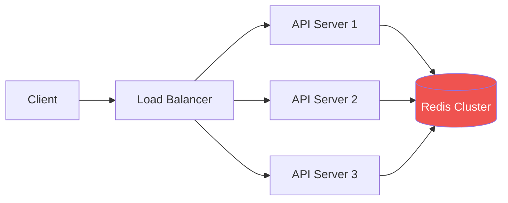
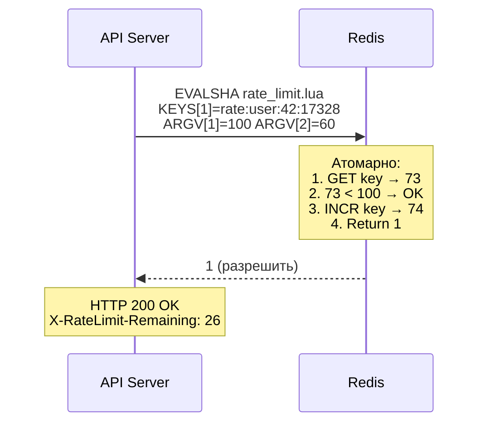

# 🔥 Уровень 10: Проектируем Distributed Rate Limiter

## 🎯 О чём этот кейс?

Rate Limiter — компонент, который ограничивает количество запросов к API за определённый период. Без него любой сервис уязвим: один агрессивный клиент или бот может «положить» систему, исчерпав ресурсы для всех остальных.

Аналогия: Rate Limiter — это **турникет в метро**. Он не решает, кому можно пройти (это задача авторизации), а контролирует **скорость потока** — чтобы на платформе не случилось давки. Если люди идут слишком быстро, турникет замедляет поток, пока предыдущая партия не рассосётся.

Но в распределённых системах всё сложнее: представьте **10 турникетов** на разных входах в метро, которые должны считать **общий поток** пассажиров. Именно здесь и появляется Distributed Rate Limiter.

## 📌 Зачем нужен Rate Limiting?

1. **Защита от DDoS** — ограничение запросов с одного IP
2. **Справедливое распределение** — ни один клиент не забирает все ресурсы
3. **Экономия денег** — если ваш API вызывает платный внешний сервис (OpenAI, Twilio)
4. **Предсказуемость** — система работает стабильно при любой нагрузке
5. **Compliance** — SLA/контракт обещает клиенту определённый rate

## 🔥 Шаг 1: Алгоритмы Rate Limiting

### Fixed Window Counter

Самый простой алгоритм. Делим время на фиксированные окна (например, 1 минута) и считаем запросы в каждом окне.

```typescript
// Fixed Window — концепт
const WINDOW_SIZE = 60  // 60 секунд
const MAX_REQUESTS = 100

function fixedWindow(userId: string, now: number): boolean {
  const windowKey = Math.floor(now / WINDOW_SIZE)
  const key = `rate:${userId}:${windowKey}`

  const count = redis.incr(key)
  if (count === 1) {
    redis.expire(key, WINDOW_SIZE)
  }

  return count <= MAX_REQUESTS  // true = разрешить
}
```

⚠️ **Проблема boundary burst**: на стыке двух окон клиент может отправить 2x лимита. Если лимит 100 req/min, то 100 запросов в последнюю секунду окна + 100 в первую секунду нового = **200 запросов за 2 секунды**.



### Sliding Window Log

Хранит timestamp каждого запроса. При новом запросе — удаляем старые (вне окна), считаем оставшиеся.

```typescript
// Sliding Window Log — концепт
function slidingWindowLog(userId: string, now: number): boolean {
  const key = `rate:${userId}`
  const windowStart = now - 60  // 60 секунд назад

  // Удаляем старые записи
  redis.zremrangebyscore(key, 0, windowStart)
  // Считаем текущие
  const count = redis.zcard(key)

  if (count < MAX_REQUESTS) {
    redis.zadd(key, now, `${now}:${Math.random()}`)
    redis.expire(key, 60)
    return true
  }
  return false
}
```

✅ Точный подсчёт, нет boundary burst.
❌ Высокое потребление памяти: O(N) на каждого пользователя, где N — лимит запросов.

### Sliding Window Counter

Компромисс: **комбинация двух fixed windows** с весовым коэффициентом. Почти так же точен, как log, но требует O(1) памяти.

```typescript
// Sliding Window Counter — концепт
function slidingWindowCounter(userId: string, now: number): boolean {
  const currentWindow = Math.floor(now / WINDOW_SIZE)
  const prevWindow = currentWindow - 1
  const elapsed = (now % WINDOW_SIZE) / WINDOW_SIZE  // 0.0 — 1.0

  const prevCount = redis.get(`rate:${userId}:${prevWindow}`) || 0
  const currCount = redis.get(`rate:${userId}:${currentWindow}`) || 0

  // Взвешенная сумма: чем дальше мы в текущем окне,
  // тем меньше вес предыдущего
  const estimate = prevCount * (1 - elapsed) + currCount

  if (estimate < MAX_REQUESTS) {
    redis.incr(`rate:${userId}:${currentWindow}`)
    return true
  }
  return false
}
```

💡 Используется в **Cloudflare**, **Redis** и большинстве production-систем. Лучшее соотношение точности и ресурсов.

### Token Bucket

Ведро наполняется токенами с постоянной скоростью. Каждый запрос забирает один токен. Если ведро пустое — запрос отклоняется. Ведро имеет максимальную ёмкость (burst).

```typescript
// Token Bucket — концепт
interface Bucket {
  tokens: number
  lastRefill: number
}

const RATE = 10          // 10 токенов/сек (refill rate)
const BURST = 50         // максимум 50 токенов в ведре

function tokenBucket(bucket: Bucket, now: number): boolean {
  // Пополняем ведро
  const elapsed = now - bucket.lastRefill
  bucket.tokens = Math.min(BURST, bucket.tokens + elapsed * RATE)
  bucket.lastRefill = now

  if (bucket.tokens >= 1) {
    bucket.tokens -= 1
    return true
  }
  return false
}
```

✅ Позволяет контролируемые burst (до BURST запросов мгновенно).
✅ Гладкий rate — после burst запросы проходят ровно с частотой RATE.
📌 Используется в **AWS API Gateway**, **Stripe**, **GitHub API**.

### Leaky Bucket

Обратная аналогия: запросы «наливаются» в ведро, а «вытекают» с постоянной скоростью. Если ведро переполнилось — новые запросы отбрасываются.

```typescript
// Leaky Bucket — это по сути FIFO-очередь с фиксированной скоростью обработки
const BUCKET_SIZE = 50    // максимум запросов в очереди
const LEAK_RATE = 10      // 10 req/sec — скорость «вытекания»

function leakyBucket(queue: Request[], now: number): boolean {
  // «Вытекание» — обрабатываем запросы с фиксированной скоростью
  const leaked = Math.floor((now - lastLeak) * LEAK_RATE)
  queue.splice(0, leaked)

  if (queue.length < BUCKET_SIZE) {
    queue.push(request)
    return true
  }
  return false  // ведро полно
}
```

✅ Гарантирует **абсолютно ровный** исходящий поток.
❌ Не позволяет burst — даже легитимные всплески сглаживаются.
📌 Используется в **сетевых шейперах** (traffic shaping), **Nginx** (`limit_req`).

## 📌 Шаг 2: Сравнение алгоритмов

| Аспект | Fixed Window | Sliding Log | Sliding Counter | Token Bucket | Leaky Bucket |
|--------|-------------|-------------|-----------------|--------------|--------------|
| Память | O(1) | O(N) | O(1) | O(1) | O(N) |
| Точность | Низкая | Идеальная | Высокая (~99.7%) | Высокая | Идеальная |
| Burst | 2x на границе | Нет | Минимальный | Контролируемый | Нет |
| Сложность | Простая | Средняя | Средняя | Средняя | Простая |
| Где используют | Простые API | Банки, финтех | Cloudflare, CDN | AWS, Stripe | Nginx, сети |

## 🔥 Шаг 3: Distributed Rate Limiting

В production у вас **N серверов** за Load Balancer. Каждый сервер должен видеть **общий счётчик** запросов. Без общего хранилища каждый сервер знает только о «своих» запросах.



### Почему Redis?

- **In-memory** — операции за ~1 мс (vs ~5 мс для PostgreSQL)
- **Атомарные операции** — INCR, EXPIRE, Lua scripts
- **TTL из коробки** — ключи автоматически удаляются
- **Cluster mode** — шардирование по ключам

### Race Condition: INCR + проверка

Наивный подход — **GET → проверка → INCR** — создаёт race condition:

```
Server A: GET counter → 99     (< 100, OK!)
Server B: GET counter → 99     (< 100, OK!)
Server A: INCR counter → 100   ✅
Server B: INCR counter → 101   ❌ Превышен лимит!
```

### Решение: Lua Script в Redis

Lua-скрипт выполняется **атомарно** — Redis гарантирует, что никакая другая команда не выполнится между строками скрипта.

```lua
-- rate_limit.lua — атомарный check-and-increment
local key = KEYS[1]
local limit = tonumber(ARGV[1])
local window = tonumber(ARGV[2])

local current = tonumber(redis.call('GET', key) or '0')

if current >= limit then
  return 0  -- отклонить
end

current = redis.call('INCR', key)
if current == 1 then
  redis.call('EXPIRE', key, window)
end

return 1  -- разрешить
```



💡 `EVALSHA` вместо `EVAL` — Redis кэширует скомпилированный скрипт по SHA1-хешу. Первый вызов через `EVAL` (или `SCRIPT LOAD`), далее — `EVALSHA` для экономии bandwidth.

## 📌 Шаг 4: HTTP Headers для Rate Limiting

Стандартные заголовки (RFC 6585 + draft-ietf-httpapi-ratelimit-headers):

```http
HTTP/1.1 200 OK
X-RateLimit-Limit: 100           // максимум запросов в окне
X-RateLimit-Remaining: 26        // осталось запросов
X-RateLimit-Reset: 1672531260    // UNIX timestamp сброса окна

HTTP/1.1 429 Too Many Requests
Retry-After: 37                  // секунд до retry
X-RateLimit-Limit: 100
X-RateLimit-Remaining: 0
X-RateLimit-Reset: 1672531260
Content-Type: application/json
{
  "error": "rate_limit_exceeded",
  "message": "Too many requests. Please retry after 37 seconds.",
  "retry_after": 37
}
```

📌 **429 Too Many Requests** — единственный правильный HTTP-код для rate limiting. Не 403 (Forbidden) и не 503 (Service Unavailable).

## 📌 Шаг 5: Multi-tier Rate Limiting

В production rate limiting работает на **нескольких уровнях**:

| Уровень | Что ограничиваем | Пример | Где реализовать |
|---------|-------------------|--------|-----------------|
| IP-based | Запросы с одного IP | 1000 req/min per IP | API Gateway / Nginx |
| User-based | Запросы одного юзера | 100 req/min per user | Application layer |
| API key | Запросы одного API-ключа | Тариф Free/Pro/Enterprise | Application layer |
| Endpoint | Конкретный endpoint | POST /api/upload — 10 req/min | Application layer |
| Global | Общая пропускная способность | 50K req/sec total | Load Balancer |

```typescript
// Multi-tier проверка — application level
async function checkRateLimits(req: Request): Promise<RateLimitResult> {
  // 1. Global limit (самый внешний)
  const globalOk = await checkLimit('global', 50000, 1)
  if (!globalOk) return { allowed: false, tier: 'global' }

  // 2. Per-IP limit
  const ipOk = await checkLimit(`ip:${req.ip}`, 1000, 60)
  if (!ipOk) return { allowed: false, tier: 'ip' }

  // 3. Per-user limit
  const userOk = await checkLimit(`user:${req.userId}`, 100, 60)
  if (!userOk) return { allowed: false, tier: 'user' }

  // 4. Per-endpoint limit
  const endpointKey = `user:${req.userId}:${req.method}:${req.path}`
  const endpointOk = await checkLimit(endpointKey, 10, 60)
  if (!endpointOk) return { allowed: false, tier: 'endpoint' }

  return { allowed: true }
}
```

## ⚠️ Частые ошибки новичков

### ❌ Ошибка 1: Локальный rate limiter при нескольких серверах

```typescript
// ❌ Каждый сервер считает отдельно
const localCounters = new Map<string, number>()

function rateLimit(userId: string): boolean {
  const count = localCounters.get(userId) || 0
  // При 5 серверах реальный лимит = 5 × 100 = 500!
  return count < 100
}
```

```typescript
// ✅ Общий счётчик в Redis
async function rateLimit(userId: string): Promise<boolean> {
  const key = `rate:${userId}:${currentWindow()}`
  const count = await redis.incr(key)
  if (count === 1) await redis.expire(key, 60)
  return count <= 100
}
```

### ❌ Ошибка 2: GET + проверка + INCR (race condition)

```typescript
// ❌ Три отдельные операции — race condition
const count = await redis.get(key)       // 99
if (count < 100) {                       // OK...
  await redis.incr(key)                  // но 5 серверов сделали это одновременно!
}
```

```typescript
// ✅ Lua script — атомарная операция
const result = await redis.eval(luaScript, 1, key, limit, window)
```

### ❌ Ошибка 3: Забыть про HTTP-заголовки

```typescript
// ❌ Просто 429 без информации
res.status(429).json({ error: 'Too many requests' })
```

```typescript
// ✅ Полная информация для клиента
res.set('X-RateLimit-Limit', '100')
res.set('X-RateLimit-Remaining', String(remaining))
res.set('X-RateLimit-Reset', String(resetTimestamp))
res.set('Retry-After', String(retryAfter))
res.status(429).json({
  error: 'rate_limit_exceeded',
  retry_after: retryAfter
})
```

### ❌ Ошибка 4: Rate limiter как single point of failure

```typescript
// ❌ Если Redis упал — все запросы отклоняются
const allowed = await redis.eval(luaScript, ...)
if (!allowed) return res.status(429)
```

```typescript
// ✅ Fail-open: если Redis недоступен — пропускаем запросы
try {
  const allowed = await redis.eval(luaScript, ...)
  if (!allowed) return res.status(429)
} catch (error) {
  // Redis down — лучше пропустить запрос,
  // чем заблокировать всех пользователей
  logger.warn('Rate limiter unavailable, failing open')
}
```

## 📌 Итоги

| Концепция | Ключевой вывод |
|-----------|---------------|
| Алгоритмы | Sliding Window Counter — лучший баланс точности и ресурсов |
| Token Bucket | Единственный алгоритм с контролируемым burst |
| Distributed | Redis + Lua scripts для атомарности |
| Race conditions | Только атомарные операции (INCR, Lua) — никогда GET → проверка → SET |
| HTTP | 429 + X-RateLimit-* + Retry-After |
| Multi-tier | IP → User → API key → Endpoint → Global |
| Отказоустойчивость | Fail-open: если rate limiter упал — пропускаем запросы |
| Мониторинг | Метрики: % отклонённых, latency rate limiter, Redis hit rate |
