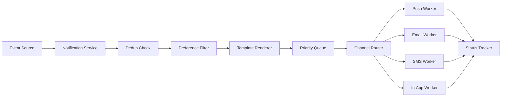
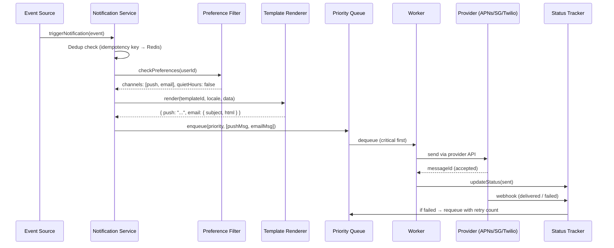
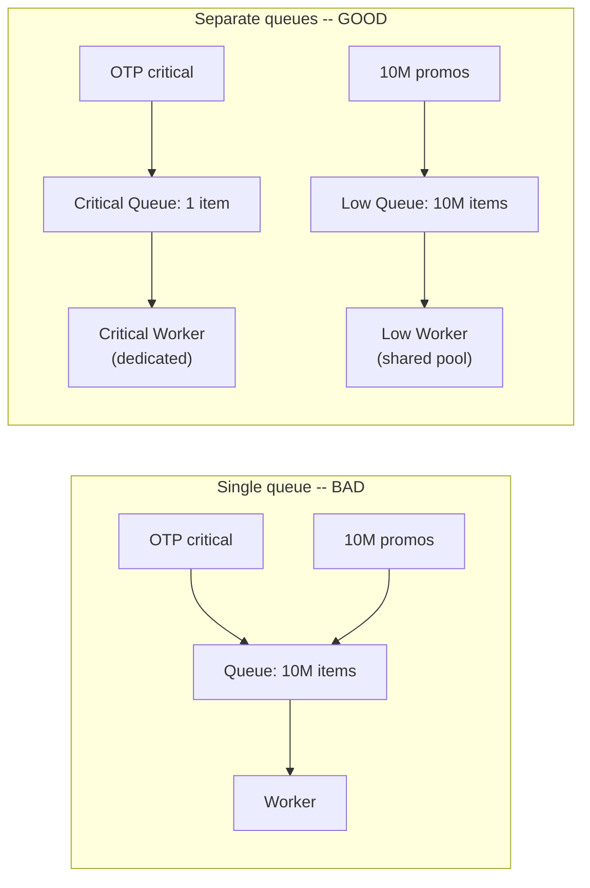
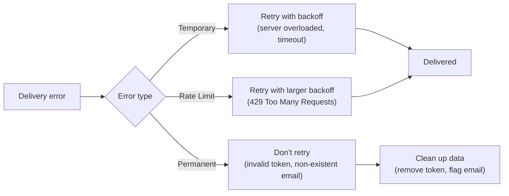
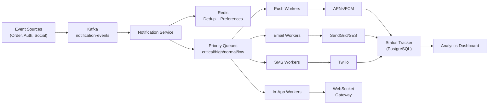

# Level 11: Designing a Notification System -- Push, Email, SMS, and Prioritization

## Introduction

Imagine a major post office in a large city. Every day, thousands of letters arrive: urgent telegrams, regular mail, promotional flyers, packages. Each category has its own process. A telegram is delivered within an hour, regular mail arrives on a business day, a package is sent via a special method if the recipient prefers a courier over pickup. If the recipient wrote "do not disturb after 22:00" -- nobody knocks at night. If the address is invalid -- the courier returns twice more before declaring delivery impossible.

A Notification System is exactly such a post office inside a software product. Every time you receive a push on your phone, an order confirmation email, or an SMS with a one-time password -- a pipeline of several components works behind the scenes. It accepts an event, checks how the user wants to receive messages, picks the right template, sorts by priority, and delivers through the correct channel. And if delivery fails -- it tries again, but smartly.

In a system design interview, this case is valued for several reasons. First, **multi-channel delivery** is obvious -- push, email, SMS, in-app -- each channel behaves differently. Second, the task requires explicit **prioritization**: OTP codes in under 200ms, promotional mail can wait several minutes. Third, you need to plan **delivery guarantees** with deduplication -- one event must become exactly one notification, not zero and not two. This is a task about reliable distributed systems, not just "sending an HTTP request."

In this theory we'll cover each system component in detail:

1. Functional and non-functional requirements -- how to formulate them correctly
2. Delivery channels -- specifics of each, cost, limitations, trade-offs
3. Notification Pipeline -- lifecycle of a notification from event to screen
4. Priority Queue -- why physical queue isolation matters more than priority flags
5. Retry Strategy -- why the retry strategy depends on the channel
6. Template Engine -- templates, versioning, localization
7. Delivery Status Tracking -- tracking through provider webhooks
8. Overall architecture and data model
9. Scaling to millions of notifications per day
10. Common beginner mistakes with root cause analysis

---

## 1. Requirements -- Foundation of Design

Before drawing diagrams, we need to clearly define **what** the system does and **how** it does it. In an interview, this stage shows whether the candidate knows how to ask the right questions.

### Functional Requirements

Functional requirements describe system behavior -- what it can do.

| Requirement | Why Important |
|---|---|
| Multi-channel delivery: Push (APNs/FCM), Email, SMS, In-App | Different users prefer different channels; critical events require multiple |
| User preference management | Respecting user choice -- not just UX, but legal (GDPR, CAN-SPAM) |
| Templates with dynamic variables | Can't hardcode text in code -- need flexibility without deployment |
| Prioritization: critical vs promotional | OTP codes can't wait in queue behind a million promotional emails |
| Delivery status tracking | Without statuses, it's impossible to build analytics and debug problems |
| Retry on failed delivery | Temporary provider failures shouldn't result in lost notifications |
| Quiet hours and timezones | Promotional at 3 AM -- UX violation and a sure path to unsubscribes |

### Non-Functional Requirements

Non-functional requirements describe quality characteristics -- how well the system should work.

- **Scale** -- millions of notifications per day (this is ~12-50 notifications per second on average, with peaks of several thousand)
- **Low latency** -- critical notifications (OTP) must deliver in less than 1 second from event
- **Reliability** -- critical messages must not be lost (at-least-once delivery with deduplication for exactly-once)
- **Exactly-once delivery** -- users must not receive the same notification multiple times
- **Extensibility** -- adding a new channel (Telegram, WhatsApp) shouldn't require rewriting the system

**Key trade-off**: between latency and reliability. To guarantee delivery, you need queues and retry -- this adds latency. Solution: **different guarantees for different priorities**. Critical -- minimum latency, maximum effort. Low -- maximum reliability, acceptable latency.

---

## 2. Delivery Channels -- Specifics of Each

This is the most important part for understanding the system. Each channel is a separate ecosystem with its own protocols, limitations, costs, and failure behavior. Not knowing these details is a sure sign of superficial understanding.

### Channel Comparison Table

| Channel | Latency | Cost | Delivery Guarantee | Limitations | Best Scenario |
|---|---|---|---|---|---|
| Push (APNs/FCM) | < 1 sec | Free | No (best effort) | Needs device token, device online | Promos, news, updates |
| Email | 1-60 sec | ~$0.0001 | High (bounce tracking) | No size limit | Transactional, marketing |
| SMS | 1-10 sec | $0.01-0.05 | High (delivery report) | 160 characters, needs phone number | OTP, security alerts |
| In-App | < 100ms | Free | Absolute (in DB) | Only for active users | Social events, system |

### Push Notifications -- Apple APNs and Google FCM

Push is the most complex channel infrastructure-wise. You don't send a notification directly to the device. You send it to a **gateway** (Apple or Google), which delivers it to the device through their channels. This means: you don't control final delivery.

```typescript
// Apple Push Notification Service (APNs)
interface APNsPayload {
  aps: {
    alert: { title: string; body: string }
    badge?: number          // Number on the app icon
    sound?: string          // 'default' or sound file name
    'content-available'?: 1 // Silent push -- wakes app without notification
    'mutable-content'?: 1   // Allows app to modify payload before display
  }
  // Custom data -- available in notification handler
  orderId?: string
  deepLink?: string
  // Important: entire payload cannot exceed 4 KB
}

// Firebase Cloud Messaging (FCM) -- Android + Web
interface FCMPayload {
  notification: {
    title: string
    body: string
    image?: string  // URL of image -- displayed in notification on Android
  }
  data: Record<string, string>  // Strings only! Custom data for the app
  token: string                  // Device token of the specific device
  topic?: string                 // '/topics/news' -- broadcast by subscription
  android?: {
    priority: 'normal' | 'high'  // High -- deliver even in Doze mode
    ttl: string                  // Lifetime: '86400s'
  }
}
```

**Important to understand**: APNs and FCM are intermediate servers, not the endpoint. If the device is offline, the message is stored on Apple/Google servers for a certain time (APNs -- 30 days, FCM -- 4 weeks), then deleted. No guarantees.

Another detail -- **device tokens aren't permanent**. When reinstalling the app, resetting the device, or switching from iOS to a new device, the token changes. Your system must handle `InvalidToken` / `Unregistered` responses and remove outdated tokens from the database.

### Email -- The Most Mature Channel

Email has existed since the 1970s, and an entire ecosystem of standards has grown around it. This is simultaneously a blessing and a problem.

```typescript
// Why you shouldn't use your own SMTP server in 2024
// ❌ Own SMTP:
//   - Need to set up SPF, DKIM, DMARC (otherwise you land in spam)
//   - Need good IP reputation (new IP immediately blacklisted)
//   - Need to monitor bounce rate (> 5% -- blocking from Gmail/Yahoo)
//   - Need to handle feedback loops from ISPs
//   - Need to manage queues on temporary failures

// ✅ Delivery Service (SendGrid, AWS SES, Mailgun):
//   - Already have good IP reputation
//   - SPF/DKIM configured
//   - Webhooks for delivery status (delivered, bounced, opened, clicked)
//   - Built-in unsubscribe management tools

interface EmailRequest {
  to: string
  from: string              // Must match your domain for DKIM
  subject: string
  html: string              // Rendered template
  text?: string             // Plain text fallback (important for deliverability)
  replyTo?: string
  headers: {
    'X-Message-Id': string       // Your internal ID for deduplication
    'List-Unsubscribe': string   // Required for mass mailings (RFC 2369)
    'X-Priority'?: string        // '1' for urgent (affects display in some clients)
  }
  attachments?: Array<{
    filename: string
    content: Buffer | string
    contentType: string
  }>
}

// SendGrid webhook payload -- provider notifies you of status
interface SendGridEvent {
  email: string
  timestamp: number
  event: 'processed' | 'delivered' | 'bounce' | 'open' | 'click' | 'spam_report'
  'smtp-id': string          // ID from SMTP server
  sg_message_id: string      // SendGrid ID
  // For bounce:
  type?: 'bounce' | 'blocked'  // bounce -- permanent error, blocked -- temporary
  reason?: string
}
```

**Bounce management** is a critically important part of email infrastructure. Hard bounce (address doesn't exist) must be immediately flagged and never sent to again. Soft bounce (mailbox full, server temporarily unavailable) can be retried. High bounce rates destroy your domain reputation -- Gmail and Yahoo will start sending your emails to spam.

### SMS -- The Most Expensive Channel

SMS is a unique channel in terms of reliability. Unlike push, SMS doesn't require an internet connection and works through the cellular network. This is exactly why it's used for OTP codes -- even while roaming, even with a weak signal, SMS usually arrives.

```typescript
// Twilio, Vonage (Nexmo), AWS SNS SMS
interface SMSRequest {
  to: string          // Must be E.164 format: +79161234567
  from: string        // Your number or Sender ID (if supported by country)
  body: string        // Up to 160 characters GSM-7 or 70 characters Unicode (Cyrillic!)
  // Cyrillic uses Unicode encoding -- meaning 70 characters, not 160!
  // Long SMS automatically split into parts (concatenated SMS)
  // Each part -- separate charge

  statusCallback?: string  // URL for delivery report from operator
}

// Approximate cost (depends on destination country):
// Russia: ~$0.05 per SMS
// USA: ~$0.0075 per SMS
// Nigeria: ~$0.04 per SMS
// At 1M SMS/day -- that's $50,000/day for Russia alone!
```

**Important for Cyrillic**: Cyrillic characters use Unicode encoding instead of standard GSM-7. This reduces maximum length from 160 to 70 characters. An OTP message like "Your code: 123456" fits, but longer text splits into multiple parts -- each charged separately.

### In-App Notifications -- The Simplest Channel

In-App notifications are database records displayed within the application (bell icon with counter). This is the only channel with absolute delivery guarantee: if a record is written to the DB -- the notification exists. No retry problems.

```typescript
// Stored in PostgreSQL, delivered via WebSocket or polling
interface InAppNotification {
  id: string
  userId: string
  title: string
  body: string
  type: 'info' | 'warning' | 'success' | 'error'
  read: boolean
  createdAt: Date
  actionUrl?: string    // Where to navigate on click (deep link)
  expiresAt?: Date      // Promos can expire
  metadata?: Record<string, unknown>  // Additional data for rendering
}

// Two delivery methods to browser/app:
// 1. WebSocket -- instant delivery, harder to scale
// 2. Short polling -- GET /notifications every 30 sec, simpler, but delayed
// 3. Server-Sent Events (SSE) -- one-way stream, good compromise
```

---

## 3. Notification Pipeline -- Lifecycle of a Notification

This is the heart of the system. Every notification goes through a strictly defined sequence of steps. Understanding this pipeline is key to understanding the entire architecture.



### Full Notification Lifecycle



### Detailed Breakdown of Each Step

Let's go through each pipeline stage and break down what exactly happens and why.

#### Step 1: Trigger -- Entry Point

Event source is any service in your system: Order Service, Auth Service, Social Service. They don't know how the Notification Service works. They just publish an event. This is an important principle -- **loose coupling**.

```typescript
// Event Source publishes event to Kafka
interface NotificationEvent {
  eventType: 'order_confirmed' | 'otp_code' | 'promotion' | 'security_alert' | 'friend_liked'
  userId: string
  data: Record<string, unknown>     // Variables for template
  idempotencyKey: string             // Event UUID -- basis for deduplication
  priority: 'critical' | 'high' | 'normal' | 'low'
  scheduledAt?: Date                 // For scheduled notifications
}

// Order Service publishes event
await kafka.produce({
  topic: 'notification-events',
  messages: [{
    key: event.userId,        // Partitioning by userId -- order for one user
    value: JSON.stringify(event),
  }]
})
```

#### Step 2: Dedup -- Preventing Duplicates

This is one of the most critical steps. Due to network failures, retries at the Kafka level, service restarts -- the same event can arrive multiple times. Without deduplication, the user receives multiple identical pushes.

```typescript
// Deduplication via Redis SET with TTL
async function dedup(event: NotificationEvent): Promise<boolean> {
  const key = `dedup:${event.idempotencyKey}`
  // SET key value NX -- set only if doesn't exist (atomic)
  const isNew = await redis.set(key, '1', 'NX', 'EX', 86400)
  // NX = Not eXists, EX 86400 = TTL 24 hours
  return isNew !== null  // null = key already existed, meaning duplicate
}

// Usage in pipeline
const shouldProcess = await dedup(event)
if (!shouldProcess) {
  logger.info({ idempotencyKey: event.idempotencyKey }, 'Duplicate event, skipping')
  return
}
```

Why Redis, not PostgreSQL for deduplication? Speed. Checking via Redis is a microsecond operation. PostgreSQL with an index is also fast, but Redis operates in memory and doesn't require a network roundtrip to disk. With millions of events per day, this matters.

#### Step 3: Preference Filter -- Respecting the User

Here we check three things: whether the user wants to receive this type of notification, through which channels, and whether they're currently in quiet hours.

```typescript
interface UserPreferences {
  userId: string
  channels: {
    push: boolean
    email: boolean
    sms: boolean
    inApp: boolean
  }
  quietHours: { start: string; end: string } | null  // '23:00' - '08:00'
  timezone: string                                     // 'Europe/Moscow'
  unsubscribed: string[]  // ['promotion', 'newsletter', 'social']
  // Important: critical notifications (OTP) ignore unsubscribed and quietHours
}

async function filterChannels(
  event: NotificationEvent,
  prefs: UserPreferences,
): Promise<string[]> {
  // Critical notifications always delivered
  if (event.priority === 'critical') {
    // Only through reliable channels
    return ['sms', 'push'].filter(ch => prefs.channels[ch])
  }

  // Check subscription to type
  if (prefs.unsubscribed.includes(event.eventType)) {
    return []  // User unsubscribed from this type
  }

  // Filter by enabled channels
  let channels = Object.entries(prefs.channels)
    .filter(([_, enabled]) => enabled)
    .map(([channel]) => channel)

  // Check quiet hours (in user's timezone)
  if (prefs.quietHours && isInQuietHours(prefs.quietHours, prefs.timezone)) {
    // Only in-app -- no sound, no interruption
    // Others -- delay until quiet hours end
    channels = channels.filter(ch => ch === 'inApp')
    await scheduleForLater(event, getQuietHoursEnd(prefs))
  }

  return channels
}
```

**Quiet hours require timezone**. If you have a Russian service with users across all time zones -- a promotional mailing at 10 AM Moscow time is 6 AM in Kamchatka. You need to store each user's `timezone` and compute their local time.

#### Step 4: Template Renderer -- Preparing Content

Templates are stored in the DB with versioning. This allows changing texts without deployment and supporting multiple languages.

```typescript
// Simple Handlebars-like renderer
function renderTemplate(template: string, data: Record<string, unknown>): string {
  return template.replace(/\{\{(\w+)\}\}/g, (match, key) => {
    const value = data[key]
    if (value === undefined) {
      // Instead of empty string, leave a placeholder -- easier to debug
      return `[missing:${key}]`
    }
    return String(value)
  })
}

// For each channel -- its own template variant
async function renderForChannels(
  templateId: string,
  channels: string[],
  locale: string,
  data: Record<string, unknown>,
): Promise<Record<string, unknown>> {
  const result: Record<string, unknown> = {}

  for (const channel of channels) {
    const template = await db.templates.findOne({ templateId, channel, locale })
    if (!template) continue

    if (channel === 'push') {
      result.push = {
        title: renderTemplate(template.subject!, data),
        body: renderTemplate(template.body, data),
      }
    } else if (channel === 'email') {
      result.email = {
        subject: renderTemplate(template.subject!, data),
        html: renderTemplate(template.body, data),  // Full HTML layout
        text: renderTemplate(template.plainText ?? template.body, data),
      }
    } else if (channel === 'sms') {
      const text = renderTemplate(template.body, data)
      // SMS: check length accounting for Cyrillic
      result.sms = { body: text.slice(0, 160) }
    } else if (channel === 'inApp') {
      result.inApp = {
        title: renderTemplate(template.subject!, data),
        body: renderTemplate(template.body, data),
      }
    }
  }

  return result
}
```

---

## 4. Priority Queue -- Physical Isolation as a Principle

This is conceptually the most important part of the system. Let's break down why a single queue with priority flags doesn't work.

### Why One `priority` Flag Doesn't Solve the Problem

Imagine an airport queue. If there's one line for everyone -- a Priority Pass passenger still waits while security checks the bags of people ahead of them. Fast track only works if there's a **physically separate line**.



In the "bad" scenario, the OTP code goes to the end of the queue behind 10 million promotional emails. Even if the worker picks the highest priority element, it first has to **find** it in the queue -- O(n) in naive implementation. And 10 million promotional emails consume memory, create Redis load, interfere with other operations.

### Implementation with Separate Queues

```typescript
// Each priority -- its own queue in Redis
const QUEUES = {
  critical: 'notifications:critical',  // OTP, security alerts
  high:     'notifications:high',      // Order updates, payments
  normal:   'notifications:normal',    // Social (likes, comments)
  low:      'notifications:low',       // Promotions, newsletters
}

// Worker works on "most urgent first" principle
async function processNextMessage(): Promise<boolean> {
  for (const priority of ['critical', 'high', 'normal', 'low'] as const) {
    // LPOP -- O(1), atomic operation, no scan
    const raw = await redis.lpop(QUEUES[priority])
    if (raw) {
      const message = JSON.parse(raw)
      await deliverNotification(message)
      return true  // Return to start -- check critical again
    }
  }
  return false  // All queues empty
}

// Main worker loop
async function workerLoop() {
  while (true) {
    const processed = await processNextMessage()
    if (!processed) {
      // No messages -- small pause to not burn CPU
      await sleep(100)
    }
  }
}

// For critical queue -- dedicated workers, not sharing resources with low
// For low -- shared pool, scales by load
```

**Why after processing each message we return to the start (critical first)?** While the worker was processing a `normal` message, new OTP codes could have arrived in the `critical` queue. Not giving them priority would accumulate delay. The "always start from critical" approach guarantees minimum latency for the most important messages.

### Starving Low-Priority Queues

Theoretically, if `critical` and `high` never empty, `low` messages will never be processed -- this is called **starvation**. In practice, for promotional mailings this is rarely a problem, but if you need to guarantee low processing within a reasonable time, you can add a counter:

```typescript
let normalProcessedCount = 0

async function processNextMessage() {
  // Every 100 normal messages -- necessarily process one low
  const forceLow = normalProcessedCount >= 100

  for (const priority of forceLow
    ? ['low', 'critical', 'high', 'normal']
    : ['critical', 'high', 'normal', 'low']) {
    // ... rest of logic
  }
}
```

---

## 5. Retry Strategy -- Strategy Depends on Channel

Delivery failures are inevitable. The question isn't whether they'll happen -- but how the system responds to them. Key understanding: **different channels break differently**, and a single retry strategy doesn't suit any of them.

### Error Typology



### Retry Policy for Each Channel

```typescript
interface RetryPolicy {
  maxRetries: number
  backoffMs: number[]               // Delays between attempts
  permanentFailureCodes: string[]   // With these codes -- don't retry
  onPermanentFailure?: (notification: Notification) => Promise<void>
  fallbackChannel?: string          // Switch to another channel
}

const RETRY_POLICIES: Record<string, RetryPolicy> = {
  push: {
    maxRetries: 3,
    // Short backoff -- push either works fast or there's no point waiting long
    backoffMs: [1_000, 5_000, 30_000],
    permanentFailureCodes: [
      'InvalidToken',    // APNs: token invalid (app deleted)
      'Unregistered',    // APNs: device not registered
      'InvalidRegistration', // FCM: equivalent
    ],
    onPermanentFailure: async (n) => {
      // Mark token as invalid so we don't waste requests
      await db.deviceTokens.update({ token: n.deviceToken }, { isValid: false })
    },
  },

  email: {
    maxRetries: 5,
    // Long backoff -- email servers can have temporary issues for hours
    backoffMs: [60_000, 300_000, 1_800_000, 7_200_000, 43_200_000],
    //           1 min   5 min    30 min   2 hours   12 hours
    permanentFailureCodes: ['hard_bounce', 'invalid_recipient'],
    onPermanentFailure: async (n) => {
      // Flag email as invalid -- never send again
      await db.users.update({ email: n.to }, { emailValid: false })
    },
  },

  sms: {
    maxRetries: 2,
    // Medium backoff -- SMS either delivers or the number is wrong
    backoffMs: [5_000, 30_000],
    permanentFailureCodes: ['invalid_number', 'blocked'],
    // For critical: fallback to push if SMS fails
    fallbackChannel: 'push',
  },
}
```

---

## 6. Template Engine

### Why Templates Are Stored in the Database

Hardcoding notification text in code is a bad practice. Every text change requires a deployment. Templates in the DB allow marketing to change texts without developer involvement.

```typescript
// Template in DB
interface NotificationTemplate {
  id: string           // 'order_confirmed'
  version: number      // 3 (versioned -- can rollback)
  channels: {
    push: { subject: string; body: string }
    email: { subject: string; html: string; text: string }
    sms: { body: string }
    inApp: { title: string; body: string }
  }
  locales: string[]    // ['en', 'ru', 'es']
  variables: string[]  // ['orderNumber', 'total', 'eta']
  createdAt: Date
  createdBy: string    // Who created/updated
}
```

### Localization

Templates are stored for each locale. The renderer picks the right one based on user preference.

```typescript
async function getTemplate(templateId: string, locale: string): Promise<NotificationTemplate | null> {
  // Try exact locale first, then fallback to default
  const template = await db.templates.findOne({ templateId, locale })
    || await db.templates.findOne({ templateId, locale: 'en' })

  return template
}
```

---

## 7. Delivery Status Tracking

### Why Tracking Is Needed

Without delivery status, you can't answer basic questions:
- Did the OTP reach the user?
- Why didn't they confirm their order?
- How many promotional emails were actually opened?

### Webhook Processing

Providers (APNs, SendGrid, Twilio) send webhooks to notify you of delivery status changes.

```typescript
// Webhook handler for SendGrid
app.post('/webhooks/sendgrid', async (req, res) => {
  const events = req.body

  for (const event of events) {
    await db.notificationStatus.updateOne(
      { messageId: event['sg_message_id'] },
      {
        $set: {
          status: event.event,
          updatedAt: new Date(event.timestamp * 1000),
          ...(event.reason && { reason: event.reason }),
        }
      }
    )

    // If permanently failed -- move to DLQ for manual review
    if (event.event === 'bounce' && event.type === 'bounce') {
      await dlq.add({
        type: 'email_bounce',
        email: event.email,
        reason: event.reason,
        timestamp: event.timestamp,
      })
    }
  }

  res.status(200).send('OK')
})
```

---

## 8. Architecture and Data Model

### Complete Architecture



### Data Model

```typescript
// Notification record in PostgreSQL
interface NotificationRecord {
  id: string                    // UUID
  userId: string
  eventType: string             // 'order_confirmed', 'otp_code', etc.
  priority: 'critical' | 'high' | 'normal' | 'low'
  channels: string[]            // ['push', 'email']
  status: 'pending' | 'sent' | 'delivered' | 'failed' | 'bounced'
  idempotencyKey: string        // For deduplication
  templateId: string
  renderedContent: Record<string, unknown>  // What was sent
  attempts: number              // Retry count
  lastError?: string            // Last error message
  createdAt: Date
  updatedAt: Date
}
```

---

## 9. Scaling to Millions

### Partitioning by User ID

Kafka topic is partitioned by `userId`. This guarantees ordering for one user -- they receive OTP before promotional, even if promotional was published first.

### Worker Scaling

- **Critical queue:** dedicated workers, auto-scale based on queue depth
- **High/Normal queues:** shared worker pool, scale by queue length
- **Low queue:** batch processing, process in bulk every few minutes

### Handling Peak Loads

During events like Black Friday, notification volume can spike 10-100x. Strategies:
- Pre-scale workers before known events
- Use priority queuing to ensure critical notifications get through
- Delay non-critical notifications during peak

---

## 10. Common Mistakes

### Mistake 1: Single Queue for All Notifications

Putting OTP codes and promotional emails in the same queue means OTP waits behind millions of promos. **Always use separate queues by priority.**

### Mistake 2: No Deduplication

Without deduplication, network retries cause duplicate notifications. **Always use idempotency keys with Redis SET NX.**

### Mistake 3: Synchronous Sending in the Request Path

```typescript
// ❌ Sending notification during order processing -- slows down the order
await sendEmail(user.email, 'Order confirmed')  // 2-5 seconds added!
```

**Always send notifications asynchronously** through a queue.

### Mistake 4: No Quiet Hours / Timezone Handling

Sending promotional notifications at 3 AM local time. **Always store user timezone and respect quiet hours.**

### Mistake 5: Not Handling Permanent Failures

Continuing to send to invalid email addresses or expired device tokens. **Always process permanent failures and clean up data.**

---

## Summary

| Component | Key Principle |
|-----------|--------------|
| **Multi-channel** | Each channel has different behavior, cost, and reliability |
| **Prioritization** | Physical queue separation, not priority flags |
| **Deduplication** | Redis SET NX with idempotency keys |
| **Retry** | Per-channel policy based on failure type |
| **Templates** | Stored in DB with versioning and localization |
| **Tracking** | Webhooks from providers, status in PostgreSQL |
| **Scaling** | Partition by userId, workers scale by queue depth |

**Main principle:** different notifications have fundamentally different requirements. OTP codes need sub-second delivery, promotional emails can wait minutes. Design the system so that critical notifications are never blocked by low-priority ones -- physical queue isolation, not priority flags.
