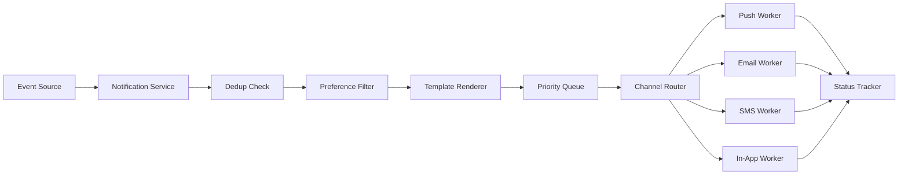
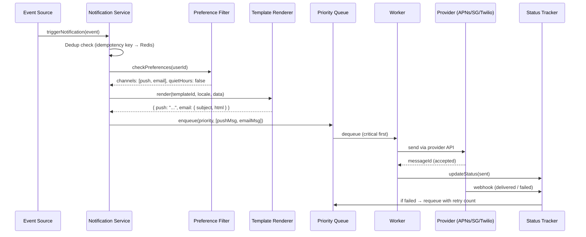
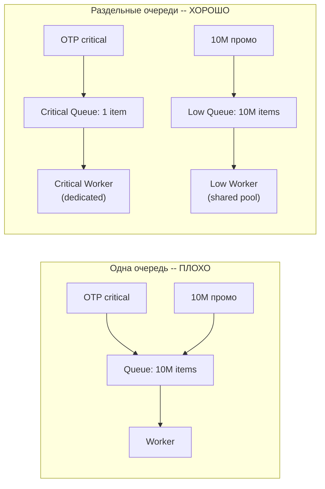
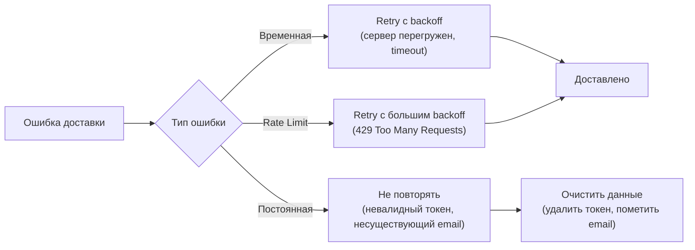
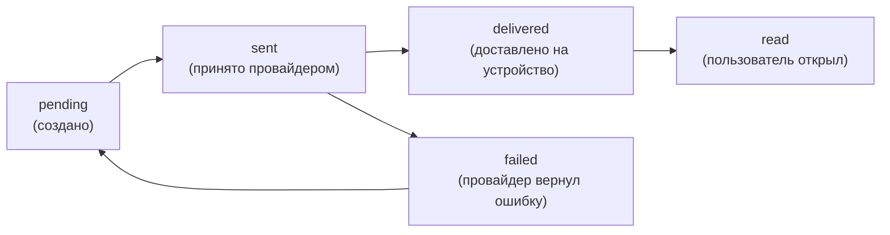
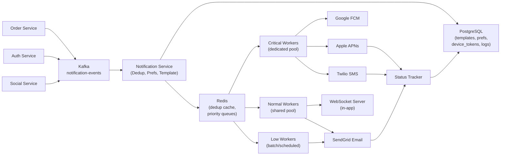

# Уровень 11: Проектируем систему уведомлений -- push, email, SMS и приоритизация

## Введение

Представьте большое почтовое отделение крупного города. Каждый день туда поступают тысячи писем: срочные телеграммы, обычные письма, рекламные листовки, посылки. У каждой категории -- свой процесс. Телеграмму доставят в течение часа, рекламу привезут в обычный рабочий день, посылку отправят особым способом, если получатель предпочитает курьера, а не самовывоз. Если получатель написал «не беспокоить после 22:00» -- ночью в дверь не постучат. Если адрес оказался неверным -- курьер вернётся ещё дважды, прежде чем признать доставку невозможной.

Notification System -- это именно такое почтовое отделение внутри программного продукта. Каждый раз, когда вам приходит push на телефон, email с подтверждением заказа или SMS с одноразовым паролем -- за кулисами работает pipeline из нескольких компонентов. Он принимает событие, проверяет, как пользователь хочет получать сообщения, подбирает нужный шаблон, сортирует по срочности и доставляет через правильный канал. А если доставка не удалась -- пробует снова, но с умом.

На системном интервью этот кейс ценят сразу по нескольким причинам. Во-первых, здесь очевидна **многоканальность** -- push, email, SMS, in-app -- каждый канал ведёт себя по-разному. Во-вторых, задача требует явно выраженной **приоритизации**: OTP-код за 200 мс, промо-рассылка может подождать несколько минут. В-третьих, нужно продумать **гарантии доставки** с дедупликацией -- одно событие должно превратиться ровно в одно уведомление, не ноль и не два. Это задача о надёжных распределённых системах, а не просто о «послать HTTP-запрос».

В этой теории мы разберём каждый компонент системы детально:

1. Функциональные и нефункциональные требования -- как правильно их сформулировать
2. Каналы доставки -- особенности каждого, стоимость, ограничения, компромиссы
3. Notification Pipeline -- жизненный цикл уведомления от события до экрана
4. Priority Queue -- почему физическая изоляция очередей важнее приоритетных флагов
5. Retry Strategy -- почему стратегия повторов зависит от канала
6. Template Engine -- шаблоны, версионирование, локализация
7. Delivery Status Tracking -- отслеживание через webhooks провайдеров
8. Общая архитектура и data model
9. Масштабирование до миллионов уведомлений в день
10. Частые ошибки новичков с разбором причин

---

## 1. Требования -- фундамент проектирования

Прежде чем рисовать диаграммы, нужно чётко договориться о том, **что** система делает и **как** она это делает. На интервью именно этот этап показывает, умеет ли кандидат задавать правильные вопросы.

### Functional Requirements

Функциональные требования описывают поведение системы -- что она умеет делать.

| Требование | Почему важно |
|---|---|
| Отправка по нескольким каналам: Push (APNs/FCM), Email, SMS, In-App | Разные пользователи предпочитают разные каналы; критические события требуют нескольких |
| Управление предпочтениями пользователя | Уважение к выбору пользователя -- не только UX, но и legal (GDPR, CAN-SPAM) |
| Шаблоны с динамическими переменными | Нельзя хардкодить текст в коде -- нужна гибкость без деплоя |
| Приоритизация: critical vs promotional | OTP-код не может ждать в очереди за миллионом промо-писем |
| Отслеживание статуса доставки | Без статусов невозможно строить аналитику и дебажить проблемы |
| Retry при неудачной доставке | Временные сбои провайдеров не должны приводить к потере уведомлений |
| Тихие часы и часовые пояса | Промо в 3 ночи -- это нарушение UX и верный путь к отпискам |

### Non-Functional Requirements

Нефункциональные требования описывают характеристики качества -- как хорошо система должна работать.

- **Масштаб** -- миллионы уведомлений в день (это ~12-50 уведомлений в секунду в среднем, с пиками в несколько тысяч)
- **Низкая задержка** -- critical уведомления (OTP) должны доставляться менее чем за 1 секунду от события
- **Надёжность** -- critical сообщения не должны теряться (at-least-once delivery с дедупликацией для exactly-once)
- **Exactly-once delivery** -- пользователь не должен получать одно уведомление несколько раз
- **Расширяемость** -- добавление нового канала (Telegram, WhatsApp) не должно требовать переписывания системы

💡 **Ключевой компромисс**: между задержкой и надёжностью. Чтобы гарантировать доставку, нужны очереди и retry -- это добавляет задержку. Решение: **разные гарантии для разных приоритетов**. Critical -- минимальная задержка, maximum effort. Low -- максимальная надёжность, допустимая задержка.

---

## 2. Каналы доставки -- особенности каждого

Это самая важная часть для понимания системы. Каждый канал -- это отдельная экосистема со своими протоколами, ограничениями, стоимостью и поведением при сбоях. Незнание этих деталей -- верный признак поверхностного понимания задачи.

### Сравнительная таблица каналов

| Канал | Задержка | Стоимость | Гарантия доставки | Ограничения | Лучший сценарий |
|---|---|---|---|---|---|
| Push (APNs/FCM) | < 1 сек | Бесплатно | Нет (best effort) | Нужен токен устройства, устройство онлайн | Промо, новости, обновления |
| Email | 1-60 сек | ~$0.0001 | Высокая (bounce-трекинг) | Нет ограничений по размеру | Транзакционные, маркетинг |
| SMS | 1-10 сек | $0.01-0.05 | Высокая (delivery report) | 160 символов, нужен номер телефона | OTP, алерты безопасности |
| In-App | < 100 мс | Бесплатно | Абсолютная (в БД) | Только для активных пользователей | Социальные события, системные |

### Push Notifications -- Apple APNs и Google FCM

Push -- самый сложный канал с точки зрения инфраструктуры. Вы не отправляете уведомление напрямую на устройство. Вы отправляете его в **gateway** (Apple или Google), который доставляет его устройству через свои каналы. Это означает: вы не контролируете финальную доставку.

```typescript
// Apple Push Notification Service (APNs)
interface APNsPayload {
  aps: {
    alert: { title: string; body: string }
    badge?: number          // Число на иконке приложения
    sound?: string          // 'default' или имя файла звука
    'content-available'?: 1 // Silent push -- будит приложение без уведомления
    'mutable-content'?: 1   // Позволяет приложению изменить payload перед показом
  }
  // Custom data -- доступна в обработчике уведомления
  orderId?: string
  deepLink?: string
  // Важно: весь payload не может превышать 4 KB
}

// Firebase Cloud Messaging (FCM) -- Android + Web
interface FCMPayload {
  notification: {
    title: string
    body: string
    image?: string  // URL картинки -- отображается в уведомлении на Android
  }
  data: Record<string, string>  // Только строки! Кастомные данные для приложения
  token: string                  // Device token конкретного устройства
  topic?: string                 // '/topics/news' -- broadcast по подписке
  android?: {
    priority: 'normal' | 'high'  // High -- доставить даже в Doze mode
    ttl: string                  // Время жизни: '86400s'
  }
}
```

📌 **Важно понимать**: APNs и FCM -- это промежуточные серверы, не конечная точка. Если устройство офлайн, сообщение будет храниться на серверах Apple/Google до определённого времени (APNs -- 30 дней, FCM -- 4 недели), а потом удалится. Гарантий нет.

Ещё одна особенность -- **device tokens не вечны**. При переустановке приложения, сбросе устройства или переходе с iOS на новое устройство токен меняется. Ваша система должна обрабатывать ответ `InvalidToken` / `Unregistered` и удалять устаревшие токены из базы.

### Email -- самый зрелый канал

Email существует с 1970-х, и вокруг него выросла целая экосистема стандартов. Это одновременно и благо, и проблема.

```typescript
// Почему не стоит использовать собственный SMTP-сервер в 2024 году
// ❌ Собственный SMTP:
//   - Нужно настроить SPF, DKIM, DMARC (иначе попадёте в спам)
//   - Нужна хорошая репутация IP (новый IP сразу попадает в черные списки)
//   - Нужно следить за bounce rate (> 5% -- блокировка от Gmail/Yahoo)
//   - Нужно обрабатывать feedback loops от ISP
//   - Нужно управлять очередями при временных сбоях

// ✅ Delivery Service (SendGrid, AWS SES, Mailgun):
//   - Уже имеют хорошую репутацию IP
//   - SPF/DKIM настроен
//   - Webhooks для delivery status (delivered, bounced, opened, clicked)
//   - Встроенные инструменты управления отписками

interface EmailRequest {
  to: string
  from: string              // Должен соответствовать вашему домену для DKIM
  subject: string
  html: string              // Отрендеренный шаблон
  text?: string             // Plain text fallback (важен для доставляемости)
  replyTo?: string
  headers: {
    'X-Message-Id': string       // Ваш внутренний ID для дедупликации
    'List-Unsubscribe': string   // Обязательно для массовых рассылок (RFC 2369)
    'X-Priority'?: string        // '1' для срочных (влияет на отображение в некоторых клиентах)
  }
  attachments?: Array<{
    filename: string
    content: Buffer | string
    contentType: string
  }>
}

// SendGrid webhook payload -- провайдер уведомляет вас о статусе
interface SendGridEvent {
  email: string
  timestamp: number
  event: 'processed' | 'delivered' | 'bounce' | 'open' | 'click' | 'spam_report'
  'smtp-id': string          // ID от SMTP-сервера
  sg_message_id: string      // ID SendGrid
  // Для bounce:
  type?: 'bounce' | 'blocked'  // bounce -- постоянная ошибка, blocked -- временная
  reason?: string
}
```

📌 **Bounce management** -- критически важная часть email-инфраструктуры. Hard bounce (адрес не существует) нужно немедленно помечать и никогда больше не отправлять. Soft bounce (почтовый ящик полон, сервер временно недоступен) можно повторить. Высокий bounce rate разрушает репутацию вашего домена -- GMail и Yahoo начнут отправлять ваши письма в спам.

### SMS -- самый дорогой канал

SMS -- это уникальный канал с точки зрения надёжности. В отличие от push, SMS не требует интернет-соединения и работает через сотовую сеть. Именно поэтому его используют для OTP-кодов -- даже в роуминге, даже со слабым сигналом, SMS обычно доходит.

```typescript
// Twilio, Vonage (Nexmo), AWS SNS SMS
interface SMSRequest {
  to: string          // Обязательно E.164 format: +79161234567
  from: string        // Ваш номер или Sender ID (если поддерживается страной)
  body: string        // До 160 символов GSM-7 или 70 символов Unicode (кириллица!)
  // Кириллица использует Unicode -- значит 70 символов, а не 160!
  // Длинные SMS автоматически разбиваются на части (concatenated SMS)
  // Каждая часть -- отдельная оплата

  statusCallback?: string  // URL для delivery report от оператора
}

// Примерная стоимость (зависит от страны назначения):
// Россия: ~$0.05 за SMS
// США: ~$0.0075 за SMS
// Нигерия: ~$0.04 за SMS
// При 1 млн SMS/день -- это $50,000/день на одну Россию!
```

⚠️ **Важно для кириллицы**: кириллические символы используют Unicode-кодировку вместо стандартного GSM-7. Это снижает максимальную длину с 160 до 70 символов. OTP-сообщение вроде «Ваш код: 123456» умещается, но длинный текст разобьётся на несколько частей -- каждая тарифицируется отдельно.

### In-App Notifications -- самый простой канал

In-App уведомления -- это записи в базе данных, которые отображаются внутри приложения (колокольчик со счётчиком). Это единственный канал с абсолютной гарантией доставки: если запись в БД создана -- уведомление существует. Проблем с retry нет.

```typescript
// Хранятся в PostgreSQL, доставляются через WebSocket или polling
interface InAppNotification {
  id: string
  userId: string
  title: string
  body: string
  type: 'info' | 'warning' | 'success' | 'error'
  read: boolean
  createdAt: Date
  actionUrl?: string    // Куда вести при клике (deep link)
  expiresAt?: Date      // Промо может устаревать
  metadata?: Record<string, unknown>  // Дополнительные данные для рендеринга
}

// Два способа доставки в браузер/приложение:
// 1. WebSocket -- мгновенная доставка, сложнее в масштабировании
// 2. Short polling -- GET /notifications каждые 30 сек, проще, но задержка
// 3. Server-Sent Events (SSE) -- однонаправленный поток, хороший компромисс
```

---

## 3. Notification Pipeline -- жизнь уведомления

Это сердце системы. Каждое уведомление проходит через строго определённую последовательность шагов. Понимание этого pipeline -- ключ к пониманию всей архитектуры.



### Полный жизненный цикл уведомления



### Детальный разбор каждого шага

Давайте пройдём по каждому этапу pipeline и разберём, что именно там происходит и почему.

#### Шаг 1: Trigger -- входная точка

Event source -- это любой сервис вашей системы: Order Service, Auth Service, Social Service. Они не знают, как работает Notification Service. Они просто публикуют событие. Это важный принцип -- **loose coupling**.

```typescript
// Event Source публикует событие в Kafka
interface NotificationEvent {
  eventType: 'order_confirmed' | 'otp_code' | 'promotion' | 'security_alert' | 'friend_liked'
  userId: string
  data: Record<string, unknown>     // Переменные для шаблона
  idempotencyKey: string             // UUID события -- основа дедупликации
  priority: 'critical' | 'high' | 'normal' | 'low'
  scheduledAt?: Date                 // Для отложенных уведомлений
}

// Order Service публикует событие
await kafka.produce({
  topic: 'notification-events',
  messages: [{
    key: event.userId,        // Партиционирование по userId -- порядок для одного юзера
    value: JSON.stringify(event),
  }]
})
```

#### Шаг 2: Dedup -- предотвращение дублей

Это один из самых критичных шагов. При сетевых сбоях, retry на уровне Kafka, перезапусках сервисов -- одно и то же событие может прийти несколько раз. Без дедупликации пользователь получит несколько одинаковых push.

```typescript
// Дедупликация через Redis SET с TTL
async function dedup(event: NotificationEvent): Promise<boolean> {
  const key = `dedup:${event.idempotencyKey}`
  // SET key value NX -- установить только если не существует (atomic)
  const isNew = await redis.set(key, '1', 'NX', 'EX', 86400)
  // NX = Not eXists, EX 86400 = TTL 24 часа
  return isNew !== null  // null = ключ уже был, значит дубль
}

// Использование в pipeline
const shouldProcess = await dedup(event)
if (!shouldProcess) {
  logger.info({ idempotencyKey: event.idempotencyKey }, 'Duplicate event, skipping')
  return
}
```

Почему Redis, а не PostgreSQL для дедупликации? Скорость. Проверка через Redis -- это microsecond-операция. PostgreSQL с индексом тоже быстрый, но Redis работает в памяти и не требует сетевого roundtrip к диску. При миллионах событий в день это важно.

#### Шаг 3: Preference Filter -- уважение к пользователю

Здесь мы проверяем три вещи: хочет ли пользователь получать этот тип уведомлений, через какие каналы, и не находится ли сейчас в тихих часах.

```typescript
interface UserPreferences {
  userId: string
  channels: {
    push: boolean
    email: boolean
    sms: boolean
    inApp: boolean
  }
  quietHours: { start: string; end: string } | null  // '23:00' - '08:00'
  timezone: string                                     // 'Europe/Moscow'
  unsubscribed: string[]  // ['promotion', 'newsletter', 'social']
  // Важно: critical уведомления (OTP) игнорируют unsubscribed и quietHours
}

async function filterChannels(
  event: NotificationEvent,
  prefs: UserPreferences,
): Promise<string[]> {
  // Critical уведомления всегда доставляются
  if (event.priority === 'critical') {
    // Только через надёжные каналы
    return ['sms', 'push'].filter(ch => prefs.channels[ch])
  }

  // Проверяем подписку на тип
  if (prefs.unsubscribed.includes(event.eventType)) {
    return []  // Пользователь отписался от этого типа
  }

  // Фильтруем по включённым каналам
  let channels = Object.entries(prefs.channels)
    .filter(([_, enabled]) => enabled)
    .map(([channel]) => channel)

  // Проверяем тихие часы (в timezone пользователя)
  if (prefs.quietHours && isInQuietHours(prefs.quietHours, prefs.timezone)) {
    // Только in-app -- без звука, без прерывания
    // Остальные -- отложить до конца тихих часов
    channels = channels.filter(ch => ch === 'inApp')
    await scheduleForLater(event, getQuietHoursEnd(prefs))
  }

  return channels
}
```

📌 **Тихие часы требуют timezone**. Если у вас российский сервис с пользователями во всех часовых поясах -- промо-рассылка в 10 утра по Москве будет в 6 утра на Камчатке. Нужно хранить `timezone` каждого пользователя и вычислять его локальное время.

#### Шаг 4: Template Renderer -- подготовка контента

Шаблоны хранятся в БД с версионированием. Это позволяет менять тексты без деплоя и поддерживать несколько языков.

```typescript
// Простой Handlebars-подобный рендерер
function renderTemplate(template: string, data: Record<string, unknown>): string {
  return template.replace(/\{\{(\w+)\}\}/g, (match, key) => {
    const value = data[key]
    if (value === undefined) {
      // Вместо пустой строки оставляем заглушку -- легче отлаживать
      return `[missing:${key}]`
    }
    return String(value)
  })
}

// Для каждого канала -- свой вариант шаблона
async function renderForChannels(
  templateId: string,
  channels: string[],
  locale: string,
  data: Record<string, unknown>,
): Promise<Record<string, unknown>> {
  const result: Record<string, unknown> = {}

  for (const channel of channels) {
    const template = await db.templates.findOne({ templateId, channel, locale })
    if (!template) continue

    if (channel === 'push') {
      result.push = {
        title: renderTemplate(template.subject!, data),
        body: renderTemplate(template.body, data),
      }
    } else if (channel === 'email') {
      result.email = {
        subject: renderTemplate(template.subject!, data),
        html: renderTemplate(template.body, data),  // Full HTML layout
        text: renderTemplate(template.plainText ?? template.body, data),
      }
    } else if (channel === 'sms') {
      const text = renderTemplate(template.body, data)
      // SMS: проверяем длину с учётом кириллицы
      result.sms = { body: text.slice(0, 160) }
    } else if (channel === 'inApp') {
      result.inApp = {
        title: renderTemplate(template.subject!, data),
        body: renderTemplate(template.body, data),
      }
    }
  }

  return result
}
```

---

## 4. Priority Queue -- физическая изоляция как принцип

Это концептуально самая важная часть системы. Разберём, почему одна очередь с приоритетными флагами не работает.

### Почему один флаг `priority` не решает проблему

Представьте очередь в аэропорту. Если есть один коридор на всех -- богатый пассажир с Priority Pass всё равно ждёт, пока охрана просматривает сумки впереди стоящих. Быстрый проход работает только если есть **физически отдельная линия**.



В сценарии «плохо» OTP-код встаёт в конец очереди за 10 миллионами промо-писем. Даже если worker берёт самый приоритетный элемент, он сначала должен его **найти** в очереди -- это O(n) при наивной реализации. А 10 млн промо-писем занимают память, создают нагрузку на Redis, мешают другим операциям.

### Реализация с отдельными очередями

```typescript
// Каждый приоритет -- своя очередь в Redis
const QUEUES = {
  critical: 'notifications:critical',  // OTP, security alerts
  high:     'notifications:high',      // Order updates, payments
  normal:   'notifications:normal',    // Social (likes, comments)
  low:      'notifications:low',       // Promotions, newsletters
}

// Worker работает по принципу "сначала самое срочное"
async function processNextMessage(): Promise<boolean> {
  for (const priority of ['critical', 'high', 'normal', 'low'] as const) {
    // LPOP -- O(1), атомарная операция, никаких scan
    const raw = await redis.lpop(QUEUES[priority])
    if (raw) {
      const message = JSON.parse(raw)
      await deliverNotification(message)
      return true  // Возвращаемся к началу -- снова проверяем critical
    }
  }
  return false  // Все очереди пусты
}

// Основной цикл worker'а
async function workerLoop() {
  while (true) {
    const processed = await processNextMessage()
    if (!processed) {
      // Нет сообщений -- небольшая пауза чтобы не жечь CPU
      await sleep(100)
    }
  }
}

// Для critical очереди -- dedicated workers, не делящие ресурсы с low
// Для low -- shared pool, который масштабируется по нагрузке
```

💡 **Почему после обработки каждого сообщения мы возвращаемся к началу (critical first)?** Пока worker обрабатывал `normal`-сообщение, в `critical` очередь могли прийти новые OTP-коды. Не дав им приоритет, мы можем накапливать задержку. Подход "всегда начинать с critical" гарантирует минимальную задержку для самых важных сообщений.

### Starving низкоприоритетных очередей

Теоретически, если `critical` и `high` никогда не пустеют, `low` сообщения не будут обрабатываться вообще -- это называется **starvation**. На практике для промо-рассылок это редко проблема, но если нужно гарантировать обработку low в разумные сроки, можно добавить counter:

```typescript
let normalProcessedCount = 0

async function processNextMessage() {
  // Каждые 100 normal-сообщений -- обязательно обработать одно low
  const forceLow = normalProcessedCount >= 100

  for (const priority of forceLow
    ? ['low', 'critical', 'high', 'normal']
    : ['critical', 'high', 'normal', 'low']) {
    // ... остальная логика
  }
}
```

---

## 5. Retry Strategy -- стратегия повторов зависит от канала

Ошибки при доставке неизбежны. Вопрос не в том, будут ли они -- а в том, как система на них реагирует. Ключевое понимание: **разные каналы ломаются по-разному**, и единая стратегия retry не подходит никому из них.

### Типология ошибок



### Retry Policy для каждого канала

```typescript
interface RetryPolicy {
  maxRetries: number
  backoffMs: number[]               // Задержки между попытками
  permanentFailureCodes: string[]   // При этих кодах -- не повторять
  onPermanentFailure?: (notification: Notification) => Promise<void>
  fallbackChannel?: string          // Переключиться на другой канал
}

const RETRY_POLICIES: Record<string, RetryPolicy> = {
  push: {
    maxRetries: 3,
    // Короткий backoff -- push либо работает быстро, либо нет смысла долго ждать
    backoffMs: [1_000, 5_000, 30_000],
    permanentFailureCodes: [
      'InvalidToken',    // APNs: токен недействителен (приложение удалено)
      'Unregistered',    // APNs: устройство не зарегистрировано
      'InvalidRegistration', // FCM: аналог
    ],
    onPermanentFailure: async (n) => {
      // Помечаем токен как невалидный, чтобы не тратить запросы впустую
      await db.deviceTokens.update({ token: n.deviceToken }, { isValid: false })
    },
  },

  email: {
    maxRetries: 5,
    // Длинный backoff -- у email-серверов бывают временные проблемы на часы
    backoffMs: [60_000, 300_000, 1_800_000, 7_200_000, 43_200_000],
    //           1 мин   5 мин    30 мин     2 часа     12 часов
    permanentFailureCodes: [
      'HardBounce',      // Email-адрес не существует
      'SpamComplaint',   // Пользователь пожаловался на спам
      'InvalidEmail',    // Синтаксически неверный адрес
    ],
    onPermanentFailure: async (n) => {
      await db.users.update({ email: n.email }, { emailBounced: true })
      // HardBounce: больше никогда не отправлять на этот адрес
    },
  },

  sms: {
    maxRetries: 2,
    backoffMs: [30_000, 120_000],
    //           30 сек   2 мин
    permanentFailureCodes: [
      'InvalidNumber',   // Номер не существует
      'Blacklisted',     // Номер в блэклисте оператора
    ],
    fallbackChannel: 'push',
    // SMS не прошёл после retry → попробовать push
    // Критично для OTP: лучше push, чем ничего
  },

  inApp: {
    maxRetries: 0,
    backoffMs: [],
    permanentFailureCodes: [],
    // In-App просто записывается в БД -- всегда успешно
    // Единственная "ошибка" -- DB недоступна, но это системная проблема
  },
}
```

### Exponential Backoff с Jitter

Одна из классических проблем retry -- **thundering herd**: если все воркеры одновременно получили ошибку и через ровно 60 секунд все одновременно повторяют попытку -- они снова перегружают сервер, снова получают ошибку, снова ждут 60 секунд. Решение -- **jitter** (случайный разброс).

```typescript
function calculateBackoff(attemptNumber: number, policy: RetryPolicy): number {
  const baseMs = policy.backoffMs[attemptNumber] ?? policy.backoffMs.at(-1)!
  // Добавляем случайный разброс ±25%
  const jitter = baseMs * 0.25 * (Math.random() * 2 - 1)
  return Math.floor(baseMs + jitter)
}

// Retry worker
async function retryWithBackoff(
  notification: Notification,
  policy: RetryPolicy,
): Promise<'delivered' | 'failed'> {
  for (let attempt = 0; attempt <= policy.maxRetries; attempt++) {
    try {
      await deliver(notification)
      return 'delivered'
    } catch (error) {
      const code = extractErrorCode(error)

      // Постоянная ошибка -- не retry
      if (policy.permanentFailureCodes.includes(code)) {
        await policy.onPermanentFailure?.(notification)
        return 'failed'
      }

      // Последняя попытка -- пробуем fallback
      if (attempt === policy.maxRetries) {
        if (policy.fallbackChannel) {
          await enqueueToChannel(policy.fallbackChannel, notification)
        }
        return 'failed'
      }

      // Ждём перед следующей попыткой
      const delay = calculateBackoff(attempt, policy)
      await sleep(delay)
    }
  }
  return 'failed'
}
```

⚠️ **APNs Feedback Service**: Apple периодически возвращает список device tokens, от которых устройства отписались. Нужно регулярно (раз в час) запрашивать этот список и помечать токены как невалидные. Иначе Apple начнёт throttle ваши push-запросы.

---

## 6. Template Engine -- шаблоны, версии, локализация

### Почему шаблоны в базе данных, а не в коде

Если текст уведомлений зашит в код -- каждое изменение требует деплоя. Маркетологи хотят менять копирайтинг, продакт-менеджеры хотят A/B-тестировать тексты, нужна поддержка новых языков. Шаблоны в базе данных решают все эти проблемы без участия разработчиков.

```typescript
// Таблица notification_templates
interface NotificationTemplate {
  id: string
  eventType: string      // 'order_confirmed', 'otp_code', 'friend_liked'
  channel: 'push' | 'email' | 'sms' | 'inApp'
  locale: string         // 'ru', 'en', 'de'
  subject?: string       // Для email и push (title)
  body: string           // Тело с переменными {{variableName}}
  plainText?: string     // Email: plain text версия
  version: number        // Версионирование для rollback
  isActive: boolean      // Можно деактивировать без удаления
  createdAt: Date
  updatedAt: Date
}

// Пример шаблонов для одного eventType
const orderConfirmedTemplates: NotificationTemplate[] = [
  {
    eventType: 'order_confirmed',
    channel: 'push',
    locale: 'ru',
    subject: 'Заказ подтверждён',
    body: 'Заказ #{{orderNumber}} на сумму {{amount}} принят в обработку',
    version: 1,
    isActive: true,
  },
  {
    eventType: 'order_confirmed',
    channel: 'email',
    locale: 'ru',
    subject: 'Ваш заказ #{{orderNumber}} подтверждён',
    body: '<html>...</html>',  // Полный HTML с header, footer, unsubscribe
    version: 1,
    isActive: true,
  },
  {
    eventType: 'order_confirmed',
    channel: 'sms',
    locale: 'ru',
    body: 'Заказ #{{orderNumber}}: {{amount}} руб. Трекинг: {{trackingUrl}}',
    // Важно: считаем символы! Кириллица = 70 символов на SMS
    version: 1,
    isActive: true,
  },
]
```

### Рендерер шаблонов

```typescript
// Простой рендерер -- достаточен для большинства случаев
function renderTemplate(template: string, data: Record<string, unknown>): string {
  return template.replace(/\{\{(\w+)\}\}/g, (_, key) => {
    const value = data[key]
    if (value === undefined || value === null) {
      return `[missing:${key}]`  // Явная метка вместо пустой строки
    }
    // Для email -- нужно HTML-escaping
    return String(value)
  })
}

// Использование
const template = 'Привет, {{userName}}! Ваш заказ #{{orderNumber}} подтверждён.'
const rendered = renderTemplate(template, {
  userName: 'Анна',
  orderNumber: '12345',
})
// → "Привет, Анна! Ваш заказ #12345 подтверждён."

// Для продакшена можно использовать Handlebars или Mustache
// Они поддерживают условия {{#if}}, циклы {{#each}} и хелперы
```

### Версионирование и A/B-тесты

```typescript
// Получить активный шаблон (или конкретную версию)
async function getTemplate(
  eventType: string,
  channel: string,
  locale: string,
  version?: number,
): Promise<NotificationTemplate | null> {
  const query: Partial<NotificationTemplate> = {
    eventType,
    channel,
    locale,
    isActive: true,
  }
  if (version !== undefined) {
    query.version = version
  }
  return db.notificationTemplates.findOne(query, { orderBy: { version: 'desc' } })
}

// A/B тест: 50% пользователей видят вариант A, 50% -- вариант B
async function getTemplateForABTest(
  userId: string,
  eventType: string,
  channel: string,
  locale: string,
): Promise<NotificationTemplate | null> {
  // Детерминированное разделение по userId -- один пользователь всегда видит одну версию
  const useVersionB = parseInt(userId.slice(-1), 16) >= 8  // Последний hex-символ UUID
  const version = useVersionB ? 2 : 1
  return getTemplate(eventType, channel, locale, version)
}
```

---

## 7. Delivery Status Tracking -- отслеживание статусов

### Модель статусов

Каждое уведомление проходит через несколько статусов. Отслеживание этих статусов даёт продуктовую аналитику (open rate, delivery rate) и операционную видимость (какой процент SMS не доставляется).



```typescript
// Таблица delivery_log
interface DeliveryRecord {
  id: string
  notificationId: string        // Ссылка на исходное событие
  userId: string
  channel: 'push' | 'email' | 'sms' | 'inApp'
  status: 'pending' | 'sent' | 'delivered' | 'failed' | 'read'
  attempts: number              // Сколько раз пробовали
  lastAttemptAt: Date
  deliveredAt?: Date
  readAt?: Date
  failReason?: string           // Код и описание ошибки
  providerMessageId?: string    // ID от SendGrid/Twilio для корреляции с webhook
  metadata?: Record<string, unknown>
}

// Webhook-обработчик от провайдеров
// SendGrid вызывает ваш endpoint при каждом изменении статуса
async function handleSendGridWebhook(events: SendGridEvent[]) {
  for (const event of events) {
    const record = await db.deliveryLog.findOne({
      providerMessageId: event['smtp-id']
    })
    if (!record) continue

    const status = mapSendGridStatus(event.event)
    await db.deliveryLog.update({ id: record.id }, {
      status,
      deliveredAt: status === 'delivered' ? new Date(event.timestamp * 1000) : undefined,
    })
  }
}

function mapSendGridStatus(event: string): DeliveryRecord['status'] {
  switch (event) {
    case 'processed': return 'sent'
    case 'delivered': return 'delivered'
    case 'bounce':
    case 'blocked': return 'failed'
    default: return 'sent'
  }
}
```

### Аналитические запросы на основе статусов

```typescript
// Delivery rate по каналам за последние 24 часа
const stats = await db.deliveryLog.aggregate([
  {
    $match: {
      lastAttemptAt: { $gte: new Date(Date.now() - 86400_000) }
    }
  },
  {
    $group: {
      _id: { channel: '$channel', status: '$status' },
      count: { $sum: 1 }
    }
  }
])

// Результат позволяет понять: SMS delivery rate 94%, push 78%, email 99%
// Если push delivery rate упал -- возможно, у нас много устаревших токенов
```

---

## 8. Архитектура системы и Data Model

### Общая архитектура



### Data Model

```typescript
// === ТАБЛИЦА: notification_templates ===
// (подробно описана в разделе 6)

// === ТАБЛИЦА: user_preferences ===
interface UserPreferences {
  userId: string          // PK, FK → users
  channels: {
    push: boolean
    email: boolean
    sms: boolean
    inApp: boolean
  }
  quietHours: { start: string; end: string } | null
  timezone: string
  unsubscribed: string[]  // Массив типов событий
  updatedAt: Date
}

// === ТАБЛИЦА: device_tokens ===
interface DeviceToken {
  id: string
  userId: string            // FK → users
  token: string             // APNs или FCM токен (UNIQUE)
  platform: 'ios' | 'android' | 'web'
  appVersion?: string       // Для аналитики
  isValid: boolean          // false = невалидный, не использовать
  createdAt: Date
  lastUsedAt: Date          // Обновляется при каждой попытке отправки
}
// Индексы: (userId, isValid), (token)

// === ТАБЛИЦА: delivery_log ===
// (подробно описана в разделе 7)
// Индексы: (userId, createdAt), (notificationId), (providerMessageId)
// Партиционирование по createdAt -- логи быстро растут
```

### Почему Kafka для ingestion, а не HTTP

Источники событий (Order Service, Auth Service) могут генерировать тысячи событий в секунду в пике. Если они напрямую вызывают Notification Service по HTTP:
- Notification Service становится узким местом
- Если Notification Service недоступен -- событие теряется
- Нет буферизации при пиках нагрузки

Kafka решает все эти проблемы: источники пишут в топик, Notification Service читает со своей скоростью, при сбоях -- consumer offset позволяет прочитать с места остановки.

---

## 9. Масштабирование до миллионов уведомлений

### Расчёт нагрузки

```
100 млн пользователей × 5 уведомлений/день = 500 млн уведомлений/день
500 млн / 86400 секунд = ~5800 уведомлений/секунду в среднем
Пиковая нагрузка (10x) = ~58000 уведомлений/секунду
```

С такой нагрузкой важно правильно масштабировать каждый компонент.

### Масштабирование очередей и воркеров

```typescript
// Воркеры масштабируются горизонтально
// Каждый воркер -- независимый процесс, конкурирующий за сообщения из Redis

// Для critical -- фиксированный пул (например, 10 воркеров)
// Они всегда готовы, никогда не обрабатывают low
const CRITICAL_WORKERS = 10

// Для low -- авто-масштабирование по глубине очереди
// При глубине > 100K → scale up, < 10K → scale down
const LOW_QUEUE_THRESHOLD_UP = 100_000
const LOW_QUEUE_THRESHOLD_DOWN = 10_000

async function autoscaleWorkers() {
  const queueDepth = await redis.llen(QUEUES.low)
  const currentWorkers = await getWorkerCount('low')

  if (queueDepth > LOW_QUEUE_THRESHOLD_UP && currentWorkers < MAX_WORKERS) {
    await scaleUp('low', 2)  // Добавить 2 воркера
  } else if (queueDepth < LOW_QUEUE_THRESHOLD_DOWN && currentWorkers > MIN_WORKERS) {
    await scaleDown('low', 1)  // Убрать 1 воркер
  }
}
```

### Rate Limiting для провайдеров

Каждый провайдер имеет свои лимиты. APNs позволяет ~3000 push/сек на один connection. SendGrid -- до 100 запросов/сек на shared план. Нужен rate limiter перед отправкой.

```typescript
// Token Bucket алгоритм для rate limiting
class TokenBucket {
  private tokens: number
  private lastRefill: number

  constructor(
    private capacity: number,       // Максимум токенов (burst capacity)
    private refillRate: number,     // Токенов в секунду
  ) {
    this.tokens = capacity
    this.lastRefill = Date.now()
  }

  async consume(count = 1): Promise<boolean> {
    this.refill()
    if (this.tokens < count) return false
    this.tokens -= count
    return true
  }

  private refill() {
    const now = Date.now()
    const elapsed = (now - this.lastRefill) / 1000
    this.tokens = Math.min(this.capacity, this.tokens + elapsed * this.refillRate)
    this.lastRefill = now
  }
}

const apnsRateLimiter = new TokenBucket(3000, 3000)  // 3000/сек

async function sendPushWithRateLimit(payload: APNsPayload) {
  const canSend = await apnsRateLimiter.consume()
  if (!canSend) {
    // Возвращаем в очередь с небольшой задержкой
    await redis.lpush(QUEUES.high, JSON.stringify(payload))
    return
  }
  await apnsClient.send(payload)
}
```

### Партиционирование базы данных

Таблица `delivery_log` растёт очень быстро: 500 млн записей в день. Через месяц -- 15 млрд строк. Нужно партиционирование.

```sql
-- PostgreSQL: партиционирование по дате
CREATE TABLE delivery_log (
  id UUID PRIMARY KEY,
  notification_id UUID NOT NULL,
  user_id UUID NOT NULL,
  channel VARCHAR(10) NOT NULL,
  status VARCHAR(20) NOT NULL,
  created_at TIMESTAMPTZ NOT NULL DEFAULT NOW()
) PARTITION BY RANGE (created_at);

-- Создаём партицию на каждый день
CREATE TABLE delivery_log_2024_01_15
  PARTITION OF delivery_log
  FOR VALUES FROM ('2024-01-15') TO ('2024-01-16');

-- Старые партиции (> 90 дней) -- в cold storage или удаляем
-- DROP TABLE delivery_log_2023_10_15; -- быстрее, чем DELETE FROM
```

---

## 10. Частые ошибки новичков

### Ошибка 1: Одна очередь для всех приоритетов ❌

```
// ПЛОХО: 10 млн промо-рассылок блокируют OTP-коды
queue.push({ type: 'otp', priority: 1, userId: 'u1' })
queue.push({ type: 'promo', priority: 5, userId: 'u2' })
// ... ещё 10 млн промо ...
queue.push({ type: 'security_alert', priority: 1, userId: 'u3' })
// Алерт безопасности ждёт обработки 10 млн промо-письм!
```

```typescript
// ХОРОШО: физически изолированные очереди
const criticalQueue = 'notifications:critical'
const lowQueue = 'notifications:low'

await redis.lpush(criticalQueue, JSON.stringify(otpCode))
await redis.lpush(lowQueue, JSON.stringify(promoEmail))
// OTP обрабатывается мгновенно, независимо от длины low-очереди
```

**Почему это важно**: при пиковой нагрузке промо-рассылки (например, Black Friday) low-очередь может содержать десятки миллионов сообщений. Без физической изоляции OTP-коды могут задерживаться на минуты.

### Ошибка 2: Нет дедупликации -- пользователь получает дубли ❌

```typescript
// ПЛОХО: retry без idempotency key
async function sendWithRetry(notification: Notification) {
  for (let i = 0; i < 3; i++) {
    try {
      await pushService.send(notification)  // Timeout на 500мс
      return
    } catch {
      // Timeout -- не знаем, дошло ли первое сообщение
      // При retry первое И второе доходят до устройства
    }
  }
}
```

```typescript
// ХОРОШО: idempotency key предотвращает дубли
async function sendIdempotent(notification: Notification) {
  const dedupKey = `sent:${notification.idempotencyKey}:${notification.channel}`

  // Проверяем перед отправкой
  if (await redis.exists(dedupKey)) {
    logger.info('Already delivered, skipping')
    return
  }

  await pushService.send(notification)

  // Помечаем как отправленное (TTL = время хранения idempotency key)
  await redis.setex(dedupKey, 86400, '1')
}
```

**Почему это важно**: timeout не означает, что запрос не прошёл. Провайдер мог принять уведомление, но ответ потерялся. Без idempotency key пользователь получит дубль. Для OTP это особенно раздражает -- два одинаковых кода сбивают с толку.

### Ошибка 3: Игнорировать тихие часы и предпочтения ❌

```typescript
// ПЛОХО: отправляем всем в любое время
async function sendPromotion(userIds: string[], promo: PromoNotification) {
  for (const userId of userIds) {
    await pushService.send({ userId, ...promo })  // 3 ночи в Москве? Не проблема!
  }
}
```

```typescript
// ХОРОШО: проверяем предпочтения и тихие часы
async function sendPromotion(userIds: string[], promo: PromoNotification) {
  for (const userId of userIds) {
    const prefs = await getUserPreferences(userId)

    if (prefs.unsubscribed.includes('promotion')) continue

    if (isInQuietHours(prefs.quietHours, prefs.timezone)) {
      const sendAt = getQuietHoursEnd(prefs)
      await scheduleNotification({ userId, ...promo, scheduledAt: sendAt })
      continue
    }

    await pushService.send({ userId, ...promo })
  }
}
```

**Почему это важно**: промо-уведомление в 3 ночи -- прямой путь к отписке и жалобе. В iOS пользователь может полностью заблокировать уведомления от приложения, и вернуть его доверие будет сложно.

### Ошибка 4: Единая retry-стратегия для всех каналов ❌

```typescript
// ПЛОХО: одинаковый retry для всех
const RETRY_DELAY_MS = 60_000  // 1 минута для всех каналов

async function retry(notification: Notification) {
  await sleep(RETRY_DELAY_MS)
  await deliver(notification)
}
// Push с невалидным токеном: бесполезно повторять через 1 минуту -- токен не станет валидным
// Email soft bounce: 1 минуты мало -- почтовый сервер может быть недоступен несколько часов
```

```typescript
// ХОРОШО: стратегия зависит от канала и типа ошибки
async function retryWithPolicy(notification: Notification, error: Error) {
  const policy = RETRY_POLICIES[notification.channel]
  const code = extractErrorCode(error)

  if (policy.permanentFailureCodes.includes(code)) {
    await policy.onPermanentFailure?.(notification)
    return  // Не повторяем -- бесполезно
  }

  const delay = policy.backoffMs[notification.attempts] ?? policy.backoffMs.at(-1)!
  await scheduleRetry(notification, delay)
}
```

**Почему это важно**: повторная отправка push с невалидным токеном -- бесполезная трата ресурсов. APNs начнёт throttle ваши запросы, если вы часто шлёте на невалидные токены. С другой стороны, email soft bounce требует длительного ожидания.

### Ошибка 5: Не учитывать кириллицу в SMS ❌

```typescript
// ПЛОХО: считаем символы как в ASCII
const MAX_SMS_LENGTH = 160
const body = 'Ваш заказ подтверждён. Стоимость: 5000 руб. Трекинг: track.example.com/abc123456'
if (body.length > MAX_SMS_LENGTH) {
  // Ошибка: кириллица = Unicode = 70 символов на часть, а не 160!
  // Это сообщение разобьётся на 2 части → двойная оплата
}
```

```typescript
// ХОРОШО: учитываем кодировку
function getSMSSegmentCount(text: string): number {
  const isUnicode = /[^\u0000-\u007F]/.test(text)  // Есть не-ASCII?
  const segmentLength = isUnicode ? 70 : 160         // Unicode или GSM-7
  const concatLength = isUnicode ? 67 : 153          // Для многочастных SMS
  
  if (text.length <= segmentLength) return 1
  return Math.ceil(text.length / concatLength)
}

// Для OTP всегда используйте короткий текст на латинице + цифры
// 'Your code: 123456' -- 18 символов GSM-7, точно в одну часть
```

**Почему это важно**: неожиданное разбиение SMS на несколько частей -- это неожиданные расходы. При большом объёме ошибка в подсчёте символов может удвоить затраты на SMS-канал.

---

## Итоги

Система уведомлений -- это не просто «отправить HTTP-запрос к провайдеру». Это полноценный data pipeline с несколькими слоями логики, гарантиями надёжности и уважением к пользователю.

| Аспект | Решение | Почему |
|---|---|---|
| **Каналы** | Push (APNs/FCM), Email (SendGrid/SES), SMS (Twilio), In-App (WebSocket/DB) | Разные характеристики надёжности, стоимости, задержки |
| **Pipeline** | Event → Dedup → Prefs → Template → Priority Queue → Router → Deliver → Track | Каждый шаг решает конкретную проблему |
| **Приоритеты** | 4 уровня: critical/high/normal/low, физически отдельные очереди | Физическая изоляция -- единственный способ гарантировать задержку |
| **Дедупликация** | Idempotency key + Redis SET NX с TTL 24ч | At-least-once delivery + dedup = exactly-once semantics |
| **Retry** | Per-channel: push (3x, 1-30s), email (5x, 1m-12h), SMS (2x + fallback) | Разные каналы ломаются по-разному |
| **Предпочтения** | Каналы, тихие часы с timezone, отписки по категориям | Legal (GDPR) + UX + retention |
| **Шаблоны** | Handlebars-подобные в БД, версионированные, per-channel + per-locale | Гибкость без деплоя, A/B-тесты, i18n |
| **Статусы** | pending → sent → delivered → read, webhooks от провайдеров | Аналитика, дебаггинг, retry-решения |
| **Масштаб** | Kafka для ingestion, Redis для очередей, workers с auto-scaling | Каждый компонент масштабируется независимо |
| **Rate limiting** | Token Bucket перед вызовом провайдера | Защита от throttling и перерасхода квот |

💡 На интервью ключевые моменты для демонстрации понимания:

1. **Разница между каналами** -- стоимость SMS против push, гарантии доставки, ограничения по размеру
2. **Физическая изоляция очередей** -- приоритетный флаг в одной очереди не работает при миллионах сообщений
3. **Per-channel retry** -- разные каналы требуют разных стратегий, включая fallback SMS → push
4. **Dedup как основа exactly-once** -- idempotency key на всех уровнях
5. **Уважение к пользователю** -- тихие часы, отписки, предпочтения -- это не просто UX, это legal требования
