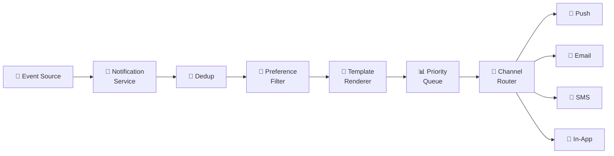
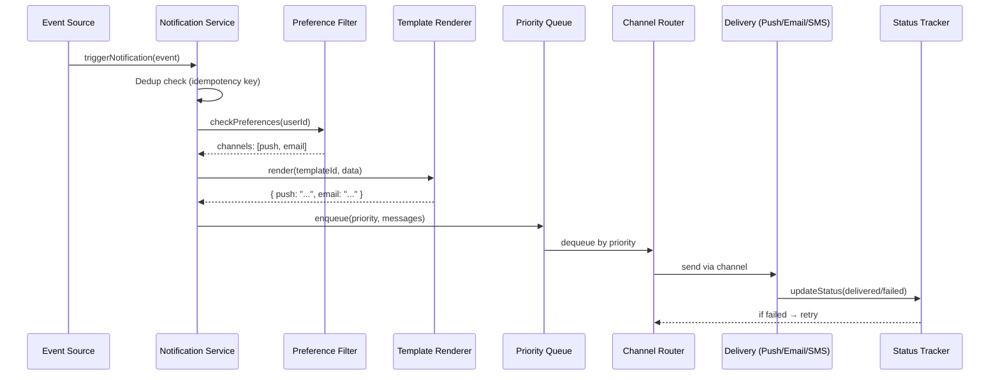
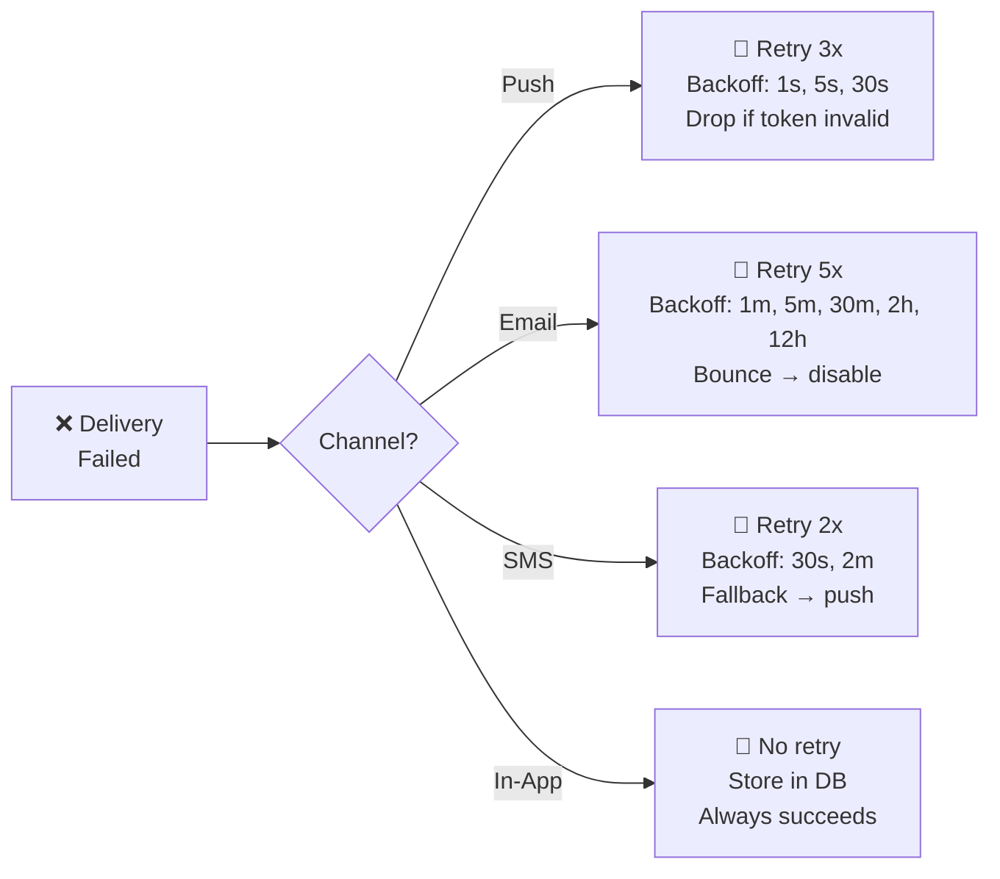
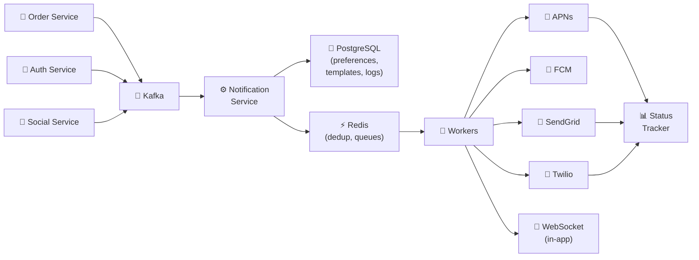

# 🔥 Level 11: Designing a Notification System

## 🎯 What is this case about?

Notification System is one of the most common subsystems in any product. Every time you receive a push on your phone, an order confirmation email, or an SMS with an authorization code — a notification pipeline is working behind the scenes. This case is valued in interviews for its **multi-channel nature** and the need to account for user preferences.

Analogy: A Notification System is like a **post office**. You bring a letter (event), the postman checks how the recipient wants to receive mail (push, email, SMS, carrier pigeon), formats the message for the right envelope (template), places it in the right stack by priority (queue), and sends it through the correct delivery service (channel). And if the letter doesn't arrive — it tries again.

## 📌 Step 1: Requirements

### Functional Requirements (what the system does)

1. Send notifications through multiple channels: **Push (APNs/FCM)**, **Email**, **SMS**, **In-App**
2. User preference management (which channels are enabled, quiet hours)
3. Notification templates with dynamic variables
4. Prioritization: critical (SMS code) vs promotional (newsletter)
5. Delivery status tracking (sent, delivered, failed, read)
6. Retry on failed delivery

### Non-Functional Requirements (how the system works)

- **Scale** — millions of notifications per day
- **Low latency** — critical notifications in < 1 sec
- **Reliability** — critical messages (OTP, alerts) must not be lost
- **Exactly-once delivery** — deduplication to avoid spam
- **Extensibility** — easy to add a new channel (Telegram, WhatsApp)

## 📌 Step 2: Delivery Channels

### Push Notifications

```typescript
// Apple Push Notification Service (APNs)
interface APNsPayload {
  aps: {
    alert: { title: string, body: string }
    badge?: number
    sound?: string
    'content-available'?: 1  // silent push
  }
  // Custom data
  orderId?: string
  deepLink?: string
}

// Firebase Cloud Messaging (FCM) — Android + Web
interface FCMPayload {
  notification: { title: string, body: string, image?: string }
  data: Record<string, string>  // Custom key-value
  token: string                  // Device token
  topic?: string                 // For broadcast
}
```

📌 **Important**: APNs and FCM are gateways, not final delivery. You send a message to APNs, and Apple delivers it to the device. There are no delivery guarantees — the device may be offline.

### Email Delivery

```typescript
// Two approaches: own SMTP vs Delivery Service

// ❌ Own SMTP — headache with reputation, SPF, DKIM, DMARC
// ✅ Delivery Service — SendGrid, SES, Mailgun

interface EmailRequest {
  to: string
  from: string
  subject: string
  html: string           // Rendered template
  replyTo?: string
  headers: {
    'X-Message-Id': string  // For deduplication
    'List-Unsubscribe': string  // Required for mass mailings
  }
}

// SendGrid webhook → statuses: processed, delivered, bounced, opened, clicked
```

### SMS Gateways

```typescript
// Twilio, Vonage, AWS SNS
interface SMSRequest {
  to: string        // E.164 format: +79161234567
  body: string      // Up to 160 characters (or multipart)
  priority: 'high' | 'normal'  // High for OTP
}

// SMS — the most expensive channel ($0.01-0.05 per message)
// Use ONLY for critical notifications (OTP, security alerts)
```

### In-App Notifications

```typescript
// Stored in DB, delivered via WebSocket or polling
interface InAppNotification {
  id: string
  userId: string
  title: string
  body: string
  type: 'info' | 'warning' | 'success' | 'error'
  read: boolean
  createdAt: Date
  actionUrl?: string  // Deep link on click
}
```

## 🔥 Step 3: Notification Pipeline

The heart of the system — the pipeline through which every notification passes:



### Notification lifecycle



### Each pipeline stage

```typescript
// 1. TRIGGER — external service generates an event
interface NotificationEvent {
  eventType: 'order_confirmed' | 'otp_code' | 'promotion' | 'security_alert'
  userId: string
  data: Record<string, unknown>     // Template variables
  idempotencyKey: string             // For deduplication
  priority: 'critical' | 'high' | 'normal' | 'low'
}

// 2. DEDUP — check if we already sent this
async function dedup(event: NotificationEvent): Promise<boolean> {
  const key = `dedup:${event.idempotencyKey}`
  const exists = await redis.get(key)
  if (exists) return false  // Already processed
  await redis.setex(key, 86400, '1')  // TTL 24 hours
  return true
}

// 3. PREFERENCE CHECK — what's enabled for the user
interface UserPreferences {
  userId: string
  channels: {
    push: boolean
    email: boolean
    sms: boolean
    inApp: boolean
  }
  quietHours: { start: string, end: string } | null  // "23:00"-"08:00"
  timezone: string
  unsubscribed: string[]  // ['promotion', 'newsletter']
}

// 4. TEMPLATE RENDER — substitute variables
// "Your order {{orderNumber}} is confirmed" → "Your order #12345 is confirmed"

// 5. PRIORITY QUEUE — critical first, low last

// 6. CHANNEL ROUTER — routes to the right channel

// 7. DELIVERY — send via provider (APNs, SendGrid, Twilio)
```

## 🔥 Step 4: Priority Queue and Routing

### Priority queues

```typescript
// Separate queue for each priority
// Critical is processed IMMEDIATELY, low — in the background

const QUEUES = {
  critical: 'notifications:critical',  // OTP, security alerts
  high:     'notifications:high',      // Order updates, payments
  normal:   'notifications:normal',    // Social (likes, comments)
  low:      'notifications:low',       // Promotions, newsletters
}

// Worker reads queues in priority order:
// 1. Any critical? → process
// 2. Any high? → process
// 3. Any normal? → process
// 4. Any low? → process

async function processQueues() {
  for (const priority of ['critical', 'high', 'normal', 'low']) {
    const message = await redis.lpop(QUEUES[priority])
    if (message) {
      await deliverNotification(JSON.parse(message))
      return  // After processing, start from the top (critical first)
    }
  }
}
```

💡 **Why separate queues instead of one with priority?** In a single queue, 10 million promotional emails would block OTP codes. Separate queues = physical isolation: critical has its own workers, its own resources.

## 🔥 Step 5: Retry Strategy per Channel

Each channel has its own failure patterns and retry strategy:



```typescript
interface RetryPolicy {
  maxRetries: number
  backoffMs: number[]          // Delays between attempts
  permanentFailureCodes: string[]  // Don't retry on these errors
  fallbackChannel?: string     // Where to switch on total failure
}

const RETRY_POLICIES: Record<string, RetryPolicy> = {
  push: {
    maxRetries: 3,
    backoffMs: [1000, 5000, 30000],
    permanentFailureCodes: ['InvalidToken', 'Unregistered'],
    // InvalidToken → remove device token from DB
  },
  email: {
    maxRetries: 5,
    backoffMs: [60000, 300000, 1800000, 7200000, 43200000],
    permanentFailureCodes: ['HardBounce', 'SpamComplaint'],
    // HardBounce → mark email as invalid
  },
  sms: {
    maxRetries: 2,
    backoffMs: [30000, 120000],
    permanentFailureCodes: ['InvalidNumber', 'Blacklisted'],
    fallbackChannel: 'push',  // SMS failed → try push
  },
  inApp: {
    maxRetries: 0,  // Just write to DB — always "succeeds"
    backoffMs: [],
    permanentFailureCodes: [],
  },
}
```

⚠️ **APNs Feedback Service**: Apple returns a list of invalid device tokens. You need to regularly (every hour) request feedback and remove invalid tokens, otherwise Apple will start throttling your pushes.

## 📌 Step 6: Delivery Status Tracking

```typescript
// Track delivery status of every notification
interface DeliveryRecord {
  notificationId: string
  userId: string
  channel: 'push' | 'email' | 'sms' | 'inApp'
  status: 'pending' | 'sent' | 'delivered' | 'failed' | 'read'
  attempts: number
  lastAttemptAt: Date
  deliveredAt?: Date
  failReason?: string
  providerMessageId?: string  // ID from SendGrid/Twilio for tracking
}

// Webhook from providers updates status
// SendGrid: delivered, bounced, opened
// Twilio: sent, delivered, undelivered
// APNs: via Feedback Service
```

## 📌 Step 7: Architecture



### Data Model

```typescript
// Templates table
interface NotificationTemplate {
  id: string
  eventType: string          // 'order_confirmed'
  channel: string            // 'push' | 'email' | 'sms'
  locale: string             // 'ru' | 'en'
  subject?: string           // For email
  body: string               // "Order {{orderNumber}} confirmed"
  version: number            // Template versioning
}

// User preferences table
// (see UserPreferences interface above)

// Delivery log table
// (see DeliveryRecord interface above)

// Device tokens table
interface DeviceToken {
  userId: string
  token: string
  platform: 'ios' | 'android' | 'web'
  createdAt: Date
  lastUsedAt: Date
  isValid: boolean
}
```

## 📌 Step 8: Template Rendering

```typescript
// Simple Handlebars-like renderer
function renderTemplate(template: string, data: Record<string, unknown>): string {
  return template.replace(/\{\{(\w+)\}\}/g, (_, key) => {
    return String(data[key] ?? `{{${key}}}`)
  })
}

// Usage example
const template = 'Hi, {{userName}}! Your order #{{orderNumber}} is confirmed.'
const rendered = renderTemplate(template, {
  userName: 'Anna',
  orderNumber: '12345',
})
// → "Hi, Anna! Your order #12345 is confirmed."

// For email — full HTML template with layout
// For push — short text (up to 4KB for APNs)
// For SMS — up to 160 characters (or multipart)
```

## ⚠️ Common Beginner Mistakes

### Mistake 1: Single queue for all priorities

```
❌ Bad:
// All notifications in one queue
queue.push(otpCode)         // Critical!
queue.push(promoEmail1)     // Low
queue.push(promoEmail2)     // Low
// ... 10 million promo mailings ...
queue.push(securityAlert)   // Critical — but stuck behind 10M promo!
```

```
✅ Good:
// Separate queues by priority
criticalQueue.push(otpCode)       // Processed instantly
lowQueue.push(promoEmail1)        // Processed when resources allow
criticalQueue.push(securityAlert) // Also instantly, doesn't wait for promo
```

### Mistake 2: No deduplication — user receives 5 identical pushes

```
❌ Bad:
// Retry on timeout without idempotency key
async function send(notification) {
  try {
    await pushService.send(notification)  // Timeout!
  } catch {
    await pushService.send(notification)  // Sent a second time
    // The first one also went through — user got 2 pushes
  }
}
```

```
✅ Good:
// Idempotency key: one event = one delivery
async function send(notification) {
  const dedupKey = `sent:${notification.idempotencyKey}:${notification.channel}`
  if (await redis.exists(dedupKey)) return  // Already sent
  await pushService.send(notification)
  await redis.setex(dedupKey, 86400, '1')
}
```

### Mistake 3: Not accounting for quiet hours and preferences

```
❌ Bad:
// Promo mailing at 3 AM in user's local time
await sendPush(userId, '50% off!')  // User unsubscribed from promo
// Result: complaint, push disabled, lost user
```

```
✅ Good:
// Check preferences and quiet hours
const prefs = await getPreferences(userId)
if (prefs.unsubscribed.includes('promotion')) return
if (isQuietHours(prefs.quietHours, prefs.timezone)) {
  await scheduleForLater(notification, getQuietHoursEnd(prefs))
  return
}
```

### Mistake 4: Single retry strategy for all channels

```
❌ Bad:
// Same retry for push and email
const RETRY_DELAY = 60000  // 1 minute for everyone
// Push with invalid token will retry 5 times pointlessly
// Email with soft bounce needs longer wait
```

```
✅ Good:
// Strategy depends on channel and error type
// Push: InvalidToken → stop immediately, remove token
// Email: SoftBounce → retry in 30 min, HardBounce → stop
// SMS: not delivered → fallback to push
```

## 🎯 Summary

| Aspect | Solution |
|--------|----------|
| **Channels** | Push (APNs/FCM), Email (SendGrid/SES), SMS (Twilio), In-App (WebSocket) |
| **Pipeline** | Event → Dedup → Preference → Template → Priority Queue → Router → Deliver → Track |
| **Priorities** | 4 levels: critical/high/normal/low, physically separate queues |
| **Deduplication** | Idempotency key + Redis SET with TTL |
| **Retry** | Per-channel: push (3x, 1-30s), email (5x, 1m-12h), SMS (2x + fallback) |
| **Preferences** | Channels, quiet hours, category-level unsubscribes, timezone |
| **Templates** | Handlebars-like, versioned, per-channel + per-locale |
| **Statuses** | pending → sent → delivered → read (or failed + reason) |
| **Scale** | Kafka for ingestion, Redis for queues, workers with auto-scaling |

💡 In an interview, the key point is to show that you understand the **differences between channels** (cost, latency, reliability) and can build a **prioritized pipeline** with retry and deduplication. A Notification System is not just "send a message" — it's a full data pipeline with delivery guarantees.