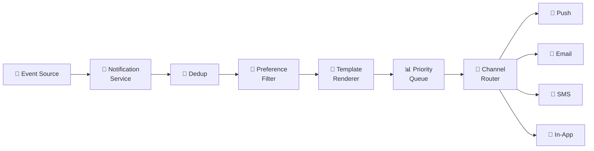
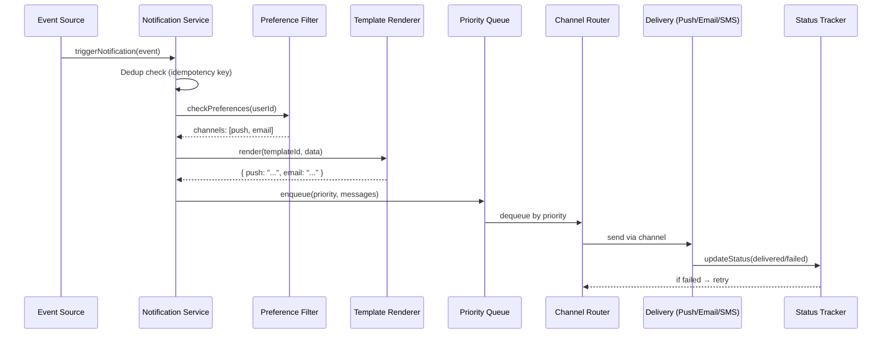
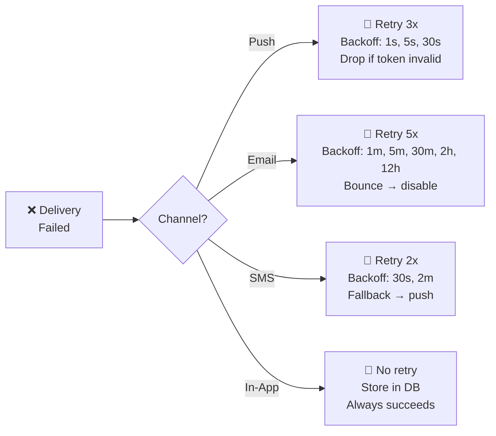
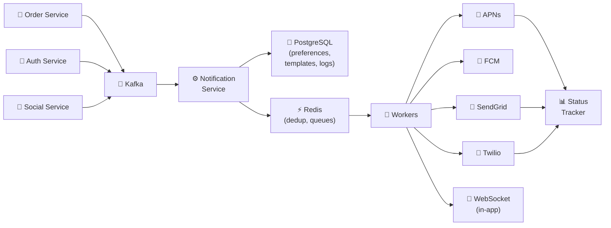

# 🔥 Уровень 11: Проектируем Систему Уведомлений

## 🎯 О чём этот кейс?

Notification System — одна из самых распространённых подсистем в любом продукте. Каждый раз, когда вам приходит push на телефон, email с подтверждением заказа или SMS с кодом авторизации — за кулисами работает notification pipeline. На интервью этот кейс ценят за **многоканальность** и необходимость учитывать предпочтения пользователей.

Аналогия: Notification System — это **почтовое отделение**. Вы приносите письмо (событие), почтальон проверяет, как адресат хочет получать корреспонденцию (push, email, SMS, голубь), форматирует сообщение под нужный конверт (шаблон), кладёт в нужную стопку по приоритету (очередь) и отправляет через правильную службу доставки (канал). А если письмо не дошло — пробует ещё раз.

## 📌 Шаг 1: Требования

### Functional Requirements (что система делает)

1. Отправка уведомлений по нескольким каналам: **Push (APNs/FCM)**, **Email**, **SMS**, **In-App**
2. Управление предпочтениями пользователей (какие каналы включены, тихие часы)
3. Шаблоны уведомлений с динамическими переменными
4. Приоритизация: critical (SMS-код) vs promotional (рассылка)
5. Отслеживание статуса доставки (sent, delivered, failed, read)
6. Retry при неудачной доставке

### Non-Functional Requirements (как система работает)

- **Масштаб** — миллионы уведомлений в день
- **Низкая задержка** — critical уведомления за < 1 сек
- **Надёжность** — critical сообщения (OTP, алерты) не должны теряться
- **Exactly-once delivery** — дедупликация, чтобы не спамить
- **Расширяемость** — легко добавить новый канал (Telegram, WhatsApp)

## 📌 Шаг 2: Каналы доставки

### Push Notifications

```typescript
// Apple Push Notification Service (APNs)
interface APNsPayload {
  aps: {
    alert: { title: string, body: string }
    badge?: number
    sound?: string
    'content-available'?: 1  // silent push
  }
  // Custom data
  orderId?: string
  deepLink?: string
}

// Firebase Cloud Messaging (FCM) — Android + Web
interface FCMPayload {
  notification: { title: string, body: string, image?: string }
  data: Record<string, string>  // Custom key-value
  token: string                  // Device token
  topic?: string                 // Для broadcast
}
```

📌 **Важно**: APNs и FCM — это gateway, а не конечная доставка. Вы отправляете сообщение в APNs, а Apple доставляет его на устройство. Гарантий доставки нет — устройство может быть офлайн.

### Email Delivery

```typescript
// Два подхода: собственный SMTP vs Delivery Service

// ❌ Собственный SMTP — headache с reputation, SPF, DKIM, DMARC
// ✅ Delivery Service — SendGrid, SES, Mailgun

interface EmailRequest {
  to: string
  from: string
  subject: string
  html: string           // Рендеренный шаблон
  replyTo?: string
  headers: {
    'X-Message-Id': string  // Для дедупликации
    'List-Unsubscribe': string  // Обязательно для массовых рассылок
  }
}

// SendGrid webhook → статусы: processed, delivered, bounced, opened, clicked
```

### SMS Gateways

```typescript
// Twilio, Vonage, AWS SNS
interface SMSRequest {
  to: string        // E.164 format: +79161234567
  body: string      // До 160 символов (или multipart)
  priority: 'high' | 'normal'  // High для OTP
}

// SMS — самый дорогой канал ($0.01-0.05 за сообщение)
// Использовать ТОЛЬКО для критических уведомлений (OTP, алерты безопасности)
```

### In-App Notifications

```typescript
// Хранятся в БД, доставляются через WebSocket или polling
interface InAppNotification {
  id: string
  userId: string
  title: string
  body: string
  type: 'info' | 'warning' | 'success' | 'error'
  read: boolean
  createdAt: Date
  actionUrl?: string  // Deep link при клике
}
```

## 🔥 Шаг 3: Notification Pipeline

Сердце системы — pipeline, через который проходит каждое уведомление:



### Жизненный цикл уведомления



### Каждый этап pipeline

```typescript
// 1. TRIGGER — внешний сервис генерирует событие
interface NotificationEvent {
  eventType: 'order_confirmed' | 'otp_code' | 'promotion' | 'security_alert'
  userId: string
  data: Record<string, unknown>     // Переменные для шаблона
  idempotencyKey: string             // Для дедупликации
  priority: 'critical' | 'high' | 'normal' | 'low'
}

// 2. DEDUP — проверяем, не отправляли ли уже
async function dedup(event: NotificationEvent): Promise<boolean> {
  const key = `dedup:${event.idempotencyKey}`
  const exists = await redis.get(key)
  if (exists) return false  // Уже обработано
  await redis.setex(key, 86400, '1')  // TTL 24 часа
  return true
}

// 3. PREFERENCE CHECK — что включено у пользователя
interface UserPreferences {
  userId: string
  channels: {
    push: boolean
    email: boolean
    sms: boolean
    inApp: boolean
  }
  quietHours: { start: string, end: string } | null  // "23:00"-"08:00"
  timezone: string
  unsubscribed: string[]  // ['promotion', 'newsletter']
}

// 4. TEMPLATE RENDER — подставляем переменные
// "Ваш заказ {{orderNumber}} подтверждён" → "Ваш заказ #12345 подтверждён"

// 5. PRIORITY QUEUE — critical первым, low последним

// 6. CHANNEL ROUTER — направляет в нужный канал

// 7. DELIVERY — отправка через provider (APNs, SendGrid, Twilio)
```

## 🔥 Шаг 4: Priority Queue и маршрутизация

### Очереди по приоритетам

```typescript
// Отдельная очередь для каждого приоритета
// Critical обрабатывается НЕМЕДЛЕННО, low — в фоне

const QUEUES = {
  critical: 'notifications:critical',  // OTP, security alerts
  high:     'notifications:high',      // Order updates, payments
  normal:   'notifications:normal',    // Social (likes, comments)
  low:      'notifications:low',       // Promotions, newsletters
}

// Worker читает очереди в порядке приоритета:
// 1. Есть critical? → обработать
// 2. Есть high? → обработать
// 3. Есть normal? → обработать
// 4. Есть low? → обработать

async function processQueues() {
  for (const priority of ['critical', 'high', 'normal', 'low']) {
    const message = await redis.lpop(QUEUES[priority])
    if (message) {
      await deliverNotification(JSON.parse(message))
      return  // После обработки начинаем сначала (critical first)
    }
  }
}
```

💡 **Почему отдельные очереди, а не одна с приоритетом?** В одной очереди 10 млн промо-рассылок заблокируют OTP-коды. Отдельные очереди — physical isolation: у critical свои workers, свои ресурсы.

## 🔥 Шаг 5: Retry Strategy per Channel

Каждый канал имеет свои особенности отказов и свою стратегию повторов:



```typescript
interface RetryPolicy {
  maxRetries: number
  backoffMs: number[]          // Задержки между попытками
  permanentFailureCodes: string[]  // Не повторять при этих ошибках
  fallbackChannel?: string     // Куда переключиться при полном провале
}

const RETRY_POLICIES: Record<string, RetryPolicy> = {
  push: {
    maxRetries: 3,
    backoffMs: [1000, 5000, 30000],
    permanentFailureCodes: ['InvalidToken', 'Unregistered'],
    // InvalidToken → удалить device token из БД
  },
  email: {
    maxRetries: 5,
    backoffMs: [60000, 300000, 1800000, 7200000, 43200000],
    permanentFailureCodes: ['HardBounce', 'SpamComplaint'],
    // HardBounce → пометить email как невалидный
  },
  sms: {
    maxRetries: 2,
    backoffMs: [30000, 120000],
    permanentFailureCodes: ['InvalidNumber', 'Blacklisted'],
    fallbackChannel: 'push',  // SMS не прошёл → попробовать push
  },
  inApp: {
    maxRetries: 0,  // Просто записываем в БД — всегда "успешно"
    backoffMs: [],
    permanentFailureCodes: [],
  },
}
```

⚠️ **APNs Feedback Service**: Apple возвращает список невалидных device tokens. Нужно регулярно (раз в час) запрашивать feedback и удалять невалидные токены, иначе Apple начнёт троттлить ваши push.

## 📌 Шаг 6: Delivery Status Tracking

```typescript
// Хранение статуса доставки каждого уведомления
interface DeliveryRecord {
  notificationId: string
  userId: string
  channel: 'push' | 'email' | 'sms' | 'inApp'
  status: 'pending' | 'sent' | 'delivered' | 'failed' | 'read'
  attempts: number
  lastAttemptAt: Date
  deliveredAt?: Date
  failReason?: string
  providerMessageId?: string  // ID от SendGrid/Twilio для трекинга
}

// Webhook от провайдеров обновляет статус
// SendGrid: delivered, bounced, opened
// Twilio: sent, delivered, undelivered
// APNs: через Feedback Service
```

## 📌 Шаг 7: Архитектура



### Data Model

```typescript
// Таблица templates
interface NotificationTemplate {
  id: string
  eventType: string          // 'order_confirmed'
  channel: string            // 'push' | 'email' | 'sms'
  locale: string             // 'ru' | 'en'
  subject?: string           // Для email
  body: string               // "Заказ {{orderNumber}} подтверждён"
  version: number            // Версионирование шаблонов
}

// Таблица user_preferences
// (см. интерфейс UserPreferences выше)

// Таблица delivery_log
// (см. интерфейс DeliveryRecord выше)

// Таблица device_tokens
interface DeviceToken {
  userId: string
  token: string
  platform: 'ios' | 'android' | 'web'
  createdAt: Date
  lastUsedAt: Date
  isValid: boolean
}
```

## 📌 Шаг 8: Template Rendering

```typescript
// Простой Handlebars-подобный рендерер
function renderTemplate(template: string, data: Record<string, unknown>): string {
  return template.replace(/\{\{(\w+)\}\}/g, (_, key) => {
    return String(data[key] ?? `{{${key}}}`)
  })
}

// Пример использования
const template = 'Привет, {{userName}}! Ваш заказ #{{orderNumber}} подтверждён.'
const rendered = renderTemplate(template, {
  userName: 'Анна',
  orderNumber: '12345',
})
// → "Привет, Анна! Ваш заказ #12345 подтверждён."

// Для email — полноценный HTML-шаблон с layout
// Для push — короткий текст (до 4KB для APNs)
// Для SMS — до 160 символов (или multipart)
```

## ⚠️ Частые ошибки новичков

### Ошибка 1: Одна очередь для всех приоритетов

```
❌ Плохо:
// Все уведомления в одной очереди
queue.push(otpCode)         // Critical!
queue.push(promoEmail1)     // Low
queue.push(promoEmail2)     // Low
// ... 10 млн промо-рассылок ...
queue.push(securityAlert)   // Critical — но застрял за 10 млн промо!
```

```
✅ Хорошо:
// Отдельные очереди по приоритетам
criticalQueue.push(otpCode)       // Обрабатывается мгновенно
lowQueue.push(promoEmail1)        // Обрабатывается когда руки дойдут
criticalQueue.push(securityAlert) // Тоже мгновенно, не ждёт промо
```

### Ошибка 2: Нет дедупликации — пользователь получает 5 одинаковых push

```
❌ Плохо:
// Retry при timeout без idempotency key
async function send(notification) {
  try {
    await pushService.send(notification)  // Timeout!
  } catch {
    await pushService.send(notification)  // Отправили второй раз
    // А первый тоже дошёл — пользователь получил 2 push
  }
}
```

```
✅ Хорошо:
// Idempotency key: одно событие = одна доставка
async function send(notification) {
  const dedupKey = `sent:${notification.idempotencyKey}:${notification.channel}`
  if (await redis.exists(dedupKey)) return  // Уже отправлено
  await pushService.send(notification)
  await redis.setex(dedupKey, 86400, '1')
}
```

### Ошибка 3: Не учитывать тихие часы и предпочтения

```
❌ Плохо:
// Промо-рассылка в 3 часа ночи по локальному времени пользователя
await sendPush(userId, 'Скидка 50%!')  // Пользователь отписался от промо
// Результат: жалоба, отключение push, потеря пользователя
```

```
✅ Хорошо:
// Проверяем предпочтения и тихие часы
const prefs = await getPreferences(userId)
if (prefs.unsubscribed.includes('promotion')) return
if (isQuietHours(prefs.quietHours, prefs.timezone)) {
  await scheduleForLater(notification, getQuietHoursEnd(prefs))
  return
}
```

### Ошибка 4: Единая retry-стратегия для всех каналов

```
❌ Плохо:
// Одинаковый retry для push и email
const RETRY_DELAY = 60000  // 1 минута для всех
// Push с невалидным токеном будет зря повторяться 5 раз
// Email с soft bounce нужно ждать дольше
```

```
✅ Хорошо:
// Стратегия зависит от канала и типа ошибки
// Push: InvalidToken → сразу прекратить, удалить токен
// Email: SoftBounce → retry через 30 мин, HardBounce → прекратить
// SMS: не доставлено → fallback на push
```

## 🎯 Итоги

| Аспект | Решение |
|--------|---------|
| **Каналы** | Push (APNs/FCM), Email (SendGrid/SES), SMS (Twilio), In-App (WebSocket) |
| **Pipeline** | Event → Dedup → Preference → Template → Priority Queue → Router → Deliver → Track |
| **Приоритеты** | 4 уровня: critical/high/normal/low, физически отдельные очереди |
| **Дедупликация** | Idempotency key + Redis SET с TTL |
| **Retry** | Per-channel: push (3x, 1-30s), email (5x, 1m-12h), SMS (2x + fallback) |
| **Предпочтения** | Каналы, тихие часы, отписки по категориям, timezone |
| **Шаблоны** | Handlebars-подобные, версионированные, per-channel + per-locale |
| **Статусы** | pending → sent → delivered → read (или failed + reason) |
| **Масштаб** | Kafka для ingestion, Redis для очередей, workers с auto-scaling |

💡 На интервью ключевой момент — показать, что вы понимаете **разницу между каналами** (стоимость, задержка, надёжность) и умеете строить **приоритизированный pipeline** с retry и дедупликацией. Notification System — это не просто "отправить сообщение", а полноценный data pipeline с гарантиями доставки.
