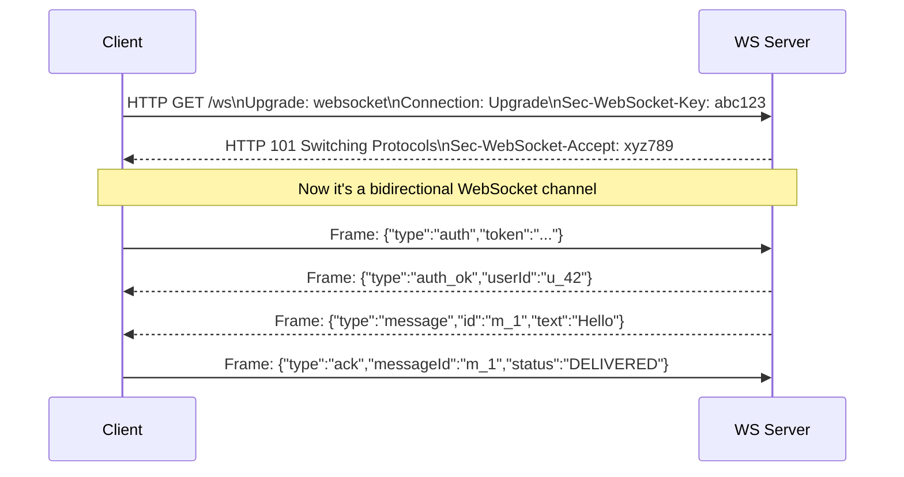
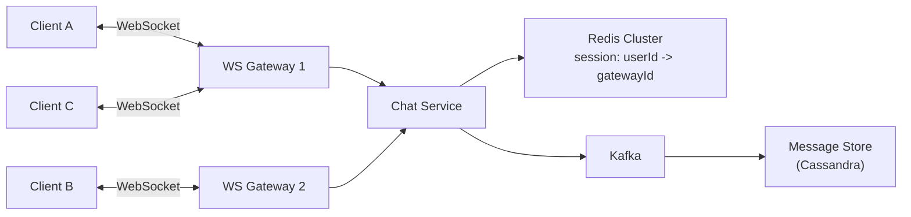
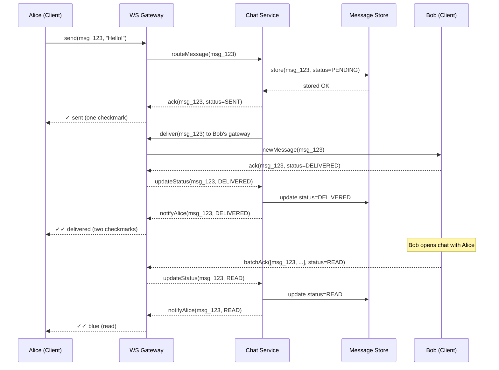
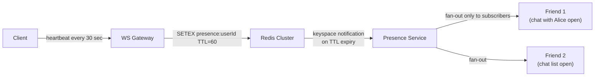
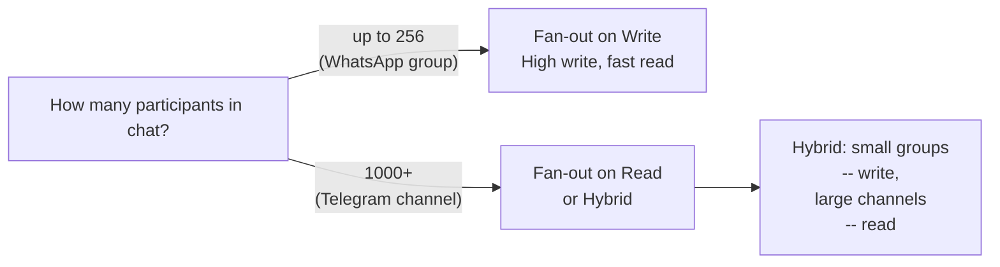
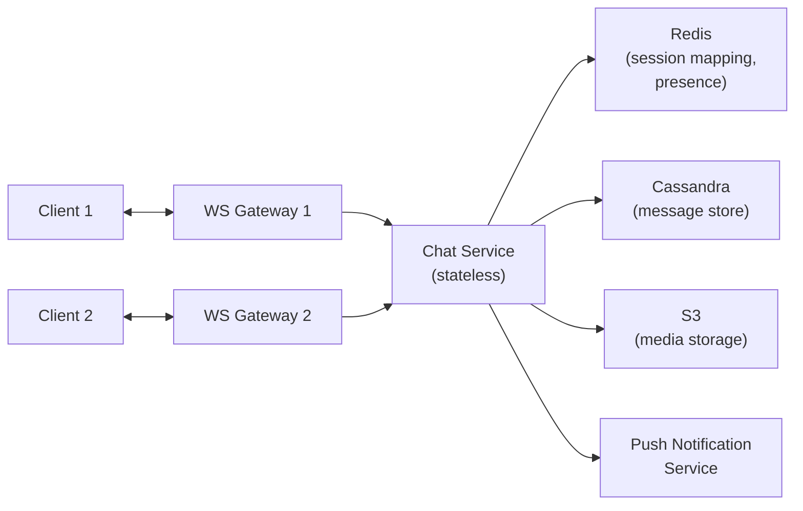

# Level 12: Designing a Chat System -- Real-Time, Message Delivery, and Groups

## Introduction

Imagine a post office of the future where couriers work in two modes. When the recipient is home -- the courier rings the intercom and hands the letter directly. When the recipient isn't home -- the letter goes into a storage cell with a personal code, and as soon as the recipient appears, their phone gets a notification: "Pick up your packages." Each envelope has three stamps: "sent by courier service" (✓), "handed over" (✓✓), "recipient signed" (✓✓ in blue). The dispatcher in the center knows which courier is carrying which package and at whose door they're standing.

This is exactly how a messenger works. A WebSocket connection is the intercom, always open between courier and recipient. Redis is the dispatcher's board with courier names and intercom numbers. Cassandra is the archive of all correspondence. And the three checkmarks are a confirmation protocol that guarantees: the letter wasn't lost at any stage.

Behind the apparent simplicity of "sending text" lies a multi-level system: managing millions of persistent connections, guaranteed delivery with unstable internet, correct message ordering with simultaneous sending, efficient group distribution. WhatsApp serves 2+ billion users and delivers 100+ billion messages daily -- and does it on relatively small infrastructure thanks to the right architectural decisions.

At this level we'll cover in detail:

1. **WebSocket and why HTTP isn't suitable** -- technical limitations of polling and advantages of persistent connections
2. **WebSocket Gateway -- stateful service** -- how to scale connections and route messages
3. **Delivery protocol and three statuses** -- how checkmarks work internally
4. **Presence Service** -- heartbeat, TTL in Redis, and subscription model
5. **Fan-out on Write vs Fan-out on Read** -- key decision for group chats
6. **Message storage** -- data model, sharding by chatId, sync between devices
7. **Media upload** -- pre-signed URLs and why files don't go through WebSocket
8. **Offline queuing** -- what happens while the recipient is unavailable
9. **Complete architecture** -- how all components work together

---

## 1. Requirements

Correct requirement setting in an interview is half the success. The interviewer evaluates whether you can separate the mandatory minimum from nice-to-have extras, and whether you ask the right clarifying questions.

### Functional Requirements (what the system does)

1. **1-to-1 chat** -- sending and receiving messages in real time
2. **Group chat** -- up to 256 participants (like WhatsApp)
3. **Delivery statuses** -- sent (✓), delivered (✓✓), read (✓✓ in blue)
4. **Online/Offline status** -- "last seen 5 minutes ago"
5. **Media sending** -- photos, videos, files
6. **Offline mode** -- messages are delivered when the recipient comes online
7. **Message history** -- synchronization between devices

### Non-Functional Requirements (how the system works)

- **Low latency** -- message delivery < 200ms for online users
- **Scale** -- millions of simultaneous connections
- **Reliability** -- messages aren't lost, delivered at least once (at-least-once)
- **Ordering** -- messages displayed in sending order
- **Consistency** -- both conversation partners see the same history

### Clarifying Questions for Interview

In a real interview, always clarify:

- Maximum group size? (256 -- WhatsApp, 200,000 -- Telegram)
- Are "typing..." indicators needed?
- How many online users simultaneously? (affects presence)
- Is end-to-end encryption needed? (affects storage architecture)
- How many years to store history?

---

## 2. WebSocket -- Foundation of Real-Time Communication

### Why HTTP Polling Isn't Suitable for Chat

Before talking about WebSocket, it's important to understand why regular HTTP creates problems.

In the classic request-response model, the client always initiates the exchange: "any new messages?" -- "no" -- "any new messages?" -- "no" -- ... This is polling. With 10 million active users polling the server every 3 seconds, that's 200 million requests per minute -- and 99% return empty answers. The server works in vain.

Long polling is an improvement: the server doesn't respond immediately, but "holds" the request open until new data appears. Latency drops to hundreds of milliseconds. But each "held" connection consumes a server thread or goroutine, and after a disconnect, a new HTTP handshake with headers is needed.

WebSocket solves the problem fundamentally. After one HTTP handshake (upgrade request), the connection switches to a bidirectional streaming mode. The server can send data to the client at any time -- without a request. Overhead per message drops from ~800 bytes (HTTP headers) to ~2 bytes (WebSocket frame header).

| Approach | Latency | Server Load | Bidirectional | Suitable for Chat? |
|--------|----------|--------------------|-------------------|--------------------|
| **HTTP Polling** | 1--30 sec (interval) | Huge: millions of empty requests | No | No |
| **Long Polling** | ~0.5 sec | Medium: connection held | No | Only as fallback |
| **SSE** | ~100ms | Medium: server→client stream | Only server→client | No (no bidirectional) |
| **WebSocket** | ~50ms | Minimal: persistent connection | Yes | Yes |

```typescript
// HTTP Polling: client asks every 3 seconds
// ❌ 10M users × 20 requests/min = 200M requests/min (almost all empty)
setInterval(async () => {
  const response = await fetch('/api/messages?since=' + lastTimestamp)
  const messages = await response.json()
  // 99% of the time messages = [] -- empty array, but request was made
}, 3000)

// WebSocket: persistent connection, data only when there are events
// ✅ 10M users = 10M connections, messages only on events
const ws = new WebSocket('wss://chat.example.com/ws')
ws.onmessage = (event) => {
  const message = JSON.parse(event.data)
  displayMessage(message)
}
```

### How WebSocket Handshake Works

The client sends a regular HTTP request with the `Upgrade: websocket` header. The server responds with status `101 Switching Protocols` -- and from that point, the same TCP connection is used as a bidirectional channel. HTTP headers are no longer needed: each WebSocket frame contains only 2--14 bytes of service information.



### WebSocket Gateway -- Stateful Service Architecture

Here arises the key engineering problem. WebSocket connections are stateful: they're "bound" to a specific server process. If Alice is connected to Gateway-1, and Bob to Gateway-2, and Alice writes to Bob -- how does the message from Gateway-1 reach Gateway-2, where Bob's connection lives?

The solution is two-tiered. WS Gateway is a thin proxy that only holds connections and forwards messages. All business logic is in the Chat Service, which is stateless and scales horizontally. The mapping "userId → which Gateway the connection lives on" is stored in Redis -- a fast shared registry for all Chat Service instances.



```typescript
// WSConnection -- what the Gateway keeps in memory
interface WSConnection {
  userId: string
  deviceId: string         // User can be on multiple devices
  socket: WebSocket
  connectedAt: Date
  gatewayId: string        // ID of this Gateway server
}

// On connect -- register in Redis
async function onConnect(userId: string, deviceId: string, socket: WebSocket) {
  const conn: WSConnection = { userId, deviceId, socket, connectedAt: new Date(), gatewayId: MY_GATEWAY_ID }

  // Local connection registry
  connections.set(`${userId}:${deviceId}`, conn)

  // Global registry in Redis: userId -> gatewayId
  // EX 86400 -- auto-cleanup if Gateway crashes without proper disconnect
  await redis.setex(`session:${userId}:${deviceId}`, 86400, MY_GATEWAY_ID)
}

// Routing incoming message
async function routeMessage(recipientId: string, message: ChatMessage) {
  // Find all devices of the recipient
  const deviceKeys = await redis.keys(`session:${recipientId}:*`)

  if (deviceKeys.length === 0) {
    // User offline -- save to offline queue
    await storeOfflineMessage(recipientId, message)
    return
  }

  for (const key of deviceKeys) {
    const gatewayId = await redis.get(key)
    if (gatewayId === MY_GATEWAY_ID) {
      // Recipient on same Gateway -- deliver directly
      const deviceId = key.split(':')[2]
      const conn = connections.get(`${recipientId}:${deviceId}`)
      conn?.socket.send(JSON.stringify(message))
    } else {
      // Recipient on different Gateway -- send through internal bus
      await publishToGateway(gatewayId, recipientId, message)
    }
  }
}
```

**Why Gateway as a separate service?** WebSocket connections require specific optimization: event loop, epoll/kqueue, minimal GC pressure. Go and Erlang allow holding a million connections on one server. If you mix this with business logic (validation, DB writes, fan-out) -- scaling and deploying becomes an order of magnitude harder.

---

## 3. Message Delivery and Three Statuses

### Why a Confirmation Protocol Is Needed

Sending a message and forgetting isn't enough. The network is unreliable: packets are lost, connections break, servers crash under load. Without a confirmation protocol, the user has no answer to: "did the message arrive?"

Three checkmarks aren't just a UX decoration. They're a public API of the reliability protocol:

- **✓ Sent** -- "the server received and saved your message." If the phone dies right now -- the message won't be lost.
- **✓✓ Delivered** -- "the recipient's device received the message." If the recipient isn't reading notifications -- you know they'll arrive.
- **✓✓ Read (blue)** -- "the recipient opened the chat and saw the message." No denial possible.

### Full Delivery Flow



### Confirmation Protocol Implementation

```typescript
// Message states -- strict state machine
// Transitions only one way: SENDING -> SENT -> DELIVERED -> READ
type MessageStatus = 'SENDING' | 'SENT' | 'DELIVERED' | 'READ'

interface ChatMessage {
  messageId: string        // Globally unique Snowflake ID
  chatId: string
  senderId: string
  content: string
  contentType: 'text' | 'image' | 'video' | 'file'
  mediaUrl?: string
  status: MessageStatus
  createdAt: number        // Unix timestamp in milliseconds
  clientTimestamp: number  // Time of sending on client (for ordering with bad network)
}

// --- Client side ---

// Sending message: immediately show in UI with SENDING status
function sendMessage(chatId: string, text: string): string {
  const messageId = generateLocalId()  // Temporary ID until server responds

  // Optimistic UI: show message immediately, don't wait for server
  displayMessage({ messageId, chatId, content: text, status: 'SENDING' })

  ws.send(JSON.stringify({
    type: 'send_message',
    clientMessageId: messageId,
    chatId,
    content: text,
    clientTimestamp: Date.now(),
  }))

  // Timeout: if no SENT after 5 sec -- show error
  setTimeout(() => {
    if (getMessageStatus(messageId) === 'SENDING') {
      markMessageFailed(messageId)
    }
  }, 5000)

  return messageId
}

// Receiving message: display + send DELIVERED ack
function onMessageReceived(message: ChatMessage) {
  displayMessage(message)

  // Immediate ack of delivery -- server updates status for sender
  ws.send(JSON.stringify({
    type: 'ack',
    messageId: message.messageId,
    status: 'DELIVERED',
    timestamp: Date.now(),
  }))
}

// Opening chat: mark all unread as READ in one batch
function onChatOpened(chatId: string) {
  const unreadIds = getUnreadMessageIds(chatId)
  if (unreadIds.length === 0) return

  // ✅ One batch_ack instead of N separate -- saves on round-trips
  ws.send(JSON.stringify({
    type: 'batch_ack',
    messageIds: unreadIds,
    status: 'READ',
    timestamp: Date.now(),
  }))
}
```

**Important about batch_ack**: if there are 200 unread messages in a chat and the client sends 200 separate READ acks -- that's 200 WebSocket frames, 200 DB writes, 200 notifications to the sender. A batch allows one write with a messageId range and one notification.

### Idempotency and At-Least-Once Delivery

The network is unreliable: an ack can be lost, the connection can break during delivery. Therefore, the server must be able to receive the same message twice without duplication. The idempotency key is the clientMessageId, which the client generates before sending.

```typescript
// Server: processing incoming message with idempotency
async function handleSendMessage(senderId: string, payload: SendMessagePayload) {
  const { clientMessageId, chatId, content } = payload

  // Check: haven't we already processed this message?
  const existing = await messageStore.findByClientId(senderId, clientMessageId)
  if (existing) {
    // Duplicate -- just return the same ack
    return { messageId: existing.messageId, status: 'SENT' }
  }

  // Create Snowflake ID for new message
  const messageId = snowflake.generate()

  await messageStore.insert({
    messageId,
    clientMessageId,  // Save for idempotency
    chatId,
    senderId,
    content,
    status: 'SENT',
    createdAt: Date.now(),
  })

  return { messageId, status: 'SENT' }
}
```

---

## 4. Presence Service -- Online Status of Users

### The Problem of Determining Online Status

Seems like a simple task: if a user has an open WebSocket connection -- they're online. But what if the app is minimized? The phone lost signal? The user fell asleep without closing the chat? A WebSocket connection can "hang" without activity for a long time.

The solution is heartbeat: the client periodically sends an "I'm here" signal. If heartbeats stop arriving -- we consider the user offline.

### Heartbeat and TTL

The mechanism is elegantly simple: a Redis key with TTL (time to live). As long as heartbeats arrive -- the key is refreshed. As soon as heartbeats stop -- the key automatically disappears. No background process, no manual cleanup.



```typescript
const HEARTBEAT_INTERVAL_MS = 30_000   // Client sends every 30 sec
const PRESENCE_TTL_SEC = 60            // If no heartbeat for 60 sec -- offline

// On each heartbeat from client
async function handleHeartbeat(userId: string) {
  const wasOnline = await redis.exists(`presence:${userId}`)

  // Update TTL key
  await redis.setex(`presence:${userId}`, PRESENCE_TTL_SEC, Date.now().toString())

  if (!wasOnline) {
    // User just came online
    // Save separate key for "last seen" in case they go offline
    await publishPresenceChange(userId, 'online')
  }
}

// When TTL expires, Redis publishes a keyspace notification
// Presence Service subscribes to these events
redis.subscribe('__keyevent@0__:expired', (key) => {
  if (key.startsWith('presence:')) {
    const userId = key.replace('presence:', '')
    handleUserWentOffline(userId)
  }
})

async function handleUserWentOffline(userId: string) {
  // Save last seen time for "last seen X minutes ago"
  await redis.set(`last_seen:${userId}`, Date.now().toString())
  await publishPresenceChange(userId, 'offline')
}

// Status query
async function getPresence(userId: string): Promise<PresenceInfo> {
  const activeTs = await redis.get(`presence:${userId}`)
  if (activeTs) {
    return { status: 'online', lastSeen: parseInt(activeTs) }
  }

  const lastSeen = await redis.get(`last_seen:${userId}`)
  return {
    status: 'offline',
    lastSeen: lastSeen ? parseInt(lastSeen) : null,
  }
}
```

### Fan-out Presence: Subscription Model

Naive approach: on status change, notify all of the user's contacts. With 500 contacts and 10 million users changing status simultaneously at peak hours -- that's 5 billion notifications per minute. Unacceptable.

The right approach -- subscription model. The client subscribes to presence only for users currently visible on screen. Opened the chat list -- subscribed to presence of the last 20 conversation partners. Opened a specific chat -- subscribed to that person's presence. Minimized the app -- all subscriptions cancelled.

```typescript
// Client manages subscriptions explicitly
interface PresenceSubscription {
  subscriberId: string    // Who wants to know the status
  targetUserId: string    // Who we're watching
  context: 'chat' | 'contact_list'
}

// On opening chat list -- subscribe to presence of last N conversation partners
function onChatListOpened(recentChatUserIds: string[]) {
  ws.send(JSON.stringify({
    type: 'subscribe_presence',
    userIds: recentChatUserIds.slice(0, 20),  // No more than 20 simultaneously
  }))
}

// On opening specific chat -- subscribe only to that user
function onChatOpened(targetUserId: string) {
  ws.send(JSON.stringify({
    type: 'subscribe_presence',
    userIds: [targetUserId],
  }))
}

// On leaving screen -- unsubscribe
function onScreenLeft() {
  ws.send(JSON.stringify({ type: 'unsubscribe_presence_all' }))
}

// Server: when Alice changes status -- notify only her subscribers
async function publishPresenceChange(userId: string, status: 'online' | 'offline') {
  // Get subscriber list from Redis Set
  const subscribers = await redis.smembers(`presence_subscribers:${userId}`)

  const update = { type: 'presence_update', userId, status, timestamp: Date.now() }

  for (const subscriberId of subscribers) {
    await deliverToUser(subscriberId, update)
  }

  // If subscribers.length == 0 -- don't waste resources at all
}
```

**Why this matters in interviews**: naive fan-out presence is a classic trap. Always name the subscription model and explain that the client subscribes only to visible users.

---

## 5. Fan-out on Write vs Fan-out on Read

This is one of the key architectural decisions for group chats, and interviewers always ask about it.

### The Problem

Alice sent a message to a group of 256 people. When should we create records in storage for each participant -- right at sending (fan-out on write) or at reading (fan-out on read)?

### Fan-out on Write -- WhatsApp's Approach

On sending, immediately create a record in each participant's "inbox." Reading a chat, each sees only their own data -- no JOIN queries.

```typescript
// On sending: N records for N group members
async function sendGroupMessage(senderId: string, groupId: string, text: string) {
  const messageId = snowflake.generate()
  const message = {
    messageId,
    groupId,
    senderId,
    text,
    timestamp: Date.now(),
  }

  // Get member list (cached in Redis)
  const members = await getGroupMembers(groupId)

  // Write to each member's inbox
  // In practice -- via Kafka, asynchronously, not blocking sender response
  const insertPromises = members.map(memberId =>
    messageStore.insert({
      recipientId: memberId,  // Key for inbox sharding
      chatId: groupId,
      ...message,
    })
  )

  await Promise.all(insertPromises)

  // Try to deliver to online members via WebSocket
  await tryDeliverToOnlineMembers(members, message)
}

// Reading: fast, only own data
async function getMessages(userId: string, chatId: string, before?: string) {
  return messageStore.query({
    recipientId: userId,  // Only this user's records
    chatId,
    beforeMessageId: before,
    limit: 50,
  })
}
```

**Pros of fan-out on write:**
- Lightning-fast reading -- user reads only their own inbox
- Straightforward delivery -- each user has their own queue
- Easy to "delete for myself" -- delete own record

**Cons of fan-out on write:**
- Expensive writing -- 256 records per one message
- Storage multiplies by number of participants
- When a new member joins the group -- they don't see history (no old records in their inbox)

### Fan-out on Read -- Alternative Approach

On sending, create one record in group storage. On reading -- each participant queries this shared storage.

```typescript
// On sending: one record
async function sendGroupMessage(senderId: string, groupId: string, text: string) {
  await messageStore.insert({
    chatId: groupId,  // Group shared storage
    senderId,
    text,
    timestamp: Date.now(),
  })
}

// Reading: query shared storage
async function getMessages(userId: string, chatId: string, afterTimestamp: number) {
  // Need to know when user joined the group
  const joinedAt = await getJoinTimestamp(userId, chatId)

  return messageStore.query({
    chatId,
    // Show only messages after joining the group
    afterTimestamp: Math.max(afterTimestamp, joinedAt),
    limit: 50,
  })
}
```

**Pros of fan-out on read:**
- Storage doesn't multiply -- one copy for all
- Fast writing -- one operation
- New member immediately sees history

**Cons of fan-out on read:**
- On reading, need scatter-gather across shards (for large groups)
- Harder to implement "delete for myself"
- For 10 million channel members -- each read = heavy query

### Comparison and When to Choose What

| Criterion | Fan-out on Write | Fan-out on Read |
|----------|------------------|-----------------|
| **Write latency** | High (N records) | Low (1 record) |
| **Read latency** | Low (own inbox) | High (shared storage) |
| **Storage** | × N (by participant count) | × 1 |
| **Real-time delivery** | Simple (inbox per user) | Harder (shared stream) |
| **History for new members** | No (no old records in inbox) | Yes (shared storage) |
| **Suitable for** | 1-to-1, groups up to 256 | Channels with thousands of subscribers |



**Hybrid approach** (Telegram): for groups up to 1,000 -- fan-out on write. For channels with millions of subscribers -- fan-out on read. The boundary is determined experimentally by the read/write load ratio.

---

## 6. Message Storage

### Why Cassandra / ScyllaDB

Messenger load is write-heavy: WhatsApp -- 100+ billion messages per day, i.e., ~1.2 million writes per second. A relational DB with ACID transactions has too high overhead for writes. A DB optimized for write throughput with horizontal scaling is needed.

Cassandra writes to an LSM-tree (Log-Structured Merge Tree): all writes first go to an in-memory buffer (memtable), periodically flushed to disk as sorted files (SSTable). Writes are always sequential -- no random IO.

```typescript
// Cassandra data model
// Partition key: chatId -- all messages of one chat on one node
// Clustering key: message_id -- ordered within partition

// CREATE TABLE messages (
//   chat_id UUID,
//   message_id TIMEUUID,
//   sender_id UUID,
//   content TEXT,
//   content_type TEXT,
//   media_url TEXT,
//   status TEXT,
//   created_at TIMESTAMP,
//   PRIMARY KEY (chat_id, message_id)
// ) WITH CLUSTERING ORDER BY (message_id DESC);

// Query: all messages for a chat, newest first
// SELECT * FROM messages WHERE chat_id = ? ORDER BY message_id DESC LIMIT 50;
```

### Sharding by chatId

All messages of one chat are stored on the same shard. This makes reading a chat's history a single-node operation -- very fast.

**Problem:** very active chats (celebrity groups) can overload a single shard. Solution: add a date bucket to the partition key: `chat_id + date_bucket`.

---

## 7. Media Upload

### Why Media Doesn't Go Through WebSocket

WebSocket is for text and small binary data. Photos, videos, and files are too large and would block the connection during upload.

**Solution:** pre-signed URLs.

```typescript
// Client requests upload URL
const uploadUrl = await fetch('/api/media/upload', {
  method: 'POST',
  body: JSON.stringify({ filename: 'photo.jpg', size: 5_000_000, mimeType: 'image/jpeg' })
})

// Client uploads directly to S3 (not through your server!)
await fetch(uploadUrl.url, {
  method: 'PUT',
  body: fileData,
  headers: { 'Content-Type': 'image/jpeg' }
})

// Client sends message with media reference
ws.send(JSON.stringify({
  type: 'send_message',
  chatId: 'chat_123',
  content: 'Check this out!',
  contentType: 'image',
  mediaUrl: uploadUrl.mediaUrl,  // S3 URL
}))
```

This offloads the bandwidth from your servers to S3/CDN, which is designed for large file transfers.

---

## 8. Offline Queuing

### What Happens When the Recipient Is Offline

When a message is sent to an offline user, it's stored in an offline queue. When the user comes online, all queued messages are delivered.

```typescript
async function storeOfflineMessage(recipientId: string, message: ChatMessage) {
  // Store in Cassandra (already done as part of send flow)
  // Mark as pending delivery
  await messageStore.updateStatus(message.messageId, 'PENDING')

  // Optionally: push notification to wake up the user's device
  await pushNotification.send({
    userId: recipientId,
    title: 'New message',
    body: message.content.substring(0, 50),
    data: { chatId: message.chatId }
  })
}

// When user connects, deliver all pending messages
async function deliverPendingMessages(userId: string, deviceId: string) {
  const pending = await messageStore.getPendingMessages(userId)

  for (const message of pending) {
    await deliverToUser(userId, deviceId, message)
    await messageStore.updateStatus(message.messageId, 'DELIVERED')
  }
}
```

---

## 9. Complete Architecture



Architectural principles:

- **Stateless Chat Service** -- handles business logic, scales horizontally
- **Stateful WS Gateways** -- hold connections, mapped via Redis
- **Cassandra for messages** -- write-optimized, sharded by chatId
- **Redis for presence and sessions** -- fast lookups, TTL-based expiration
- **S3 for media** -- pre-signed URLs, direct client upload
- **Push Notifications** -- wake up offline devices

---

## Common Mistakes

### Mistake 1: Storing Messages in a Relational DB

With millions of writes per second, PostgreSQL/MySQL can't keep up. Cassandra or ScyllaDB are designed for this workload.

### Mistake 2: Fan-out on Write for Large Groups

Creating 10,000 records for a Telegram channel message is wasteful. Use fan-out on read for large groups.

### Mistake 3: Sending Media Through WebSocket

WebSocket connections would be blocked during large file transfers. Use pre-signed URLs to S3.

### Mistake 4: Naive Presence Fan-out

Notifying all 500 contacts on every status change creates billions of unnecessary notifications. Use subscription model.

### Mistake 5: No Idempotency on Message Sending

Without clientMessageId deduplication, network retries create duplicate messages. Always check for duplicates.

---

## Summary

| Component | Key Decision |
|-----------|-------------|
| **Real-time transport** | WebSocket for bidirectional, HTTP polling only as fallback |
| **Gateway architecture** | Stateful WS Gateways + stateless Chat Service, mapping in Redis |
| **Delivery protocol** | Three statuses (SENT/DELIVERED/READ) with ack messages |
| **Presence** | Heartbeat + Redis TTL + subscription model (not fan-out to all contacts) |
| **Group chats** | Fan-out on Write for small groups, Fan-out on Read for large channels |
| **Message storage** | Cassandra/ScyllaDB, sharded by chatId |
| **Media** | Pre-signed URLs to S3, direct client upload |
| **Offline** | Store in DB, push notification to wake device, deliver on reconnect |

**Main principle:** the write path (sending) and read path (receiving) have fundamentally different requirements. Optimize writes for throughput (LSM-tree, async fan-out) and reads for latency (single-shard queries, cached inbox).
