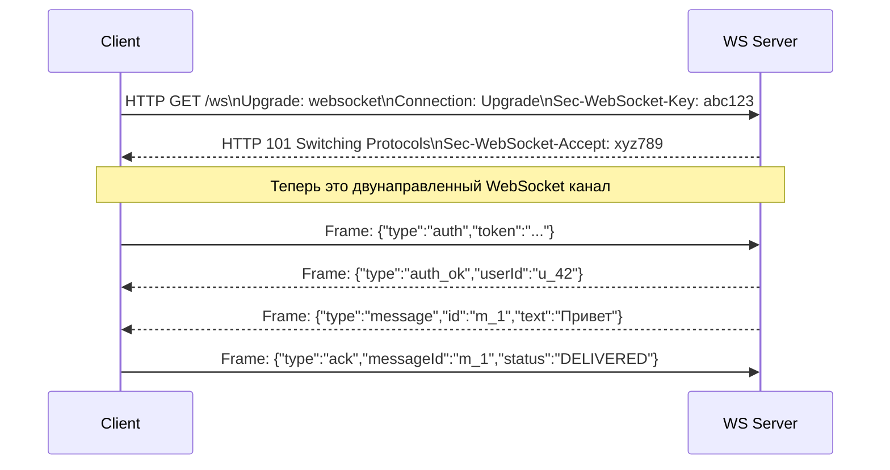
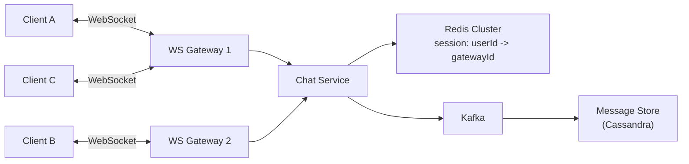
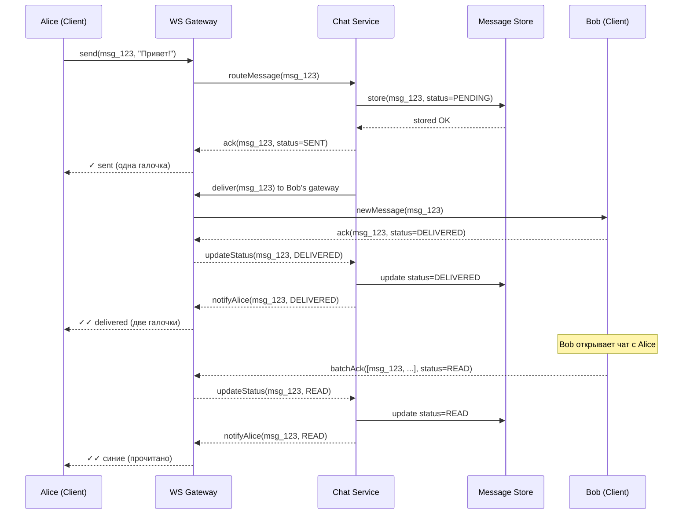
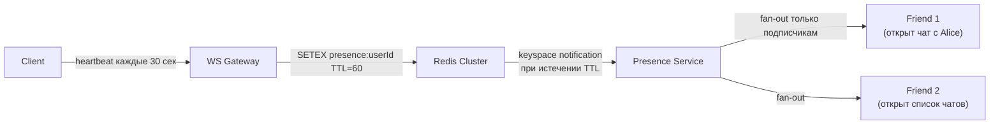
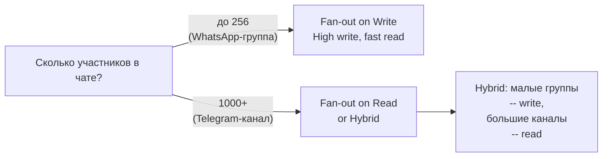
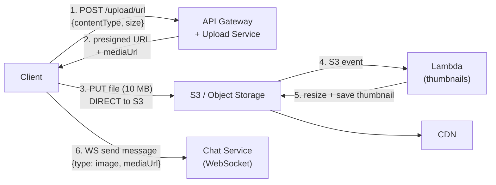
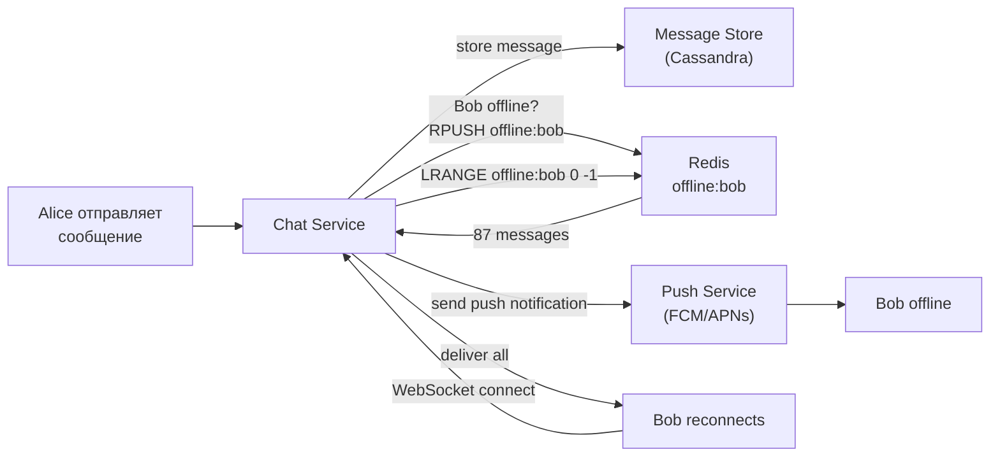
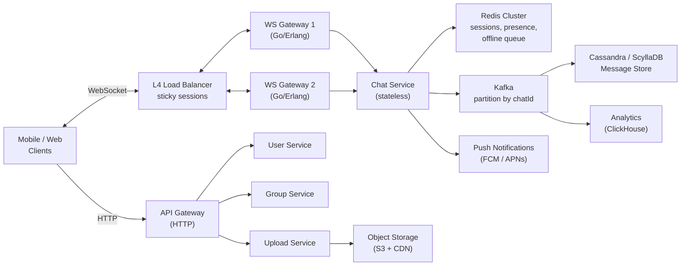

# Уровень 12: Проектируем чат-систему -- real-time, доставка сообщений и группы

## Введение

Представьте почтовое отделение будущего, где курьеры работают в двух режимах. Когда адресат дома -- курьер звонит в домофон и передаёт письмо прямо в руки. Когда адресата нет -- письмо кладётся в ячейку хранения с персональным кодом, а как только адресат появляется, на его телефон приходит уведомление: «Заберите посылки». На каждом конверте три штампа: «отправлено курьерской службой» (✓), «передано в руки» (✓✓), «адресат расписался» (✓✓ синие). Диспетчер в центре знает, кто из курьеров несёт какой пакет и у какого домофона они сейчас стоят.

Именно так работает мессенджер. WebSocket-соединение -- это домофон, всегда открытый между курьером и адресатом. Redis -- это доска у диспетчера с именами курьеров и номерами домофонов. Cassandra -- это архив всей корреспонденции. А три галочки -- это протокол подтверждений, который гарантирует: письмо не потерялось ни на одном этапе.

За кажущейся простотой «отправить текст» скрывается многоуровневая система: управление миллионами persistent-соединений, гарантированная доставка при нестабильном интернете, корректный порядок сообщений при одновременной отправке, эффективная рассылка в группах. WhatsApp обслуживает 2+ миллиарда пользователей и доставляет 100+ миллиардов сообщений ежедневно -- и делает это на относительно небольшой инфраструктуре благодаря правильным архитектурным решениям.

На этом уровне мы подробно разберём:

1. **WebSocket и почему HTTP не подходит** -- технические ограничения polling и преимущества persistent connection
2. **WebSocket Gateway -- stateful сервис** -- как масштабировать соединения и маршрутизировать сообщения
3. **Протокол доставки и три статуса** -- как работают галочки изнутри
4. **Presence Service** -- heartbeat, TTL в Redis и subscription model
5. **Fan-out on Write vs Fan-out on Read** -- ключевое решение для групповых чатов
6. **Хранение сообщений** -- data model, sharding по chatId, sync между устройствами
7. **Media upload** -- pre-signed URL и почему файлы не идут через WebSocket
8. **Offline queuing** -- что происходит, пока получатель недоступен
9. **Полная архитектура** -- как все компоненты работают вместе

---

## 1. Требования

Правильная постановка требований на интервью -- это половина успеха. Интервьюер оценивает, умеете ли вы отделить обязательный минимум от приятных дополнений, и задаёте ли правильные уточняющие вопросы.

### Functional Requirements (что система делает)

1. **1-to-1 чат** -- отправка и получение сообщений в реальном времени
2. **Групповой чат** -- до 256 участников (как в WhatsApp)
3. **Статусы доставки** -- sent (✓), delivered (✓✓), read (✓✓ синие)
4. **Online/Offline статус** -- «был в сети 5 минут назад»
5. **Отправка медиа** -- фото, видео, файлы
6. **Offline-режим** -- сообщения доставляются, когда получатель выходит в сеть
7. **История сообщений** -- синхронизация между устройствами

### Non-Functional Requirements (как система работает)

- **Низкая задержка** -- доставка сообщения < 200 мс для онлайн-пользователей
- **Масштаб** -- миллионы одновременных подключений
- **Надёжность** -- сообщения не теряются, доставляются хотя бы один раз (at-least-once)
- **Порядок** -- сообщения отображаются в порядке отправки
- **Consistency** -- оба собеседника видят одинаковую историю

### Уточняющие вопросы для интервью

На реальном интервью всегда стоит уточнить:

- Максимальный размер группы? (256 -- WhatsApp, 200 000 -- Telegram)
- Нужны ли «печатает...» индикаторы?
- Сколько онлайн-пользователей одновременно? (влияет на присутствие)
- Нужна ли end-to-end шифровка? (влияет на архитектуру хранения)
- Сколько лет хранить историю?

---

## 2. WebSocket -- основа real-time коммуникации

### Почему HTTP polling не подходит для чата

Прежде чем говорить о WebSocket, важно понять, почему обычный HTTP создаёт проблемы.

В классической модели запрос-ответ клиент всегда инициирует обмен: «есть ли новые сообщения?» -- «нет» -- «есть ли новые сообщения?» -- «нет» -- ... Это polling. При 10 млн активных пользователей, опрашивающих сервер каждые 3 секунды, получается 200 млн запросов в минуту -- и 99% из них вернут пустой ответ. Сервер работает впустую.

Long polling -- это улучшение: сервер не отвечает сразу, а «держит» запрос открытым до появления новых данных. Задержка снижается до сотен миллисекунд. Но каждое «удержанное» соединение потребляет серверный поток или горутину, а при восстановлении после разрыва нужен новый HTTP-рукопожатие с заголовками.

WebSocket решает проблему фундаментально. После одного HTTP-рукопожатия (upgrade request) соединение переходит в двунаправленный потоковый режим. Сервер может в любой момент отправить данные клиенту -- без запроса. Накладные расходы на сообщение падают с ~800 байт (HTTP-заголовки) до ~2 байт (WebSocket frame header).

| Подход | Задержка | Нагрузка на сервер | Двунаправленность | Подходит для чата? |
|--------|----------|--------------------|-------------------|--------------------|
| **HTTP Polling** | 1--30 сек (интервал) | Огромная: миллионы пустых запросов | Нет | Нет |
| **Long Polling** | ~0.5 сек | Средняя: соединение держится | Нет | Только как fallback |
| **SSE** | ~100 мс | Средняя: поток server → client | Только server→client | Нет (нет bidirectional) |
| **WebSocket** | ~50 мс | Минимальная: persistent connection | Да | Да |

```typescript
// HTTP Polling: клиент спрашивает каждые 3 секунды
// ❌ 10 млн пользователей × 20 запросов/мин = 200 млн запросов/мин (почти все пустые)
setInterval(async () => {
  const response = await fetch('/api/messages?since=' + lastTimestamp)
  const messages = await response.json()
  // В 99% случаев messages = [] -- пустой массив, но запрос был
}, 3000)

// WebSocket: постоянное соединение, данные только когда есть
// ✅ 10 млн пользователей = 10 млн соединений, сообщения только при событиях
const ws = new WebSocket('wss://chat.example.com/ws')
ws.onmessage = (event) => {
  const message = JSON.parse(event.data)
  displayMessage(message)
}
```

### Как работает WebSocket handshake

Клиент отправляет обычный HTTP-запрос с заголовком `Upgrade: websocket`. Сервер отвечает статусом `101 Switching Protocols` -- и с этого момента то же TCP-соединение используется как двунаправленный канал. HTTP-заголовки больше не нужны: каждый WebSocket frame содержит только 2--14 байт служебной информации.



### WebSocket Gateway -- архитектура stateful-сервиса

Здесь возникает ключевая инженерная проблема. WebSocket-соединения stateful: они «привязаны» к конкретному серверному процессу. Если Alice подключена к Gateway-1, а Bob -- к Gateway-2, и Alice пишет Bob -- как сообщение с Gateway-1 попадёт на Gateway-2, где живёт соединение с Bob?

Решение двухуровневое. WS Gateway -- это тонкий прокси, который только держит соединения и передаёт сообщения. Вся бизнес-логика -- в Chat Service, который stateless и масштабируется горизонтально. Маппинг «userId → на каком Gateway живёт соединение» хранится в Redis -- быстрый общий реестр для всех экземпляров Chat Service.



```typescript
// WSConnection -- то, что хранит Gateway в памяти
interface WSConnection {
  userId: string
  deviceId: string         // Пользователь может быть на нескольких устройствах
  socket: WebSocket
  connectedAt: Date
  gatewayId: string        // ID этого Gateway-сервера
}

// При подключении -- регистрируемся в Redis
async function onConnect(userId: string, deviceId: string, socket: WebSocket) {
  const conn: WSConnection = { userId, deviceId, socket, connectedAt: new Date(), gatewayId: MY_GATEWAY_ID }
  
  // Локальный реестр соединений
  connections.set(`${userId}:${deviceId}`, conn)
  
  // Глобальный реестр в Redis: userId -> gatewayId
  // EX 86400 -- автоочистка если Gateway упал без корректного отключения
  await redis.setex(`session:${userId}:${deviceId}`, 86400, MY_GATEWAY_ID)
}

// Маршрутизация входящего сообщения
async function routeMessage(recipientId: string, message: ChatMessage) {
  // Найти все устройства получателя
  const deviceKeys = await redis.keys(`session:${recipientId}:*`)
  
  if (deviceKeys.length === 0) {
    // Пользователь офлайн -- сохранить в offline queue
    await storeOfflineMessage(recipientId, message)
    return
  }
  
  for (const key of deviceKeys) {
    const gatewayId = await redis.get(key)
    if (gatewayId === MY_GATEWAY_ID) {
      // Получатель на этом же Gateway -- доставить напрямую
      const deviceId = key.split(':')[2]
      const conn = connections.get(`${recipientId}:${deviceId}`)
      conn?.socket.send(JSON.stringify(message))
    } else {
      // Получатель на другом Gateway -- отправить через внутреннюю шину
      await publishToGateway(gatewayId, recipientId, message)
    }
  }
}
```

💡 **Зачем Gateway -- отдельный сервис?** WebSocket-соединения требуют специфической оптимизации: event loop, epoll/kqueue, минимальный GC pressure. Go и Erlang позволяют держать миллион соединений на одном сервере. Если смешать это с бизнес-логикой (валидация, запись в БД, fan-out) -- масштабировать и деплоить будет на порядок сложнее.

---

## 3. Доставка сообщений и три статуса

### Зачем нужен протокол подтверждений

Отправить сообщение и забыть -- недостаточно. Сеть ненадёжна: пакеты теряются, соединения рвутся, серверы падают под нагрузкой. Без протокола подтверждений у пользователя нет ответа на вопрос: «сообщение дошло?»

Три галочки -- это не просто UX-украшение. Это публичное API протокола надёжности:

- **✓ Sent** -- «сервер принял и сохранил твоё сообщение». Если телефон разрядится прямо сейчас -- сообщение не потеряется.
- **✓✓ Delivered** -- «устройство получателя получило сообщение». Если получатель не читает уведомления -- ты знаешь, что они дойдут.
- **✓✓ Read (синие)** -- «получатель открыл чат и видел сообщение». Отрицание невозможно.

### Полный поток доставки



### Реализация протокола подтверждений

```typescript
// Состояния сообщения -- строгая машина состояний
// Переходы только в одну сторону: SENDING -> SENT -> DELIVERED -> READ
type MessageStatus = 'SENDING' | 'SENT' | 'DELIVERED' | 'READ'

interface ChatMessage {
  messageId: string        // Глобально уникальный Snowflake ID
  chatId: string
  senderId: string
  content: string
  contentType: 'text' | 'image' | 'video' | 'file'
  mediaUrl?: string
  status: MessageStatus
  createdAt: number        // Unix timestamp в миллисекундах
  clientTimestamp: number  // Время отправки на клиенте (для ordering при плохой сети)
}

interface MessageAck {
  messageId: string
  status: MessageStatus
  timestamp: number
}

// --- Клиентская сторона ---

// Отправка сообщения: сразу показываем в UI со статусом SENDING
function sendMessage(chatId: string, text: string): string {
  const messageId = generateLocalId()  // Временный ID до ответа сервера
  
  // Оптимистичный UI: показываем сообщение сразу, не ждём ответа сервера
  displayMessage({ messageId, chatId, content: text, status: 'SENDING' })
  
  ws.send(JSON.stringify({
    type: 'send_message',
    clientMessageId: messageId,
    chatId,
    content: text,
    clientTimestamp: Date.now(),
  }))
  
  // Таймаут: если через 5 сек нет SENT -- показать ошибку
  setTimeout(() => {
    if (getMessageStatus(messageId) === 'SENDING') {
      markMessageFailed(messageId)
    }
  }, 5000)
  
  return messageId
}

// Получение сообщения: показать + отправить DELIVERED ack
function onMessageReceived(message: ChatMessage) {
  displayMessage(message)
  
  // Немедленный ack о доставке -- сервер обновит статус для отправителя
  ws.send(JSON.stringify({
    type: 'ack',
    messageId: message.messageId,
    status: 'DELIVERED',
    timestamp: Date.now(),
  }))
}

// Открытие чата: отметить все непрочитанные как READ одним батчем
function onChatOpened(chatId: string) {
  const unreadIds = getUnreadMessageIds(chatId)
  if (unreadIds.length === 0) return
  
  // ✅ Один batch_ack вместо N отдельных -- экономия на round-trips
  ws.send(JSON.stringify({
    type: 'batch_ack',
    messageIds: unreadIds,
    status: 'READ',
    timestamp: Date.now(),
  }))
}
```

📌 **Важно про batch_ack**: если в чате 200 непрочитанных сообщений и клиент отправляет 200 отдельных READ-ack -- это 200 WebSocket-фреймов, 200 записей в БД, 200 уведомлений отправителю. Batch позволяет сделать одну запись с диапазоном messageId и одно уведомление.

### Идемпотентность и at-least-once delivery

Сеть ненадёжна: ack может потеряться, соединение может оборваться в момент доставки. Поэтому сервер должен уметь принять одно и то же сообщение дважды без дублирования. Ключ идемпотентности -- clientMessageId, который клиент генерирует перед отправкой.

```typescript
// Сервер: обработка входящего сообщения с идемпотентностью
async function handleSendMessage(senderId: string, payload: SendMessagePayload) {
  const { clientMessageId, chatId, content } = payload
  
  // Проверить: не обработали ли уже это сообщение?
  const existing = await messageStore.findByClientId(senderId, clientMessageId)
  if (existing) {
    // Дубликат -- просто вернуть тот же ack
    return { messageId: existing.messageId, status: 'SENT' }
  }
  
  // Создать Snowflake ID для нового сообщения
  const messageId = snowflake.generate()
  
  await messageStore.insert({
    messageId,
    clientMessageId,  // Сохраняем для идемпотентности
    chatId,
    senderId,
    content,
    status: 'SENT',
    createdAt: Date.now(),
  })
  
  return { messageId, status: 'SENT' }
}
```

---

## 4. Presence Service -- онлайн-статус пользователей

### Проблема определения онлайн-статуса

Казалось бы, простая задача: если у пользователя есть открытое WebSocket-соединение -- он онлайн. Но что если приложение свёрнуто? Телефон потерял сигнал? Пользователь уснул, не закрыв чат? WebSocket-соединение может «висеть» без активности долгое время.

Решение -- heartbeat: клиент периодически отправляет «я здесь» сигнал. Если сигналы перестали приходить -- считаем пользователя офлайн.

### Heartbeat и TTL

Механизм элегантен в своей простоте: Redis-ключ с TTL (время жизни). Пока приходят heartbeat -- ключ обновляется. Как только heartbeat прекратились -- ключ автоматически исчезает. Никакого фонового процесса, никакой очистки вручную.



```typescript
const HEARTBEAT_INTERVAL_MS = 30_000   // Клиент шлёт каждые 30 сек
const PRESENCE_TTL_SEC = 60            // Если нет heartbeat 60 сек -- офлайн

// При каждом heartbeat от клиента
async function handleHeartbeat(userId: string) {
  const wasOnline = await redis.exists(`presence:${userId}`)
  
  // Обновить TTL-ключ
  await redis.setex(`presence:${userId}`, PRESENCE_TTL_SEC, Date.now().toString())
  
  if (!wasOnline) {
    // Пользователь только что появился онлайн
    // Сохраняем отдельный ключ для "был в сети" на случай когда уйдёт
    await publishPresenceChange(userId, 'online')
  }
}

// Когда TTL истекает, Redis публикует keyspace notification
// Presence Service подписан на эти события
redis.subscribe('__keyevent@0__:expired', (key) => {
  if (key.startsWith('presence:')) {
    const userId = key.replace('presence:', '')
    handleUserWentOffline(userId)
  }
})

async function handleUserWentOffline(userId: string) {
  // Сохранить время последнего визита для "был в сети X минут назад"
  await redis.set(`last_seen:${userId}`, Date.now().toString())
  await publishPresenceChange(userId, 'offline')
}

// Запрос статуса
async function getPresence(userId: string): Promise<PresenceInfo> {
  const activeTs = await redis.get(`presence:${userId}`)
  if (activeTs) {
    return { status: 'online', lastSeen: parseInt(activeTs) }
  }
  
  const lastSeen = await redis.get(`last_seen:${userId}`)
  return {
    status: 'offline',
    lastSeen: lastSeen ? parseInt(lastSeen) : null,
  }
}
```

### Fan-out presence: subscription model

Наивный подход: при смене статуса уведомить всех контактов пользователя. При 500 контактах и 10 млн пользователей, одновременно меняющих статус -- это 5 млрд уведомлений в минуту в часы пик. Неприемлемо.

Правильный подход -- subscription model. Клиент подписывается на presence только тех пользователей, которые сейчас видны на экране. Открыл список чатов -- подписался на presence последних 20 собеседников. Открыл конкретный чат -- подписался на presence этого человека. Свернул приложение -- все подписки отменены.

```typescript
// Клиент управляет подписками явно
interface PresenceSubscription {
  subscriberId: string    // Кто хочет знать статус
  targetUserId: string    // За кем следим
  context: 'chat' | 'contact_list'
}

// При открытии списка чатов -- подписаться на presence последних N собеседников
function onChatListOpened(recentChatUserIds: string[]) {
  ws.send(JSON.stringify({
    type: 'subscribe_presence',
    userIds: recentChatUserIds.slice(0, 20),  // Не более 20 одновременно
  }))
}

// При открытии конкретного чата -- подписаться только на этого пользователя
function onChatOpened(targetUserId: string) {
  ws.send(JSON.stringify({
    type: 'subscribe_presence',
    userIds: [targetUserId],
  }))
}

// При смене экрана -- отписаться
function onScreenLeft() {
  ws.send(JSON.stringify({ type: 'unsubscribe_presence_all' }))
}

// Сервер: когда Alice меняет статус -- уведомить только её подписчиков
async function publishPresenceChange(userId: string, status: 'online' | 'offline') {
  // Получить список подписчиков из Redis Set
  const subscribers = await redis.smembers(`presence_subscribers:${userId}`)
  
  const update = { type: 'presence_update', userId, status, timestamp: Date.now() }
  
  for (const subscriberId of subscribers) {
    await deliverToUser(subscriberId, update)
  }
  
  // Если subscribers.length == 0 -- не тратим ресурсы вообще
}
```

📌 **Почему это важно на интервью**: наивный fan-out presence -- классическая ловушка. Всегда называйте subscription model и объясняйте, что клиент подписывается только на видимых пользователей.

---

## 5. Fan-out on Write vs Fan-out on Read

Это одно из ключевых архитектурных решений для групповых чатов, и на интервью его обязательно спросят.

### Суть проблемы

Алиса отправила сообщение в группу из 256 человек. Когда создавать записи в хранилище для каждого участника -- прямо при отправке (fan-out on write) или при чтении (fan-out on read)?

### Fan-out on Write -- подход WhatsApp

При отправке сообщения сразу создаём запись в «входящих» каждого участника. Читая чат, каждый видит только свои данные -- никаких join-запросов.

```typescript
// При отправке: N записей для N участников группы
async function sendGroupMessage(senderId: string, groupId: string, text: string) {
  const messageId = snowflake.generate()
  const message = {
    messageId,
    groupId,
    senderId,
    text,
    timestamp: Date.now(),
  }
  
  // Получаем список участников (кэшируется в Redis)
  const members = await getGroupMembers(groupId)
  
  // Записываем в inbox каждого участника
  // На практике -- через Kafka, асинхронно, не блокируя ответ отправителю
  const insertPromises = members.map(memberId =>
    messageStore.insert({
      recipientId: memberId,  // Ключ для шардирования inbox
      chatId: groupId,
      ...message,
    })
  )
  
  await Promise.all(insertPromises)
  
  // Попытаться доставить онлайн-участникам через WebSocket
  await tryDeliverToOnlineMembers(members, message)
}

// Чтение: быстро, только свои данные
async function getMessages(userId: string, chatId: string, before?: string) {
  return messageStore.query({
    recipientId: userId,  // Только записи этого пользователя
    chatId,
    beforeMessageId: before,
    limit: 50,
  })
}
```

**Плюсы fan-out on write:**
- Чтение молниеносное -- пользователь читает только свой inbox
- Доставка прямолинейная -- у каждого пользователя своя очередь
- Удалить сообщение «только у себя» легко -- удаляем свою запись

**Минусы fan-out on write:**
- Запись дорогая -- 256 записей на одно сообщение
- Storage умножается на количество участников
- При добавлении нового участника в группу -- он не видит историю (нет старых записей в его inbox)

### Fan-out on Read -- альтернативный подход

При отправке создаём одну запись в хранилище группы. При чтении -- каждый участник делает запрос к этому общему хранилищу.

```typescript
// При отправке: одна запись
async function sendGroupMessage(senderId: string, groupId: string, text: string) {
  await messageStore.insert({
    chatId: groupId,  // Общее хранилище группы
    senderId,
    text,
    timestamp: Date.now(),
  })
}

// Чтение: запрос к общему хранилищу
async function getMessages(userId: string, chatId: string, afterTimestamp: number) {
  // Нужно знать, когда пользователь присоединился к группе
  const joinedAt = await getJoinTimestamp(userId, chatId)
  
  return messageStore.query({
    chatId,
    // Показываем только сообщения после вступления в группу
    afterTimestamp: Math.max(afterTimestamp, joinedAt),
    limit: 50,
  })
}
```

**Плюсы fan-out on read:**
- Storage не умножается -- одна копия на всех
- Запись быстрая -- одна операция
- Новый участник сразу видит историю

**Минусы fan-out on read:**
- При чтении нужен scatter-gather по шардам (для больших групп)
- Сложнее реализовать «удалить только у себя»
- Для 10 млн участников канала -- каждое чтение = тяжёлый запрос

### Сравнение и когда что выбрать

| Критерий | Fan-out on Write | Fan-out on Read |
|----------|------------------|-----------------|
| **Задержка записи** | Высокая (N записей) | Низкая (1 запись) |
| **Задержка чтения** | Низкая (свой inbox) | Высокая (общее хранилище) |
| **Storage** | x N (по числу участников) | x 1 |
| **Доставка real-time** | Простая (inbox per user) | Сложнее (общий поток) |
| **История для новых участников** | Нет (нет старых записей) | Да (общее хранилище) |
| **Подходит для** | 1-to-1, группы до 256 | Каналы с тысячами подписчиков |



💡 **Гибридный подход** (Telegram): для групп до 1000 -- fan-out on write. Для каналов с миллионами подписчиков -- fan-out on read. Граница определяется экспериментально по соотношению нагрузки записи/чтения.

---

## 6. Хранение сообщений

### Почему Cassandra / ScyllaDB

Нагрузка мессенджера write-heavy: WhatsApp -- 100+ млрд сообщений в день, то есть ~1.2 млн записей в секунду. Реляционная БД с ACID-транзакциями имеет слишком высокие накладные расходы на запись. Нужна БД, оптимизированная для write throughput с горизонтальным масштабированием.

Cassandra записывает данные в LSM-tree (Log-Structured Merge Tree): все записи сначала идут в in-memory буфер (memtable), периодически сбрасываются на диск в отсортированные файлы (SSTable). Записи всегда sequential -- нет random IO, что даёт огромный throughput.

### Data Model

```typescript
// Основная таблица сообщений
// В Cassandra: PRIMARY KEY ((chatId), messageId) DESC
// Все сообщения одного чата -- на одном узле (partition key = chatId)
// Внутри партиции -- отсортированы по messageId (clustering key)
interface Message {
  messageId: string          // Snowflake ID: timestamp + node_id + sequence
  chatId: string             // Partition key
  senderId: string
  content: string
  contentType: 'text' | 'image' | 'video' | 'file'
  mediaUrl?: string          // URL в S3 (только для медиа)
  status: MessageStatus
  createdAt: number          // Unix ms -- для отображения
  editedAt?: number          // Если было редактирование
  deletedAt?: number         // Soft delete
}

// Метаданные чатов (в отдельной таблице -- частые точечные запросы)
interface Chat {
  chatId: string
  type: 'direct' | 'group'
  name?: string
  createdAt: number
  lastMessageAt: number      // Для сортировки списка чатов у пользователя
  lastMessagePreview?: string
}

// Участники чатов
interface ChatParticipant {
  chatId: string
  userId: string
  role: 'owner' | 'admin' | 'member'
  joinedAt: number
  lastReadMessageId?: string  // Для счётчика непрочитанных
  mutedUntil?: number
  leftAt?: number             // Если покинул группу
}
```

### Snowflake ID -- глобальный порядок без координатора

Обычный auto-increment ID не работает при шардировании -- каждый шард будет выдавать одинаковые числа. UUID решает уникальность, но не упорядочен -- нельзя сортировать по ID как по времени.

Snowflake ID (придуман в Twitter) -- 64-битное целое число, структура:

```
[41 бит: timestamp в мс] [10 бит: node_id] [12 бит: sequence в рамках мс]
```

Ключевые свойства:
- Глобально уникальный (разные node_id)
- Монотонно возрастает (timestamp + sequence)
- Генерируется децентрализованно (каждый сервер знает свой node_id)
- 41 бит timestamp хватает на 69 лет с 2010 года

```typescript
class SnowflakeGenerator {
  private epoch = 1288834974657n  // Twitter epoch (01.11.2010)
  private nodeId: bigint
  private sequence = 0n
  private lastTimestamp = -1n

  constructor(nodeId: number) {
    this.nodeId = BigInt(nodeId) & 0x3FFn  // 10 бит
  }

  generate(): string {
    let now = BigInt(Date.now())

    if (now === this.lastTimestamp) {
      this.sequence = (this.sequence + 1n) & 0xFFFn  // 12 бит, max 4096/мс
      if (this.sequence === 0n) {
        // Переполнение sequence в этой мс -- ждём следующей
        while (now <= this.lastTimestamp) now = BigInt(Date.now())
      }
    } else {
      this.sequence = 0n
    }

    this.lastTimestamp = now
    const id = ((now - this.epoch) << 22n) | (this.nodeId << 12n) | this.sequence
    return id.toString()
  }
}
```

### Sharding Strategy

```typescript
// Ключ шардирования: chatId
// Все сообщения одного чата -- на одном шарде

// Почему НЕ userId?
// ❌ По senderId: чат между Alice (shard 1) и Bob (shard 3)
//    → чтобы показать историю чата, нужно читать ОБА шарда
//    → scatter-gather, медленнее, сложнее поддерживать порядок

// Почему НЕ messageId?
// ❌ По messageId: сообщения одного чата разбросаны по N шардам
//    → каждый запрос истории = запрос ко ВСЕМ шардам

// ✅ По chatId: все сообщения чата в одной партиции
//    → чтение одного шарда
//    → порядок гарантирован (clustering key)
//    → добавление участника не меняет шард

// Indirec: chatId → shard
function getShard(chatId: string, numShards: number): number {
  return murmurhash(chatId) % numShards
}

// Cassandra PRIMARY KEY для таблицы messages:
// PRIMARY KEY ((chat_id), message_id)
// chat_id -- partition key (всё о чате на одном узле)
// message_id -- clustering key DESC (новые сообщения первыми)
```

### Sync между устройствами

Пользователь читает чат на телефоне, потом открывает на ноутбуке -- как ноутбук узнаёт, что уже прочитано? Как синхронизировать тысячи сообщений за время офлайна?

```typescript
// Каждый клиент хранит lastSyncTimestamp и lastSyncMessageId
// При подключении запрашивает дельту

interface SyncRequest {
  userId: string
  deviceId: string
  lastSyncMessageId: string  // Snowflake ID последнего полученного сообщения
  limit: number              // Порциями, чтобы не перегружать
}

interface SyncResponse {
  messages: Message[]
  statusUpdates: MessageAck[]   // Изменения статусов (DELIVERED, READ)
  presenceUpdates: PresenceInfo[]
  hasMore: boolean
  nextCursor: string           // Для следующего запроса
}

async function syncMessages(req: SyncRequest): Promise<SyncResponse> {
  // Все чаты пользователя
  const chatIds = await getChatIds(req.userId)
  
  // Для каждого чата -- новые сообщения после lastSyncMessageId
  const messages = await messageStore.queryMultiple(
    chatIds,
    req.lastSyncMessageId,
    req.limit
  )
  
  return {
    messages,
    statusUpdates: await getStatusUpdates(req.userId, req.lastSyncMessageId),
    presenceUpdates: [],
    hasMore: messages.length === req.limit,
    nextCursor: messages[messages.length - 1]?.messageId ?? req.lastSyncMessageId,
  }
}

// Клиент при долгом офлайне запрашивает порциями
async function fullSync() {
  let cursor = getStoredCursor()
  let hasMore = true
  
  while (hasMore) {
    const response = await api.sync({ lastSyncMessageId: cursor, limit: 200 })
    await saveMessages(response.messages)
    cursor = response.nextCursor
    hasMore = response.hasMore
  }
  
  saveCursor(cursor)
}
```

---

## 7. Media Upload

### Почему медиа не идёт через WebSocket

WebSocket-соединение -- это канал реального времени для маленьких сообщений. Отправить туда файл размером 10 МБ:
- Заблокирует канал на секунды (нет multiplexing в WebSocket)
- Перегрузит Chat Service -- он превратится в file server
- Создаст проблемы с backpressure при плохой сети

Правильный путь -- pre-signed URL. Клиент запрашивает у сервера временный URL с правами на загрузку прямо в S3. Файл идёт client → S3, минуя все серверы чата.



```typescript
// Upload Service: генерация pre-signed URL
async function getUploadUrl(params: {
  contentType: string
  size: number
  userId: string
}): Promise<{ uploadUrl: string; mediaUrl: string }> {
  // Валидация
  if (params.size > 100 * 1024 * 1024) {
    throw new Error('File too large: max 100 MB')
  }
  
  const fileId = generateFileId()
  const key = `media/${params.userId}/${fileId}`
  
  // S3 pre-signed PUT URL: действителен 15 минут
  const uploadUrl = await s3.getSignedUrlPromise('putObject', {
    Bucket: MEDIA_BUCKET,
    Key: key,
    ContentType: params.contentType,
    ContentLength: params.size,
    Expires: 900,  // 15 минут
  })
  
  const mediaUrl = `https://${CDN_DOMAIN}/${key}`
  
  return { uploadUrl, mediaUrl }
}

// Клиент: полный flow загрузки медиа
async function sendPhotoMessage(chatId: string, file: File): Promise<void> {
  // 1. Показать превью сразу (оптимистичный UI)
  const localPreview = URL.createObjectURL(file)
  const tempMessageId = displayOptimisticMessage(chatId, 'image', localPreview)
  
  try {
    // 2. Получить pre-signed URL
    const { uploadUrl, mediaUrl } = await api.getUploadUrl({
      contentType: file.type,
      size: file.size,
    })
    
    // 3. Загрузить напрямую в S3 (минуя Chat Service)
    await fetch(uploadUrl, {
      method: 'PUT',
      body: file,
      headers: { 'Content-Type': file.type },
    })
    
    // 4. Отправить сообщение с URL через WebSocket (100 байт, не 10 МБ!)
    ws.send(JSON.stringify({
      type: 'send_message',
      clientMessageId: tempMessageId,
      chatId,
      contentType: 'image',
      mediaUrl,
    }))
  } catch (error) {
    markMessageFailed(tempMessageId)
  }
}

// Thumbnails: Lambda обрабатывает S3 event асинхронно
// После загрузки: S3 → SQS → Lambda → sharp(resize) → S3 (thumbnail)
// Пользователь видит thumbnail в чате, полное фото -- по tap
```

---

## 8. Offline Queuing

### Что происходит пока получатель недоступен

Пользователь выключил телефон в 10:00. За время офлайна ему написали в 5 чатах, пришло 87 сообщений. В 18:00 он включил телефон. Что должно произойти?

1. Устройство восстанавливает WebSocket-соединение
2. Сервер видит reconnect и отдаёт накопившиеся сообщения
3. Статусы DELIVERED отправляются отправителям
4. Все push-уведомления за время офлайна больше не нужны



```typescript
// Сохранение сообщения для офлайн-пользователя
async function handleOfflineMessage(recipientId: string, message: Message) {
  // Гарантированное сохранение -- уже в Cassandra
  // (сделано раньше в Chat Service)
  
  // Offline queue в Redis для быстрого reconnect
  // Храним только метаданные (messageId + preview), не полное сообщение
  await redis.rpush(`offline:${recipientId}`, JSON.stringify({
    messageId: message.messageId,
    chatId: message.chatId,
    senderId: message.senderId,
    preview: message.content.substring(0, 100),
    timestamp: message.createdAt,
  }))
  
  // TTL на offline queue: 30 дней (после этого -- sync через Cassandra)
  await redis.expire(`offline:${recipientId}`, 30 * 24 * 60 * 60)
  
  // Push-уведомление через FCM (Android) или APNs (iOS)
  const senderName = await getUserName(message.senderId)
  await pushService.send({
    recipientId,
    notification: {
      title: senderName,
      body: message.content.substring(0, 100),
    },
    data: {
      chatId: message.chatId,
      messageId: message.messageId,
    },
  })
}

// При reconnect: доставить накопившееся
async function handleReconnect(userId: string, deviceId: string, lastSyncMessageId?: string) {
  // 1. Обновить presence
  await handleHeartbeat(userId)
  
  // 2. Быстрая доставка через offline queue (Redis)
  const offlineItems = await redis.lrange(`offline:${userId}`, 0, -1)
  await redis.del(`offline:${userId}`)
  
  if (offlineItems.length > 0) {
    const messages = await messageStore.fetchByIds(
      offlineItems.map(item => JSON.parse(item).messageId)
    )
    await deliverMessages(userId, deviceId, messages)
  }
  
  // 3. Полная синхронизация через Cassandra (если был офлайн > 30 дней
  //    или offline queue переполнен)
  if (lastSyncMessageId) {
    const syncResponse = await syncMessages({ userId, deviceId, lastSyncMessageId, limit: 200 })
    if (syncResponse.hasMore) {
      // Отдать первую порцию, остальное клиент запросит сам
      await deliverMessages(userId, deviceId, syncResponse.messages)
    }
  }
}
```

📌 **Зачем Redis + Cassandra одновременно?** Redis -- для быстрого reconnect (O(1) для получения очереди конкретного пользователя). Cassandra -- надёжный долгосрочный архив (Redis может быть eviction при нехватке памяти). Комбинация даёт скорость + надёжность.

---

## 9. Полная архитектура

### Как все компоненты работают вместе



### Внутренняя шина между Gateway-серверами

Когда сообщение нужно доставить пользователю на другом Gateway, Chat Service публикует его в Redis PubSub или внутреннюю Kafka-очередь. Каждый Gateway подписан на свой канал.

```typescript
// Chat Service публикует в канал конкретного Gateway
await redis.publish(`gateway:${targetGatewayId}`, JSON.stringify({
  recipientId,
  message,
}))

// Gateway слушает свой канал
redis.subscribe(`gateway:${MY_GATEWAY_ID}`, (serialized) => {
  const { recipientId, message } = JSON.parse(serialized)
  const conn = connections.get(recipientId)
  conn?.socket.send(JSON.stringify(message))
})
```

### Kafka для надёжной записи

Chat Service не пишет в Cassandra напрямую -- через Kafka. Это даёт:
- **Буфер при пиках нагрузки** -- Kafka поглощает всплески записи
- **Ordering** -- partition key = chatId, все сообщения чата в одной партиции
- **Replay** -- можно перечитать при ошибке записи
- **Fan-out** -- один топик, несколько consumer-групп (Message Store, Analytics)

```typescript
// Chat Service: отправить в Kafka
await kafka.produce({
  topic: 'chat-messages',
  key: chatId,       // Partition key -- все сообщения чата в одной партиции
  value: JSON.stringify(message),
})

// Message Store Consumer: читать из Kafka, писать в Cassandra
kafka.consume('chat-messages', async (record) => {
  await cassandra.insert('messages', JSON.parse(record.value))
})
```

### Выбор технологий и обоснование

| Компонент | Технология | Почему |
|-----------|------------|--------|
| **WS Gateway** | Go / Erlang | Erlang -- 2M+ соединений на сервер, Go -- goroutines |
| **Chat Service** | Go / Java | Stateless, горизонтальное масштабирование |
| **Session store** | Redis Cluster | O(1) lookup userId → gatewayId, sub-millisecond |
| **Presence** | Redis с TTL | Автоматическая очистка по TTL, keyspace notifications |
| **Message store** | Cassandra / ScyllaDB | Write-heavy, LSM-tree, шардирование по chatId |
| **Message queue** | Kafka | Ordering per partition, durability, replay |
| **Media storage** | S3 + CloudFront | Масштабируемый object storage, CDN для быстрой раздачи |
| **Push** | FCM / APNs | Официальные каналы iOS и Android |
| **Load Balancer** | HAProxy L4 | Sticky sessions по IP (WebSocket не может переключать mid-stream) |

---

## 10. Частые ошибки новичков

### Ошибка 1 -- HTTP polling вместо WebSocket

❌ **Плохо:**
```typescript
// Клиент опрашивает сервер каждые 2 секунды
setInterval(async () => {
  const response = await fetch('/api/messages?since=' + lastTimestamp)
  const { messages } = await response.json()
  // 99% ответов: messages = [] -- пустой массив, но CPU и сеть потрачены
}, 2000)
// 10 млн пользователей × 30 запросов/мин = 300 млн запросов/мин
// Из них ~297 млн -- пустые
```

✅ **Правильно:**
```typescript
// WebSocket: сервер сам присылает данные при событиях
const ws = new WebSocket('wss://chat.example.com/ws')
ws.onmessage = (event) => {
  const data = JSON.parse(event.data)
  if (data.type === 'new_message') displayMessage(data.message)
}
// 10 млн соединений, передача данных только при реальных сообщениях
```

Почему это важно: при 10 млн пользователей разница между polling и WebSocket -- это буквально разница между 300 сервера и 30 серверами.

### Ошибка 2 -- Шардирование сообщений по userId

❌ **Плохо:**
```
// Шардирование по senderId
// Alice (shard 1) пишет Bob (shard 3)
// → history чата = scatter-gather по двум шардам
// → сложнее поддерживать порядок при параллельных записях
```

✅ **Правильно:**
```
// Шардирование по chatId
// Все сообщения чата Alice-Bob -- на shard 5 (hash("chat:alice:bob") % N)
// → история чата = запрос к одному шарду
// → порядок гарантирован внутри партиции
```

### Ошибка 3 -- Fan-out presence на всех контактов

❌ **Плохо:**
```typescript
// Alice вышла в сеть → уведомить всех 500 контактов
async function handlePresenceChange(userId: string) {
  const contacts = await getAllContacts(userId)  // 500 контактов
  for (const contactId of contacts) {
    await deliverToUser(contactId, { type: 'presence', userId, status: 'online' })
  }
}
// 10 млн пользователей × 500 контактов = 5 млрд уведомлений в день
```

✅ **Правильно:**
```typescript
// Subscription model: уведомлять только активных подписчиков
async function handlePresenceChange(userId: string) {
  const subscribers = await redis.smembers(`presence_subscribers:${userId}`)
  // В реальности: 5-20 подписчиков у большинства пользователей
  for (const subscriberId of subscribers) {
    await deliverToUser(subscriberId, { type: 'presence', userId, status: 'online' })
  }
}
```

### Ошибка 4 -- Медиа через WebSocket и Chat Service

❌ **Плохо:**
```typescript
// Отправка фото через WebSocket
const arrayBuffer = await file.arrayBuffer()
ws.send(arrayBuffer)  // 5 МБ через WebSocket-канал реального времени!
// Блокирует канал на 2-5 секунд при плохой сети
// Chat Service становится file server
// Нет CDN, каждый скачивает файл от Chat Service
```

✅ **Правильно:**
```typescript
// Pre-signed URL: файл идёт напрямую клиент → S3
const { uploadUrl, mediaUrl } = await api.getUploadUrl({ type: 'image/jpeg', size: file.size })
await fetch(uploadUrl, { method: 'PUT', body: file })
// Теперь отправить сообщение с URL: 150 байт, а не 5 МБ
ws.send(JSON.stringify({ type: 'send_message', contentType: 'image', mediaUrl }))
```

### Ошибка 5 -- Не учитывать несколько устройств

❌ **Плохо:**
```typescript
// Маппинг userId → один gatewayId
// Пользователь на ноутбуке И телефоне одновременно
// → сообщение доставляется только на одно устройство
const gatewayId = await redis.get(`session:${userId}`)
```

✅ **Правильно:**
```typescript
// Маппинг userId → Set<gatewayId> (все активные устройства)
const deviceGateways = await redis.hgetall(`sessions:${userId}`)
// { "device_phone": "gateway_1", "device_laptop": "gateway_2" }
for (const [deviceId, gatewayId] of Object.entries(deviceGateways)) {
  await deliverToGateway(gatewayId, userId, deviceId, message)
}
```

### Ошибка 6 -- Не учитывать at-least-once delivery

❌ **Плохо:**
```typescript
// Отправить и забыть -- без повторов при потере
ws.send(JSON.stringify({ type: 'send_message', content: 'Привет' }))
// Если соединение оборвалось в момент отправки -- сообщение потеряно
// Пользователь видит "отправляется..." вечно
```

✅ **Правильно:**
```typescript
// clientMessageId + таймаут + retry
const clientMessageId = generateUUID()
ws.send(JSON.stringify({ type: 'send_message', clientMessageId, content: 'Привет' }))

// Ждём SENT ack с этим clientMessageId
// Если не пришёл за 5 сек -- retry (сервер идемпотентен по clientMessageId)
setTimeout(() => retryIfNotAcknowledged(clientMessageId), 5000)
```

---

## Итоги

| Аспект | Решение | Почему |
|--------|---------|--------|
| **Протокол** | WebSocket для real-time, HTTP для загрузки и API | WS = низкая задержка + push; HTTP = масштабируемость для медиа |
| **Connection management** | WS Gateway (stateful) + Redis (session map) | Gateway тонкий -- масштабируется легче; Redis -- быстрый shared state |
| **Доставка сообщений** | Store → ack SENT → deliver → ack DELIVERED → ack READ | Гарантированная доставка и видимые статусы |
| **Presence** | Heartbeat 30 сек → Redis TTL 60 сек → subscription fan-out | TTL = автоочистка; subscription = не fan-out на всех контактов |
| **Группы** | Fan-out on write (до 256), fan-out on read (каналы 1000+) | Write = быстрое чтение; Read = экономия storage при масштабе |
| **Storage** | Cassandra, PRIMARY KEY ((chatId), messageId) | Write-heavy LSM, шардирование по chatId = быстрое чтение истории |
| **Message ID** | Snowflake ID (timestamp + nodeId + sequence) | Глобальный порядок без координатора, децентрализованная генерация |
| **Медиа** | Pre-signed URL → S3 напрямую, thumbnails через Lambda | Файлы минуют Chat Service, CDN раздаёт, Lambda = async processing |
| **Offline** | Offline queue в Redis + Cassandra archive + push notification | Redis = быстрый reconnect; Cassandra = долгосрочный архив |
| **Ordering** | Kafka partition key = chatId, Snowflake ID | Ordering per partition + глобально монотонный ID |

На интервью три ключевых решения, которые отличают мессенджер от CRUD-приложения:

1. **WebSocket connection routing** -- как сообщение с Gateway-1 попадает к пользователю на Gateway-2 (через Redis session map + internal pub/sub)
2. **Delivery status protocol** -- как работают три галочки (store first, then ack, then deliver, then client acks back)
3. **Fan-out strategy** -- fan-out on write для 1-to-1 и малых групп, fan-out on read для каналов с тысячами подписчиков
