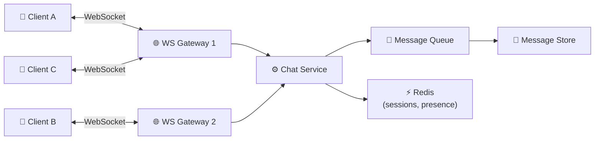
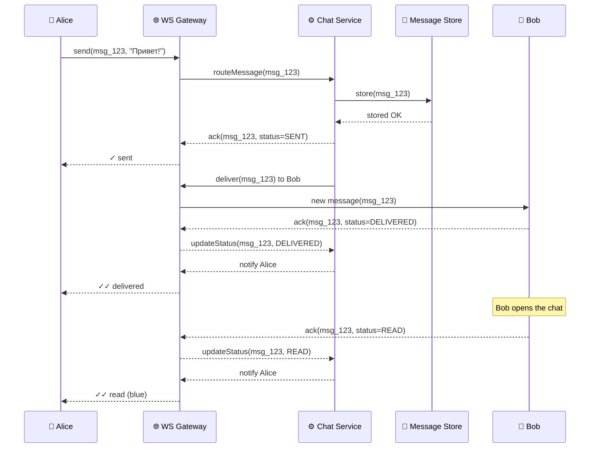
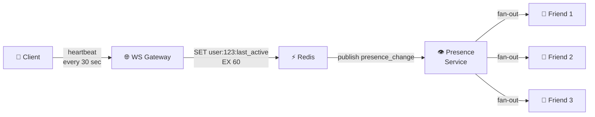
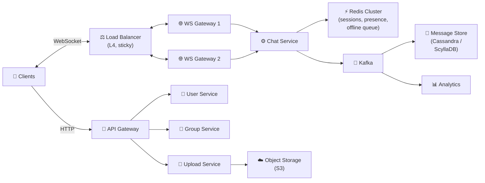

# 🔥 Level 12: Designing a Messenger (WhatsApp-like)

## 🎯 What is this case about?

Chat System is one of the most popular System Design interview cases. WhatsApp serves 2+ billion users, delivers 100+ billion messages per day, and guarantees delivery even with unstable connections. Behind the apparent simplicity of "sending text" lies a complex infrastructure: persistent connections, presence tracking, message ordering, offline sync.

Analogy: a messenger is like a **post office combined with a real-time courier service**. When both parties are online — the courier runs directly (WebSocket). When the recipient is offline — the letter goes into a storage locker (message store), and as soon as they appear online — the courier immediately delivers all accumulated mail. Checkmarks on the envelope show: "sent" (one), "delivered" (two), "read" (blue).

## 📌 Step 1: Requirements

### Functional Requirements (what the system does)

1. **1-to-1 chat** — real-time sending and receiving of messages
2. **Group chat** — up to 256 participants (like WhatsApp)
3. **Delivery statuses** — sent (✓), delivered (✓✓), read (✓✓ blue)
4. **Online/Offline status** — "last seen 5 minutes ago"
5. **Media sending** — photos, videos, files
6. **Offline mode** — messages are delivered when the recipient comes online
7. **Message history** — synchronization between devices

### Non-Functional Requirements (how the system works)

- **Low latency** — message delivery < 200 ms for online users
- **Scale** — millions of simultaneous connections
- **Reliability** — messages are not lost, delivered at least once
- **Ordering** — messages are displayed in the order they were sent
- **Consistency** — both participants see the same conversation history

## 📌 Step 2: WebSocket — the foundation of real-time communication

### Why WebSocket instead of HTTP polling?

| Approach | Latency | Server Load | Suitable for Chat? |
|----------|---------|-------------|--------------------|
| **HTTP Polling** | 1-30 sec (interval) | Huge: millions of empty requests | No |
| **Long Polling** | ~0.5 sec | Medium: each request holds a connection | For fallback |
| **WebSocket** | ~50 ms | Minimal: persistent connection | Yes |
| **SSE** | ~100 ms | Medium: only server→client | No (need bidirectional) |

```typescript
// HTTP Polling: client asks every 3 seconds
// ❌ 10M users × 20 requests/min = 200M requests/min (almost all empty)

// WebSocket: persistent connection
// ✅ 10M users = 10M connections, data only when there is content
```

### WebSocket Gateway



```typescript
// WebSocket Gateway — stateful server that holds connections
interface WSConnection {
  userId: string
  deviceId: string
  socket: WebSocket
  connectedAt: Date
  gatewayId: string  // Which server hosts this connection
}

// Mapping: userId → gatewayId (in Redis)
// When Chat Service wants to deliver a message to a user,
// it checks Redis to find which Gateway the user is connected to
async function routeMessage(recipientId: string, message: ChatMessage) {
  const gatewayId = await redis.get(`session:${recipientId}`)
  if (gatewayId) {
    // User is online — send through their Gateway
    await publishToGateway(gatewayId, recipientId, message)
  } else {
    // User is offline — save to offline queue
    await storeOfflineMessage(recipientId, message)
  }
}
```

💡 **Why is Gateway a separate service?** WebSocket connections are stateful (bound to a specific server). If chat business logic is in the same process, scaling and updating becomes painful. Gateway only holds connections and proxies messages — logic lives in Chat Service.

## 🔥 Step 3: Message Delivery and Statuses

The key feature of a messenger — **three checkmarks**: sent (✓), delivered (✓✓), read (✓✓ blue). Behind this stands an entire acknowledgment protocol:



### Acknowledgment Protocol

```typescript
// Each message goes through states:
type MessageStatus = 'SENDING' | 'SENT' | 'DELIVERED' | 'READ'

// SENDING — client sent, waiting for server ack
// SENT (✓) — server saved to DB and confirmed
// DELIVERED (✓✓) — message delivered to recipient's device
// READ (✓✓ blue) — recipient opened the chat and read it

interface MessageAck {
  messageId: string
  status: MessageStatus
  timestamp: number
}

// Client sends ack upon receiving a message
// and a separate ack upon reading (opening the chat)
function onMessageReceived(message: ChatMessage) {
  // Display message in UI
  displayMessage(message)
  // Send ack DELIVERED
  ws.send(JSON.stringify({
    type: 'ack',
    messageId: message.id,
    status: 'DELIVERED',
  }))
}

function onChatOpened(chatId: string) {
  // All unread → READ
  const unreadIds = getUnreadMessageIds(chatId)
  ws.send(JSON.stringify({
    type: 'batch_ack',
    messageIds: unreadIds,
    status: 'READ',
  }))
}
```

📌 **Important**: READ ack is sent as a batch when opening the chat, not per message individually. If the chat has 200 unread messages — one batch_ack, not 200 separate ones.

## 🔥 Step 4: Presence Service — Online Status

### Heartbeat Mechanism

How to know if a user is online? The client sends a heartbeat every N seconds. If the heartbeat doesn't arrive — the user is offline.



```typescript
// Presence: heartbeat + TTL in Redis
const HEARTBEAT_INTERVAL = 30_000  // Client sends every 30 sec
const PRESENCE_TTL = 60            // If no heartbeat for 60 sec — offline

// On each heartbeat:
async function handleHeartbeat(userId: string) {
  const wasOnline = await redis.exists(`presence:${userId}`)
  await redis.setex(`presence:${userId}`, PRESENCE_TTL, Date.now().toString())

  if (!wasOnline) {
    // User came back online — notify friends
    await publishPresenceChange(userId, 'online')
  }
}

// When TTL expires — Redis automatically removes the key
// Next getPresence request will return "offline"

async function getPresence(userId: string): Promise<PresenceInfo> {
  const lastActive = await redis.get(`presence:${userId}`)
  if (lastActive) {
    return { status: 'online', lastSeen: parseInt(lastActive) }
  }
  // For "last seen X minutes ago" — store lastSeen in a separate key
  const lastSeen = await redis.get(`last_seen:${userId}`)
  return { status: 'offline', lastSeen: lastSeen ? parseInt(lastSeen) : null }
}
```

### Fan-out presence: who to notify about updates?

A user has 500 contacts. When they come online — should all be notified? No! Only those who have the chat with them open or the contacts list visible.

```typescript
// Subscription model: client subscribes to presence of specific userIds
// (only for those currently visible on screen)

// Client opened the chat list — subscribe to presence of last 20 contacts
// Client opened chat with Alice — subscribe to presence of Alice
// Client closed the chat — unsubscribe

interface PresenceSubscription {
  subscriberId: string    // Who wants to know
  targetUserId: string    // Who we're tracking
}

// Redis PubSub: channel per user
// When Alice changes status → publish to channel "presence:alice"
// All subscribers of this channel receive the update
```

## 🔥 Step 5: Fan-out on Write vs Fan-out on Read

A key architectural decision for group chats: **when** to create copies of a message for each participant?

### Fan-out on Write (WhatsApp approach)

```typescript
// On message send — immediately create a record for EACH participant
async function sendGroupMessage(senderId: string, groupId: string, text: string) {
  const message = { id: generateId(), senderId, text, timestamp: Date.now() }
  const members = await getGroupMembers(groupId)

  // Write to each participant's inbox
  for (const memberId of members) {
    await messageStore.insert({
      recipientId: memberId,
      chatId: groupId,
      ...message,
    })
    // Try to deliver to online participants
    await tryDeliverToUser(memberId, message)
  }
}
```

**Pros**: fast reads (everyone has their own inbox), simple delivery.
**Cons**: expensive writes (a group of 256 = 256 writes), storage x N.

### Fan-out on Read (alternative)

```typescript
// On send — one record. On read — collect from all chats
async function sendGroupMessage(senderId: string, groupId: string, text: string) {
  // One record in group storage
  await messageStore.insert({ chatId: groupId, senderId, text, timestamp: Date.now() })
}

async function getMessages(userId: string, chatId: string) {
  // On each chat open — query group storage
  return await messageStore.query({ chatId, afterTimestamp: lastSyncTimestamp })
}
```

**Pros**: storage savings, fast writes.
**Cons**: slow reads for users with many chats, more complex delivery.

### Which to choose?

| Criterion | Fan-out on Write | Fan-out on Read |
|-----------|------------------|-----------------|
| **Write latency** | High (N writes) | Low (1 write) |
| **Read latency** | Low (own inbox) | High (join across chats) |
| **Storage** | x N (by participant count) | x 1 |
| **Suitable for** | 1-to-1, small groups | Large channels (1000+ subscribers) |

💡 **WhatsApp approach**: fan-out on write for 1-to-1 and groups up to 256 people. For broadcast channels with thousands of subscribers — fan-out on read or hybrid.

## 📌 Step 6: Message Storage

### Data Model

```typescript
// messages table — primary storage
interface Message {
  messageId: string          // Globally unique (snowflake ID)
  chatId: string             // Chat ID (1-to-1 or group)
  senderId: string
  content: string
  contentType: 'text' | 'image' | 'video' | 'file'
  mediaUrl?: string          // URL in object storage (S3)
  status: MessageStatus
  createdAt: number          // Unix timestamp
  editedAt?: number
}

// chats table — chat metadata
interface Chat {
  chatId: string
  type: 'direct' | 'group'
  name?: string              // For groups
  createdAt: number
  lastMessageAt: number      // For chat list sorting
}

// chat_participants table — chat members
interface ChatParticipant {
  chatId: string
  userId: string
  role: 'owner' | 'admin' | 'member'
  joinedAt: number
  lastReadMessageId?: string  // For unread count
  mutedUntil?: number
}
```

### Sharding Strategy

```typescript
// Sharding key: chatId
// All messages of one chat on the same shard → queries don't require scatter-gather

// Schema: chatId → hash(chatId) % NUM_SHARDS → shard_N

// Why chatId, not userId?
// ❌ By userId — opening a chat needs data from two users (scatter-gather)
// ❌ By messageId — messages of one chat scattered across shards
// ✅ By chatId — all messages of a chat together, single-shard reads

// Indexes:
// PRIMARY KEY (chatId, messageId) — chat messages in ID order
// INDEX (userId, lastMessageAt DESC) — user's chat list
// INDEX (chatId, createdAt DESC) — message pagination
```

### Cross-device Sync

```typescript
// Client stores lastSyncTimestamp
// On connect, requests: "give all messages after timestamp X"

interface SyncRequest {
  userId: string
  lastSyncTimestamp: number
  limit: number  // Max 1000 messages at a time
}

interface SyncResponse {
  messages: Message[]
  hasMore: boolean
  newSyncTimestamp: number
}

// For long offline periods (a week) — there may be thousands of messages
// Sync with pagination: client requests in batches of 100-200
```

## 📌 Step 7: Media Upload

Media files don't go through WebSocket or Chat Service — this is a separate flow:

```typescript
// 1. Client requests a pre-signed URL for upload
// 2. Client uploads file directly to Object Storage (S3)
// 3. Client sends a message with mediaUrl via WebSocket

// Pre-signed URL — S3 generates a temporary upload link
// File goes directly client → S3, bypassing chat servers

async function uploadMedia(file: File): Promise<string> {
  // 1. Request pre-signed URL
  const { uploadUrl, mediaUrl } = await api.getUploadUrl({
    contentType: file.type,
    size: file.size,
  })
  // 2. Upload directly to S3
  await fetch(uploadUrl, { method: 'PUT', body: file })
  // 3. Return URL for the message
  return mediaUrl
}

// Thumbnails generated asynchronously via Lambda/worker
// on upload: S3 event → Lambda → resize → save thumbnail
```

## 📌 Step 8: Offline Queuing

When the recipient is offline, messages accumulate and are delivered upon reconnect:

```typescript
// Offline queue per user in Redis or Cassandra
async function handleOfflineMessage(recipientId: string, message: Message) {
  // Save to primary storage (DB)
  await messageStore.save(message)

  // Add to offline queue (for fast delivery on reconnect)
  await redis.rpush(`offline:${recipientId}`, JSON.stringify({
    messageId: message.messageId,
    chatId: message.chatId,
    preview: message.content.substring(0, 100),
  }))

  // Send push notification
  await pushService.send(recipientId, {
    title: getSenderName(message.senderId),
    body: message.content.substring(0, 100),
  })
}

// On reconnect:
async function handleReconnect(userId: string) {
  // 1. Deliver accumulated messages from offline queue
  const offlineMessages = await redis.lrange(`offline:${userId}`, 0, -1)
  await redis.del(`offline:${userId}`)

  // 2. For each — send via WebSocket
  for (const msg of offlineMessages) {
    await deliverToUser(userId, JSON.parse(msg))
  }

  // 3. Update presence
  await handleHeartbeat(userId)
}
```

## 📌 Step 9: Full Architecture



### Technology Choices

| Component | Technology | Why |
|-----------|------------|--------|
| **WS Gateway** | Go / Erlang | Millions of concurrent connections |
| **Session store** | Redis Cluster | Fast lookup userId → gatewayId |
| **Message store** | Cassandra / ScyllaDB | Write-heavy, horizontal sharding by chatId |
| **Message queue** | Kafka | Ordering per partition (partition key = chatId) |
| **Media storage** | S3 + CDN | Scalable object storage |
| **Push** | FCM / APNs | Notifications for offline users |

## ⚠️ Common beginner mistakes

### Mistake 1: HTTP polling instead of WebSocket

```
❌ Bad:
// Client asks server every 2 seconds
setInterval(async () => {
  const messages = await fetch('/api/messages?since=' + lastTimestamp)
  // 99% of responses are empty, but server handles ALL requests
}, 2000)
// 10M users × 30 requests/min = 300M requests/min
```

```
✅ Good:
// WebSocket: server pushes messages when they exist
const ws = new WebSocket('wss://chat.example.com')
ws.onmessage = (event) => {
  const message = JSON.parse(event.data)
  displayMessage(message)
}
// 10M connections, but data only when there are messages
```

### Mistake 2: Sharding messages by userId

```
❌ Bad:
// Sharding by senderId
// Chat between Alice (shard 1) and Bob (shard 3)
// → to show chat, need to read BOTH shards (scatter-gather)
// → slow and hard to maintain message order
```

```
✅ Good:
// Sharding by chatId
// All messages of Alice-Bob chat on one shard
// → single query, order guaranteed
// → adding a group member doesn't change shard
```

### Mistake 3: Sending presence updates to ALL contacts

```
❌ Bad:
// Alice comes online → notify all 500 contacts
// Even those not looking at the chat list right now
// 10M users × 500 contacts = 5B notifications
```

```
✅ Good:
// Subscription model: notify only subscribers
// Client subscribes to presence of those visible on screen
// Alice comes online → notify 5-10 subscribers, not 500 contacts
```

### Mistake 4: Media through WebSocket and Chat Service

```
❌ Bad:
// Sending photo through WebSocket
ws.send(photoBlob)  // 5 MB through WebSocket!
// Blocks the connection, overloads Chat Service
// Chat Service turns into a file server
```

```
✅ Good:
// Pre-signed URL: client → S3 directly
const { uploadUrl } = await api.getUploadUrl({ type: 'image/jpeg' })
await fetch(uploadUrl, { method: 'PUT', body: photoBlob })
// Then send message with URL via WebSocket (100 bytes, not 5 MB)
```

## 🎯 Summary

| Aspect | Solution |
|--------|---------|
| **Protocol** | WebSocket for real-time, HTTP for upload/API |
| **Connection management** | WS Gateway (stateful) + Redis (session mapping) |
| **Message delivery** | Store → ack SENT → deliver → ack DELIVERED → ack READ |
| **Presence** | Heartbeat every 30 sec → Redis with TTL 60 sec → subscription fan-out |
| **Groups** | Fan-out on write (up to 256 participants), fan-out on read (channels 1000+) |
| **Storage** | Cassandra, sharding by chatId, sync by timestamp |
| **Media** | Pre-signed URL → S3 directly, thumbnails via Lambda |
| **Offline** | Offline queue in Redis, push notification, sync on reconnect |
| **Ordering** | Kafka partition by chatId, Snowflake ID for global ordering |

💡 In interviews, emphasize **WebSocket connection management** (how to route messages between Gateway servers), **delivery statuses** (acknowledgment protocol), and **fan-out strategy** (write vs read). These are the three key decisions that distinguish a messenger from a regular CRUD application.
