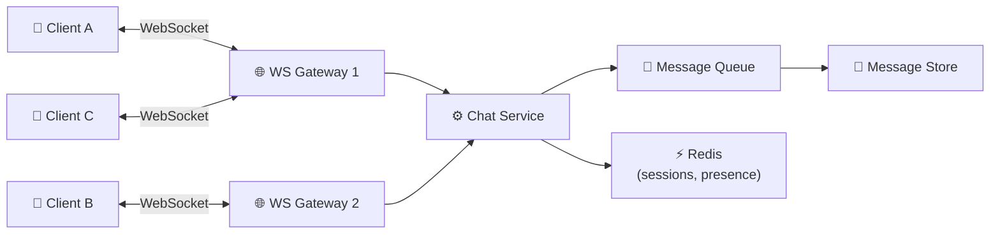
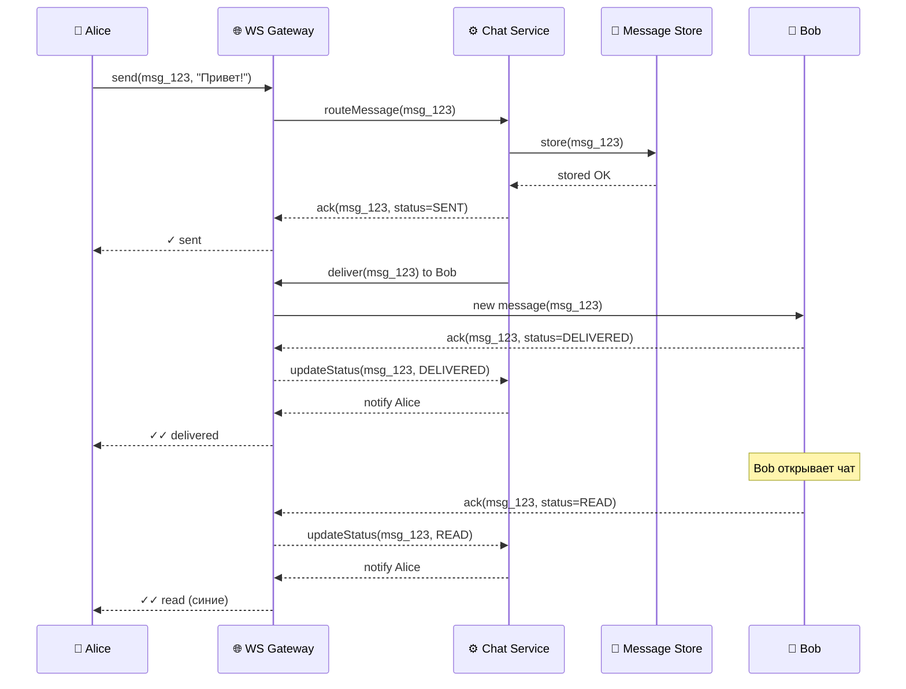
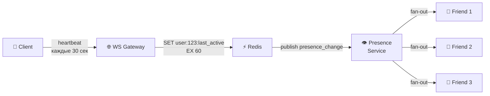
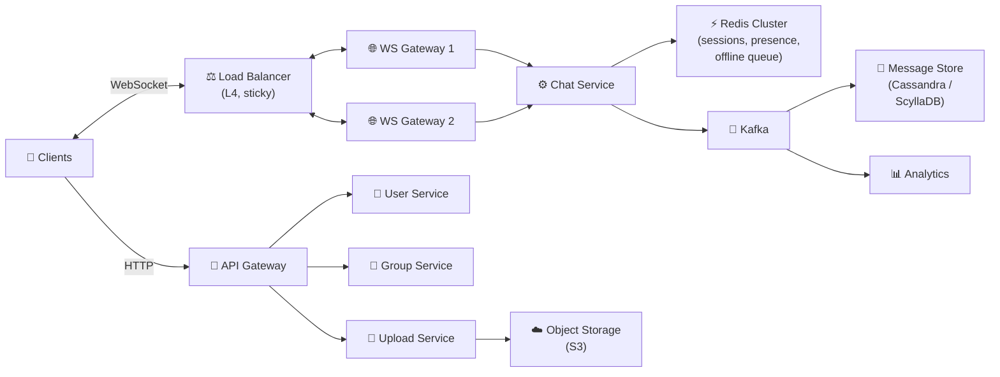

# 🔥 Уровень 12: Проектируем Мессенджер (WhatsApp-like)

## 🎯 О чём этот кейс?

Chat System — один из самых популярных кейсов на System Design интервью. WhatsApp обслуживает 2+ миллиарда пользователей, доставляет 100+ миллиардов сообщений в день и гарантирует доставку даже при нестабильном соединении. За кажущейся простотой «отправить текст» скрывается сложнейшая инфраструктура: persistent connections, presence tracking, message ordering, offline sync.

Аналогия: мессенджер — это **почтовое отделение с курьерской службой в реальном времени**. Когда оба собеседника онлайн — курьер бежит напрямую (WebSocket). Когда получатель офлайн — письмо ложится в ячейку хранения (message store), а как только он появляется — курьер сразу доставляет накопившееся. Галочки на конверте показывают: «отправлено» (одна), «доставлено» (две), «прочитано» (синие).

## 📌 Шаг 1: Требования

### Functional Requirements (что система делает)

1. **1-to-1 чат** — отправка и получение сообщений в реальном времени
2. **Групповой чат** — до 256 участников (как в WhatsApp)
3. **Статусы доставки** — sent (✓), delivered (✓✓), read (✓✓ синие)
4. **Online/Offline статус** — «был в сети 5 минут назад»
5. **Отправка медиа** — фото, видео, файлы
6. **Offline-режим** — сообщения доставляются, когда получатель выходит в сеть
7. **История сообщений** — синхронизация между устройствами

### Non-Functional Requirements (как система работает)

- **Низкая задержка** — доставка сообщения < 200 мс для онлайн-пользователей
- **Масштаб** — миллионы одновременных подключений
- **Надёжность** — сообщения не теряются, доставляются хотя бы один раз
- **Порядок** — сообщения отображаются в порядке отправки
- **Consistency** — оба собеседника видят одинаковую историю

## 📌 Шаг 2: WebSocket — основа real-time коммуникации

### Почему WebSocket, а не HTTP polling?

| Подход | Задержка | Нагрузка на сервер | Подходит для чата? |
|--------|----------|--------------------|--------------------|
| **HTTP Polling** | 1-30 сек (интервал) | Огромная: миллионы пустых запросов | Нет |
| **Long Polling** | ~0.5 сек | Средняя: каждый запрос держит соединение | Для fallback |
| **WebSocket** | ~50 мс | Минимальная: persistent connection | Да |
| **SSE** | ~100 мс | Средняя: только server→client | Нет (нужен bidirectional) |

```typescript
// HTTP Polling: клиент спрашивает каждые 3 секунды
// ❌ 10 млн пользователей × 20 запросов/мин = 200 млн запросов/мин (почти все пустые)

// WebSocket: постоянное соединение
// ✅ 10 млн пользователей = 10 млн соединений, сообщения только когда есть данные
```

### WebSocket Gateway



```typescript
// WebSocket Gateway — stateful сервер, который держит соединения
interface WSConnection {
  userId: string
  deviceId: string
  socket: WebSocket
  connectedAt: Date
  gatewayId: string  // На каком сервере живёт это соединение
}

// Маппинг: userId → gatewayId (в Redis)
// Когда Chat Service хочет доставить сообщение пользователю,
// он смотрит в Redis, на каком Gateway пользователь подключён
async function routeMessage(recipientId: string, message: ChatMessage) {
  const gatewayId = await redis.get(`session:${recipientId}`)
  if (gatewayId) {
    // Пользователь онлайн — отправить через его Gateway
    await publishToGateway(gatewayId, recipientId, message)
  } else {
    // Пользователь офлайн — сохранить в offline queue
    await storeOfflineMessage(recipientId, message)
  }
}
```

💡 **Почему Gateway — отдельный сервис?** WebSocket-соединения stateful (привязаны к конкретному серверу). Если бизнес-логику чата положить в тот же процесс, масштабировать и обновлять будет мучительно. Gateway только держит соединения и проксирует сообщения — логика в Chat Service.

## 🔥 Шаг 3: Доставка сообщений и статусы

Главная фишка мессенджера — **три галочки**: sent (✓), delivered (✓✓), read (✓✓ синие). За этим стоит целый протокол подтверждений:



### Протокол подтверждений

```typescript
// Каждое сообщение проходит через состояния:
type MessageStatus = 'SENDING' | 'SENT' | 'DELIVERED' | 'READ'

// SENDING — клиент отправил, ждёт ack от сервера
// SENT (✓) — сервер сохранил в БД и подтвердил
// DELIVERED (✓✓) — сообщение доставлено на устройство получателя
// READ (✓✓ синие) — получатель открыл чат и прочитал

interface MessageAck {
  messageId: string
  status: MessageStatus
  timestamp: number
}

// Клиент отправляет ack при получении сообщения
// и отдельный ack при прочтении (открытии чата)
function onMessageReceived(message: ChatMessage) {
  // Показать сообщение в UI
  displayMessage(message)
  // Отправить ack DELIVERED
  ws.send(JSON.stringify({
    type: 'ack',
    messageId: message.id,
    status: 'DELIVERED',
  }))
}

function onChatOpened(chatId: string) {
  // Все непрочитанные → READ
  const unreadIds = getUnreadMessageIds(chatId)
  ws.send(JSON.stringify({
    type: 'batch_ack',
    messageIds: unreadIds,
    status: 'READ',
  }))
}
```

📌 **Важно**: READ ack отправляется батчем при открытии чата, а не по каждому сообщению отдельно. Если в чате 200 непрочитанных — один batch_ack, а не 200 отдельных.

## 🔥 Шаг 4: Presence Service — онлайн-статус

### Heartbeat-механизм

Как узнать, что пользователь онлайн? Клиент отправляет heartbeat каждые N секунд. Если heartbeat не пришёл — пользователь офлайн.



```typescript
// Presence: heartbeat + TTL в Redis
const HEARTBEAT_INTERVAL = 30_000  // Клиент шлёт каждые 30 сек
const PRESENCE_TTL = 60            // Если нет heartbeat 60 сек — офлайн

// При каждом heartbeat:
async function handleHeartbeat(userId: string) {
  const wasOnline = await redis.exists(`presence:${userId}`)
  await redis.setex(`presence:${userId}`, PRESENCE_TTL, Date.now().toString())

  if (!wasOnline) {
    // Пользователь вернулся онлайн — уведомить друзей
    await publishPresenceChange(userId, 'online')
  }
}

// Когда TTL истекает — Redis автоматически удаляет ключ
// Следующий запрос getPresence вернёт "офлайн"

async function getPresence(userId: string): Promise<PresenceInfo> {
  const lastActive = await redis.get(`presence:${userId}`)
  if (lastActive) {
    return { status: 'online', lastSeen: parseInt(lastActive) }
  }
  // Для "был в сети X минут назад" — храним lastSeen в отдельном ключе
  const lastSeen = await redis.get(`last_seen:${userId}`)
  return { status: 'offline', lastSeen: lastSeen ? parseInt(lastSeen) : null }
}
```

### Fan-out presence: кому рассылать обновления?

У пользователя 500 контактов. Когда он выходит в сеть — нужно уведомить всех? Нет! Только тех, у кого открыт чат с ним или список контактов.

```typescript
// Subscription model: клиент подписывается на presence конкретных userId
// (только для тех, кто сейчас виден на экране)

// Клиент открыл список чатов — подписаться на presence последних 20 собеседников
// Клиент открыл чат с Alice — подписаться на presence Alice
// Клиент закрыл чат — отписаться

interface PresenceSubscription {
  subscriberId: string    // Кто хочет знать
  targetUserId: string    // За кем следим
}

// Redis PubSub: канал per user
// Когда Alice меняет статус → publish в канал "presence:alice"
// Все подписчики этого канала получат обновление
```

## 🔥 Шаг 5: Fan-out on Write vs Fan-out on Read

Ключевое архитектурное решение для групповых чатов: **когда** создавать копии сообщения для каждого участника?

### Fan-out on Write (WhatsApp-подход)

```typescript
// При отправке сообщения — сразу создать запись для КАЖДОГО участника
async function sendGroupMessage(senderId: string, groupId: string, text: string) {
  const message = { id: generateId(), senderId, text, timestamp: Date.now() }
  const members = await getGroupMembers(groupId)

  // Записать в inbox каждого участника
  for (const memberId of members) {
    await messageStore.insert({
      recipientId: memberId,
      chatId: groupId,
      ...message,
    })
    // Попытаться доставить онлайн-участникам
    await tryDeliverToUser(memberId, message)
  }
}
```

**Плюсы**: чтение быстрое (у каждого свой inbox), доставка простая.
**Минусы**: запись дорогая (группа из 256 человек = 256 записей), storage x N.

### Fan-out on Read (альтернатива)

```typescript
// При отправке — одна запись. При чтении — собрать из всех чатов
async function sendGroupMessage(senderId: string, groupId: string, text: string) {
  // Одна запись в хранилище группы
  await messageStore.insert({ chatId: groupId, senderId, text, timestamp: Date.now() })
}

async function getMessages(userId: string, chatId: string) {
  // При каждом открытии чата — запрос к хранилищу группы
  return await messageStore.query({ chatId, afterTimestamp: lastSyncTimestamp })
}
```

**Плюсы**: экономия storage, запись быстрая.
**Минусы**: чтение медленное для пользователей со множеством чатов, сложнее доставка.

### Что выбрать?

| Критерий | Fan-out on Write | Fan-out on Read |
|----------|------------------|-----------------|
| **Задержка записи** | Высокая (N записей) | Низкая (1 запись) |
| **Задержка чтения** | Низкая (свой inbox) | Высокая (join по чатам) |
| **Storage** | x N (по числу участников) | x 1 |
| **Подходит для** | 1-to-1, малые группы | Большие каналы (1000+ подписчиков) |

💡 **WhatsApp-подход**: fan-out on write для 1-to-1 и групп до 256 человек. Для broadcast-каналов с тысячами подписчиков — fan-out on read или гибрид.

## 📌 Шаг 6: Хранение сообщений

### Data Model

```typescript
// Таблица messages — основное хранилище
interface Message {
  messageId: string          // Globally unique (snowflake ID)
  chatId: string             // ID чата (1-to-1 или группа)
  senderId: string
  content: string
  contentType: 'text' | 'image' | 'video' | 'file'
  mediaUrl?: string          // URL в object storage (S3)
  status: MessageStatus
  createdAt: number          // Unix timestamp
  editedAt?: number
}

// Таблица chats — метаданные чатов
interface Chat {
  chatId: string
  type: 'direct' | 'group'
  name?: string              // Для групп
  createdAt: number
  lastMessageAt: number      // Для сортировки списка чатов
}

// Таблица chat_participants — участники чатов
interface ChatParticipant {
  chatId: string
  userId: string
  role: 'owner' | 'admin' | 'member'
  joinedAt: number
  lastReadMessageId?: string  // Для подсчёта непрочитанных
  mutedUntil?: number
}
```

### Sharding Strategy

```typescript
// Ключ шардирования: chatId
// Все сообщения одного чата на одном шарде → запросы не требуют scatter-gather

// Схема: chatId → hash(chatId) % NUM_SHARDS → shard_N

// Почему chatId, а не oderId?
// ❌ По userId — при открытии чата нужны данные двух пользователей (scatter-gather)
// ❌ По messageId — сообщения одного чата разбросаны по шардам
// ✅ По chatId — все сообщения чата вместе, чтение одного шарда

// Индексы:
// PRIMARY KEY (chatId, messageId) — сообщения чата в порядке ID
// INDEX (userId, lastMessageAt DESC) — список чатов пользователя
// INDEX (chatId, createdAt DESC) — пагинация сообщений
```

### Sync между устройствами

```typescript
// Клиент хранит lastSyncTimestamp
// При подключении запрашивает: "дай все сообщения после timestamp X"

interface SyncRequest {
  userId: string
  lastSyncTimestamp: number
  limit: number  // Макс. 1000 сообщений за раз
}

interface SyncResponse {
  messages: Message[]
  hasMore: boolean
  newSyncTimestamp: number
}

// Для долгого офлайна (неделя) — может быть тысячи сообщений
// Sync с пагинацией: клиент запрашивает порциями по 100-200
```

## 📌 Шаг 7: Media Upload

Медиа-файлы не проходят через WebSocket и Chat Service — это отдельный поток:

```typescript
// 1. Клиент запрашивает pre-signed URL для загрузки
// 2. Клиент загружает файл напрямую в Object Storage (S3)
// 3. Клиент отправляет сообщение с mediaUrl через WebSocket

// Pre-signed URL — S3 генерирует временную ссылку для загрузки
// Файл идёт напрямую клиент → S3, минуя серверы чата

async function uploadMedia(file: File): Promise<string> {
  // 1. Запросить pre-signed URL
  const { uploadUrl, mediaUrl } = await api.getUploadUrl({
    contentType: file.type,
    size: file.size,
  })
  // 2. Загрузить напрямую в S3
  await fetch(uploadUrl, { method: 'PUT', body: file })
  // 3. Вернуть URL для сообщения
  return mediaUrl
}

// Thumbnails генерируются асинхронно через Lambda/worker
// при загрузке: S3 event → Lambda → resize → save thumbnail
```

## 📌 Шаг 8: Offline Queuing

Когда получатель офлайн, сообщения накапливаются и доставляются при подключении:

```typescript
// Offline queue per user в Redis или Cassandra
async function handleOfflineMessage(recipientId: string, message: Message) {
  // Сохранить в основное хранилище (БД)
  await messageStore.save(message)

  // Добавить в offline queue (для быстрой доставки при reconnect)
  await redis.rpush(`offline:${recipientId}`, JSON.stringify({
    messageId: message.messageId,
    chatId: message.chatId,
    preview: message.content.substring(0, 100),
  }))

  // Отправить push-уведомление
  await pushService.send(recipientId, {
    title: getSenderName(message.senderId),
    body: message.content.substring(0, 100),
  })
}

// При reconnect:
async function handleReconnect(userId: string) {
  // 1. Отдать накопившиеся сообщения из offline queue
  const offlineMessages = await redis.lrange(`offline:${userId}`, 0, -1)
  await redis.del(`offline:${userId}`)

  // 2. Для каждого — отправить через WebSocket
  for (const msg of offlineMessages) {
    await deliverToUser(userId, JSON.parse(msg))
  }

  // 3. Обновить presence
  await handleHeartbeat(userId)
}
```

## 📌 Шаг 9: Полная архитектура



### Выбор технологий

| Компонент | Технология | Почему |
|-----------|------------|--------|
| **WS Gateway** | Go / Erlang | Миллионы concurrent connections |
| **Session store** | Redis Cluster | Быстрый lookup userId → gatewayId |
| **Message store** | Cassandra / ScyllaDB | Write-heavy, горизонтальное шардирование по chatId |
| **Message queue** | Kafka | Ordering per partition (partition key = chatId) |
| **Media storage** | S3 + CDN | Масштабируемый object storage |
| **Push** | FCM / APNs | Уведомления для офлайн-пользователей |

## ⚠️ Частые ошибки новичков

### Ошибка 1: HTTP polling вместо WebSocket

```
❌ Плохо:
// Клиент спрашивает сервер каждые 2 секунды
setInterval(async () => {
  const messages = await fetch('/api/messages?since=' + lastTimestamp)
  // 99% ответов пустые, но сервер обрабатывает ВСЕ запросы
}, 2000)
// 10 млн пользователей × 30 запросов/мин = 300 млн запросов/мин
```

```
✅ Хорошо:
// WebSocket: сервер сам присылает сообщения, когда они есть
const ws = new WebSocket('wss://chat.example.com')
ws.onmessage = (event) => {
  const message = JSON.parse(event.data)
  displayMessage(message)
}
// 10 млн соединений, но данные только когда есть сообщения
```

### Ошибка 2: Шардирование сообщений по userId

```
❌ Плохо:
// Шардирование по senderId
// Чат между Alice (shard 1) и Bob (shard 3)
// → чтобы показать чат, нужно читать ОБА шарда (scatter-gather)
// → медленно и сложно поддерживать порядок сообщений
```

```
✅ Хорошо:
// Шардирование по chatId
// Все сообщения чата Alice-Bob на одном шарде
// → один запрос, порядок гарантирован
// → добавление участника в группу не меняет шард
```

### Ошибка 3: Отправка presence-обновлений ВСЕМ контактам

```
❌ Плохо:
// Alice вышла в сеть → уведомить всех 500 контактов
// Даже тех, кто не смотрит на список чатов прямо сейчас
// 10 млн пользователей × 500 контактов = 5 млрд уведомлений
```

```
✅ Хорошо:
// Subscription model: уведомлять только подписчиков
// Клиент подписывается на presence тех, кто виден на экране
// Alice вышла в сеть → уведомить 5-10 подписчиков, а не 500 контактов
```

### Ошибка 4: Медиа через WebSocket и Chat Service

```
❌ Плохо:
// Отправка фото через WebSocket
ws.send(photoBlob)  // 5 MB через WebSocket!
// Блокирует соединение, нагружает Chat Service
// Chat Service превращается в file server
```

```
✅ Хорошо:
// Pre-signed URL: клиент → S3 напрямую
const { uploadUrl } = await api.getUploadUrl({ type: 'image/jpeg' })
await fetch(uploadUrl, { method: 'PUT', body: photoBlob })
// Потом отправить сообщение с URL через WebSocket (100 байт, а не 5 MB)
```

## 🎯 Итоги

| Аспект | Решение |
|--------|---------|
| **Протокол** | WebSocket для real-time, HTTP для upload/API |
| **Connection management** | WS Gateway (stateful) + Redis (session mapping) |
| **Доставка сообщений** | Store → ack SENT → deliver → ack DELIVERED → ack READ |
| **Presence** | Heartbeat каждые 30 сек → Redis с TTL 60 сек → subscription fan-out |
| **Группы** | Fan-out on write (до 256 участников), fan-out on read (каналы 1000+) |
| **Storage** | Cassandra, шардирование по chatId, sync по timestamp |
| **Медиа** | Pre-signed URL → S3 напрямую, thumbnails через Lambda |
| **Offline** | Offline queue в Redis, push-уведомление, sync при reconnect |
| **Ordering** | Kafka partition по chatId, Snowflake ID для глобального порядка |

💡 На интервью акцентируйте внимание на **WebSocket connection management** (как маршрутизировать сообщение между Gateway-серверами), **delivery statuses** (протокол подтверждений) и **fan-out strategy** (write vs read). Это три ключевых решения, которые отличают мессенджер от обычного CRUD-приложения.
