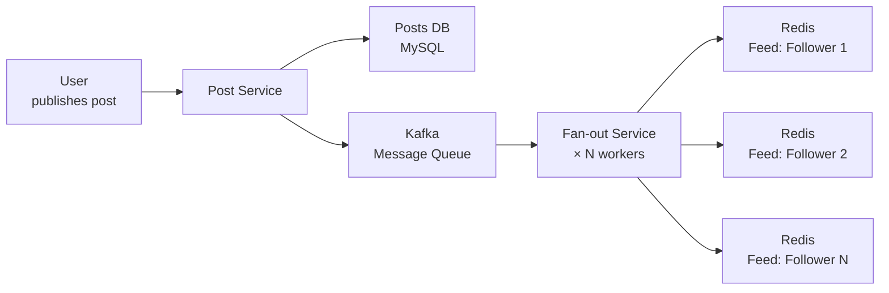
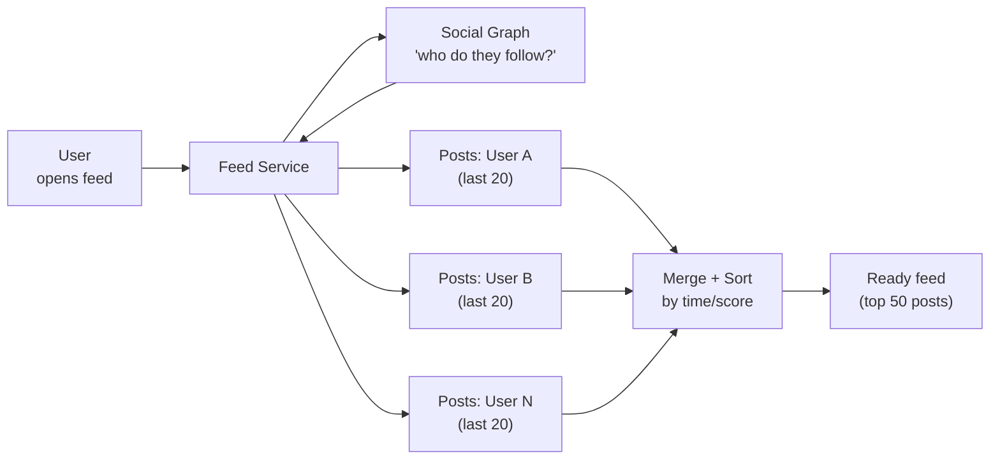
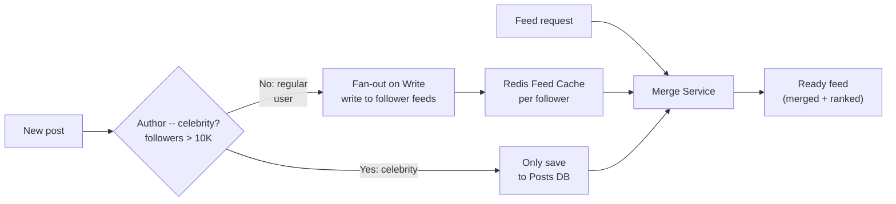
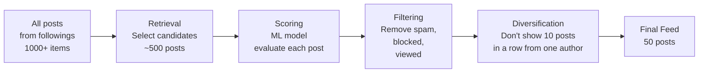

# Level 13: Designing a News Feed -- Fan-out, Ranking, and Personalization

## Introduction

Imagine the editorial office of a personalized newspaper that works for each reader separately. Every second, this editorial team decides: which news to include in today's issue for Ivan, which -- for Maria, and which -- for Elon. And there are 200 million readers. The newspaper must be ready before the reader can blink -- in less than 200 milliseconds.

This is exactly how a news feed works in Twitter, Instagram, or Facebook. Behind the simple interface -- infinite scrolling -- lies one of the most complex architectural tasks in the industry. A news feed is where three fundamentally different problems intersect: **data distribution** (how to quickly deliver a post to each of millions of followers), **personalization** (which posts to show first from thousands of candidates), and **scaling** (how the system should behave when Elon Musk publishes a tweet with 150 million followers).

In this level we'll cover each of these aspects -- from first principles to production solutions that real companies use.

---

## 1. Requirements and Scale Estimates

### Functional Requirements -- What the System Does

Before designing architecture, it's important to precisely define what exactly the system must do. In a System Design interview, this step is critical: different interpretations of the task lead to radically different architectures.

1. **Post publishing** -- text, photo, video with metadata (geolocation, tags, privacy settings)
2. **Feed generation** -- personalized stream of posts from accounts the user follows
3. **Follow / Unfollow** -- real-time subscription management
4. **Chronological and algorithmic sorting** -- user chooses display mode
5. **Infinite scroll** -- pagination on scroll (loading next batch of posts)

### Non-Functional Requirements -- How the System Works

NFRs determine architectural decisions. The same "show feed" with requirements "< 200ms" vs "< 2 sec" -- completely different systems.

- **Low latency**: feed loads in less than 200ms (P95)
- **Scale**: hundreds of millions of users, billions of posts in storage
- **High availability**: 99.99% uptime (acceptable ~52 minutes downtime per year)
- **Eventual consistency**: a post may appear in followers' feeds with 1-5 second delay -- that's normal
- **Celebrity problem**: users with 10M+ followers must not create write storms on publishing

**Why eventual consistency is acceptable?** A news feed isn't a bank transaction. If Ivan sees Maria's post after 2 seconds instead of instantly -- that's not a problem. Strong consistency in this context would cost too much in performance.

### Scale Estimates (back-of-the-envelope)

The ability to make rough estimates is one of the most important skills in System Design. They help understand order of magnitudes and justify technical decisions.

```
Total users: 500 million
DAU (Daily Active Users):  200 million

User behavior:
  Average user follows: 300 accounts
  Feed openings per day per person: 5
  Posts published per day:           500 million (2.5 posts/user DAU)

Read load:
  Feed openings per day:    5 × 200M = 1 billion
  Read QPS (average):       1,000,000,000 / 86,400 ≈ 12,000 RPS
  Read QPS (peak ×3):       ≈ 36,000 RPS

Write load (post publishing):
  Write QPS (average):      500,000,000 / 86,400 ≈ 6,000 RPS
  Write QPS (peak ×3):      ≈ 18,000 RPS

Fan-out load:
  Average user → 300 followers
  6,000 posts/sec × 300 = 1,800,000 writes/sec to follower feeds
```

**Conclusion from estimates**: the write load to feed caches (~1.8M/sec) is an order of magnitude higher than the post publishing load (6K/sec). This is exactly what makes fan-out -- the process of distributing a post to all follower feeds -- the main architectural challenge.

---

## 2. Fan-out on Write -- Push Model

### What Fan-out Is and Why It Matters

The word "fan-out" literally means "branching." In the context of a news feed: when one user publishes a post, the system must "branch" this post -- deliver it to all feeds of followers. This is like mail distribution: one sender, thousands of recipients.

**Fan-out on Write** is a strategy where delivery happens at the moment of publication ("write time"). A journalist wrote an article → the printing press immediately prints the run and puts a copy in every mailbox. By the time the reader opens their box -- the newspaper is already there.



### Fan-out on Write Implementation

```typescript
// Publishing post with immediate fan-out
async function publishPost(authorId: string, content: PostContent): Promise<Post> {
  // Step 1: Save post as source of truth
  const post = await postsDb.insert({
    postId: generateId(),
    authorId,
    content,
    createdAt: Date.now(),
    status: 'active',
  })

  // Step 2: Send event to queue for asynchronous fan-out
  // Important: we do NOT do fan-out synchronously in this request
  // This allows returning a response to the user immediately
  await kafka.produce('post.published', {
    postId: post.postId,
    authorId: post.authorId,
    createdAt: post.createdAt,
  })

  return post
}

// Fan-out worker -- executes asynchronously
async function fanoutWorker(event: PostPublishedEvent): Promise<void> {
  const { postId, authorId } = event

  // Step 3: Get follower list (can be millions)
  const followerIds = await socialGraph.getFollowers(authorId)

  // Step 4: Batch write to follower feeds
  // Split into batches of 100 to not overload Redis with one pipeline
  const batchSize = 100
  for (let i = 0; i < followerIds.length; i += batchSize) {
    const batch = followerIds.slice(i, i + batchSize)

    const pipeline = redis.pipeline()
    for (const followerId of batch) {
      // LPUSH: add postId to start of list (newest first)
      pipeline.lpush(`feed:${followerId}`, postId)
      // LTRIM: store only last 1000 posts to not bloat memory
      pipeline.ltrim(`feed:${followerId}`, 0, 999)
    }

    await pipeline.exec()
  }
}

// Reading feed -- O(1), just read the ready-made list
async function getFeed(userId: string, cursor: number, limit: number): Promise<Post[]> {
  // Get slice of postIds from cached list
  const postIds = await redis.lrange(`feed:${userId}`, cursor, cursor + limit - 1)

  // Get full post data (from separate cache or DB)
  return await postsDb.getByIds(postIds)
}
```

### Implementation Breakdown

Several details in the code above need explanation.

**Why Kafka, not a direct call to the fan-out service?** Publishing a post is a synchronous operation from the user's perspective. If we wait for fan-out to complete (which takes seconds with many followers) before returning a response -- the user will stare at a spinner. Kafka allows splitting the request into two parts: "accept post" (fast) and "deliver to followers" (asynchronous).

**Why LTRIM at 1000 posts?** This is a safety valve. Without trim, if a user rarely logs in, their feed can grow to millions of posts -- huge Redis memory consumption. In practice, users consume 20-50 posts per session, and rarely go deeper than 500.

**Why batches of 100?** Redis processes pipelines atomically. If we send 10,000 commands in one pipeline for a user with 10K followers -- this blocks Redis during execution. Batches allow interleaving work between different pipelines.

### Pros and Cons of Fan-out on Write

| Aspect | Rating | Details |
|--------|--------|--------|
| Read speed | ✅ Excellent | O(1) -- just read the ready-made list from Redis |
| Pagination complexity | ✅ Simple | Cursor-based by index in Redis list |
| Write speed | ❌ Expensive | 1 post × N followers writes |
| Celebrity problem | ❌ Critical | 50M followers = 50M writes = 500+ seconds |
| Memory consumption | ⚠️ High | Each postId duplicated in N feeds |
| Appearance delay | ⚠️ Small | Post appears after 1-5 sec (asynchronous fan-out) |

---

## 3. Fan-out on Read -- Pull Model

### Principle and Mental Model

**Fan-out on Read** is the opposite strategy. The feed isn't stored ready; it's assembled "on the fly" when the user requests it. Analogy -- a news aggregator like Google News: reader visits the site → system browses hundreds of sources, collects articles, and shows a personalized selection.



### Fan-out on Read Implementation

```typescript
// Publishing post -- as simple as possible
async function publishPost(authorId: string, content: PostContent): Promise<Post> {
  // Just save the post. No fan-out on write.
  return await postsDb.insert({
    postId: generateId(),
    authorId,
    content,
    createdAt: Date.now(),
  })
}

// Reading feed -- here's all the complexity
async function getFeed(userId: string, cursor: string, limit: number): Promise<Post[]> {
  // Step 1: Find out who the user follows
  const followingIds = await socialGraph.getFollowing(userId)
  // If user follows 300 accounts --> 300 values

  // Step 2: Parallel request for latest posts from each
  const postsByUser = await Promise.all(
    followingIds.map(id =>
      postsDb.getRecent(id, { after: cursor, limit: 20 })
    )
  )
  // 300 parallel queries to DB -- this is expensive!

  // Step 3: Merge all posts into one array and sort
  const allPosts = postsByUser.flat()
  allPosts.sort((a, b) => b.createdAt - a.createdAt)

  // Step 4: Return first limit posts
  return allPosts.slice(0, limit)
}
```

### Fan-out on Read Problems at Scale

At first glance, the code looks elegant. But let's count the load:

```
User follows: 300 accounts
DB queries per feed open: 300
Feed openings per second (peak): 36,000 RPS
Total DB queries for posts: 36,000 × 300 = 10,800,000 queries/sec
```

This is 1,800 times more read load than fan-out on write. And latency also grows: parallel queries to 300 DB shards add up, and the total response time is determined by the slowest shard.

**Conclusion**: fan-out on read works great for a small number of followings (up to 50-100), but becomes unacceptable at 300+ followings and high QPS.

| Aspect | Rating | Details |
|--------|--------|--------|
| Read speed | ❌ Slow | N queries to DB on each feed open |
| Celebrity problem | ✅ No problem | Post just saved, no fan-out |
| Write speed | ✅ Instant | Just save one post |
| Memory consumption | ✅ Minimal | No data duplication |
| Pagination complexity | ❌ High | Need to remember cursor for each following |
| Data freshness | ✅ Real-time | Post visible immediately after publishing |

---

## 4. Hybrid Approach -- Best of Both Worlds

### Why a Hybrid Approach Is Needed

Neither fan-out on write nor fan-out on read solves all problems alone. The solution is to combine both approaches depending on user characteristics.

Key insight: **write amplification only occurs for users with huge audiences** -- "celebrities." A regular user with 300 followers safely gets fan-out on write (300 writes = 3ms). But a user with 50M followers creates 50M writes -- that's a catastrophe.



### Hybrid Implementation

```typescript
const CELEBRITY_THRESHOLD = 10_000  // Threshold: more than 10K followers = celebrity

// Publishing post
async function publishPost(authorId: string, content: PostContent): Promise<Post> {
  // 1. Always save post to Posts DB
  const post = await postsDb.insert({
    postId: generateId(),
    authorId,
    content,
    createdAt: Date.now(),
  })

  // 2. Check author's audience size
  const followerCount = await socialGraph.getFollowerCount(authorId)

  if (followerCount < CELEBRITY_THRESHOLD) {
    // Regular user: push to follower feeds
    await kafka.produce('fanout.write', {
      postId: post.postId,
      authorId: post.authorId,
    })
  }
  // For celebrities: post only in Posts DB.
  // Followers will pull it on next feed open.

  return post
}

// Feed assembly (hybrid merge)
async function getFeed(userId: string, cursor: string, limit: number): Promise<Post[]> {
  // Part 1: Ready part of feed (fan-out on write from regular followings)
  // Already in Redis -- O(1) read
  const cachedPostIds = await redis.lrange(`feed:${userId}`, 0, 499)
  const cachedPosts = await postsDb.getByIds(cachedPostIds)

  // Part 2: Posts from celebrities (fan-out on read for a narrow list)
  // Usually a user follows a small number of celebrities (5-20)
  const celebrityIds = await socialGraph.getCelebrityFollowing(userId)
  const celebrityPosts = await Promise.all(
    celebrityIds.map(id =>
      postsDb.getRecent(id, { after: cursor, limit: 10 })
    )
  )

  // Part 3: Merge and rank
  const allPosts = [...cachedPosts, ...celebrityPosts.flat()]
  return rankAndPaginate(allPosts, limit)
}
```

### Why the Threshold Is Exactly 10K?

Choosing the threshold is an engineering balance between two problems:

```
Fan-out for 10K followers:
  10,000 writes to Redis
  Redis speed: ~100K writes/sec (pipeline)
  Fan-out time: 10,000 / 100,000 = 100ms -- acceptable

Fan-out for 1M followers:
  1,000,000 writes to Redis
  Fan-out time: 1,000,000 / 100,000 = 10 seconds -- unacceptable

Fan-out for 50M followers (Elon Musk):
  50,000,000 writes
  Fan-out time: 50,000,000 / 100,000 = 500 seconds = 8+ minutes
```

**Key thought**: the 10K threshold isn't a magic number. Twitter and Instagram tune it based on real metrics: what fan-out time is acceptable (SLA), what percentage of users exceed the threshold, and how it affects merge load. Real systems may use a dynamic threshold that changes depending on current load.

---

## 5. Social Graph Storage

### What Is a Social Graph

A social graph is the network of connections between users: who follows whom, who blocked whom, who is friends with whom. This is the foundation of the news feed: without subscription information, you can neither assemble a feed nor do fan-out.

### Data Model

```typescript
// Main social graph entities
interface Follow {
  followerId: string    // Who followed (initiated the follow)
  followeeId: string    // Who was followed (whose posts will be in feed)
  createdAt: number     // Timestamp for sorting and analytics
}

interface Block {
  blockerId: string     // Who blocked
  blockedId: string     // Who was blocked
  createdAt: number
}

// Typical social graph queries:
//
// 1. "Who follows user X?" (for fan-out)
//    SELECT followerId FROM follows WHERE followeeId = X
//    INDEX: (followeeId, followerId)
//
// 2. "Who does user X follow?" (for feed assembly)
//    SELECT followeeId FROM follows WHERE followerId = X
//    INDEX: (followerId, followeeId)
//
// 3. "Does A follow B?" (check on follow/unfollow)
//    SELECT COUNT(*) FROM follows WHERE followerId = A AND followeeId = B
//    INDEX: (followerId, followeeId) -- composite UNIQUE key
//
// 4. "Common followers of A and B" (feature: mutual friends)
//    Intersection of sets: followers(A) ∩ followers(B)
//    Efficient only in graph databases
```

### Sharding the Graph by followeeId

```typescript
// Sharding strategy: by followeeId
// All followers of a specific user are stored on one shard
//
// Why followeeId, not followerId?
// - "Who follows X?" query (for fan-out) -- most frequent
// - This query should go to one shard -- O(1) across shards
// - "Who does X follow?" query -- less frequent, scatter-gather acceptable

function getShardForUser(userId: string, totalShards: number): number {
  // Consistent hashing by followeeId
  const hash = murmurhash(userId)
  return hash % totalShards
}

// Hot shard problem: Elon Musk with 150M followers
// All 150M records on one shard = hot spot
//
// Solution: chunk follower lists for hot users
const CHUNK_SIZE = 10_000

async function getFollowersChunked(userId: string): Promise<string[][]> {
  const followerCount = await socialGraph.getFollowerCount(userId)
  const chunks: string[][] = []

  // For hot users: read in chunks from different shards
  for (let offset = 0; offset < followerCount; offset += CHUNK_SIZE) {
    const chunk = await socialGraph.getFollowers(userId, {
      offset,
      limit: CHUNK_SIZE,
    })
    chunks.push(chunk)
  }

  return chunks
}
```

### Database Choice for Social Graph

| DB | Suitable? | Why |
|----|-----------|--------|
| **MySQL/PostgreSQL** | For initial scale | Simple follows table with indexes. JOINs slow down at 500M+ records |
| **Cassandra** | For storing connections | Write-optimized, sharding by followeeId. Bad for "friends of friends" |
| **Redis** (adjacency list) | For hot cache | `SMEMBERS followers:userX` -- O(1). Expensive in memory for millions of users |
| **Neo4j** | For graph queries | Native graph traversals. Hard to scale horizontally |
| **TAO (Facebook)** | Hyperscale | Specialized graph storage. Written by Facebook for their needs |

**Practical solution**: most companies use a combination -- **Cassandra** for storing connections and **Redis** as a cache for hot users. At startup scale -- PostgreSQL with proper indexes is enough for the first few years.

---

## 6. Feed Ranking

### Chronological vs Algorithmic Sorting

Until 2016, Twitter showed tweets in reverse chronological order: newest first. This is clear and predictable, but has a serious drawback: if the user hasn't checked for several hours, they miss important posts that were pushed out by less significant but fresher ones.

Algorithmic sorting solves this: the system chooses posts the user is most likely to value. But along with this come complexity and opacity ("why was this shown to me?").

### Ranking Pipeline

Industrial ranking systems work in several stages, each reducing the number of candidates:



**Retrieval (candidate selection)** -- from millions of posts, select a few hundred that might be interesting. These are fast heuristics: posts from people the user interacted with in the last 30 days; posts no older than 48 hours; posts with high engagement in the user's network.

**Scoring** -- apply an ML model to each candidate. This is the most expensive stage: this is where personalization is used.

**Filtering** -- remove posts from blocked users, already viewed posts, potential spam or rule violations.

**Diversification** -- prevent "monopoly": if the user has 10 followings and one posts very actively, the algorithm shouldn't show only their posts.

### Scoring Formula

```typescript
// Ranking model -- simplified version of real systems
interface ScoredPost {
  post: Post
  score: number
  breakdown: ScoreBreakdown
}

interface ScoreBreakdown {
  freshness: number      // 0.0 -- 1.0, how fresh the post is
  affinity: number       // 0.0 -- 1.0, closeness to author
  engagement: number     // 0.0 -- 1.0, post popularity
  contentPreference: number  // 0.0 -- 1.0, content type preferences
}

function calculateScore(post: Post, viewer: User): ScoredPost {
  // --- Component 1: Freshness (30% weight) ---
  // Exponential decay: every 10 hours the post loses ~63% freshness
  const ageHours = (Date.now() - post.createdAt) / 3_600_000
  const freshness = Math.exp(-ageHours / 10)
  // New post: ageHours=0, freshness=1.0
  // After 10 hours: freshness=0.37
  // After 48 hours: freshness=0.008 (almost zero)

  // --- Component 2: Author closeness (40% weight) ---
  // Affinity: how often the user interacted with this author
  // Likes, comments, reposts, DM -- everything is counted
  const affinity = getAffinityScore(viewer.id, post.authorId)

  // --- Component 3: Post engagement (20% weight) ---
  // Logarithm: prevents viral posts from dominating
  const rawEngagement = post.likes + post.comments * 2 + post.shares * 3
  const engagement = Math.log(1 + rawEngagement) / Math.log(10_000)
  // Post with 0 likes: engagement=0
  // Post with 10 likes: engagement≈0.25
  // Post with 10K likes: engagement=1.0

  // --- Component 4: Content type (10% weight) ---
  // If user likes videos more than photos -- show more videos
  const contentPreference = getContentPreference(viewer.id, post.contentType)

  const score = freshness * 0.30
              + affinity * 0.40
              + engagement * 0.20
              + contentPreference * 0.10

  return {
    post,
    score,
    breakdown: { freshness, affinity, engagement, contentPreference },
  }
}
```

### Why Affinity Is the Most Important Signal (40%)?

This isn't obvious, but important to understand. Affinity -- closeness to the author -- reflects the user's real interest. If Ivan regularly likes Maria's posts, comments on them, and saves them -- then Maria's content is genuinely interesting to him, regardless of how popular the post is with others.

Freshness comes second: this compensates for the fact that the feed is a news stream, not an archive of best posts.

Engagement (popularity) is important but has lower weight, because "viral" doesn't mean "interesting to this specific user." Without the logarithm, a post with 10M likes (Beyoncé announcing pregnancy) would dominate everything.

---

## 7. Feed Caching

### Why Cache Is Not an Optimization but a Necessity

Without cache, each feed request requires:
- 1 query to Social Graph (who does the user follow)
- 300 queries to Posts DB (latest posts from each following)
- ML model scoring on 500+ candidates

At 36,000 RPS at peak -- that's 10.8M queries to DB per second. No relational DB can handle that load without cache.

### Multi-Level Cache Architecture

```typescript
// Feed cache architecture -- multiple layers
//
// L1: CDN / Edge Cache
//   -- For media: photos, videos, thumbnails
//   -- TTL: hours/days
//   -- Invalidation: on post update or deletion
//
// L2: Redis Feed Cache (list of postIds)
//   -- Key: feed:{userId}
//   -- Value: ordered list of postIds
//   -- TTL: 5 minutes (fallback), plus event-driven invalidation
//
// L3: Redis Post Cache (full post data)
//   -- Key: post:{postId}
//   -- Value: JSON with text, metadata, counters
//   -- TTL: 1 hour
//
// L4: Posts DB (MySQL/Cassandra)
//   -- Source of truth
//   -- Query only on cache miss

async function getFeedWithCache(userId: string, page: number): Promise<Post[]> {
  const feedKey = `feed:${userId}:scored`

  // Attempt 1: get ranked feed from cache
  const cachedFeedRaw = await redis.get(feedKey)
  if (cachedFeedRaw) {
    const postIds: string[] = JSON.parse(cachedFeedRaw)
    const slice = postIds.slice(page * 20, (page + 1) * 20)
    // Get posts from post cache (or from DB on miss)
    return await getPostsWithCache(slice)
  }

  // Cache miss: assemble feed from scratch
  const feed = await buildHybridFeed(userId)
  const scoredFeed = rankFeed(feed, userId)

  // Cache only the list of postIds, not full posts!
  // This is a key decision -- posts are cached separately
  await redis.setex(feedKey, 300, JSON.stringify(scoredFeed.map(p => p.id)))

  return getPostsWithCache(scoredFeed.map(p => p.id).slice(page * 20, (page + 1) * 20))
}
```

### Cache Invalidation

When a post is deleted or edited:
1. Remove from Redis post cache: `DEL post:{postId}`
2. Invalidate ranked feed caches for all affected users (expensive -- usually done lazily)
3. CDN invalidation for media content

In practice, feed cache is often allowed to expire naturally (5-minute TTL) rather than actively invalidating, because the cost of invalidating millions of user feeds is prohibitive.

---

## Common Mistakes

### Mistake 1: Pure Fan-out on Write for All Users

Fan-out on write for a celebrity with 50M followers creates a 500+ second write operation. Always use a hybrid approach.

### Mistake 2: Pure Fan-out on Read for All Users

300 DB queries per feed open × 36,000 RPS = 10.8M queries/sec. Unacceptable load.

### Mistake 3: Storing Full Feed in One Cache Key

Storing full post data in the feed cache wastes memory. Store only postIds in the feed list, cache full posts separately.

### Mistake 4: No Ranking -- Pure Chronological

Without ranking, users see low-quality content mixed with important posts, reducing engagement.

### Mistake 5: Ignoring the Celebrity Problem

A single viral post from a celebrity can create a write storm that overwhelms the fan-out system. Always check follower count and route accordingly.

---

## Summary

| Aspect | Key Decision |
|--------|-------------|
| **Fan-out strategy** | Hybrid: write for regular users, read for celebrities |
| **Celebrity threshold** | ~10K followers (tuned by metrics) |
| **Feed storage** | Redis lists of postIds, full posts cached separately |
| **Social graph** | Cassandra for storage, Redis for hot cache |
| **Ranking** | Multi-stage pipeline: Retrieval → Scoring → Filtering → Diversification |
| **Scoring** | Affinity (40%) > Freshness (30%) > Engagement (20%) > Content preference (10%) |
| **Cache** | Multi-level: CDN → Redis feed → Redis posts → DB |

**Main principle:** the feed is the most visible part of a social network. Optimize for read speed (cached feed lists), handle the celebrity problem (hybrid fan-out), and rank by what matters to each user (affinity-based scoring).
