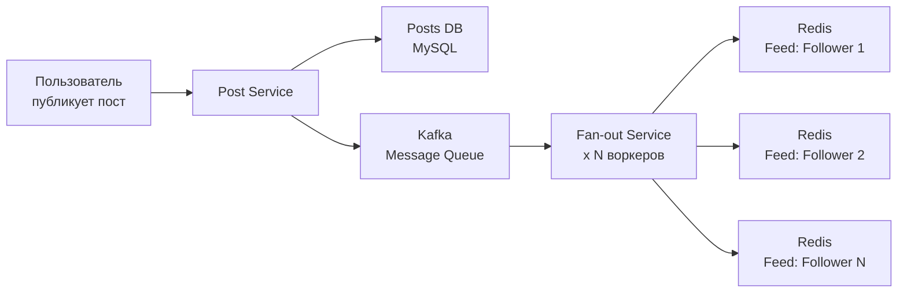
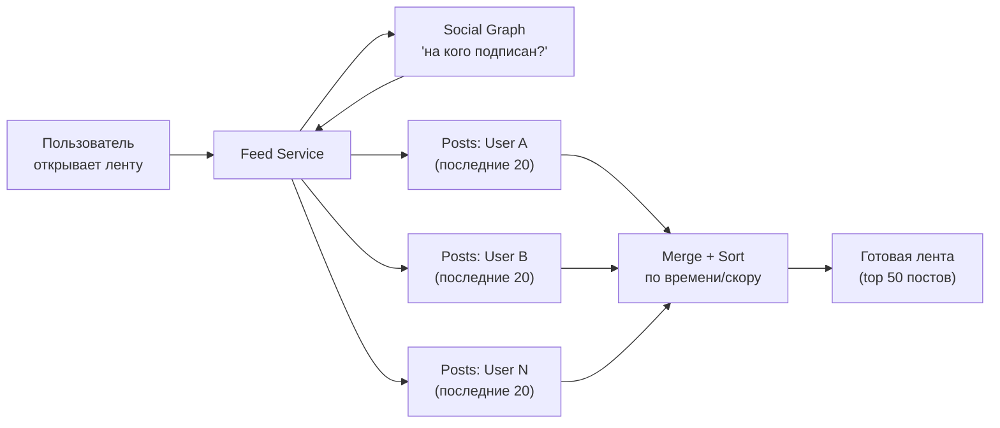
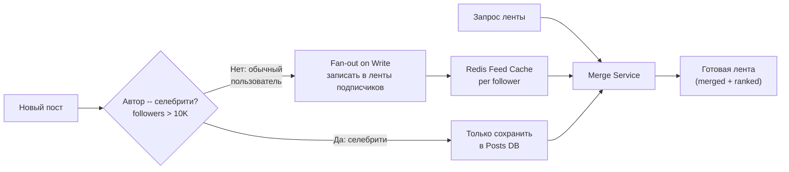
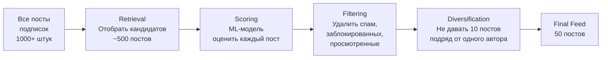
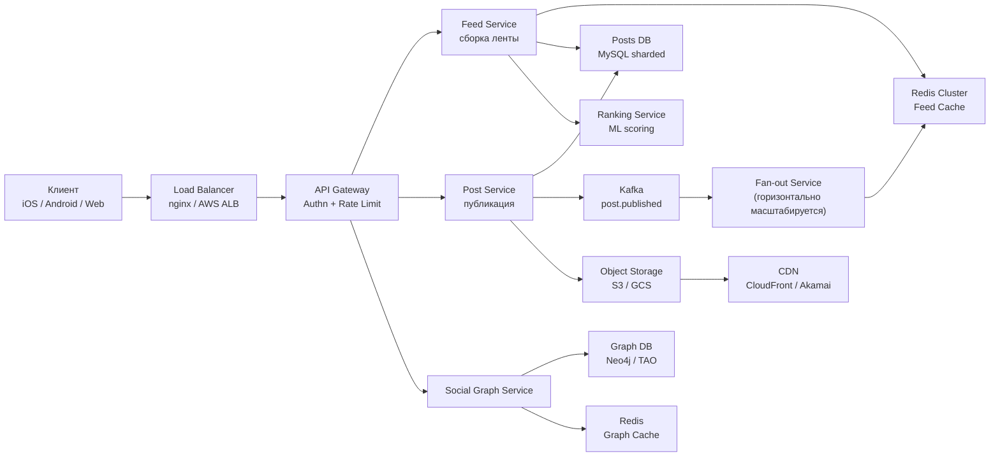
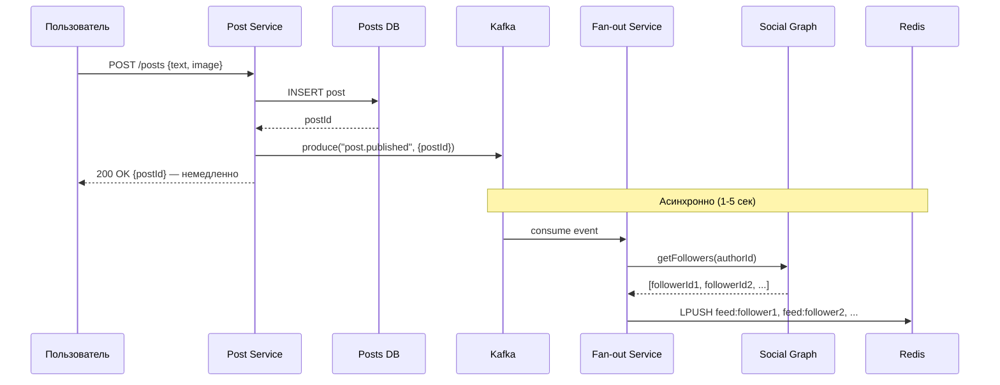
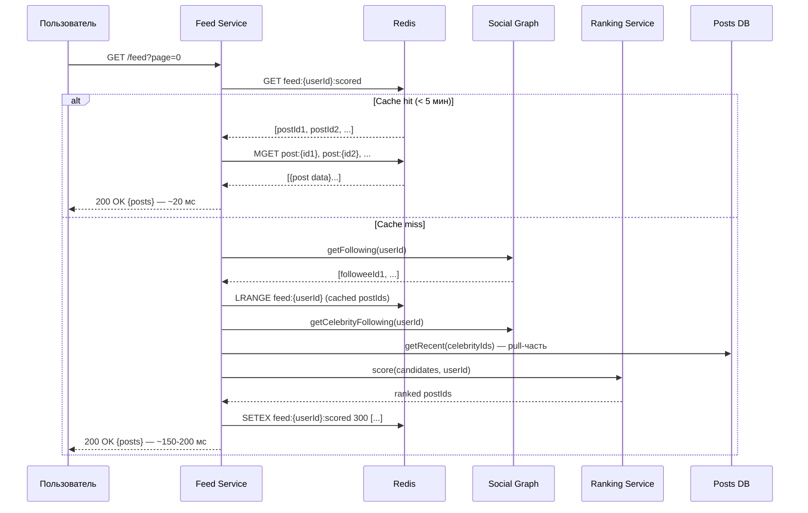

# Уровень 13: Проектируем ленту новостей -- fan-out, ранжирование и персонализация

## Введение

Представьте редакцию персональной газеты, которая работает для каждого читателя отдельно. Каждую секунду эта редакция решает: какие новости включить в сегодняшний выпуск для Ивана, какие -- для Марии, а какие -- для Элона. При этом читателей -- 200 миллионов. Газета должна быть готова раньше, чем читатель успеет моргнуть, -- менее чем за 200 миллисекунд.

Именно так устроена лента новостей в Twitter, Instagram или Facebook. За простым интерфейсом -- бесконечной прокруткой -- скрывается одна из самых сложных архитектурных задач в индустрии. Лента новостей -- это задача, в которой пересекаются три принципиально разные проблемы: **распределение данных** (как быстро доставить пост к каждому из миллионов подписчиков), **персонализация** (какие посты показать первыми из тысяч кандидатов) и **масштабирование** (как система должна вести себя, когда Элон Маск публикует твит с 150 миллионами подписчиков).

В этом уровне мы разберём каждый из этих аспектов -- от первых принципов до продакшн-решений, которые используют реальные компании.

---

## 1. Требования и масштабные оценки

### Functional Requirements -- что система делает

Прежде чем проектировать архитектуру, важно точно определить, что именно система должна уметь. На интервью по System Design этот шаг критичен: разные интерпретации задачи приводят к кардинально разным архитектурам.

1. **Публикация поста** -- текст, фото, видео с метаданными (геолокация, теги, настройки приватности)
2. **Генерация ленты** -- персонализированный поток постов от аккаунтов, на которые подписан пользователь
3. **Follow / Unfollow** -- управление подписками в режиме реального времени
4. **Хронологическая и алгоритмическая сортировка** -- пользователь выбирает режим отображения
5. **Infinite scroll** -- пагинация при прокрутке (подгрузка следующей порции постов)

### Non-Functional Requirements -- как система работает

Именно NFR определяют архитектурные решения. Одно и то же "показать ленту" при требованиях "< 200 мс" vs "< 2 сек" -- совершенно разные системы.

- **Низкая задержка**: лента загружается менее чем за 200 мс (P95)
- **Масштаб**: сотни миллионов пользователей, миллиарды постов в хранилище
- **Высокая доступность**: 99.99% uptime (допустимо ~52 минуты простоя в год)
- **Eventual consistency**: пост может появиться в лентах подписчиков с задержкой 1--5 секунд -- это нормально
- **Celebrity problem**: пользователи с 10M+ подписчиков не должны создавать write storm при публикации

💡 **Почему eventual consistency допустима?** Лента новостей -- не банковская транзакция. Если Иван увидит пост Марии через 2 секунды после публикации, а не мгновенно -- это не проблема. Strong consistency в данном контексте стоила бы слишком дорого в производительности.

### Масштабные оценки (back-of-the-envelope)

Умение делать грубые оценки -- один из важнейших навыков в System Design. Они позволяют понять порядки величин и обосновать технические решения.

```
Общее число пользователей: 500 млн
DAU (Daily Active Users):  200 млн

Поведение пользователя:
  Средний пользователь подписан на: 300 аккаунтов
  Открытий ленты в день на человека: 5 раз
  Постов публикует в день:           500 млн (2.5 поста/сек на пользователя DAU)

Нагрузка на чтение:
  Открытий ленты в день:    5 × 200 млн = 1 млрд
  QPS чтения (средний):     1 000 000 000 / 86 400 ≈ 12 000 RPS
  QPS чтения (пиковый ×3):  ≈ 36 000 RPS

Нагрузка на запись (публикация постов):
  QPS записи (средний):     500 000 000 / 86 400 ≈ 6 000 RPS
  QPS записи (пиковый ×3):  ≈ 18 000 RPS

Fan-out нагрузка:
  Средний пользователь → 300 подписчиков
  6 000 постов/сек × 300 = 1 800 000 записей/сек в ленты подписчиков
```

📌 **Вывод из оценок**: нагрузка на запись в кеши лент (~1.8M/сек) на порядок выше, чем нагрузка на публикацию постов (6K/сек). Именно это делает fan-out -- процесс распределения поста по лентам подписчиков -- главным архитектурным вызовом.

---

## 2. Fan-out on Write -- push-модель

### Что такое fan-out и почему это важно

Слово "fan-out" буквально означает "разветвление". В контексте ленты новостей: когда один пользователь публикует пост, система должна "разветвить" этот пост -- доставить его во все ленты подписчиков. Это похоже на рассылку писем: один отправитель, тысячи получателей.

**Fan-out on Write** -- стратегия, при которой доставка происходит в момент публикации ("write time"). Журналист написал статью → типография немедленно печатает тираж и кладёт экземпляр в каждый почтовый ящик. К моменту, когда читатель откроет ящик -- газета уже там.



### Реализация fan-out on write

```typescript
// Публикация поста с немедленным fan-out
async function publishPost(authorId: string, content: PostContent): Promise<Post> {
  // Шаг 1: Сохранить пост как источник истины
  const post = await postsDb.insert({
    postId: generateId(),
    authorId,
    content,
    createdAt: Date.now(),
    status: 'active',
  })

  // Шаг 2: Отправить событие в очередь для асинхронного fan-out
  // Важно: мы НЕ делаем fan-out синхронно в этом запросе
  // Это позволяет вернуть ответ пользователю немедленно
  await kafka.produce('post.published', {
    postId: post.postId,
    authorId: post.authorId,
    createdAt: post.createdAt,
  })

  return post
}

// Fan-out воркер -- выполняется асинхронно
async function fanoutWorker(event: PostPublishedEvent): Promise<void> {
  const { postId, authorId } = event

  // Шаг 3: Получить список подписчиков (может быть миллионы)
  const followerIds = await socialGraph.getFollowers(authorId)

  // Шаг 4: Батчевая запись в ленты подписчиков
  // Разбить на батчи по 100, чтобы не перегружать Redis одним пайплайном
  const batchSize = 100
  for (let i = 0; i < followerIds.length; i += batchSize) {
    const batch = followerIds.slice(i, i + batchSize)

    const pipeline = redis.pipeline()
    for (const followerId of batch) {
      // LPUSH: добавить postId в начало списка (новейшие -- первые)
      pipeline.lpush(`feed:${followerId}`, postId)
      // LTRIM: хранить только последние 1000 постов, чтобы не раздувать память
      pipeline.ltrim(`feed:${followerId}`, 0, 999)
    }

    await pipeline.exec()
  }
}

// Чтение ленты -- O(1), просто прочитать готовый список
async function getFeed(userId: string, cursor: number, limit: number): Promise<Post[]> {
  // Получить срез postId из кешированного списка
  const postIds = await redis.lrange(`feed:${userId}`, cursor, cursor + limit - 1)

  // Получить полные данные постов (из отдельного кеша или БД)
  return await postsDb.getByIds(postIds)
}
```

### Разбор реализации по строкам

Несколько деталей в коде выше требуют пояснения.

**Почему Kafka, а не прямой вызов fan-out сервиса?** Публикация поста -- синхронная операция с точки зрения пользователя. Если мы будем ждать завершения fan-out (который занимает секунды при большом количестве подписчиков) до того, как вернуть ответ -- пользователь будет смотреть на спиннер. Kafka позволяет разделить запрос на две части: "принять пост" (быстро) и "доставить подписчикам" (асинхронно).

**Почему LTRIM на 1000 постов?** Это предохранительный клапан. Без trim, если пользователь редко заходит, его лента может расти до миллионов постов -- огромный расход памяти Redis. На практике пользователи потребляют 20--50 постов за сессию, а глубже 500 уходят единицы.

**Почему батчи по 100?** Redis обрабатывает pipeline атомарно. Если мы отправляем 10 000 команд в одном pipeline для пользователя с 10K подписчиков -- это блокирует Redis на время выполнения. Батчи позволяют чередовать работу между разными pipeline.

### Плюсы и минусы fan-out on write

| Аспект | Оценка | Детали |
|--------|--------|--------|
| Скорость чтения | ✅ Отличная | O(1) -- просто прочитать готовый список из Redis |
| Сложность пагинации | ✅ Простая | Cursor-based по индексу в Redis list |
| Скорость записи | ❌ Дорогая | 1 пост × N подписчиков записей |
| Celebrity problem | ❌ Критично | 50M подписчиков = 50M записей = 500+ секунд |
| Расход памяти | ⚠️ Высокий | Каждый postId дублируется в N лентах |
| Задержка появления | ⚠️ Небольшая | Пост появляется через 1--5 сек (асинхронный fan-out) |

---

## 3. Fan-out on Read -- pull-модель

### Принцип и ментальная модель

**Fan-out on Read** -- противоположная стратегия. Лента не хранится готовой; она собирается "на лету" в момент, когда пользователь её запрашивает. Аналогия -- новостной агрегатор типа Google News: читатель заходит на сайт → система обходит сотни источников, собирает статьи и показывает персональную подборку.



### Реализация fan-out on read

```typescript
// Публикация поста -- максимально простая
async function publishPost(authorId: string, content: PostContent): Promise<Post> {
  // Просто сохранить пост. Никакого fan-out при записи.
  return await postsDb.insert({
    postId: generateId(),
    authorId,
    content,
    createdAt: Date.now(),
  })
}

// Чтение ленты -- здесь вся сложность
async function getFeed(userId: string, cursor: string, limit: number): Promise<Post[]> {
  // Шаг 1: Узнать, на кого подписан пользователь
  const followingIds = await socialGraph.getFollowing(userId)
  // Если пользователь подписан на 300 аккаунтов --> 300 значений

  // Шаг 2: Параллельно запросить последние посты от каждого
  const postsByUser = await Promise.all(
    followingIds.map(id =>
      postsDb.getRecent(id, { after: cursor, limit: 20 })
    )
  )
  // 300 параллельных запросов к БД -- это дорого!

  // Шаг 3: Объединить все посты в один массив и отсортировать
  const allPosts = postsByUser.flat()
  allPosts.sort((a, b) => b.createdAt - a.createdAt)

  // Шаг 4: Вернуть первые limit постов
  return allPosts.slice(0, limit)
}
```

### Проблемы fan-out on read при масштабе

На первый взгляд код выглядит элегантно. Но давайте посчитаем нагрузку:

```
Пользователь подписан на: 300 аккаунтов
Запросов к БД при открытии ленты: 300
Открытий ленты в секунду (пик): 36 000 RPS
Итого запросов к БД постов: 36 000 × 300 = 10 800 000 запросов/сек
```

Это в 1800 раз больше нагрузки на чтение, чем в fan-out on write. При этом задержка тоже растёт: параллельные запросы к 300 шардам БД суммируются, и итоговое время ответа определяется самым медленным шардом.

📌 **Вывод**: fan-out on read прекрасно работает для небольшого числа подписок (до 50--100), но становится неприемлемым при 300+ подписках и высоком QPS.

| Аспект | Оценка | Детали |
|--------|--------|--------|
| Скорость чтения | ❌ Медленная | N запросов к БД при каждом открытии ленты |
| Celebrity problem | ✅ Нет проблемы | Пост просто сохраняется, без fan-out |
| Скорость записи | ✅ Мгновенная | Просто записать один пост |
| Расход памяти | ✅ Минимальный | Нет дублирования данных |
| Сложность пагинации | ❌ Высокая | Нужно помнить cursor для каждой подписки |
| Свежесть данных | ✅ Реальное время | Пост виден сразу после публикации |

---

## 4. Hybrid-подход -- лучшее из двух миров

### Почему нужен гибридный подход

Ни fan-out on write, ни fan-out on read не решают всех проблем в одиночку. Решение -- комбинировать оба подхода в зависимости от характеристик пользователя.

Ключевой инсайт: **проблема write amplification возникает только у пользователей с огромной аудиторией** -- "селебрити". Обычный пользователь с 300 подписчиками безопасно получает fan-out on write (300 записей = 3 мс). Но пользователь с 50M подписчиков создаёт 50M записей -- это катастрофа.



### Реализация гибридного подхода

```typescript
const CELEBRITY_THRESHOLD = 10_000  // Порог: больше 10K followers = селебрити

// Публикация поста
async function publishPost(authorId: string, content: PostContent): Promise<Post> {
  // 1. Всегда сохранить пост в Posts DB
  const post = await postsDb.insert({
    postId: generateId(),
    authorId,
    content,
    createdAt: Date.now(),
  })

  // 2. Проверить размер аудитории автора
  const followerCount = await socialGraph.getFollowerCount(authorId)

  if (followerCount < CELEBRITY_THRESHOLD) {
    // Обычный пользователь: push в ленты подписчиков
    await kafka.produce('fanout.write', {
      postId: post.postId,
      authorId: post.authorId,
    })
  }
  // Для селебрити: пост только в Posts DB.
  // Подписчики подтянут его при следующем открытии ленты.

  return post
}

// Сборка ленты (гибридный merge)
async function getFeed(userId: string, cursor: string, limit: number): Promise<Post[]> {
  // Часть 1: Готовая часть ленты (fan-out on write от обычных подписок)
  // Это уже в Redis -- чтение O(1)
  const cachedPostIds = await redis.lrange(`feed:${userId}`, 0, 499)
  const cachedPosts = await postsDb.getByIds(cachedPostIds)

  // Часть 2: Посты от селебрити (fan-out on read для узкого списка)
  // Обычно пользователь подписан на небольшое число селебрити (5-20)
  const celebrityIds = await socialGraph.getCelebrityFollowing(userId)
  const celebrityPosts = await Promise.all(
    celebrityIds.map(id =>
      postsDb.getRecent(id, { after: cursor, limit: 10 })
    )
  )

  // Часть 3: Объединить и отранжировать
  const allPosts = [...cachedPosts, ...celebrityPosts.flat()]
  return rankAndPaginate(allPosts, limit)
}
```

### Почему порог именно 10K?

Выбор порога -- инженерный баланс между двумя проблемами:

```
Fan-out для 10K подписчиков:
  10 000 записей в Redis
  Скорость Redis: ~100K записей/сек (pipeline)
  Время fan-out: 10 000 / 100 000 = 100 мс -- приемлемо

Fan-out для 1M подписчиков:
  1 000 000 записей в Redis
  Время fan-out: 1 000 000 / 100 000 = 10 секунд -- неприемлемо

Fan-out для 50M подписчиков (Elon Musk):
  50 000 000 записей
  Время fan-out: 50 000 000 / 100 000 = 500 секунд = 8+ минут
```

💡 **Ключевая мысль**: порог 10K -- не магическое число. Twitter и Instagram подбирают его по реальным метрикам: какое время fan-out допустимо (SLA), какая доля пользователей превышает порог, и как это влияет на нагрузку при merge. Реальные системы могут использовать динамический порог, который меняется в зависимости от текущей нагрузки.

---

## 5. Хранение социального графа

### Что такое социальный граф

Социальный граф -- это сеть связей между пользователями: кто на кого подписан, кто кого заблокировал, кто с кем дружит. Это основа ленты новостей: без информации о подписках невозможно ни собрать ленту, ни сделать fan-out.

### Модель данных

```typescript
// Основные сущности социального графа
interface Follow {
  followerId: string    // Кто подписался (тот, кто инициировал follow)
  followeeId: string    // На кого подписались (чьи посты будут в ленте)
  createdAt: number     // Timestamp для сортировки и аналитики
}

interface Block {
  blockerId: string     // Кто заблокировал
  blockedId: string     // Кого заблокировали
  createdAt: number
}

// Типичные запросы к социальному графу:
//
// 1. "Кто подписан на пользователя X?" (для fan-out)
//    SELECT followerId FROM follows WHERE followeeId = X
//    ИНДЕКС: (followeeId, followerId)
//
// 2. "На кого подписан пользователь X?" (для сборки ленты)
//    SELECT followeeId FROM follows WHERE followerId = X
//    ИНДЕКС: (followerId, followeeId)
//
// 3. "Подписан ли A на B?" (проверка при follow/unfollow)
//    SELECT COUNT(*) FROM follows WHERE followerId = A AND followeeId = B
//    ИНДЕКС: (followerId, followeeId) -- составной UNIQUE ключ
//
// 4. "Общие подписчики A и B" (feature: mutual friends)
//    Пересечение множеств: followers(A) ∩ followers(B)
//    Эффективно только в графовых БД
```

### Шардирование графа по followeeId

```typescript
// Стратегия шардирования: по followeeId
// Все followers конкретного пользователя хранятся на одном шарде
//
// Почему followeeId, а не followerId?
// - Запрос "кто подписан на X?" (для fan-out) -- самый частый
// - Этот запрос должен идти на один шард -- это O(1) по шардам
// - Запрос "на кого подписан X?" -- менее частый, scatter-gather допустим

function getShardForUser(userId: string, totalShards: number): number {
  // Консистентное хеширование по followeeId
  const hash = murmurhash(userId)
  return hash % totalShards
}

// Проблема горячих шардов: Elon Musk с 150M followers
// Все 150M записей на одном шарде = hot spot
//
// Решение: chunk followers list для горячих пользователей
const CHUNK_SIZE = 10_000

async function getFollowersChunked(userId: string): Promise<string[][]> {
  const followerCount = await socialGraph.getFollowerCount(userId)
  const chunks: string[][] = []

  // Для горячих пользователей: читать чанками с разных шардов
  for (let offset = 0; offset < followerCount; offset += CHUNK_SIZE) {
    const chunk = await socialGraph.getFollowers(userId, {
      offset,
      limit: CHUNK_SIZE,
    })
    chunks.push(chunk)
  }

  return chunks
}
```

### Выбор БД для социального графа

| БД | Подходит? | Почему |
|----|-----------|--------|
| **MySQL/PostgreSQL** | Для начального масштаба | Простая таблица follows с индексами. JOIN-ы замедляются при 500M+ записей |
| **Cassandra** | Для хранения связей | Write-optimized, шардирование по followeeId. Плохо для "friends of friends" |
| **Redis** (adjacency list) | Для горячего кеша | `SMEMBERS followers:userX` -- O(1). Дорого по памяти для миллионов пользователей |
| **Neo4j** | Для графовых запросов | Нативные обходы графа. Сложно горизонтально масштабировать |
| **TAO (Facebook)** | Гиперскейл | Специализированный граф-хранилище. Написан Facebook для своих нужд |

📌 **Практическое решение**: большинство компаний используют комбинацию -- **Cassandra** для хранения связей и **Redis** как кеш для горячих пользователей. При startup-масштабе -- PostgreSQL с правильными индексами достаточно на первые несколько лет.

---

## 6. Ранжирование ленты

### Хронологическая vs Алгоритмическая сортировка

До 2016 года Twitter показывал твиты в обратном хронологическом порядке: новейшие -- первыми. Это понятно и предсказуемо, но у такого подхода есть серьёзный недостаток: если пользователь не заходил несколько часов, он пропускает важные посты, которые вытеснили менее значимые, но более свежие.

Алгоритмическая сортировка решает эту проблему: система выбирает посты, которые пользователь с наибольшей вероятностью оценит. Но вместе с этим приходят сложность и непрозрачность ("почему мне показали именно это?").

### Пайплайн ранжирования

Промышленные системы ранжирования работают в несколько этапов, каждый из которых сокращает количество кандидатов:



**Retrieval (отбор кандидатов)** -- из миллионов постов отобрать несколько сотен, которые вообще могут быть интересны. Это быстрые эвристики: посты от людей, с которыми пользователь взаимодействовал последние 30 дней; посты не старше 48 часов; посты с высоким engagement в сети пользователя.

**Scoring (оценка)** -- применить ML-модель к каждому кандидату. Это самый дорогой этап: именно здесь используется персонализация.

**Filtering (фильтрация)** -- убрать посты от заблокированных пользователей, уже просмотренные посты, потенциальный спам или нарушения правил.

**Diversification (разнообразие)** -- предотвратить "монополию": если у пользователя 10 подписок и одна публикует очень активно, алгоритм не должен показывать только её посты.

### Формула scoring

```typescript
// Модель ранжирования -- упрощённая версия реальных систем
interface ScoredPost {
  post: Post
  score: number
  breakdown: ScoreBreakdown
}

interface ScoreBreakdown {
  freshness: number      // 0.0 -- 1.0, насколько свежий пост
  affinity: number       // 0.0 -- 1.0, близость с автором
  engagement: number     // 0.0 -- 1.0, популярность поста
  contentPreference: number  // 0.0 -- 1.0, предпочтения по типу контента
}

function calculateScore(post: Post, viewer: User): ScoredPost {
  // --- Компонент 1: Свежесть (30% веса) ---
  // Экспоненциальный decay: каждые 10 часов пост теряет ~63% свежести
  const ageHours = (Date.now() - post.createdAt) / 3_600_000
  const freshness = Math.exp(-ageHours / 10)
  // Новый пост: ageHours=0, freshness=1.0
  // Через 10 часов: freshness=0.37
  // Через 48 часов: freshness=0.008 (почти ноль)

  // --- Компонент 2: Близость к автору (40% веса) ---
  // Affinity: насколько часто пользователь взаимодействовал с этим автором
  // Лайки, комменты, репосты, DM -- всё учитывается
  const affinity = getAffinityScore(viewer.id, post.authorId)

  // --- Компонент 3: Engagement поста (20% веса) ---
  // Логарифм: предотвращает доминирование вирусных постов
  const rawEngagement = post.likes + post.comments * 2 + post.shares * 3
  const engagement = Math.log(1 + rawEngagement) / Math.log(10_000)
  // Пост с 0 лайков: engagement=0
  // Пост с 10 лайков: engagement≈0.25
  // Пост с 10K лайков: engagement=1.0

  // --- Компонент 4: Тип контента (10% веса) ---
  // Если пользователь лайкает видео чаще фото -- давать больше видео
  const contentPreference = getContentPreference(viewer.id, post.contentType)

  const score = freshness * 0.30
              + affinity * 0.40
              + engagement * 0.20
              + contentPreference * 0.10

  return {
    post,
    score,
    breakdown: { freshness, affinity, engagement, contentPreference },
  }
}
```

### Почему affinity -- самый важный сигнал (40%)?

Это неочевидно, но важно понять. Affinity -- близость с автором -- отражает реальный интерес пользователя. Если Иван регулярно ставит лайки постам Марии, комментирует их и сохраняет -- значит, контент Марии ему действительно интересен, независимо от того, насколько пост популярен у других.

Freshness (свежесть) на втором месте: это компенсирует то, что лента -- это поток новостей, а не архив лучших постов.

Engagement (популярность) важен, но имеет меньший вес, потому что "вирусный" -- не значит "интересный конкретному пользователю". Без логарифма пост с 10M лайков (Beyoncé announcing pregnancy) доминировал бы надо всем.

---

## 7. Кеширование ленты

### Почему кеш -- не оптимизация, а необходимость

Без кеша каждый запрос ленты требует:
- 1 запрос к Social Graph (на кого подписан пользователь)
- 300 запросов к Posts DB (последние посты каждой подписки)
- Работу ML-модели scoring на 500+ кандидатов

При 36 000 RPS в пике -- это 10.8M запросов к БД в секунду. Ни одна реляционная БД не выдержит такой нагрузки без кеша.

### Многоуровневая архитектура кеша

```typescript
// Архитектура кеша ленты -- несколько слоёв
//
// L1: CDN / Edge Cache
//   -- Для медиа: фотографий, видео, превью
//   -- TTL: часы/дни
//   -- Invalidation: при обновлении или удалении поста
//
// L2: Redis Feed Cache (список postId)
//   -- Ключ: feed:{userId}
//   -- Значение: упорядоченный список postId
//   -- TTL: 5 минут (fallback), плюс event-driven инвалидация
//
// L3: Redis Post Cache (полные данные постов)
//   -- Ключ: post:{postId}
//   -- Значение: JSON с текстом, метаданными, счётчиками
//   -- TTL: 1 час
//
// L4: Posts DB (MySQL/Cassandra)
//   -- Источник истины
//   -- Запрос только при cache miss

async function getFeedWithCache(userId: string, page: number): Promise<Post[]> {
  const feedKey = `feed:${userId}:scored`

  // Попытка 1: получить отранжированную ленту из кеша
  const cachedFeedRaw = await redis.get(feedKey)
  if (cachedFeedRaw) {
    const postIds: string[] = JSON.parse(cachedFeedRaw)
    const slice = postIds.slice(page * 20, (page + 1) * 20)
    // Получить посты из кеша постов (или из БД при miss)
    return await getPostsWithCache(slice)
  }

  // Cache miss: собрать ленту с нуля
  const feed = await buildHybridFeed(userId)
  const scoredFeed = rankFeed(feed, userId)

  // Закешировать только список postId, не полные посты!
  // Это ключевое решение -- подробнее ниже
  await redis.setex(
    feedKey,
    300,  // TTL 5 минут
    JSON.stringify(scoredFeed.map(p => p.post.postId))
  )

  const page0 = scoredFeed.slice(0, 20)
  return page0.map(sp => sp.post)
}

// Получение постов с кешем на уровне отдельных постов
async function getPostsWithCache(postIds: string[]): Promise<Post[]> {
  const pipeline = redis.pipeline()
  postIds.forEach(id => pipeline.get(`post:${id}`))
  const results = await pipeline.exec()

  const posts: Post[] = []
  const missedIds: string[] = []

  results.forEach(([err, value], index) => {
    if (value) {
      posts.push(JSON.parse(value as string))
    } else {
      missedIds.push(postIds[index])
    }
  })

  // Batch-запрос к БД только для cache miss
  if (missedIds.length > 0) {
    const missedPosts = await postsDb.getByIds(missedIds)
    // Закешировать на 1 час
    const pipeline2 = redis.pipeline()
    missedPosts.forEach(post => {
      pipeline2.setex(`post:${post.postId}`, 3600, JSON.stringify(post))
      posts.push(post)
    })
    await pipeline2.exec()
  }

  // Восстановить исходный порядок
  return postIds
    .map(id => posts.find(p => p.postId === id))
    .filter((p): p is Post => p !== undefined)
}
```

### Почему кешировать postId, а не полные посты?

Это одно из важнейших архитектурных решений в проектировании ленты.

```
❌ Кешировать полные посты в ленте каждого пользователя:
  500M пользователей × 1000 постов × 1 KB = 500 TB только для кеша лент
  Если пост получил 1000 новых лайков -- надо обновить его в каждой ленте,
  где он присутствует. Это могут быть миллионы операций.

✅ Кешировать только список postId:
  500M пользователей × 1000 × 8 байт (postId) = 4 TB -- на 2 порядка меньше
  Обновление лайков поста: одна запись в кеш post:{postId}
  Обновление сразу видно всем пользователям, у которых этот post в ленте
```

Разделение "списка ленты" (postId) и "данных постов" -- это применение принципа separation of concerns к кешированию. Каждый слой кешируется с подходящим TTL и инвалидируется по своей логике.

### Инвалидация кеша ленты

```typescript
// Event-driven инвалидация -- обновлять кеш по событиям, а не по TTL

// Событие: новый пост от подписки
async function onNewPost(event: PostPublishedEvent): Promise<void> {
  // Для fan-out on write: добавить postId в начало кешированных лент
  // Это быстрее, чем полный пересчёт ленты
  const followerIds = await socialGraph.getFollowers(event.authorId)

  const pipeline = redis.pipeline()
  for (const followerId of followerIds) {
    // Добавить в начало, если лента уже закеширована
    // LPUSH не создаёт ключ если он не существует -- только обновляет
    const feedKey = `feed:${followerId}:scored`
    pipeline.lpush(feedKey, event.postId)
    pipeline.ltrim(feedKey, 0, 999)
  }
  await pipeline.exec()
}

// Событие: пользователь отписался
async function onUnfollow(followerId: string, unfollowedId: string): Promise<void> {
  // Самый простой вариант: просто инвалидировать весь кеш ленты
  // При следующем запросе лента пересчитается без постов unfollowedId
  await redis.del(`feed:${followerId}:scored`)
}

// Событие: пост удалён
async function onPostDeleted(postId: string): Promise<void> {
  // Удалить пост из кеша постов
  await redis.del(`post:${postId}`)
  // Кеши лент (списки postId) -- TTL 5 мин сам инвалидирует
  // Или можно пометить пост как deleted в БД и фильтровать при чтении
}
```

---

## 8. Полная архитектура Timeline Service

### Схема системы



### Путь запроса при публикации поста



### Путь запроса при открытии ленты



### Выбор технологий

| Компонент | Технология | Почему именно это |
|-----------|------------|-------------------|
| **Posts DB** | MySQL (sharded) | Structured data, поддержка транзакций, зрелая экосистема |
| **Feed Cache** | Redis Cluster | LPUSH/LRANGE O(1), horizontal scaling, pub/sub для real-time |
| **Social Graph** | Neo4j / TAO + Redis | Графовые запросы + быстрый кеш для горячих пользователей |
| **Message Queue** | Kafka | Партиционирование fan-out задач, at-least-once delivery, replay |
| **Media Storage** | S3 + CDN | Неограниченное масштабирование + глобальная раздача |
| **Ranking** | TensorFlow Serving | ML inference с батчингом, low latency, A/B тестирование моделей |

---

## 9. Пагинация и cursor-based навигация

### Почему offset-based пагинация не работает

Традиционный подход к пагинации -- `LIMIT 20 OFFSET 40` (страница 3) -- разрушается при динамических лентах:

```
Пользователь открыл ленту: [пост1, пост2, пост3, ...]
Прочитал страницу 1 (посты 1-20)
Пока читал, кто-то опубликовал 5 новых постов
Теперь запрашивает страницу 2: OFFSET 20
Но посты сдвинулись! Пост21 стал постом26
Пользователь видит посты 21-25 повторно (или пропускает)
```

Кроме того, `OFFSET` в БД медленный: база данных читает первые N строк и выбрасывает их.

### Cursor-based пагинация

```typescript
// Cursor = постоянный указатель на конкретный пост
// Клиент хранит cursor после каждой загрузки
// Новый запрос: "дай мне посты, опубликованные до поста с id=cursor"

interface FeedPage {
  posts: Post[]
  nextCursor: string | null  // null = больше постов нет
  hasMore: boolean
}

async function getFeedPage(
  userId: string,
  cursor: string | null,  // null = первая страница
  limit: number
): Promise<FeedPage> {
  const feedKey = `feed:${userId}:scored`

  // Получить весь список postId из кеша (до 1000 элементов)
  const allPostIds = await redis.lrange(feedKey, 0, -1)

  // Найти позицию cursor в списке
  let startIndex = 0
  if (cursor) {
    const cursorIndex = allPostIds.indexOf(cursor)
    startIndex = cursorIndex === -1 ? 0 : cursorIndex + 1
  }

  // Получить срез
  const pagePostIds = allPostIds.slice(startIndex, startIndex + limit)
  const posts = await getPostsWithCache(pagePostIds)

  // Следующий cursor = последний postId в текущей странице
  const nextCursor = pagePostIds.length === limit
    ? pagePostIds[pagePostIds.length - 1]
    : null

  return {
    posts,
    nextCursor,
    hasMore: nextCursor !== null,
  }
}
```

---

## 10. Частые ошибки новичков

### ❌ Ошибка 1: Fan-out on write для всех пользователей без учёта селебрити

**Проблема:** Одно и то же решение применяется ко всем пользователям, независимо от размера аудитории.

```typescript
// Неправильно: одинаковый подход для всех
async function publishPost(authorId: string, content: PostContent) {
  const post = await postsDb.insert({ ... })
  const followerIds = await socialGraph.getFollowers(authorId)  // 50M записей!

  // Это займёт 8+ минут для Elon Musk
  for (const followerId of followerIds) {
    await redis.lpush(`feed:${followerId}`, post.postId)
  }
}
```

**Что происходит:** Пользователь с 50M подписчиков публикует пост. Fan-out занимает 500+ секунд. Все 50M подписчиков не видят пост 8 минут. Kafka очередь переполняется задачами fan-out. Другие пользователи тоже страдают.

```typescript
// Правильно: hybrid подход с порогом
async function publishPost(authorId: string, content: PostContent) {
  const post = await postsDb.insert({ ... })
  const followerCount = await socialGraph.getFollowerCount(authorId)

  if (followerCount < CELEBRITY_THRESHOLD) {
    await kafka.produce('fanout.write', { postId: post.postId, authorId })
  }
  // Для селебрити: пост подтянется при read через pull-модель
}
```

### ❌ Ошибка 2: Хранение полных данных поста в каждой ленте

**Проблема:** Ради удобства разработчик хранит полный объект Post в ленте каждого пользователя.

```
// Неправильно: полный пост в каждой ленте
feed:user123 = [
  { postId: "1", text: "Hello", image: "url", likes: 42, comments: 5, ... },
  { postId: "2", text: "World", image: "url", likes: 17, comments: 2, ... },
]

Последствия:
  500M пользователей × 1000 постов × 1 KB = 500 TB в Redis (нереальные затраты)
  Пост получил 1000 новых лайков → надо обновить его в КАЖДОЙ ленте
  Если пост удалён → надо найти и удалить из миллионов лент
```

```
// Правильно: только список postId
feed:user123 = ["postId_1", "postId_2", "postId_3", ...]
post:postId_1 = { postId: "1", text: "Hello", image: "url", likes: 42, ... }

  500M × 1000 × 8 байт = 4 TB — в 125 раз меньше
  Лайк: один HINCR в post:{postId} — мгновенно для всех читателей
  Удаление: пометить пост как deleted в БД, фильтровать при чтении
```

### ❌ Ошибка 3: Пересчёт ранжирования при каждом запросе

**Проблема:** ML-модель вызывается для каждого открытия ленты.

```
Нагрузка без кеша scoring:
  12 000 RPS открытий ленты
  × 500 кандидатов для ранжирования
  = 6 000 000 ML inferences/сек
  
GPU inference: ~1000 inferences/сек на одну карту
Необходимо: 6000 GPU-карт (стоимость ~$30M в месяц)
```

```typescript
// Правильно: кешировать результат ранжирования
async function getFeedWithRanking(userId: string) {
  const cacheKey = `feed:${userId}:scored`

  // Ranked feed кешируется на 5 минут
  // При scroll -- пагинация по готовому списку, без нового scoring
  const cached = await redis.get(cacheKey)
  if (cached) return JSON.parse(cached)

  // Cache miss: выполнить scoring один раз
  const candidates = await buildCandidates(userId)
  const scored = await rankingService.score(candidates, userId)
  await redis.setex(cacheKey, 300, JSON.stringify(scored))
  return scored
}
```

### ❌ Ошибка 4: Offset-based пагинация ленты

**Проблема:** Использование `LIMIT 20 OFFSET 40` для динамической ленты.

```
При динамической ленте offset теряет смысл:
  Загружена страница 1 (посты 1-20)
  Опубликованы 3 новых поста
  Запрошена страница 2: OFFSET 20
  Результат: пользователь видит три поста повторно
  
  Плюс: MySQL с OFFSET 10000 сканирует 10000 строк впустую
```

```typescript
// Правильно: cursor-based пагинация
// cursor = postId последнего просмотренного поста
async function getFeed(userId: string, afterPostId: string | null) {
  const allPostIds = await redis.lrange(`feed:${userId}:scored`, 0, -1)
  const startIndex = afterPostId
    ? allPostIds.indexOf(afterPostId) + 1
    : 0
  return allPostIds.slice(startIndex, startIndex + 20)
}
```

### ❌ Ошибка 5: Не учитывать cold start (новые пользователи)

**Проблема:** Новый пользователь только что зарегистрировался. У него нет подписок. Его лента пуста.

```
// Неправильно: вернуть пустую ленту
// Пользователь видит пустой экран → уходит

// Правильно: cold start стратегия
async function getFeed(userId: string) {
  const followingIds = await socialGraph.getFollowing(userId)
  
  if (followingIds.length === 0) {
    // Холодный старт: рекомендованный контент
    return await recommendationService.getTrendingContent({
      userInterests: await getUserInterestsFromOnboarding(userId),
      location: await getUserLocation(userId),
      limit: 20,
    })
  }
  
  // Обычная сборка ленты
  return await buildHybridFeed(userId)
}
```

---

## 11. Итоги

| Аспект | Решение | Обоснование |
|--------|---------|-------------|
| **Fan-out стратегия** | Hybrid: push (< 10K followers) + pull (селебрити) | Баланс между write amplification и read latency |
| **Feed Cache** | Redis: список postId per user, TTL 5 мин | Разделение списка (postId) и данных (post:{id}) |
| **Social Graph** | Cassandra + Redis cache, шардирование по followeeId | Write-optimized хранение + быстрый lookup для fan-out |
| **Ранжирование** | ML-пайплайн: retrieval → scoring → filtering → diversification | Персонализация без O(∞) вычислений при каждом запросе |
| **Пагинация** | Cursor-based (по postId), не offset | Стабильность при динамической ленте |
| **Celebrity problem** | Порог ~10K: ниже -- push, выше -- pull при чтении | Fan-out 10K: ~100 мс, fan-out 50M: ~500 сек |
| **Инвалидация кеша** | Event-driven (LPUSH при новом посте) + TTL fallback | Свежесть данных без полного пересчёта |
| **Cold start** | Рекомендации трендового контента по интересам | Пустая лента = потерянный пользователь |
| **Media** | S3 + CDN (CloudFront/Akamai) | Статический контент кешируется на edge-серверах |
| **Message Queue** | Kafka | Партиционирование по authorId, гарантия доставки, replay |

### Что важно показать на интервью

На интервью по System Design для ленты новостей три темы раскрываются подробнее всего:

**1. Fan-out trade-off (push vs pull vs hybrid)**

Объяснить, почему нельзя использовать только один подход. Показать числовой расчёт: fan-out 50M записей = 500 секунд. Предложить hybrid с обоснованием порога.

**2. Celebrity problem**

Объяснить механизм возникновения write storm. Предложить hybrid-решение. Упомянуть chunk-стратегию для списка followers у горячих пользователей.

**3. Feed ranking pipeline**

Показать понимание многоэтапного пайплайна (retrieval → scoring → filtering → diversification). Объяснить, почему нельзя ранжировать при каждом запросе. Рассказать про кеширование scored feed.

💡 **Бонус**: упомянуть eventual consistency как осознанный trade-off -- это демонстрирует понимание того, что не каждая система требует strong consistency, и что выбор модели согласованности должен следовать из бизнес-требований.
