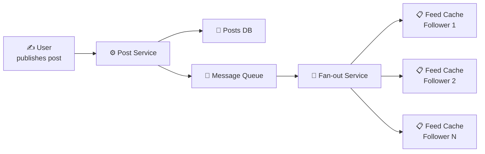
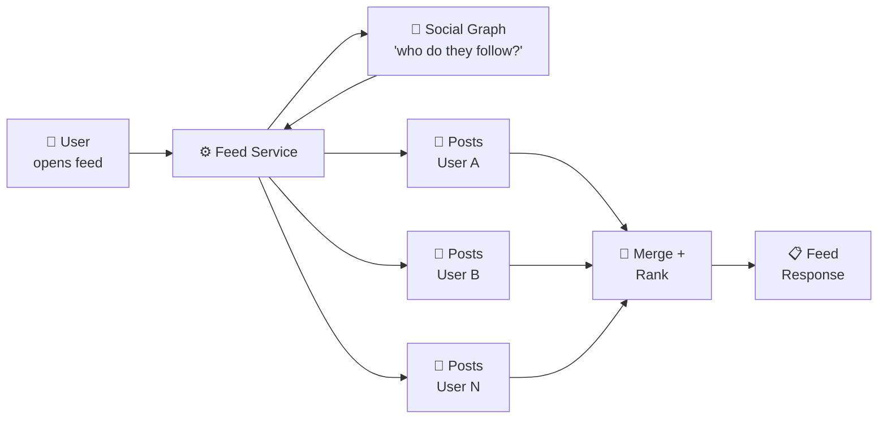
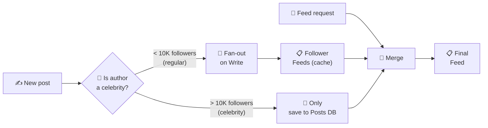
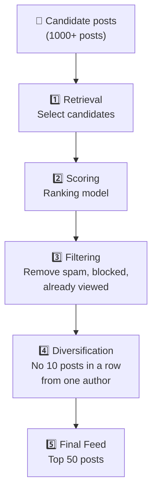
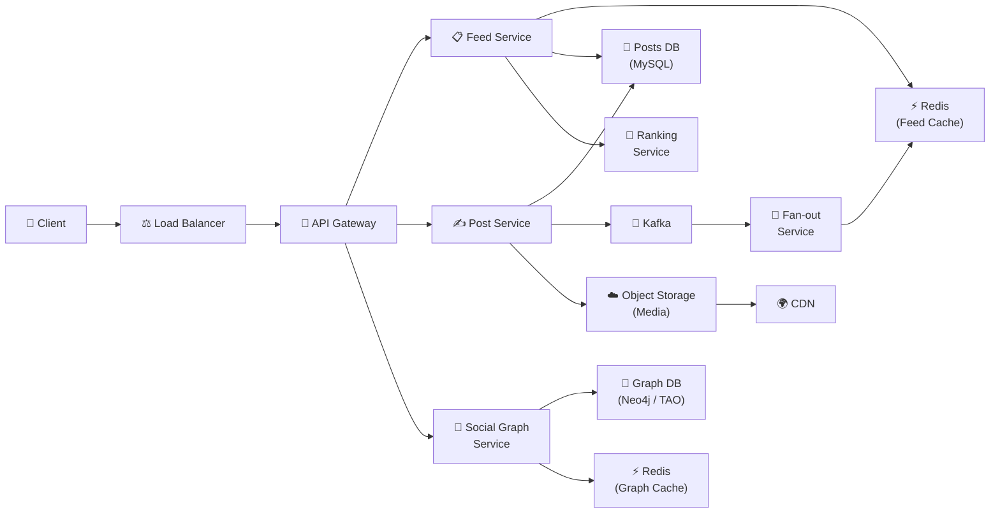

# 🔥 Level 13: Designing a News Feed (Twitter/Instagram)

## 🎯 What is this case about?

News Feed is one of the most масштабable System Design tasks. Twitter processes 500+ million tweets per day, Instagram — billions of feed views. When a user opens the app, they expect to see fresh content from people they follow within fractions of a second. Behind this simplicity lies one of the most complex architectural decisions in the industry.

Analogy: a news feed is like a **personal newspaper that is reprinted for every reader every second**. There are two approaches to publishing it. First — the "push model" (like a newspaper delivery person): a journalist writes an article → the printing press immediately prints a copy for each subscriber and drops it in their mailbox. Second — the "pull model" (like a news aggregator): the reader opens the app → the system runs through all their favorite sources, collects fresh articles, and composes a personalized selection on the fly.

## 📌 Step 1: Requirements

### Functional Requirements (what the system does)

1. **Post publishing** — text, photo, video with metadata
2. **Feed generation** — personalized feed from followed posts
3. **Follow/Unfollow** — subscription management
4. **Chronological and algorithmic sorting** — mode selection
5. **Infinite scroll** — feed pagination on scroll

### Non-Functional Requirements (how the system works)

- **Low latency** — feed loads in < 200 ms
- **Scale** — hundreds of millions of users, billions of posts
- **High availability** — 99.99% uptime
- **Eventual consistency** — a post may appear in followers' feeds with 1-5 sec delay
- **Celebrity problem** — users with 10M+ followers must not create write storms

### Scale estimates (back-of-the-envelope)

```
Users: 500M, DAU: 200M
Average user follows: 300 accounts
Posts per day: 500M
Feed opens per day: 5 × 200M = 1B
Feed read QPS: 1B / 86400 ≈ 12,000 RPS (peak × 3 = 36,000)
Post publish QPS: 500M / 86400 ≈ 6,000 RPS
```

## 🔥 Step 2: Fan-out on Write (Push Model)

On post publish, the system immediately writes it to each follower's feed.



```typescript
// Fan-out on Write: on publish → write to each follower's feed
async function publishPost(authorId: string, content: PostContent) {
  // 1. Save post
  const post = await postsDb.insert({
    postId: generateId(),
    authorId,
    content,
    createdAt: Date.now(),
  })

  // 2. Get follower list
  const followerIds = await socialGraph.getFollowers(authorId)

  // 3. Write postId to each follower's feed
  for (const followerId of followerIds) {
    await redis.lpush(`feed:${followerId}`, post.postId)
    await redis.ltrim(`feed:${followerId}`, 0, 999)  // Store last 1000
  }
}

// Feed read — instant (already prepared)
async function getFeed(userId: string, cursor: number, limit: number) {
  const postIds = await redis.lrange(`feed:${userId}`, cursor, cursor + limit - 1)
  return await postsDb.getByIds(postIds)
}
```

**Pros**: instant reads (O(1) — just read a prepared list), simple pagination.

**Cons**: expensive writes (user with 10M followers = 10M writes per post), memory waste (postId duplicated across millions of feeds), delay in post appearing in feeds.

## 🔥 Step 3: Fan-out on Read (Pull Model)

The feed is assembled "on the fly" on request — the system fetches posts from each followee and merges them.



```typescript
// Fan-out on Read: on feed request — collect posts from follows
async function getFeed(userId: string, cursor: string, limit: number) {
  // 1. Get following list
  const followingIds = await socialGraph.getFollowing(userId)

  // 2. For each followee — get recent posts
  const postsByUser = await Promise.all(
    followingIds.map(id =>
      postsDb.getRecent(id, { after: cursor, limit: 20 })
    )
  )

  // 3. Merge and sort
  const allPosts = postsByUser.flat()
  allPosts.sort((a, b) => b.createdAt - a.createdAt)

  return allPosts.slice(0, limit)
}
```

**Pros**: instant writes (save one post), no write amplification, celebrity-friendly.

**Cons**: slow reads (300 follows → 300 queries + merge), complex pagination, high load on every feed open.

## 🔥 Step 4: Hybrid Approach — the best of both worlds

Twitter and Instagram use a **hybrid model**: push for regular users, pull for "celebrities".



```typescript
const CELEBRITY_THRESHOLD = 10_000  // "Celebrity" threshold

async function publishPost(authorId: string, content: PostContent) {
  const post = await postsDb.insert({ postId: generateId(), authorId, content })

  const followerCount = await socialGraph.getFollowerCount(authorId)

  if (followerCount < CELEBRITY_THRESHOLD) {
    // Regular user — fan-out on write
    await fanoutService.pushToFollowerFeeds(authorId, post.postId)
  }
  // Celebrity — post only in Posts DB, will be pulled on read
}

async function getFeed(userId: string, cursor: string, limit: number) {
  // 1. Ready part of feed (fan-out on write from regular follows)
  const cachedPostIds = await redis.lrange(`feed:${userId}`, 0, 499)
  const cachedPosts = await postsDb.getByIds(cachedPostIds)

  // 2. Posts from celebrities (fan-out on read)
  const celebrityFollowing = await socialGraph.getCelebrityFollowing(userId)
  const celebrityPosts = await Promise.all(
    celebrityFollowing.map(id =>
      postsDb.getRecent(id, { after: cursor, limit: 10 })
    )
  )

  // 3. Merge + rank
  const allPosts = [...cachedPosts, ...celebrityPosts.flat()]
  return rankAndPaginate(allPosts, limit)
}
```

💡 **Why ~10K threshold?** This is a balance: fan-out of 10K writes takes ~100 ms — acceptable. Fan-out of 10M writes — 100 seconds, unacceptable. The exact threshold is tuned based on actual system metrics.

## 📌 Step 5: Social Graph Storage

The social graph is the foundation of the feed. Who follows whom, who blocked whom, who to recommend.

### Data Model

```typescript
// Core entities
interface Follow {
  followerId: string    // Who followed
  followeeId: string    // Who was followed
  createdAt: number
}

interface Block {
  blockerId: string
  blockedId: string
  createdAt: number
}

// Queries:
// 1. Get all followers of user X → WHERE followeeId = X
// 2. Get all following of user X → WHERE followerId = X
// 3. Check: is A following B → WHERE followerId = A AND followeeId = B
// 4. Mutual friends: intersection of followers(A) ∩ followers(B)
```

### Choosing a DB for the social graph

| DB | Suitable? | Why |
|----|-----------|--------|
| **Redis** (adjacency list) | For caches | `SET followers:userA {id1, id2, ...}` — O(1) check, but expensive in memory with millions of connections |
| **MySQL/PostgreSQL** | For small scale | follows table with indexes. JOINs become a bottleneck at 100M+ records |
| **Cassandra** | For storage | Write-optimized, sharded by userId. Poor for "friends of friends" |
| **Neo4j / TAO (Facebook)** | For graph queries | Optimized for traversal: "friends of friends", "follow recommendations" |

### Graph sharding

```typescript
// Strategy: sharding by followeeId
// All followers of a specific user — on one shard
// → "Who follows X?" — one shard
// → "Who does X follow?" — scatter-gather (but this is less frequently needed)

// For hot users (celebrities) — additional Redis cache
// followers:elonmusk → too large SET → split into chunks
// followers:elonmusk:chunk:1, followers:elonmusk:chunk:2, ...
```

## 📌 Step 6: Feed Ranking

### Chronological vs Algorithmic sorting

Chronological sorting (Twitter before 2016, reverse chronological order) — simple, predictable, but users miss important content if they don't visit often.

Algorithmic sorting (Instagram, Facebook, TikTok) — shows "the most interesting", increases engagement, but is unpredictable and causes "filter bubble".



```typescript
// Ranking model (simplified)
interface PostScore {
  postId: string
  score: number
}

function calculateScore(post: Post, viewer: User): number {
  let score = 0

  // Freshness (time decay)
  const ageHours = (Date.now() - post.createdAt) / 3_600_000
  const freshness = 1 / (1 + ageHours * 0.1)  // Exponential decay
  score += freshness * 30

  // Author affinity (how often viewer interacts with author)
  const affinity = getAffinityScore(viewer.id, post.authorId)
  score += affinity * 40

  // Post engagement (likes, comments, shares)
  const engagement = Math.log(1 + post.likes + post.comments * 2 + post.shares * 3)
  score += engagement * 20

  // Content type (video > photo > text for this user)
  const contentPreference = getContentPreference(viewer.id, post.contentType)
  score += contentPreference * 10

  return score
}
```

## 📌 Step 7: Feed Caching

Caching is key to feed performance. Without cache, every feed request requires dozens of DB calls.

```typescript
// Multi-layer cache
// L1: CDN / Edge cache — for static content (images, video)
// L2: Redis — ready feed (postId list)
// L3: Application cache — scored feed (after ranking)
// L4: Database — source of truth

async function getFeedWithCache(userId: string, page: number) {
  const cacheKey = `feed:${userId}:scored`

  // 1. Try scored feed cache
  const cached = await redis.get(cacheKey)
  if (cached) {
    const postIds = JSON.parse(cached)
    const slice = postIds.slice(page * 20, (page + 1) * 20)
    return await getPostsWithMediaCache(slice)
  }

  // 2. Cache miss → build and rank
  const feed = await buildFeed(userId)
  const scored = rankFeed(feed, userId)

  // 3. Cache for 5 minutes
  await redis.setex(cacheKey, 300, JSON.stringify(scored.map(p => p.postId)))

  return scored.slice(page * 20, (page + 1) * 20)
}

// Cache invalidation:
// - New post from followee → prepend to cached feed (don't recalculate everything)
// - Unfollow → remove posts from that author in cache
// - TTL 5 minutes — fallback: even without invalidation, cache will refresh
```

📌 **Important**: the feed cache stores a **list of postId**, not full posts. Full posts are cached separately (`post:{postId}` in Redis). This allows updating a post (edit, delete) in one place.

## 📌 Step 8: Timeline Service — Full Architecture



### Technology Choices

| Component | Technology | Why |
|-----------|------------|--------|
| **Posts DB** | MySQL (sharded) | Structured data, strong consistency for posts |
| **Feed Cache** | Redis Cluster | PostId list per user, O(1) prepend/read |
| **Social Graph** | Neo4j / TAO + Redis cache | Graph queries + fast follow lookup |
| **Message Queue** | Kafka | Partitioned fan-out tasks, exactly-once |
| **Media** | S3 + CDN | Scalable storage + fast delivery |
| **Ranking** | ML model (TensorFlow Serving) | Personalized scoring in real time |

## ⚠️ Common beginner mistakes

### Mistake 1: Fan-out on write for all users without considering celebrities

```
❌ Bad:
// User with 50M followers publishes a post
// Fan-out: 50,000,000 writes in Redis
// Time: 50M / 100K ops/sec = 500 seconds = 8 minutes!
// All followers see the post with 8+ minutes delay
```

```
✅ Good:
// Hybrid: push for regular users, pull for celebrities
// Regular user (500 followers) → fan-out in 5 ms
// Celebrity (50M followers) → post in Posts DB, pulled on read
// Result: everyone sees a fresh feed in < 200 ms
```

### Mistake 2: Storing full post objects in each user's feed

```
❌ Bad:
// Feed — array of full Post objects
feed:user123 = [
  { postId: "1", text: "Hello...", image: "url...", likes: 42, ... },
  { postId: "2", text: "World...", image: "url...", likes: 17, ... },
]
// 500M users × 1000 posts × 1KB = 500 TB in Redis!
// Like update → update post in EVERY feed
```

```
✅ Good:
// Feed — list of postId (8 bytes each)
feed:user123 = ["post_1", "post_2", "post_3", ...]
// Full posts — separate cache: post:post_1 = { ... }
// 500M × 1000 × 8 bytes = 4 TB — an order of magnitude less
// Like update — one write to post:{id}
```

### Mistake 3: Recalculating ranking on every request

```
❌ Bad:
// Every scroll → re-rank 1000 posts
// ML model × 1000 posts × 12000 RPS = 12M inferences/sec
// GPU cost = 💸💸💸
```

```
✅ Good:
// Rank on feed generation, cache scored feed
// On scroll — paginate through the prepared list
// Recalculate: on event (new post) or on TTL (every 5 min)
// Incremental update: insert new post into scored list
```

### Mistake 4: Single shard for "hot" celebrities

```
❌ Bad:
// Social graph sharded by userId
// Elon Musk (50M followers) → one shard stores 50M records
// All "followers of Elon" queries hit one server → hot spot
```

```
✅ Good:
// For hot users — chunk the followers list
// followers:elon:chunk:1 (10K), chunk:2 (10K), ...
// Fan-out service reads chunks in parallel from different shards
// + Redis cache for frequent getFollowers() queries
```

## 🎯 Summary

| Aspect | Solution |
|--------|---------|
| **Fan-out strategy** | Hybrid: push for regular (< 10K followers), pull for celebrities |
| **Feed Cache** | Redis: postId list per user, TTL 5 min, incremental updates |
| **Social Graph** | Graph DB (Neo4j/TAO) + Redis cache, sharded by userId |
| **Ranking** | ML model: freshness (30%) + affinity (40%) + engagement (20%) + content type (10%) |
| **Storage** | Posts in MySQL (sharded), media in S3 + CDN |
| **Pagination** | Cursor-based (postId), not offset-based |
| **Celebrity problem** | Threshold ~10K: below — push, above — pull on read |
| **Cache invalidation** | Incremental (new post → lpush) + TTL fallback |

💡 In interviews, emphasize the **fan-out trade-off** (push vs pull vs hybrid), **celebrity problem** (why you can't push to 50M followers), and **feed ranking pipeline** (how to pick 50 best from 1000 candidates). These are the three key decisions that demonstrate depth of understanding.
