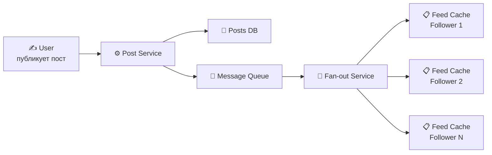
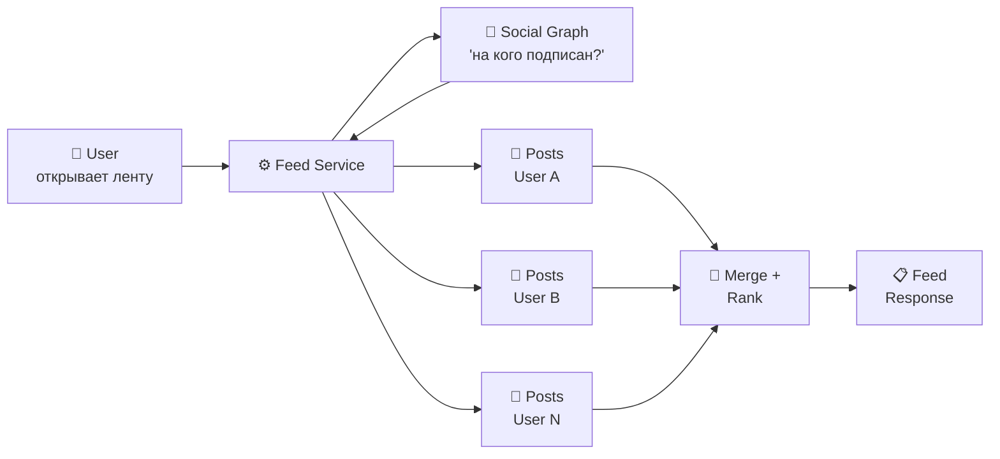
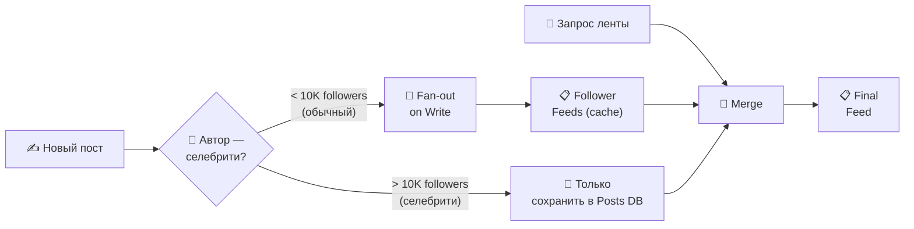
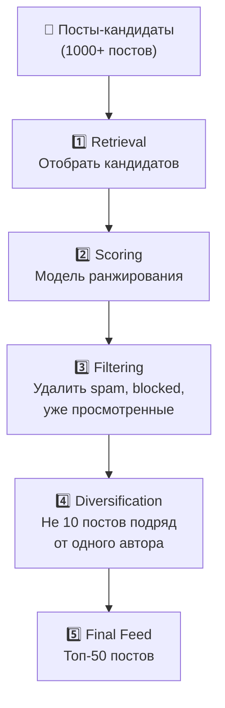
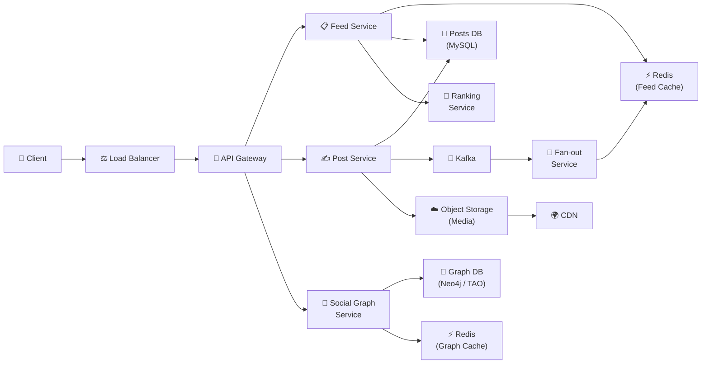

# 🔥 Уровень 13: Проектируем ленту новостей (Twitter/Instagram)

## 🎯 О чём этот кейс?

News Feed — одна из самых масштабных задач System Design. Twitter обрабатывает 500+ миллионов твитов в день, Instagram — миллиарды просмотров ленты. Когда пользователь открывает приложение, он ожидает увидеть свежий контент от людей, на которых подписан, за доли секунды. За этой простотой скрывается одно из самых сложных архитектурных решений в индустрии.

Аналогия: лента новостей — это **персональная газета, которая печатается заново для каждого читателя каждую секунду**. Есть два подхода к её выпуску. Первый — «push-модель» (как разносчик газет): журналист написал статью → типография немедленно печатает копию для каждого подписчика и кладёт в их почтовый ящик. Второй — «pull-модель» (как новостной агрегатор): читатель открывает приложение → система бежит по всем любимым изданиям, собирает свежие статьи и компонует персональную подборку на лету.

## 📌 Шаг 1: Требования

### Functional Requirements (что система делает)

1. **Публикация поста** — текст, фото, видео с metadata
2. **Генерация ленты** — персонализированная лента из постов подписок
3. **Follow/Unfollow** — управление подписками
4. **Хронологическая и алгоритмическая сортировка** — выбор режима
5. **Infinite scroll** — пагинация ленты при прокрутке

### Non-Functional Requirements (как система работает)

- **Низкая задержка** — лента загружается < 200 мс
- **Масштаб** — сотни миллионов пользователей, миллиарды постов
- **Высокая доступность** — 99.99% uptime
- **Eventual consistency** — пост может появиться в лентах подписчиков с задержкой 1-5 сек
- **Celebrity problem** — пользователи с 10M+ подписчиков не должны создавать write storm

### Масштабные оценки (back-of-the-envelope)

```
Пользователей: 500 млн, DAU: 200 млн
Средний пользователь подписан на: 300 аккаунтов
Постов в день: 500 млн
Открытий ленты в день: 5 раз × 200 млн = 1 млрд
QPS чтения ленты: 1 млрд / 86400 ≈ 12 000 RPS (пик × 3 = 36 000)
QPS публикации: 500 млн / 86400 ≈ 6 000 RPS
```

## 🔥 Шаг 2: Fan-out on Write (Push-модель)

При публикации поста система немедленно записывает его в ленту каждого подписчика.



```typescript
// Fan-out on Write: при публикации → записать в ленту каждого подписчика
async function publishPost(authorId: string, content: PostContent) {
  // 1. Сохранить пост
  const post = await postsDb.insert({
    postId: generateId(),
    authorId,
    content,
    createdAt: Date.now(),
  })

  // 2. Получить список подписчиков
  const followerIds = await socialGraph.getFollowers(authorId)

  // 3. Записать postId в ленту каждого подписчика
  for (const followerId of followerIds) {
    await redis.lpush(`feed:${followerId}`, post.postId)
    await redis.ltrim(`feed:${followerId}`, 0, 999)  // Хранить последние 1000
  }
}

// Чтение ленты — мгновенное (уже готова)
async function getFeed(userId: string, cursor: number, limit: number) {
  const postIds = await redis.lrange(`feed:${userId}`, cursor, cursor + limit - 1)
  return await postsDb.getByIds(postIds)
}
```

**Плюсы**: чтение мгновенное (O(1) — просто прочитать готовый список), простая пагинация.

**Минусы**: запись дорогая (user с 10M followers = 10M записей на один пост), расход памяти (дублирование postId в миллионах лент), задержка появления поста в лентах.

## 🔥 Шаг 3: Fan-out on Read (Pull-модель)

Лента собирается «на лету» при запросе — система забирает посты из каждой подписки и merge-ит их.



```typescript
// Fan-out on Read: при запросе ленты — собрать посты из подписок
async function getFeed(userId: string, cursor: string, limit: number) {
  // 1. Получить список подписок
  const followingIds = await socialGraph.getFollowing(userId)

  // 2. Для каждой подписки — получить последние посты
  const postsByUser = await Promise.all(
    followingIds.map(id =>
      postsDb.getRecent(id, { after: cursor, limit: 20 })
    )
  )

  // 3. Merge и отсортировать
  const allPosts = postsByUser.flat()
  allPosts.sort((a, b) => b.createdAt - a.createdAt)

  return allPosts.slice(0, limit)
}
```

**Плюсы**: запись моментальная (сохранить один пост), нет write amplification, celebrity-friendly.

**Минусы**: чтение медленное (если 300 подписок → 300 запросов + merge), сложная пагинация, высокая нагрузка при каждом открытии ленты.

## 🔥 Шаг 4: Hybrid-подход — лучшее из двух миров

Twitter и Instagram используют **гибридную модель**: push для обычных пользователей, pull для «селебрити».



```typescript
const CELEBRITY_THRESHOLD = 10_000  // Порог «селебрити»

async function publishPost(authorId: string, content: PostContent) {
  const post = await postsDb.insert({ postId: generateId(), authorId, content })

  const followerCount = await socialGraph.getFollowerCount(authorId)

  if (followerCount < CELEBRITY_THRESHOLD) {
    // Обычный пользователь — fan-out on write
    await fanoutService.pushToFollowerFeeds(authorId, post.postId)
  }
  // Селебрити — пост только в Posts DB, будет подтянут при чтении
}

async function getFeed(userId: string, cursor: string, limit: number) {
  // 1. Готовая часть ленты (fan-out on write от обычных подписок)
  const cachedPostIds = await redis.lrange(`feed:${userId}`, 0, 499)
  const cachedPosts = await postsDb.getByIds(cachedPostIds)

  // 2. Посты от селебрити (fan-out on read)
  const celebrityFollowing = await socialGraph.getCelebrityFollowing(userId)
  const celebrityPosts = await Promise.all(
    celebrityFollowing.map(id =>
      postsDb.getRecent(id, { after: cursor, limit: 10 })
    )
  )

  // 3. Merge + rank
  const allPosts = [...cachedPosts, ...celebrityPosts.flat()]
  return rankAndPaginate(allPosts, limit)
}
```

💡 **Почему порог ~10K?** Это баланс: fan-out 10K записей занимает ~100 мс — приемлемо. Fan-out 10M записей — 100 секунд, неприемлемо. Точный порог подбирается по метрикам конкретной системы.

## 📌 Шаг 5: Social Graph Storage

Социальный граф — основа ленты. Кто на кого подписан, кто кого заблокировал, кого рекомендовать.

### Data Model

```typescript
// Основные сущности
interface Follow {
  followerId: string    // Кто подписался
  followeeId: string    // На кого подписался
  createdAt: number
}

interface Block {
  blockerId: string
  blockedId: string
  createdAt: number
}

// Запросы:
// 1. Получить всех followers пользователя X → WHERE followeeId = X
// 2. Получить все following пользователя X → WHERE followerId = X
// 3. Проверить: подписан ли A на B → WHERE followerId = A AND followeeId = B
// 4. Mutual friends: пересечение followers(A) ∩ followers(B)
```

### Выбор БД для социального графа

| БД | Подходит? | Почему |
|----|-----------|--------|
| **Redis** (adjacency list) | Для кешей | `SET followers:userA {id1, id2, ...}` — O(1) проверка, но дорого по памяти при миллионах связей |
| **MySQL/PostgreSQL** | Для малого масштаба | Таблица follows с индексами. JOIN-ы становятся узким местом при 100M+ записей |
| **Cassandra** | Для хранения | Write-optimized, шардирование по userId. Плохо для «friends of friends» |
| **Neo4j / TAO (Facebook)** | Для графовых запросов | Оптимизированы для traversal: «друзья друзей», «рекомендации подписок» |

### Шардирование графа

```typescript
// Стратегия: шардирование по followeeId
// Все followers конкретного пользователя — на одном шарде
// → "Кто подписан на X?" — один шард
// → "На кого подписан X?" — scatter-gather (но это реже нужный запрос)

// Для hot users (селебрити) — дополнительный кеш в Redis
// followers:elonmusk → слишком большой SET → разбить на chunks
// followers:elonmusk:chunk:1, followers:elonmusk:chunk:2, ...
```

## 📌 Шаг 6: Feed Ranking

### Хронологическая vs Алгоритмическая сортировка

Хронологическая сортировка (Twitter до 2016, обратный хронологический порядок) — простая, предсказуемая, но пользователь пропускает важное, если не заходит часто.

Алгоритмическая сортировка (Instagram, Facebook, TikTok) — показывает «самое интересное», увеличивает engagement, но непредсказуема и вызывает «filter bubble».



```typescript
// Модель ранжирования (упрощённая)
interface PostScore {
  postId: string
  score: number
}

function calculateScore(post: Post, viewer: User): number {
  let score = 0

  // Свежесть (decay по времени)
  const ageHours = (Date.now() - post.createdAt) / 3_600_000
  const freshness = 1 / (1 + ageHours * 0.1)  // Экспоненциальный decay
  score += freshness * 30

  // Близость автора (как часто viewer взаимодействует с автором)
  const affinity = getAffinityScore(viewer.id, post.authorId)
  score += affinity * 40

  // Engagement поста (лайки, комменты, шеры)
  const engagement = Math.log(1 + post.likes + post.comments * 2 + post.shares * 3)
  score += engagement * 20

  // Тип контента (видео > фото > текст для этого пользователя)
  const contentPreference = getContentPreference(viewer.id, post.contentType)
  score += contentPreference * 10

  return score
}
```

## 📌 Шаг 7: Feed Caching

Кеширование — ключ к производительности ленты. Без кеша каждый запрос ленты требует десятки обращений к БД.

```typescript
// Многослойный кеш
// L1: CDN / Edge cache — для статического контента (изображения, видео)
// L2: Redis — готовая лента (список postId)
// L3: Application cache — scored feed (после ранжирования)
// L4: Database — источник истины

async function getFeedWithCache(userId: string, page: number) {
  const cacheKey = `feed:${userId}:scored`

  // 1. Попробовать кеш scored feed
  const cached = await redis.get(cacheKey)
  if (cached) {
    const postIds = JSON.parse(cached)
    const slice = postIds.slice(page * 20, (page + 1) * 20)
    return await getPostsWithMediaCache(slice)
  }

  // 2. Cache miss → собрать и отранжировать
  const feed = await buildFeed(userId)
  const scored = rankFeed(feed, userId)

  // 3. Закешировать на 5 минут
  await redis.setex(cacheKey, 300, JSON.stringify(scored.map(p => p.postId)))

  return scored.slice(page * 20, (page + 1) * 20)
}

// Инвалидация кеша:
// - Новый пост от подписки → добавить в начало кешированной ленты (не пересчитывать всё)
// - Unfollow → удалить посты этого автора из кеша
// - TTL 5 минут — fallback: даже без инвалидации, кеш обновится
```

📌 **Важно**: кеш ленты — это **список postId**, а не полные посты. Полные посты кешируются отдельно (`post:{postId}` в Redis). Это позволяет обновлять пост (edit, delete) в одном месте.

## 📌 Шаг 8: Timeline Service — полная архитектура



### Выбор технологий

| Компонент | Технология | Почему |
|-----------|------------|--------|
| **Posts DB** | MySQL (sharded) | Structured data, strong consistency для постов |
| **Feed Cache** | Redis Cluster | Список postId per user, O(1) prepend/read |
| **Social Graph** | Neo4j / TAO + Redis cache | Графовые запросы + быстрый lookup подписок |
| **Message Queue** | Kafka | Партиционирование fan-out задач, exactly-once |
| **Media** | S3 + CDN | Масштабируемое хранение + быстрая раздача |
| **Ranking** | ML-модель (TensorFlow Serving) | Персонализированный scoring в реальном времени |

## ⚠️ Частые ошибки новичков

### Ошибка 1: Fan-out on write для всех пользователей без учёта селебрити

```
❌ Плохо:
// Пользователь с 50M подписчиков публикует пост
// Fan-out: 50 000 000 записей в Redis
// Время: 50M / 100K ops/sec = 500 секунд = 8 минут!
// Все подписчики увидят пост с задержкой 8+ минут
```

```
✅ Хорошо:
// Hybrid: push для обычных пользователей, pull для селебрити
// Обычный пользователь (500 followers) → fan-out за 5 мс
// Селебрити (50M followers) → пост в Posts DB, подтягивается при чтении
// Результат: все видят свежую ленту за < 200 мс
```

### Ошибка 2: Хранение полных постов в ленте каждого пользователя

```
❌ Плохо:
// Лента — массив полных объектов Post
feed:user123 = [
  { postId: "1", text: "Hello...", image: "url...", likes: 42, ... },
  { postId: "2", text: "World...", image: "url...", likes: 17, ... },
]
// 500M пользователей × 1000 постов × 1KB = 500 TB в Redis!
// Обновление лайков → обновить пост в КАЖДОЙ ленте
```

```
✅ Хорошо:
// Лента — список postId (8 байт каждый)
feed:user123 = ["post_1", "post_2", "post_3", ...]
// Полные посты — отдельный кеш: post:post_1 = { ... }
// 500M × 1000 × 8 байт = 4 TB — на порядок меньше
// Обновление лайков — одна запись в post:{id}
```

### Ошибка 3: Пересчёт ранжирования при каждом запросе

```
❌ Плохо:
// Каждый scroll → заново ранжировать 1000 постов
// ML-модель × 1000 постов × 12000 RPS = 12M inferences/sec
// Стоимость GPU = 💸💸💸
```

```
✅ Хорошо:
// Ранжировать при генерации ленты, кешировать scored feed
// При scroll — пагинация по готовому списку
// Пересчёт: по событию (новый пост) или по TTL (каждые 5 мин)
// Инкрементальное обновление: вставить новый пост в scored list
```

### Ошибка 4: Один шард для «горячих» селебрити

```
❌ Плохо:
// Шардирование social graph по userId
// Elon Musk (50M followers) → один шард хранит 50M записей
// Все запросы "followers of Elon" идут на один сервер → hot spot
```

```
✅ Хорошо:
// Для горячих пользователей — chunk followers list
// followers:elon:chunk:1 (10K), chunk:2 (10K), ...
// Fan-out service читает chunks параллельно с разных шардов
// + Redis cache для частых запросов getFollowers()
```

## 🎯 Итоги

| Аспект | Решение |
|--------|---------|
| **Fan-out стратегия** | Hybrid: push для обычных (< 10K followers), pull для селебрити |
| **Feed Cache** | Redis: список postId per user, TTL 5 мин, инкрементальное обновление |
| **Social Graph** | Graph DB (Neo4j/TAO) + Redis cache, шардирование по userId |
| **Ranking** | ML-модель: freshness (30%) + affinity (40%) + engagement (20%) + content type (10%) |
| **Storage** | Posts в MySQL (sharded), media в S3 + CDN |
| **Пагинация** | Cursor-based (postId), не offset-based |
| **Celebrity problem** | Порог ~10K: ниже — push, выше — pull при чтении |
| **Инвалидация кеша** | Инкрементально (новый пост → lpush) + TTL fallback |

💡 На интервью акцентируйте внимание на **fan-out trade-off** (push vs pull vs hybrid), **celebrity problem** (почему нельзя push для 50M followers) и **feed ranking pipeline** (как из 1000 кандидатов выбрать 50 лучших). Это три ключевых решения, которые показывают глубину понимания.
