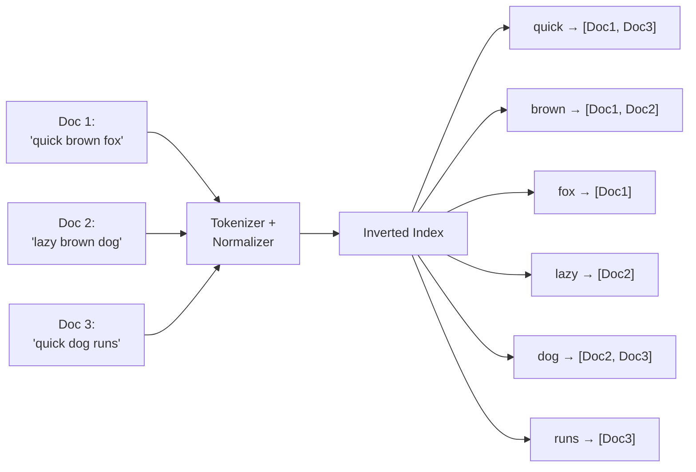
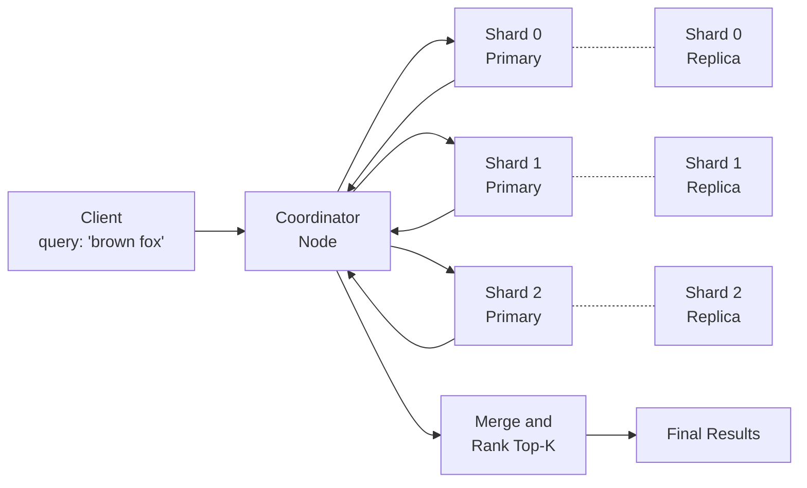
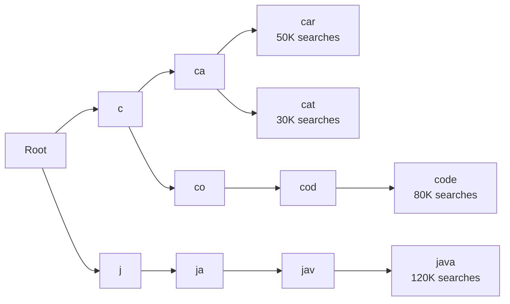
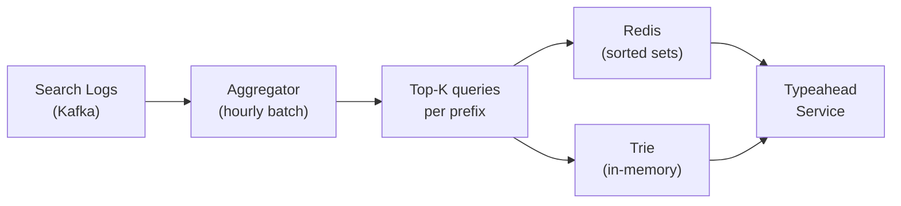

# Level 14: Designing a Search System -- Indexing, Ranking, and Autocomplete

## Introduction

Imagine working in a huge library storing 10 billion books. Every reader comes to the desk and says: "I need all books mentioning 'quantum entanglement'." What does an untrained librarian do? Goes to the first shelf, opens every book, flips through... In a few thousand years, they might answer. A smart librarian compiled an **alphabetical index**: a card catalog where for each word, the numbers of all books containing it are recorded. Query "quantum entanglement" -- look at the card, find a list of 847 books -- go fetch them. Difference: O(N) vs O(1).

This is exactly how a search engine works. An inverted index is that library card catalog, only storing terabytes of data and serving tens of thousands of queries per second. But the catalog only solves "what to find." A search system solves a much harder question: "what to show first."

At this level we'll cover the full architecture of a search system: from how text becomes an index, to how the final result list is formed in 200 milliseconds from billions of documents.

---

## 1. Search System Requirements

### Why Start with Requirements?

Before drawing diagrams and choosing technologies, you need to clearly understand what exactly we're building. A search system for a corporate wiki and a Google-scale search system have fundamentally different architectures. Requirements determine trade-offs.

### Functional Requirements -- What the System Can Do

**Full-text search** -- the basic scenario: user enters a multi-word query, the system returns documents sorted by relevance. Seems simple, but behind it lies an entire pipeline: query tokenization, normalization, index search, ranking.

**Typeahead / Autocomplete** -- suggestions while typing. When you type "how to lea...", Google instantly suggests "how to learn programming." Each typed character generates a query to the system. This is separate infrastructure, because typeahead load is 5-10x higher than main search.

**Faceted search** -- filtering by attributes. On an online store, after entering "laptop," filters appear: "Brand: Apple (42), Lenovo (38)," "Price: up to 50,000 (15)." These aren't just filters -- the system must count documents in each bucket in parallel with the main search.

**Fuzzy matching** -- tolerance for typos. User types "iphon" and finds "iphone." "javscript" -- finds "javascript." Without fuzzy matching, search is practically unusable: people make typos constantly.

**Query parsing** -- handling complex queries. `"react hooks" tutorial -video` should be parsed: mandatory phrase "react hooks", desirable word "tutorial", exclude documents with "video."

### Non-Functional Requirements -- How the System Works

**Low latency (< 200ms p99)** -- the user shouldn't wait. Google research showed: a 100ms latency increase reduces the number of searches by 1%. With billions of queries, these are catastrophic losses.

**Scale: billions of documents, thousands of RPS** -- the system must work horizontally. One server physically can't hold a 10 TB index and process 36,000 queries per second.

**High availability (99.99%)** -- search is a critical function. If search is "down," users can't find content, business loses money. 99.99% -- no more than 52 minutes of downtime per year.

**Near real-time indexing (1-5 seconds)** -- when a seller adds a new product, it should appear in search almost immediately. Indexing delay of hours is unacceptable.

### Scale Estimates -- Back-of-the-Envelope

Before choosing architecture, you need to understand the order of load magnitudes:

```
Documents: 10 billion
Average document size: 5 KB text
Total text volume: 10B × 5KB = 50 TB
Inverted index size: ~20% of text = 10 TB
(index stores only terms and posting lists, not original documents)

Search queries per day: 1 billion
QPS: 1B / 86,400 ≈ 12,000 RPS
Peak load × 3 = 36,000 RPS

Typeahead QPS: × 5 (each character = query)
Typeahead: 36,000 × 5 = 180,000 RPS at peak

New documents per day: 1 million
Write QPS: ~12 documents/second
(modest compared to read, but each document requires indexing)
```

From these numbers, key architectural decisions follow: the index must be distributed across hundreds of servers, typeahead requires separate infrastructure, writing must be asynchronous (through a queue) to not block reading.

---

## 2. Inverted Index -- Search Foundation

### Why "Inverted"?

A normal (forward) index is what we're used to: for each document, a list of its words is stored.

```
Doc 1: ["quick", "brown", "fox"]
Doc 2: ["lazy", "brown", "dog"]
Doc 3: ["quick", "dog", "runs"]
```

This is great for answering "what words are in document 1?" but useless for answering "in which documents does the word 'brown' appear?" -- you need to check every document.

An inverted index flips this structure: the key is a word, the value is a list of documents.

```
"quick":   [Doc1, Doc3]
"brown":   [Doc1, Doc2]
"fox":     [Doc1]
"lazy":    [Doc2]
"dog":     [Doc2, Doc3]
"runs":    [Doc3]
```

Now query "brown dog" -- this is the intersection of two posting lists: {Doc1, Doc2} ∩ {Doc2, Doc3} = {Doc2}. Intersection of two sorted lists is O(N+M), not O(N×M).



### Posting List Structure

In a real system, a posting list contains not just a list of docIds, but additional metadata needed for ranking:

```typescript
interface PostingList {
  docId: string
  termFrequency: number   // How many times the term appears in the document -- needed for TF-IDF
  positions: number[]      // Term positions in the document -- needed for phrase search
  fieldId: number          // Which field: title (0), body (1), tags (2) -- for field boosting
}

interface InvertedIndex {
  [term: string]: PostingList[]
}
```

Positions are important for phrase search. Query "quick brown" -- isn't just two words nearby, but two words where position of "brown" = position of "quick" + 1. Without positions, you'd have to load the document and search for the phrase inside it.

### Index Construction Step by Step

```typescript
function buildIndex(documents: Document[]): InvertedIndex {
  const index: InvertedIndex = {}

  for (const doc of documents) {
    // Step 1: Tokenization -- split text into words
    const tokens = tokenize(doc.text)
    // "Quick brown fox!" → ["Quick", "brown", "fox"]

    // Step 2: Normalization -- convert to lowercase
    const normalized = tokens.map(t => t.toLowerCase())
    // → ["quick", "brown", "fox"]

    // Step 3: Stop words removal -- remove non-significant words
    const filtered = normalized.filter(t => !STOP_WORDS.has(t))
    // STOP_WORDS = {"and", "the", "a", "is"...}

    // Step 4: Stemming -- reduce to word root
    const stems = filtered.map(t => stem(t))
    // "quickly" → "quick", "brown" → "brown", "foxes" → "fox"

    // Step 5: Add to index with positions
    for (let pos = 0; pos < stems.length; pos++) {
      const term = stems[pos]
      if (!index[term]) index[term] = []

      const existing = index[term].find(p => p.docId === doc.id)
      if (existing) {
        existing.termFrequency++
        existing.positions.push(pos)
      } else {
        index[term].push({
          docId: doc.id,
          termFrequency: 1,
          positions: [pos],
          fieldId: 0,
        })
      }
    }
  }

  return index
}
```

Each of these steps is critically important. Skip normalization -- and "JavaScript" and "javascript" become different terms. Skip stemming -- and "running" and "runs" won't find the same documents.

---

## 3. Tokenization and Normalization -- Text Analysis Pipeline

### Why Text Analysis Is More Complex Than It Seems

At first glance, tokenizing seems like just splitting by space. But real text is much more complex:

- "Hello, world!" -- need to remove punctuation
- "New York" -- is this one term or two? (depends on context)
- "C++" -- how to tokenize a programming language?
- "isn't" -- is this "is" + "not" or one token?
- "2024-01-15" -- a date -- is it a token or three numbers?
- Japanese/Chinese text -- no spaces between words

That's why text analysis in Elasticsearch is a configurable pipeline (analyzer) consisting of three parts:

```
Char Filters → Tokenizer → Token Filters
```

**Char Filters** work on raw text before tokenization: remove HTML tags, replace characters (& → and).

**Tokenizer** splits text into tokens: standard -- by space and punctuation.

**Token Filters** process each token: lowercase, stop words, stemming, synonyms.

```typescript
function tokenize(text: string): string[] {
  return text
    .replace(/<[^>]+>/g, ' ')       // Char filter: remove HTML tags
    .toLowerCase()                   // Token filter: lowercase
    .replace(/[^\w\sа-яё]/gi, ' ')  // Remove punctuation (keep letters and digits)
    .split(/\s+/)                    // Tokenizer: split by spaces
    .filter(t => t.length > 1)      // Remove single-letter tokens
    .filter(t => !STOP_WORDS.has(t)) // Token filter: stop words
}

// Stop words -- words present in almost every document that carry no meaning
const STOP_WORDS = new Set([
  // Russian
  'и', 'в', 'на', 'с', 'по', 'к', 'о', 'из', 'за', 'у', 'это', 'не', 'я',
  // English
  'the', 'a', 'an', 'is', 'are', 'was', 'were', 'be', 'been', 'being', 'to', 'of',
])
```

### Stemming vs Lemmatization

**Stemming** works heuristically -- strips endings by rules. Fast, but rough:
- "running" → "run"
- "better" → "better" (not "good")

**Lemmatization** uses a morphological dictionary -- brings to dictionary form. More accurate, but slower:
- "better" → "good"
- "am", "is", "are" → "be"

In production, stemming (Porter Stemmer, Snowball) is more commonly used due to speed. Lemmatization is used where search quality is more critical than indexing speed -- for example, in medical or legal systems.

**Important**: the **same** analyzer must be applied both when indexing documents and when processing search queries. If "running" became "run" during indexing, but the query "runs" wasn't stemmed -- no match will be found.

---

## 4. TF-IDF and BM25 -- Result Ranking

### The Problem: Finding Isn't Enough, You Need to Order Correctly

Imagine searching for "Python tutorial." The inverted index found 50,000 documents containing both words. Which to show first? The one where "python" appears most often? No -- that could be an article "Python everywhere: 100 places where Python is mentioned." The one where words appear in the title? Closer. The one that got the most views and clicks? Even better.

Ranking is both an art and a science. Let's start with the mathematical foundation.

### TF-IDF -- Intuition

TF-IDF consists of two factors:

**Term Frequency (TF)** -- how often a word appears in a given document. If "python" is mentioned 20 times on a page -- it's clearly an article about Python, not a passing mention. But TF shouldn't grow linearly: the difference between 10 and 20 mentions isn't as important as the difference between 1 and 2.

**Inverse Document Frequency (IDF)** -- how rarely a word appears across the entire collection. The word "this" is in every document -- it says nothing about the topic. The word "quantum entanglement" is in 0.001% of documents -- if it's in a document, that's a strong signal. IDF penalizes common words and rewards rare ones.

```typescript
// TF -- term frequency in document (normalized by length)
// termFreq: how many times term appears in document
// docLength: total number of words in document
function tf(termFreq: number, docLength: number): number {
  return termFreq / docLength
}

// IDF -- logarithm of inverse document proportion
// docFreq: how many documents contain the term
// totalDocs: total documents in collection
function idf(docFreq: number, totalDocs: number): number {
  // Logarithm smooths: word in 1 doc vs 10 docs
  // isn't as important as word in 100 vs 1000 docs
  return Math.log(totalDocs / (1 + docFreq))
}

// Final score -- product
function tfidf(
  termFreq: number,
  docLength: number,
  docFreq: number,
  totalDocs: number
): number {
  return tf(termFreq, docLength) * idf(docFreq, totalDocs)
}
```

Analogy: imagine a newspaper editor. If the word "politics" appears 5 times in an article (TF), but it's in all 10,000 articles (IDF near zero) -- it doesn't help understand what the article is specifically about. But the word "impeachment" appears 3 times (moderate TF), but only in 50 articles out of 10,000 (high IDF) -- it's a key word, clearly characterizing the topic.

### BM25 -- Why It's Better Than TF-IDF

TF-IDF has two shortcomings:

1. **TF grows linearly**: if a word appears 100 times instead of 50, the score doubles. But actual relevance barely changes.

2. **Doesn't account for document length**: a long document naturally contains more repetitions of any word. An encyclopedia article of 10,000 words will "win" over a short precise reference simply due to volume.

BM25 (Best Matching 25) solves both shortcomings:

```typescript
// BM25 score for one term in one document
function bm25Score(
  termFreq: number,     // Term frequency in this document
  docLength: number,    // Length of this document (in words)
  avgDocLength: number, // Average document length across entire collection
  docFreq: number,      // How many documents contain the term
  totalDocs: number,    // Total documents
  k1 = 1.2,            // TF saturation coefficient (usually 1.2 - 2.0)
  b = 0.75             // Length normalization coefficient (0 = no normalization, 1 = full)
): number {
  // IDF component (slightly different from classic TF-IDF)
  const idfScore = Math.log(
    (totalDocs - docFreq + 0.5) / (docFreq + 0.5) + 1
  )

  // TF component with saturation
  // With large termFreq the fraction approaches (k1 + 1) -- plateau, not infinity
  // Document length normalization: long document is penalized
  const tfNorm = (termFreq * (k1 + 1)) /
    (termFreq + k1 * (1 - b + b * (docLength / avgDocLength)))

  return idfScore * tfNorm
}
```

Key improvement -- the `k1` parameter. With `k1 = 1.2`:
- termFreq = 1 → tfNorm ≈ 1.0
- termFreq = 5 → tfNorm ≈ 1.8
- termFreq = 10 → tfNorm ≈ 1.95
- termFreq = 100 → tfNorm ≈ 2.18 (almost plateau!)

TF saturates. Further growth in repetitions barely affects the score. This mathematically reflects common sense: if "python" appears 200 times instead of 100 -- the document isn't twice as relevant.

### TF-IDF vs BM25 Comparison

| Criterion | TF-IDF | BM25 |
|----------|--------|------|
| TF saturation | No (linear growth) | Yes (k1 parameter) |
| Length normalization | Partial (TF / docLength) | Flexible (b parameter) |
| Ranking accuracy | Moderate | Significantly higher |
| Used in | Academic research | Elasticsearch, Lucene, Solr |
| Tuning | No parameters | k1 and b (usually 1.2 and 0.75) |

BM25 has been the de-facto standard for full-text search since 1994 and remains competitive even compared with modern ML models for most tasks.

---

## 5. Elasticsearch -- Distributed Search Engine

### What Elasticsearch Is Internally

Elasticsearch is a distributed wrapper over Apache Lucene. Lucene is a Java library implementing inverted index, tokenization, BM25, and much more. One Lucene index is one "shard" in Elasticsearch.

Elasticsearch adds on top of Lucene:
- Horizontal scaling through shards
- Replication for fault tolerance
- REST API
- Cluster management
- Distributed query execution

### Shards and Replicas -- How Elasticsearch Scales



**Shard** -- horizontal partition of the index. A document lands in a shard by formula: `shard = hash(doc_id) % num_shards`. Each shard is a full Lucene index capable of searching independently.

**Replica** -- full copy of a shard. Writes go to primary shard, then replicated. Reads can go to any replica -- this offloads the primary and provides fault tolerance. If the primary goes down, the replica automatically becomes the new primary.

**Shard size rule**: 10-50 GB per shard. Too small shards -- management overhead. Too large -- slow search, complex segment merges.

For our system: 10 TB index / 30 GB = ~300 shards. With replica (×2) = 600 shard copies across the cluster.

### Scatter-Gather -- How Distributed Search Works

When a query arrives, Elasticsearch uses the "scatter-gather" pattern:

```typescript
async function distributedSearch(query: string, topK: number) {
  // Phase 1: SCATTER -- coordinator sends query to ALL shards in parallel
  // Each shard searches its Lucene index and returns top-K (docId + score)
  // IMPORTANT: each shard returns top-K, not all matches
  const shardResults = await Promise.all(
    shards.map(shard => shard.search(query, topK))
  )
  // Result: [[{docId: "1", score: 0.95}, ...], [{docId: "42", score: 0.87}, ...], ...]

  // Phase 2: GATHER -- coordinator merges and ranks
  // From 300 shards × top-10 = 3,000 candidates (manageable)
  const merged = shardResults
    .flat()
    .sort((a, b) => b.score - a.score)
    .slice(0, topK)
  // Now we have global top-10

  // Phase 3: FETCH -- load full documents only for final top
  // Not for 3,000 candidates, but only for 10 winners
  const docs = await fetchDocuments(merged.map(r => r.docId))
  return docs
}
```

This approach is effective precisely because each shard returns only top-K candidates. If shards returned all matches, for a query "the" (which is in 70% of documents) the coordinator would receive billions of records.

### Segment Merge -- Data Lifecycle in Lucene

When documents are added to Lucene, they first go to an in-memory buffer, then are flushed to disk as immutable "segments." Over time, many segments accumulate -- search slows down (each segment needs to be scanned).

Lucene periodically performs **segment merge**: combining several small segments into one large one. This frees deleted documents, reduces the number of segments, speeds up search. The cost -- additional I/O load during merge.

This is why search in Elasticsearch is "near real-time," not real-time: a document appears in search only after the segment is flushed to disk and "opened" for search (the `refresh` operation, by default every second).

---

## 6. Typeahead / Autocomplete -- Search as You Type

### Why This Is a Separate Problem

Typeahead seems like "simple search with a short query." In reality, it's a fundamentally different task:

- **Load**: typeahead generates a query on every typed character. A user types "quantum physics" (16 characters) -- that's 16 queries in a few seconds. Multiply by thousands of simultaneous users.
- **Latency**: acceptable delay for typeahead isn't 200ms, but 10-50ms. Otherwise suggestions "chase" the user and look strange.
- **Data type**: typeahead answers not "find documents" but "complete the prefix." This is a completely different query.

### Trie -- Data Structure for Typeahead

A Trie (prefix tree) is a tree where each path from root to node represents a string (prefix). Lookup in O(L), where L is the prefix length.



Key optimization: each node in the trie stores **precomputed** top-K suggestions for that prefix. Query "ja" -- instantly retrieve from the "ja" node the list: ["java 120K", "javascript 95K", "java tutorial 40K"]. No need to traverse the subtree -- everything is already ready.

```typescript
interface TrieNode {
  children: Map<string, TrieNode>
  suggestions: SearchSuggestion[]  // Precomputed top-K for this prefix
  isEndOfWord: boolean
}

interface SearchSuggestion {
  text: string
  score: number  // Popularity (number of searches in last 7 days)
}

class TypeaheadTrie {
  private root: TrieNode = {
    children: new Map(),
    suggestions: [],
    isEndOfWord: false,
  }

  insert(query: string, score: number) {
    let node = this.root
    for (const char of query.toLowerCase()) {
      if (!node.children.has(char)) {
        node.children.set(char, {
          children: new Map(),
          suggestions: [],
          isEndOfWord: false,
        })
      }
      node = node.children.get(char)!
      // Update suggestions for each node on the path to the word
      // Node "j" knows about "java" and "javascript"
      // Node "ja" also knows about both
      // This is the precomputation
      this.updateTopK(node, query, score)
    }
    node.isEndOfWord = true
  }

  getSuggestions(prefix: string, limit = 5): SearchSuggestion[] {
    let node = this.root
    for (const char of prefix.toLowerCase()) {
      if (!node.children.has(char)) return []  // Prefix not found
      node = node.children.get(char)!
    }
    // O(1) -- suggestions are already ready!
    return node.suggestions.slice(0, limit)
  }

  private updateTopK(node: TrieNode, query: string, score: number) {
    const idx = node.suggestions.findIndex(s => s.text === query)
    if (idx >= 0) {
      node.suggestions[idx].score = score
    } else {
      node.suggestions.push({ text: query, score })
    }
    // Keep sorted top-10
    node.suggestions.sort((a, b) => b.score - a.score)
    node.suggestions = node.suggestions.slice(0, 10)
  }
}
```

### Trie Alternative -- Redis Sorted Sets

In production, trie is often replaced or supplemented by **Redis Sorted Sets**. Each prefix is a key in Redis, value is a sorted set with queries and their score (number of searches).

```
ZADD "prefix:ja" 120000 "java"
ZADD "prefix:ja" 95000 "javascript"
ZADD "prefix:ja" 40000 "java tutorial"

ZREVRANGE "prefix:ja" 0 4  // Get top-5 with highest score
```

Redis sorted sets have O(log N) for insertion and O(log N + K) for range query. At 60,000 RPS typeahead, Redis handles easily: one `ZREVRANGE` operation takes microseconds.

### Updating Suggestions

Query popularity changes: "ChatGPT" suddenly became popular in 2022, "Brexit" -- less relevant. Trie and Redis need updating:



Search logs are collected in Kafka, every hour (or day) an aggregator counts top-K queries for each prefix and updates Redis/Trie. This is a batch process, not real-time: a small delay in updating suggestions is acceptable.

---

## 7. Fuzzy Matching and Query Parsing

### Fuzzy Matching -- Handling Typos

Fuzzy matching finds documents even when the query contains typos. The most common approach is using edit distance (Levenshtein distance).

```typescript
// Levenshtein distance: minimum number of single-character edits
// to transform one string into another
function levenshtein(a: string, b: string): number {
  const matrix: number[][] = Array.from({ length: a.length + 1 }, () =>
    Array(b.length + 1).fill(0)
  )

  for (let i = 0; i <= a.length; i++) matrix[i][0] = i
  for (let j = 0; j <= b.length; j++) matrix[0][j] = j

  for (let i = 1; i <= a.length; i++) {
    for (let j = 1; j <= b.length; j++) {
      const cost = a[i - 1] === b[j - 1] ? 0 : 1
      matrix[i][j] = Math.min(
        matrix[i - 1][j] + 1,      // deletion
        matrix[i][j - 1] + 1,      // insertion
        matrix[i - 1][j - 1] + cost // substitution
      )
    }
  }

  return matrix[a.length][b.length]
}

// "javscript" → "javascript": distance = 1 (missing 'a')
// "iphon" → "iphone": distance = 1 (missing 'e')
```

In Elasticsearch, fuzzy search is enabled with the `fuzziness` parameter:

```json
{
  "query": {
    "match": {
      "title": {
        "query": "javscript",
        "fuzziness": "AUTO"  // Allows 1-2 character edits
      }
    }
  }
}
```

**Performance concern:** fuzzy matching is expensive. It requires checking many candidate terms. In production, limit fuzziness to 1-2 edits and use it only as a fallback after exact matching fails.

### Query Parsing

Complex queries need to be parsed into structured components:

```typescript
// Query: "react hooks" tutorial -video
// Parsed:
{
  must: [{ phrase: "react hooks" }],     // Must contain
  should: [{ term: "tutorial" }],         // Nice to have
  mustNot: [{ term: "video" }]            // Must not contain
}
```

Parsing involves:
1. Extracting quoted phrases
2. Identifying excluded terms (prefixed with `-`)
3. Identifying optional terms
4. Handling field-specific searches (`title:react body:hooks`)

---

## Common Mistakes

### Mistake 1: Using a Database LIKE Query for Search

```sql
-- ❌ Full table scan for every search
SELECT * FROM products WHERE name LIKE '%python%';
```

With millions of products, this is incredibly slow. Use a proper search engine (Elasticsearch) with an inverted index.

### Mistake 2: Not Using the Same Analyzer for Indexing and Searching

If you stem words during indexing but not during searching (or vice versa), matches won't be found. Always use the same analyzer pipeline.

### Mistake 3: Too Many Shards

Creating thousands of small shards creates management overhead. Follow the 10-50 GB per shard rule.

### Mistake 4: Not Handling Typeahead Load Separately

Typeahead generates 5-10x more queries than main search. Always use a separate infrastructure (Trie or Redis Sorted Sets) for autocomplete.

### Mistake 5: Fuzzy Matching on Every Query

Fuzzy matching is expensive. Use it only as a fallback when exact matching returns no results.

---

## Summary

| Component | Key Decision |
|-----------|-------------|
| **Index structure** | Inverted index: term → posting list (docId + frequency + positions) |
| **Text analysis** | Char Filters → Tokenizer → Token Filters (lowercase, stop words, stemming) |
| **Ranking** | BM25 (k1=1.2, b=0.75) -- better than TF-IDF with saturation and length normalization |
| **Distributed search** | Elasticsearch with scatter-gather: each shard returns top-K, coordinator merges |
| **Typeahead** | Trie or Redis Sorted Sets with precomputed top-K per prefix |
| **Fuzzy matching** | Levenshtein distance, use as fallback only, limit to 1-2 edits |
| **Shard size** | 10-50 GB per shard, with replicas |

**Main principle:** search is a pipeline of stages. Each stage transforms the query or results: text analysis creates terms, the inverted index finds candidates, BM25 ranks them, and scatter-gather distributes the work across the cluster. Optimize each stage independently, and use the right tool for each sub-problem (Elasticsearch for full-text, Trie/Redis for typeahead).
