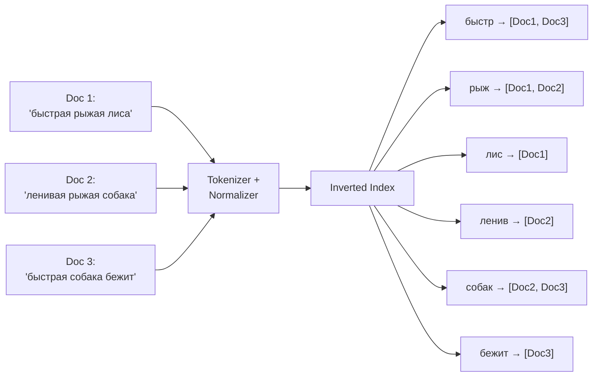
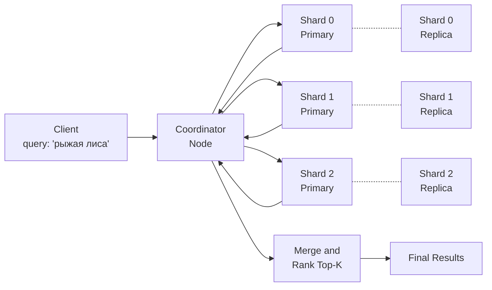
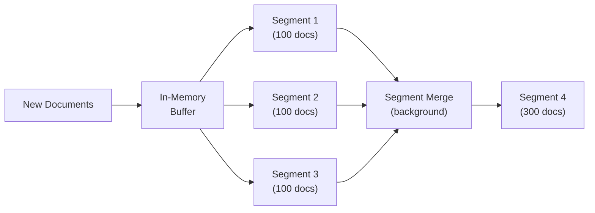
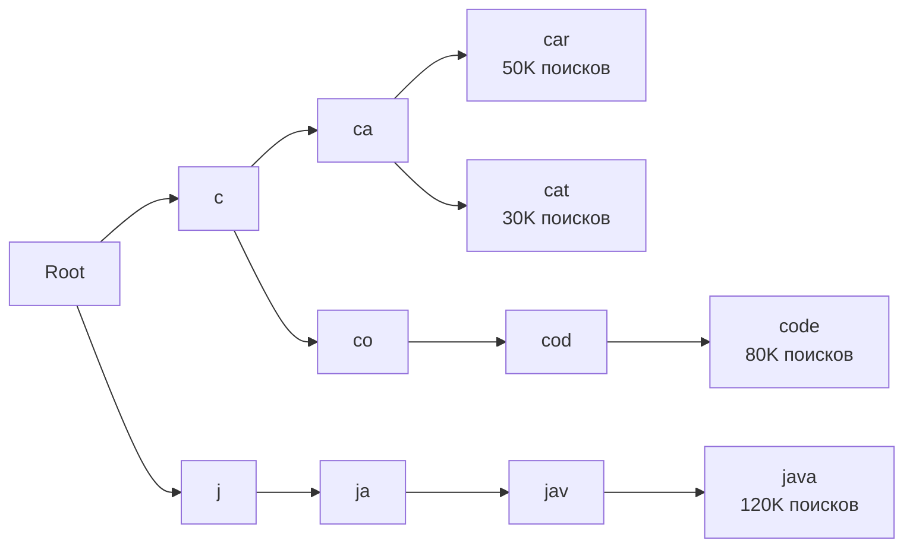
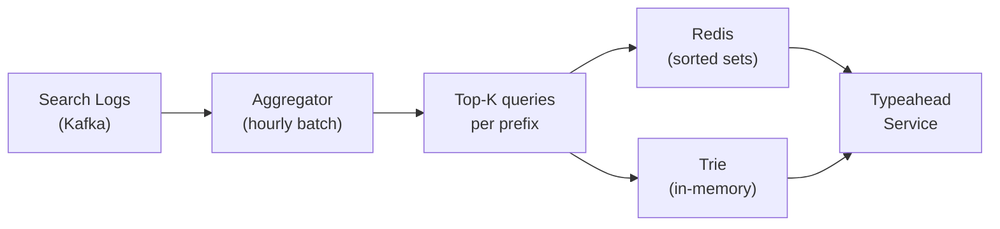
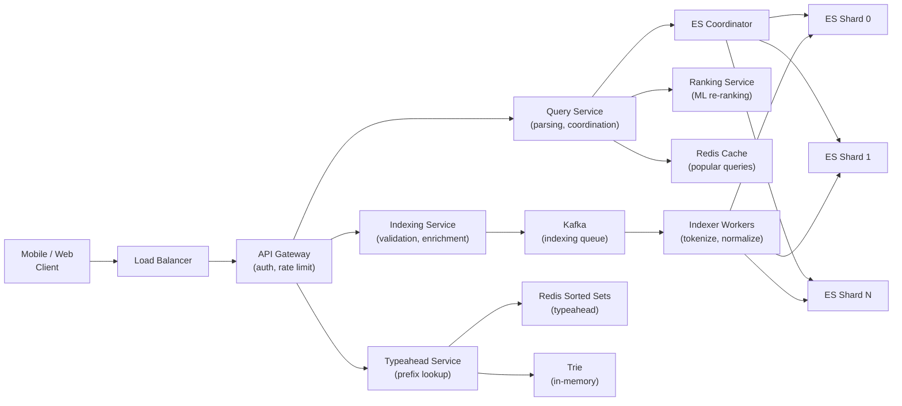
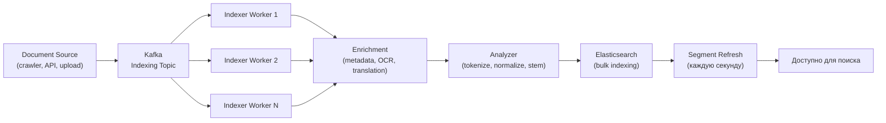

# Уровень 14: Проектируем поисковую систему -- индексация, ранжирование и автодополнение

## Введение

Представьте, что вы работаете в огромной библиотеке, где хранится 10 миллиардов книг. Каждый читатель подходит к стойке и говорит: «Мне нужны все книги, где упоминается слово "квантовая запутанность"». Что делает необученный библиотекарь? Идёт с первой полки, открывает каждую книгу, листает... Через несколько тысяч лет он, возможно, ответит. Умный библиотекарь составил **алфавитный указатель**: картотеку, в которой для каждого слова записаны номера всех книг, где оно встречается. Запрос «квантовая запутанность» -- смотри карточку, находишь список из 847 книг -- идёшь их выдавать. Разница: O(N) против O(1).

Именно так работает поисковая система. Inverted index -- это и есть та библиотечная картотека, только хранящая терабайты данных и обслуживающая десятки тысяч запросов в секунду. Но картотека решает лишь вопрос «что найти». Поисковая система решает куда более сложный вопрос: «что показать первым».

На этом уровне мы разберём полную архитектуру поисковой системы: от того, как текст превращается в индекс, до того, как финальный список результатов формируется за 200 миллисекунд из миллиардов документов.

---

## 1. Требования к поисковой системе

### Зачем начинать с требований?

Прежде чем рисовать диаграммы и выбирать технологии, нужно чётко понять, что именно мы строим. Поисковая система для корпоративного wiki и поисковая система масштаба Google имеют принципиально разную архитектуру. Требования определяют компромиссы.

### Functional Requirements -- что система умеет делать

**Full-text search** -- базовый сценарий: пользователь вводит запрос из нескольких слов, система возвращает документы, отсортированные по релевантности. Казалось бы просто, но за этим стоит целый конвейер: токенизация запроса, нормализация, поиск по индексу, ранжирование.

**Typeahead / Autocomplete** -- подсказки при вводе. Когда вы пишете «как нау...», Google мгновенно предлагает «как научиться программировать». Каждый введённый символ порождает запрос к системе. Это отдельная инфраструктура, потому что нагрузка typeahead в 5-10 раз выше основного поиска.

**Faceted search** -- фильтрация по атрибутам. На сайте интернет-магазина после ввода «ноутбук» появляются фильтры: «Бренд: Apple (42), Lenovo (38)», «Цена: до 50 000 (15)». Это не просто фильтры -- система должна подсчитать количество документов в каждом бакете параллельно с основным поиском.

**Fuzzy matching** -- толерантность к опечаткам. Пользователь пишет «iphon» и находит «iphone». «javscript» -- находит «javascript». Без fuzzy matching поиск на практике использовать сложно: люди делают опечатки постоянно.

**Query parsing** -- обработка сложных запросов. «"react hooks" tutorial -video» должно быть разобрано: обязательная фраза «react hooks», желательное слово «tutorial», исключить документы со словом «video».

### Non-Functional Requirements -- как система работает

**Низкая задержка (< 200 мс p99)** -- пользователь не должен ждать. Исследования Google показали: рост latency на 100 мс снижает количество поисков на 1%. При миллиардах запросов это катастрофические потери.

**Масштаб: миллиарды документов, тысячи RPS** -- система должна работать горизонтально. Один сервер физически не вместит 10 ТБ индекса и не обработает 36 000 запросов в секунду.

**Высокая доступность (99.99%)** -- поиск -- это критическая функция. Если поиск «упал», пользователи не могут найти контент, бизнес теряет деньги. 99.99% -- это не более 52 минут даунтайма в год.

**Near real-time indexing (1-5 секунд)** -- когда продавец добавляет новый товар, он должен появиться в поиске почти сразу. Задержка индексации в часы недопустима.

### Масштабные оценки -- back-of-the-envelope

Прежде чем выбирать архитектуру, нужно понять порядок величин нагрузки:

```
Документов: 10 млрд
Средний размер документа: 5 KB текста
Общий объём текста: 10B × 5KB = 50 TB
Размер inverted index: ~20% от текста = 10 TB
(index хранит только термы и posting lists, не оригинальные документы)

Поисковых запросов в день: 1 млрд
QPS: 1B / 86400 ≈ 12 000 RPS
Пиковая нагрузка × 3 = 36 000 RPS

Typeahead QPS: × 5 (каждый символ = запрос)
Typeahead: 36 000 × 5 = 180 000 RPS в пике

Новых документов в день: 1 млн
Write QPS: ~12 документов/секунду
(скромно по сравнению с read, но каждый документ требует индексации)
```

Из этих чисел следуют ключевые архитектурные решения: индекс должен быть распределён по сотням серверов, typeahead требует отдельной инфраструктуры, запись должна быть асинхронной (через очередь), чтобы не блокировать чтение.

---

## 2. Inverted Index -- основа поиска

### Почему «inverted»?

Обычный (forward) индекс -- это то, к чему мы привыкли: для каждого документа хранится список его слов.

```
Doc 1: ["быстрая", "рыжая", "лиса"]
Doc 2: ["ленивая", "рыжая", "собака"]
Doc 3: ["быстрая", "собака", "бежит"]
```

Это отлично для ответа на вопрос «какие слова в документе 1?», но бесполезно для ответа на «в каких документах есть слово "рыжая"?» -- нужно проверять каждый документ.

Inverted index переворачивает эту структуру: ключ -- слово, значение -- список документов.

```
"быстрая": [Doc1, Doc3]
"рыжая":   [Doc1, Doc2]
"лиса":    [Doc1]
"ленивая": [Doc2]
"собака":  [Doc2, Doc3]
"бежит":   [Doc3]
```

Теперь запрос «рыжая собака» -- это пересечение двух posting lists: {Doc1, Doc2} ∩ {Doc2, Doc3} = {Doc2}. Операция пересечения двух отсортированных списков -- O(N+M), а не O(N×M).



### Структура posting list

В реальной системе posting list содержит не просто список docId, но и дополнительные метаданные, необходимые для ранжирования:

```typescript
interface PostingList {
  docId: string
  termFrequency: number   // Сколько раз term встречается в документе -- нужно для TF-IDF
  positions: number[]      // Позиции термина в документе -- нужно для фразового поиска
  fieldId: number          // В каком поле: title (0), body (1), tags (2) -- для field boosting
}

interface InvertedIndex {
  [term: string]: PostingList[]
}
```

Позиции важны для фразового поиска. Запрос «"быстрая рыжая"» -- это не просто два слова рядом, а два слова, где позиция «рыжая» = позиция «быстрая» + 1. Без positions пришлось бы загружать документ и искать фразу внутри него.

### Построение индекса шаг за шагом

```typescript
function buildIndex(documents: Document[]): InvertedIndex {
  const index: InvertedIndex = {}

  for (const doc of documents) {
    // Шаг 1: Tokenization -- разбить текст на слова
    const tokens = tokenize(doc.text)
    // "Быстрая рыжая лиса!" → ["Быстрая", "рыжая", "лиса"]

    // Шаг 2: Normalization -- привести к нижнему регистру
    const normalized = tokens.map(t => t.toLowerCase())
    // → ["быстрая", "рыжая", "лиса"]

    // Шаг 3: Stop words removal -- убрать незначащие слова
    const filtered = normalized.filter(t => !STOP_WORDS.has(t))
    // STOP_WORDS = {"и", "в", "на", "the", "a", "is"...}

    // Шаг 4: Stemming -- привести к корню слова
    const stems = filtered.map(t => stem(t))
    // "быстрая" → "быстр", "рыжая" → "рыж", "лиса" → "лис"

    // Шаг 5: Добавить в индекс с позициями
    for (let pos = 0; pos < stems.length; pos++) {
      const term = stems[pos]
      if (!index[term]) index[term] = []

      const existing = index[term].find(p => p.docId === doc.id)
      if (existing) {
        existing.termFrequency++
        existing.positions.push(pos)
      } else {
        index[term].push({
          docId: doc.id,
          termFrequency: 1,
          positions: [pos],
          fieldId: 0,
        })
      }
    }
  }

  return index
}
```

Каждый из этих шагов критически важен. Пропустить нормализацию -- и «JavaScript» и «javascript» будут разными термами. Пропустить stemming -- и «бегущий» и «бежит» не найдут одни и те же документы.

---

## 3. Токенизация и нормализация -- конвейер анализа текста

### Почему анализ текста сложнее, чем кажется

На первый взгляд кажется, что tokenize -- это просто split по пробелу. Но реальный текст намного сложнее:

- «Hello, world!» -- нужно убрать знаки препинания
- «New York» -- это один терм или два? (зависит от контекста)
- «C++» -- как токенизировать язык программирования?
- «isn't» -- это «is» + «not» или один токен?
- «2024-01-15» -- дата -- это токен или три числа?
- Японский/китайский текст -- нет пробелов между словами

Поэтому анализ текста в Elasticsearch -- это настраиваемый конвейер (analyzer), состоящий из трёх частей:

```
Char Filters → Tokenizer → Token Filters
```

**Char Filters** работают над сырым текстом до токенизации: убирают HTML-теги, заменяют символы (& → and).

**Tokenizer** разбивает текст на токены: стандартный -- по пробелу и пунктуации.

**Token Filters** обрабатывают каждый токен: lowercase, stop words, stemming, synonyms.

```typescript
function tokenize(text: string): string[] {
  return text
    .replace(/<[^>]+>/g, ' ')       // Char filter: убрать HTML-теги
    .toLowerCase()                   // Token filter: нижний регистр
    .replace(/[^\w\sа-яё]/gi, ' ')  // Убрать пунктуацию (сохранить буквы и цифры)
    .split(/\s+/)                    // Tokenizer: разбить по пробелам
    .filter(t => t.length > 1)      // Убрать однобуквенные токены
    .filter(t => !STOP_WORDS.has(t)) // Token filter: стоп-слова
}

// Стоп-слова -- слова, которые есть почти в каждом документе и не несут смысла
const STOP_WORDS = new Set([
  // Русские
  'и', 'в', 'на', 'с', 'по', 'к', 'о', 'из', 'за', 'у', 'это', 'не', 'я',
  // Английские
  'the', 'a', 'an', 'is', 'are', 'was', 'were', 'be', 'been', 'being', 'to', 'of',
])
```

### Stemming vs Lemmatization

**Stemming** работает эвристически -- обрезает окончания по правилам. Быстро, но грубо:
- «бегущий» → «бег»
- «бежит» → «бежит» (алгоритм не всегда справляется)
- «running» → «run»
- «better» → «better» (не «good»)

**Lemmatization** использует морфологический словарь -- приводит к словарной форме. Точнее, но медленнее:
- «бегущий» → «бегать»
- «better» → «good»
- «am», «is», «are» → «be»

В production чаще используют stemming (Porter Stemmer, Snowball) из-за скорости. Lemmatization применяют там, где качество поиска критичнее скорости индексации -- например, в медицинских или юридических системах.

```typescript
// Простой пример алгоритма Портера для английского
function porterStem(word: string): string {
  // Правило: слова, оканчивающиеся на -ing, убираем -ing
  // running → runn → run (+ восстановление двойной согласной)
  if (word.endsWith('ing') && word.length > 5) {
    return word.slice(0, -3)
  }
  // Правило: -tion → заменяем на корень
  if (word.endsWith('tion') && word.length > 6) {
    return word.slice(0, -4)
  }
  // ... ещё десятки правил
  return word
}
```

💡 **Важно**: и при индексации документов, и при обработке поискового запроса должен применяться **одинаковый** анализатор. Если при индексации «бегущий» стал «бег», а запрос «бегать» не прошёл через stemmer -- совпадения не будет.

---

## 4. TF-IDF и BM25 -- ранжирование результатов

### Проблема: найти недостаточно, нужно правильно упорядочить

Представьте: вы ищете «Python tutorial». Inverted index нашёл 50 000 документов, где есть оба слова. Какой показать первым? Тот, где «python» встречается чаще всего? Нет -- это может быть статья «Python везде: 100 мест, где упоминается Python». Тот, где слова встречаются в заголовке? Ближе. Тот, который набрал больше всего просмотров и кликов? Ещё лучше.

Ранжирование -- это искусство и наука одновременно. Начнём с математической основы.

### TF-IDF -- интуиция

TF-IDF состоит из двух факторов:

**Term Frequency (TF)** -- как часто слово встречается в данном документе. Если «python» упоминается 20 раз на странице -- это явно статья о Python, а не упоминание вскользь. Но TF не должен расти линейно: разница между 10 и 20 упоминаниями не так важна, как разница между 1 и 2.

**Inverse Document Frequency (IDF)** -- насколько редко слово встречается во всей коллекции. Слово «это» есть в каждом документе -- оно ничего не говорит о теме. Слово «квантовая запутанность» есть в 0.001% документов -- если оно в документе есть, это сильный сигнал. IDF наказывает частые слова и награждает редкие.

```typescript
// TF -- частота термина в документе (нормализованная на длину)
// termFreq: сколько раз term встречается в документе
// docLength: общее количество слов в документе
function tf(termFreq: number, docLength: number): number {
  return termFreq / docLength
}

// IDF -- логарифм от обратной доли документов с термином
// docFreq: в скольких документах встречается term
// totalDocs: всего документов в коллекции
function idf(docFreq: number, totalDocs: number): number {
  // Логарифм сглаживает: слово в 1 документе vs 10 документах
  // не так важно, как слово в 100 vs 1000 документах
  return Math.log(totalDocs / (1 + docFreq))
}

// Итоговый score -- произведение
function tfidf(
  termFreq: number,
  docLength: number,
  docFreq: number,
  totalDocs: number
): number {
  return tf(termFreq, docLength) * idf(docFreq, totalDocs)
}
```

Аналогия: представьте газетного редактора. Если слово «политика» встречается в статье 5 раз (TF), но оно есть во всех 10 000 статей (IDF близок к нулю) -- это не помогает понять, о чём именно статья. А слово «импичмент» встречается 3 раза (умеренный TF), но лишь в 50 статьях из 10 000 (высокий IDF) -- это ключевое слово, чётко характеризующее тему.

### BM25 -- почему он лучше TF-IDF

TF-IDF имеет два недостатка:

1. **TF растёт линейно**: если слово встречается 100 раз вместо 50, score удваивается. Но реальная релевантность почти не меняется.

2. **Не учитывает длину документа**: длинный документ естественно содержит больше повторений любого слова. Энциклопедическая статья на 10 000 слов «выиграет» у короткой точной справки просто за счёт объёма.

BM25 (Best Matching 25) решает оба недостатка:

```typescript
// BM25 score для одного term в одном документе
function bm25Score(
  termFreq: number,     // Частота term в данном документе
  docLength: number,    // Длина данного документа (в словах)
  avgDocLength: number, // Средняя длина документа по всей коллекции
  docFreq: number,      // В скольких документах встречается term
  totalDocs: number,    // Всего документов
  k1 = 1.2,            // Коэффициент насыщения TF (обычно 1.2 - 2.0)
  b = 0.75             // Коэффициент нормализации длины (0 = нет нормализации, 1 = полная)
): number {
  // IDF-компонент (немного отличается от классического TF-IDF)
  const idfScore = Math.log(
    (totalDocs - docFreq + 0.5) / (docFreq + 0.5) + 1
  )

  // TF-компонент с насыщением
  // При большом termFreq дробь стремится к (k1 + 1) -- плато, а не бесконечность
  // Нормализация на длину документа: длинный документ штрафуется
  const tfNorm = (termFreq * (k1 + 1)) /
    (termFreq + k1 * (1 - b + b * (docLength / avgDocLength)))

  return idfScore * tfNorm
}
```

Ключевое улучшение -- параметр `k1`. При `k1 = 1.2`:
- termFreq = 1 → tfNorm ≈ 1.0
- termFreq = 5 → tfNorm ≈ 1.8
- termFreq = 10 → tfNorm ≈ 1.95
- termFreq = 100 → tfNorm ≈ 2.18 (почти плато!)

TF насыщается. Дальнейший рост повторений почти не влияет на score. Это математически отражает здравый смысл: если «python» встречается 200 раз вместо 100 -- документ не стал вдвое более релевантным.

### Сравнение TF-IDF и BM25

| Критерий | TF-IDF | BM25 |
|----------|--------|------|
| Насыщение TF | Нет (линейный рост) | Да (параметр k1) |
| Нормализация длины | Частично (TF / docLength) | Гибкая (параметр b) |
| Точность ранжирования | Умеренная | Значительно выше |
| Используется в | Академических исследованиях | Elasticsearch, Lucene, Solr |
| Настройка | Нет параметров | k1 и b (обычно 1.2 и 0.75) |

BM25 является стандартом де-факто для full-text search с 1994 года и до сих пор остаётся конкурентоспособным даже в сравнении с современными ML-моделями для большинства задач.

---

## 5. Elasticsearch -- распределённый поисковый движок

### Что такое Elasticsearch изнутри

Elasticsearch -- это распределённая обёртка над Apache Lucene. Lucene -- это Java-библиотека, реализующая inverted index, токенизацию, BM25 и многое другое. Один Lucene index -- это один «шард» в Elasticsearch.

Elasticsearch добавляет поверх Lucene:
- Горизонтальное масштабирование через шарды
- Репликацию для отказоустойчивости
- REST API
- Cluster management
- Distributed query execution

### Shards и Replicas -- как Elasticsearch масштабируется



**Shard** -- горизонтальный раздел индекса. Документ попадает в шард по формуле: `shard = hash(doc_id) % num_shards`. Каждый шард -- полноценный Lucene index, способный выполнять поиск независимо.

**Replica** -- полная копия шарда. Записи идут на primary shard, затем реплицируются. Чтение может идти на любую реплику -- это разгружает primary и даёт отказоустойчивость. Если primary упал, replica автоматически становится новым primary.

📌 **Правило выбора размера шарда**: 10-50 ГБ на шард. Слишком маленькие шарды -- overhead на управление. Слишком большие -- медленный поиск, сложные segment merge.

Для нашей системы: 10 ТБ индекса / 30 ГБ = ~300 шардов. С репликой (×2) = 600 shard copies по кластеру.

### Scatter-Gather -- как работает распределённый поиск

Когда приходит запрос, Elasticsearch использует паттерн «scatter-gather» (рассеять и собрать):

```typescript
async function distributedSearch(query: string, topK: number) {
  // Фаза 1: SCATTER -- coordinator отправляет запрос на ВСЕ шарды параллельно
  // Каждый шард ищет в своём Lucene index и возвращает top-K (docId + score)
  // ВАЖНО: каждый шард возвращает top-K, а не все совпадения
  const shardResults = await Promise.all(
    shards.map(shard => shard.search(query, topK))
  )
  // Результат: [[{docId: "1", score: 0.95}, ...], [{docId: "42", score: 0.87}, ...], ...]

  // Фаза 2: GATHER -- coordinator объединяет и ранжирует
  // Из 300 шардов × top-10 = 3000 кандидатов (управляемо)
  const merged = shardResults
    .flat()
    .sort((a, b) => b.score - a.score)
    .slice(0, topK)
  // Теперь у нас глобальный top-10

  // Фаза 3: FETCH -- загрузить полные документы только для финального топа
  // Не для 3000 кандидатов, а только для 10 победителей
  const docs = await fetchDocuments(merged.map(r => r.docId))
  return docs
}
```

📌 Этот подход эффективен именно потому, что каждый шард возвращает только top-K кандидатов. Если бы шарды возвращали все совпадения, при запросе «the» (который есть в 70% документов) coordinator получил бы миллиарды записей.

### Segment merge -- жизненный цикл данных в Lucene

Когда документы добавляются в Lucene, они сначала попадают в in-memory буфер, затем сбрасываются на диск как неизменяемые «сегменты». Со временем сегментов накапливается много -- поиск замедляется (нужно просматривать каждый сегмент).

Lucene периодически выполняет **segment merge**: объединяет несколько маленьких сегментов в один большой. Это освобождает удалённые документы, уменьшает число сегментов, ускоряет поиск. Цена -- дополнительная I/O нагрузка во время merge.



Именно поэтому поиск в Elasticsearch «near real-time», а не real-time: документ появляется в поиске только после того, как сегмент сброшен на диск и «открыт» для поиска (операция `refresh`, по умолчанию каждую секунду).

---

## 6. Typeahead / Autocomplete -- поиск по мере ввода

### Почему это отдельная проблема

Typeahead кажется «простым поиском с коротким запросом». На самом деле это принципиально другая задача:

- **Нагрузка**: typeahead генерирует запрос на каждый введённый символ. Пользователь набирает «квантовая физика» (18 символов) -- это 18 запросов за несколько секунд. Умножьте на тысячи одновременных пользователей.
- **Latency**: допустимая задержка для typeahead -- не 200 мс, а 10-50 мс. Иначе подсказки «догоняют» за пользователем и выглядят странно.
- **Тип данных**: typeahead отвечает не на «найди документы», а на «продолжи префикс». Это совершенно другой запрос.

### Trie -- структура данных для typeahead

Trie (prefix tree, «нагруженное дерево») -- это дерево, где каждый путь от корня к узлу представляет собой строку (префикс). Lookup за O(L), где L -- длина префикса.



Ключевая оптимизация: в каждом узле trie хранятся **предвычисленные** top-K подсказок для данного префикса. Запрос «ja» -- мгновенно достаём из узла «ja» список: [«java 120K», «javascript 95K», «java tutorial 40K»]. Не нужно обходить поддерево -- всё уже готово.

```typescript
interface TrieNode {
  children: Map<string, TrieNode>
  suggestions: SearchSuggestion[]  // Предвычисленные top-K для этого префикса
  isEndOfWord: boolean
}

interface SearchSuggestion {
  text: string
  score: number  // Популярность (количество поисков за последние 7 дней)
}

class TypeaheadTrie {
  private root: TrieNode = {
    children: new Map(),
    suggestions: [],
    isEndOfWord: false,
  }

  insert(query: string, score: number) {
    let node = this.root
    for (const char of query.toLowerCase()) {
      if (!node.children.has(char)) {
        node.children.set(char, {
          children: new Map(),
          suggestions: [],
          isEndOfWord: false,
        })
      }
      node = node.children.get(char)!
      // Обновляем suggestions для каждого узла на пути к слову
      // Узел "j" знает про "java" и "javascript"
      // Узел "ja" тоже знает про оба
      // Это и есть предвычисление
      this.updateTopK(node, query, score)
    }
    node.isEndOfWord = true
  }

  getSuggestions(prefix: string, limit = 5): SearchSuggestion[] {
    let node = this.root
    for (const char of prefix.toLowerCase()) {
      if (!node.children.has(char)) return []  // Префикс не найден
      node = node.children.get(char)!
    }
    // O(1) -- suggestions уже готовы!
    return node.suggestions.slice(0, limit)
  }

  private updateTopK(node: TrieNode, query: string, score: number) {
    const idx = node.suggestions.findIndex(s => s.text === query)
    if (idx >= 0) {
      node.suggestions[idx].score = score
    } else {
      node.suggestions.push({ text: query, score })
    }
    // Держим отсортированный top-10
    node.suggestions.sort((a, b) => b.score - a.score)
    node.suggestions = node.suggestions.slice(0, 10)
  }
}
```

### Альтернатива Trie -- Redis Sorted Sets

В production trie часто заменяют или дополняют **Redis Sorted Sets**. Каждый префикс -- ключ в Redis, значение -- sorted set с запросами и их score (количество поисков).

```
ZADD "prefix:ja" 120000 "java"
ZADD "prefix:ja" 95000 "javascript"
ZADD "prefix:ja" 40000 "java tutorial"

ZREVRANGE "prefix:ja" 0 4  // Получить top-5 с самым высоким score
```

Redis sorted sets имеют O(log N) для вставки и O(log N + K) для range query. При 60 000 RPS typeahead Redis легко справляется: одна операция `ZREVRANGE` занимает микросекунды.

### Обновление подсказок

Популярность запросов меняется: «ChatGPT» в 2022 году внезапно стал популярным, «Brexit» -- менее актуален. Trie и Redis нужно обновлять:



Логи поисков собираются в Kafka, раз в час (или в день) агрегатор считает top-K запросов для каждого префикса и обновляет Redis/Trie. Это batch-процесс, не real-time: небольшая задержка в обновлении подсказок приемлема.

---

## 7. Fuzzy Matching и Query Parsing

### Fuzzy Matching -- когда пользователь ошибается

Исследования показывают: в 10-15% поисковых запросов есть опечатки. Игнорировать их -- терять 10-15% пользователей. Fuzzy matching позволяет найти «iphone», даже если пользователь написал «iphon» или «ihpone».

**Расстояние Левенштейна** -- количество элементарных операций (вставка, удаление, замена символа), необходимых для преобразования одной строки в другую:

```typescript
// «iphon» → «iphone»: 1 операция (вставить 'e') = расстояние 1
// «javscript» → «javascript»: 1 операция (вставить 'a') = расстояние 1
// «pytohn» → «python»: 2 операции (переставить 'o' и 'h') = расстояние 2
function levenshtein(a: string, b: string): number {
  // matrix[i][j] = расстояние между a[0..i] и b[0..j]
  const matrix: number[][] = []

  for (let i = 0; i <= a.length; i++) matrix[i] = [i]
  for (let j = 0; j <= b.length; j++) matrix[0][j] = j

  for (let i = 1; i <= a.length; i++) {
    for (let j = 1; j <= b.length; j++) {
      const cost = a[i - 1] === b[j - 1] ? 0 : 1
      matrix[i][j] = Math.min(
        matrix[i - 1][j] + 1,       // Удаление из a
        matrix[i][j - 1] + 1,       // Вставка в a
        matrix[i - 1][j - 1] + cost  // Замена (cost=0, если символы совпадают)
      )
    }
  }

  return matrix[a.length][b.length]
}
```

В Elasticsearch fuzzy matching настраивается параметром `fuzziness`:

```typescript
// Elasticsearch запрос с fuzzy matching
const esQuery = {
  query: {
    match: {
      title: {
        query: "javscript",
        fuzziness: "AUTO",  // Автоматически выбирает допустимое расстояние:
        // Длина < 3: только точное совпадение (расстояние 0)
        // Длина 3-5: расстояние 1
        // Длина > 5: расстояние 2
      }
    }
  }
}
// "javscript" (9 символов) → fuzziness=2 → найдёт "javascript"
```

⚠️ Fuzzy matching дорого стоит: нужно проверить расстояние до потенциально тысяч термов в индексе. Elasticsearch использует **BK-деревья** (Burkhard-Keller trees) для быстрого поиска термов с ограниченным расстоянием. Не включайте fuzziness для коротких (< 3 символов) запросов -- иначе результаты будут нерелевантными.

### Query Parsing -- структурирование запроса

Пользовательский ввод -- это неструктурированная строка. Query parser преобразует её в структурированный запрос, который можно выполнить.

```typescript
// Входная строка: '"react hooks" tutorial -video lang:en'
// Ожидаемый результат:
// - Обязательная фраза: "react hooks"
// - Желательное слово: tutorial
// - Исключить: video
// - Фильтр по полю: lang = "en"

interface BoolQuery {
  must: TermQuery[]     // Все обязательны (AND)
  should: TermQuery[]   // Хотя бы один желателен (OR, влияет на score)
  mustNot: TermQuery[]  // Ни один не должен совпадать
  filter: FilterQuery[] // Применяются без влияния на score (быстро!)
}

function parseQuery(input: string): BoolQuery {
  const query: BoolQuery = { must: [], should: [], mustNot: [], filter: [] }

  // 1. Извлечь фразы в кавычках → must phrase
  const phrases = [...input.matchAll(/"([^"]+)"/g)]
  phrases.forEach(m => query.must.push({ type: 'phrase', value: m[1] }))
  let remaining = input.replace(/"[^"]+"/g, '').trim()

  // 2. Извлечь field:value → filter (не влияет на ranking)
  const fieldFilters = [...remaining.matchAll(/(\w+):(\w+)/g)]
  fieldFilters.forEach(m => query.filter.push({ field: m[1], value: m[2] }))
  remaining = remaining.replace(/\w+:\w+/g, '').trim()

  // 3. Извлечь исключения (-word) → mustNot
  const excluded = [...remaining.matchAll(/-(\w+)/g)]
  excluded.forEach(m => query.mustNot.push({ type: 'term', value: m[1] }))
  remaining = remaining.replace(/-\w+/g, '').trim()

  // 4. Остальные слова → should (OR с минимальным порогом совпадений)
  remaining.split(/\s+/).filter(Boolean).forEach(t =>
    query.should.push({ type: 'term', value: t })
  )

  return query
}
```

📌 Разница между `must` и `filter` в Elasticsearch важна для производительности. `filter` не вычисляет BM25 score -- он просто отбирает документы по точному совпадению. Elasticsearch кэширует результаты filter queries, что делает их намного быстрее для повторных запросов.

---

## 8. Faceted Search и финальное ранжирование

### Faceted Search -- больше чем фильтры

Faceted search -- это одновременное выполнение основного запроса и агрегаций по атрибутам. Пользователь ищет «смартфон», и система возвращает:
- Список результатов (отранжированных)
- Бренды с количеством: Apple (42), Samsung (38), Xiaomi (21)
- Диапазоны цен: до 20K (15), 20K-50K (28), от 50K (19)
- Рейтинг: 4+ звезды (65), 3+ звезды (84)

Все эти числа считаются в одном запросе за счёт **aggregations** в Elasticsearch:

```typescript
// Elasticsearch запрос с facets (aggregations)
const esQuery = {
  query: {
    bool: {
      must: [{ match: { name: "смартфон" } }],
      filter: [
        // Уже выбранные фильтры (например, пользователь нажал "Apple")
        // { term: { brand: "Apple" } }
      ]
    }
  },
  aggs: {
    // Facet по бренду
    brands: {
      terms: { field: "brand.keyword", size: 10 }
    },
    // Facet по диапазонам цен
    price_ranges: {
      range: {
        field: "price",
        ranges: [
          { key: "budget", to: 20000 },
          { key: "mid", from: 20000, to: 50000 },
          { key: "premium", from: 50000 }
        ]
      }
    },
    // Facet по рейтингу
    min_rating: {
      histogram: {
        field: "rating",
        interval: 1,
        min_doc_count: 1
      }
    }
  },
  size: 20  // Основной результат: 20 документов
}
```

⚠️ **Ловушка**: aggregations по полю `brand` требуют поля `brand.keyword` (не analyzed строка). Analyzed поле разбивается на токены («Apple Inc» → «apple», «inc»), и агрегация по токенам, а не по оригинальным значениям, бессмысленна.

### Финальный ranking pipeline

BM25 -- это только начало. В реальной системе финальный score формируется из нескольких факторов:

```typescript
function calculateFinalScore(
  doc: Document,
  query: ParsedQuery,
  user: User,
  context: RequestContext
): number {
  // 1. Textual relevance (BM25) -- основа ранжирования
  let score = bm25(doc, query.terms)

  // 2. Field boosting -- совпадение в заголовке ценнее, чем в тексте
  if (doc.titleMatches(query)) score *= 2.0
  if (doc.tagsMatch(query)) score *= 1.5

  // 3. Popularity boost -- популярные документы поднимаем
  // Логарифм сглаживает: разница между 100K и 200K просмотров не так важна
  score *= 1 + Math.log(1 + doc.viewCount) * 0.1

  // 4. Freshness boost -- актуально для новостей, не для учебников
  if (context.requiresFreshness) {
    const ageHours = (Date.now() - doc.createdAt) / 3_600_000
    score *= Math.exp(-0.01 * ageHours)  // Экспоненциальный decay
  }

  // 5. Personalization -- учитываем историю пользователя
  if (user.preferences.includes(doc.category)) score *= 1.2
  if (user.recentlyViewed.includes(doc.id)) score *= 0.5  // Уже видел -- понижаем

  // 6. Quality signals -- структура документа как сигнал качества
  if (doc.hasImages) score *= 1.05
  if (doc.wordCount > 300 && doc.wordCount < 5000) score *= 1.1  // Не слишком короткий и не слишком длинный

  // 7. Business rules (не всегда уместны, но бывают)
  if (doc.isPremium && user.isPremiumUser) score *= 1.3

  return score
}
```


На последнем этапе -- ML-based re-ranking. Learning-to-Rank (LTR) -- это класс алгоритмов, которые обучаются на данных о кликах и конверсиях (какие результаты пользователи выбрали). LambdaMART и BERT-based модели на этом шаге корректируют score на основе сотен признаков документа и запроса.

---

## 9. Полная архитектура и выбор технологий

### Две плоскости: indexing и querying

Поисковая система имеет две принципиально разные плоскости:

**Indexing pipeline** (запись): документ поступает → нормализуется → индексируется в Elasticsearch. Это асинхронный процесс через очередь. Прямая запись в ES от миллионов клиентов создаёт back-pressure.

**Query pipeline** (чтение): пользователь вводит запрос → Query Service парсит → распределяет по шардам ES → Ranking Service формирует финальный список. Это синхронный путь с жёстким требованием к latency.



### Выбор технологий и обоснование

| Компонент | Технология | Обоснование |
|-----------|------------|-------------|
| **Search Engine** | Elasticsearch / OpenSearch | Inverted index, BM25, distributed search, aggregations -- всё из коробки |
| **Message Queue** | Apache Kafka | Буферизация перед индексацией, exactly-once semantics, replay при сбоях |
| **Typeahead Store** | Redis Sorted Sets + Trie in memory | ZREVRANGE < 1 мс, Trie позволяет обходиться без сети вообще |
| **Query Cache** | Redis / Memcached | Популярные запросы кешируются -- 80% трафика на 20% запросов (правило Парето) |
| **ML Ranking** | LambdaMART / BERT | Learning-to-Rank на данных кликов, BERT для семантического поиска |
| **Document Store** | Amazon S3 / HDFS | Хранение оригинальных документов отдельно от индекса |
| **Analytics** | ClickHouse / Apache Druid | Анализ поисковых логов: CTR, zero-result queries, latency |
| **Monitoring** | Elasticsearch + Kibana | Встроенный стек, можно мониторить сам ES через ES |

### Как работает near real-time индексация



Kafka между источником и индексерами даёт: буферизацию пиков нагрузки, возможность переиграть события (replay), изоляцию -- если ES перегружен, источник не замедляется.

---

## 10. Частые ошибки при проектировании поисковой системы

### Ошибка 1: хранить оригинальные документы в Elasticsearch

❌ **Плохо:**
```
// Загружать полные HTML-страницы (100KB+) в Elasticsearch
// 10B документов × 100KB = 1 PB в ES
// ES тратит ресурсы на хранение blob-ов вместо индексирования
// Backup и восстановление ES становятся катастрофой
// Миграция данных -- часы или дни
```

✅ **Хорошо:**
```typescript
// В Elasticsearch -- только searchable fields и метаданные
interface ESDocument {
  id: string
  title: string           // Для поиска и отображения
  body: string            // Для поиска (первые 10K символов)
  tags: string[]
  category: string
  author: string
  created_at: string
  url: string             // Ссылка на оригинал в S3
  // НЕТ: rawHtml, fullContent, attachments
}

// Оригинал -- в S3
// s3://my-search/documents/{doc_id}.html

// Результат: индекс 10 TB вместо 1 PB
// ES работает быстро, S3 хранит дёшево
```

Elasticsearch оптимизирован для поиска, а не для хранения больших объектов. Используйте S3 или HDFS для хранения, ES -- только для индексирования.

### Ошибка 2: не шардировать или шардировать неверно

❌ **Плохо:**
```
// Один шард на весь индекс:
// - Один сервер не вместит 10 TB
// - Нет параллелизма при поиске
// - Segment merge занимает часы

// Слишком много маленьких шардов (10000 шардов по 1 MB):
// - Огромный overhead на управление
// - Coordinator тратит время на координацию тысяч шардов
// - Elasticsearch начинает тормозить из-за overhead
```

✅ **Хорошо:**
```
// Правило: 1 шард = 10-50 GB
// 10 TB / 30 GB = ~300 primary shards
// + 1 replica = 600 shard copies
// Поиск параллельно по 300 шардам -- быстро и масштабируемо
//
// Важно: количество primary shards задаётся при создании индекса
// и не меняется без переиндексации. Планируйте заранее.
//
// Правило для replicas: production всегда минимум 1 replica
// Для read-heavy -- 2 replicas (разгрузка чтения)
```

### Ошибка 3: запускать typeahead через основной поиск

❌ **Плохо:**
```typescript
// Каждый символ → полноценный search query в Elasticsearch
async function typeahead(prefix: string) {
  return elasticsearchClient.search({
    query: { prefix: { title: prefix } }  // Дорогой prefix query
  })
}
// При 180 000 RPS typeahead: ES кластер перегружен
// Основной поиск деградирует из-за конкуренции за ресурсы
```

✅ **Хорошо:**
```typescript
// Отдельный typeahead service с Redis
async function typeahead(prefix: string) {
  const cacheKey = `prefix:${prefix.toLowerCase()}`
  // O(log N + K) в Redis -- микросекунды
  const suggestions = await redis.zrevrange(cacheKey, 0, 4, 'WITHSCORES')
  return parseSuggestions(suggestions)
}
// Latency: < 5 мс
// Нагрузка на основной ES: 0
// Обновление: батч раз в час из search logs
```

### Ошибка 4: забыть про анализ запроса

❌ **Плохо:**
```typescript
// Поиск запроса «как есть» без нормализации
const results = await search("Бегущий Человек")
// Ищет точно "Бегущий" и "Человек" с заглавной
// Документ с "бегущий человек" -- не найден
// Документ с "бежит человек" -- не найден
// Результаты: 0 или нерелевантные
```

✅ **Хорошо:**
```typescript
// Применяем тот же анализатор к запросу, что и к документам
function analyzeQuery(input: string): string[] {
  return input
    .toLowerCase()             // "бегущий человек"
    .split(/\s+/)
    .filter(t => !STOP_WORDS.has(t))
    .map(t => stem(t))         // ["бег", "человек"]
}
// Теперь находим "бежит человека", "бегал человек" и т.д.
```

### Ошибка 5: игнорировать zero-result queries

❌ **Плохо:**
```
// Пользователь ищет "iPhon 15 Pro Max"
// После fuzzy matching и stemming: нет результатов
// Возвращаем пустую страницу
// Пользователь уходит
```

✅ **Хорошо:**
```typescript
async function searchWithFallback(query: string) {
  // Попытка 1: точный поиск
  let results = await search(query, { fuzziness: 0 })

  // Попытка 2: fuzzy поиск
  if (results.total === 0) {
    results = await search(query, { fuzziness: 'AUTO' })
  }

  // Попытка 3: поиск по частям запроса (minimum_should_match)
  if (results.total === 0) {
    results = await search(query, {
      minimumShouldMatch: '50%'  // Хотя бы половина слов совпадает
    })
  }

  // Попытка 4: поиск похожих/популярных запросов
  if (results.total === 0) {
    results = await getRelatedQueries(query)
  }

  // Логировать zero-result queries -- это сигнал о пробелах в контенте
  if (results.total === 0) {
    await logZeroResultQuery(query)
  }

  return results
}
```

Zero-result queries нужно мониторить: это сигнал, что в системе нет нужного контента, или анализатор настроен неверно, или пользователи используют незнакомую терминологию.

---

## Итоги

Поисковая система -- это не один компонент, а тщательно спроектированный конвейер из нескольких специализированных систем, каждая из которых решает свою задачу:

| Аспект | Решение | Почему |
|--------|---------|--------|
| **Основная структура** | Inverted index: term → posting list (docId, TF, positions) | O(1) lookup + пересечение posting lists вместо full scan |
| **Анализ текста** | Tokenization → Stop words → Stemming | Одинаковый анализатор для индексации и поиска -- обязательно |
| **Ранжирование** | BM25 + popularity + freshness + ML re-ranking | BM25 -- основа, ML -- финальная точность |
| **Масштабирование** | Elasticsearch: shards (10-50 GB) + replicas | Параллельный поиск, отказоустойчивость |
| **Распределённый поиск** | Scatter-gather: coordinator → все шарды → top-K | Каждый шард возвращает top-K, не все результаты |
| **Typeahead** | Redis Sorted Sets + Trie, обновление батчами | Отдельный сервис: < 5 мс, не нагружает ES |
| **Fuzzy matching** | Расстояние Левенштейна, fuzziness=AUTO в ES | Автоматический порог: длина < 3 → 0, 3-5 → 1, > 5 → 2 |
| **Faceted search** | ES aggregations параллельно с основным запросом | Один запрос = результаты + facets |
| **Индексация** | Kafka → Indexer Workers → Elasticsearch | Буферизация, асинхронность, изоляция плоскостей |
| **Хранение** | Searchable fields в ES, оригиналы в S3 | ES оптимизирован для поиска, S3 -- для хранения |
| **Query cache** | Redis для популярных запросов | 80% трафика -- 20% уникальных запросов |

💡 На интервью по System Design для поисковой системы нужно уверенно объяснить четыре ключевых решения:

1. **Inverted index** -- почему он быстрее full scan, что такое posting list, как строится
2. **BM25 vs TF-IDF** -- насыщение TF, нормализация длины, почему BM25 лучше
3. **Scatter-gather** -- как coordinator распределяет запрос по шардам и собирает top-K
4. **Typeahead как отдельный сервис** -- почему нельзя использовать основной ES, как устроен Trie с предвычисленными suggestions

Эти четыре концепции показывают, что вы понимаете не только «что», но и «почему» -- что отличает сильного кандидата от кандидата, просто знакомого с Elasticsearch.
