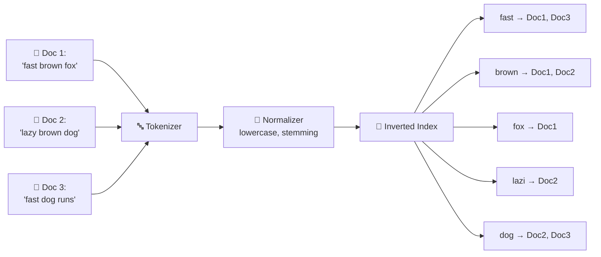
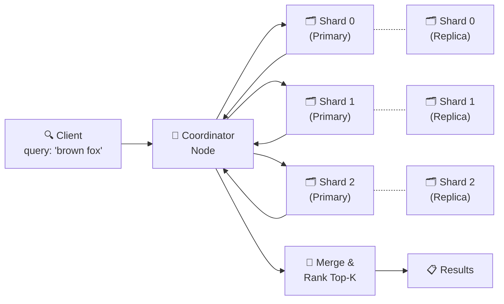
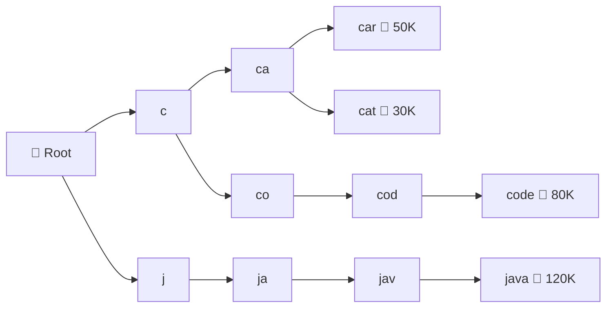
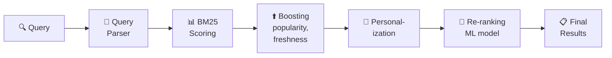
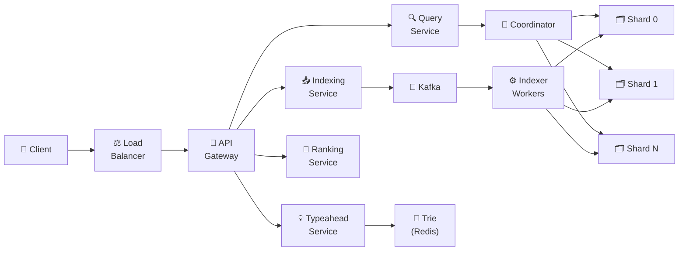

# 🔥 Level 14: Designing a Search Engine

## 🎯 What is this case about?

A search engine is the heart of any large service. Google processes 8.5 billion queries per day. Elasticsearch indexes petabytes of data across thousands of companies. When a user enters a query, they expect relevant results in fractions of a second. Behind this instant response lies an entire pipeline: from query parsing to ranking millions of documents.

Analogy: imagine a **book's alphabetical index at the back**. Instead of flipping through all 500 pages looking for the word "index", you open the index, find "index — p. 42, 78, 156" and jump directly. An inverted index works the same way: for each word, it stores a list of documents where it appears. Without an index, search is O(N) across all pages. With an index — O(1) lookup + O(K) results.

## 📌 Step 1: Requirements

### Functional Requirements (what the system does)

1. **Full-text search** — searching document text with relevance ranking
2. **Typeahead / Autocomplete** — real-time query suggestions as the user types
3. **Faceted search** — filtering results by categories (price, brand, rating)
4. **Fuzzy matching** — tolerance for typos ("iphon" → "iphone")
5. **Query parsing** — handling complex queries (AND, OR, quoted phrases)

### Non-Functional Requirements (how the system works)

- **Low latency** — results in < 200 ms (p99)
- **Scale** — billions of documents, thousands of queries per second
- **High availability** — 99.99% uptime, search must not "go down"
- **Near real-time indexing** — a new document appears in search within 1-5 seconds
- **Consistency** — a deleted document must not appear in results

### Scale estimates (back-of-the-envelope)

```
Documents: 10B
Average document size: 5 KB text
Total text volume: 10B × 5KB = 50 TB
Inverted index size: ~20% of text = 10 TB
Search queries per day: 1B
QPS: 1B / 86400 ≈ 12,000 RPS (peak × 3 = 36,000)
Typeahead QPS: × 5 (each character = a query) = 60,000 RPS
```

## 🔥 Step 2: Inverted Index — the foundation of search

An inverted index flips the familiar "document → words" structure into "word → documents".



### How an inverted index is built

```typescript
interface PostingList {
  docId: string
  termFrequency: number   // How many times the term appears in the document
  positions: number[]      // Positions of the term in the document (for phrase search)
}

interface InvertedIndex {
  [term: string]: PostingList[]
}

// Building the index
function buildIndex(documents: Document[]): InvertedIndex {
  const index: InvertedIndex = {}

  for (const doc of documents) {
    // 1. Tokenization — split text into words
    const tokens = tokenize(doc.text)  // "fast brown fox" → ["fast", "brown", "fox"]

    // 2. Normalization — convert to lowercase
    const normalized = tokens.map(t => t.toLowerCase())

    // 3. Stemming — reduce to word root
    const stems = normalized.map(t => stem(t))  // "running" → "run"

    // 4. Add to index
    for (let pos = 0; pos < stems.length; pos++) {
      const term = stems[pos]
      if (!index[term]) index[term] = []

      const existing = index[term].find(p => p.docId === doc.id)
      if (existing) {
        existing.termFrequency++
        existing.positions.push(pos)
      } else {
        index[term].push({ docId: doc.id, termFrequency: 1, positions: [pos] })
      }
    }
  }

  return index
}
```

### Tokenization and Stemming

**Tokenization** — breaking text into individual terms (words):

```typescript
function tokenize(text: string): string[] {
  return text
    .toLowerCase()
    .replace(/[^\w\sа-яё]/gi, '')  // Remove punctuation
    .split(/\s+/)                    // Split by whitespace
    .filter(t => t.length > 0)
    .filter(t => !STOP_WORDS.has(t)) // Remove stop words: "and", "the", "a", "in"
}
```

**Stemming** — reducing words to their root: "running", "runs", "ran" → "run". This allows finding documents by any word form.

💡 **Lemmatization** — a more precise analog of stemming: considers language morphology. Stemming is faster, lemmatization is more accurate.

## 🔥 Step 3: TF-IDF and BM25 — ranking results

Finding documents is only half the job. You need to show the **most relevant** ones first.

### TF-IDF (Term Frequency — Inverse Document Frequency)

```typescript
// TF — how often a term appears in a document
// The more often — the more relevant (but with saturation)
function tf(termFreq: number, docLength: number): number {
  return termFreq / docLength
}

// IDF — how rare a term is across the entire collection
// Rare words are more valuable: "quantum" is worth more than "big"
function idf(docFreq: number, totalDocs: number): number {
  return Math.log(totalDocs / (1 + docFreq))
}

// TF-IDF = TF × IDF
function tfidf(termFreq: number, docLength: number, docFreq: number, totalDocs: number): number {
  return tf(termFreq, docLength) * idf(docFreq, totalDocs)
}
```

Analogy: if the word "JavaScript" appears 10 times in an article (high TF), but it's in 80% of all documents (low IDF), its weight is small — too generic. But if "monad" appears 3 times (medium TF) and only in 0.1% of documents (high IDF) — that's a strong relevance signal.

### BM25 — improved TF-IDF

BM25 (Best Matching 25) — the ranking standard in Elasticsearch and Lucene. Key improvements:

```typescript
// BM25 score for one term
function bm25Score(
  termFreq: number,     // Term frequency in document
  docLength: number,    // Document length (in words)
  avgDocLength: number, // Average document length
  docFreq: number,      // How many documents contain the term
  totalDocs: number,    // Total documents
  k1 = 1.2,            // TF saturation coefficient
  b = 0.75             // Length normalization coefficient
): number {
  const idfScore = Math.log((totalDocs - docFreq + 0.5) / (docFreq + 0.5) + 1)
  const tfNorm = (termFreq * (k1 + 1)) /
    (termFreq + k1 * (1 - b + b * (docLength / avgDocLength)))
  return idfScore * tfNorm
}
```

💡 **Key BM25 difference**: TF has "saturation" — after a certain frequency, further repetitions barely increase the score. This is logical: if a word appeared 100 times vs 200 times, the relevance difference is minimal.

## 📌 Step 4: Elasticsearch — distributed search

Elasticsearch is the most popular full-text search engine. Inside — Apache Lucene, wrapped in a distributed layer.

### Shards and Replicas



**Shard** — a horizontal partition of the index. Documents are distributed across shards (usually by hash(doc_id) % num_shards). Each shard is an independent Lucene index.

**Replica** — a copy of a shard for fault tolerance and read load distribution. Writes go to primary, reads can go to any replica.

### How distributed search works (Scatter-Gather)

```typescript
// Phase 1: Query (scatter)
// Coordinator sends query to ALL shards
// Each shard returns top-K results (docId + score)

// Phase 2: Fetch (gather)
// Coordinator merges results from all shards
// Selects global top-K
// Fetches full documents only for final results

async function distributedSearch(query: string, topK: number) {
  // Scatter: parallel queries to all shards
  const shardResults = await Promise.all(
    shards.map(shard => shard.search(query, topK))
  )

  // Gather: merge and final ranking
  const merged = shardResults
    .flat()
    .sort((a, b) => b.score - a.score)
    .slice(0, topK)

  // Fetch: get full documents
  const docs = await fetchDocuments(merged.map(r => r.docId))
  return docs
}
```

📌 **Important**: each shard returns top-K, not all results. With 1000 shards and K=10, the coordinator processes 10,000 candidates — manageable. If shards returned all matches (millions), the coordinator would be overwhelmed.

## 📌 Step 5: Typeahead / Autocomplete

When the user types "how to lea...", the system instantly suggests "how to learn programming". Each character triggers a server query.

### Trie (prefix tree) — the data structure for typeahead



```typescript
interface TrieNode {
  children: Map<string, TrieNode>
  suggestions: SearchSuggestion[]  // Top-K completions for this prefix
  isEndOfWord: boolean
}

interface SearchSuggestion {
  text: string
  score: number  // Query popularity (search count)
}

class TypeaheadTrie {
  private root: TrieNode = { children: new Map(), suggestions: [], isEndOfWord: false }

  // Add a query to the trie
  insert(query: string, score: number) {
    let node = this.root
    for (const char of query.toLowerCase()) {
      if (!node.children.has(char)) {
        node.children.set(char, {
          children: new Map(),
          suggestions: [],
          isEndOfWord: false,
        })
      }
      node = node.children.get(char)!
      // Update top-K suggestions at each node on the path
      this.updateSuggestions(node, query, score)
    }
    node.isEndOfWord = true
  }

  // Get suggestions for a prefix
  getSuggestions(prefix: string, limit = 5): SearchSuggestion[] {
    let node = this.root
    for (const char of prefix.toLowerCase()) {
      if (!node.children.has(char)) return []
      node = node.children.get(char)!
    }
    return node.suggestions.slice(0, limit)
  }

  private updateSuggestions(node: TrieNode, query: string, score: number) {
    const existing = node.suggestions.find(s => s.text === query)
    if (existing) {
      existing.score = score
    } else {
      node.suggestions.push({ text: query, score })
    }
    node.suggestions.sort((a, b) => b.score - a.score)
    node.suggestions = node.suggestions.slice(0, 10) // Store top-10
  }
}
```

💡 **Why Trie, not SQL LIKE?** A query `SELECT * FROM queries WHERE text LIKE 'how to lea%'` requires a full index scan. Trie gives O(L) lookup (L — prefix length), and suggestions are pre-computed at each node.

## 📌 Step 6: Fuzzy Matching and Query Parsing

### Fuzzy Matching — typo tolerance

```typescript
// Levenshtein distance — minimum number of edit operations
// "iphon" → "iphone" = 1 (insertion of 'e')
// "javscript" → "javascript" = 1 (insertion of 'a')
function levenshtein(a: string, b: string): number {
  const matrix: number[][] = []
  for (let i = 0; i <= a.length; i++) matrix[i] = [i]
  for (let j = 0; j <= b.length; j++) matrix[0][j] = j

  for (let i = 1; i <= a.length; i++) {
    for (let j = 1; j <= b.length; j++) {
      const cost = a[i - 1] === b[j - 1] ? 0 : 1
      matrix[i][j] = Math.min(
        matrix[i - 1][j] + 1,      // Deletion
        matrix[i][j - 1] + 1,      // Insertion
        matrix[i - 1][j - 1] + cost // Substitution
      )
    }
  }
  return matrix[a.length][b.length]
}

// In Elasticsearch: fuzziness = "AUTO"
// Length < 3: exact match
// Length 3-5: 1 edit allowed
// Length > 5: 2 edits allowed
```

### Query Parsing — handling complex queries

```typescript
// User input → structured query
// "react hooks" tutorial -video → BoolQuery
interface BoolQuery {
  must: TermQuery[]     // Required terms
  should: TermQuery[]   // Desired terms (boost ranking)
  mustNot: TermQuery[]  // Exclude
  filter: FilterQuery[] // Filters (don't affect score)
}

function parseQuery(input: string): BoolQuery {
  const query: BoolQuery = { must: [], should: [], mustNot: [], filter: [] }

  // Phrase search: "react hooks" → must match exact phrase
  const phrases = input.match(/"([^"]+)"/g)
  phrases?.forEach(p => query.must.push({ type: 'phrase', value: p.replace(/"/g, '') }))

  // Exclusion: -video → must_not
  const excluded = input.match(/-(\w+)/g)
  excluded?.forEach(e => query.mustNot.push({ type: 'term', value: e.slice(1) }))

  // Remaining words → should (OR) or must (AND depending on settings)
  const remaining = input
    .replace(/"[^"]+"/g, '')
    .replace(/-\w+/g, '')
    .trim()
    .split(/\s+/)
    .filter(Boolean)
  remaining.forEach(t => query.should.push({ type: 'term', value: t }))

  return query
}
```

## 📌 Step 7: Faceted Search and Search Ranking

### Faceted Search — category filtering

Faceted search is when filters are displayed alongside results: "Brand: Apple (42), Samsung (38)", "Price: under 1000 (15), 1000-5000 (28)".

```typescript
interface FacetResult {
  field: string
  buckets: Array<{
    value: string
    count: number
  }>
}

// In Elasticsearch — this is aggregations
// POST /products/_search
// {
//   "query": { "match": { "name": "phone" } },
//   "aggs": {
//     "brands": { "terms": { "field": "brand", "size": 10 } },
//     "price_ranges": {
//       "range": {
//         "field": "price",
//         "ranges": [
//           { "to": 10000 },
//           { "from": 10000, "to": 50000 },
//           { "from": 50000 }
//         ]
//       }
//     }
//   }
// }
```

### Search Ranking — final pipeline



```typescript
function calculateFinalScore(doc: Document, query: ParsedQuery, user: User): number {
  // 1. BM25 — text relevance (foundation)
  let score = bm25(doc, query.terms)

  // 2. Popularity boost — popular documents rank higher
  score *= 1 + Math.log(1 + doc.viewCount) * 0.1

  // 3. Freshness boost — fresh documents rank higher (for news)
  const ageHours = (Date.now() - doc.createdAt) / 3_600_000
  score *= Math.exp(-0.01 * ageHours)

  // 4. Personalization — based on user history
  if (user.preferences.includes(doc.category)) {
    score *= 1.2
  }

  // 5. Quality signals — length, structure, image presence
  if (doc.hasImages) score *= 1.05
  if (doc.wordCount > 300) score *= 1.1

  return score
}
```

## 📌 Step 8: Full search engine architecture



### Technology Choices

| Component | Technology | Why |
|-----------|------------|--------|
| **Search Engine** | Elasticsearch (Lucene) | Inverted index, BM25, distributed search out of the box |
| **Message Queue** | Kafka | Document buffering before indexing, exactly-once |
| **Typeahead** | Redis (sorted sets) + Trie in memory | Pre-computed suggestions, < 10 ms latency |
| **Ranking** | ML model (LambdaMART, BERT) | Learning-to-rank for final ranking |
| **Document Store** | S3 / HDFS | Storing original documents (not in ES!) |
| **Cache** | Redis / Memcached | Caching popular queries and results |
| **Analytics** | ClickHouse / Druid | Analyzing search logs, CTR, quality metrics |

## ⚠️ Common beginner mistakes

### Mistake 1: Storing original documents in Elasticsearch

```
❌ Bad:
// Load full HTML pages (100KB+) into ES
// 10B documents × 100KB = 1 PB in Elasticsearch
// ES is optimized for search, not for storing large blobs
// Backup, recovery, migration — a nightmare
```

```
✅ Good:
// In ES — only searchable fields + metadata
// { title, description, tags, category, url, created_at }
// Originals — in S3/HDFS by reference
// Result: 10 TB index instead of 1 PB
```

### Mistake 2: One giant shard instead of proper sharding

```
❌ Bad:
// One shard for 10B documents
// Lucene segment merge takes hours
// Search on one shard = no parallelism
// One server can't hold a 10 TB index
```

```
✅ Good:
// Rule: 1 shard = 10-50 GB
// 10 TB / 30 GB = ~300 shards
// Search in parallel across 300 shards
// Each shard + 1-2 replicas for fault tolerance
// Total: 300 × 3 = 900 shard copies on the cluster
```

### Mistake 3: Typeahead directly from the main index

```
❌ Bad:
// Each character → full search query in Elasticsearch
// "p" → search, "ph" → search, "pho" → search
// 60,000 RPS typeahead × heavy search = cluster overload
```

```
✅ Good:
// Separate typeahead service with Trie / Redis sorted sets
// Pre-computed top-K suggestions for each prefix
// Latency < 10 ms, doesn't load the main search cluster
// Suggestion updates — in batches (hourly from search logs)
```

### Mistake 4: Ignoring stemming and normalization

```
❌ Bad:
// User searches "running" — finds only documents with "running"
// Documents with "runs", "ran", "run" — not found
// Search "iPhone" doesn't find "iphone" (case sensitivity)
```

```
✅ Good:
// Tokenization: "Fast Running Foxes!" → ["fast", "running", "foxes"]
// Normalization: lowercase → ["fast", "running", "foxes"]
// Stemming: → ["fast", "run", "fox"]
// Now "runs", "ran", "run" → all map to "run" → match!
```

## 🎯 Summary

| Aspect | Solution |
|--------|---------|
| **Core structure** | Inverted index: term → posting list (docId, TF, positions) |
| **Ranking** | BM25 (foundation) + popularity boost + freshness + personalization |
| **Distribution** | Elasticsearch: shards (10-50 GB each) + replicas |
| **Typeahead** | Trie / Redis sorted sets, pre-computed suggestions |
| **Fuzzy matching** | Edit distance (Levenshtein), fuzziness=AUTO in ES |
| **Faceted search** | ES aggregations on filter fields |
| **Indexing** | Kafka → Indexer Workers → Shards (near real-time) |
| **Storage** | Searchable fields in ES, originals in S3 |

💡 In interviews, emphasize the **inverted index** (why it's faster than full scan), **BM25** (why it's better than plain TF-IDF), **scatter-gather** (how search distributes across shards), and **typeahead** (why a separate service, not ES). These are the four key decisions that demonstrate depth of understanding of search systems.
