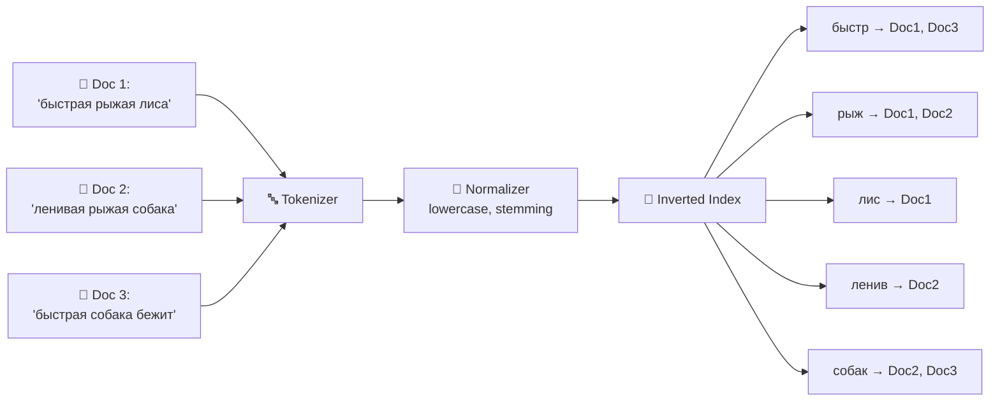
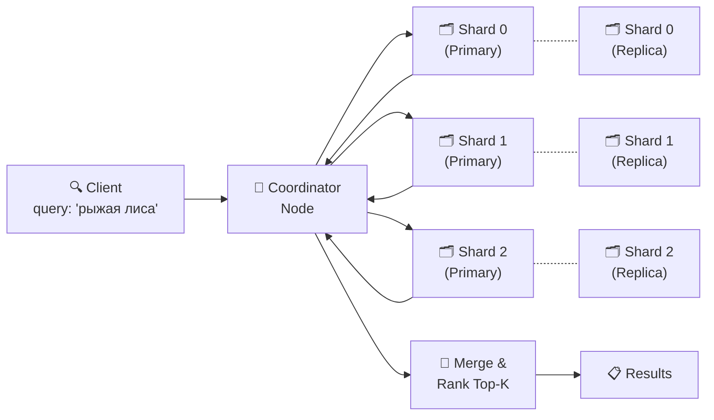
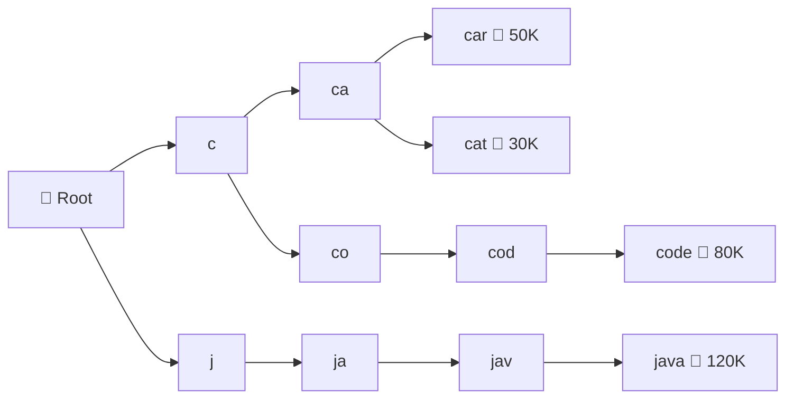
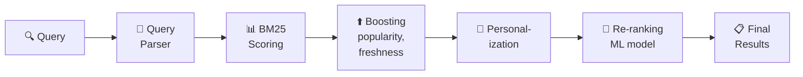
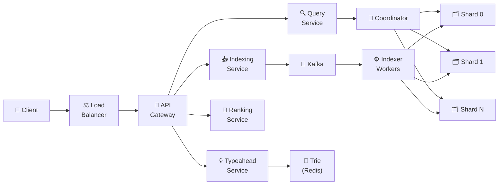

# 🔥 Уровень 14: Проектируем поисковую систему

## 🎯 О чём этот кейс?

Поисковая система — это сердце любого крупного сервиса. Google обрабатывает 8.5 миллиардов запросов в день. Elasticsearch индексирует петабайты данных в тысячах компаний. Когда пользователь вводит запрос, он ожидает релевантные результаты за доли секунды. За этой моментальностью стоит целый конвейер: от разбора запроса до ранжирования миллионов документов.

Аналогия: представьте **алфавитный указатель в конце книги**. Вместо того чтобы перелистывать все 500 страниц в поисках слова «индекс», вы открываете указатель, находите «индекс — стр. 42, 78, 156» и сразу переходите. Inverted index работает точно так же: для каждого слова хранится список документов, где оно встречается. Без указателя поиск — это O(N) по всем страницам. С указателем — O(1) lookup + O(K) результатов.

## 📌 Шаг 1: Требования

### Functional Requirements (что система делает)

1. **Full-text search** — поиск по тексту документов с ранжированием релевантности
2. **Typeahead / Autocomplete** — подсказки при вводе запроса в реальном времени
3. **Faceted search** — фильтрация результатов по категориям (цена, бренд, рейтинг)
4. **Fuzzy matching** — толерантность к опечаткам («iphon» → «iphone»)
5. **Query parsing** — обработка сложных запросов (AND, OR, фразы в кавычках)

### Non-Functional Requirements (как система работает)

- **Низкая задержка** — результаты за < 200 мс (p99)
- **Масштаб** — миллиарды документов, тысячи запросов в секунду
- **Высокая доступность** — 99.99% uptime, поиск не должен «падать»
- **Near real-time indexing** — новый документ появляется в поиске за 1-5 секунд
- **Consistency** — удалённый документ не должен появляться в результатах

### Масштабные оценки (back-of-the-envelope)

```
Документов: 10 млрд
Средний размер документа: 5 KB текста
Общий объём текста: 10B × 5KB = 50 TB
Размер inverted index: ~20% от текста = 10 TB
Поисковых запросов в день: 1 млрд
QPS: 1B / 86400 ≈ 12 000 RPS (пик × 3 = 36 000)
Typeahead QPS: × 5 (каждый символ = запрос) = 60 000 RPS
```

## 🔥 Шаг 2: Inverted Index — основа поиска

Inverted index переворачивает привычную структуру «документ → слова» в «слово → документы».



### Как строится inverted index

```typescript
interface PostingList {
  docId: string
  termFrequency: number   // Сколько раз term встречается в документе
  positions: number[]      // Позиции term в документе (для фразового поиска)
}

interface InvertedIndex {
  [term: string]: PostingList[]
}

// Построение индекса
function buildIndex(documents: Document[]): InvertedIndex {
  const index: InvertedIndex = {}

  for (const doc of documents) {
    // 1. Tokenization — разбить текст на слова
    const tokens = tokenize(doc.text)  // "быстрая рыжая лиса" → ["быстрая", "рыжая", "лиса"]

    // 2. Normalization — привести к нижнему регистру
    const normalized = tokens.map(t => t.toLowerCase())

    // 3. Stemming — привести к основе слова
    const stems = normalized.map(t => stem(t))  // "быстрая" → "быстр"

    // 4. Добавить в индекс
    for (let pos = 0; pos < stems.length; pos++) {
      const term = stems[pos]
      if (!index[term]) index[term] = []

      const existing = index[term].find(p => p.docId === doc.id)
      if (existing) {
        existing.termFrequency++
        existing.positions.push(pos)
      } else {
        index[term].push({ docId: doc.id, termFrequency: 1, positions: [pos] })
      }
    }
  }

  return index
}
```

### Tokenization и Stemming

**Tokenization** — разбиение текста на отдельные термы (слова):

```typescript
function tokenize(text: string): string[] {
  return text
    .toLowerCase()
    .replace(/[^\w\sа-яё]/gi, '')  // Убрать пунктуацию
    .split(/\s+/)                    // Разбить по пробелам
    .filter(t => t.length > 0)
    .filter(t => !STOP_WORDS.has(t)) // Убрать стоп-слова: "и", "в", "на", "the", "a"
}
```

**Stemming** — приведение слова к корню: «бегущий», «бежит», «бегала» → «бег». Это позволяет находить документы по любой форме слова.

💡 **Lemmatization** — более точный аналог stemming: учитывает морфологию языка. Stemming быстрее, lemmatization точнее.

## 🔥 Шаг 3: TF-IDF и BM25 — ранжирование результатов

Найти документы — полдела. Нужно показать **самые релевантные** первыми.

### TF-IDF (Term Frequency — Inverse Document Frequency)

```typescript
// TF — как часто term встречается в документе
// Чем чаще — тем релевантнее (но с насыщением)
function tf(termFreq: number, docLength: number): number {
  return termFreq / docLength
}

// IDF — насколько редкий term во всей коллекции
// Редкие слова важнее: "квантовый" ценнее, чем "большой"
function idf(docFreq: number, totalDocs: number): number {
  return Math.log(totalDocs / (1 + docFreq))
}

// TF-IDF = TF × IDF
function tfidf(termFreq: number, docLength: number, docFreq: number, totalDocs: number): number {
  return tf(termFreq, docLength) * idf(docFreq, totalDocs)
}
```

Аналогия: если слово «JavaScript» встречается в статье 10 раз (высокий TF), но оно есть в 80% всех документов (низкий IDF), его вес невелик — слишком общее. А если слово «монада» встречается 3 раза (средний TF) и лишь в 0.1% документов (высокий IDF) — это сильный сигнал релевантности.

### BM25 — улучшенный TF-IDF

BM25 (Best Matching 25) — стандарт ранжирования в Elasticsearch и Lucene. Основные улучшения:

```typescript
// BM25 score для одного term
function bm25Score(
  termFreq: number,     // Частота term в документе
  docLength: number,    // Длина документа (в словах)
  avgDocLength: number, // Средняя длина документов
  docFreq: number,      // В скольких документах встречается term
  totalDocs: number,    // Всего документов
  k1 = 1.2,            // Коэффициент насыщения TF
  b = 0.75             // Коэффициент нормализации длины
): number {
  const idfScore = Math.log((totalDocs - docFreq + 0.5) / (docFreq + 0.5) + 1)
  const tfNorm = (termFreq * (k1 + 1)) /
    (termFreq + k1 * (1 - b + b * (docLength / avgDocLength)))
  return idfScore * tfNorm
}
```

💡 **Ключевое отличие BM25**: TF имеет «насыщение» — после определённой частоты дальнейшие повторения слова почти не увеличивают score. Это логично: если слово встретилось 100 раз vs 200 раз, разница в релевантности минимальна.

## 📌 Шаг 4: Elasticsearch — распределённый поиск

Elasticsearch — самый популярный движок для full-text search. Внутри — Apache Lucene, сверху — распределённая обёртка.

### Shards и Replicas



**Shard** — горизонтальный раздел индекса. Документы распределяются по шардам (обычно по hash(doc_id) % num_shards). Каждый шард — самостоятельный Lucene index.

**Replica** — копия шарда для отказоустойчивости и распределения read-нагрузки. Запись идёт на primary, чтение — на любую реплику.

### Как работает распределённый поиск (Scatter-Gather)

```typescript
// Фаза 1: Query (scatter)
// Coordinator отправляет запрос на ВСЕ шарды
// Каждый шард возвращает top-K результатов (docId + score)

// Фаза 2: Fetch (gather)
// Coordinator мержит результаты со всех шардов
// Отбирает глобальный top-K
// Запрашивает полные документы только для финальных результатов

async function distributedSearch(query: string, topK: number) {
  // Scatter: параллельный запрос на все шарды
  const shardResults = await Promise.all(
    shards.map(shard => shard.search(query, topK))
  )

  // Gather: merge и финальное ранжирование
  const merged = shardResults
    .flat()
    .sort((a, b) => b.score - a.score)
    .slice(0, topK)

  // Fetch: получить полные документы
  const docs = await fetchDocuments(merged.map(r => r.docId))
  return docs
}
```

📌 **Важно**: каждый шард возвращает top-K, а не все результаты. При 1000 шардов и K=10 coordinator обрабатывает 10 000 кандидатов — это управляемо. Если бы шарды возвращали все совпадения (миллионы), coordinator захлебнулся бы.

## 📌 Шаг 5: Typeahead / Autocomplete

Когда пользователь вводит «как нау...», система мгновенно предлагает «как научиться программировать». Каждый символ — запрос к серверу.

### Trie (prefix tree) — структура для typeahead



```typescript
interface TrieNode {
  children: Map<string, TrieNode>
  suggestions: SearchSuggestion[]  // Top-K завершений для этого префикса
  isEndOfWord: boolean
}

interface SearchSuggestion {
  text: string
  score: number  // Популярность запроса (кол-во поисков)
}

class TypeaheadTrie {
  private root: TrieNode = { children: new Map(), suggestions: [], isEndOfWord: false }

  // Добавить запрос в trie
  insert(query: string, score: number) {
    let node = this.root
    for (const char of query.toLowerCase()) {
      if (!node.children.has(char)) {
        node.children.set(char, {
          children: new Map(),
          suggestions: [],
          isEndOfWord: false,
        })
      }
      node = node.children.get(char)!
      // Обновить top-K suggestions для каждого узла на пути
      this.updateSuggestions(node, query, score)
    }
    node.isEndOfWord = true
  }

  // Получить подсказки для префикса
  getSuggestions(prefix: string, limit = 5): SearchSuggestion[] {
    let node = this.root
    for (const char of prefix.toLowerCase()) {
      if (!node.children.has(char)) return []
      node = node.children.get(char)!
    }
    return node.suggestions.slice(0, limit)
  }

  private updateSuggestions(node: TrieNode, query: string, score: number) {
    const existing = node.suggestions.find(s => s.text === query)
    if (existing) {
      existing.score = score
    } else {
      node.suggestions.push({ text: query, score })
    }
    node.suggestions.sort((a, b) => b.score - a.score)
    node.suggestions = node.suggestions.slice(0, 10) // Хранить top-10
  }
}
```

💡 **Почему Trie, а не SQL LIKE?** Запрос `SELECT * FROM queries WHERE text LIKE 'как нау%'` требует full scan индекса. Trie даёт O(L) lookup (L — длина префикса), и suggestions уже предвычислены в каждом узле.

## 📌 Шаг 6: Fuzzy Matching и Query Parsing

### Fuzzy Matching — толерантность к опечаткам

```typescript
// Расстояние Левенштейна — минимальное число edit-операций
// "iphon" → "iphone" = 1 (вставка 'e')
// "javscript" → "javascript" = 1 (вставка 'a')
function levenshtein(a: string, b: string): number {
  const matrix: number[][] = []
  for (let i = 0; i <= a.length; i++) matrix[i] = [i]
  for (let j = 0; j <= b.length; j++) matrix[0][j] = j

  for (let i = 1; i <= a.length; i++) {
    for (let j = 1; j <= b.length; j++) {
      const cost = a[i - 1] === b[j - 1] ? 0 : 1
      matrix[i][j] = Math.min(
        matrix[i - 1][j] + 1,      // Удаление
        matrix[i][j - 1] + 1,      // Вставка
        matrix[i - 1][j - 1] + cost // Замена
      )
    }
  }
  return matrix[a.length][b.length]
}

// В Elasticsearch: fuzziness = "AUTO"
// Длина < 3: точное совпадение
// Длина 3-5: 1 edit allowed
// Длина > 5: 2 edits allowed
```

### Query Parsing — обработка сложных запросов

```typescript
// Пользовательский ввод → структурированный запрос
// "react hooks" tutorial -video → BoolQuery
interface BoolQuery {
  must: TermQuery[]     // Обязательные термы
  should: TermQuery[]   // Желательные термы (boost ranking)
  mustNot: TermQuery[]  // Исключить
  filter: FilterQuery[] // Фильтры (не влияют на score)
}

function parseQuery(input: string): BoolQuery {
  const query: BoolQuery = { must: [], should: [], mustNot: [], filter: [] }

  // Фразовый поиск: "react hooks" → must match exact phrase
  const phrases = input.match(/"([^"]+)"/g)
  phrases?.forEach(p => query.must.push({ type: 'phrase', value: p.replace(/"/g, '') }))

  // Исключение: -video → must_not
  const excluded = input.match(/-(\w+)/g)
  excluded?.forEach(e => query.mustNot.push({ type: 'term', value: e.slice(1) }))

  // Остальные слова → should (OR) или must (AND в зависимости от настроек)
  const remaining = input
    .replace(/"[^"]+"/g, '')
    .replace(/-\w+/g, '')
    .trim()
    .split(/\s+/)
    .filter(Boolean)
  remaining.forEach(t => query.should.push({ type: 'term', value: t }))

  return query
}
```

## 📌 Шаг 7: Faceted Search и Search Ranking

### Faceted Search — фильтрация по категориям

Faceted search — это когда рядом с результатами показываются фильтры: «Бренд: Apple (42), Samsung (38)», «Цена: до 1000 (15), 1000-5000 (28)».

```typescript
interface FacetResult {
  field: string
  buckets: Array<{
    value: string
    count: number
  }>
}

// В Elasticsearch — это aggregations
// POST /products/_search
// {
//   "query": { "match": { "name": "телефон" } },
//   "aggs": {
//     "brands": { "terms": { "field": "brand", "size": 10 } },
//     "price_ranges": {
//       "range": {
//         "field": "price",
//         "ranges": [
//           { "to": 10000 },
//           { "from": 10000, "to": 50000 },
//           { "from": 50000 }
//         ]
//       }
//     }
//   }
// }
```

### Search Ranking — финальный pipeline



```typescript
function calculateFinalScore(doc: Document, query: ParsedQuery, user: User): number {
  // 1. BM25 — текстовая релевантность (основа)
  let score = bm25(doc, query.terms)

  // 2. Popularity boost — популярные документы выше
  score *= 1 + Math.log(1 + doc.viewCount) * 0.1

  // 3. Freshness boost — свежие документы выше (для новостей)
  const ageHours = (Date.now() - doc.createdAt) / 3_600_000
  score *= Math.exp(-0.01 * ageHours)

  // 4. Personalization — на основе истории пользователя
  if (user.preferences.includes(doc.category)) {
    score *= 1.2
  }

  // 5. Quality signals — длина, структура, наличие изображений
  if (doc.hasImages) score *= 1.05
  if (doc.wordCount > 300) score *= 1.1

  return score
}
```

## 📌 Шаг 8: Полная архитектура поисковой системы



### Выбор технологий

| Компонент | Технология | Почему |
|-----------|------------|--------|
| **Search Engine** | Elasticsearch (Lucene) | Inverted index, BM25, distributed search из коробки |
| **Message Queue** | Kafka | Буферизация документов перед индексацией, exactly-once |
| **Typeahead** | Redis (sorted sets) + Trie in memory | Предвычисленные suggestions, < 10 мс latency |
| **Ranking** | ML-модель (LambdaMART, BERT) | Learning-to-rank для финального ранжирования |
| **Document Store** | S3 / HDFS | Хранение оригинальных документов (не в ES!) |
| **Cache** | Redis / Memcached | Кеширование популярных запросов и результатов |
| **Analytics** | ClickHouse / Druid | Анализ поисковых логов, CTR, метрики качества |

## ⚠️ Частые ошибки новичков

### Ошибка 1: Хранение оригинальных документов в Elasticsearch

```
❌ Плохо:
// Загрузить полные HTML-страницы (100KB+) в ES
// 10B документов × 100KB = 1 PB в Elasticsearch
// ES оптимизирован для поиска, а не для хранения больших blob-ов
// Backup, восстановление, миграция — кошмар
```

```
✅ Хорошо:
// В ES — только searchable fields + metadata
// { title, description, tags, category, url, created_at }
// Оригиналы — в S3/HDFS по ссылке
// Результат: индекс 10 TB вместо 1 PB
```

### Ошибка 2: Один гигантский шард вместо правильного шардирования

```
❌ Плохо:
// Один шард на 10B документов
// Lucene segment merge занимает часы
// Поиск по одному шарду = нет параллелизма
// Один сервер не вместит 10 TB индекса
```

```
✅ Хорошо:
// Правило: 1 шард = 10-50 GB
// 10 TB / 30 GB = ~300 шардов
// Поиск параллельно по 300 шардам
// Каждый шард + 1-2 реплики для отказоустойчивости
// Итого: 300 × 3 = 900 shard copies на кластере
```

### Ошибка 3: Typeahead напрямую из основного индекса

```
❌ Плохо:
// Каждый символ → полноценный search query в Elasticsearch
// "к" → search, "ка" → search, "как" → search
// 60 000 RPS typeahead × тяжёлый поиск = перегрузка кластера
```

```
✅ Хорошо:
// Отдельный typeahead service с Trie / Redis sorted sets
// Предвычисленные top-K suggestions для каждого префикса
// Latency < 10 мс, не нагружает основной search cluster
// Обновление suggestions — батчами (ежечасно из search logs)
```

### Ошибка 4: Игнорирование stemming и нормализации

```
❌ Плохо:
// Пользователь ищет "бегущие" — находит только документы со словом "бегущие"
// Документ с "бежит", "бегала", "бег" — не найден
// Поиск "iPhone" не находит "iphone" (регистр)
```

```
✅ Хорошо:
// Tokenization: "Быстрые бегущие лисы!" → ["быстрые", "бегущие", "лисы"]
// Normalization: lowercase → ["быстрые", "бегущие", "лисы"]
// Stemming: → ["быстр", "бег", "лис"]
// Теперь "бежит", "бегала", "бег" → всё приводится к "бег" → match!
```

## 🎯 Итоги

| Аспект | Решение |
|--------|---------|
| **Основная структура** | Inverted index: term → posting list (docId, TF, positions) |
| **Ранжирование** | BM25 (основа) + popularity boost + freshness + personalization |
| **Распределение** | Elasticsearch: shards (10-50 GB каждый) + replicas |
| **Typeahead** | Trie / Redis sorted sets, предвычисленные suggestions |
| **Fuzzy matching** | Edit distance (Levenshtein), fuzziness=AUTO в ES |
| **Faceted search** | ES aggregations по полям-фильтрам |
| **Индексация** | Kafka → Indexer Workers → Shards (near real-time) |
| **Хранение** | Searchable fields в ES, оригиналы в S3 |

💡 На интервью акцентируйте внимание на **inverted index** (почему он быстрее full scan), **BM25** (чем лучше простого TF-IDF), **scatter-gather** (как поиск распределяется по шардам) и **typeahead** (почему отдельный сервис, а не ES). Это четыре ключевых решения, которые показывают глубину понимания поисковых систем.
