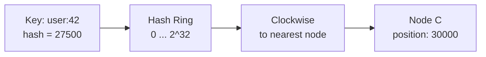
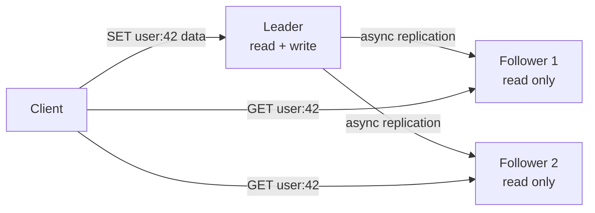
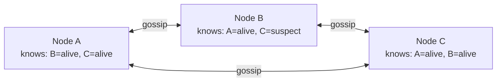
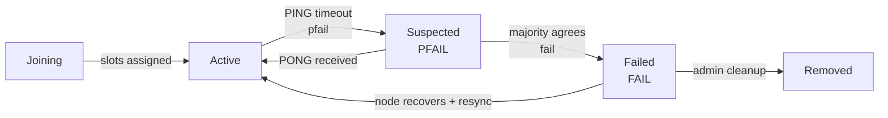

# Level 15: Designing a Distributed Cache -- Consistent Hashing, Replication, and Fault Tolerance

## Introduction

Imagine working in a library with a million books. Every time a reader needs a book, the librarian goes to storage, finds it, and brings it -- this takes 5-10 minutes. Now imagine the librarian has a desk with the 50 most frequently requested books. Most requests are fulfilled in seconds: just take from the desk and hand over. When a rare book is requested -- they go to storage and put it on the desk, removing the least popular one.

This is a cache. But what happens when one desk isn't enough? When there are millions of readers and thousands of needed books? Then we need **many desks in different rooms** -- and the main task becomes navigational: how to quickly figure out which room holds the needed book?

This is exactly what a distributed cache solves. Twitter stores timelines of 400 million users in Redis. GitHub uses Redis for sessions, caching, and queues. Instagram serves 1 billion users, caching photo feeds in Redis. When you need sub-millisecond latency on millions of operations per second -- you come to distributed in-memory caching.

In this level we'll cover not only **what** a distributed cache does, but **why** each architectural decision is made exactly this way, and not differently. This understanding -- is what distinguishes an engineer who "knows Redis" from an engineer who can **design** distributed systems.

---

## 1. Requirements

### Functional Requirements (what the system does)

Before designing, let's fix the boundaries. In an interview, this is a critically important step -- without clear requirements, you risk designing "something big and distributed" without answering the specific question.

1. **GET / SET / DELETE** -- basic CRUD operations with keys
2. **TTL (Time-To-Live)** -- automatic removal of expired keys
3. **Atomic operations** -- INCR, DECR, CAS (compare-and-swap)
4. **Data structures** -- strings, hashes, lists, sets, sorted sets
5. **Pub/Sub** -- notifications about changes

Why exactly these operations? Because a cache isn't just a "fast DB." Atomic operations are needed for counters and rate limiting. TTL is needed so the cache doesn't store stale data forever. Pub/Sub is needed for invalidation -- when data changes in the DB, all nodes need to be notified to delete the corresponding keys.

### Non-Functional Requirements (how the system works)

- **Low latency** -- < 1ms per operation (p99). This isn't just a number: this is what makes a cache a cache. If you have 10ms -- it's just a fast DB
- **High throughput** -- 100K+ RPS per node
- **Scalability** -- linear scaling when adding nodes
- **High availability** -- cache must not be a single point of failure
- **Partition tolerance** -- cluster continues working during network partitions

### Scale Estimates (back-of-the-envelope)

Before drawing architecture, you need to understand the scale. Different scales require different solutions.

```
Cached data: 100 TB (hot data of entire service)
Average value size: 1 KB
Number of keys: 100B keys
RAM per node: 64 GB useful → ~64M keys per node
Number of nodes: 100 TB / 64 GB ≈ 1,600 nodes
RPS per cluster: 1,600 × 100K = 160M RPS
Replication factor: 3 → 4,800 nodes total
```

The estimates show: 1,600 nodes is a serious cluster. Any error in the data distribution algorithm leads to catastrophe. If adding one node causes all keys to move -- 160M RPS will momentarily crash the DB.

---

## 2. Consistent Hashing -- How to Distribute Keys Across Nodes

### The Problem: Why the Naive Approach Doesn't Work

The main problem of a distributed cache: how to determine which of 1,600 nodes holds the key `user:42:profile`?

The first thing that comes to mind is simple modular hashing. Take the key hash, divide by the number of nodes, get the node number. Simple, fast, understandable. Why isn't this used?

```typescript
// ❌ Simple hashing -- looks reasonable but fails
function getNode(key: string, totalNodes: number): number {
  return hash(key) % totalNodes
}

// Situation: 4 nodes → add 5th
// hash("user:42") % 4 = 2  → data on node 2
// hash("user:42") % 5 = 3  → computation says: node 3
// But data isn't there! → Cache miss → query goes to DB

// Math is ruthless: when changing N from 4 to 5
// (N-1)/N = 80% of all keys move
// 80% of 64M keys per node = 51M keys migrate
// Simultaneously → DB gets an avalanche of requests (cache avalanche)
```

This situation is called **cache avalanche**: when most queries suddenly turn into cache misses, and the load that the cache used to absorb crashes the DB. With 1,600 nodes and 160M RPS, this means instant DB failure.

### Consistent Hashing -- A Mathematically Elegant Solution

Consistent hashing solves the problem with a **ring** abstraction. Imagine a clock face, where instead of 12 numbers -- a range from 0 to 2^32 (about 4 billion). Each node occupies one position on this ring. Each key is also mapped to the ring. The node for a key is the **first node clockwise** from the key's position.



```typescript
// ✅ Consistent Hashing -- basic implementation
class ConsistentHash {
  private ring: Map<number, string> = new Map()  // position → nodeId
  private sortedPositions: number[] = []

  addNode(nodeId: string) {
    const position = hash(nodeId)  // Hash node name for ring position
    this.ring.set(position, nodeId)
    this.sortedPositions.push(position)
    this.sortedPositions.sort((a, b) => a - b)  // Ring must be sorted
  }

  getNode(key: string): string {
    const keyHash = hash(key)
    // Binary search for first node clockwise
    for (const pos of this.sortedPositions) {
      if (pos >= keyHash) return this.ring.get(pos)!
    }
    // If key is "right" of all nodes -- wrap to beginning of ring
    return this.ring.get(this.sortedPositions[0])!
  }

  removeNode(nodeId: string) {
    const position = hash(nodeId)
    this.ring.delete(position)
    this.sortedPositions = this.sortedPositions.filter(p => p !== position)
    // Keys from removed node go to next clockwise node
    // Only ~1/N keys move -- everything else stays in place!
  }
}
```

Key property: when adding or removing a node, only `1/N` keys move (on average). With 1,600 nodes, that's about 0.06% of keys -- instead of 80% with the naive approach.

**Why does this work mathematically?** When a new node is added, it "intercepts" only a portion of the ring from its nearest clockwise neighbor. All other nodes keep their ring segments intact. Keys that were between the new node and its predecessor now belong to the new node -- the remaining 99.9% of keys are untouched.

### Virtual Nodes -- Solving the Unevenness Problem

With one point per node, a problem arises: uneven distribution. If nodes are randomly placed on the ring, one node may be responsible for 40% of the ring, while another gets 3%. These are called **hot nodes**: some are overloaded, others idle.

Solution -- **virtual nodes (vnodes)**: each physical node gets not one, but 150-200 positions on the ring. This is equivalent to each librarian managing several shelves in different parts of the storage -- collectively their load evens out.

```typescript
// ✅ Virtual Nodes: even load distribution
class ConsistentHashWithVnodes {
  private ring: Map<number, string> = new Map()
  private sortedPositions: number[] = []
  private vnodeCount = 150  // Standard value for production

  addNode(nodeId: string) {
    for (let i = 0; i < this.vnodeCount; i++) {
      // Each vnode has a unique key but points to the same physical node
      const virtualKey = `${nodeId}#${i}`
      const position = hash(virtualKey)
      this.ring.set(position, nodeId)
      this.sortedPositions.push(position)
    }
    this.sortedPositions.sort((a, b) => a - b)
  }

  // getNode -- same algorithm, result -- physical node
  // 150 virtual nodes give ±5% deviation from ideal distribution
  // 1000 virtual nodes -- ±1% deviation, but more memory for ring
}
```

**Statistical intuition**: the more virtual nodes, the better the distribution -- this is the Law of Large Numbers in action. 150 is a practically optimal balance between distribution accuracy and overhead of storing the ring in memory.

### Redis Cluster: A Different Approach -- Hash Slots

Redis Cluster doesn't use classic consistent hashing with virtual nodes. Instead, it uses a **fixed number of slots (16,384 hash slots)**.

```
// Computing slot for a key
HASH_SLOT = CRC16(key) mod 16384

// Slot distribution for 3 nodes:
// Node A: slots 0-5460   (third of the ring)
// Node B: slots 5461-10922
// Node C: slots 10923-16383
```

Why exactly 16,384? Redis chose this number as a balance: large enough for even distribution, small enough that the slot map fits in 2 KB (16,384 / 8 bytes) and can be transmitted via gossip protocol without significant overhead.

```redis
# Check which slot a key is in
CLUSTER KEYSLOT user:42

# Move slot during scaling
CLUSTER SETSLOT 5000 MIGRATING <destination-node-id>
```

**Advantage of hash slots over vnodes**: data migration when adding a node is extremely transparent. Instead of "recalculating the ring," you literally say: "Move slots 1000-2000 from Node A to the new Node D." This allows **rolling resharding** without stopping the cluster.

**Special feature -- hash tags**: if keys contain `{...}`, only the content inside curly braces is used for slot computation. `{user}:42:profile` and `{user}:42:settings` land in the same slot. This is critical for multi-key operations (MSET, MGET, transactions), which require all keys to be on the same node.

```redis
# Without hash tags -- may end up on different nodes → error
MSET user:1 "Alice" user:2 "Bob"

# With hash tags -- guaranteed in same slot → works
MSET {users}:1 "Alice" {users}:2 "Bob"
```

---

## 3. Replication -- Data Fault Tolerance

### Why Cache Without Replication Is Dangerous

Cache in RAM is fast but vulnerable. A node goes down, server restarts -- all data lost. If this was the only node with 64M keys, they all suddenly become cache misses. 64M requests go to the DB. This is **cache avalanche** from node loss.

Replication solves this: each shard (data segment) is stored on multiple nodes. When one node goes down, its data is available on replicas.

### Leader-Follower (Master-Replica) Replication

Standard topology for Redis: one leader accepts writes, followers synchronize and serve reads.



The key trade-off here is **synchronous vs asynchronous replication**:

**Asynchronous replication** (Redis default):
- Leader writes data and immediately returns response to client
- Followers receive data "in pursuit" -- after a few milliseconds
- ✅ Minimum write latency (1 RTT, only leader)
- ❌ If leader crashes before sending to followers -- data lost forever

**Synchronous replication**:
- Leader waits for confirmation from N followers before responding to client
- ✅ No data loss on failover
- ❌ Latency depends on the slowest follower (tail latency)

```typescript
// Redis WAIT command -- synchronous replication "on demand"
// Useful for critical operations (financial transactions, etc.)
await redis.wait(
  2,     // numreplicas: wait for confirmation from 2 replicas
  1000   // timeout: maximum 1000ms
)
// If 2 replicas confirmed -- data is safe
// If timeout -- data may only be on leader
```

**Practice:** most production Redis systems use asynchronous replication with `WAIT` only for the most critical operations. Losing a few seconds of cache data is usually acceptable (can always reread from DB). Losing data that hasn't been written to DB yet is unacceptable.

### Failover -- Automatic Switching When Leader Goes Down

When the leader stops responding, the cluster must automatically choose a new one. This process is called **failover**.

```
Failover steps in Redis Cluster:

1. Followers detect silence (PING timeout, usually 15 seconds)
2. Follower with minimal lag (highest replication offset)
   initiates election
3. Requests votes from other master nodes in the cluster
4. Gains majority of votes → becomes new leader
5. Accepts writes, notifies clients via gossip
6. Old leader (if recovered) becomes follower

⚠️ Danger of asynchronous replication during failover:
Old leader: SET counter 1000000  ← client got OK
Replication in flight...
Old leader crashed!
New leader became leader with counter = 999998  ← these 2 increments lost
```

This is the **replication lag window** -- the period between the last write on the leader and the last synchronization with followers. In production Redis, this lag is usually 1-10ms under normal network conditions.

---

## 4. Cluster Membership -- Gossip Protocol

### The Problem: Who Knows About Cluster State?

In a 1,600-node cluster, each node must know:
- Which other nodes exist?
- Which slots are assigned to whom?
- Who's currently alive, who's suspiciously silent, who's definitely dead?

Naive solution -- centralized coordinator (ZooKeeper, etcd). But this is a **single point of failure**. The coordinator dies -- the cluster goes blind.

Redis Cluster uses **gossip protocol** -- a decentralized algorithm for spreading information, inspired by how rumors spread in human society.

### Gossip Protocol -- "Word of Mouth" for Nodes

Analogy: in a large office, there's no general announcement that "Petrov is sick." But every employee talks to two or three colleagues every few minutes. Within 30 minutes, everyone in the office knows about Petrov -- without a single centralized announcement. This is exponential spread: 1 → 2 → 4 → 8 → 16... → everyone.



```typescript
// Every second, a node runs the gossip cycle:
// 1. Picks a random node from the cluster
// 2. Sends PING with info about itself and what it knows about others
// 3. Receives PONG with info from the other side
// 4. Merges info: takes the newer version by timestamp

interface GossipMessage {
  senderId: string
  senderSlots: number[]           // My hash slots
  clusterState: NodeInfo[]        // What I know about other nodes
  configEpoch: number             // Configuration version (for conflict resolution)
}

interface NodeInfo {
  nodeId: string
  address: string
  slots: number[]
  state: 'active' | 'suspected' | 'failed'
  lastPongReceived: number        // Timestamp of last PONG
  replicationOffset: number       // For choosing best failover candidate
}
```

**Why gossip, not broadcast?** With 1,600 nodes, broadcast (send to all) creates O(N^2) messages. Gossip creates O(N log N) -- significantly less for large clusters. The speed of information spread is O(log N) rounds, meaning with 1,600 nodes, about ~11 gossip rounds are enough for all information to spread across the cluster.

### Node Lifecycle: PFAIL vs FAIL

Redis Cluster has a two-stage failure detection system:



**PFAIL (Possible Failure)** -- "I think the node is dead." One node hasn't received a PONG within `cluster-node-timeout` (default 15 seconds). May be a false positive: node overloaded, network unstable.

**FAIL (Confirmed Failure)** -- "majority agree, node is dead." When a majority of master nodes mark one node as PFAIL, it transitions to FAIL. This signals the start of failover. The majority requirement prevents false positives on unstable networks.

**Why not FAIL immediately?** Network glitches are brief. If one node declares another dead and immediately initiates failover, and the network recovers in 2 seconds -- an unnecessary failover occurred. With a two-stage system, such "flapping" is ignored.

---

## 5. Persistence -- Saving Data to Disk

### Why a Cache Needs Persistence

It might seem that cache and persistence are mutually exclusive concepts. Cache is something you can lose (reread from DB). But there are situations where cache loss is painful:

- **Cold start after restart**: all keys lost → cache stampede on DB, which may not handle the load
- **Cache as primary storage**: sessions, rate limiting counters, queues -- data loss here is critical
- **Expensive computations**: if key = ML model query hash, and value = result, recomputation costs seconds

Redis offers two persistence mechanisms with different trade-offs.

### RDB Snapshots -- Point-in-Time Data Snapshot

RDB (Redis Database file) is a binary snapshot of the entire memory content at one point in time.

```
How BGSAVE (background save) works:

1. Redis calls fork() -- creates a child process
2. Child process writes all RAM to dump.rdb file
3. Parent process continues handling requests
4. Linux copy-on-write: physical memory pages aren't copied until first write
   → fork() is practically instant even on 64 GB RAM

Configuration in redis.conf:
save 3600 1      → snapshot if 1 change in 1 hour
save 300 100     → snapshot if 100 changes in 5 minutes
save 60 10000    → snapshot if 10000 changes in 1 minute
```

Compact binary format (compressed), fast loading on startup
Ideal for disaster recovery: one file, easy to copy to S3
Data loss between snapshots (usually 1 to 5 minutes of changes)
On very large datasets, fork() can cause pauses (Copy-on-Write overhead)

### AOF (Append-Only File) -- Operation Journal

AOF (Append-Only File) records every write command to a file in text format. On recovery, the file is "replayed."

```
AOF file content (human-readable format):
*3
$3
SET
$7
user:42
$4
John
*2
$4
INCR
$7
counter
```

Disk flush strategies (fsync) manage the balance between performance and reliability:

| Strategy | How It Works | Performance | Maximum Loss |
|-----------|-------------|-------------------|---------------------|
| `always` | fsync after every command | Slow (~3K RPS) | 0 commands |
| `everysec` | fsync once per second (background thread) | High (~50K RPS) | ~1 second |
| `no` | OS decides when to flush | Maximum | Several seconds |

`everysec` -- the gold standard for production. Losing at most 1 second of data is acceptable for most use cases, and performance is practically no different from non-persistent mode.

**AOF Rewrite (compaction)**: the file grows infinitely. `SET counter 1`, `INCR counter` × 1000 -- in AOF 1001 records, though one `SET counter 1001` is enough. The `BGREWRITEAOF` command compacts the file, replacing command history with current memory state.

**Best practice**: use both RDB and AOF together. AOF provides minimal data loss on failure. RDB provides fast disaster recovery (loading a snapshot is faster than replaying millions of AOF commands).

```redis-conf
# redis.conf -- both mechanisms together
save 3600 1
save 300 100
appendonly yes
appendfsync everysec
```

---

## 6. Memory Management and Eviction Policies

### When RAM Runss Out

RAM is finite. For a 64 GB RAM cache with 1 KB keys -- that's ~64 million keys. New data is constantly added. When memory is full, Redis must delete something -- this is called **eviction**.

Analogy with a desk: the desk is overflowing. What to remove? You could remove a folder you haven't touched in a while (LRU). You could remove the folder you access least often (LFU). You could remove a random folder. Each approach has scenarios where it's best.

### All Eviction Strategies

```typescript
// Configuration in redis.conf
// maxmemory-policy <policy>

type EvictionPolicy =
  // Don't delete anything -- return OOM error on insufficient memory
  // For cache -- bad, for Redis DB -- may be correct
  | 'noeviction'

  // LRU (Least Recently Used) among all keys
  // Delete those not accessed recently
  // ✅ Good for general-purpose cache
  | 'allkeys-lru'

  // LRU only among keys with TTL
  // Keys without TTL are untouched -- they're "permanent"
  | 'volatile-lru'

  // LFU (Least Frequently Used) among all keys
  // Delete those accessed least frequently
  // ✅ Better for skewed distributions (popular keys protected)
  | 'allkeys-lfu'

  // LFU only among keys with TTL
  | 'volatile-lfu'

  // Random deletion among all keys
  | 'allkeys-random'

  // Random deletion among keys with TTL
  | 'volatile-random'

  // Delete keys with lowest TTL (will expire soon anyway)
  | 'volatile-ttl'
```

### LRU vs LFU: The Practical Difference

```
Scenario: 10,000 keys in cache, each accessed 100 times in 30 days.
A nightly batch job runs a full scan: reads all 10,000 keys once.

LRU (Least Recently Used):
- After batch job: all 10,000 keys recently accessed
- Real traffic: accesses to 1,000 popular keys → cache miss!
- LRU evicted them because the batch job updated the timestamp of all 10,000 keys
- ❌ One-time batch job "washed" the entire cache

LFU (Least Frequently Used):
- After batch job: each key got +1 to frequency (from 100 to 101)
- Popular keys: 1,000 keys with frequency 100+ (regular accesses)
- Batch-only keys: 9,000 keys with frequency 1 (only batch accessed)
- LFU evicts batch-only keys, keeping popular ones
- ✅ Cache protected from batch scan
```

**Redis approximate LRU**: Redis doesn't store a timestamp for each key -- that's expensive in memory (8 bytes × 64M keys = 512 MB just for timestamps). Instead of exact LRU, Redis uses **sampling**: when eviction is needed, it takes 5 random keys (`maxmemory-samples 5`) and deletes the oldest one. This gives ~95% accuracy with minimal overhead.

```redis-conf
# Configure maxmemory and policy
maxmemory 60gb
maxmemory-policy allkeys-lfu

# Configure LFU (Least Frequently Used)
lfu-log-factor 10   # How quickly the counter grows (10 = standard)
lfu-decay-time 1    # Every 1 minute the counter decreases by 1
                    # Prevents "sticking" of rarely used old keys
```

**lfu-decay-time** is critical: without decay, a key that was popular 6 months ago but isn't needed now will occupy space forever. Decay ensures LFU reflects **current** popularity, not historical.

---

## 7. Client-Side Routing vs Proxy

### How the Client Reaches the Right Node

The client wants to execute `GET user:42`. In a 1,600-node cluster, the key is on exactly one node. How does the client know which one?


There are two fundamentally different approaches.

### Option 1: Client-Side Routing (Redis Cluster)

The client maintains an up-to-date slot map and **itself** computes which node to contact.

```typescript
// Smart client -- knows cluster topology
class RedisClusterClient {
  // Maintains map: slot_number → node_address
  private slotMap: Map<number, string> = new Map()

  async get(key: string): Promise<string | null> {
    const slot = crc16(key) % 16384
    const nodeAddr = this.slotMap.get(slot)!

    try {
      return await this.sendToNode(nodeAddr, 'GET', key)
    } catch (err) {
      if (err.type === 'MOVED') {
        // Slot migrated to another node (resharding)
        // MOVED 5649 192.168.1.5:6379
        this.slotMap.set(slot, err.newNodeAddr)  // Update map
        return this.sendToNode(err.newNodeAddr, 'GET', key)
      }
      if (err.type === 'ASK') {
        // Slot in process of migration (transient redirect)
        // ASK differs from MOVED: don't update map, redirect only once
        return this.sendToNode(err.newNodeAddr, 'GET', key)
      }
      throw err
    }
  }
}
// ✅ Minimum latency: 1 network hop in most cases
// ✅ No single point of failure (no proxy)
// ❌ Client complexity: must handle topology updates
```

### Option 2: Proxy-Based Routing (Twemproxy, Envoy)

A proxy sits between the client and the cluster. The client connects to the proxy, and the proxy routes to the correct node.

```
Client → Proxy → Node B (correct slot)
```

Simple client (no topology knowledge needed)
Single point of failure (proxy must be highly available)
Additional network hop (client → proxy → node)

**Redis Cluster uses client-side routing** -- this is why smart clients like `ioredis` with cluster support handle MOVED/ASK redirects automatically.

---

## Common Mistakes

### Mistake 1: Using Simple Hashing Instead of Consistent Hashing

```typescript
// ❌ Simple modulo hashing
const node = hash(key) % nodeCount
// When nodeCount changes, 80%+ of keys move → cache avalanche
```

Always use consistent hashing (or Redis Cluster's hash slots) for distributed caching.

### Mistake 2: No Virtual Nodes

With only one point per node on the ring, distribution is extremely uneven. Always use 150+ virtual nodes per physical node.

### Mistake 3: Ignoring Replication Lag

Assuming reads from followers are always current. In async replication, there's a 1-10ms window where data may differ. For critical reads, use `WAIT` or read from leader.

### Mistake 4: Cache Without Persistence

For caches that serve as primary storage (sessions, rate limits), losing all data on restart causes a cache stampede on the DB. Enable at least RDB snapshots.

### Mistake 5: Wrong Eviction Policy

Using `noeviction` for a cache -- when memory fills, writes fail. Use `allkeys-lru` or `allkeys-lfu` for cache scenarios.

---

## Summary

| Component | Key Decision |
|-----------|-------------|
| **Key distribution** | Consistent hashing with virtual nodes (or Redis Cluster hash slots) |
| **Replication** | Leader-Follower, async by default, sync with WAIT for critical ops |
| **Cluster membership** | Gossip protocol, PFAIL → FAIL two-stage detection |
| **Persistence** | RDB + AOF together: RDB for fast recovery, AOF for minimal data loss |
| **Eviction** | allkeys-lfu for skewed access patterns, allkeys-lru for streaming data |
| **Routing** | Client-side (Redis Cluster) for minimum latency, proxy for simplicity |

**Main principle:** a distributed cache trades complexity for speed. Every component -- consistent hashing, replication, gossip, persistence -- exists to maintain sub-millisecond latency while scaling to hundreds of nodes and terabytes of data. Design for failure: assume nodes will crash, networks will partition, and ensure the cache gracefully degrades rather than catastrophically fails.
