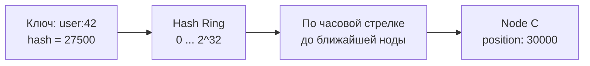
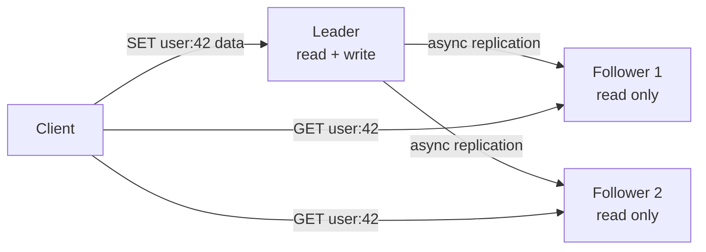
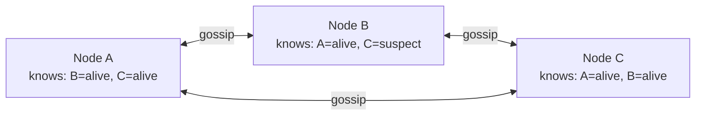
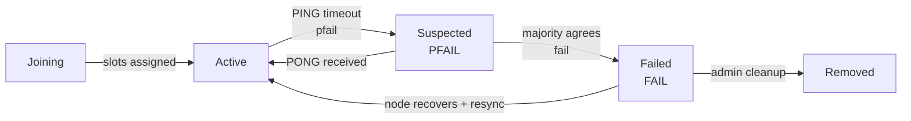
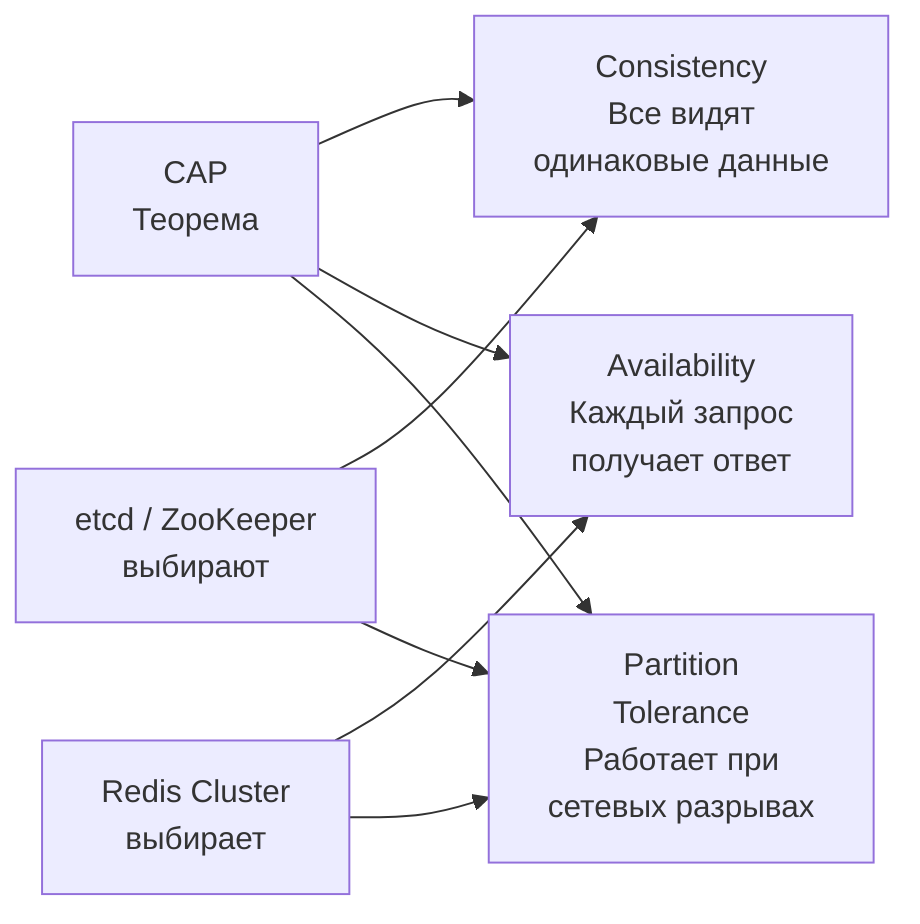
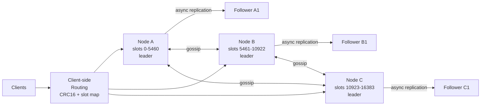
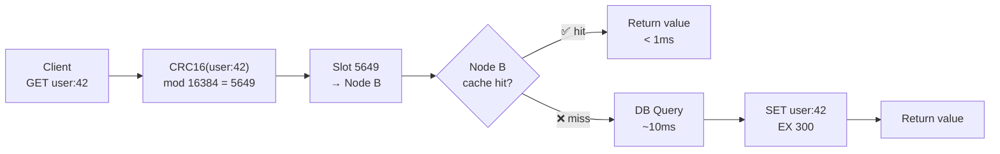

# Уровень 15: Проектируем распределённый кэш -- consistent hashing, репликация и отказоустойчивость

## Введение

Представьте, что вы работаете в библиотеке с миллионом книг. Каждый раз, когда читателю нужна книга, библиотекарь идёт в хранилище, находит её и приносит -- это занимает 5-10 минут. Теперь представьте, что у библиотекаря есть стол, на котором лежат 50 самых часто запрашиваемых книг. Большинство запросов выполняется за секунды: просто взял с стола и отдал. Когда приходит запрос на редкую книгу -- идут в хранилище и кладут её на стол, убирая наименее востребованную.

Это и есть кэш. Но что происходит, когда одного стола не хватает? Когда читателей миллионы, а нужных книг -- тысячи? Тогда нам нужно **много столов в разных кабинетах** -- и самая главная задача становится навигационной: как быстро понять, в каком кабинете лежит нужная книга?

Именно это решает распределённый кэш. Twitter хранит в Redis таймлайны 400 миллионов пользователей. GitHub использует Redis для сессий, кэширования и очередей. Instagram обслуживает 1 миллиард пользователей, кэшируя фотоленты в Redis. Когда вам нужна sub-millisecond задержка на миллионах операций в секунду -- вы приходите к распределённому in-memory кэшу.

В этом уровне мы разберём не только то, **что** делает распределённый кэш, но и **почему** каждое архитектурное решение принято именно так, а не иначе. Это понимание -- то, что отличает инженера, который «знает Redis», от инженера, который умеет **проектировать** распределённые системы.

---

## 1. Требования

### Functional Requirements (что система делает)

Перед тем как проектировать, зафиксируем границы. На интервью это критически важный шаг -- без чётких требований вы рискуете проектировать «что-то большое и распределённое», не отвечая на конкретный вопрос.

1. **GET / SET / DELETE** -- базовые CRUD-операции с ключами
2. **TTL (Time-To-Live)** -- автоматическое удаление просроченных ключей
3. **Atomic operations** -- INCR, DECR, CAS (compare-and-swap)
4. **Data structures** -- strings, hashes, lists, sets, sorted sets
5. **Pub/Sub** -- нотификации об изменениях

Почему именно эти операции? Потому что кэш -- это не просто «быстрая БД». Атомарные операции нужны для счётчиков и rate limiting. TTL нужен, чтобы кэш не хранил устаревшие данные вечно. Pub/Sub нужен для инвалидации -- когда данные изменились в БД, нужно уведомить все ноды об удалении соответствующих ключей.

### Non-Functional Requirements (как система работает)

- **Низкая задержка** -- < 1 мс на операцию (p99). Это не просто цифра: это то, что делает кэш кэшем. Если у вас 10 мс -- это просто быстрая БД
- **Высокая пропускная способность** -- 100K+ RPS на ноду
- **Масштабируемость** -- линейное масштабирование при добавлении нод
- **Высокая доступность** -- кэш не должен быть single point of failure
- **Partition tolerance** -- кластер продолжает работать при сетевых разделениях

### Масштабные оценки (back-of-the-envelope)

Прежде чем рисовать архитектуру, нужно понять масштаб. Разные масштабы требуют разных решений.

```
Данных в кэше: 100 TB (hot data всего сервиса)
Средний размер value: 1 KB
Количество ключей: 100B keys
RAM на ноду: 64 GB useful → ~64M ключей на ноду
Количество нод: 100 TB / 64 GB ≈ 1600 нод
RPS на кластер: 1600 × 100K = 160M RPS
Replication factor: 3 → 4800 нод total
```

📌 Оценки показывают: 1600 нод -- это серьёзный кластер. Любая ошибка в алгоритме распределения данных приведёт к катастрофе. Если при добавлении одной ноды все ключи перемещаются -- 160M RPS на мгновение обрушатся на БД.

---

## 2. Consistent Hashing -- как распределять ключи по нодам

### Проблема: почему наивный подход не работает

Главная проблема распределённого кэша: как определить, на какой из 1600 нод лежит ключ `user:42:profile`?

Первое, что приходит в голову -- простое модульное хеширование. Берём хеш ключа, делим на количество нод, получаем номер ноды. Просто, быстро, понятно. Почему же это не используется?

```typescript
// ❌ Простое хеширование -- выглядит разумно, но провальное
function getNode(key: string, totalNodes: number): number {
  return hash(key) % totalNodes
}

// Ситуация: 4 ноды → добавляем 5-ю
// hash("user:42") % 4 = 2  → данные на ноде 2
// hash("user:42") % 5 = 3  → вычисление говорит: нода 3
// Но данных там нет! → Cache miss → запрос идёт в БД

// Математика беспощадна: при изменении N с 4 до 5
// перемещается (N-1)/N = 80% всех ключей
// 80% из 64M ключей на ноду = 51M ключей мигрируют
// Одновременно → БД получает лавину запросов (cache avalanche)
```

Эта ситуация называется **cache avalanche** (лавина кэша): когда большинство запросов внезапно превращаются в cache miss, и нагрузка, которую раньше поглощал кэш, обрушивается на БД. С 1600 нодами и 160M RPS это означает мгновенный отказ БД.

### Consistent Hashing -- математически элегантное решение

Consistent hashing решает проблему с помощью абстракции **кольца**. Представьте циферблат часов, где вместо 12 чисел -- диапазон от 0 до 2^32 (около 4 миллиардов). Каждая нода занимает одну позицию на этом кольце. Каждый ключ тоже отображается на кольцо. Нода для ключа -- это **первая нода по часовой стрелке** от позиции ключа.



```typescript
// ✅ Consistent Hashing -- базовая реализация
class ConsistentHash {
  private ring: Map<number, string> = new Map()  // position → nodeId
  private sortedPositions: number[] = []

  addNode(nodeId: string) {
    const position = hash(nodeId)  // Хешируем имя ноды для позиции на кольце
    this.ring.set(position, nodeId)
    this.sortedPositions.push(position)
    this.sortedPositions.sort((a, b) => a - b)  // Кольцо должно быть отсортировано
  }

  getNode(key: string): string {
    const keyHash = hash(key)
    // Бинарный поиск первой ноды по часовой стрелке
    for (const pos of this.sortedPositions) {
      if (pos >= keyHash) return this.ring.get(pos)!
    }
    // Если ключ «правее» всех нод -- оборачиваемся в начало кольца
    return this.ring.get(this.sortedPositions[0])!
  }

  removeNode(nodeId: string) {
    const position = hash(nodeId)
    this.ring.delete(position)
    this.sortedPositions = this.sortedPositions.filter(p => p !== position)
    // Ключи удалённой ноды переходят к следующей по часовой стрелке
    // Только ~1/N ключей перемещаются -- всё остальное остаётся на месте!
  }
}
```

Ключевое свойство: при добавлении или удалении ноды перемещается только `1/N` ключей (в среднем). При 1600 нодах это около 0.06% ключей -- вместо 80% при наивном подходе.

**Почему это работает математически?** Когда добавляется новая нода, она «перехватывает» только часть кольца у своей ближайшей соседки по часовой стрелке. Все остальные ноды сохраняют свои сегменты кольца нетронутыми. Ключи, которые были между новой нодой и её предшественником, теперь принадлежат новой ноде -- остальные 99.9% ключей не трогаются.

### Virtual Nodes -- решаем проблему неравномерности

С одной точкой на ноду возникает проблема: распределение неравномерное. Если ноды расположены на кольце случайно, одна нода может отвечать за 40% кольца, а другая -- за 3%. Это называется **горячими нодами** (hot nodes): одни перегружены, другие простаивают.

Решение -- **virtual nodes (vnodes)**: каждая физическая нода получает не одну, а 150-200 позиций на кольце. Это эквивалентно тому, что каждый библиотекарь ведёт несколько стеллажей в разных частях хранилища -- суммарно их нагрузка выравнивается.

```typescript
// ✅ Virtual Nodes: равномерное распределение нагрузки
class ConsistentHashWithVnodes {
  private ring: Map<number, string> = new Map()
  private sortedPositions: number[] = []
  private vnodeCount = 150  // Стандартное значение для production

  addNode(nodeId: string) {
    for (let i = 0; i < this.vnodeCount; i++) {
      // Каждый vnode имеет уникальный ключ, но указывает на ту же физическую ноду
      const virtualKey = `${nodeId}#${i}`
      const position = hash(virtualKey)
      this.ring.set(position, nodeId)
      this.sortedPositions.push(position)
    }
    this.sortedPositions.sort((a, b) => a - b)
  }

  // getNode -- тот же алгоритм, результат -- физическая нода
  // 150 виртуальных нод дают отклонение ±5% от идеального распределения
  // 1000 виртуальных нод -- отклонение ±1%, но больше памяти на ring
}
```

💡 **Статистическая интуиция**: чем больше виртуальных нод, тем лучше распределение -- это Law of Large Numbers в действии. 150 -- практически оптимальный баланс между точностью распределения и накладными расходами на хранение ring в памяти.

### Redis Cluster: другой подход -- Hash Slots

Redis Cluster не использует классический consistent hashing с виртуальными нодами. Вместо этого используется **фиксированное число слотов (16384 hash slots)**.

```
// Вычисление слота для ключа
HASH_SLOT = CRC16(key) mod 16384

// Распределение слотов для 3 нод:
// Node A: slots 0-5460   (треть кольца)
// Node B: slots 5461-10922
// Node C: slots 10923-16383
```

Почему именно 16384? Redis выбрал это число как баланс: достаточно большое для равномерного распределения, достаточно маленькое, чтобы карта слотов умещалась в 2 KB (16384 / 8 байт) и передавалась по gossip протоколу без значительного overhead.

```redis
# Проверить, в каком слоте находится ключ
CLUSTER KEYSLOT user:42

# Переместить слот при масштабировании
CLUSTER SETSLOT 5000 MIGRATING <destination-node-id>
```

**Преимущество hash slots перед vnodes**: миграция данных при добавлении ноды предельно прозрачна. Вместо «пересчёта кольца» вы буквально говорите: «Перемести слоты 1000-2000 с Node A на новую Node D». Это позволяет делать **rolling resharding** без остановки кластера.

📌 **Специальная фича -- hash tags**: если ключи содержат `{...}`, для вычисления слота используется только содержимое фигурных скобок. `{user}:42:profile` и `{user}:42:settings` попадут в один слот. Это критично для multi-key операций (MSET, MGET, transactions), которые требуют, чтобы все ключи были на одной ноде.

```redis
# Без hash tags -- могут оказаться на разных нодах → ошибка
MSET user:1 "Alice" user:2 "Bob"

# С hash tags -- гарантированно в одном слоте → работает
MSET {users}:1 "Alice" {users}:2 "Bob"
```

---

## 3. Replication -- отказоустойчивость данных

### Почему кэш без репликации опасен

Кэш в RAM -- быстро, но уязвимо. Нода упала, сервер перезагрузился -- все данные потеряны. Если это была единственная нода с 64M ключами, все они внезапно становятся cache miss. 64M запросов идут в БД. Это **cache avalanche** от потери ноды.

Репликация решает эту проблему: каждый сhard (шард, или сегмент данных) хранится на нескольких нодах. При падении одной ноды её данные доступны на репликах.

### Leader-Follower (Master-Replica) Replication

Стандартная топология для Redis: один leader принимает записи, followers синхронизируются и отдают чтения.



Ключевой trade-off здесь -- **синхронная vs асинхронная репликация**:

**Асинхронная репликация** (Redis по умолчанию):
- Leader записывает данные и немедленно возвращает ответ клиенту
- Followers получают данные «вдогонку» -- через несколько миллисекунд
- ✅ Минимальная latency на запись (1 RTT, только leader)
- ❌ Если leader упадёт до отправки на followers -- данные потеряны навсегда

**Синхронная репликация**:
- Leader ждёт подтверждения от N followers перед ответом клиенту
- ✅ Нет потери данных при failover
- ❌ Latency зависит от самого медленного follower (хвостовая задержка -- tail latency)

```typescript
// Redis WAIT command -- синхронная репликация "по требованию"
// Полезно для критических операций (финансовые транзакции, etc.)
await redis.wait(
  2,     // numreplicas: подождать подтверждения от 2 реплик
  1000   // timeout: максимум 1000 мс
)
// Если 2 реплики подтвердили -- данные в безопасности
// Если timeout -- данные могут быть только на leader
```

📌 **Практика**: большинство production Redis-систем используют асинхронную репликацию с `WAIT` только для самых критических операций. Потеря нескольких секунд данных кэша -- обычно допустимо (всегда можно перечитать из БД). Потеря данных, которые ещё не записаны в БД -- недопустимо.

### Failover -- автоматическое переключение при падении leader

Когда leader перестаёт отвечать, кластер должен автоматически выбрать нового. Этот процесс называется **failover**.

```
Шаги failover в Redis Cluster:

1. Followers обнаруживают тишину (PING timeout, обычно 15 секунд)
2. Follower, отставание которого минимально (наибольший replication offset),
   инициирует выборы
3. Запрашивает голоса у других master-нод кластера
4. Набирает большинство голосов → становится новым leader
5. Принимает writes, уведомляет клиентов через gossip
6. Старый leader (если восстановится) становится follower

⚠️ Опасность асинхронной репликации при failover:
Старый leader: SET counter 1000000  ← клиент получил OK
Репликация в полёте...
Старый leader упал!
Новый leader стал leader с counter = 999998  ← эти 2 инкремента потеряны
```

Это и есть **replication lag window** -- период между последней записью на leader и последней синхронизацией с followers. В продакшн Redis этот лаг обычно составляет 1-10 мс при нормальной работе сети.

---

## 4. Cluster Membership -- Gossip Protocol

### Проблема: кто знает о состоянии кластера?

В кластере из 1600 нод каждая нода должна знать:
- Какие другие ноды существуют?
- Какие слоты за кем закреплены?
- Кто сейчас жив, кто подозрительно молчит, кто точно мёртв?

Наивное решение -- централизованный координатор (Zookeeper, etcd). Но это **single point of failure**. Умирает координатор -- кластер ослеп.

Redis Cluster использует **gossip protocol** -- децентрализованный алгоритм распространения информации, вдохновлённый тем, как слухи распространяются в человеческом обществе.

### Gossip Protocol -- «сарафанное радио» нод

Аналогия: в большом офисе нет общего объявления о том, что «Петров заболел». Но каждый сотрудник раз в несколько минут разговаривает с двумя-тремя коллегами. Через 30 минут все в офисе знают о Петрове -- без единого централизованного объявления. Это exponential spread: 1 → 2 → 4 → 8 → 16... → все.



```typescript
// Каждую секунду нода выполняет цикл gossip:
// 1. Выбирает случайную ноду из кластера
// 2. Отправляет PING с информацией о себе и о том, что знает о других
// 3. Получает PONG с информацией от другой стороны
// 4. Мерджит информацию: берёт более новую версию по timestamp

interface GossipMessage {
  senderId: string
  senderSlots: number[]           // Мои hash slots
  clusterState: NodeInfo[]        // Что я знаю о других нодах
  configEpoch: number             // Версия конфигурации (для разрешения конфликтов)
}

interface NodeInfo {
  nodeId: string
  address: string
  slots: number[]
  state: 'active' | 'suspected' | 'failed'
  lastPongReceived: number        // Timestamp последнего PONG
  replicationOffset: number       // Для выбора лучшего кандидата на failover
}
```

**Почему gossip, а не broadcast?** С 1600 нодами broadcast (отправить всем) создаёт O(N^2) сообщений. Gossip создаёт O(N log N) -- значительно меньше при большом кластере. При этом скорость распространения информации -- O(log N) раундов, то есть при 1600 нодах достаточно ~11 раундов gossip, чтобы вся информация распространилась по кластеру.

### Жизненный цикл ноды: PFAIL vs FAIL

Redis Cluster имеет двухступенчатую систему обнаружения отказов:



**PFAIL (Possible Failure)** -- «мне кажется, нода мертва». Одна нода не получила PONG в течение `cluster-node-timeout` (по умолчанию 15 секунд). Может быть ложным срабатыванием: нода перегружена, сеть нестабильна.

**FAIL (Confirmed Failure)** -- «большинство согласно, нода мертва». Когда большинство master-нод помечает одну ноду как PFAIL, она переходит в FAIL. Это сигнал для начала failover. Требование большинства предотвращает ложные срабатывания при нестабильной сети.

📌 **Почему не сразу FAIL?** Сетевые сбои бывают кратковременными. Если одна нода объявила другую мёртвой и сразу инициировала failover, а через 2 секунды сеть восстановилась -- произошёл ненужный failover. С двухступенчатой системой такие «мерцания» (flapping) игнорируются.

---

## 5. Persistence -- сохранение данных на диск

### Зачем кэшу персистентность?

Кажется, что кэш и персистентность -- взаимоисключающие понятия. Кэш -- это то, что можно потерять (перечитаем из БД). Но есть ситуации, когда потеря кэша болезненна:

- **Cold start после рестарта**: все ключи потеряны → cache stampede на БД, которая может не выдержать нагрузки
- **Кэш как основное хранилище**: сессии, rate limiting counters, очереди -- здесь потеря данных критична
- **Дорогие вычисления**: если key = хеш запроса к ML-модели, а value = результат, пересчёт стоит секунды

Redis предлагает два механизма персистентности с разными trade-offs.

### RDB Snapshots -- моментальный снимок данных

RDB (Redis Database file) -- это бинарный снимок всего содержимого памяти в один момент времени.

```
Как работает BGSAVE (background save):

1. Redis вызывает fork() -- создаётся дочерний процесс
2. Дочерний процесс записывает всю RAM в файл dump.rdb
3. Родительский процесс продолжает обрабатывать запросы
4. Linux copy-on-write: physical pages памяти не копируются до первой записи
   → fork() практически мгновенный даже на 64 GB RAM

Конфигурация в redis.conf:
save 3600 1      → snapshot если 1 изменение за 1 час
save 300 100     → snapshot если 100 изменений за 5 минут
save 60 10000    → snapshot если 10000 изменений за 1 минуту
```

✅ Компактный бинарный формат (сжатый), быстрая загрузка при старте
✅ Идеален для disaster recovery: один файл, легко копировать в S3
❌ Потеря данных между snapshots (обычно от 1 до 5 минут изменений)
❌ На очень больших наборах данных fork() может вызывать паузы (Copy-on-Write overhead)

### AOF (Append-Only File) -- журнал операций

AOF (Append-Only File) записывает каждую write-команду в файл в текстовом формате. При восстановлении файл «проигрывается» заново.

```
Содержимое AOF файла (человекочитаемый формат):
*3
$3
SET
$7
user:42
$4
John
*2
$4
INCR
$7
counter
```

Стратегии сброса на диск (fsync) управляют балансом между производительностью и надёжностью:

| Стратегия | Как работает | Производительность | Максимальная потеря |
|-----------|-------------|-------------------|---------------------|
| `always` | fsync после каждой команды | Медленно (~3K RPS) | 0 команд |
| `everysec` | fsync раз в секунду (фоновый поток) | Высокая (~50K RPS) | ~1 секунда |
| `no` | OS решает когда flush | Максимальная | Несколько секунд |

💡 `everysec` -- золотой стандарт для production. Потеря максимум 1 секунды данных приемлема для большинства use cases, а производительность практически не отличается от режима без персистентности.

**AOF Rewrite (компактификация)**: файл растёт бесконечно. `SET counter 1`, `INCR counter` × 1000 -- в AOF 1001 запись, хотя достаточно одной `SET counter 1001`. Команда `BGREWRITEAOF` компактифицирует файл, заменяя историю команд текущим состоянием памяти.

📌 **Лучшая практика**: использовать RDB и AOF одновременно. AOF обеспечивает минимальную потерю данных при сбое. RDB обеспечивает быстрый disaster recovery (загрузить снимок быстрее, чем проиграть миллионы AOF-команд).

```redis-conf
# redis.conf -- оба механизма вместе
save 3600 1
save 300 100
appendonly yes
appendfsync everysec
```

---

## 6. Memory Management и Eviction Policies

### Когда RAM заканчивается

RAM конечна. Для кэша на 64 GB RAM с ключами по 1 KB -- это ~64 миллиона ключей. Новые данные постоянно добавляются. Когда память заполнена, Redis должен что-то удалить -- это называется **eviction** (вытеснение).

Аналогия с рабочим столом: стол переполнен. Что убрать? Можно убрать папку, которую давно не трогали (LRU). Можно убрать папку, к которой обращались реже всего (LFU). Можно убрать случайную папку. У каждого подхода есть сценарии, где он лучший.

### Все стратегии eviction

```typescript
// Конфигурация в redis.conf
// maxmemory-policy <policy>

type EvictionPolicy =
  // Ничего не удалять -- возвращать ошибку OOM при нехватке памяти
  // Для кэша -- плохо, для БД на Redis -- может быть правильно
  | 'noeviction'

  // LRU (Least Recently Used) среди всех ключей
  // Удалять те, к которым давно не обращались
  // ✅ Хорошо для general-purpose кэша
  | 'allkeys-lru'

  // LRU только среди ключей с TTL
  // Ключи без TTL не трогаются -- они «вечные»
  | 'volatile-lru'

  // LFU (Least Frequently Used) среди всех ключей
  // Удалять те, к которым обращались реже всего
  // ✅ Лучше для скошенных распределений (популярные ключи защищены)
  | 'allkeys-lfu'

  // LFU только среди ключей с TTL
  | 'volatile-lfu'

  // Случайное удаление среди всех ключей
  | 'allkeys-random'

  // Случайное удаление среди ключей с TTL
  | 'volatile-random'

  // Удалять ключи с наименьшим TTL (скоро истекут всё равно)
  | 'volatile-ttl'
```

### LRU vs LFU: в чём разница на практике

```
Сценарий: 10 000 ключей в кэше, каждый использовался 100 раз за 30 дней.
Запускается ночной batch job, который делает full scan: читает все 10 000 ключей по одному разу.

LRU (Least Recently Used):
- After batch job: все 10 000 ключей недавно использованы
- Реальный трафик: обращения к 1 000 популярных ключей → cache miss!
- LRU вытеснил их, потому что batch job обновил timestamp всех 10 000 ключей
- ❌ Одноразовый batch job «вымыл» весь кэш

LFU (Least Frequently Used):
- After batch job: каждый ключ получил +1 к частоте (с 100 до 101)
- Популярные ключи: 1 000 ключей с частотой 100+ (регулярные обращения)
- Batch-only ключи: 9 000 ключей с частотой 1 (только batch обратился)
- LFU вытесняет batch-only ключи, сохраняя популярные
- ✅ Кэш защищён от batch scan
```

📌 **Redis approximate LRU**: Redis не хранит timestamp для каждого ключа -- это дорого по памяти (8 байт × 64M ключей = 512 MB только под timestamps). Вместо точного LRU Redis использует **sampling**: при необходимости eviction берёт 5 случайных ключей (`maxmemory-samples 5`) и удаляет наиболее старый из них. Это даёт ~95% точности при минимальном overhead.

```redis-conf
# Настройка maxmemory и политики
maxmemory 60gb
maxmemory-policy allkeys-lfu

# Настройка LFU (Least Frequently Used)
lfu-log-factor 10   # Насколько быстро растёт счётчик (10 = стандарт)
lfu-decay-time 1    # Раз в 1 минуту счётчик уменьшается на 1
                    # Предотвращает «зависание» редко используемых старых ключей
```

**lfu-decay-time** критичен: без затухания ключ, который был популярен 6 месяцев назад, но сейчас никому не нужен, будет вечно занимать место. Затухание гарантирует, что LFU отражает **текущую** популярность, а не историческую.

---

## 7. Client-Side Routing vs Proxy

### Как клиент попадает на нужную ноду

Клиент хочет выполнить `GET user:42`. В кластере из 1600 нод ключ находится ровно на одной. Как клиент это узнаёт?


Есть два принципиально разных подхода.

### Вариант 1: Client-side routing (Redis Cluster)

Клиент хранит актуальную карту слотов и **сам** вычисляет, на какую ноду обратиться.

```typescript
// Smart client -- знает топологию кластера
class RedisClusterClient {
  // Хранит карту: slot_number → node_address
  private slotMap: Map<number, string> = new Map()

  async get(key: string): Promise<string | null> {
    const slot = crc16(key) % 16384
    const nodeAddr = this.slotMap.get(slot)!

    try {
      return await this.sendToNode(nodeAddr, 'GET', key)
    } catch (err) {
      if (err.type === 'MOVED') {
        // Слот мигрировал на другую ноду (resharding)
        // MOVED 5649 192.168.1.5:6379
        this.slotMap.set(slot, err.newNodeAddr)  // Обновляем карту
        return this.sendToNode(err.newNodeAddr, 'GET', key)
      }
      if (err.type === 'ASK') {
        // Слот в процессе миграции (transient redirect)
        // ASK отличается от MOVED: карту не обновляем, только один раз перенаправляем
        return this.sendToNode(err.newNodeAddr, 'GET', key)
      }
      throw err
    }
  }
}
// ✅ Минимальная latency: 1 network hop в большинстве случаев
// ✅ Нет single point of failure (нет прокси)
// ❌ Клиент должен быть "умным": знать CRC16, хранить slot map, обрабатывать MOVED/ASK
```

**MOVED vs ASK** -- важное различие при живой миграции:
- **MOVED** = слот окончательно переехал. Обновить карту, запросить новую ноду.
- **ASK** = слот в процессе миграции, часть ключей уже перенесена. Этот конкретный ключ уже там. Карту не обновлять -- миграция ещё не завершена.

### Вариант 2: Proxy-based routing (Twemproxy, Envoy, Redis Proxy)

Между клиентом и кластером стоит прокси, который знает топологию и маршрутизирует запросы.

```
Client → Proxy → Correct Node

// ✅ Клиент прост: обычный Redis-протокол, не нужен smart client
// ✅ Легко добавить rate limiting, circuit breaking, логирование на прокси
// ❌ Дополнительный network hop → +0.3-1 мс к каждому запросу
// ❌ Прокси -- потенциальное узкое место и точка отказа (нужен HA-прокси)
```

**Сравнение подходов:**

| Критерий | Client-side routing | Proxy-based |
|----------|--------------------|-----------| 
| Latency | ✅ 1 hop (P99 ~0.5 мс) | ❌ 2 hops (P99 ~1 мс) |
| Сложность клиента | ❌ Smart client | ✅ Простой клиент |
| Cluster awareness | ❌ Клиент зависит от топологии | ✅ Прокси абстрагирует |
| Точка отказа | ✅ Нет | ❌ Прокси (нужен HA) |
| Observability | ❌ Сложнее (логи на клиентах) | ✅ Централизованные метрики |
| Throughput | ✅ Линейно масштабируется | ❌ Упирается в прокси |

📌 **Выбор**: для ultra-low latency (кэш для real-time биддинга, gaming) -- client-side routing. Для микросервисов с разнородными клиентами -- proxy. Redis Cluster официально поддерживает client-side routing; большинство production-клиентов (Jedis, ioredis, redis-py) реализуют его из коробки.

---

## 8. Split-Brain -- самая опасная проблема

### Что такое split-brain и почему это катастрофа

Split-brain (расщепление мозга) -- это ситуация, когда сетевой разрыв делит кластер на две или более изолированных части, каждая из которых считает себя «живым кластером» и продолжает принимать записи.

```
До разрыва:
Node A (leader) ← → Node B ← → Node C (follower) ← → Node D ← → Node E (follower)

Сетевой разрыв (network partition):
[Node A (leader)] [Node B] | [Node C] [Node D] [Node E]
      Partition 1           |      Partition 2

Partition 1: A думает, что C и E умерли. A продолжает быть leader.
             Клиенты в DC1 пишут в A: SET balance 1000

Partition 2: C, D, E не видят leader A → выбирают нового leader (C)
             Клиенты в DC2 пишут в C: SET balance 500

Сеть восстанавливается:
Два leader-а с разными данными для одного и того же ключа!
Чей ответ правильный? balance = 1000 или balance = 500?
```

Это **divergent state** -- разошедшееся состояние. В распределённых системах это эквивалентно банку, где две транзакции параллельно изменили один счёт в разных офисах.

### Защита от split-brain: кворум и MIN_REPLICAS_TO_WRITE

Redis Cluster использует **quorum-based** подход: кластер работает только если большинство мастер-нод доступны.

```typescript
// redis.conf -- конфигурация защиты от split-brain

// cluster-node-timeout: если нода не видит majority за это время --
// она прекращает обслуживать запросы
cluster-node-timeout 15000  // 15 секунд

// Минимальное количество реплик, которые должны быть доступны
// для принятия writes на master. Если меньше -- master отказывает в записи.
cluster-require-full-coverage no
min-replicas-to-write 1       // Хотя бы 1 реплика должна быть синхронизирована
min-replicas-max-lag 10       // Не более 10 секунд отставания репликации
```

**Математика кворума**: если кластер состоит из N мастер-нод, кворум = N/2 + 1 (округление вниз).

| Нод в кластере | Кворум | Выдерживает потерю |
|----------------|--------|-------------------|
| 3 | 2 | 1 ноды |
| 5 | 3 | 2 нод |
| 7 | 4 | 3 нод |
| 1600 | 801 | 799 нод |

Partition 1 из нашего примера (2 ноды из 5) **не имеет кворума** → не принимает writes → split-brain невозможен.

### CAP-теорема и выбор Redis

Redis Cluster выбирает **AP** (Availability + Partition tolerance) по CAP-теореме, жертвуя **C** (Consistency).



Это сознательный trade-off: при сетевом разрыве Redis предпочтёт **доступность** (продолжить обслуживать запросы, пусть и с возможной потерей данных) вместо **согласованности** (остановить работу до восстановления консистентности).

📌 **Когда это проблема**: если вы используете Redis как источник истины (не как кэш), а не просто для ускорения, -- split-brain может привести к потере данных. Для strong consistency используйте etcd, ZooKeeper, или Redis с RedisRaft (экспериментальный). Для кэша -- AP абсолютно правильный выбор: лучше вернуть слегка устаревшие данные, чем не вернуть вообще.

---

## 9. Полная архитектура Distributed Cache

### Взгляд сверху

После разбора каждого компонента -- соберём всё вместе.



### Поток запроса от начала до конца

Рассмотрим, что происходит при `GET user:42:profile`:



1. Клиент вычисляет CRC16 ключа, берёт mod 16384, получает слот 5649
2. Смотрит в локальную slot map: слот 5649 → Node B (адрес 192.168.1.5:6379)
3. Отправляет `GET user:42:profile` напрямую на Node B
4. Cache hit (> 90% случаев) → Node B возвращает значение за ~0.5 мс
5. Cache miss → клиентский код идёт в БД, кладёт результат в кэш с TTL

### Выбор технологий

| Компонент | Технология | Почему |
|-----------|------------|--------|
| **In-memory store** | Redis 7.x | Sub-ms latency, богатые структуры данных, active community |
| **Partitioning** | Hash slots (16384) | Простая living migration, нет перебалансировки ring |
| **Replication** | Async leader-follower | Баланс между latency и durability, WAIT для критических writes |
| **Membership** | Gossip protocol | Децентрализованный, нет SPOF, O(log N) convergence |
| **Persistence** | RDB + AOF (everysec) | Быстрый disaster recovery + минимальная потеря данных |
| **Client routing** | Smart client (ioredis, JedisCluster) | Минимальная latency, нет proxy overhead |
| **Monitoring** | Redis INFO + Prometheus/Grafana | keyspace_hits/misses, used_memory, replication_lag |

---

## 10. Частые ошибки новичков

### ❌ Ошибка 1: Кэш как единственный источник данных

```typescript
// ❌ Плохо: запись только в кэш
async function updateUser(id: string, data: UserData) {
  await redis.set(`user:${id}`, JSON.stringify(data), 'EX', 3600)
  // Нет записи в БД!
  // Результат: рестарт Redis → потеря всех данных навсегда
  // Даже с AOF: если maxmemory заполнена, ключ может быть вытеснен
}
```

```typescript
// ✅ Хорошо: cache-aside pattern, БД — source of truth
async function updateUser(id: string, data: UserData) {
  await database.save(id, data)       // 1. Source of truth всегда актуален
  await redis.del(`user:${id}`)      // 2. Инвалидируем кэш (не перезаписываем!)
  // Следующий GET создаст новую запись в кэше из свежих данных БД
}

async function getUser(id: string): Promise<UserData> {
  const cached = await redis.get(`user:${id}`)
  if (cached) return JSON.parse(cached)          // Cache hit

  const data = await database.find(id)           // Cache miss → БД
  await redis.set(`user:${id}`, JSON.stringify(data), 'EX', 3600)
  return data
}
```

💡 Почему `DEL` при обновлении, а не `SET`? Race condition: если два процесса одновременно обновляют пользователя, тот, кто запишет в кэш последним, перезапишет чужое значение. DEL + lazy repopulation (заново прочитать при следующем GET) безопаснее.

### ❌ Ошибка 2: Простое хеширование hash(key) % N

```typescript
// ❌ Плохо
function getNode(key: string, nodes: string[]): string {
  return nodes[hash(key) % nodes.length]
}
// Добавили 1 ноду: N с 4 до 5
// ~80% ключей перемещаются → cache avalanche → БД недоступна
```

```typescript
// ✅ Хорошо: consistent hashing или hash slots
// Используйте готовые библиотеки (ioredis поддерживает Redis Cluster из коробки)
const cluster = new Redis.Cluster([
  { host: '192.168.1.1', port: 6379 },
  { host: '192.168.1.2', port: 6379 },
  { host: '192.168.1.3', port: 6379 },
])
// При добавлении ноды перемещается только 1/N ключей
```

### ❌ Ошибка 3: Нет защиты от Cache Stampede (Thundering Herd)

Thundering herd -- «эффект стада»: много запросов одновременно получают cache miss и все идут в БД.

```typescript
// ❌ Плохо: 1000 одновременных запросов → 1000 запросов в БД
async function getUser(id: string) {
  const cached = await redis.get(`user:${id}`)
  if (!cached) {
    const user = await db.getUser(id)    // 1000 параллельных запросов!
    await redis.set(`user:${id}`, JSON.stringify(user), 'EX', 300)
    return user
  }
  return JSON.parse(cached)
}
```

```typescript
// ✅ Хорошо: distributed lock (singleflight pattern)
async function getUserWithLock(id: string) {
  const cached = await redis.get(`user:${id}`)
  if (cached) return JSON.parse(cached)

  // Попытка получить lock: SET ... NX (Only if Not eXists)
  const lockAcquired = await redis.set(
    `lock:user:${id}`, '1',
    'NX',    // Только если ключ не существует
    'EX', 5  // TTL 5 секунд (защита от deadlock если процесс умер)
  )

  if (lockAcquired) {
    try {
      const user = await db.getUser(id)         // Один запрос в БД
      await redis.set(`user:${id}`, JSON.stringify(user), 'EX', 300)
      return user
    } finally {
      await redis.del(`lock:user:${id}`)         // Освободить lock
    }
  } else {
    // Другой процесс уже запрашивает БД, подождём
    await sleep(50)
    return getUserWithLock(id)                   // Retry
  }
}
```

⚠️ Дополнительная защита -- **probabilistic early expiration**: не ждать истечения TTL, а обновлять кэш заблаговременно, пока ещё есть данные. При `TTL = 300` секунд начинать обновление при `TTL < 30` секунд с вероятностью, пропорциональной оставшемуся времени.

### ❌ Ошибка 4: Hot Key -- один ключ перегружает одну ноду

```typescript
// ❌ Плохо: viral post получает 100K RPS
// Hash slots: один ключ → один слот → одна нода → перегрузка
async function getPost(id: string) {
  return redis.get(`post:${id}`)  // Вся нагрузка на Node B
}
```

```typescript
// ✅ Хорошо: key sharding -- распределяем нагрузку по нескольким нодам
const HOT_KEY_SHARDS = 10

async function getPost(id: string) {
  // Каждый shard находится на разной ноде (разные hash slots)
  const shard = Math.floor(Math.random() * HOT_KEY_SHARDS)
  const key = `post:${id}:shard:${shard}`

  const cached = await redis.get(key)
  if (cached) return JSON.parse(cached)

  // При cache miss -- читаем из основного источника и заполняем shard
  const post = await db.getPost(id)
  await redis.set(key, JSON.stringify(post), 'EX', 300)
  return post
}
// При записи -- инвалидируем все shards
async function invalidatePost(id: string) {
  const keys = Array.from({length: HOT_KEY_SHARDS},
    (_, i) => `post:${id}:shard:${i}`)
  await redis.del(...keys)
}
```

💡 Альтернатива -- **local in-process cache** (L1 кэш): держать последние N популярных ключей прямо в памяти приложения. Redis → L2 кэш, локальная map → L1 кэш. L1 даёт субмикросекундную задержку и снимает нагрузку с Redis.

### ❌ Ошибка 5: Одинаковые TTL → Cache expiration spike

```typescript
// ❌ Плохо: все ключи истекают в одно время
for (const userId of users) {
  await redis.set(`user:${userId}`, data, 'EX', 3600)
  // Через ровно 3600 секунд -- 10M ключей истекают одновременно
  // Spike нагрузки на БД
}
```

```typescript
// ✅ Хорошо: jitter -- случайный разброс TTL
function getTTLWithJitter(baseTTL: number, jitterPercent: number = 0.1): number {
  const jitter = Math.random() * baseTTL * jitterPercent
  return Math.floor(baseTTL + jitter)  // От baseTTL до baseTTL + 10%
}

for (const userId of users) {
  await redis.set(
    `user:${userId}`, data,
    'EX', getTTLWithJitter(3600)  // Каждый ключ истекает в разное время
  )
}
```

---

## Итоги

| Аспект | Решение | Почему именно так |
|--------|---------|-------------------|
| **Partitioning** | Hash slots (16384) | Простая living migration, CRC16 mod 16384 |
| **Consistent hashing** | Virtual nodes (vnodes) или hash slots | Минимальное перемещение ключей при масштабировании |
| **Replication** | Async leader-follower (1+2) | Баланс latency/durability, WAIT для критических writes |
| **Membership** | Gossip protocol | Децентрализованный, O(log N) convergence, нет SPOF |
| **Failure detection** | PFAIL → FAIL по кворуму | Защита от ложных срабатываний при нестабильной сети |
| **Persistence** | RDB + AOF (everysec) | Быстрый recovery + минимальная потеря данных |
| **Eviction** | allkeys-lfu при maxmemory | Защита от batch scans, учёт частоты обращений |
| **Client routing** | Smart client (ioredis) | 1 network hop, нет proxy overhead |
| **Split-brain** | Кворум + cluster-node-timeout | AP по CAP, minority partition не принимает writes |
| **Hot keys** | Key sharding + local L1 cache | Распределение нагрузки по нодам |
| **Cache stampede** | Distributed lock (SET NX) | Один запрос в БД вместо тысячи |
| **TTL spike** | Jitter (±10% от base TTL) | Плавное истечение вместо одновременного |

💡 На интервью акцентируйте внимание на четырёх ключевых решениях, которые показывают глубину понимания:

1. **Consistent hashing / hash slots** -- почему не `hash % N`, что происходит при изменении числа нод, как минимизировать перемещение ключей
2. **Async vs sync replication** -- trade-off между latency и durability, когда использовать `WAIT`
3. **Gossip protocol** -- почему не централизованный координатор, как информация распространяется за O(log N) раундов
4. **Split-brain protection** -- кворум, MIN_REPLICAS_TO_WRITE, почему Redis выбирает AP по CAP

Эти четыре темы с их trade-offs и конкретными решениями -- основа ответа на любой вопрос про проектирование распределённого кэша.
