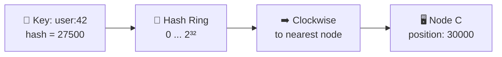
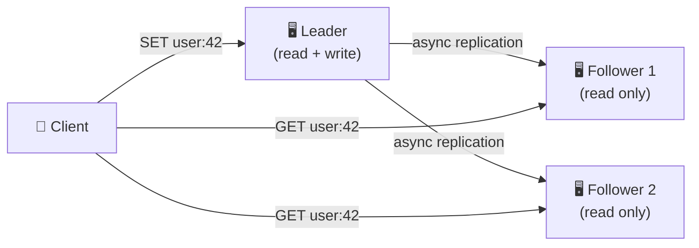
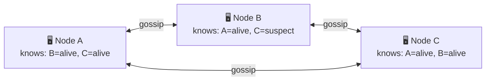
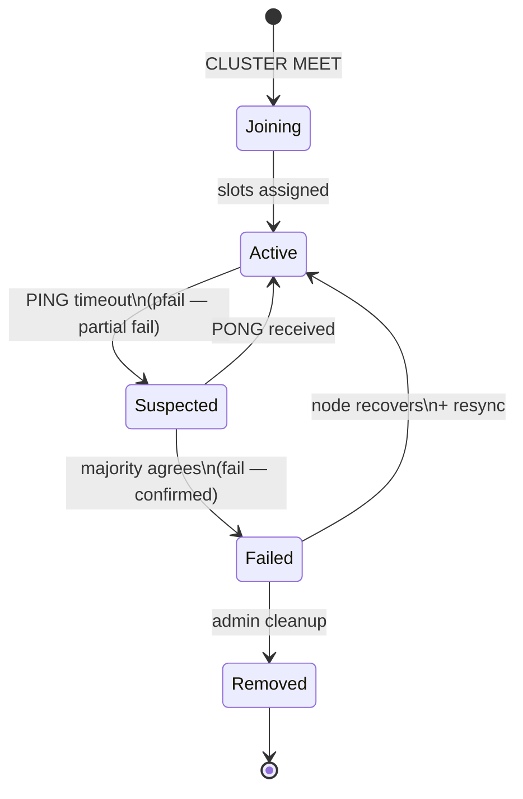
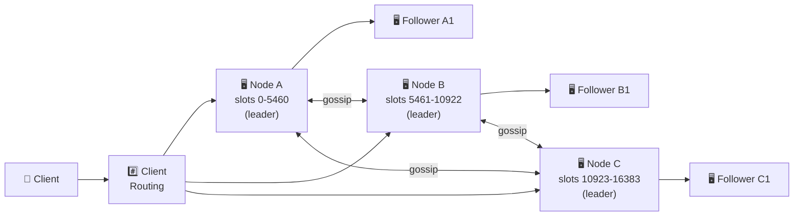

# 🔥 Level 15: Designing a Distributed Cache (Redis-like)

## 🎯 What is this case about?

A distributed cache is the foundation of performance for any large service. Redis processes **millions of operations per second** with sub-millisecond latency. Twitter stores timelines of 400M users in Redis. GitHub uses Redis for sessions, caching, and queues. When you need to speed up reads with microsecond latency — you come to an in-memory cache.

Analogy: imagine a **desk** vs **archive in the basement**. On the desk — the 10 most needed folders (cache, RAM), in the basement — thousands (DB, disk). When you need a folder, you first check the desk. If it's not there (cache miss) — go to the basement, grab it, and put it on the desk. When the desk overflows — remove the oldest/least needed folder (eviction). A distributed cache is like **many desks in different offices**, and you need to know which desk holds the folder you need.

## 📌 Step 1: Requirements

### Functional Requirements (what the system does)

1. **GET / SET / DELETE** — basic CRUD operations on keys
2. **TTL (Time-To-Live)** — automatic expiration of keys
3. **Atomic operations** — INCR, DECR, CAS (compare-and-swap)
4. **Data structures** — strings, hashes, lists, sets, sorted sets
5. **Pub/Sub** — notifications on changes

### Non-Functional Requirements (how the system works)

- **Low latency** — < 1 ms per operation (p99)
- **High throughput** — 100K+ RPS per node
- **Scalability** — linear scaling when adding nodes
- **High availability** — cache must not be a single point of failure
- **Partition tolerance** — cluster continues working during network splits

### Scale estimates (back-of-the-envelope)

```
Cached data: 100 TB (hot data of the entire service)
Average value size: 1 KB
Number of keys: 100B keys
RAM per node: 64 GB usable → ~64M keys per node
Number of nodes: 100 TB / 64 GB ≈ 1600 nodes
Cluster RPS: 1600 × 100K = 160M RPS
Replication factor: 3 → 4800 nodes total
```

## 🔥 Step 2: Consistent Hashing — how to distribute keys across nodes

The main problem: how to determine which of 1600 nodes holds the key `user:42:profile`?

### Naive approach: `node = hash(key) % N`

```typescript
// ❌ Simple hashing
function getNode(key: string, totalNodes: number): number {
  return hash(key) % totalNodes
}

// Problem: add 1 node (N=4 → N=5)
// hash("user:42") % 4 = 2  → node 2
// hash("user:42") % 5 = 3  → node 3  ← MISS! Data isn't there
// When N changes, almost ALL keys move → cache avalanche
```

### Consistent Hashing — minimum keys move

Imagine a **ring** with values from 0 to 2^32. Each node occupies a position on the ring. A key "moves clockwise" to the nearest node.



```typescript
// ✅ Consistent Hashing
class ConsistentHash {
  private ring: Map<number, string> = new Map()  // position → nodeId
  private sortedPositions: number[] = []

  addNode(nodeId: string) {
    const position = hash(nodeId)  // Node position on the ring
    this.ring.set(position, nodeId)
    this.sortedPositions.push(position)
    this.sortedPositions.sort((a, b) => a - b)
  }

  getNode(key: string): string {
    const keyHash = hash(key)
    // Find first node clockwise
    for (const pos of this.sortedPositions) {
      if (pos >= keyHash) return this.ring.get(pos)!
    }
    // Wrap around to the beginning of the ring
    return this.ring.get(this.sortedPositions[0])!
  }

  removeNode(nodeId: string) {
    const position = hash(nodeId)
    this.ring.delete(position)
    this.sortedPositions = this.sortedPositions.filter(p => p !== position)
    // Only keys BETWEEN the removed node and the previous one move!
  }
}
```

💡 **Key advantage**: when adding/removing a node, only `1/N` keys move (on average), not all of them.

### Virtual Nodes — solving uneven distribution

With one point per node, distribution is uneven: one node may be responsible for 60% of the ring, another — for 5%.

```typescript
// ✅ Virtual Nodes: each physical node = 150-200 virtual points
class ConsistentHashWithVnodes {
  private ring: Map<number, string> = new Map()
  private sortedPositions: number[] = []
  private vnodeCount = 150  // Virtual nodes per physical node

  addNode(nodeId: string) {
    for (let i = 0; i < this.vnodeCount; i++) {
      const virtualKey = `${nodeId}#${i}`
      const position = hash(virtualKey)
      this.ring.set(position, nodeId)  // All vnodes point to the physical node
      this.sortedPositions.push(position)
    }
    this.sortedPositions.sort((a, b) => a - b)
  }

  // getNode — same algorithm, but lands on a vnode
  // 150 points per node give ±5% deviation from ideal distribution
}
```

📌 **Redis Cluster** uses **16384 hash slots** instead of virtual nodes. Each slot is hard-assigned to a node. This is simpler for migration: we move specific slots, not rebuild the ring.

```
// Redis hash slot calculation
HASH_SLOT = CRC16(key) mod 16384

// Distribution for 3 nodes:
// Node A: slots 0-5460
// Node B: slots 5461-10922
// Node C: slots 10923-16383
```

## 🔥 Step 3: Replication — data fault tolerance

If a cache node goes down, all its data is lost. Replication solves this problem.

### Leader-Follower (Master-Replica) Replication



```typescript
// Async replication — leader doesn't wait for follower confirmation
// ✅ Fast write (1 ms, only leader)
// ⚠️ Risk of data loss: leader died before sending to follower

// Sync replication — leader waits for ACK from followers
// ✅ No data loss
// ❌ Slow write (depends on the slowest follower)

// Redis: async replication by default, WAIT command for sync
// WAIT numreplicas timeout
// Waits for N replicas to confirm receipt of all previous writes
```

### Failover — what to do when the leader goes down

```
1. Followers detect leader failure (heartbeat timeout)
2. Followers elect a new leader (Raft-like voting)
3. New leader accepts writes
4. Clients are redirected to the new leader

⚠️ Danger: async replication → new leader may not have
the last writes of the old leader → DATA LOSS
Redis: loss = writes from the last ~1 second (replication lag)
```

## 📌 Step 4: Cluster Membership — Gossip Protocol

How do nodes learn about each other? Who's alive, who's dead, which slots belong to whom?

### Gossip Protocol — node "grapevine"



Analogy: in an office there's no general chat, but every minute each employee approaches a random colleague and exchanges news. Within 5 minutes, everyone knows Petrov quit — without a single announcement.

```typescript
// Every second, a node:
// 1. Picks a random node from the cluster
// 2. Sends a PING with info about itself and other nodes
// 3. Receives a PONG with info from the other node
// 4. Updates its cluster map

interface GossipMessage {
  senderId: string
  senderSlots: number[]           // My hash slots
  clusterState: NodeInfo[]        // What I know about other nodes
}

interface NodeInfo {
  nodeId: string
  address: string
  slots: number[]
  state: 'active' | 'suspected' | 'failed'
  lastPongReceived: number        // Timestamp of last PONG
}
```

### Node lifecycle in the cluster



**PFAIL vs FAIL**: one node cannot declare another dead. PFAIL — "it seems dead to me". When most nodes agree with PFAIL, it becomes FAIL — confirmed failure.

## 📌 Step 5: Persistence — saving data to disk

Cache in RAM is fast, but everything is lost on restart. Redis offers two approaches.

### RDB Snapshots — a photograph of data

```
// Full dump of all data to file dump.rdb
// Run on schedule or manually (BGSAVE)

How it works:
1. Redis forks the process
2. Child process writes all RAM to file
3. Parent process continues handling requests
4. Copy-on-write: OS copies page only on write

✅ Compact binary format
✅ Fast recovery (load file into RAM)
❌ Data loss between snapshots (usually 1-5 minutes)
❌ fork() on 64 GB RAM can take seconds
```

### AOF (Append-Only File) — operation log

```
// Each write operation is appended to file
// SET user:42 "John"
// INCR counter
// DEL old_key

fsync strategies:
- always: fsync after every command (slow, 0 loss)
- everysec: fsync once per second (loss ≤ 1 sec, good balance)
- no: OS decides when to flush (fast, unpredictable loss)

✅ Minimal data loss (≤ 1 second with everysec)
✅ Human-readable format
❌ File grows infinitely → needs AOF rewrite (compaction)
❌ Slower recovery (replay all commands)
```

📌 **Best practice**: RDB + AOF together. AOF for minimal data loss, RDB for fast disaster recovery.

## 📌 Step 6: Memory Management and Eviction

RAM is finite. When the cache is full, something must be deleted.

```typescript
// Eviction strategies in Redis
type EvictionPolicy =
  | 'noeviction'      // Error when out of memory (bad for cache)
  | 'allkeys-lru'     // LRU among ALL keys (most popular)
  | 'volatile-lru'    // LRU only among keys with TTL
  | 'allkeys-lfu'     // LFU — least frequently used
  | 'volatile-lfu'    // LFU among keys with TTL
  | 'allkeys-random'  // Random deletion
  | 'volatile-random' // Random among keys with TTL
  | 'volatile-ttl'    // Delete keys with lowest TTL

// LRU vs LFU:
// LRU (Least Recently Used) — deletes least recently used
//   ⚠️ Problem: full one-time scan "heated" the cache, pushing out important keys
// LFU (Least Frequently Used) — deletes rarely used
//   ✅ Protection against one-time scans
//   ⚠️ Problem: old key with historically high frequency doesn't get evicted
```

💡 **Redis approximate LRU**: Redis doesn't store a timestamp for each key (expensive in memory). Instead — sampling: take 5 random keys, delete the least recently used among them. This is ~95% accuracy with minimal overhead.

## 📌 Step 7: Client-Side Routing vs Proxy

How does the client know which node to send the request to?


### Option 1: Client-side routing (Redis Cluster)

```typescript
// Client knows the slot map and sends request directly to the right node
class RedisClusterClient {
  private slotMap: Map<number, string> = new Map()  // slot → node address

  async get(key: string): Promise<string> {
    const slot = crc16(key) % 16384
    const nodeAddr = this.slotMap.get(slot)!
    const result = await this.sendToNode(nodeAddr, 'GET', key)

    // If node responded MOVED (slot migrated) — update the map
    if (result.type === 'MOVED') {
      this.slotMap.set(slot, result.newNodeAddr)
      return this.sendToNode(result.newNodeAddr, 'GET', key)
    }
    return result.value
  }
}
// ✅ Minimal latency (1 hop)
// ❌ Client must be "smart", know the cluster protocol
```

### Option 2: Proxy-based (Twemproxy, Envoy)

```
Client → Proxy → Correct Node
// ✅ Client is simple (standard Redis protocol)
// ❌ Additional hop → +0.5 ms latency
// ❌ Proxy — potential bottleneck
```

## 📌 Step 8: Split-Brain — the most dangerous problem

Split-brain: a network split divides the cluster into two parts, each thinking it is "the live cluster".

```
Network split:
[Node A (leader)] [Node B] | [Node C] [Node D] [Node E]
      Partition 1           |      Partition 2

Partition 1: A — leader, but sees only B
Partition 2: C, D, E don't see leader → elect a new one (C)

Two leaders! Clients write to both → DATA DIVERGENCE
```

### Split-brain protection

```typescript
// Redis Cluster: MIN_REPLICAS_TO_WRITE
// Leader refuses writes if it sees
// fewer than N replicas → minority partition doesn't accept writes

// cluster-node-timeout: 15000 (15 seconds)
// If a node doesn't see a majority within timeout → stops serving requests

// Rule: cluster works only if a majority of nodes are available
// 5 nodes: majority = 3 → tolerates 2 node failures
// 3 nodes: majority = 2 → tolerates 1 node failure
```

📌 **Important**: Redis chooses **AP** (Availability + Partition tolerance) per CAP theorem. During split-brain, data loss is possible. For strong consistency, use Redis with Raft (RedisRaft) or other solutions (etcd, ZooKeeper).

## 📌 Step 9: Full Distributed Cache Architecture



### Technology Choices

| Component | Technology | Why |
|-----------|------------|--------|
| **In-memory store** | Redis / Memcached | Sub-ms latency, rich data structures (Redis) |
| **Partitioning** | Hash slots (16384) | Simple slot migration between nodes |
| **Replication** | Async leader-follower | Balance between latency and durability |
| **Membership** | Gossip protocol | Decentralized, no SPOF |
| **Persistence** | RDB + AOF | Fast recovery + minimal data loss |
| **Client routing** | Smart client (JedisCluster) | Minimal latency (no proxy hop) |
| **Monitoring** | Redis INFO, Prometheus | Memory usage, hit rate, replication lag |

## ⚠️ Common beginner mistakes

### Mistake 1: Cache as the only data source

```
❌ Bad:
// Write data ONLY to cache
await redis.set("user:42", userData)
// No write to DB!
// Result: Redis restart → all data lost forever
```

```
✅ Good:
// Cache-aside pattern: DB — source of truth, cache — acceleration
await database.save(userData)         // 1. Write to DB
await redis.del("user:42")           // 2. Invalidate cache
// On read: cache miss → read from DB → write to cache
```

### Mistake 2: Simple hashing `hash(key) % N` instead of consistent hashing

```
❌ Bad:
// 4 nodes → added 5th
// hash("session:abc") % 4 = 2
// hash("session:abc") % 5 = 3  ← ALL sessions lost!
// ~80% of keys migrate → cache stampede → DB overloaded
```

```
✅ Good:
// Consistent hashing / hash slots
// Adding a node moves only 1/N keys
// Redis Cluster: specific slots migrate (CLUSTER SETSLOT)
```

### Mistake 3: No protection from thundering herd / cache stampede

```
❌ Bad:
// 1000 requests at once → cache miss → 1000 requests to DB
async function getUser(id: string) {
  const cached = await redis.get(`user:${id}`)
  if (!cached) {
    const user = await db.getUser(id)  // 1000 identical requests to DB!
    await redis.set(`user:${id}`, user, 'EX', 300)
    return user
  }
  return JSON.parse(cached)
}
```

```
✅ Good:
// Singleflight / lock-based protection
async function getUser(id: string) {
  const cached = await redis.get(`user:${id}`)
  if (!cached) {
    // Only one request goes to DB, others wait
    const lock = await redis.set(`lock:user:${id}`, '1', 'NX', 'EX', 5)
    if (lock) {
      const user = await db.getUser(id)
      await redis.set(`user:${id}`, user, 'EX', 300)
      await redis.del(`lock:user:${id}`)
      return user
    }
    // Wait and retry
    await sleep(50)
    return getUser(id)
  }
  return JSON.parse(cached)
}
```

### Mistake 4: Hot key — one key overloads one node

```
❌ Bad:
// Trending topic — 100K RPS on one key
// Hash slots: one key → one node → overload
await redis.get("trending:post:viral")  // All load on Node B
```

```
✅ Good:
// Replicate hot key across all nodes (local cache)
// Or add suffix: trending:post:viral:{random(1-10)}
// Read from random replica → load distributes
const shard = Math.floor(Math.random() * 10)
await redis.get(`trending:post:viral:${shard}`)
```

## 🎯 Summary

| Aspect | Solution |
|--------|---------|
| **Partitioning** | Consistent hashing with virtual nodes / 16384 hash slots |
| **Replication** | Async leader-follower (1 leader + 2 followers per shard) |
| **Membership** | Gossip protocol (PFAIL → FAIL by consensus) |
| **Persistence** | RDB snapshots + AOF (everysec) |
| **Eviction** | allkeys-lfu (or allkeys-lru) when maxmemory is reached |
| **Routing** | Client-side (smart client), MOVED/ASK redirects |
| **Split-brain** | MIN_REPLICAS_TO_WRITE + majority quorum |
| **Hot keys** | Local cache + key sharding (random suffix) |

💡 In interviews, emphasize **consistent hashing** (why not `hash % N`), **async vs sync replication** (latency/durability trade-off), **gossip protocol** (why not centralized coordinator), and **split-brain protection** (MIN_REPLICAS_TO_WRITE). These are the four key decisions that demonstrate depth of understanding of distributed caches.
