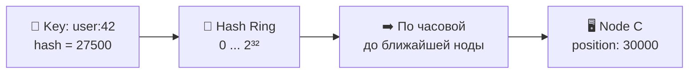
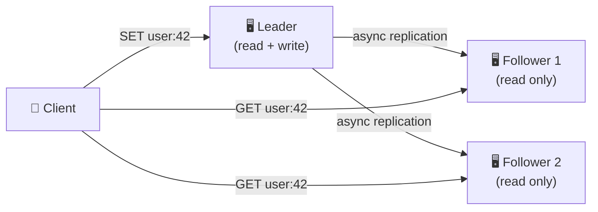
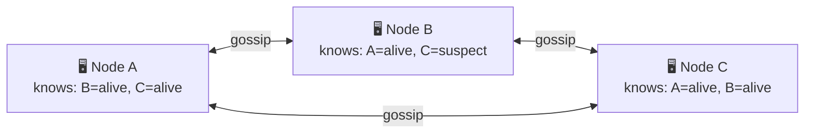
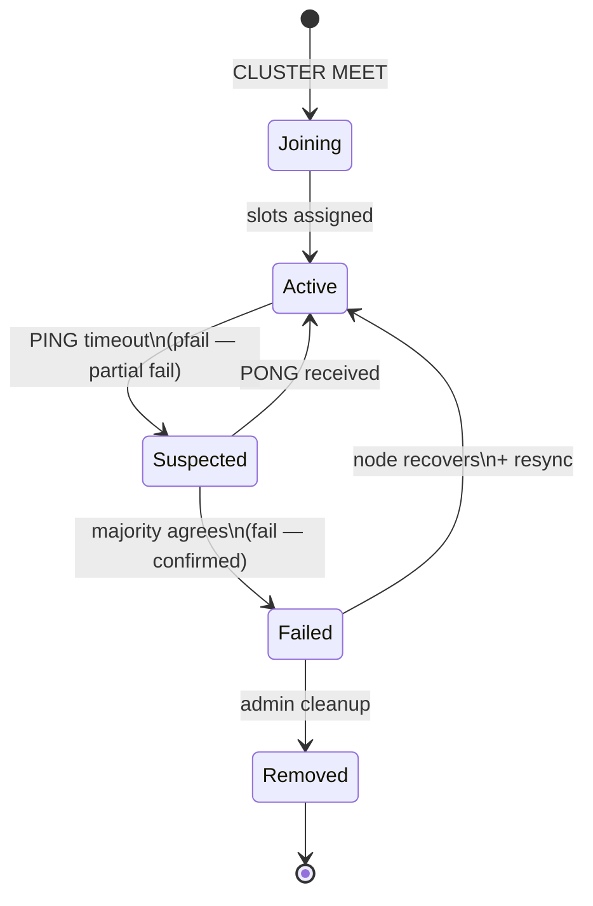
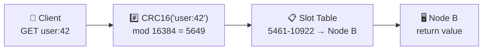
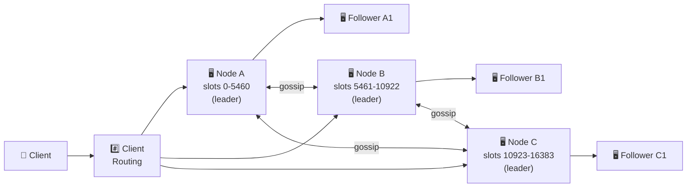

# 🔥 Уровень 15: Проектируем распределённый кэш (Redis-like)

## 🎯 О чём этот кейс?

Распределённый кэш — это основа производительности любого крупного сервиса. Redis обрабатывает **миллионы операций в секунду** с sub-millisecond latency. Twitter хранит в Redis таймлайны 400M пользователей. GitHub использует Redis для sessions, caching и очередей. Когда вам нужно ускорить чтение с микросекундной задержкой — вы приходите к in-memory кэшу.

Аналогия: представьте **рабочий стол** vs **архив в подвале**. На столе — 10 самых нужных папок (кэш, RAM), в подвале — тысячи (БД, диск). Когда папка нужна, вы сначала смотрите на стол. Если её нет (cache miss) — идёте в подвал, берёте и кладёте на стол. Когда стол переполнен — убираете самую старую/ненужную папку (eviction). Распределённый кэш — это **много столов в разных кабинетах**, и нужно знать, на каком столе лежит нужная папка.

## 📌 Шаг 1: Требования

### Functional Requirements (что система делает)

1. **GET / SET / DELETE** — базовые CRUD-операции с ключами
2. **TTL (Time-To-Live)** — автоматическое удаление просроченных ключей
3. **Atomic operations** — INCR, DECR, CAS (compare-and-swap)
4. **Data structures** — strings, hashes, lists, sets, sorted sets
5. **Pub/Sub** — нотификации об изменениях

### Non-Functional Requirements (как система работает)

- **Низкая задержка** — < 1 мс на операцию (p99)
- **Высокая пропускная способность** — 100K+ RPS на ноду
- **Масштабируемость** — линейное масштабирование при добавлении нод
- **Высокая доступность** — кэш не должен быть single point of failure
- **Partition tolerance** — кластер продолжает работать при сетевых разделениях

### Масштабные оценки (back-of-the-envelope)

```
Данных в кэше: 100 TB (hot data всего сервиса)
Средний размер value: 1 KB
Количество ключей: 100B keys
RAM на ноду: 64 GB useful → ~64M ключей на ноду
Количество нод: 100 TB / 64 GB ≈ 1600 нод
RPS на кластер: 1600 × 100K = 160M RPS
Replication factor: 3 → 4800 нод total
```

## 🔥 Шаг 2: Consistent Hashing — как распределять ключи по нодам

Главная проблема: как определить, на какой из 1600 нод лежит ключ `user:42:profile`?

### Наивный подход: `node = hash(key) % N`

```typescript
// ❌ Простое хеширование
function getNode(key: string, totalNodes: number): number {
  return hash(key) % totalNodes
}

// Проблема: добавляем 1 ноду (N=4 → N=5)
// hash("user:42") % 4 = 2  → нода 2
// hash("user:42") % 5 = 3  → нода 3  ← ПРОМАХ! Данных там нет
// При изменении N почти ВСЕ ключи перемещаются → cache avalanche
```

### Consistent Hashing — перемещается минимум ключей

Представьте **кольцо (ring)** со значениями от 0 до 2^32. Каждая нода занимает позицию на кольце. Ключ «идёт по часовой стрелке» до ближайшей ноды.



```typescript
// ✅ Consistent Hashing
class ConsistentHash {
  private ring: Map<number, string> = new Map()  // position → nodeId
  private sortedPositions: number[] = []

  addNode(nodeId: string) {
    const position = hash(nodeId)  // Позиция ноды на кольце
    this.ring.set(position, nodeId)
    this.sortedPositions.push(position)
    this.sortedPositions.sort((a, b) => a - b)
  }

  getNode(key: string): string {
    const keyHash = hash(key)
    // Найти первую ноду по часовой стрелке
    for (const pos of this.sortedPositions) {
      if (pos >= keyHash) return this.ring.get(pos)!
    }
    // Обернуться в начало кольца
    return this.ring.get(this.sortedPositions[0])!
  }

  removeNode(nodeId: string) {
    const position = hash(nodeId)
    this.ring.delete(position)
    this.sortedPositions = this.sortedPositions.filter(p => p !== position)
    // Только ключи МЕЖДУ удалённой нодой и предыдущей перемещаются!
  }
}
```

💡 **Ключевое преимущество**: при добавлении/удалении ноды перемещается только `1/N` ключей (в среднем), а не все.

### Virtual Nodes — решаем проблему неравномерности

С одной точкой на ноду распределение неравномерное: одна нода может отвечать за 60% кольца, другая — за 5%.

```typescript
// ✅ Virtual Nodes: каждая физическая нода = 150-200 виртуальных точек
class ConsistentHashWithVnodes {
  private ring: Map<number, string> = new Map()
  private sortedPositions: number[] = []
  private vnodeCount = 150  // Виртуальных нод на физическую

  addNode(nodeId: string) {
    for (let i = 0; i < this.vnodeCount; i++) {
      const virtualKey = `${nodeId}#${i}`
      const position = hash(virtualKey)
      this.ring.set(position, nodeId)  // Все vnodes указывают на физическую ноду
      this.sortedPositions.push(position)
    }
    this.sortedPositions.sort((a, b) => a - b)
  }

  // getNode — тот же алгоритм, но попадает в vnode
  // 150 точек на ноду дают отклонение ±5% от идеального распределения
}
```

📌 **Redis Cluster** использует **16384 hash slots** вместо virtual nodes. Каждый слот жёстко назначен ноде. Это проще для миграции: переносим конкретные слоты, а не перестраиваем ring.

```
// Redis hash slot calculation
HASH_SLOT = CRC16(key) mod 16384

// Распределение для 3 нод:
// Node A: slots 0-5460
// Node B: slots 5461-10922
// Node C: slots 10923-16383
```

## 🔥 Шаг 3: Replication — отказоустойчивость данных

Если нода с кэшем упала, все данные потеряны. Replication решает эту проблему.

### Leader-Follower (Master-Replica) Replication



```typescript
// Async replication — leader не ждёт подтверждения от followers
// ✅ Быстрый write (1 мс, только leader)
// ⚠️ Риск потери данных: leader упал до отправки на follower

// Sync replication — leader ждёт ACK от followers
// ✅ Нет потери данных
// ❌ Медленный write (зависит от самого медленного follower)

// Redis: async replication по умолчанию, WAIT команда для sync
// WAIT numreplicas timeout
// Ждёт, пока N реплик подтвердят получение всех предыдущих writes
```

### Failover — что делать когда leader упал

```
1. Followers detect leader failure (heartbeat timeout)
2. Followers elect new leader (Raft-like voting)
3. New leader принимает writes
4. Клиенты перенаправляются на нового leader

⚠️ Опасность: async replication → new leader может не иметь
последних writes старого leader → ПОТЕРЯ ДАННЫХ
Redis: потеря = writes за последние ~1 секунду (replication lag)
```

## 📌 Шаг 4: Cluster Membership — Gossip Protocol

Как ноды узнают друг о друге? Кто жив, кто мёртв, какие slots у кого?

### Gossip Protocol — «сарафанное радио» нод



Аналогия: в офисе нет общего чата, но каждый сотрудник раз в минуту подходит к случайному коллеге и обменивается новостями. Через 5 минут все знают, что Петров уволился — без единого объявления.

```typescript
// Каждую секунду нода:
// 1. Выбирает случайную ноду из кластера
// 2. Отправляет PING с информацией о себе и других нодах
// 3. Получает PONG с информацией от другой ноды
// 4. Обновляет свою карту кластера

interface GossipMessage {
  senderId: string
  senderSlots: number[]           // Мои hash slots
  clusterState: NodeInfo[]        // Что я знаю о других нодах
}

interface NodeInfo {
  nodeId: string
  address: string
  slots: number[]
  state: 'active' | 'suspected' | 'failed'
  lastPongReceived: number        // Timestamp последнего PONG
}
```

### Жизненный цикл ноды в кластере



**PFAIL vs FAIL**: одна нода не может объявить другую мёртвой. PFAIL — «мне кажется, она мёртва». Когда большинство нод согласны с PFAIL, она становится FAIL — подтверждённый отказ.

## 📌 Шаг 5: Persistence — сохранение данных на диск

Кэш в RAM — быстро, но при перезапуске всё потеряно. Redis предлагает два подхода.

### RDB Snapshots — фотография данных

```
// Полный дамп всех данных в файл dump.rdb
// Запускается по расписанию или вручную (BGSAVE)

Как работает:
1. Redis делает fork() процесса
2. Child process записывает всю RAM в файл
3. Parent process продолжает обрабатывать запросы
4. Copy-on-write: OS копирует page только при записи

✅ Компактный бинарный формат
✅ Быстрое восстановление (загрузить файл в RAM)
❌ Потеря данных между snapshots (обычно 1-5 минут)
❌ fork() на 64 GB RAM может занять секунды
```

### AOF (Append-Only File) — журнал операций

```
// Каждая write-операция дописывается в файл
// SET user:42 "John"
// INCR counter
// DEL old_key

Стратегии fsync:
- always: fsync после каждой команды (медленно, 0 потерь)
- everysec: fsync раз в секунду (потеря ≤ 1 сек, хороший баланс)
- no: OS решает когда flush (быстро, потеря непредсказуема)

✅ Минимальная потеря данных (≤ 1 секунда при everysec)
✅ Человекочитаемый формат
❌ Файл растёт бесконечно → нужен AOF rewrite (compaction)
❌ Медленнее восстановление (replay всех команд)
```

📌 **Лучшая практика**: RDB + AOF вместе. AOF для минимальной потери данных, RDB для быстрого disaster recovery.

## 📌 Шаг 6: Memory Management и Eviction

RAM конечна. Когда кэш заполнен, нужно решить, что удалить.

```typescript
// Стратегии eviction в Redis
type EvictionPolicy =
  | 'noeviction'      // Ошибка при нехватке памяти (для кэша — плохо)
  | 'allkeys-lru'     // LRU среди ВСЕХ ключей (самый популярный)
  | 'volatile-lru'    // LRU только среди ключей с TTL
  | 'allkeys-lfu'     // LFU — наименее часто используемые
  | 'volatile-lfu'    // LFU среди ключей с TTL
  | 'allkeys-random'  // Случайное удаление
  | 'volatile-random' // Случайное среди ключей с TTL
  | 'volatile-ttl'    // Удалить ключи с наименьшим TTL

// LRU vs LFU:
// LRU (Least Recently Used) — удаляет давно не использованные
//   ⚠️ Проблема: full scan одноразово «нагрел» кэш, выбив важные ключи
// LFU (Least Frequently Used) — удаляет редко используемые
//   ✅ Защита от one-time scans
//   ⚠️ Проблема: старый ключ с историческ высокой частотой не вытесняется
```

💡 **Redis approximate LRU**: Redis не хранит timestamp для каждого ключа (дорого по памяти). Вместо этого — sampling: берём 5 случайных ключей, удаляем наименее recently used из них. Это ~95% точности при минимальном overhead.

## 📌 Шаг 7: Client-Side Routing vs Proxy

Как клиент узнаёт, на какую ноду отправить запрос?



### Вариант 1: Client-side routing (Redis Cluster)

```typescript
// Клиент знает карту слотов и отправляет запрос напрямую на нужную ноду
class RedisClusterClient {
  private slotMap: Map<number, string> = new Map()  // slot → node address

  async get(key: string): Promise<string> {
    const slot = crc16(key) % 16384
    const nodeAddr = this.slotMap.get(slot)!
    const result = await this.sendToNode(nodeAddr, 'GET', key)

    // Если нода ответила MOVED (слот мигрировал) — обновить карту
    if (result.type === 'MOVED') {
      this.slotMap.set(slot, result.newNodeAddr)
      return this.sendToNode(result.newNodeAddr, 'GET', key)
    }
    return result.value
  }
}
// ✅ Минимальная latency (1 hop)
// ❌ Клиент должен быть «умным», знать протокол кластера
```

### Вариант 2: Proxy-based (Twemproxy, Envoy)

```
Client → Proxy → Correct Node
// ✅ Клиент простой (обычный Redis-протокол)
// ❌ Дополнительный hop → +0.5 мс latency
// ❌ Proxy — потенциальное узкое место
```

## 📌 Шаг 8: Split-Brain — самая опасная проблема

Split-brain: сетевой разрыв делит кластер на две части, каждая считает себя «живым кластером».

```
Сетевой разрыв:
[Node A (leader)] [Node B] | [Node C] [Node D] [Node E]
      Partition 1           |      Partition 2
      
Partition 1: A — leader, но видит только B
Partition 2: C, D, E не видят leader → выбирают нового (C)

Два leader-а! Клиенты пишут в оба → РАСХОЖДЕНИЕ ДАННЫХ
```

### Защита от split-brain

```typescript
// Redis Cluster: MIN_REPLICAS_TO_WRITE
// Leader отказывается принимать writes, если видит
// меньше N реплик → minority partition не принимает запись

// cluster-node-timeout: 15000 (15 секунд)
// Если нода не видит majority в течение timeout → перестаёт обслуживать запросы

// Правило: кластер работает, только если majority нод доступны
// 5 нод: majority = 3 → выдерживает падение 2 нод
// 3 ноды: majority = 2 → выдерживает падение 1 ноды
```

📌 **Важно**: Redis выбирает **AP** (Availability + Partition tolerance) по CAP-теореме. При split-brain возможна потеря данных. Для strong consistency используйте Redis с Raft (RedisRaft) или другие решения (etcd, ZooKeeper).

## 📌 Шаг 9: Полная архитектура Distributed Cache



### Выбор технологий

| Компонент | Технология | Почему |
|-----------|------------|--------|
| **In-memory store** | Redis / Memcached | Sub-ms latency, rich data structures (Redis) |
| **Partitioning** | Hash slots (16384) | Простая миграция слотов между нодами |
| **Replication** | Async leader-follower | Баланс между latency и durability |
| **Membership** | Gossip protocol | Децентрализованный, нет SPOF |
| **Persistence** | RDB + AOF | Быстрый recovery + минимальная потеря |
| **Client routing** | Smart client (JedisCluster) | Минимальная latency (no proxy hop) |
| **Monitoring** | Redis INFO, Prometheus | Memory usage, hit rate, replication lag |

## ⚠️ Частые ошибки новичков

### Ошибка 1: Кэш как единственный источник данных

```
❌ Плохо:
// Записать данные ТОЛЬКО в кэш
await redis.set("user:42", userData)
// Нет записи в БД!
// Результат: рестарт Redis → потеря всех данных навсегда
```

```
✅ Хорошо:
// Cache-aside pattern: БД — source of truth, кэш — ускорение
await database.save(userData)         // 1. Записать в БД
await redis.del("user:42")           // 2. Инвалидировать кэш
// При чтении: кэш miss → читаем из БД → пишем в кэш
```

### Ошибка 2: Простое хеширование `hash(key) % N` вместо consistent hashing

```
❌ Плохо:
// 4 ноды → добавили 5-ю
// hash("session:abc") % 4 = 2
// hash("session:abc") % 5 = 3  ← ВСЕ сессии потеряны!
// ~80% ключей мигрируют → cache stampede → БД перегружена
```

```
✅ Хорошо:
// Consistent hashing / hash slots
// При добавлении ноды перемещается только 1/N ключей
// Redis Cluster: мигрируются конкретные слоты (CLUSTER SETSLOT)
```

### Ошибка 3: Нет protection от thundering herd / cache stampede

```
❌ Плохо:
// 1000 запросов одновременно → cache miss → 1000 запросов в БД
async function getUser(id: string) {
  const cached = await redis.get(`user:${id}`)
  if (!cached) {
    const user = await db.getUser(id)  // 1000 одинаковых запросов в БД!
    await redis.set(`user:${id}`, user, 'EX', 300)
    return user
  }
  return JSON.parse(cached)
}
```

```
✅ Хорошо:
// Singleflight / lock-based protection
async function getUser(id: string) {
  const cached = await redis.get(`user:${id}`)
  if (!cached) {
    // Только один запрос идёт в БД, остальные ждут
    const lock = await redis.set(`lock:user:${id}`, '1', 'NX', 'EX', 5)
    if (lock) {
      const user = await db.getUser(id)
      await redis.set(`user:${id}`, user, 'EX', 300)
      await redis.del(`lock:user:${id}`)
      return user
    }
    // Подождать и retry
    await sleep(50)
    return getUser(id)
  }
  return JSON.parse(cached)
}
```

### Ошибка 4: Hot key — один ключ перегружает одну ноду

```
❌ Плохо:
// Trending topic — 100K RPS на один ключ
// Hash slots: один ключ → одна нода → перегрузка
await redis.get("trending:post:viral")  // Вся нагрузка на Node B
```

```
✅ Хорошо:
// Реплицировать hot key на все ноды (local cache)
// Или добавить суффикс: trending:post:viral:{random(1-10)}
// Читать из случайной реплики → нагрузка распределяется
const shard = Math.floor(Math.random() * 10)
await redis.get(`trending:post:viral:${shard}`)
```

## 🎯 Итоги

| Аспект | Решение |
|--------|---------|
| **Partitioning** | Consistent hashing с virtual nodes / 16384 hash slots |
| **Replication** | Async leader-follower (1 leader + 2 followers на shard) |
| **Membership** | Gossip protocol (PFAIL → FAIL по consensus) |
| **Persistence** | RDB snapshots + AOF (everysec) |
| **Eviction** | allkeys-lfu (или allkeys-lru) при достижении maxmemory |
| **Routing** | Client-side (smart client), MOVED/ASK redirects |
| **Split-brain** | MIN_REPLICAS_TO_WRITE + majority quorum |
| **Hot keys** | Local cache + key sharding (random suffix) |

💡 На интервью акцентируйте внимание на **consistent hashing** (почему не `hash % N`), **async vs sync replication** (trade-off latency/durability), **gossip protocol** (почему не centralized coordinator) и **split-brain protection** (MIN_REPLICAS_TO_WRITE). Это четыре ключевых решения, которые показывают глубину понимания распределённых кэшей.
